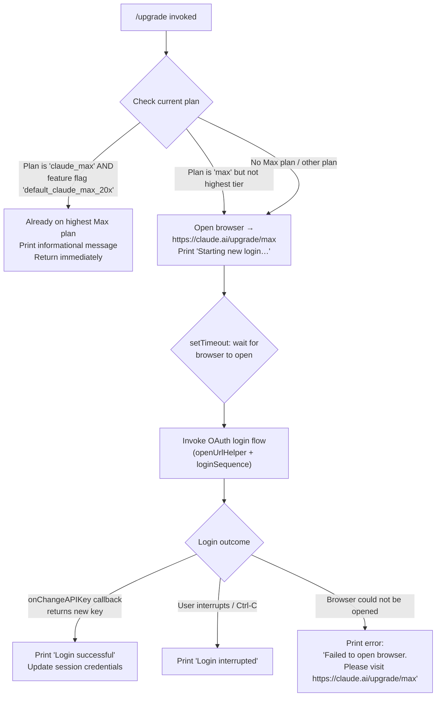

# `/upgrade`

> Analysis basis: CC v2.1.170 bundle.js (AST extraction + Claude interpretation)
> Minimum version: v2.1.170

---

## Overview

The `/upgrade` command guides the user through upgrading their Claude subscription to the Max tier, which offers higher rate limits and more access to the Opus model. When invoked, it checks the user's current subscription state, opens the upgrade URL in the system browser, and (if needed) initiates a fresh OAuth login flow to bind the new subscription to the active session. If the user is already on the highest Max plan, the command exits immediately with an informational message.

---

## Registration

| Field | Value |
|---|---|
| type | `local-jsx` |
| name | `upgrade` |
| description | `Upgrade to Max for higher rate limits and more Opus` |
| loc_byte | `12882823` |
| loc_byte_end | `12883070` |
| loc_line | `9139` |
| module_id | `s3A` |
| load_inline | `true` |
| arbor_handler.name | `vu6` |
| arbor_handler.fqn | `claude-2.1.170::vu6` |
| arbor_handler.kind | `AsyncFunction` |
| arbor_handler.resolution_path | `module_id` |
| arbor_handler.n_hits | `0` |

Analysis basis: CC v2.1.170 bundle.js:+12882823

---

## Input Branching

The command has 4+ distinct execution branches depending on the current subscription plan and the outcome of the OAuth login flow.



Analysis basis: CC v2.1.170 bundle.js:+12881868, +12881954, +12881979, +12882098, +12882184, +12882199, +12882349, +12882352, +12882385, +12882424, +12882520, +12882539, +12882543, +12882562, +12882595, +12882616

---

## Behavioral Spec

### 1. Entry Point — `upgradeCommandHandler` (`vu6`)

The Arbor-resolved handler `vu6` is an `AsyncFunction` reached via `module_id → s3A`.

```
async function upgradeCommandHandler(context):
    planInfo = checkCurrentPlan(context)           // calls NA → IY
    isMaxPlan = planInfo.plan === "max"
    isHighestTier = planInfo.featureFlag === "default_claude_max_20x"
                     AND planInfo.plan === "claude_max"

    if isHighestTier:
        display("You are already on the highest Max subscription plan. "
                "For additional usage, run /login to switch to an API "
                "usage-billed account.")
        return

    // Open upgrade URL in system browser
    openUrlInBrowser("https://claude.ai/upgrade/max")   // calls tK

    display("Starting new login following /upgrade. "
            "Exit with Ctrl-C to use existing account.")

    // Short delay to allow browser to launch before login prompt
    await sleep(/* setTimeout */ smallDelay)

    // Render JSX component for login interaction
    loginComponent = createElement(...)                 // calls a3A.createElement

    try:
        newKey = await waitForOAuthLogin(loginComponent, context.onChangeAPIKey)
        if newKey:
            writeToOutput("Login successful")
            updateSessionKey(newKey)                    // calls hH
        else:
            writeToOutput("Login interrupted")
    catch browserError:
        writeToOutput("Failed to open browser. "
                      "Please visit https://claude.ai/upgrade/max to upgrade.")
```

Analysis basis: CC v2.1.170 bundle.js:+12881868, +12882040, +12882184, +12882349, +12882385, +12882520, +12882539, +12882543, +12882562, +12882595, +12882616

---

### 2. Plan Detection — `checkCurrentPlan` (`NA` → `IY`)

```
function checkCurrentPlan(context):
    authProfile = resolveAuthProfile(context)      // calls IY → Aj
    plan = authProfile.plan                        // e.g. "max", "claude_max"
    featureFlags = authProfile.featureFlags        // e.g. "default_claude_max_20x"
    authType = detectAuthType(authProfile)         // calls sL → r_

    // Auth type enumeration used for routing:
    // "bedrock", "foundry", "anthropicAws", "mantle",
    // "vertex", "firstParty", "user_oauth", "profile-implicit"
    return { plan, featureFlags, authType }
```

Analysis basis: CC v2.1.170 bundle.js:+3261938, +3261959, +12881880, +12881954, +12881979, +2106005, +2106055, +2106111, +2106165, +2106213, +2106222, +3240341, +3240414

The literal `"max"` is compared at +12881954; the literal `"claude_max"` is used at +12882098; the feature-flag identifier `"default_claude_max_20x"` is tested at +12881979.

---

### 3. OAuth Profile Fetch — `fetchOAuthProfile` (`gDH`)

```
async function fetchOAuthProfile(token):
    url = buildOAuthEndpointUrl(token)             // calls o1 → sSA, TD4
    response = await httpPost(url, {
        headers: { "Content-Type": "application/json" },
        timeout: 10000                             // ms
    })
    // Emits telemetry:
    //   tengu_feature_ok  on success  (+1014205)
    //   tengu_feature_sad on failure  (+1014348)
    if response.ok:
        emitTelemetry("oauth_profile_fetch")       // literal at +2112970
        profileStore.set(response.data)            // calls $A.get
        initLogger(response)                       // calls N → zFH, EeK
    else:
        emitTelemetry("oauth_profile_token_failed") // literal at +2113037
        logError("error", response)
    return profile
```

Timeout constant: 10 000 ms (bundle.js:+2112954).

Analysis basis: CC v2.1.170 bundle.js:+2112810, +2112864, +2112911, +2112926, +2112954, +2112967, +2112970, +2113012, +2113037, +2113067, +2113073, +2113137, +2113152

---

### 4. Browser URL Opener — `openUrlHelper` (`tK`)

```
async function openUrlHelper(url):
    // Validate scheme — only "http:" or "https:" permitted
    if not (url.startsWith("http:") or url.startsWith("https:")):
        throw new Error(/* PO7 validation error */)

    platform = process.platform
    if platform === "darwin":
        spawn("open", [url])
    else if platform === "win32":
        spawn("rundll32", ["url,OpenURL", url])
    else:
        spawn("xdg-open", [url])                   // Linux / other POSIX

    // Delegates to HD for spawn, b8 for process lifecycle management
```

Analysis basis: CC v2.1.170 bundle.js:+6231795, +6231808, +6231867, +6231883, +6231916, +6231558, +6231580, +6231967, +6231979, +6232041, +6232048

---

### 5. Login Sequence — `loginSequence` (`b8` → `p_`)

```
async function loginSequence(options):
    // Spawns up to 10 concurrent credential fetch attempts
    // with a 1 000 000 ms overall timeout guard
    credentials = await credentialFetcher(options)  // calls eVH
    if credentials:
        shutdown = buildShutdownHandler()           // calls D → process.exit
        writeOutput(credentials, outputStream)      // calls N → zFH
        registerCleanup(credentials)               // calls hH, V8
    else:
        // Falls through to interrupted path
    return credentials
```

Concurrency limit: 10 (bundle.js:+1098734). Timeout guard: 1 000 000 ms (bundle.js:+1099256).

Analysis basis: CC v2.1.170 bundle.js:+1098789, +1098900, +1099256, +1099295, +1099432, +1099488, +1099614, +1099620, +1099655, +1099698

---

### 6. Session Key Update — `updateSessionCredentials` (`hH`)

```
function updateSessionCredentials(rawKey):
    validated = validateKeyFormat(rawKey)          // calls jA → String, Error
    if not validated:
        logError("invalid key format")
    else:
        credentialQueue.shift()                    // calls lN4 → di6.shift
        credentialQueue.push(validated)            // calls lN4 → di6.push
        pendingFlushQueue.push(validated)          // calls fQH.push
        // On failure: calls go.logError
```

Analysis basis: CC v2.1.170 bundle.js:+1019597, +1019610, +1019856, +1019939, +1019957, +1019997

---

### 7. Auth Type Resolution — `resolveAuthType` (`sL` → `r_`)

The provider exclusion list checked against the current auth configuration includes the following string constants (evaluated at depth ≤ 2):

| Provider string | loc_byte |
|---|---|
| `"bedrock"` | +2106005 |
| `"foundry"` | +2106055 |
| `"anthropicAws"` | +2106111 |
| `"mantle"` | +2106165 |
| `"vertex"` | +2106213 |
| `"firstParty"` | +2106222 |

When the active auth type is any of those values, the upgrade flow proceeds without the `user_oauth` credential branch. Analysis basis: CC v2.1.170 bundle.js:+2106286, +2105965.

---

### 8. Error Case — Missing API Credentials

If neither `ANTHROPIC_API_KEY`, `ANTHROPIC_AUTH_TOKEN`, `CLAUDE_CODE_OAUTH_TOKEN`, nor the WIF environment variables (`ANTHROPIC_FEDERATION_RULE_ID` + `ANTHROPIC_ORGANIZATION_ID`) are available, the auth resolution layer throws with the message:

> `"ANTHROPIC_API_KEY, ANTHROPIC_AUTH_TOKEN, CLAUDE_CODE_OAUTH_TOKEN, or WIF env vars (ANTHROPIC_FEDERATION_RULE_ID + ANTHROPIC_ORGANIZATION_ID) required"`

Analysis basis: CC v2.1.170 bundle.js:+3244069

---

## State & Side Effects

| Item | Detail |
|---|---|
| Telemetry — `tengu_feature_ok` | Emitted after a successful OAuth profile fetch (bundle.js:+1014205) |
| Telemetry — `tengu_feature_sad` | Emitted after a failed OAuth profile token exchange (bundle.js:+1014348) |
| Telemetry — `oauth_profile_fetch` | String event fired on successful profile HTTP response (bundle.js:+2112970) |
| Telemetry — `oauth_profile_token_failed` | String event fired when the profile HTTP request fails (bundle.js:+2113037) |
| Browser launch | Opens `https://claude.ai/upgrade/max` via platform-specific OS command (bundle.js:+12882352) |
| Credential queue mutation | Shifts old entry and pushes new validated key into the in-memory credential queue via `lN4` (bundle.js:+1019939) |
| Flush queue push | Appends validated key to `fQH` for async persistence (bundle.js:+1019957) |
| JSX component render | Creates a React-style element for the interactive login flow (bundle.js:+12882385) |
| setTimeout delay | Short artificial delay inserted before login to allow the browser window to open (bundle.js:+12882184) |
| Hook registration | `LTA.register` is called during logger/output setup (bundle.js:+62328) via `N9` |
| `go.logError` | Errors during credential update are routed to the global error logger (bundle.js:+1019997) |
| `process.exit` | `D` calls `process.exit` on forced shutdown during login sequence (bundle.js:+16563104) |
| `z.abort` | AbortController abort issued on forced shutdown (bundle.js:+16563125) |
| `CLAUDE_CODE_OAUTH_TOKEN_FILE_DESCRIPTOR` | Environment variable read during OAuth token resolution (bundle.js:+2128380) |
| `CLAUDE_CODE_API_KEY_FILE_DESCRIPTOR` | Environment variable read during API key file-descriptor resolution (bundle.js:+2128523) |

---

## Version History

| Version | Change |
|---|---|
| v2.1.170 | Initial analysis |

---

## Common Mistakes

1. **Running `/upgrade` when already on Max 20× tier** — The command detects the `"claude_max"` plan with the `"default_claude_max_20x"` feature flag and exits early with an informational message. No browser is opened. Use `/login` instead to switch to an API-billed account.
2. **No browser installed or `xdg-open` not on PATH (Linux)** — The URL opener will fail silently; the fallback error message directs the user to visit `https://claude.ai/upgrade/max` manually.
3. **Interrupting with Ctrl-C mid-flow** — The login sequence catches the interruption and prints `"Login interrupted"` rather than completing the credential update. The existing session credentials remain unchanged.
4. **Missing required environment variables** — If none of `ANTHROPIC_API_KEY`, `ANTHROPIC_AUTH_TOKEN`, `CLAUDE_CODE_OAUTH_TOKEN`, or the WIF pair are set, the auth resolution layer throws before the upgrade flow can begin.
5. **Non-HTTP/HTTPS URLs** — The browser opener validates the URL scheme; only `http:` and `https:` are accepted. Any other scheme raises an internal error via `PO7`.

---

## Appendix — Identifier Mapping

> For bundle debugging only. Identifiers change across versions.

| Identifier | Role |
|---|---|
| `vu6` | Main async handler for `/upgrade` command (Arbor-resolved, FQN: `claude-2.1.170::vu6`) |
| `NA` | Plan check dispatcher; bridges handler to auth profile resolution |
| `IY` | Auth profile resolver; orchestrates `Aj`, `sL`, `qO`, `FA`, `$P`, `biH` |
| `a7` | Argument/flag parser utility (handles `--`, `--bare` literals) |
| `_6` | Low-level string/value coercion helper |
| `Yg6` | Secondary argument parsing helper |
| `Aj` | Auth profile builder; assembles profile fields including `profile-implicit`, `user_oauth`, `claude-desktop-3p` |
| `$88` | Auth sub-component used inside profile builder |
| `biH` | Boolean flag coercion helper (checks `"yes"`, `"on"`) |
| `IB` | OAuth token file-descriptor reader (`CLAUDE_CODE_OAUTH_TOKEN_FILE_DESCRIPTOR`) |
| `mv` | Flag settings resolver (`"flagSettings"` key) |
| `RC` | Array inclusion checker (`Array.isArray` + `H.includes`) |
| `sL` | Auth type resolver entry point |
| `r_` | Auth type inner logic; checks provider strings against exclusion list |
| `$P` | Profile property accessor helper |
| `qO` | Credential/auth orchestrator; handles `ANTHROPIC_API_KEY` env lookup and error throwing |
| `WP6` | API key helper string handler (`"apiKeyHelper"`) |
| `hBH` | VS Code integration check (`"claude-vscode"` literal) |
| `ND6` | API key file-descriptor reader (`CLAUDE_CODE_API_KEY_FILE_DESCRIPTOR`) |
| `h6` | Timestamp/session-record builder; uses `Date.now`, `BSL`, `B7H` |
| `bC` | Array slice utility (slices last 20 items) |
| `TP6` | Profile transition helper; calls `biH` |
| `gDH` | OAuth profile HTTP fetcher; emits `oauth_profile_fetch` / `oauth_profile_token_failed` |
| `o1` | OAuth endpoint URL builder; validates against approved endpoints |
| `sSA` | OAuth URL component (base URL supplier) |
| `TD4` | OAuth URL path component builder |
| `SH` | Telemetry OK emitter wrapper (`tengu_feature_ok`) |
| `d` | Core telemetry dispatch function |
| `K6` | Telemetry channel router |
| `ff6` | Low-level telemetry sink |
| `s6` | Telemetry sad/failure emitter wrapper (`tengu_feature_sad`) |
| `Lz` | Logger/store initializer |
| `N` | Log writer orchestrator; calls `zFH`, `EeK`, `CH`, `u4`, `$h` |
| `PeK` | Log formatting helper; calls `CI`, `dZA`, `MTA` |
| `MTA` | Log level mapper; calls `GaK`, `TaK` |
| `H` | Global utilities object (includes `Math.random`, `setTimeout` at +13939352) |
| `CH` | JSON serializer wrapper (`JSON.stringify`) |
| `u4` | Log path/filename builder; redacts sensitive values (`[REDACTED]`) |
| `FZA` | Path component map helper |
| `q` | Data buffer object (1024-byte chunks) |
| `A` | Lowercase filename normalizer |
| `zFH` | Output stream write dispatcher; calls `yZA` |
| `yZA` | Low-level stream writer (`H.write`) |
| `EeK` | Log file manager; handles mkdir, appendFile, rotate, stat |
| `mBH` | Buffered writer with batching (`clearTimeout`, `setTimeout`, `setImmediate`) |
| `L4H` | Log line formatter; calls `PM6`, `E6H.join`, `H_`, `v6` |
| `n6` | Log entry constructor |
| `$M6` | EISDIR error handler (`V8`) |
| `cZA` | Log file path joiner |
| `La8` | Log file rotation handler (`.txt` suffix, 4-backup limit) |
| `TeK` | Log file append worker; calls mkdir, appendFile, rotate |
| `N9` | Hook registrar (`LTA.register`) |
| `hH` | Session credential updater; validates key, updates queue |
| `jA` | Key format validator (`String`, `Error`) |
| `hq` | Credential read helper; calls `ImA` |
| `ImA` | Credential store accessor |
| `lN4` | Credential queue manager (`di6.shift`, `di6.push`) |
| `tK` | Browser URL opener; platform-dispatches open/rundll32/xdg-open |
| `PO7` | URL scheme validator; throws `Error` on non-HTTP/HTTPS |
| `HD` | Child process spawn wrapper |
| `b8` | Login sequence orchestrator; calls `p_`, `C6` |
| `p_` | Login core logic; calls `eVH`, `D`, `Ey4`, `j3`, `N`, `V8`, `hH` |
| `eVH` | Credential fetcher; handles OAuth token exchange chain |
| `D` | Forced-shutdown handler (`process.exit`, `z.abort`) |
| `Ey4` | String coercion for credential values |
| `j3` | Login state transition helper |
| `V8` | Cleanup/registration utility |
| `C6` | Context store accessor; calls `oi6`, `W_` |
| `oi6` | AsyncLocalStorage store reader (`ri6.getStore`) |
| `W_` | Store fallback resolver (`xZ`) |

Note: index built via Arbor fallback; some signals (telemetry, literals) may be missing — see arbor-fallback.js.