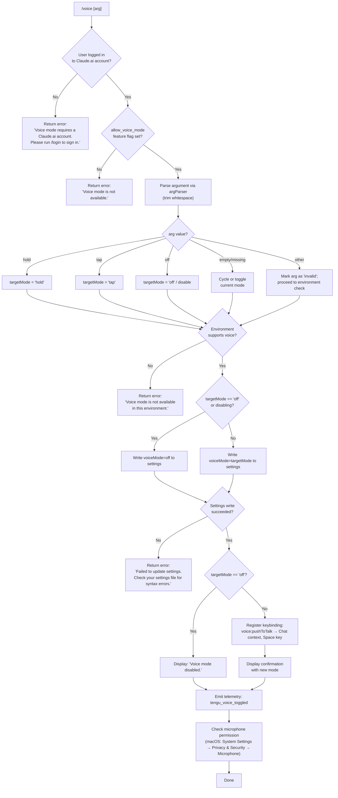

# `/voice`

> Analysis basis: CC v2.1.174 bundle.js (AST extraction + Claude interpretation)
> Minimum version: v2.1.174

---

## Overview

The `/voice` command toggles voice interaction mode in Claude Code, supporting three sub-modes: `hold` (push-to-talk), `tap` (tap-to-toggle), and `off` (disabled). It enforces account and environment prerequisites before modifying the voice-mode setting in persistent storage, and emits telemetry on every state transition.

---

## Registration

| Field | Value |
|---|---|
| type | `local` |
| name | `voice` |
| description | `Toggle voice mode` |
| argumentHint | `[hold\|tap\|off]` |
| supportsNonInteractive | `false` |
| isHidden | `null` |
| module_id | `QXK` |
| load_inline | `true` |
| loc_byte | `13260830` |
| loc_byte_end | `13261072` |
| loc_line | `9688` |
| arbor_handler.name | `x65` |
| arbor_handler.fqn | `claude-2.1.174::x65` |
| arbor_handler.kind | `AsyncFunction` |
| arbor_handler.resolution_path | `module_id` |
| arbor_handler.n_hits | `1` |

Analysis basis: CC v2.1.174 bundle.js:+13260830

---

## Input Branching

The command has 5+ distinct paths based on auth state, environment capability, argument value, and settings-write outcome — a Mermaid flowchart is required.



Analysis basis: CC v2.1.174 bundle.js:+13258315 (entry `x65`), +13247556 (`allow_voice_mode` flag check), +13258356 (login error literal), +13258455 (unavailable error literal)

---

## Behavioral Spec

### 1. Entry Point — `voiceCommandHandler` (`x65`)

The handler is an `AsyncFunction` resolved via `module_id` → `QXK`.

```
async function voiceCommandHandler(args, appState):
    // Step 1: Authentication gate
    authStatus = loadSessionAuthState()          // calls ZL6 → Dg8 → Uw
    if authStatus is not logged-in-to-claude-ai:
        return textMessage(
            "Voice mode requires a Claude.ai account. Please run /login to sign in."
        )

    // Step 2: Feature-flag gate
    featureEnabled = checkFeatureFlag("allow_voice_mode")   // V9 checks flag
    if not featureEnabled:
        return textMessage("Voice mode is not available.")

    // Step 3: Argument parsing
    rawArg = args.trim()                        // b65 trims input
    mode   = parseVoiceMode(rawArg)             // resolves to "hold"|"tap"|"off"|"invalid"|""

    // Step 4: Environment capability check
    if not environmentSupportsVoice():
        return textMessage("Voice mode is not available in this environment.")

    // Step 5: Apply mode change
    if mode == "off" or (mode == "" and currentVoiceMode != "off"):
        success = writeSettingVoiceMode("off")
        if not success:
            return textMessage(
                "Failed to update settings. Check your settings file for syntax errors."
            )
        emit(tengu_voice_toggled, { mode: "off" })
        return textMessage("Voice mode disabled.")

    targetMode = resolveTargetMode(mode)        // "hold" or "tap"
    success = writeSettingVoiceMode(targetMode)
    if not success:
        return textMessage(
            "Failed to update settings. Check your settings file for syntax errors."
        )

    // Step 6: Keybinding registration
    registerKeybinding(
        action:  "voice:pushToTalk",
        context: "Chat",
        key:     "Space"
    )                                           // H2 → Q$8 → SkH path

    emit(tengu_voice_toggled, { mode: targetMode })

    // Step 7: Microphone permission hint (macOS)
    maybeShowMicPermissionHint(
        "System Settings → Privacy & Security → Microphone"
    )                                           // literal at +13259632

    return confirmationMessage(targetMode)
```

Analysis basis: CC v2.1.174 bundle.js:+13258315, +13258326, +13258493, +13258500, +13258509, +13258576, +13258645, +13258824, +13258941, +13260091, +13260225, +13260552

---

### 2. Auth and Feature-Flag Resolution — `authAndFlagChecker` (`ZL6`)

```
function authAndFlagChecker(appState):
    sessionInfo = loadSessionFromDisk()         // Dg8 → Uw chain
    featureSet  = getSessionFeatureFlags()      // V9, bp6, jg8

    hasVoiceFlag = featureSet.includes("allow_voice_mode")
    isLoggedIn   = sessionInfo.accountType in ["enterprise", "team", ...]

    return { isLoggedIn, hasVoiceFlag }
```

Analysis basis: CC v2.1.174 bundle.js:+13247598 (`Dg8`), +13247605 (`bp6`), +13247612 (`jg8`), +13247556 (`allow_voice_mode`)

---

### 3. Argument Parser — `parseVoiceArg` (`b65`)

```
function parseVoiceArg(rawInput):
    trimmed = rawInput.trim()
    if trimmed == "hold":    return "hold"
    if trimmed == "tap":     return "tap"
    if trimmed == "off":     return "off"
    if trimmed == "":        return ""          // cycle behavior
    return "invalid"
```

Valid token constants (bundle.js:+13258232, +13258244, +13258255, +13258276):
- `"hold"` — push-to-talk mode
- `"tap"` — tap-to-toggle mode
- `"off"` — disable voice
- `"invalid"` — unrecognised argument sentinel

Analysis basis: CC v2.1.174 bundle.js:+13258185 (`b65` calls `H.trim`)

---

### 4. Settings Write — `writeVoiceSetting` (via `fA` settings writer)

```
function writeVoiceSetting(mode):
    settings = loadSettingsFromDisk()           // uB → H4_ → IYH chain
    settings.voiceMode = mode
    result = atomicWriteSettings(settings)      // fw6 (atomic write with temp file)
    clearSettingsCache()                        // lO clears NQ6 and ir8 caches
    return result.ok
```

The atomic write path (`fw6`) uses `randomBytes` for temp-file naming, `fchmodSync` to preserve permissions, `fsyncSync` for durability, and `renameSync` for atomic swap.

Analysis basis: CC v2.1.174 bundle.js:+13258645 (`fA`), +1315667 (`fw6`), +1315809 (`lO`), +13258743 (failure message literal)

---

### 5. Keybinding Registration — `registerVoiceKeybinding` (`H2`)

When voice mode is set to `hold` or `tap`, the handler registers a keybinding:

```
function registerVoiceKeybinding():
    keybindingConfig = loadKeybindingConfig()   // Q$8 → SkH
    entry = {
        action:  "voice:pushToTalk",
        context: "Chat",
        key:     "Space"
    }
    applyKeybindingEntry(keybindingConfig, entry)
```

The keybinding config is loaded from `keybindings.json` (literal at bundle.js:+3934085). The `SkH` function validates `bindings` array structure; invalid formats emit `tengu_keybinding_fallback_used`.

Analysis basis: CC v2.1.174 bundle.js:+13260091 (`H2`), +13260094 (`voice:pushToTalk`), +13260113 (`Chat`), +13260120 (`Space`)

---

### 6. Environment Capability Check — `envCapabilityCheck` (`Up6`, `KDA`)

```
function environmentSupportsVoice():
    envFlags = resolveEnvironmentFlags()       // KDA, Up6
    // Checks for SSH remote sessions, terminal type, OS audio subsystem
    if isSSHSession or noAudioSubsystem:
        return false
    return true
```

On failure this path emits: `"Voice mode is not available in this environment."` (bundle.js:+13259125)

Analysis basis: CC v2.1.174 bundle.js:+13258971 (`KDA`), +13259050 (`Up6`), +13259125 (env-unavailable literal)

---

### 7. Microphone Permission Hint — macOS only

After a successful enable, the handler may display a hint referencing the macOS microphone permission path:

> `"System Settings → Privacy & Security → Microphone"`

Analysis basis: CC v2.1.174 bundle.js:+13259632

---

## State & Side Effects

| Item | Detail |
|---|---|
| Telemetry | `tengu_voice_toggled` (bundle.js:+13258826) — emitted on every successful mode change |
| Telemetry (indirect) | `tengu_keybinding_fallback_used` (+3943089), `tengu_custom_keybindings_loaded` (+3933991), `tengu_config_parse_error` (+3317492) — from keybinding and settings subsystems |
| Settings mutation | Writes `voiceMode` field to user settings file via atomic rename |
| Settings cache | Clears in-memory settings caches (`NQ6`, `ir8`) after write via `lO` (+1315809) |
| Keybinding registration | Registers `voice:pushToTalk` → `Space` in `Chat` context when enabling |
| Keybinding config file | Reads/writes `keybindings.json` in Claude config directory |
| appState changes | Updates voice mode state visible to the rest of the UI loop |
| Sound / audio | No audio playback by the command itself; mode change enables microphone capture in subsequent turns |
| Non-interactive support | `supportsNonInteractive: false` — command must not be invoked in non-interactive (pipe/script) mode |

---

## Version History

| Version | Change |
|---|---|
| v2.1.174 | Initial analysis |

---

## Common Mistakes

1. **Running without a Claude.ai account**: `/voice` requires an authenticated Claude.ai session (`/login`). API-key-only sessions will receive the "requires a Claude.ai account" error regardless of argument.
2. **Using `/voice` in SSH / remote environments**: The environment capability check rejects voice in sessions that lack a local audio subsystem; the error message is "Voice mode is not available in this environment."
3. **Passing an unrecognised argument**: Any argument other than `hold`, `tap`, or `off` is internally marked `"invalid"`. The parser falls through to the environment check rather than returning an argument-error message, so the outcome may be surprising.
4. **Malformed `keybindings.json`**: If the keybindings file has syntax errors or lacks the required `"bindings"` array, keybinding registration falls back to defaults and emits `tengu_keybinding_fallback_used` — voice mode may still be saved, but the Space key shortcut may not be registered correctly.
5. **Settings file syntax errors**: If `settings.json` is malformed, the write step fails and returns "Failed to update settings. Check your settings file for syntax errors." Voice mode is not changed in this case.
6. **`supportsNonInteractive: false`**: Calling `/voice` from a non-interactive script or pipe context is not supported and will be rejected by the CLI dispatcher before `x65` is ever invoked.

---

## Appendix — Identifier Mapping

> For bundle debugging only. Identifiers change across versions.

| Identifier | Role |
|---|---|
| `x65` | Main async handler for `/voice` command (`voiceCommandHandler`) |
| `ZL6` | Auth + feature-flag resolution coordinator |
| `Dg8` | Session-load dispatcher |
| `Uw` | Session/auth state loader |
| `w7` | Auth token resolver |
| `Vj` | OAuth profile/session builder |
| `G4` | First-party auth checker |
| `IP` | Auth-info extractor |
| `DO` | Full auth-flow orchestrator |
| `B26` | Auth-flag builder |
| `trH` | Auth-type classifier |
| `nE` | Feature-flag accessor |
| `bp6` | Feature flag list loader |
| `jg8` | Feature flag set resolver |
| `V9` | `allow_voice_mode` flag checker + session feature reader |
| `Hb` | Session detail fetcher |
| `CLH` | Feature-flag cache reader |
| `nhH` | Feature normalizer |
| `g_` | Settings subsystem initialiser |
| `uB` | Settings loader orchestrator |
| `H4_` | Disk-settings read + performance timing |
| `b8` | Settings file writer (log append) |
| `IQ6` | Settings file path resolver |
| `aw6` | Flag-settings merger |
| `onA` | Settings object builder |
| `IYH` | Settings file path builder (`.claude/settings.json`) |
| `bB` | Policy-settings loader |
| `nnA` | Inline/SDK settings loader |
| `xB` | Settings layer aggregator |
| `sw6` | WSL/platform settings shim |
| `b65` | Argument trimmer / mode parser |
| `H` | Random/timer utility (used in retry/backoff) |
| `fA` | Settings write + git-ignore + cache orchestrator |
| `u3` | Settings path + aggregator helper |
| `ef_` | Settings-write pre-flight (gitignore, backups) |
| `Q2` | Config path resolver |
| `Ca` | Config file reader (encoding detection) |
| `M$` | Real-path resolver |
| `N` | OS/platform normaliser |
| `Ha6` | Config directory resolver |
| `k8` | ENOENT error helper |
| `Of_` | Settings mutation timestamp recorder |
| `vNH` | Settings path + aggregator (variant) |
| `us6` | Settings file path builder (variant) |
| `fw6` | Atomic file writer (temp + rename) |
| `lO` | Settings cache clearer |
| `la6` | Gitignore-rule writer |
| `b6` | Async-context getter |
| `eo6` | AsyncLocalStorage store reader |
| `lK_` | Git worktree resolver |
| `ca6` | Gitignore pattern checker |
| `p_` | Git-check-ignore runner |
| `amf` | Global gitignore path resolver |
| `icA` | File tracking checker |
| `nu` | Settings directory path joiner |
| `kH` | Feature-gate checker (`tengu_feature_ok/bad`) |
| `c` | Generic config accessor |
| `A6` | Feature-flag evaluator |
| `S56` | Feature flag store |
| `t6` | Feature-gate checker variant |
| `CH` | Settings-write checker |
| `SH` | Error logger / message emitter |
| `DA` | Error stringifier |
| `L6` | String-type cast utility |
| `dbf` | Error queue manager |
| `M` | MCP server state manager |
| `HCH` | MCP connection orchestrator |
| `Wi` | MCP server connector |
| `PV6` | MCP transport factory |
| `Le` | MCP server lifecycle manager |
| `Zg` | MCP SDK server builder |
| `VX8` | MCP connection error formatter |
| `JV6` | MCP SSE/HTTP server registry |
| `tV` | MCP heartbeat/keepalive |
| `Hw` | MCP connection state writer |
| `c8` | MCP config serialiser |
| `zn9` | MCP tool-hash computer |
| `jg_` | MCP cache-path builder |
| `m2H` | MCP tool signature hasher |
| `OJ8` | MCP schema key extractor |
| `zJ8` | MCP schema hash wrapper |
| `iX` | MCP content hash helper |
| `MJ8` | MCP schema validator |
| `If` | MCP JSON-schema checker |
| `Y8` | MCP debug logger |
| `nX8` | MCP server connect + OAuth orchestrator |
| `STL` | MCP OAuth config builder |
| `pc` | MCP token-store accessor |
| `d1H` | MCP claudeai-proxy connector |
| `c1H` | MCP connection result applier |
| `H9H` | MCP OAuth local-server handler |
| `bH6` | MCP pending-auth tracker |
| `Y` | Process-exit / abort handler |
| `rX8` | MCP failure cache writer |
| `Ei` | MCP reconnect orchestrator |
| `cu` | MCP token reader |
| `w` | MCP supervisor writer |
| `zL` | MCP error logger |
| `TH` | String coercion utility |
| `kTL` | MCP SSH-environment checker |
| `iX8` | MCP tool-call dispatcher |
| `CH6` | MCP pending-request getter |
| `xH6` | MCP connection-slot getter |
| `Wn9` | MCP reconnect scheduler |
| `c9` | AsyncLocalStorage context reader |
| `lP8` | MCP failure-cache path builder |
| `uB_` | MCP tool-result serialiser |
| `lN` | MCP skills telemetry emitter |
| `w6` | MCP skills collector |
| `ZB_` | MCP permission-check wrapper |
| `G8` | Global config writer (save) |
| `y` | Warning/credit message emitter |
| `ea` | Usage-credit warning builder |
| `jn9` | MCP pagination helper |
| `tF` | Async-iterator utility |
| `f66` | MCP page-size parser |
| `nP8` | MCP cursor parser |
| `Mi8` | MCP connection result applier |
| `eRH` | MCP update-event hasher |
| `_G` | MCP cleanup orchestrator |
| `q66` | MCP tool-hash aggregator |
| `$` | Daemon session manager |
| `mDK` | Daemon status file writer |
| `As` | Daemon address resolver |
| `Dp6` | Daemon status path builder |
| `NGA` | MCP remote-server retry manager |
| `RX8` | MCP auth-type gate |
| `l8` | Abort-signal timeout wrapper |
| `H2` | Keybinding registration coordinator |
| `Q$8` | Keybinding config loader |
| `SkH` | Keybinding config parser + validator |
| `wy_` | Keybinding default-map builder |
| `cF` | Keybinding context-router |
| `Of` | Keybinding action dispatcher |
| `O5H` | Keybinding file path builder |
| `l6` | JSON parser wrapper |
| `B$8` | Keybinding block structure validator |
| `m$8` | Keybinding entry normaliser |
| `N$9` | Keybinding config-path accessor |
| `Oy_` | Duplicate-key detector in JSON |
| `zy_` | Keybinding block collector |
| `d$8` | Keybinding display-string builder |
| `Xy_` | Keybinding label formatter |
| `Jy_` | Keybinding key-sequence formatter |
| `P$9` | Keybinding summary builder |
| `wr4` | Keybinding modifier-key formatter |
| `$6` | Feature-flag reader (keybinding path) |
| `bFH` | Language/locale resolver |
| `C6` | Global config loader |
| `TV_` | Config version migrator |
| `C7H` | Config file reader + directory scanner |
| `gu` | YAML/JSONC comment stripper |
| `M19` | Config backup directory scanner |
| `ZV_` | Config backup path builder |
| `D` | Daemon session dispatcher |
| `b` | Daemon task scheduler |
| `vg8` | Daemon memory logger |
| `TG6` | Daemon todo-list loader |
| `Q` | Background PTY session manager |
| `PTA` | Daemon socket claim sender |
| `VTA` | Daemon session lifecycle manager |
| `B` | Daemon signal handler |
| `em4` | Config file watcher |
| `ZF` | Config change debouncer |
| `R9` | Config-reload hook registrar |

---

Note: index built via Arbor fallback; some signals (telemetry, literals) may be missing — see arbor-fallback.js.