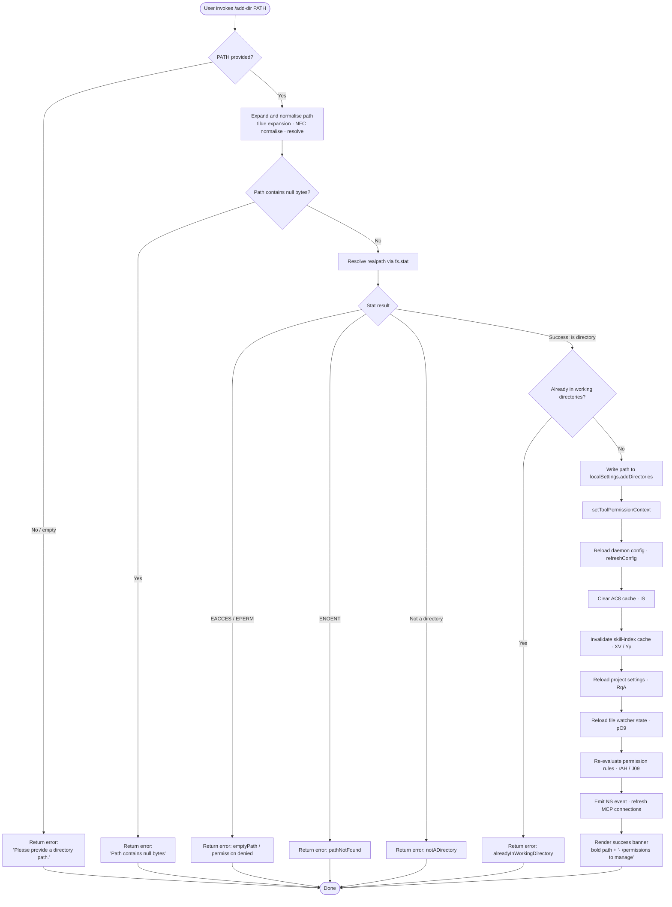

# `/add-dir`

> Analysis basis: CC v2.1.170 bundle.js (AST extraction + Claude interpretation)
> Minimum version: v2.1.170

---

## Overview

`/add-dir` registers a new working directory with the current Claude Code session, expanding the set of filesystem paths the agent is permitted to read and modify. It accepts a single path argument, validates it (resolving `~` expansion, symlinks, and checking that the target exists and is a directory), then persists the addition to local settings, reloads configuration, and refreshes all downstream state including tool-permission context, MCP connections, and the skill-index cache.

---

## Registration

| Field | Value |
|---|---|
| type | `local-jsx` |
| name | `add-dir` |
| description | Add a new working directory |
| argumentHint | `<path>` |
| module_id | `agq` |
| load_inline | `true` |
| loc_byte | `11087575` |
| loc_byte_end | `11087723` |
| loc_line | `7283` |
| arbor_handler.name | `k0f` |
| arbor_handler.fqn | `claude-2.1.170::k0f` |
| arbor_handler.kind | `AsyncFunction` |
| arbor_handler.resolution_path | `module_id` |
| arbor_handler.n_hits | `0` |

Analysis basis: CC v2.1.170 bundle.js:+11087575

---

## Input Branching

There are more than three distinct outcomes depending on path validation, so a flowchart is used.



---

## Behavioral Spec

### 1 — Handler entry point (`k0f`)

The Arbor-resolved handler is the async function `k0f` inside module `agq`.
It is loaded via an inline `Promise.resolve({call: k0f})` shape (no separate module export).

```
async function addDirectoryHandler(args, appState):
    path = args[0]

    # --- path resolution (via resolveAndValidatePath / WoH) ---
    if path is empty or null:
        display "Please provide a directory path."
        return

    expanded = expandPath(path)          # tilde → homedir, NFC normalise
    if expanded contains null bytes:
        display "Path contains null bytes"
        return

    stat = await fs.stat(expanded)
    if stat error is EACCES or EPERM:
        display permission-denied message
        return
    if stat error is ENOENT:
        display "pathNotFound" message
        return
    if stat result is not a directory:
        display "notADirectory" message
        return

    canonical = realpath(expanded)       # follow symlinks

    # --- duplicate check (via getAppState / x_) ---
    currentDirs = appState.workingDirectories
    if canonical already in currentDirs:
        display "alreadyInWorkingDirectory" message
        return

    # --- persist (via permissionsUpdater / DO) ---
    localSettings.addDirectories.push(canonical)
    write localSettings to disk           # --add-dir flag persisted

    # --- downstream refresh cascade ---
    setToolPermissionContext(newDirs)     # _.setToolPermissionContext
    refreshConfig()                       # bA.refreshConfig
    clearPermissionCache()                # IS → AC8.clear
    invalidateSkillIndexCache()           # XV → Yp → H.clearSkillIndexCache
    reloadProjectSettings()              # RqA: realpath, readFile, appendFile, mkdir
    reloadFileWatcherState()             # pO9: wj, Wq, Sf, Jz
    reapplyPermissionRules()             # rAH → J09 → e_
    emitChangeEvent()                    # NS.emit

    # --- render success ---
    display bold(canonical) + " · /permissions to manage"
```

Analysis basis: CC v2.1.170 bundle.js:+11086309

---

### 2 — Path resolution (`WoH` / `resolveAndValidatePath`)

```
function resolveAndValidatePath(rawPath):
    if rawPath is empty:
        return { error: "emptyPath" }

    trimmed = rawPath.trim()

    # tilde expansion
    if trimmed starts with "~/":
        trimmed = os.homedir() + trimmed.slice(2)

    # Windows drive-letter / separator normalisation
    normalized = path.normalize(trimmed)
    normalized = path.resolve(normalized)    # make absolute

    if normalized contains "\0":
        raise TypeError("Path contains null bytes")

    stat = await fs.stat(normalized)
    if stat throws EACCES or EPERM:
        return { error: "accessDenied" }
    if stat throws ENOENT:
        return { error: "pathNotFound" }
    if not stat.isDirectory():
        return { error: "notADirectory" }

    # macOS /var → /private/var remapping
    canonical = normalized
        .replace(/^\/var\//, "/private/var/")

    return { success: true, path: canonical }
```

Analysis basis: CC v2.1.170 bundle.js:+3894422 (WoH), +1056759 (expandPath / y1)

---

### 3 — Permissions update (`DO` / `permissionsUpdater`)

```
function applyPermissionsUpdate(mutation, localSettings):
    if mutation.type == "setMode" and mode == "bypassPermissions":
        if bypassPermissions unavailable:
            log "Ignoring permission update: setMode 'bypassPermissions' rejected …"
            return

    if mutation.type == "addDirectories":
        localSettings.addDirectories.push(paths…)

    if mutation.type == "addRules":
        apply to alwaysAllowRules / alwaysDenyRules / alwaysAskRules

    if mutation.type == "replaceRules":
        replace rule sets

    if mutation.type == "removeRules":
        filter out matching rules

    if mutation.type == "removeDirectories":
        filter out matching paths

    serialize and write updated settings to disk
    emit change notification
```

Analysis basis: CC v2.1.170 bundle.js:+5087327 (permissionsUpdater / DO), +11086345 (literal `"addDirectories"`)

---

### 4 — Project-settings reload (`RqA`)

```
async function reloadProjectSettings(projectRoot):
    normalizedRoot = path.normalize(projectRoot)   # RO
    canonical = await fs.realpath(normalizedRoot)  # pK.realpath

    if env != "production":
        return early (test / CI guard)             # literal "production"

    settingsPath = path.join(canonical, ".claude", "settings.json")
    localSettingsPath = path.join(canonical, ".claude", "settings.local.json")

    content = await fs.readFile(settingsPath, "utf8")
    parsed = JSON.parse(content)

    # write-back with mode bits 448 (0o700) / 384 (0o600)
    await fs.mkdir(dirname, { recursive: true })
    await fs.appendFile(localSettingsPath, …)
```

Analysis basis: CC v2.1.170 bundle.js:+13352868 (RqA), +13353105 (literal `"utf8"`), +13353229 (literal `448`), +13353296 (literal `384`)

---

### 5 — File-watcher state reload (`pO9`)

```
async function reloadFileWatcherState(dirs):
    # clear stale watcher for removed paths (wj)
    xfH.delete(oldPath)

    # for each active directory (Wq)
    for dir in dirs:
        fullPath = path.join(dir, …)
        stats = await Promise.all([_W.stat(fullPath)])
        if stat fails:
            xfH.delete(…); SjH.delete(…)
            continue
        basename = path.basename(fullPath)
        content = await _W.readFile(fullPath, "utf-8")
        parsed = parseWatcherState(content)         # Q6 → JSON.parse
        xfH.set(fullPath, parsed)
        if Number.isFinite(parsed.order):
            …

    # persist new state atomically (Sf → AO)
    tempFile = randomBytes(6).toString("hex")
    await m8H.writeFile(tempFile, serialized)
    await m8H.rename(tempFile, target)
```

Analysis basis: CC v2.1.170 bundle.js:+4217433 (pO9), +4213917 (wj), +4213958 (Wq)

---

### 6 — Permission-rule re-evaluation (`rAH` / `J09`)

```
function reapplyPermissionRules(newDirs, settings):
    # collect tool-level permission entries (J09)
    entries = []
    for each tool in registeredTools:
        toolEntry = buildToolEntry(tool)       # uq7 → I$ · r3 · E2
        entries.push(toolEntry)

    # filter against allow/deny sets (M → aSH · Ic8 · IPA)
    filtered = entries
        .filter(e => !denySet.has(e))
        .filter(e => allowSet.has(e) or ask)

    # apply MCP updates if connection state changed
    for client in mcpClients:
        client.applyMcpUpdate(…)               # Ic8 → H.applyMcpUpdate

    return filtered
```

Analysis basis: CC v2.1.170 bundle.js:+5089461 (rAH), +5086558 (J09)

---

### 7 — Skill-index cache invalidation (`XV` / `Yp`)

```
async function invalidateSkillIndexCache(appState):
    await Promise.resolve()                    # microtask yield
    WLA(appState)                              # clear local index state
    appState.clearSkillIndexCache()            # H.clearSkillIndexCache

    # downstream sub-modules
    OC8()
    CUq()
    WuH → PR6: AS8.get, jR6
```

Analysis basis: CC v2.1.170 bundle.js:+13338570 (XV), +13338471 (Yp)

---

## State & Side Effects

| Item | Detail |
|---|---|
| Telemetry | `tengu_disable_bypass_permissions_mode` (bundle.js:+4247357) · `tengu_daemon_config_reload` (bundle.js:+16545205) · `tengu_bg_state_read_transient` (bundle.js:+4214406) · `tengu_feature_ok` (bundle.js:+1014205) · `tengu_feature_sad` (bundle.js:+1014348) · `tengu_feature_bad` (bundle.js:+1014267) |
| localSettings mutation | Appends canonical path to `addDirectories` array; writes `settings.local.json` under `.claude/` |
| Tool permission context | `_.setToolPermissionContext` called immediately after write (bundle.js:+11086419) |
| Config reload | `bA.refreshConfig` triggered (bundle.js:+11086529) |
| Permission cache | `AC8.clear()` via `IS` (bundle.js:+10742403) |
| Skill-index cache | Invalidated via `XV → Yp → H.clearSkillIndexCache` (bundle.js:+11086503) |
| Project settings | Re-read from disk via `RqA` (bundle.js:+11086548) |
| File watcher | State flushed and rebuilt via `pO9` (bundle.js:+11086555) |
| MCP connections | Permission rules re-evaluated; orphaned connections disposed (bundle.js:+11086589) |
| Event bus | `NS.emit` fired to propagate directory change (bundle.js:+11086519) |
| appState changes | `workingDirectories` extended; `session`, `effort`, `model`, `max_thinking_tokens`, `flag_settings` fields re-synced |
| Sound | None observed |
| CLI flag equivalent | `--add-dir` (literal found at bundle.js:+11086559) |

---

## Version History

| Version | Change |
|---|---|
| v2.1.170 | Initial analysis |

---

## Common Mistakes

1. **Omitting the path argument** — `/add-dir` with no argument produces `"Please provide a directory path."` and exits immediately without modifying any state.
2. **Passing a file path instead of a directory** — The handler calls `fs.stat` and checks `isDirectory()`; a file path returns the `notADirectory` error (`"Did not add a working directory."`).
3. **Passing a non-existent path** — The ENOENT guard fires before any write; the directory is not created automatically.
4. **Duplicate addition** — If the resolved canonical path is already present in the session's working directories the command returns `alreadyInWorkingDirectory` silently rather than erroring loudly.
5. **Expecting instant MCP reconnection** — MCP connection re-evaluation happens asynchronously after the settings write; tools may be temporarily unavailable during the refresh cascade.
6. **Using a relative path and expecting it to persist relatively** — The path is resolved to an absolute canonical form (including `~/` expansion and symlink resolution) before storage; the stored value will differ from the raw input.

---

## Appendix — Identifier Mapping

> For bundle debugging only. Identifiers change across versions.

| Identifier | Role |
|---|---|
| `k0f` | Main handler (`addDirectoryHandler`) — Arbor-resolved entry point for `/add-dir` |
| `x_` | Read current app state / working directories (`getAppState` wrapper) |
| `NR8` | Filter working-directory list by `"working_directory"` key |
| `IR8` | Filter working-directory list by `"allowed_tools"` / `"disallowed_tools"` keys |
| `Xb` | Bypass-permissions mode guard (checks `"bypassPermissions"` / `"permission_mode"`) |
| `Y6` | Core permission-mode toggle logic |
| `uP6` | Sub-helper for permission-mode toggle |
| `mP6` | Sub-helper for permission-mode toggle |
| `Lm` | Permission mode helper |
| `D78` | Permission set mutation (JT\_.has / XJH.get / JT\_.add / Gw\_ / WT\_) |
| `h6` | Permission-mode state updater (uses Date.now, BSL) |
| `DO` | Permissions updater — persists rule/directory mutations to localSettings |
| `N` | Settings serialiser / writer |
| `PeK` | Settings write sub-helper |
| `MTA` | Settings write sub-helper (GaK / TaK) |
| `CH` | JSON.stringify wrapper |
| `u4` | Path-segment formatter |
| `FZA` | Mapping helper (weK.map) |
| `zFH` | Write-to-stream helper |
| `yZA` | Low-level H.write wrapper |
| `EeK` | Append-file / log-rotation helper |
| `mBH` | Buffered writer with clearTimeout / setTimeout / setImmediate |
| `L4H` | Log-file path builder (PM6, E6H.join, H\_, v6) |
| `$M6` | Error-code classifier (V8) |
| `cZA` | Path join + stat helper |
| `La8` | File rename / unlink helper (Mh.stat, Mh.rename, Mh.unlink) |
| `TeK` | Append-file writer with mkdir (Mh.mkdir, Mh.appendFile) |
| `N9` | Hook / listener registration (LTA.register) |
| `Q5` | Rule-string formatter (fS4 → H.replaceAll) |
| `fS4` | Escape helper for rule strings |
| `K` | Column formatter (L.map, f.padEnd) |
| `pT` | Permission-table lookup |
| `Y` | Supervisor process manager (pTH, q.write, bzK, T.stop/start, E.stop/start, ccK) |
| `pTH` | Process-table state reader (m9, V8, $OA, EH, Aq, MOA, Object.keys, K.has) |
| `m9` | Async store getter (JCL.getStore) |
| `$OA` | MOA-based sub-helper |
| `EH` | String coercion helper |
| `bzK` | Column-width calculator (Math.max, rD) |
| `T` | Spinner/progress stop (BZ6, V76) |
| `BZ6` | Spinner clear helper |
| `V76` | Spinner stop helper |
| `E` | Progress renderer (G, Math.max, Math.min) |
| `G` | Async render loop (V76, CS, vN, Promise.all, nn, tF, hH, jA) |
| `hH` | Render-error handler (jA, \_6, hq, lN4, fQH.push, go.logError) |
| `jA` | Error/string normaliser |
| `ccK` | Heartbeat helper (V\_H) |
| `V_H` | Heartbeat timer helper |
| `V` | Secondary progress/spinner |
| `d` | Render dispatch helper |
| `YzH` | Post-add UI refresh helper |
| `XV` | Skill-index cache invalidator (Yp, OC8, CUq, WuH) |
| `Yp` | Inner skill-index clear (Promise.resolve, WLA, H.clearSkillIndexCache) |
| `OC8` | Skill-index sub-module reset |
| `CUq` | Skill-index sub-module reset |
| `WuH` | Skill-index sub-module reset (PR6) |
| `PR6` | AS8.get / jR6 lookup |
| `jR6` | Skill-index registry helper |
| `c3H` | Supplementary cache clear (MC8) |
| `MC8` | Internal cache map |
| `IS` | Permission cache clearer (AC8.clear) |
| `RqA` | Project-settings reloader (realpath, readFile, appendFile, mkdir) |
| `i$H` | Settings-path builder (\_6, QwK, qu) |
| `_6` | String coercion wrapper |
| `QwK` | Settings-key helper |
| `qu` | Settings sub-helper |
| `RO` | Path normalise (NFC) wrapper |
| `k8` | Error-code extractor (V8) |
| `tR` | xZ-based helper |
| `xZ` | Low-level utility |
| `W_` | Path utility wrapper |
| `pO9` | File-watcher state reloader (wj, Wq, Sf, Jz) |
| `wj` | Watcher-entry deleter (xfH.delete) |
| `Wq` | Watcher-state updater (Dj.join, \_W.stat/readFile, xfH.set/get/clear, SjH.has/add/delete) |
| `Qf` | Error classifier (V8) |
| `Q6` | JSON.parse wrapper |
| `Sf` | Atomic-write dispatcher (AO, Dj.join, CH, wj) |
| `AO` | Atomic file writer (randomBytes, writeFile, rename, copyFile, unlink) |
| `Jz` | Watcher-entry validator (V8, UZH.has, N, EH, hH) |
| `rAH` | Permission-rule re-evaluator (vC\_, N, J09, y8, e\_, Q5, G3, K.has) |
| `vC_` | User/project settings reader |
| `J09` | Tool-entry builder (GT6, H.map, y8, uq7, Uq7, f.map, Q5, G3, q.filter, M.has, e\_, N, String) |
| `GT6` | Policy-settings reader (y8) |
| `y8` | Settings-layer reader (Ro6, XB) |
| `uq7` | Tool-entry formatter (I\$, r3, n6, E2, q.trim, Aq) |
| `I$` | Tool-identity builder (SYH, XB) |
| `r3` | Realpath-sync helper (q5, KD, H.realpathSync) |
| `E2` | Code-block formatter (co) |
| `Uq7` | Alternate tool-entry formatter |
| `G3` | Rule-string formatter ($S4, rT, OS4, H.substring, MS4) |
| `$S4` | Rule sub-helper |
| `rT` | Object.hasOwn wrapper |
| `OS4` | Rule sub-helper |
| `MS4` | H.replaceAll-based formatter |
| `M` | MCP-client manager (aSH, Ic8, L.get/values, N, $, IPA) |
| `aSH` | MCP-server connection builder (Object.entries, pn, vV, K.push/filter, F8, BZ6, Cg9, sD8, rD8, M8, bJ8, xJ8, CS, Fg9, Rm\_, J.push, Promise.all, vN, nn, VN, yj8, tF, Gm\_, y.push, U7, EH, mg9, CeH, Cj8) |
| `Ic8` | MCP-connection result applier (H.applyMcpUpdate, oSH, M8, A.cleanup, pE, Xw) |
| `$` | MCP registry helper (f\$K) |
| `IPA` | MCP-client getter / reconnector (Object.entries, A.filter, \_.getClients, WJ8, q, o8, N, SeH, aSH, Ic8, Object.fromEntries, K.map) |
| `e_` | File-write / settings-persistence helper (I\$, n6, DvH.dirname, Hq\_, XB, E2, k8, Aq, N, Error, Qo, Array.isArray, z9\_, wvH, xO6, CH, hO, Fr6, Ru, W\_, SH, s6, xH, PB, hH, oQH.emit) |
| `Hq_` | Settings-file locator (JQA, SYH, jB, YQA, Qo) |
| `XB` | File-read dispatcher (W\_, sf6, bi8, if6, wZH, JZH, ef6, CYH, bYH, Jq\_, SQA, to, Nz6) |
| `z9_` | Timestamp setter (nr6.set, Date.now) |
| `wvH` | File-write wrapper (So6, XB) |
| `xO6` | Atomic file writer with fchmod / fsync (readlinkSync, lstatSync, statSync, writeFileSync, renameSync, unlinkSync) |
| `hO` | Cache clearer (kF6.clear, Jn8.clear) |
| `Fr6` | Git-tracking / settings-file writer (C6, n1\_, H.replaceAll, Br6, ty4, WYH.mkdir/readFile/appendFile/writeFile) |
| `Ru` | Claude-dir path builder (rI.join → `.claude`) |
| `SH` | Feature-flag reader "ok" path (tengu\_feature\_ok) |
| `s6` | Feature-flag reader "sad" path (tengu\_feature\_sad) |
| `xH` | Feature-flag reader "bad" path (tengu\_feature\_bad) |
| `PB` | Settings-load orchestrator (bZ, \_q, \_q\_, XB, yF6) |
| `WoH` | Path validator + stat caller (RM8.resolve, y1, Af9.stat, V8, Rs, $V) |
| `y1` | Path expander (tilde, NFC, isAbsolute, resolve, normalize, Or6.homedir, rVH) |
| `C6` | Context getter (oi6, W\_) |
| `oi6` | AsyncLocalStorage getter (ri6.getStore, Id) |
| `Rs` | Realpath normaliser (W\_) |
| `$V` | macOS /var → /private/var remapper (y1, q.replace, K.replace, dC6, cz, i6H) |
| `dC6` | Replacement-string builder (a6, Wv) |
| `cz` | Case-normaliser (H.toLowerCase) |
| `i6H` | Path-segment helper |
| `GoH` | Success-banner renderer (w6.bold, RM8.dirname) |

---

Note: index built via Arbor fallback; some signals (telemetry, literals) may be missing — see arbor-fallback.js.