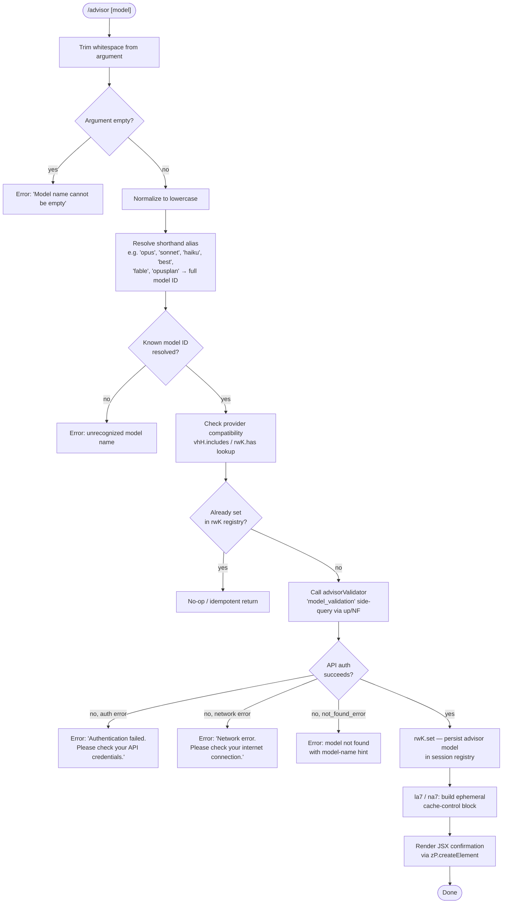

# `/advisor`

> Analysis basis: CC v2.1.175 bundle.js (AST extraction + Claude interpretation)
> Minimum version: v2.1.175

---

## Overview

The `/advisor` command allows Claude Code to consult a stronger ("advisor") model at key decision points during a session. When invoked, it validates and resolves a target model name, performs a lightweight authentication probe against the Anthropic API, stores the chosen advisor model in a per-session registry, and renders a JSX confirmation component in the CLI. Subsequent agentic calls may then delegate to this advisor model when appropriate.

---

## Registration

| Field | Value |
|---|---|
| type | `local-jsx` |
| name | `advisor` |
| description | `Let Claude consult a stronger model at key moments` |
| loc_byte | `12934375` |
| loc_byte_end | `12934616` |
| loc_line | `9141` |
| argumentHint | `null` |
| isHidden | `null` |
| module_id | `HYK` |
| load_inline | `true` |
| arbor_handler.name | `_s7` |
| arbor_handler.fqn | `claude-2.1.175::_s7` |
| arbor_handler.kind | `AsyncFunction` |
| arbor_handler.resolution_path | `module_id` |
| arbor_handler.n_hits | `1` |

Analysis basis: CC v2.1.175 bundle.js:+12934375

---

## Input Branching

The command handler has more than three distinct execution paths (empty input, invalid model, unknown model, provider-gated model, successful set), so a Mermaid flowchart is used.



Analysis basis: CC v2.1.175 bundle.js:+12933833, +12925087, +12925393, +12925438, +12925601, +12925642

---

## Behavioral Spec

### Top-level handler (`_s7`)

The Arbor-resolved handler is the async function `_s7` (FQN `claude-2.1.175::_s7`, resolved via `module_id → HYK`).

```
async function advisorHandler(args, appState):
    rawInput = args.trim()                        // A.trim @ +12933833
    if rawInput == "":
        throw Error("Model name cannot be empty") // literal @ +12925124

    modelKey = rawInput.toLowerCase()

    resolvedModelId = resolveModelAlias(modelKey) // J1 @ +12933987
    if resolvedModelId == null:
        throw Error("Unrecognized model name: " + rawInput)

    // Check if provider allows this model
    providerAllowed = checkProviderCompatibility(resolvedModelId, appState)
    // vhH.includes @ +12925291

    if advisorRegistry.has(resolvedModelId):      // rwK.has @ +12925393
        return renderConfirmation(resolvedModelId, alreadySet=true)

    validationResult = await validateModelWithAPI( // up @ +12925438
        resolvedModelId,
        queryType = "model_validation"             // literal @ +12925488
    )

    if validationResult.error == "auth":
        throw Error("Authentication failed. Please check your API credentials.")
        // literal @ +12925860
    if validationResult.error == "network":
        throw Error("Network error. Please check your internet connection.")
        // literal @ +12925962
    if validationResult.errorType == "not_found_error":
        // literal @ +12926081
        throw Error("Model not found: " + resolvedModelId)

    advisorRegistry.set(resolvedModelId, {        // rwK.set @ +12925601
        cacheControl: "ephemeral"                 // literal @ +12925582
    })

    cacheBlock = buildEphemeralCacheBlock(        // la7 @ +12925642
        resolvedModelId,
        labelPrefix = "Hi"                        // literal @ +12925557
    )

    return renderJSX(resolvedModelId, cacheBlock) // zP.createElement @ +12933869
```

Analysis basis: CC v2.1.175 bundle.js:+12933833

---

### Model alias resolver (`J1`)

`J1` maps short user-facing names to canonical Anthropic model IDs. The mapping table observed in literals is:

| Short alias | Resolved canonical model ID |
|---|---|
| `fable` | `claude-fable-5` (bundle.js:+2273209, +2258605) |
| `opusplan` | `claude-mythos-5` (bundle.js:+2273272, +2269940) |
| `sonnet` | resolves to the current sonnet series |
| `haiku` | resolves to the current haiku series |
| `opus` | resolves to the current opus series |
| `best` | resolves to the highest-ranked available model (bundle.js:+2273425) |
| `[1m]` | resolves via the `1m` context alias (bundle.js:+2273257) |

Full model strings confirmed in literals (non-exhaustive):
- `claude-opus-4-8`, `claude-opus-4-7`, `claude-opus-4-6`, `claude-opus-4-5`, `claude-opus-4-1`, `claude-opus-4-0`
- `claude-sonnet-4-6`, `claude-sonnet-4-5`, `claude-sonnet-4-0`
- `claude-haiku-4-5`
- `claude-3-7-sonnet`, `claude-3-5-sonnet`, `claude-3-5-haiku`, `claude-3-opus`, `claude-3-sonnet`, `claude-3-haiku`

```
function resolveModelAlias(normalizedInput):
    // Rz @ +2273161 → ILH → K6
    if normalizedInput in ALIAS_TABLE:
        return ALIAS_TABLE[normalizedInput]

    // _f @ +2273171: apply regex replacement to strip suffixes
    cleaned = applyModelNameCleaning(normalizedInput)

    // UI @ +2273189: check against known provider include-list (vhH)
    providerOk = checkIncludeList(cleaned)

    // hLH @ +2273224: deep model-feature lookup (mD_ → S7)
    features = resolveModelFeatures(cleaned)

    // zT @ +2273290: check tier (t18 → S7, q7)
    tier = resolveModelTier(cleaned)

    // AjH @ +2273367: resolve model descriptor (UD_ → S7)
    descriptor = resolveDescriptor(cleaned)

    // lD4 @ +2273512: final toLowerCase pass
    return cleaned.toLowerCase()
```

Analysis basis: CC v2.1.175 bundle.js:+2273132

---

### API validation probe (`up` / `NF`)

The validation sub-call is dispatched as a `"side_query"` (literal `"side_query"` at bundle.js:+13789779) using the standard Anthropic API client infrastructure (`NF`). The probe uses:

- `x-app: cli` / `cli-bg` (literals at +3235391, +3235400)
- `User-Agent` header (literal at +3235406)
- `X-Claude-Code-Session-Id` header (literal at +3235424)
- OAuth token refresh when needed via `DO → C58` (bundle.js:+3236008, refreshed literal at +3281147)
- Timeout constants: 600 000 ms outer limit (bundle.js:+3236333), 10 retries (bundle.js:+3236341)
- Session-expiry guard: "Cloud gateway session expired — run /login to reconnect." (literal at +3236542)

```
async function validateModelWithAPI(modelId, queryType):
    token = await getOAuthToken()           // NF → E.getToken @ +3239939
    if token.expired:
        refreshOAuthToken()                  // DO → C58 @ +3236008

    headers = buildStandardHeaders(token)   // NF → N @ +3235703
    headers["x-app"] = "cli"

    request = {
        model: modelId,
        queryType: queryType,               // "model_validation"
        cacheControl: "ephemeral"
    }

    response = await fetch(                 // uiH → fetch @ +2562737
        "https://api.anthropic.com",        // literal @ +2562696
        request,
        AbortSignal.timeout(10000)          // literal @ +2562819
    )

    if response.status == 401: return {error: "auth"}
    if response.networkFailure:  return {error: "network"}
    if response.body.type == "not_found_error":  // literal @ +12926081
        return {errorType: "not_found_error", message: response.body.message}

    return {ok: true}
```

Analysis basis: CC v2.1.175 bundle.js:+12925438, +13789779

---

### Ephemeral cache-block builder (`la7` / `na7`)

After a successful validation, the command builds a cache descriptor block tagged `"ephemeral"` and associates it with the newly registered advisor model:

```
function buildEphemeralCacheBlock(resolvedModelId, label):
    // na7 @ +12925697
    tier = resolveModelTier(resolvedModelId)    // q7 @ +12926394
    normalized = resolvedModelId.toLowerCase()  // +12926412

    if normalized.includes("fable-5"):          // +12926442
        tag = "fable_5"                         // literal @ +12926465
    else if normalized.includes("opus-4-8"):
        tag = "opus_4_8"                        // literal @ +12926566
    // ... (additional model-tag branches for opus/sonnet variants)

    block = buildCacheControlBlock(             // S7 @ +12926516
        tag,
        cacheType = "ephemeral",
        label = label
    )
    return String(block)                        // la7 → String @ +12926362
```

Analysis basis: CC v2.1.175 bundle.js:+12925642, +12925697

---

### JSX rendering (`_s7` → `zP.createElement` + `dWH`)

The handler composes a JSX output node using the React-compatible renderer (`zP.createElement` at +12933869). The component tree delegates to:

- `H` (general display wrapper, +12934027)
- `dWH` (advisor display component, +12934075): calls `oK` (context formatter) and `q1` (model-info lookup), then `Jl_` (detail renderer which in turn calls `J1`, `I_H`, `NLH`, `CnH`, `e18`)
- `Xh6.join` (join array of display segments with `", "` separator, literal at +12934153)

The rendered output confirms the advisor model name and displays a summary of its capabilities/tier to the user.

Analysis basis: CC v2.1.175 bundle.js:+12933869, +12934075, +12934144

---

## State & Side Effects

| Item | Detail |
|---|---|
| Telemetry | `tengu_api_success` (+13791358) — fired on successful model validation; `tengu_prompt_cache_1h_config` (+13736931) — fired when 1-hour prompt-cache configuration applies; `tengu_lone_surrogate_sanitized` (+13791107) — fired when malformed Unicode is cleaned from model name input |
| Advisor registry write | `rwK.set(resolvedModelId, {cacheControl:"ephemeral"})` persists the chosen advisor model in the in-memory session registry (+12925601) |
| OAuth side-effect | Token refresh may occur transparently during the validation probe (`DO → C58`, +3236008); refresh is logged internally as `"refreshed"` |
| Cache-control block | An ephemeral cache-control descriptor is built and stored alongside the advisor entry, affecting how subsequent advisor-model calls are billed/cached (+12925582, +12925642) |
| Session expiry guard | If the cloud gateway session has expired, the command surfaces the `/login` prompt string and terminates early (+3236542) |
| Sound | <!-- TODO: not found in depth-2 traversal; needs --depth 4 --> |
| appState changes | The advisor model ID is available to the agentic loop for subsequent `"side_query"` dispatches; no persistent disk state was found at this traversal depth |

---

## Version History

| Version | Change |
|---|---|
| v2.1.175 | Initial analysis |

---

## Common Mistakes

1. **Passing an empty string** — `/advisor` with no argument (or only whitespace) throws `"Model name cannot be empty"` immediately, before any network call. Always provide a model name or alias.
2. **Using an unrecognized alias** — Only the aliases listed in the alias table (`fable`, `opusplan`, `sonnet`, `haiku`, `opus`, `best`, `[1m]`) and full canonical IDs are accepted. Typos or non-Claude model names will produce an unrecognized-model error.
3. **Missing or expired API credentials** — The command makes a live `model_validation` probe to the Anthropic API. If `ANTHROPIC_API_KEY` is absent or the OAuth session has expired, the command will fail with an auth error rather than silently accepting the model name.
4. **Expecting persistence across sessions** — The advisor registry (`rwK`) is in-memory only for the current CLI session. Restarting Claude Code clears the advisor setting.
5. **Attempting a provider-incompatible model** — The provider include-list check (`vhH.includes`) runs before the API probe. Models not supported by the active provider backend (Bedrock, Vertex, etc.) are rejected early without a network round-trip.

---

## Appendix — Identifier Mapping

> For bundle debugging only. Identifiers change across versions.

| Identifier | Role |
|---|---|
| `_s7` | Main async handler for `/advisor` (Arbor-resolved entry point) |
| `Gp6` | Core advisor setup function: trims input, calls validation, writes to registry |
| `J1` | Model alias resolver: maps short names to canonical model IDs |
| `up` | Advisor API validation dispatcher ("side_query" orchestrator) |
| `NF` | Anthropic API client / HTTP transport layer |
| `la7` | Ephemeral cache-block builder (outer) |
| `na7` | Ephemeral cache-block builder (inner, per-model tag logic) |
| `dWH` | JSX advisor display component |
| `Jl_` | JSX detail renderer (calls model-info and context helpers) |
| `oK` | Context/conversation formatter used in display |
| `q1` | Model-info lookup (tier, features) |
| `Sz` | Model string normalizer (lowercase, includes, replace) |
| `hLH` | Model feature deep-lookup dispatcher |
| `mD_` | Model descriptor resolver (calls `S7`, `Ol`, `ij6`) |
| `S7` | Core model-metadata builder |
| `Ol` | Model option/flag resolver |
| `ij6` | Model name replacement/sanitization |
| `zT` | Model tier checker |
| `t18` | Tier resolution helper (calls `S7`, `q7`) |
| `q7` | Tier-value extractor |
| `AjH` | Model descriptor resolver (calls `UD_`) |
| `UD_` | Upper-level descriptor builder (calls `S7`) |
| `YN1` | Full model resolution pipeline (calls `I_H`, `hLH`, `oK`, `JD`) |
| `I_H` | Model information resolver (calls `n_`, `jL`, `_jH`, `NLH`) |
| `n_` | Base model-name normalizer / canonical-ID builder |
| `jL` | Model entry accessor |
| `_jH` | Array/object model descriptor handler |
| `NLH` | Model-name includes-checker |
| `CnH` | Model-name includes-checker (display context) |
| `e18` | Extended model info resolver (calls `n_`, `jL`, `_jH`, `CnH`) |
| `gI` | Model identifier lookup (calls `ILH`, `q1`, `_z`, `jL`) |
| `ILH` | Model ID lookup table accessor |
| `K6` | String normalization/canonicalization utility |
| `_f` | Model name regex-replacement helper |
| `UI` | Provider include-list membership check |
| `xnH` | Model-name hash/key generator |
| `IhH` | Model tier includes-check |
| `lD4` | Final toLowerCase pass on model name |
| `Rz` | Alias table entry resolver |
| `zN1` | Compound model resolution with fallback |
| `ON1` | Object-entries-based model option mapper |
| `QD4` | Model resolution with UI/Fj6/J1/LN1 pipeline |
| `dD4` | Model resolution with startsWith prefix check |
| `Fj6` | Model name formatter/lowercaser |
| `NhH` | Model name gD4-include check |
| `$N1` | Model indexOf resolver |
| `qnH` | Object.entries-based model option builder |
| `I8` | Model entry fetcher (_t6/nC) |
| `AF` | Model name replacement helper |
| `JD` | Model deep-lookup dispatcher (calls `hhH`) |
| `hhH` | Hierarchical model-feature builder (calls `S7`, `n_`, `q7`) |
| `WY6` | Provider/alias resolver (iiA, niA) |
| `GY6` | Extended provider info builder (Object.keys, fvA, etc.) |
| `Aj6` | Case-insensitive model value matcher (Object.values) |
| `qj6` | Model canonical-ID builder (n_, K6) |
| `$z4` | Model ID startsWith checker |
| `_z` | Model identifier resolution pipeline (qj6, $z4, n_, Aj6) |
| `RI` | Model resolution include-list helper |
| `uyH` | Model resolution with _z/RI/_.includes |
| `L98` | Conversation/session token builder (YK, n_, K98, qM, cD_, N) |
| `K98` | AsyncLocalStorage store accessor (GN1.getStore) |
| `YK` | String conversion helper |
| `qM` | Session store accessor (XN1.getStore) |
| `aCH` | Agent call handler (K6, n_, NA, Ns8, z6, hs8) |
| `NA` | Agent context builder (cw, eC, D9) |
| `z6` | Agent dispatch/zone tracker |
| `MN` | Agent message normalizer (tZ_, xyH) |
| `ZWH` | Agent wrapper/handler (Mq, Array.isArray, N, RH, LF, n4, h6) |
| `PK5` | Message find helper (H.find, A.find) |
| `iJA` | SHA-256 hash builder ($TK.createHash) |
| `AM8` | Model name sanitizer (n_) |
| `v58` | Model include/temperature resolver |
| `fW` | Message map helper |
| `RH` | JSON serializer (JSON.stringify) |
| `LF` | Session key builder (C6, e19.randomBytes, X8, N) |
| `Sc6` | Conversation structure validator (MIA, M9f.test) |
| `zIA` | Conversation array pop/push normalizer |
| `Cc6` | Conversation array cleaner (OIA, Sc6) |
| `pk` | structuredClone wrapper |
| `oG6` | Output/progress display orchestrator (VJ9, psH, rG6) |
| `xn` | Agent identifier/name resolver (I8L, Jm, SH) |
| `SH` | Telemetry/stats recorder (GA, K6, qq, mxf, xdH.push, ua.logError) |
| `Jm` | Thread/agent name validator (H.startsWith) |
| `I8L` | Built-in agent resolver (H.startsWith/slice, Aw8, qX_, Jm) |
| `G` | Main UI/input event handler (complex; editor, key events, process management) |
| `D` | Background worker/daemon process manager |
| `k` | Background sweep scheduler (memory mgmt, retireIfSettled, etc.) |
| `cw` | API credential/auth context builder (D7, Ij, V4, rA, IP, XO, qW6, woH) |
| `Ij` | Auth profile resolver (SA8, D7, woH, sB, $N, K6, aB, D9, etc.) |
| `IjH` | WIF token exchange handler (uiH, H.provider, kH, String, CH, wG4, N) |
| `uiH` | WIF credentials resolver (sq, DG4, aB, cVH, fetch, AbortSignal.timeout, etc.) |
| `hm4` | Request/session UUID and metadata builder |
| `Gm4` | Model request builder (P58, qNH, wgH, M8H, aO, m1) |
| `P58` | API request dispatcher (MW, U1, q1, qNH) |
| `M8H` | Model header builder (G_f.find, H.startsWith, Id6) |
| `G68` | Proxy-auth helper runner (Q71, x_, GlH.trustAccepted, N, W_4, $S, r2) |
| `Bw` | OAuth token manager (K6, YK, $S, fl, hcH, d71, p3_, F3_) |
| `DO` | OAuth token refresh orchestrator (C58) |
| `N` | HTTP request builder (fvH, J9f, H.includes, RH, MI, mgH, G9f) |
| `FZ_` | Request path parser (_.split, q.trim, q.indexOf, q.slice) |
| `nD_` | URL encoder (H.replace, encodeURIComponent) |
| `l26` | Header authorization normalizer (Object.entries, q.toLowerCase) |
| `XJH` | SDK error logger (console.error) |
| `OjH` | Rate-limit / backoff handler (aO, Date.now, Promise.resolve, ia8, ij4, zd6) |
| `na8` | Timestamp helper (Date.now) |
| `Nm4` | Model metadata accessor (dA9, gA9, n_) |
| `RB` | Response body reader (Sxf, qNH) |
| `S` | Stream/output writer (csK, vM, N, SH, kV5, w.write) |
| `y` | Warning/notification emitter (qs, A) |
| `M1` | Telemetry metric recorder (d56) |
| `LwH` | Latency/duration logger |
| `d56` | Base metric emitter |
| `VJ9` | Progress display renderer (y8L, SH) |
| `psH` | Progress state machine (MV) |
| `rG6` | Progress update dispatcher (psH, _w8) |
| `PM6` | Post-completion metric recorder |

---

Note: index built via Arbor fallback; some signals (telemetry, literals) may be missing — see arbor-fallback.js.