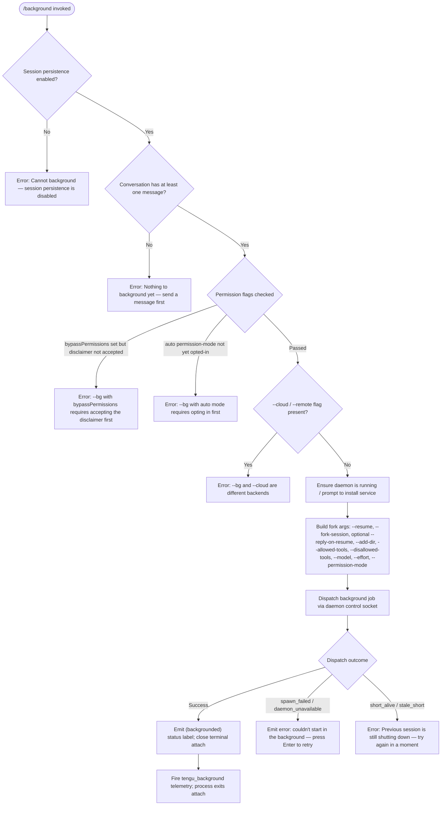

# `/background`

> Analysis basis: CC v2.1.175 bundle.js (AST extraction + Claude interpretation)
> Minimum version: v2.1.175

---

## Overview

The `/background` command (alias: `/bg`) detaches the current interactive REPL session, forks it into the background daemon, and frees the terminal. It serialises the current conversation state, dispatches a background job to the daemon process, and emits a `(backgrounded)` status label, allowing the user to continue working in other windows while Claude continues processing.

---

## Registration

| Field | Value |
|---|---|
| type | `local-jsx` |
| name | `background` |
| description | `Send this session to the background and free the terminal` |
| aliases | `["bg"]` |
| argumentHint | `[prompt]` |
| immediate | `null` |
| module_id | `zWK` |
| load_inline | `true` |
| loc_byte | `13379437` |
| loc_byte_end | `13379677` |
| loc_line | `9774` |
| arbor_handler.name | `qA5` |
| arbor_handler.fqn | `claude-2.1.175::qA5` |
| arbor_handler.kind | `AsyncFunction` |
| arbor_handler.resolution_path | `module_id` |
| arbor_handler.n_hits | `0` |

Analysis basis: CC v2.1.175 bundle.js:+13379437

---

## Input Branching

The command exhibits five or more distinct decision paths — represented as a Mermaid flowchart below.



Analysis basis: CC v2.1.175 bundle.js:+13378710 (handler `qA5`), +13374234 (arg construction), +13378791 (persistence guard), +13378967 (empty-session guard), +13375686 (telemetry).

---

## Behavioral Spec

### Guard: Session Persistence Check

```
function checkPersistence(appState):
    if not appState.sessionPersistenceEnabled:
        throw UserFacingError(
            "Cannot background — session persistence is disabled, " +
            "so the forked job would have nothing to resume."
        )
```

Analysis basis: CC v2.1.175 bundle.js:+13378791

---

### Guard: Non-Empty Conversation Check

```
function checkConversationNotEmpty(messages):
    if messages is empty or has no user-turn:
        throw UserFacingError(
            "Nothing to background yet — send a message first."
        )
```

Analysis basis: CC v2.1.175 bundle.js:+13378967

---

### Guard: Permission and Mode Pre-flight

```
function checkPermissionGates(flags, settings):
    if flags.bypassPermissions and not settings.dangerouslySkipPermissionsAccepted:
        throw UserFacingError(
            "--bg with bypassPermissions requires accepting the disclaimer first. " +
            "Run `claude --dangerously-skip-permissions` once interactively."
        )

    if flags.permissionMode == "auto" and not settings.autoModeOptedIn:
        throw UserFacingError(
            "--bg with auto mode requires opting in first. " +
            "Run `claude --permission-mode auto` once interactively."
        )
```

Analysis basis: CC v2.1.175 bundle.js:+13372376, +13372538

---

### Guard: Cloud / Remote Conflict

```
function checkCloudConflict(rawArgs):
    if any arg starts with "--cloud" or "--remote":
        throw UserFacingError(
            "--bg and --cloud are different backends. " +
            "Use `claude --cloud '<task>'` directly to start a cloud session."
        )
```

Analysis basis: CC v2.1.175 bundle.js:+13321251, +13321398

---

### Daemon Availability

The command delegates to a daemon-ensure helper (`Jd` / daemon ensure running, +13311192) before dispatching. If no daemon is running, it either prompts the user interactively ("Install as a service now? [y/N/never, or 'once' just for now]", +13318851) or falls back to a transient spawn. A 2 000 ms flush timeout (+13374178) is applied while awaiting acknowledgement.

```
async function ensureDaemon(options):
    result = await daemonEnsureRunning(options)  // includes install-prompt flow
    if result == "not_available":
        emit telemetry("tengu_bg_daemon_spawn_failed")
        throw DaemonUnavailableError
    return result.controlSocket
```

Analysis basis: CC v2.1.175 bundle.js:+13311192, +13374170 (`C4` timeout helper, 2000 ms), +13312797

---

### Argument Construction

The handler builds the child-process argument list from the current REPL state and any options passed to the command.

```
function buildForkArgs(sessionId, userArgs, state):
    args = []

    // Resume and fork markers
    args.push("--resume", sessionId)
    args.push("--fork-session")

    // Optional inline prompt forwarded as --reply-on-resume
    if userArgs.prompt:
        args.push("--reply-on-resume", userArgs.prompt)

    // Working directories
    for dir in state.addedDirs:
        args.push("--add-dir", dir)

    // Tool allow/deny lists
    for tool in state.allowedTools:
        args.push("--allowed-tools", tool)
    for tool in state.disallowedTools:
        args.push("--disallowed-tools", tool)

    // Model / effort / permission overrides (pass-through)
    if state.model:    args.push("--model",           state.model)
    if state.effort:   args.push("--effort",          state.effort)
    if state.permMode: args.push("--permission-mode", state.permMode)

    return args
```

Analysis basis: CC v2.1.175 bundle.js:+13374234 (`--resume`), +13374247 (`--fork-session`), +13374289 (`--reply-on-resume`), +13374341 (`--add-dir`), +13374376 (`--allowed-tools`), +13374417 (`--disallowed-tools`), +13374448 (`--model`), +13374477 (`--effort`), +13374494 (`--permission-mode`)

---

### Dispatch to Daemon

Dispatching is performed by the background dispatch subsystem (entry `wjA`, +13349802 / `n_5`, +13355072). The job is submitted via the daemon's control socket using `rY` (socket connect, +13350222) with a 6 000 ms acknowledgement timeout (+13350310).

```
async function dispatchBackgroundJob(controlSocket, forkArgs):
    jobId = randomUUID()
    dispatchFile = path.join(tmpDir, jobId)

    writeDispatchFile(dispatchFile, forkArgs)

    ack = await sendControlMessage(controlSocket, {
        type: "dispatch",
        jobId: jobId,
        args:  forkArgs
    }, ackTimeoutMs=6000)

    if ack.error == "EALIVE":
        throw ShortAliveError("Previous session is still shutting down — try again in a moment")

    if ack.error == "ESTALE":
        throw StaleError

    return ack.jobId
```

Analysis basis: CC v2.1.175 bundle.js:+13351923 (telemetry `tengu_bg_dispatch`), +13350310 (6 000 ms timeout), +13350412 (`EALIVE`), +13359344 (short-alive message), +11763207 (`ENOCONN`)

---

### Post-Dispatch UI

After a successful dispatch the handler renders a `(backgrounded)` status label in the REPL and terminates the foreground terminal attachment.

```
function renderBackgroundedStatus(sessionLabel):
    display inline label: "(backgrounded)"
    close PTY attach / stdin pipe
    emit telemetry("tengu_background", { status: "repl_background_fork" })
```

The literal `"(backgrounded)"` is emitted at +13376421; `"repl_background_fork"` at +13375538.

Analysis basis: CC v2.1.175 bundle.js:+13376421, +13375538, +13375686

---

### Error / Retry UI

On spawn failure, the user sees the message `"couldn't start in the background — press Enter to retry"` (+13375241) rather than an unhandled exception. The `spawn_failed` and `queued_for_later` outcome literals live at +13375612 and +13375561 respectively.

```
function handleSpawnFailure(error):
    emit telemetry("tengu_background_spawn_failed")
    display: "couldn't start in the background — press Enter to retry"
    await userPressEnter()
    return retryDispatch()
```

Analysis basis: CC v2.1.175 bundle.js:+13374878 (telemetry), +13375241 (message), +13375612 (`spawn_failed`)

---

## State & Side Effects

| Item | Detail |
|---|---|
| Telemetry | `tengu_background` (+13375686); `tengu_background_spawn_failed` (+13374878); `tengu_background_already_bg` (+13378724); `tengu_bg_dispatch` (+13351923); `tengu_bg_dispatch_fallback` (+13352453); `tengu_bg_dispatch_rescued` (+13358404); `tengu_bg_daemon_cold_start_ask` (+13312278); `tengu_bg_daemon_spawn_failed` (+13312797); `tengu_bg_daemon_cold_start_ask_answer` (+13318926); `tengu_bg_daemon_install` (+13311713); `tengu_bg_daemon_service_stale_exec` (+13311330); `tengu_bg_daemon_service_poll_fallthrough` (+13311954); `tengu_bg_dispatch_stale_drop` (+13865425); `tengu_background_already_bg` (+13378724) |
| Daemon socket | Writes to the daemon's Unix control socket; may prompt to install daemon service interactively |
| Dispatch file | Writes a temporary dispatch file under a UUID-named path in a `tmp` subdirectory (+13355043); cleaned up after ack |
| PTY / stdin | Closes / detaches the foreground PTY attachment once the job is confirmed dispatched |
| appState changes | Session label updated to `"(backgrounded)"` (+13376421); session persistence flag read at guard time |
| Process exit | The foreground `claude` process calls `process.exit` after handing off (+13353161 via `u1`) |
| Flush timeout | 2 000 ms max wait to flush pending data before detaching (+13374178, +13374183 "flush timeout") |
| Sound | None observed in traversal |

---

## Version History

| Version | Change |
|---|---|
| v2.1.175 | Initial analysis |

---

## Common Mistakes

1. **Running `/background` before sending any message.** The guard at +13378967 rejects the command with "Nothing to background yet — send a message first." — you must have at least one conversation turn.
2. **Combining `/background` with `--cloud` or `--remote`.** These target different execution backends; the CLI will error immediately with the conflict message (+13321251).
3. **Using `bypassPermissions` without prior interactive opt-in.** Even if the flag is configured, the background command requires the disclaimer to have been accepted in a prior foreground session (+13372376).
4. **No running daemon and non-interactive environment.** The daemon install prompt is interactive; in CI/headless contexts the daemon may never start and the dispatch will fail silently with `tengu_background_spawn_failed`.
5. **Retrying too quickly after a previous `/background`.** The `EALIVE` / `short_alive` guard (+13350412) blocks a new dispatch while the prior forked session is still shutting down — wait a moment before retrying.

---

## Appendix — Identifier Mapping

> For bundle debugging only. Identifiers change across versions.

| Identifier | Role |
|---|---|
| `qA5` | Main handler for `/background` (AsyncFunction, resolved via module_id `zWK`) |
| `OQ8` | Background REPL fork orchestrator (builds args, manages dispatch flow) |
| `n_5` | Background job dispatch core (session fork, socket comms, retry logic) |
| `zo` | Session fork initialiser (UUID generation, tmp dir creation, gate checks) |
| `wjA` | Dispatch-to-daemon helper (write dispatch file, connect control socket, await ack) |
| `Jd` | Daemon ensure-running helper (checks/spawns daemon, handles install prompt) |
| `rY` | Control socket connect helper (Unix socket client, timeout, JSON framing) |
| `wp8` | Daemon socket reconnect wrapper |
| `OU6` | Daemon cold-start / service-installation flow |
| `_A5` | Permission pre-flight checker (bypassPermissions, auto-mode guards) |
| `C4` | Flush-timeout helper (Promise.race with 2 000 ms setTimeout) |
| `u1` | CLI error reporter + `process.exit` wrapper |
| `zQ8` | Post-dispatch REPL UI renderer (`(backgrounded)` label, daemon-worker labelling) |
| `R46` | Session rename / fork telemetry emitter |
| `kT` | Agent query orchestrator (downstream of fork) |
| `GR8` | App-state getter/setter used during fork |
| `UTK` | Main agent turn executor (reached after fork dispatch) |
| `MZ` | Message normalisation / context builder |
| `YV5` | Daemon supervisor message-loop handler (attach, resize, ping, stream) |
| `DCH` | MCP connection manager (reached via tool-list propagation) |
| `SH` | Structured logger / error emitter |
| `TH` | String-coerce utility |
| `RH` | JSON.stringify wrapper |
| `z6` | Telemetry / observability event emitter |
| `i8` | Grace-period / abort-signal helper |
| `aU` | Daemon shutdown sequencer (Promise.race + process.exit) |
| `K6` | String-formatting primitive |
| `nOH` | Environment / mode resolver (production / test) |
| `ShH` | Store accessor (reads async-local-storage session context) |
| `KM` | Context-store reader |
| `wT` | Async-local-storage `.getStore()` wrapper |
| `P9` | Daemon-worker IPC frame builder |
| `_OH` | Detach-request sender (writes `detach-request` control frame) |
| `mr` | Raw IPC write helper |
| `IKH` | PTY / attach teardown utility |
| `hjK` | Session snapshot / metadata builder |
| `EjA` | Hook-registration helper |
| `bZ` | Secondary hook-registration path |
| `hVH` | Flattened session-list helper |
| `mK8` | Config-watcher / file-watch registration |
| `C6` | Config loader (reads project/user config files) |
| `U7H` | Config file parser (JSON, backup, stat) |
| `sp4` | Config file-watcher setup (watchFile / unwatchFile) |
| `iC` | Settings-layer reader (user / local / flag / policy) |
| `I8` | Settings-merger |
| `rDA` | Cloud/remote flag detector |
| `AA5` | Allowed-tool prefix checker |
| `LQ8` | Session-ID flag parser (`--session-id`, `--session-id=`) |
| `fWK` | Resume flag parser (`--resume=`, `-r=`, `-r`) |
| `dXH` | Full flag-to-option parser (all CLI flags to structured object) |
| `LWK` | Disallowed-tool prefix checker |
| `b6` | Async-context store reader |
| `W_` | Session-context writer (iG) |
| `n7` | Atomic file-write helper (random tmp + rename) |
| `JO` | Atomic write primitive (randomBytes, writeFile, rename, chmod) |
| `kJ` | State-file cache invalidation helper |
| `Vq` | Background job state reader (reads job `.json` files from daemon jobs dir) |
| `Af` | Job file-path resolver (joins jobs dir + job ID) |
| `_Z` | Base jobs-directory resolver |
| `U8H` | Conversation history scanner (reads transcript files for gitignore-style link detection) |
| `ig8` | Low-memory / grace retirement emitter |
| `zU6` | Free-memory reader wrapper |
| `v2K` | Memory-pressure telemetry emitter |
| `UG6` | Gitignore / allowed-paths config reader |
| `EfA` | Timing helper (Date.now + XM6 threshold) |
| `lF7` | Session rename orchestrator (AbortSignal, model call, name generation) |
| `GKK` | Rename result formatter |
| `BU8` | Context-message assembler for rename prompt |
| `kR` | Post-rename commit helper (writes name, fires hooks) |
| `bf` | Transcript / history file accessor |
| `mx8` | Conversation serialiser (hashes, image handling, writeFile) |
| `MZ` | Message-normalisation pipeline (see above) |
| `TUH` | Agent turn wrapper (FfA + UTK) |
| `UTK` | Full agent turn executor (tool dispatch, streaming, hooks) |
| `FfA` | Fallback-request builder |
| `MW` | Provider / backend selector |
| `n_` | Provider key resolver |
| `jL` | EA8 API endpoint builder |
| `dD_` | Login managed-key / sk-ant- key classifier |
| `U1` | Auth-token container (Xl, J1, jO) |
| `AjH` | Auth-header builder (UD_) |
| `aE` | Request finaliser |
| `Zf` | Message filter helper |
| `Cu8` | Tool-result inclusion checker |
| `Ah` | Content-block array normaliser |
| `yr` | Block-type filter (Array.isArray + Zf) |
| `XKH` | Starts-with guard for header fields |
| `V$` | h6 + z4 feature-flag router |
| `nQ` | Alternate h6 + z4 router |
| `h6` | Feature-gate iG reader |
| `z4` | Feature-gate registration helper |
| `u9` | pvA.register hook registrar |
| `pu8` | Compact-boundary sentinel checker |
| `FJ` | Compact boundary value |
| `Pc` | ZY paint / UI refresh helper |
| `ZyK` | Vim-mode motion dispatcher |
| `qyK` | Yank / visual-op handler |
| `MyK` | Visual-replace handler |
| `zyK` | Visual-case handler |
| `YyK` | Visual-paste handler |
| `eIK` | Indent operation handler |
| `HyK` | Swap / visual-indent handler |
| `W2A` | Operator-motion table builder |
| `D` | Subprocess / background-process manager (spawn, kill, adopt) |
| `k` | Scheduler / heartbeat tick (retireIfSettled, respawnIfIdleStale) |
| `l` | Grace-clock manager (shiftGraceClocksForward) |
| `R` | Raw PTY write helper |
| `c` | Worker retirement helper (Su6, _HK) |
| `S` | Supervisor command executor (csK, vM, SH) |
| `F` | Idle-timeout flush helper (clearTimeout / setTimeout / w.write) |
| `w` | PTY output router (_ZH, q.write, E config) |
| `Q` | Socket lifecycle manager (on/once connect, drain, pong, auth) |
| `b` | Register / clipboard manager |
| `G` | Terminal UI event handler (repaint, key-down, onChange) |
| `P` | PTY line buffer / framing parser |
| `X` | MCP server connection pool |
| `M` | MCP state applier (DCH + ki8) |
| `sGA` | MCP server-list reconciler |
| `ki8` | MCP update applier (applyMcpUpdate) |
| `AG` | MCP cleanup orchestrator |
| `YCH` | MCP slot l2H helper |
| `Hi9` | MCP connection state checker |
| `RJ8` | MCP retry-backoff helper |
| `yJ8` | MCP Sf state helper |
| `$i9` | MCP after-connect actions ($28.then) |
| `$F_` | MCP final-state committer |
| `LR` | MCP connection result logger |
| `DP8` | OAuth authenticate-tool handler |
| `jP8` | OAuth callback-URL tool handler |
| `oB_` | MCP capability checker |
| `YL` | MCP error logger |
| `Ki9` | MCP Kg status helper |
| `W66` | parseInt wrapper (base 10) |
| `D28` | parseInt wrapper (alt) |
| `N` | Config-content normaliser / header parser |
| `J9f` | Config sub-parser (LI, ze8, BvA) |
| `nf` | Config value redactor / transformer |
| `mgH` | LIA config helper |
| `G9f` | Config file loader with byte-length tracking |
| `hjK` | (see above — session metadata builder) |
| `EsK` | Stall / timing watchdog helper |
| `SH` | (see above) |
| `uHH` | Timing-safe buffer comparison (crypto) |
| `Kw` | NJH notification helper |
| `NJH` | z6 notification emitter |
| `zV5` | Stall-detection math helper |
| `ig8` | (see above) |
| `nTA` | Heartbeat / nudge message builder |
| `DV5` | Stream-state enum |
| `C8` | PTY background-session label constant (`"background session"`) |
| `o6` | Platform path resolver |
| `nV_` | Path normaliser |
| `ru` | Key-prefix stripper (startsWith / slice) |
| `t19` | Directory-tree walker for config search |
| `rV_` | Backup-directory path builder |
| `sp4` | (see above) |
| `yF` | Config watch debounce helper |
| `Hm` | Permission-mode validator |
| `iDA` | Permission flag extractor |
| `$n` | Tool-name set membership checker (zf9) |
| `MWK` | Flag parser continuation |
| `r2K` | H.map transformer |
| `l_5` | va6 + a6 async-context helpers |
| `va6` | a6 / R4H / N context builder |
| `HA5` | Allowed-path list builder |
| `OjA` | Dispatch-result parser (matchAll, slice) |
| `gpH` | Socket-path builder (k$.join + MOH) |
| `uKH` | eW.readFile + OHK socket reader |
| `a2K` | Timing / date dispatch helper |
| `qD` | Dispatch-error classifier |
| `r_5` | Resume-path helper |
| `TAH` | m7H / Hy telemetry bridge |
| `m7H` | Hy low-level emitter |
| `$8H` | Post-fork cleanup helper |
| `ZC` | Session-state serialiser |
| `l86` | (UI layout helper) |
| `iWH` | (UI state helper) |
| `t6` | d + A6 fork-result handler |
| `XM6` | Timing threshold constant |
| `h9H` | Rename abort-signal setup |
| `TR8` | Rename result committer |
| `zR` | Session-name sanitiser (regex replace + randomBytes) |
| `fKH` | z4 + zpH feature-gate pair |
| `jU` | CE7 / hb8 / kH / CH post-turn handler |
| `XE` | Extra metadata emitter |
| `tb6` | rE7 tombstone-set checker |
| `pHH` | (UI progress helper) |
| `Vx8` | (UI viewport helper) |
| `aQq` | tb6 wrapper |
| `_3H` | FJ / qbL / H.filter tool-result assembler |
| `oE7` | d + A6 post-turn error handler |
| `GR8` | (see above — app-state getter/setter) |
| `u8` | P + Ok.randomUUID message-ID generator |
| `GKK` | (see above) |
| `dC` | H.trim string cleaner |
| `BU8` | (see above) |
| `kR` | (see above) |
| `ux8` | Raw model-output deserialiser |
| `uZ7` | Array-tree traversal helper |
| `Rdq` | pZ7 post-process helper |
| `rG` | iG feature-reader |
| `iG` | Feature-flag store reader (base) |
| `jL` | EA8 endpoint builder |
| `dD_` | XO / startsWith / slice key-type classifier |
| `U1` | Xl / J1 / jO credential container |
| `AjH` | UD_ auth-header assembler |
| `Zg` | Array.isArray guard |
| `Ah` | (see above) |
| `yr` | (see above) |
| `XKH` | (see above) |
| `V$` | (see above) |
| `nQ` | (see above) |
| `P9` | fjH daemon-worker frame builder |
| `D98` | Raw IPC frame type constant |
| `Yaq` | qx8 / C8 IPC decode helper |
| `qx8` | IPC frame decoder |
| `mr` | (see above) |
| `nOH` | (see above) |
| `K6` | String coerce primitive |
| `M0K` | Mode-label mapper |
| `vu` | Environment classifier (production/test) |
| `ShH` | P0 + KM store accessor |
| `P0` | Store value extractor |
| `KM` | wT context reader |
| `wT` | sD_.getStore async-local-storage wrapper |

---

Note: index built via Arbor fallback; some signals (telemetry, literals) may be missing — see arbor-fallback.js.