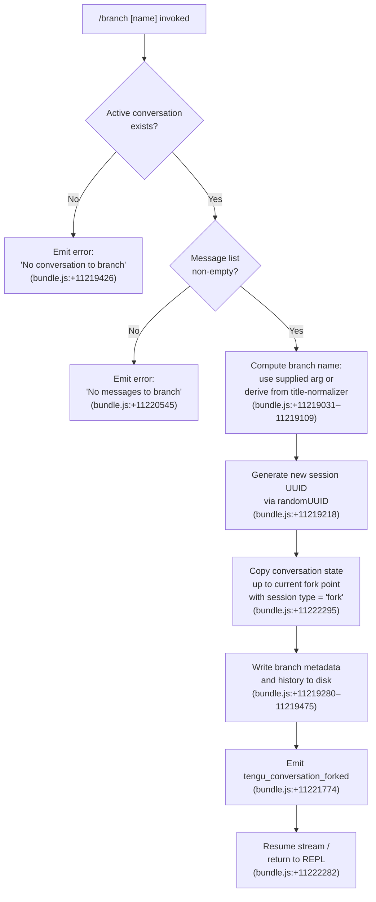

# `/branch`

> Analysis basis: CC v2.1.175 bundle.js (AST extraction + Claude interpretation)
> Minimum version: v2.1.175

---

## Overview

The `/branch` command creates a divergent copy ("fork") of the current conversation at the point it is invoked, preserving all messages up to that moment in a new session. The new session is assigned an optional user-supplied name, or a default title derived from the original conversation, and is registered as a `fork` session type. Telemetry event `tengu_conversation_forked` is emitted upon success.

---

## Registration

| Field | Value |
|---|---|
| type | `local-jsx` |
| name | `branch` |
| description | `Create a branch of the current conversation at this point` |
| argumentHint | `[name]` |
| module_id | `dLA` |
| load_inline | `true` |
| loc_byte | `12778397` |
| loc_byte_end | `12778574` |
| loc_line | `9004` |
| arbor_handler.name | `jI7` |
| arbor_handler.fqn | `claude-2.1.175::jI7` |
| arbor_handler.kind | `AsyncFunction` |
| arbor_handler.resolution_path | `module_id` |
| arbor_handler.n_hits | `0` |

Analysis basis: CC v2.1.175 bundle.js:+12778397

---

## Input Branching

The handler has four distinct paths based on conversation state at call time. A Mermaid flowchart is used.



---

## Behavioral Spec

### Handler Entry — `branchCommandHandler` (bundle identifier: `jI7`)

The handler is an `AsyncFunction` resolved through the `module_id` path (`dLA`).

```
async function branchCommandHandler(commandArgs, appContext):
    session = getCurrentSession(appContext)          // Qrq -> h6
    if session is null or undefined:
        raise UserError("No conversation to branch") // bundle.js:+11219426

    messages = session.messages
    if messages is empty:
        raise UserError("No messages to branch")     // bundle.js:+11220545

    branchName = normalizeBranchName(commandArgs)    // Frq, bundle.js:+11219031
    newSessionId = generateUUID()                    // grq -> prq.randomUUID, bundle.js:+11219218

    branchMetadata = buildBranchMetadata(
        sourceSession  = session,
        branchName     = branchName,
        sessionType    = "fork",                     // bundle.js:+11222295
        defaultTitle   = "Branched conversation",    // bundle.js:+11218979
        timestamp      = new Date().toISOString()    // bundle.js:+11221864
    )

    await writeBranchToDisk(newSessionId, branchMetadata, messages)
                                                     // grq, bundle.js:+11219280–11219475

    emitTelemetry("tengu_conversation_forked", { sessionId: newSessionId })
                                                     // bundle.js:+11221774

    resumeInputStream()                              // Qrq -> H.resume, bundle.js:+11222282
    return                                           // exits handler; REPL continues
```

Analysis basis: CC v2.1.175 bundle.js:+11222559

---

### Branch Name Normalization — `normalizeBranchName` (bundle identifier: `Frq`)

```
function normalizeBranchName(rawArg):
    // Attempt to find an existing session by the supplied name
    existing = sessionList.find(s => matchesName(s, rawArg))  // _.find, bundle.js:+11219031

    // Strip or replace characters that are invalid in branch identifiers
    cleaned  = rawArg.replace(invalidCharsPattern, "")        // A.replace, bundle.js:+11219109

    // Fall back to toLowerCase canonical form for storage
    return cleaned.toLowerCase()                              // A.toLowerCase, bundle.js:+16904280
```

Analysis basis: CC v2.1.175 bundle.js:+11219031

---

### Branch Session Construction — `buildBranchSession` (bundle identifier: `grq`)

```
async function buildBranchSession(sourceSession, branchId, branchName):
    // Serialize existing conversation history to a temp read stream
    // then pipe through a line-by-line readline interface
    tmpPath   = computeTempPath(branchId)                        // bundle.js:+11219280
    readStream  = fs.createReadStream(tmpPath, { encoding: "utf8" })
                                                                  // bundle.js:+11219329 ("utf8")
    rl          = readline.createInterface(readStream)           // bundle.js:+11219569

    // Apply content-replacement pass over each message line
    // message type filter: keep only "text" content blocks
    filtered  = lines.filter(l => l.type === "text")            // bundle.js:+11219052

    // Write resulting JSONL to the new branch file
    writeStream = fs.createWriteStream(branchPath, { mode: 0o600 })
                                                                  // bundle.js:+11219475 (384 = 0o600)
    for line in filtered:
        writeStream.write(serializeLine(line))                   // bundle.js:+11219758

    await streamFinished(writeStream)                            // bundle.js:+11220955

    // Associate metadata: "content-replacement" marker
    metadata.marker = "content-replacement"                      // bundle.js:+11219906

    // Attach progress tracking token
    metadata.type   = "progress"                                 // bundle.js:+11220463

    // Handle fallback: if model refused, tag model_refusal_fallback
    if isRefusal(line):
        metadata.fallback = "model_refusal_fallback"             // bundle.js:+11220220

    return { branchId, branchName, metadata }
```

Analysis basis: CC v2.1.175 bundle.js:+11219218

---

### Fork-Point History Copy — `copyConversationHistory` (bundle identifier: `Qrq`)

```
async function copyConversationHistory(session, branchId, options):
    // Resolve the root worktree to handle git-worktree environments
    worktreeInfo = detectWorktree(session.cwd)     // dr -> q$H, bundle.js:+9299553 ("worktree")

    // Stamp the branch fork date/time
    forkTimestamp  = new Date()
    isoStamp       = forkTimestamp.toISOString()   // bundle.js:+11221864
    epochMs        = forkTimestamp.getTime()        // bundle.js:+11221913

    // Build the new session title using either the user-supplied name
    // or "auto" title generation mode
    titleMode = options.name ?? "auto"              // bundle.js:+11221728 ("auto")

    // Invoke session-rename path with "custom-title" marker if name was supplied
    if options.name:
        renameSession(branchId, options.name,
                      marker = "custom-title")      // cR, bundle.js:+13505770
    else:
        setAgentName(branchId,
                     marker = "agent-name")         // g$H, bundle.js:+13508793

    // Record the fork relationship
    session.forkType = "fork"                       // bundle.js:+11222295
    emitTelemetry("tengu_conversation_forked", { id: branchId })
                                                    // bundle.js:+11221774
    resumeStream(session)                           // bundle.js:+11222282
```

Analysis basis: CC v2.1.175 bundle.js:+11221470

---

### Worktree Detection — `detectWorktree` (bundle identifier: `q$H`)

```
function detectWorktree(cwd):
    // Run: git worktree list --porcelain
    result = runGitCommand(["worktree", "list", "--porcelain"])
                                                    // bundle.js:+9299553, 9299564, 9299571
    // Parse output lines; each worktree entry starts with "worktree "
    entries = result.split("\n")
                    .filter(l => l.startsWith("worktree "))
                                                    // bundle.js:+9299772
    // Strip the 9-character prefix ("worktree ") to get the path
    paths = entries.map(l => l.slice(9))            // bundle.js:+9299806 (value: 9)

    emitTelemetry("tengu_worktree_detection", { count: paths.length })
                                                    // bundle.js:+9299653

    // Return the worktree path matching cwd, or null
    return paths.find(p => p === cwd) ?? null
```

Analysis basis: CC v2.1.175 bundle.js:+9299509

---

### Disk Write — `writeBranchFiles` (bundle identifier: `grq` sub-path)

```
async function writeBranchFiles(branchId, metadata, history):
    // Ensure the target directory exists (recursive mkdir)
    await fs.mkdir(branchDir, { recursive: true })  // bundle.js:+11219280

    // Pipe source JSONL via read stream at chunk size 448 bytes
    // (buffer constant found at bundle.js:+11219311, value: 448)
    readStream = fs.createReadStream(sourcePath, {
        encoding : "utf8",                          // bundle.js:+11219362
        highWaterMark : 448                         // bundle.js:+11219311
    })

    // Listen for stream events; "open" signals readiness
    readStream.once("open", handler)                // bundle.js:+11219388 ("open")

    // Write to output; mode 0o600 (value 384, bundle.js:+11219521)
    writeStream = fs.createWriteStream(destPath, { mode: 384 })

    // On stream error: emit SH (errorReporter) with error context
    // and clean up with fs.unlink
    on("error"):
        reportError(err)                            // SH, bundle.js:+11219461
        await fs.unlink(destPath)                   // bundle.js:+11219689

    await streamFinished(writeStream)               // bundle.js:+11220955
```

Analysis basis: CC v2.1.175 bundle.js:+11219280

---

### Error Conditions

| Condition | Message | Source loc |
|---|---|---|
| No active conversation found | `"No conversation to branch"` | bundle.js:+11219426 |
| Active conversation has no messages | `"No messages to branch"` | bundle.js:+11220545 |
| Disk write fails (ENOENT) | propagates `ENOENT` system error | bundle.js:+179741 |
| Unknown runtime failure | `"Unknown error occurred"` | bundle.js:+11222443 |

---

## State & Side Effects

| Item | Detail |
|---|---|
| Telemetry | `tengu_conversation_forked` (bundle.js:+11221774); additionally inherits infra events: `tengu_worktree_detection` (bundle.js:+9299653), `tengu_session_renamed` (bundle.js:+13505862), `tengu_agent_name_set` (bundle.js:+13508891) |
| Session registry | New session entry written to disk under a freshly generated UUID; session type set to `"fork"` (bundle.js:+11222295) |
| Conversation history | Source JSONL streamed and copied to new branch file; chunk size 448 bytes (bundle.js:+11219311); file mode `0o600` (bundle.js:+11219521) |
| Default title | New branch receives title `"Branched conversation"` unless the user supplied a `[name]` argument (bundle.js:+11218979) |
| Title/naming | If `[name]` supplied → `custom-title` rename path (bundle.js:+13505770); else → `auto` / `agent-name` path (bundle.js:+11221728, +13508793) |
| Input stream | Source REPL stream is resumed after branching completes (bundle.js:+11222282) |
| Hook registration | <!-- TODO: not found in depth-2 traversal; needs --depth 4 --> |
| appState changes | <!-- TODO: not found in depth-2 traversal; needs --depth 4 --> |
| Sound | None observed in traversal |

---

## Version History

| Version | Change |
|---|---|
| v2.1.175 | Initial analysis |

---

## Common Mistakes

1. **Invoking `/branch` when no conversation is active** — the command requires at least one exchange to exist; invoking it in a fresh, empty session produces the error `"No conversation to branch"` (bundle.js:+11219426).
2. **Expecting an exact copy including future messages** — the fork captures only messages up to the invocation point; subsequent messages in the source session are not reflected in the branch.
3. **Supplying names with special characters** — the name argument is sanitized by `normalizeBranchName` (`Frq`), which strips invalid characters and lower-cases the result; the stored branch name may differ from the raw input (bundle.js:+11219109).
4. **Assuming `/branch` switches the active session** — the command creates a new session but does not automatically switch the REPL into it; the user must explicitly navigate to the branched session.
5. **Confusing `/branch` with git branching** — while worktree detection runs internally (bundle.js:+9299553), the command branches the *conversation* history, not the git repository state.

---

## Appendix — Identifier Mapping

> For bundle debugging only. Identifiers change across versions.

| Identifier | Role |
|---|---|
| `jI7` | Main handler (`branchCommandHandler`) — AsyncFunction entry point for `/branch` |
| `Qrq` | Fork-point history copy orchestrator (`copyConversationHistory`) |
| `grq` | Branch session construction and disk-write pipeline (`buildBranchSession`) |
| `Frq` | Branch name normalizer (`normalizeBranchName`) |
| `DI7` | Duplicate/seen-ID tracker within the fork pipeline |
| `dr` | Worktree + completion-source resolver called from `Qrq` |
| `q$H` | Git worktree detection subprocess runner |
| `Z0K` | File-system path completion helper used during worktree resolution |
| `UUH` | Buffer accumulator used during history streaming |
| `cR` | Session rename handler (`custom-title` path) |
| `g$H` | Agent-name setter (`agent-name` path) |
| `oOH` | Low-level session metadata append writer |
| `Wl` | Persistent state write helper (reads/writes JSON config) |
| `HJ6` | File-based state lock/write utility |
| `Uv` | String escape utility used during name normalization |
| `H$` | Completion-source lookup helper |
| `SH` | Error reporter / structured error emitter |
| `GA` | Base error constructor wrapper |
| `K6` | String coercion utility |
| `RH` | JSON serializer wrapper (`JSON.stringify` façade) |
| `d6` | JSON parser wrapper (`JSON.parse` façade) |
| `TH` | String coercion helper |
| `I7` | Promise-based event-emission helper |
| `iG` | Core logging sink |
| `h6` | Structured log emitter (calls `iG`) |
| `W_` | Secondary log/trace emitter (calls `iG`) |
| `EC` | Log-level gate (calls `iG`) |
| `sM` | Path+content log formatter |
| `Nh` | Combined log path builder (calls `h6`, `Mk`, `sM`) |
| `Mk` | Metadata key formatter |
| `y8` | Error-type classifier |
| `E8` | Raw event emitter primitive |
| `J9` | String slice utility (indexOf + slice) |
| `n9` | AsyncLocalStorage store accessor |
| `hjK` | Daemon status-file writer |
| `Rp6` | Daemon status path builder |
| `W` | Top-level API request dispatcher |
| `J56` | Request option builder |
| `vaK` | Object-key enumerator helper |
| `dSH` | Conversation file reader / JSONL loader |
| `btH` | `.claude` directory writer |
| `B1H` | Branch history file assembler |
| `FG9` | Message filter for expired/stale entries |
| `NcK` | Prompt-summary formatter |
| `oTA` | Background session lifecycle manager |
| `dTA` | Daemon transport / socket-claim handler |
| `LXA` | Daemon roster entry writer |
| `qV5` | Daemon claim timeout controller |
| `AV5` | Daemon claim-frame builder |
| `Vq` | Background session state reader |
| `ZO` | Session active-state resolver |
| `dXH` | Context-path parser / tool-filter |
| `n7` | Prompt-file path resolver |
| `ef6` | Async task scheduler with telemetry |
| `pu6` | Session socket path builder |
| `OOH` | Session socket-path resolver |
| `aQ` | Session reconnect helper |
| `mu6` | Session socket mkdir helper |
| `uZ` | Platform-aware socket-path builder |
| `Xv` | Binary frame encoder (Buffer write helpers) |
| `Pm8` | Binary frame decoder (Buffer read helpers) |
| `Q` | Background PTY session controller |
| `l` | Scheduled-task loop processor |
| `C` | PTY write-with-timeout helper |
| `D` | Background session dispatcher / main daemon loop |
| `b` | Daemon child-process host |
| `w` | Daemon supervisor restart handler |
| `N` | Environment variable builder for child processes |
| `Ls` | Lock-file utility |
| `S` | Session message sender |
| `z` | Daemon stop sequence |
| `kH` | Daemon stop — success telemetry path |
| `CH` | Daemon stop — failure telemetry path |
| `A6` | Telemetry event value formatter |
| `P` | PTY data-chunk accumulator |
| `X` | PTY timeout tracker |
| `c` | PTY stream wrapper |
| `ng8` | macOS memory pressure reader |
| `z6` | Memory-pressure event dispatcher |
| `UG6` | pins.json loader |
| `ZS_` | pins.json path builder |
| `f8L` | Pinned-file directory scanner |
| `Af` | Context-path resolver |
| `Y` | Forced-shutdown handler |
| `KX` | Exit-code selector for forced shutdown |
| `j` | Session-kill iterator |
| `wU` | Post-fork cleanup helper |
| `$` | Daemon destroy handler |
| `hjK` | Daemon status JSON writer |
| `J9` | String slice utility |
| `V$` | Session initializer (calls `h6`, `z4`) |
| `z4` | Module registrar (calls `u9`) |
| `u9` | Plugin/module register call (`pvA.register`) |
| `H$` | Completion-source lookup |
| `Uv` | Regex-escape string helper |
| `o6` | File-path sanitizer |