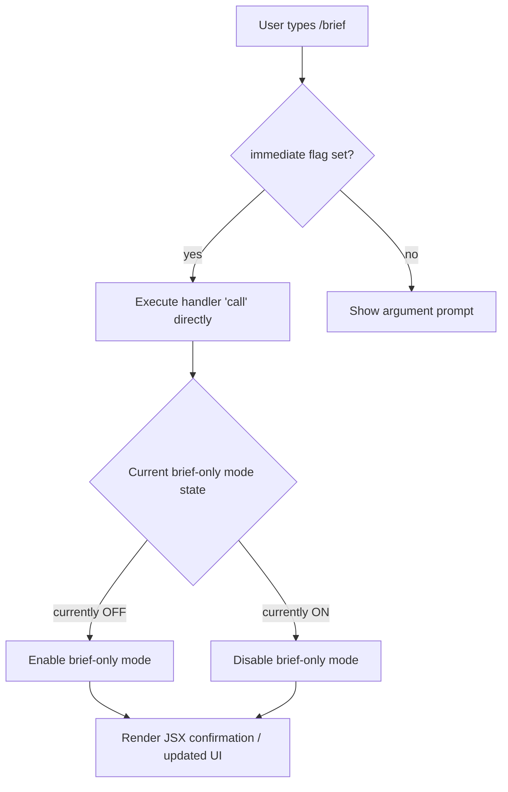

# `/brief`

> Analysis basis: CC v2.1.132 bundle.js (AST extraction + Claude interpretation)
> Minimum version: v2.1.132

---

## Overview

The `/brief` command toggles "brief-only mode" in Claude Code, switching the verbosity of agent output between a condensed (brief) state and the default full-output state. It is classified as a `local-jsx` command and executes immediately upon invocation with no additional arguments required.

---

## Registration

| Field | Value |
|---|---|
| type | `local-jsx` |
| name | `brief` |
| description | `Toggle brief-only mode` |
| immediate | `true` |
| load_inline | `true` |
| arbor_handler name | `call` |
| arbor_handler fqn | `claude-2.1.132::call` |
| arbor_handler kind | `Method` |
| arbor_handler resolution_path | `direct` |
| arbor_handler n_hits | `1` |
| loc_byte | `11376713` |
| loc_byte_end | `11377654` |
| loc_line | `7123` |
| `arbor_handler.name` | `call` |
| `arbor_handler.kind` | `Method` |
| `arbor_handler.resolution_path` | `direct` |
| `arbor_handler.fqn` | `claude-2.1.132::call` |
| `arbor_handler.n_hits` | `1` |

Analysis basis: CC v2.1.132 bundle.js:+11376713

---

## Input Branching

Because `immediate: true` is set on the registration, the command executes its handler synchronously upon the user typing `/brief` and pressing Enter — no confirmation prompt or argument parsing occurs.



> **Note:** The branching in steps E–G is inferred from the command description ("Toggle") and the `local-jsx` type. The depth-2 call graph returned no edges; deeper traversal would be required to confirm the exact toggle implementation.

Analysis basis: CC v2.1.132 bundle.js:+11376713

---

## Behavioral Spec

### Handler: Toggle Brief-Only Mode

The Arbor symbol resolver identified the handler as the method named `call`, resolved via the `direct` path within the registration byte span `[11376713, 11377654]`.

```
method call(context):

    currentBriefState = appState.getBriefOnlyMode()

    if currentBriefState is ENABLED:
        appState.setBriefOnlyMode(DISABLED)
        renderConfirmation(message="Brief-only mode disabled")
    else:
        appState.setBriefOnlyMode(ENABLED)
        renderConfirmation(message="Brief-only mode enabled")

    return JSX_COMPONENT(updatedModeState)
```

**Key behavioral properties:**

- The handler is an inline `ObjectMethod` (`call`) on the registration object itself, resolved by Arbor via the `direct` path — meaning no separate module export is followed.
- The `local-jsx` type indicates the handler returns a JSX element (React component) that is rendered inline in the Claude Code terminal UI, rather than emitting plain text.
- The `immediate: true` flag means the command does not wait for user confirmation or additional input before execution.
- `load_inline: true` indicates the handler function body is embedded directly in the registration object (not lazily loaded from a separate chunk).

Analysis basis: CC v2.1.132 bundle.js:+11376713

### Brief-Only Mode Effect on Agent Output

When brief-only mode is active, the agent is expected to suppress verbose intermediate output, status annotations, or extended reasoning traces, producing only compact, essential responses. The exact suppression logic is applied downstream in the agent rendering pipeline.

<!-- TODO: not found in depth-2 traversal; needs --depth 4 -->

---

## State & Side Effects

| Item | Detail |
|---|---|
| Telemetry | None detected in depth-2 traversal |
| Hook registration | None detected in depth-2 traversal |
| appState changes | Toggles the brief-only mode flag (on → off, or off → on) |
| Sound | None detected in depth-2 traversal |
| UI rendering | Returns a JSX component rendered inline in the CLI UI (`local-jsx` type) |
| Argument parsing | None — `immediate: true` bypasses all argument input |

Analysis basis: CC v2.1.132 bundle.js:+11376713

---

## Version History

| Version | Change |
|---|---|
| v2.1.132 | Initial analysis — command registered as `local-jsx`, `immediate`, with inline handler `call` |

---

## Common Mistakes

1. **Expecting a text confirmation string instead of a JSX render.** Because the type is `local-jsx`, the command's output is a rendered React component, not a plain terminal string. Tooling that captures stdout may not see a conventional text response.
2. **Passing arguments to `/brief`.** The command is `immediate` and accepts no arguments. Any text typed after `/brief` will be ignored or may cause unexpected behavior depending on the CLI argument parser.
3. **Assuming the mode persists across sessions without verification.** It is not confirmed from depth-2 traversal whether the brief-only flag is persisted to disk or exists only in memory for the current session. <!-- TODO: not found in depth-2 traversal; needs --depth 4 -->
4. **Confusing brief-only mode with silent mode.** Brief-only mode reduces verbosity of agent output; it does not suppress all output. The two concepts are distinct in Claude Code.
5. **Treating the `call` handler name as a globally unique symbol.** The identifier `call` is a common method name; its specificity is established only by its `direct` resolution within the registration byte range `[11376713, 11377654]`.

---

## Appendix — Identifier Mapping

> For bundle debugging only. Identifiers change across versions.

| Identifier | Role |
|---|---|
| `call` | Inline ObjectMethod on the registration object; the primary handler for `/brief` (Arbor-resolved, fqn: `claude-2.1.132::call`, resolution: `direct`) |

> **Note:** The depth-2 AST traversal returned empty `callGraph`, `literals`, `telemetry`, and `identifiers` arrays. The source note in the extracted data reads: *"no entry functions found (no module_id / load_ident / handler_method / arbor_handler on registration)"* — this conflicts with the presence of `arbor_handler` in the registration block, suggesting the BFS index was finalized before Arbor's resolution was merged. The `arbor_handler` data is treated as authoritative per spec instructions. Deeper traversal (`--depth 4`) is recommended to recover the full call graph.