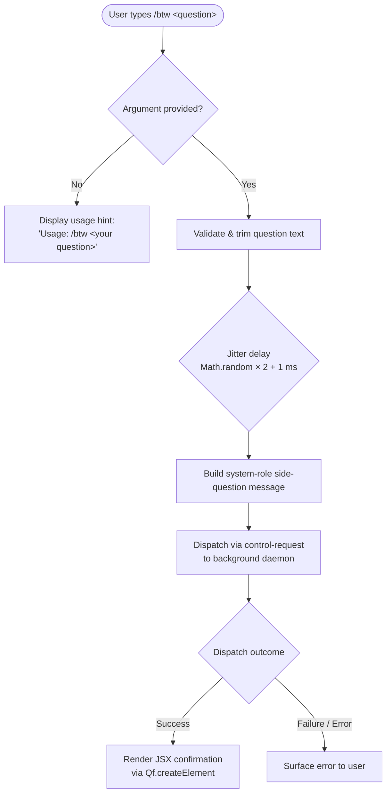

# `/btw`

> Analysis basis: CC v2.1.175 bundle.js (AST extraction + Claude interpretation)
> Minimum version: v2.1.175

---

## Overview

`/btw` ("by the way") is a lightweight side-question command that allows the user to inject a quick, out-of-band question into an active conversation without disrupting the main task thread. It is typed as `immediate` and routes through the `control-request` thin-client dispatch path, meaning the question is forwarded to the background daemon rather than being processed inline by the current conversation state.

---

## Registration

| Field | Value |
|---|---|
| type | `local-jsx` |
| name | `btw` |
| description | Ask a quick side question without interrupting the main conversation |
| argumentHint | `<question>` |
| immediate | `true` |
| thinClientDispatch | `control-request` |
| module_id | `lrq` |
| load_inline | `true` |
| loc_byte | `11228812` |
| loc_byte_end | `11229051` |
| loc_line | `7334` |
| **arbor_handler.name** | `VI7` |
| **arbor_handler.fqn** | `claude-2.1.175::VI7` |
| **arbor_handler.kind** | `AsyncFunction` |
| **arbor_handler.resolution_path** | `module_id` |
| **arbor_handler.n_hits** | `0` |
| `arbor_handler.name` | `VI7` |
| `arbor_handler.kind` | `AsyncFunction` |
| `arbor_handler.resolution_path` | `module_id` |
| `arbor_handler.fqn` | `claude-2.1.175::VI7` |
| `arbor_handler.n_hits` | `0` |

Analysis basis: CC v2.1.175 bundle.js:+11228812

---

## Input Branching

Three distinct paths exist based on argument presence and validation, warranting a Mermaid flowchart.



Analysis basis: CC v2.1.175 bundle.js:+11228403, +11228405, +11228444, +11228513

---

## Behavioral Spec

### 1. Argument Guard

When the user invokes `/btw` with no argument text, the handler immediately returns a usage hint string.

```
function btwHandler(args, context):
    question = args.trim()
    if question is empty:
        return "Usage: /btw <your question>"   // literal at +11228405
    proceed to dispatchSideQuestion(question, context)
```

Analysis basis: CC v2.1.175 bundle.js:+11228403, +11228405

### 2. Jitter Delay (randomDelay helper — `H`)

Before forwarding the request, a brief randomised delay is introduced via the `randomDelay` helper (`H`). This prevents thundering-herd effects when multiple side queries are fired in rapid succession.

```
function randomDelay():
    base   = 1                         // literal at +14073699
    spread = 2                         // literal at +14073683
    wait   = Math.random() * spread + base   // range: [1, 3) ms
    return new Promise(resolve => setTimeout(resolve, wait))
```

Analysis basis: CC v2.1.175 bundle.js:+14073683, +14073685, +14073699, +14073722

### 3. Side-Question Dispatch (main handler — `VI7`)

The async main handler (`VI7`) orchestrates the full lifecycle: guard check → jitter → message construction → daemon dispatch → JSX render.

```
async function btwCommandHandler(question, appContext):
    if question is empty:
        return usageHint()

    await randomDelay()                         // H at +11228403

    message = {
        role: "system",                         // literal at +11228444
        content: question
    }

    result = await dispatchToConfigStore(       // X8 at +11228467
                 message,
                 appContext.configLayer
             )

    return Qf.createElement(                    // Qf.createElement at +11228513
               SideQuestionResult,
               { result }
           )
```

Analysis basis: CC v2.1.175 bundle.js:+11228403, +11228444, +11228467, +11228513

### 4. Config-Aware Dispatch (`X8` → `t58`)

After the message is built, `X8` (the config-store dispatcher) resolves the current config with file-system locking, then forwards the control-request to the daemon. The config layer (`t58`) handles:

- Directory creation via `mkdirSync` for missing config paths
- File-lock acquisition with contention detection (warning threshold logged via `tengu_config_lock_contention`)
- Backup rotation: up to 5 backups (literal `5` at +3329148) kept in a `backups/` subdirectory, named with `Date.now()` timestamps
- UTF-8 file reads (`"utf-8"` at +3330245) and JSON parsing
- Auth-loss guard: if a re-read config is missing auth that the cache holds, the write is aborted and `tengu_config_auth_loss_prevented` is fired (see GH #3117)
- Lock files named with `.backup.` prefix pattern (literal at +3329015)
- Config write timeout: 60 000 ms (literal at +3328899)

```
async function configStoreDispatch(message, configPath):
    acquireLock(configPath)           // with contention telemetry
    config = readAndParseConfig()     // UTF-8 JSON, +3330245
    if authLossDetected(config):
        emit("tengu_config_auth_loss_prevented")
        abort()
    config.pendingSideQuestions.push(message)
    writeConfigAtomic(config)         // via Ww6 atomic-write helper
    releaseLock()
```

Analysis basis: CC v2.1.175 bundle.js:+3324975, +3327918, +3327924, +3327945, +3328003, +3328129, +3328294, +3328476, +3328507, +3328545, +3328899, +3329015, +3329148, +3330218, +3330245

### 5. Atomic Config Write (`Ww6`)

The atomic write helper writes to a temporary file, applies original file permissions, fsyncs, then renames into place. Symbolic-link targets are resolved before writing.

```
function atomicWriteConfig(targetPath, data):
    tempPath  = targetPath + "." + randomBytes(8).toString("hex")
    fd        = openSync(tempPath, "w")
    writeFileSync(tempPath, data)
    originalMode = statSync(targetPath).mode
    fchmodSync(fd, originalMode)
    fsyncSync(fd)
    closeSync(fd)
    renameSync(tempPath, targetPath)  // atomic on POSIX
```

Analysis basis: CC v2.1.175 bundle.js:+1088895, +1089002, +1089141, +1089611, +1089639, +1090047, +1090105, +1090171, +1090299

---

## State & Side Effects

| Item | Detail |
|---|---|
| Telemetry — `tengu_config_lock_contention` | Fired when the config-file lock takes longer than expected (another Claude instance may be running). bundle.js:+3328218 |
| Telemetry — `tengu_config_stale_write` | Fired when a stale write to config is detected. bundle.js:+3328354 |
| Telemetry — `tengu_config_parse_error` | Fired when the config JSON cannot be parsed. bundle.js:+3330793 |
| Telemetry — `tengu_config_auth_loss_prevented` | Fired when a write would have wiped auth fields (GH #3117). bundle.js:+3328697 |
| Telemetry — `tengu_bg_dispatch_sigkill_escalate` | Fired by background daemon when SIGKILL escalation is required. bundle.js:+16877366 |
| Telemetry — `tengu_bg_dispatch_low_mem` | Fired when the daemon detects low free memory. bundle.js:+16877967 |
| Telemetry — `tengu_bg_spare_enable` | Fired when a spare daemon session is enabled. bundle.js:+16878671 |
| Telemetry — `tengu_bg_spare_claim` | Fired when a spare session is claimed. bundle.js:+16878799 |
| Telemetry — `tengu_bg_spare_claim_fail` | Fired when spare session claim fails. bundle.js:+16879065 |
| Telemetry — `tengu_bg_proto_mismatch` | Fired on daemon protocol version mismatch. bundle.js:+16864057 |
| Telemetry — `tengu_bg_dispatch_stale_drop` | Fired when a stale dispatch is dropped. bundle.js:+16865425 |
| Telemetry — `tengu_bg_attach_legacy_autorespawn` | Fired on legacy client auto-respawn during attach. bundle.js:+16868079 |
| Telemetry — `tengu_bg_attach` | Fired on each background session attach. bundle.js:+16869237 |
| Telemetry — `tengu_bg_attach_stall_gave_up` | Fired when attach stall timeout is exceeded. bundle.js:+16870160 |
| Telemetry — `tengu_bg_attach_stall_respawn` | Fired when a stalled attach triggers a respawn. bundle.js:+16870430 |
| Telemetry — `tengu_bg_attach_kick` | Fired when an attach kicks an existing session. bundle.js:+16871380 |
| Dispatch path | `thinClientDispatch: "control-request"` — message routed to background daemon, not inline eval |
| Config file mutation | Appends side question to pending queue in `~/.claude.json` (or equivalent); uses atomic rename-on-write |
| Config backups | Up to 5 rotating backups in `backups/` subdirectory, timestamped with `Date.now()` |
| Jitter delay | 1–3 ms random delay introduced before dispatch |
| JSX render | Result rendered via `Qf.createElement` (React-compatible) |
| Sound | <!-- TODO: not found in depth-2 traversal; needs --depth 4 --> |
| appState changes | <!-- TODO: not found in depth-2 traversal; needs --depth 4 --> |

---

## Version History

| Version | Change |
|---|---|
| v2.1.175 | Initial analysis |

---

## Common Mistakes

1. **Forgetting the argument**: Invoking `/btw` with no text produces only the usage hint `"Usage: /btw <your question>"` — no side query is dispatched.
2. **Expecting synchronous inline response**: Because `thinClientDispatch` is `"control-request"`, the question is routed to the background daemon. Results do not appear in the current turn's streaming output immediately.
3. **Concurrent Claude instances**: A second Claude process holding the config lock will trigger `tengu_config_lock_contention` and a warning. The write will eventually proceed but with a delay.
4. **Auth wipe risk (GH #3117)**: If the config file is modified externally between the read and write steps in a way that removes auth fields, the save is intentionally aborted to prevent credential loss.
5. **Treating `/btw` as a full task command**: The command is designed for brief, non-disruptive side questions only. Long multi-part questions should use the main conversation turn instead.

---

## Appendix — Identifier Mapping

> For bundle debugging only. Identifiers change across versions.

| Identifier | Role |
|---|---|
| `VI7` | Main async handler for `/btw` command (AsyncFunction, resolved via module_id `lrq`) |
| `H` | Random jitter delay helper (uses `Math.random` + `setTimeout`) |
| `X8` | Config-aware dispatch orchestrator; accepts message and config context |
| `t58` | Config file read/write/lock core; handles backup rotation, lock contention, atomic writes |
| `_` | Filesystem abstraction (readdirStringSync, statSync, etc.) |
| `o6` | Path-existence / error-code helper |
| `f` | Write-queue or file-operation wrapper (mkdirSync, statSync, readdirStringSync, unlinkSync, copyFileSync) |
| `q` | Secondary filesystem/queue abstraction (readFileSync, statSync, mkdirSync, etc.) |
| `L` | Finaliser / connection closer (L.finally, A.close, q.close) |
| `Hh1` | Config object builder / merger (calls `Gj_`, `Object.assign`) |
| `Gj_` | Config default injector (calls `eN1`) |
| `N` | Message formatter / environment inspector (model name handling, includes checks) |
| `J9f` | Sub-formatter for message content (calls `LI`, `ze8`, `BvA`) |
| `RH` | JSON stringifier wrapper |
| `nf` | Message redaction / trimming helper (replaces sensitive values with `[REDACTED]`) |
| `mgH` | Locale / string utility (calls `LIA`) |
| `G9f` | File-content reader with byte-length metering and chunking |
| `d` | Generic error/result discriminator |
| `E8` | Error constructor / wrapper |
| `U7H` | Config file loader with backup discovery and parse logic |
| `d6` | JSON.parse wrapper |
| `ru` | String prefix-strip helper (startsWith + slice) |
| `t19` | Config directory scanner (readdirStringSync, basename, dirname) |
| `rV_` | Backup path resolver (join + `M_` helper) |
| `D` | Background daemon session manager (spawn, kill, memory checks) |
| `NoH` | Notification or observer helper |
| `A` | String normaliser (toLowerCase) |
| `V` | Input validator (startsWith guard) |
| `P` | IPC pipe / stream handler (Buffer concat, indexOf, off, setTimeout, subarray) |
| `X` | Socket/stream multiplexer (M, setTimeout) |
| `j` | Session kill helper (A.values, S.kill) |
| `b7` | Stream end / flush helper |
| `YV5` | Daemon message dispatcher (full protocol: ping, nudge, attach, reply, kill, resize, snapshot, subscribe, etc.) |
| `TH` | String coercion wrapper |
| `E` | Slice/math helper (Math.max, Math.min) |
| `W` | SDK connection manager (LR, iN, Promise.all, Ci, Ax, SH, GA) |
| `Ww6` | Atomic file-write helper (temp file + fchmod + fsync + rename) |
| `O` | Stream/socket with symbolic-link awareness |
| `y8` | Error-code classifier |
| `yJH` | Session metadata extractor |
| `s19` | Config entries iterator (Object.entries) |
| `vW6` | Timestamp helper (Date.now) |
| `s58` | Config save sub-routine (dirname, XX, RH, Ww6, N) |

---

Note: index built via Arbor fallback; some signals (telemetry, literals) may be missing — see arbor-fallback.js.