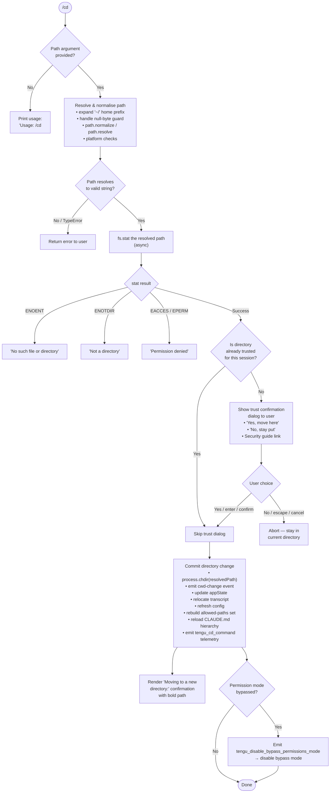

# `/cd`

> Analysis basis: CC v2.1.172 bundle.js (AST extraction + Claude interpretation)
> Minimum version: v2.1.172

---

## Overview

The `/cd` command moves the active Claude Code session to a new working directory. It resolves and validates the supplied path, optionally presents a trust confirmation dialog for directories not previously visited by the session, and then atomically updates the process working directory, reloads configuration, relocates the session transcript, and refreshes all permission bookkeeping for the new location.

---

## Registration

| Field | Value |
|---|---|
| type | `local-jsx` |
| name | `cd` |
| description | Move this session to a new working directory |
| argumentHint | `<path>` |
| module_id | `Jnq` |
| load_inline | `true` |
| loc_byte | `11211066` |
| loc_byte_end | `11211226` |
| loc_line | `7350` |
| arbor_handler.name | `pV7` |
| arbor_handler.fqn | `claude-2.1.172::pV7` |
| arbor_handler.kind | `AsyncFunction` |
| arbor_handler.resolution_path | `module_id` |
| arbor_handler.n_hits | `0` |

Analysis basis: CC v2.1.172 bundle.js:+11211066

---

## Input Branching

The `/cd` command has more than three distinct branches driven by path validation, filesystem checks, prior-session trust state, and directory-change outcomes.



---

## Behavioral Spec

### 1. Entry point — async handler (`pV7`)

Analysis basis: CC v2.1.172 bundle.js:+11209553

```
async function handleCdCommand(args, context):
    if args is empty or blank:
        print "Usage: /cd <path>"
        return

    resolvedPath = resolveUserPath(args.trim())   // E1 / pathResolver
    if resolvedPath is error:
        return with error message

    stat = await fs.stat(resolvedPath)             // Fx8.stat
    if stat error in [ENOENT, ENOTDIR, EACCES, EPERM]:
        return formatted filesystem error

    if not directoryPreviouslyTrusted(resolvedPath):
        confirmed = await showTrustDialog(resolvedPath)
        if not confirmed:
            return  // stay put

    await commitDirectoryChange(resolvedPath, context)
```

### 2. Path resolution (`E1` — path normaliser)

Analysis basis: CC v2.1.172 bundle.js:+11209584

```
function resolveUserPath(rawInput):
    if rawInput contains null bytes:
        throw "Path contains null bytes"    // literal at +1084342

    input = rawInput.trim()                 // H.trim at +1084376

    // Normalise Unicode to NFC
    input = dO(input)                       // H.normalize("NFC") at +181442

    // Expand home directory shorthand
    if input starts with "~/":
        homeDir = os.homedir()              // No6.homedir at +1084439
        input = path.join(homeDir, input.slice(2))

    // Windows tilde: "~\"
    if platform is "windows" and input matches windows-tilde pattern:
        input = path.join(homeDir, input.slice(3))

    if path.isAbsolute(input):
        return path.resolve(input)
    else:
        return path.resolve(currentWorkingDir, input)
```

### 3. Trust / confirmation dialog (`jnq` JSX component)

Analysis basis: CC v2.1.172 bundle.js:+11206412

The component is a `local-jsx` handler that renders when the resolved target directory has not been visited in this session.

```
function renderTrustDialog(targetPath):
    // Heading fragment: "This session hasn't worked here before.
    //   Is this a directory you created or one you trust?"
    display warning panel (style: "warning")

    show "Moving to a new directory:" label + bold(targetPath)
    show link: "Security guide" → "https://code.claude.com/docs/en/security"

    buttons:
        primary:   "Yes, move here"   → fires "confirm" / "enter"
        secondary: "No, stay put"     → fires "cancel"  / "escape"

    keyboard handlers:
        enter   → confirm
        escape  → cancel
```

Analysis basis: CC v2.1.172 bundle.js:+11207158 (button labels), +11207004 (security URL)

### 4. Commit directory change (`uV7`)

Analysis basis: CC v2.1.172 bundle.js:+11210361

```
async function commitDirectoryChange(resolvedPath, context):
    // 1. Get current cwd info for comparison
    cwdInfo = getCwdInfo(context)           // p6 at +11208096

    // 2. Call process.chdir
    process.chdir(resolvedPath)             // +11208108

    // 3. Resolve real path (symlink-safe)
    realPath = await fs.realpath(resolvedPath)

    // 4. Update process/internal cwd state
    updateCwdState(realPath)                // Ow / tZ → T56 at +11208125
    emitCwdChangeEvent()                    // ri8.emit at +44542

    // 5. Relocate transcript to new directory
    relocateTranscript(realPath, context)   // X4A at +11208150

    // 6. Rebuild allowed-path set for new cwd
    rebuildAllowedPaths(realPath)           // xV7 at +11208461

    // 7. Refresh configuration
    config.refreshConfig()                  // uA.refreshConfig at +11208405

    // 8. Emit telemetry
    emit("tengu_cd_command")                // +11208426

    // 9. Render confirmation output
    renderConfirmationMessage(resolvedPath) // mV7 at +11210248

    // 10. If bypass-permissions mode was active, disable it
    if bypassPermissionsActive(context):
        disableBypassPermissions()          // Nb at +11210210
        emit("tengu_disable_bypass_permissions_mode")
```

### 5. Transcript relocation (`X4A`)

Analysis basis: CC v2.1.172 bundle.js:+11208150

```
async function relocateTranscript(newPath, context):
    newTranscriptDir = path.join(newPath, ".claude", "cd")  // literal "cd" at +13436196

    beginTranscriptRelocation(context)      // A.beginTranscriptRelocation at +13436271
    flush(context)                          // A.flush at +13436311
    await fs.mkdir(newTranscriptDir, { mode: 0o700 })   // 448 decimal at +13436357
    await moveOrCopyFiles(oldDir, newTranscriptDir)      // cXK at +13436373
    updateTranscriptPath(newTranscriptDir, context)
    endTranscriptRelocation(context)        // A.endTranscriptRelocation at +13436589
```

### 6. Rebuild allowed-paths set (`xV7`)

Analysis basis: CC v2.1.172 bundle.js:+11208461

```
function rebuildAllowedPaths(newRealPath):
    // Walk directory hierarchy upward from new cwd,
    // collecting CLAUDE.md / CLAUDE.local.md context files
    // and re-computing the permission allow-list.
    normalised = normalisePath(newRealPath)   // g2 at +11207912
    ancestors  = collectAncestors(newRealPath, path.parse, path.dirname)
    // xV7 calls FT6 (file-tree walker) and BT6 (allow-list builder)
    allowedSet = buildPermissionSet(ancestors, normalisePath)  // FT6 + BT6
    updateGlobalAllowedSet(allowedSet)
```

### 7. Real-path and CWD-state update (`Ow` / `tZ`)

Analysis basis: CC v2.1.172 bundle.js:+11208125

```
function updateCwdState(resolvedPath):
    absolute = path.isAbsolute(resolvedPath)
        ? resolvedPath
        : path.resolve(resolvedPath)

    // Validate path is within allowed scope
    if not isAllowed(absolute):
        emit("tengu_shell_set_cwd")     // +6924143
        throw Error("not allowed")

    // Normalise and persist as new cwd in AsyncLocalStorage store
    normalised = normaliseCwdPath(absolute)   // T56 / v9_
    store.set(normalised)
    ri8.emit("cwd-change", normalised)
```

### 8. Confirmation message renderer (`mV7`)

Analysis basis: CC v2.1.172 bundle.js:+11210248

```
function renderConfirmationMessage(newPath):
    // Renders text indicating the session moved.
    // Includes a fragment about the "previous directory" being stale
    // and that all tool calls and file references should now use the new path.
    // Literal fragment at +11208620:
    //   "previous directory — that information is stale. All tool calls and "
    displayBold(newPath)                     // W6.bold at +11208921
    renderOTH(context)                       // OTH → ydA at +11208838
```

### 9. Permission-bypass reset (`Nb` / `Y6`)

Analysis basis: CC v2.1.172 bundle.js:+11210210

```
function maybeDisableBypassPermissions(context):
    appState = getAppState(context)
    if appState.bypassPermissions is true:
        emit("tengu_disable_bypass_permissions_mode")   // +4259542
        setPermissionMode(appState, "disable")
        persistConfig()
```

---

## State & Side Effects

| Item | Detail |
|---|---|
| Telemetry: `tengu_cd_command` | Fired on every successful committed directory change (bundle.js:+11208426) |
| Telemetry: `tengu_shell_set_cwd` | Fired when internal cwd-state update runs (bundle.js:+6924143) |
| Telemetry: `tengu_disable_bypass_permissions_mode` | Fired if bypass-permissions mode was active at time of `/cd` (bundle.js:+4259542) |
| Telemetry: `tengu_config_lock_contention` | Fired during config save if lock was contested (bundle.js:+3312132) |
| Telemetry: `tengu_config_stale_write` | Fired if a stale-write condition is detected on config save (bundle.js:+3312268) |
| Telemetry: `tengu_config_auth_loss_prevented` | Fired if config write is aborted to avoid losing auth credentials (bundle.js:+3312611) |
| Telemetry: `tengu_config_parse_error` | Fired if config cannot be parsed during reload (bundle.js:+3314707) |
| Telemetry: `tengu_claude_rules_md_permission_error` | Fired if CLAUDE.md cannot be read during path rebuild (bundle.js:+4998423) |
| Telemetry: `tengu_paper_halyard` | Fired during memory/context-file loading phase (bundle.js:+5001161) |
| `process.chdir()` | Mutates the Node.js process working directory to the resolved target path |
| `ri8.emit("cwd-change")` | Internal event broadcast so all subsystems observe the new cwd |
| `A.beginTranscriptRelocation` / `A.endTranscriptRelocation` | Wraps transcript file-move atomically; flush is called before move |
| `uA.refreshConfig` | Re-reads all configuration layers (user, project, local, policy) under the new directory |
| Allowed-paths set rebuild | `xV7` traverses the new directory tree and rewrites the in-memory permission allow-list |
| Bypass-permissions mode | Automatically disabled if it was active before the `/cd` call |
| Trust dialog | Shown (JSX, `jnq`) when the target directory has not been visited by this session; user must confirm before the change commits |

---

## Version History

| Version | Change |
|---|---|
| v2.1.172 | Initial analysis |

---

## Common Mistakes

1. **Omitting the path argument** — `/cd` with no argument prints `Usage: /cd <path>` and exits immediately. Always provide a path.
2. **Using a relative path from an unexpected base** — the path is resolved relative to the *current* working directory at the time the command runs, not the project root. Use `~` or an absolute path to avoid ambiguity.
3. **Expecting bypass-permissions to persist** — `/cd` automatically disables `bypassPermissions` mode if it was active. Re-enable it explicitly after the directory change if needed.
4. **Trusting that previous tool-call references remain valid** — after `/cd`, all path references from earlier in the conversation are relative to the old directory. The confirmation message explicitly warns that prior directory context is stale.
5. **Cancelling at the trust dialog then retrying without understanding** — selecting "No, stay put" leaves the session in the original directory. The next `/cd` to the same path will show the dialog again because trust was not granted.
6. **Pointing to a file instead of a directory** — the `fs.stat` check will return `ENOTDIR` and the change will be aborted.

---

## Appendix — Identifier Mapping

> For bundle debugging only. Identifiers change across versions.

| Identifier | Role |
|---|---|
| `pV7` | Main async handler for `/cd` (arbor_handler, `AsyncFunction`) |
| `H` | Random-delay utility (calls `Math.random`, `setTimeout`) |
| `E1` | Path resolution and validation function |
| `p6` | Current-cwd reader / getter |
| `zo6` | AsyncLocalStorage store accessor (calls `Oo6.getStore`) |
| `pd` | CWD store value extractor |
| `P_` | Path normalisation helper (calls `BG`) |
| `BG` | Low-level path normaliser |
| `o6` | Error/exception factory or logger |
| `dO` | Unicode NFC normaliser (`H.normalize("NFC")`) |
| `N8` | Generic error code/message formatter |
| `Ynq` | Directory context builder / permission-summary renderer (JSX) |
| `M1` | React memo / component primitive |
| `hv` | Allowed-paths set builder (walks ancestors, resolves symlinks) |
| `J5` | Filesystem lstat wrapper |
| `JY` | Filesystem stat wrapper |
| `M` | MCP server state manager |
| `yRH` | MCP server connection orchestrator |
| `Ln8` | MCP connection result applicator |
| `N` | MCP log / debug message formatter |
| `nWA` | MCP server config re-applier |
| `UfH` | Symlink resolver / real-path walker |
| `Y` | Forced-shutdown handler (calls `process.exit`) |
| `A$` | Real-path sync resolver |
| `Bx8` | Path prefix stripper |
| `CV7` | Directory allow-pattern matcher |
| `j4A` | Glob/pattern-to-regex converter for allowed paths |
| `K` | String padding / display formatter |
| `d65` | Directory normaliser (calls `E1`, `P_`) |
| `cb6` | Tool call / command-type checker |
| `bV7` | Pattern-match result builder |
| `vQ` | Deny-rule checker / flat-map over rules |
| `k3` | Rule string parser / segment extractor |
| `Zuf` | Rule parse helper |
| `TE` | `Object.hasOwn` guard utility |
| `Vuf` | Rule token extractor |
| `Euf` | String escape helper (`replaceAll`) |
| `h$H` | Permission-check orchestrator (allowed-tools + rules) |
| `Scq` | Permission scope reader |
| `RxH` | Shell-command safety checker / cache |
| `dy6` | Shell command cache entry builder |
| `ly6` | Shell command string parser (trim, startsWith, endsWith) |
| `me_` | Shell command cache validator |
| `k_` | App-state reader for session context keys |
| `_b8` | `working_directory` context-key renderer |
| `Ab8` | `allowed_tools` / `disallowed_tools` context-key renderer |
| `Nb` | Bypass-permissions disabler |
| `Y6` | Permission-mode setter |
| `N26` | Permission-mode state writer |
| `h26` | Permission-mode persistence helper |
| `Ym` | Async queue / effect scheduler |
| `N78` | Deduplicated-event emitter |
| `b6` | Telemetry event emitter (fires `tengu_*` events) |
| `mV7` | Post-cd confirmation message renderer |
| `e5` | Text escape / sanitise helper |
| `Tuf` | HTML-entity encoder (`replaceAll`) |
| `OTH` | Context/memory file renderer |
| `ydA` | Memory-section display component |
| `uV7` | Commit-directory-change function (chdir + side effects) |
| `Ow` | CWD-state setter (validates scope, updates store) |
| `R8` | Error code extractor |
| `v9_` | AsyncLocalStorage CWD store writer |
| `u6H` | Path normalise-and-store helper |
| `c` | Generic context/state accessor |
| `tZ` | CWD normaliser + event emitter (`T56` + `ri8.emit`) |
| `T56` | Path normalise wrapper |
| `X4A` | Transcript relocation orchestrator |
| `y6` | Environment/state bootstrapper |
| `$4` | Config registry helper |
| `y9` | Config hot-reload register |
| `EOH` | Environment guard (production vs test) |
| `f6` | String type coercer |
| `APK` | App environment constant |
| `Ou` | Runtime environment checker |
| `iNH` | Renderer initialiser |
| `AJ` | Event-bus emitter wrapper |
| `XZA` | Event emitter setup |
| `JZA` | `Bg6.emit` caller |
| `cXK` | File-move / atomic-rename helper |
| `$PK` | Recursive directory copier |
| `SH` | Config save-with-lock routine |
| `JA` | Config error formatter |
| `Rq` | Config write queue |
| `fRf` | Config write-queue shift/push |
| `DG` | Display/render helper for directory info |
| `xV7` | Allowed-paths set rebuilder after directory change |
| `g2` | Path normalise-for-permissions helper |
| `FT6` | File-tree walker for CLAUDE.md discovery |
| `nO` | File-tree node factory |
| `Bm` | CLAUDE.md file finder (recursive) |
| `MPH` | Directory-level permission scanner |
| `mT6` | Path-relative anchor calculator |
| `BT6` | Permission allow-list set builder |
| `Px8` | HTML-entity decoder |
| `XG` | Display formatter / output writer |
| `_JH` | Transcript path resolver |
| `Wc` | Path normalise helper (NFC) |
| `C26` | Global-config save orchestrator |
| `E8` | Config file writer (main branch) |
| `F78` | Atomic config file writer (with backup rotation) |
| `mV1` | Config object merger |
| `W7H` | Config file reader / parser |
| `brH` | Config backup file handler |
| `CH` | JSON.stringify wrapper |
| `XZ_` | Backup filename generator |
| `V` | Buffer / byte-stream handler |
| `P` | Socket/stream read accumulator |
| `E` | Math clamp utility (max/min) |
| `Sz6` | Atomic file write with symlink support |
| `HJH` | Config hash / integrity helper |
| `y_9` | Config entry iterator |
| `b26` | Timestamp helper |
| `B78` | Atomic config save (fallback path) |
| `jnq` | Trust-dialog JSX component (the `local-jsx` UI for `/cd`) |