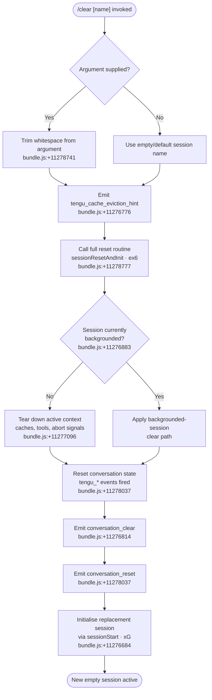

# `/clear`

> Analysis basis: CC v2.1.175 bundle.js (AST extraction + Claude interpretation)
> Minimum version: v2.1.175

---

## Overview

`/clear` starts a fresh conversation session with an empty context window, while preserving the previous session on disk for later resumption via `/resume`. It accepts an optional `[name]` argument to label the new session, supports non-interactive invocations, and performs a deep reset across in-memory caches, running tools, and conversation state before initialising a replacement session. The command is also reachable as `/reset` or `/new`.

---

## Registration

| Field | Value |
|---|---|
| type | `local` |
| name | `clear` |
| description | `Start a new session with empty context; previous session stays on disk (resumable with /resume)` |
| argumentHint | `[name]` |
| aliases | `reset`, `new` |
| supportsNonInteractive | `true` |
| thinClientDispatch | `post-text` |
| module_id | `poq` |
| load_inline | `true` |
| loc_byte | `11278915` |
| loc_byte_end | `11279206` |
| arbor_handler.name | `Jy7` |
| arbor_handler.fqn | `claude-2.1.175::Jy7` |
| arbor_handler.kind | `AsyncFunction` |
| arbor_handler.resolution_path | `module_id` |
| arbor_handler.n_hits | `0` |

Analysis basis: CC v2.1.175 bundle.js:+11278915

---

## Input Branching

Four distinct paths exist depending on argument presence, session background state, and the outcome of the full reset sequence. A Mermaid flowchart is used.



---

## Behavioral Spec

### Handler Entry Point

The Arbor-resolved handler `Jy7` (an `AsyncFunction`) is the command's main entry point.

```
async function handleClearCommand(args, context):
    sessionName = args.trim()          // bundle.js:+11278741
    emit telemetry: tengu_cache_eviction_hint  // bundle.js:+11276776
    await sessionResetAndInit(sessionName, context)
```

Analysis basis: CC v2.1.175 bundle.js:+11278741

---

### Session Reset and Initialisation (`ex6`)

`ex6` orchestrates the full teardown and re-initialisation sequence. It is the primary callee of `Jy7`.

```
async function sessionResetAndInit(sessionName, context):
    // 1. Parse and validate the optional session index / name
    validatedIndex = parseSessionIndex(sessionName)  // _u6, bundle.js:+11276672
      // uses parseInt, Number.isFinite, radix 10 (bundle.js:+13604701)
      // clamps with Math.max / Math.min (bundle.js:+13604908, 13604921)

    // 2. Snapshot current session end event
    emit event "SessionEnd" to hook subsystem  // literal bundle.js:+13595209

    // 3. Initiate new session via sessionStart
    await sessionStart(sessionName, context)   // VpH, bundle.js:+11276684

    // 4. Arm an AbortSignal timeout for the overall operation
    signal = AbortSignal.timeout(...)          // bundle.js:+11276732

    // 5. Initialise or update module registry (M6)  // bundle.js:+11276811

    // 6. Register the new session in the active-session set
    activeSessionSet.add(session)              // bundle.js:+11276998

    // 7. Deep-clear all in-memory caches
    clearAllCaches()                           // Z7A, bundle.js:+11277078

    // 8. Reset working-directory resolver
    resetCwd()                                 // Dw, bundle.js:+11277087

    // 9. Clear the tool-state map
    toolStateMap.clear()                       // bundle.js:+11277096

    // 10. Iterate registered tools, dispose any still-running ones
    for each tool in Object.keys(tools):       // bundle.js:+11277121
        tool.abort / cleanup as needed

    // 11. Flush pending hook queue
    flushHooks()                               // Fz, bundle.js:+11277497

    // 12. Emit conversation_clear telemetry    // literal bundle.js:+11276814
    // 13. Emit conversation_reset telemetry   // literal bundle.js:+11278037
    // 14. Check backgrounded state            // literal bundle.js:+11276883
    // 15. Resume / create agent loops
    await startAgentLoops(...)                 // W, bundle.js:+11278423
```

Analysis basis: CC v2.1.175 bundle.js:+11276684

---

### Deep Cache Clear (`Z7A`)

`Z7A` is called by `sessionResetAndInit` to flush every in-process cache so the new session starts with zero carryover.

```
function clearAllCaches():
    skillIndexCache.clearSkillIndexCache()     // pp → bundle.js:+13460636
    clearFileWatcher()                         // HV9 → bundle.js:+11275648
    clearToolCaches()                          // bHH → bundle.js:+11275667
      // bHH resets subagent registry, compact state, MCP tool maps,
      // NFC-normalisation maps, loop sentinels, etc.
    clearSecondaryStateCaches()                // $p, uZq, WXq, Yf_, pe9, vi9
    clearPluginCaches()                        // vUq → bundle.js:+11275983
    await Promise.resolve()                    // bundle.js:+11275995
    reinitialise downstream registries as needed
```

Analysis basis: CC v2.1.175 bundle.js:+11275631

---

### Session Index Parsing (`_u6`)

`_u6` is responsible for converting the optional `[name]` argument into a validated session index or name.

```
function parseSessionIndex(raw):
    n = parseInt(raw, 10)              // bundle.js:+13604690, radix 10 at +13604701
    if not Number.isFinite(n):         // bundle.js:+13604712
        use default/string name path
    n = Math.max(0, Math.min(n, MAX))  // bundle.js:+13604908, 13604921
      // MAX clamps to safe integer range; 1000 appears as an upper sentinel
      //   (bundle.js:+13604877)
    return n
```

Analysis basis: CC v2.1.175 bundle.js:+13604690

---

### Session Start (`VpH` / `xG`)

`VpH` wraps `xG`, the comprehensive session-startup routine that constructs the new session object and wires up all subsystems.

```
async function sessionStart(name, context):
    sessionObj = buildSessionObject(name)       // xG, bundle.js:+13595240
    // xG performs, among other things:
    //   - hook subsystem initialisation        // GL, bundle.js:+13606241
    //   - file-watcher setup                   // NJA, bundle.js:+13644540
    //   - tool permission loading              // GKH, bundle.js:+13646322
    //   - HTTP hook dispatcher registration    // GJA, bundle.js:+13647249
    //   - UUID assignment                      // FUH.randomUUID, +13645035
    //   - agent loop creation                  // tN, bundle.js:+13645005
    //   - safe-mode checks                     // literal "--safe-mode" +66353
    emit "SessionStart" hook event              // literal bundle.js:+13624083
    return sessionObj
```

Analysis basis: CC v2.1.175 bundle.js:+13595182

---

### Hook Queue Flush (`Fz`)

Before the replacement session is considered live, any queued hook futures are flushed.

```
function flushHookQueue():
    pendingPromise = trackingSet.add(promise)   // QQ8 → bundle.js:+13563236
    pendingPromise.finally(() =>
        trackingSet.delete(promise)             // bundle.js:+13563261
    )
    flushMap.get(key).flush()                   // bundle.js:+13564674
    flushMap.delete(key)                        // bundle.js:+13564684
```

Analysis basis: CC v2.1.175 bundle.js:+13564631

---

## State & Side Effects

| Item | Detail |
|---|---|
| Telemetry — `tengu_cache_eviction_hint` | Fired immediately after argument trim, before reset begins (bundle.js:+11276776) |
| Telemetry — `tengu_run_hook` | Fired each time a hook is dispatched during the reset/start sequence (bundle.js:+13644669) |
| Telemetry — `tengu_repl_hook_finished` | Fired when a REPL-context hook completes (bundle.js:+13628413) |
| Telemetry — `tengu_hook_plugin_metrics` | Plugin hook performance metrics emitted during session start (bundle.js:+13622940) |
| Telemetry — `tengu_session_renamed` | Emitted if the new session name differs from the old one (bundle.js:+13505862) |
| Telemetry — `tengu_shell_set_cwd` | Fired when the working-directory is re-anchored (bundle.js:+6953984) |
| Telemetry — `tengu_feature_ok` / `tengu_feature_bad` | Feature flag checks performed around hook dispatch (bundle.js:+1017151, +1017218) |
| Literal event `conversation_clear` | Emitted to internal event bus (bundle.js:+11276814) |
| Literal event `conversation_reset` | Emitted to internal event bus (bundle.js:+11278037) |
| Literal event `SessionEnd` | Sent to hook subsystem before teardown (bundle.js:+13595209) |
| Literal event `SessionStart` | Sent to hook subsystem after re-initialisation (bundle.js:+13624083) |
| Hook registration | `SessionEnd` and `SessionStart` lifecycle hooks are invoked; all hook types (PreToolUse, PostToolUse, etc.) are re-registered for the new session |
| appState changes | Active session object replaced; conversation message list cleared; tool-state map cleared; abort controllers replaced; backgrounded-session flag re-evaluated |
| Cache side effects | Skill index cache, file-watcher, subagent registry, MCP tool maps, NFC maps, compact state, plugin caches, and several secondary state stores are all cleared (via `Z7A` and its callees) |
| Disk side effects | Previous session is **not** deleted — it remains on disk for `/resume`. The new session UUID is written as part of session-init (via `LXA` path) |
| Sound | None detected in depth-2 traversal |

---

## Version History

| Version | Change |
|---|---|
| v2.1.175 | Initial analysis |

---

## Common Mistakes

1. **Expecting conversation history to be erased from disk** — `/clear` only resets the in-process context; the old session file is preserved and remains resumable with `/resume`.
2. **Providing a non-integer name and expecting numeric indexing** — if the argument is not a finite integer, the numeric indexing path is skipped and the argument is treated as a string label. `parseInt` is used with radix 10 (bundle.js:+13604701).
3. **Assuming `/clear` is equivalent to restarting the CLI process** — it does not restart the daemon or MCP server connections; those are re-initialised in-process.
4. **Using `/clear` to cancel a currently running tool** — the command tears down running tools as part of its reset sequence, but this is a side effect, not a graceful cancellation; the tool's abort signal is set, not awaited to completion.
5. **Relying on aliases `/reset` or `/new` behaving differently** — all three names resolve to the same handler (`Jy7`); there is no behavioural difference between them.

---

## Appendix — Identifier Mapping

> For bundle debugging only. Identifiers change across versions.

| Identifier | Role |
|---|---|
| `Jy7` | Main handler for `/clear` (AsyncFunction; Arbor-resolved) |
| `ex6` | Session reset and re-initialisation orchestrator |
| `_u6` | Optional session-index / name argument parser |
| `Rj` | Policy-settings loader (called by `_u6`) |
| `dK` | Configuration key reader |
| `IAH` | Settings policy applicator |
| `jB` | Session index getter (iG-based store) |
| `SF` | State-flush / session-state writer |
| `Yv_` | Session state cache (get/set wrapper) |
| `rO` | Dual-map clear helper (`dQ6`, `Go8`) |
| `Dv_` | Session state diff/apply helper |
| `VpH` | Session-start outer wrapper |
| `GL` | Hook-subsystem initialiser |
| `h6` | Generic iG store accessor |
| `KI` | Secondary store accessor (iG) |
| `cP` | Model-capability / effort resolver |
| `LN` | Extended thinking / high-effort configurator |
| `Nh` | Hook-context builder |
| `b6` | Path utility (Pa6 + W_ join) |
| `xG` | Comprehensive session-startup routine |
| `Gb` | Session-object builder (reads I8 state) |
| `N` | Message normaliser / formatter |
| `aOH` | Hook-event emitter helper (`vJH`) |
| `NJA` | File-watcher / hook-path configurator |
| `O` | Object map helper (C8) |
| `pGK` | Path-to-glob-key mapper |
| `vJA` | Third-party hook filter |
| `FGK` | Glob-to-function key mapper |
| `d` | Generic state-read helper |
| `RH` | JSON serialiser wrapper |
| `SH` | Log-error / hook-tracking helper |
| `CH` | Feature-bad reporter (d + A6) |
| `evH` | Feature-ok emitter (so6) |
| `tN` | Agent-loop abort / timeout manager |
| `J` | Callback registry |
| `S9H` | Session-name store accessor |
| `sN` | Session-name formatter |
| `Hd8` | Session-name helper (sN, m\$A, p\$A) |
| `TJA` | Tool-permission loader |
| `qd8` | Hook output parser (plain-text vs JSON) |
| `GKH` | Permission-map transformer |
| `GJA` | HTTP hook dispatcher |
| `mGK` | HTTP hook response parser |
| `yOH` | OS-specific shell resolver |
| `Kd8` | Hook subprocess spawner |
| `TCH` | Thin-client dispatch helper |
| `kH` | Feature-ok emitter (d + A6 path) |
| `fg` | Telemetry event emitter (C8L + timestamp) |
| `EuH` | Session-end event broadcaster |
| `JM6` | Session-mode initialiser |
| `M6` | Module registry initialiser (d56) |
| `d56` | Module descriptor builder |
| `f` | Active-session-set add/delete wrapper |
| `q` | Active-session set |
| `u1` | Shutdown helper (bUH, YX, process.exit) |
| `L` | Session lifecycle manager (close, finalise) |
| `A` | Connection/client map |
| `D` | Background-session dispatch manager |
| `b` | Background-session lifecycle object |
| `dSH` | Session state file reader |
| `w` | Supervisor/worker config manager |
| `Ls` | kLH lock helper |
| `btH` | Session snapshot writer (mkdir + writeFile) |
| `FG9` | Session filter helper |
| `P` | Buffer/stream framer |
| `z` | Daemon control helper (kH, CH, ZS, aU) |
| `S` | Session write helper (csK, vM) |
| `X` | Socket timeout manager |
| `c` | Stream-pair holder (Su6, \_HK) |
| `_` | Active-session iterator |
| `NcK` | Output formatting / column-padding helper |
| `B1H` | Session state batch loader |
| `i8` | IPC connection manager |
| `K` | Column formatter (f.map + padEnd) |
| `ng8` | Platform memory / low-mem detector |
| `z6` | Memory-pressure monitor |
| `UG6` | pins.json loader |
| `ZS_` | Pins file path resolver |
| `d6` | JSON parse wrapper |
| `y8` | E8 error classifier |
| `f8L` | Plugin directory reader |
| `Q` | Background-session IPC client |
| `E8` | Error builder |
| `l` | Session task scheduler loop |
| `C` | Output write + clearTimeout helper |
| `B` | Session keepalive set |
| `uZ` | Session path builder (k\$.join + QpH) |
| `p` | Pending-message store |
| `Xv` | IPC frame encoder |
| `Pm8` | IPC frame decoder |
| `dTA` | Daemon-session claimer |
| `LXA` | Session metadata writer (mkdir + writeFile) |
| `qV5` | Claim-send timeout manager |
| `AV5` | Claim frame builder |
| `I7` | Error-classification helper (E8) |
| `TH` | String-coercion wrapper |
| `oTA` | Background-session teardown/create handler |
| `Af` | Session directory path builder |
| `Vq` | Session state file reader/writer (stat + readFile) |
| `ZO` | ZN session state updater |
| `dXH` | MCP tool-name parser |
| `n7` | Session path + RH helper |
| `ef6` | WHK promise chain handler |
| `pu6` | Session socket path builder |
| `OOH` | Session roster path builder (QpH) |
| `aQ` | Session activation helper (n5A) |
| `mu6` | Session socket path builder (uu6) |
| `Y` | Force-shutdown handler (KX, z.abort) |
| `KX` | Shutdown signal helper |
| `A6` | d56 module helper |
| `E7` | Agent-mode flag |
| `mD` | Mode descriptor |
| `Z7A` | Deep-cache-clear coordinator |
| `P7A` | Pre-clear snapshot helper |
| `lV` | Skill / plugin loader chain (pp, fu8, acq, FmH) |
| `pp` | Skill index cache clearer (NMA + clearSkillIndexCache) |
| `fu8` | Post-clear skill loader |
| `acq` | Acquires skill registry lock |
| `FmH` | Skill index rebuild trigger (Jb6) |
| `HV9` | File-watcher clear helper (Tg.clear + zRH) |
| `zRH` | File-watcher index writer (mkdir + writeFile) |
| `lM6` | MCP plugin state resetter |
| `bHH` | Tool / subagent state resetter |
| `HIH` | Main-agent reference holder (Jm) |
| `hb8` | Subagent cache eviction helper |
| `SE6` | Session-start event emitter (yT) |
| `cM6` | Compact-state resetter |
| `iM6` | Store resetter (iG + t6H) |
| `Tb8` | nFq.clear wrapper |
| `Xc9` | aV6 + CF\_ dual-map clearer |
| `kXq` | H-keyed cache resetter |
| `r0H` | H + \_ dual-map resetter |
| `_D` | nFH + Object.values clearer |
| `XKA` | Extended state resetter |
| `$p` | zx6.clear wrapper |
| `uZq` | NuH + t6A dual-map clearer |
| `WXq` | u16 + Fk6 dual-map clearer |
| `Yf_` | tdH.clear wrapper |
| `Tiq` | Tool registry resetter |
| `pe9` | H08.clear wrapper |
| `Ts8` | H.has guard helper |
| `Af_` | sdH.clear wrapper |
| `vUq` | Plugin cache resetter (Jb6) |
| `Jb6` | Plugin store accessor (aC8.get + Db6) |
| `vi9` | We + KWH dual-map clearer |
| `Dw` | CWD resolver and validator |
| `o6` | Filesystem stat helper |
| `AK_` | AsyncLocalStorage CWD getter |
| `sO` | Path normaliser (H.normalize) |
| `H8H` | \$M6 CWD store writer |
| `W_` | iG store writer |
| `ARH` | Tool-abort registry helper |
| `xT` | In-flight request canceller |
| `Fz` | Hook queue flusher |
| `QQ8` | Hook tracking-set add/delete helper |
| `r66` | Plugin reload helper (Ys9) |
| `Ys9` | Plugin reloader |
| `AG` | MCP client cleanup orchestrator (X66 + nN) |
| `X66` | MCP hash computer (l2H) |
| `l2H` | Deterministic hash builder (sha256) |
| `nN` | MCP skills reloader (z6) |
| `moq` | Plugin watcher resetter (zwH) |
| `zwH` | Plugin watch-path map clearer |
| `V$` | REPL state resetter (h6 + z4) |
| `z4` | REPL store accessor (u9) |
| `u9` | pvA.register wrapper |
| `Mk` | Mode-key setter |
| `sM` | Session-mode emitter (EC + t\$ + W\_ + A2H.join) |
| `EC` | iG mode-flag setter |
| `Hu6` | REPL secondary state resetter (z4) |
| `Vo8` | Session UUID emitter (pfH.randomUUID + IvA + hvA) |
| `IvA` | Session UUID store writer |
| `hvA` | nQ6.emit session-UUID event |
| `cr` | REPL context resetter (z4) |
| `cR` | Conversation title/user resetter (Nh + oOH + h6 + z4 + RU6.emit) |
| `oOH` | Append-file log helper (appendFileSync + mkdirSync) |
| `ymH` | Symlink / tasks-dir manager (QQ8 + DJA + Z\$ + V6H.*) |
| `DJA` | Tasks-directory creator (V6H.mkdir + g66) |
| `g66` | Task-dir path builder (wJA.join + A76) |
| `Z$` | Tasks symlink path builder |
| `x96` | File-handle open helper (QQ8 + DJA + Z\$ + V6H.open) |
| `nV` | Subagents-directory resetter (EC + t\$ + W\_ + lu\_.get + A2H.join) |
| `J5` | Agent-state flag resetter |
| `S_` | Module-exports bootstrapper (DVH + cr8 + qQ6 + KQ6 + StK + EEA.set) |
| `KQ6` | Module binding helper |
| `W` | MCP connection manager (J56 + LR + iN + Ci + Ax + GA) |
| `J56` | MCP server config loader (vaK) |
| `vaK` | Object.keys MCP config iterator |
| `GA` | Error/String coercion helper |
| `T` | MCP type dispatcher (kv6 + J56) |
| `kv6` | MCP transport-kind key |
| `eM` | Agent-mode reset helper |
| `PU` | Worktree-state emitter (z4 + Ox8.emit + oOH + h6) |
| `NKH` | Isolation-latch resetter (z4 + G0K) |
| `G0K` | Append-file log helper (appendFile + mkdir, async variant) |
| `Eg` | Plugin hook loader and registrar |
| `wf` | Settings + hook loader (dK + D7) |
| `D7` | Configuration key reader (K6 + yd6) |
| `Us` | Hook-set builder (I8 + Object.entries + A.includes + \_.add) |
| `I8` | Settings reader (\_ t6 + nC) |
| `adH` | Hook-registration logger (Date.now + R8) |
| `R8` | Append-file log writer (Xpf + o6 + RH + f.appendFileSync) |
| `YMH` | Safe-mode plugin hook skip helper |
| `_Z6` | Session agent-loop bootstrapper (GL + V\$ + JY + T2) |
| `JY` | Session-join / agent-attach helper |
| `T2` | Main agent-loop runner (comprehensive) |
| `M` | MCP manager (DCH + ki8 + sGA) |
| `DCH` | MCP connection dispatcher |
| `ki8` | MCP client updater / cleaner |
| `$` | hjK helper |
| `sGA` | MCP client state aggregator |
| `L9` | Session UUID generator (L4A.randomUUID) |

Note: index built via Arbor fallback; some signals (telemetry, literals) may be missing — see arbor-fallback.js.