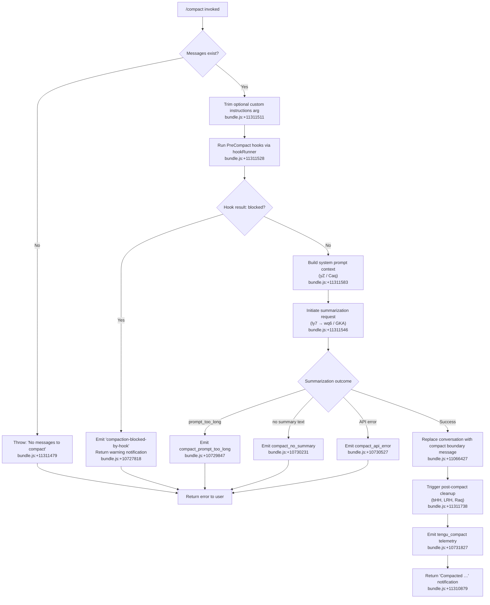

# `/compact`

> Analysis basis: CC v2.1.175 bundle.js (AST extraction + Claude interpretation)
> Minimum version: v2.1.175

---

## Overview

`/compact` frees up context window space by replacing the current conversation history with a structured summary generated by an AI summarization call. The command supports an optional custom instructions argument that is appended to the summarization prompt, allowing users to guide what information the summary should emphasize or preserve.

## Registration

| Field | Value |
|---|---|
| type | `local` |
| name | `compact` |
| description | Free up context by summarizing the conversation so far |
| argumentHint | `<optional custom summarization instructions>` |
| supportsNonInteractive | `true` |
| thinClientDispatch | `post-text` |
| module_id | `baq` |
| load_inline | `true` |
| loc_byte | 11312418 |
| loc_byte_end | 11312718 |
| loc_line | 7486 |
| arbor_handler.name | `cy7` |
| arbor_handler.fqn | `claude-2.1.175::cy7` |
| arbor_handler.kind | `AsyncFunction` |
| arbor_handler.resolution_path | `module_id` |
| arbor_handler.n_hits | 0 |

Analysis basis: CC v2.1.175 bundle.js:+11312418

---

## Input Branching

The command handler (`cy7`) has 4+ distinct branches depending on the presence of messages, the state of the session, whether a `PreCompact` hook blocks compaction, and the outcome of the summarization API call.



---

## Behavioral Spec

### Handler Entry Point (`cy7`)

The main handler is the `AsyncFunction` `cy7`, resolved via `module_id` resolution against module `baq`.

```
async function compactCommandHandler(context, args):
    customInstructions = args.trim()   // bundle.js:+11311511
    if context.messages is empty:
        throw Error("No messages to compact")  // bundle.js:+11311479

    // Run PreCompact lifecycle hook
    hookResult = await runPreCompactHook(context)  // br → z6, bundle.js:+11311528
    if hookResult.blocked:
        emitWarning("compaction-blocked-by-hook")  // bundle.js:+10727818
        return notificationResult("compaction blocked by PreCompact hook")

    // Build system prompt and context state
    [systemPrompt, contextState] = await Promise.all([
        buildSystemPromptContext(context),   // Caq, bundle.js:+11311583
        buildEnvironmentState(context)       // yZ (via Caq), bundle.js:+11311583
    ])

    // Run summarization pipeline
    summaryResult = await runSummarizationPipeline(
        context, systemPrompt, contextState, customInstructions
    )  // ly7, bundle.js:+11311546

    if summaryResult.error == "prompt_too_long":
        emitTelemetry("tengu_compact_ptl_retry")  // bundle.js:+10729887
        return displayError("Compaction failed · conversation could not be reduced below the context limit")

    if summaryResult.error == "no_summary":
        emitTelemetry("tengu_compact")  // bundle.js:+10731827
        return displayError("Failed to generate conversation summary - response did not contain valid text content")

    if summaryResult.error == "api_error":
        emitTelemetry("tengu_compact")
        return displayError(summaryResult.errorMessage)

    // Replace conversation history
    replaceConversationWithSummary(
        summaryText = summaryResult.text,
        boundaryRole = "system",
        boundaryType = "compact_boundary"   // bundle.js:+11066427
    )

    // Post-compact cleanup
    resetSessionState()      // bHH, bundle.js:+11311738
    updateUIState()          // LRH, bundle.js:+11311713
    showCompactedNotification()  // Raq, bundle.js:+11311811

    emitTelemetry("tengu_compact")  // bundle.js:+10731827

    return "Compacted " + <turn_count>  // bundle.js:+11310879
```

Analysis basis: CC v2.1.175 bundle.js:+11311448

---

### Compact Boundary Message Insertion (`$z` → `pu8`)

After a successful summarization, the conversation messages array is replaced with a boundary marker before the summary text.

```
function insertCompactBoundary(messages, summaryText):
    boundaryMessage = {
        role: "system",
        type: "compact_boundary",   // bundle.js:+11066427
        content: summaryText
    }
    // Slice off messages before boundary, append boundary + summary
    return [boundaryMessage]       // bundle.js:+11066481–11066486
```

Analysis basis: CC v2.1.175 bundle.js:+11311448 (call to `$z`), +11066427 (boundary literal)

---

### Summarization Pipeline (`ly7`)

`ly7` orchestrates the full summarization sub-task:

```
async function runSummarizationPipeline(context, systemPrompt, contextState, customInstructions):
    startTime = performance.now()   // bundle.js:+11307530

    // Report compact_progress status
    emitProgress("compact_progress", "hooks_start")  // bundle.js:+11307393/11307424

    // Parallel fetch: SDK tools + context state
    [mcpContext, appState] = await Promise.all([
        buildToolsContext(context),   // xr, bundle.js:+11307594
        buildFullAgentContext(context) // Caq, bundle.js:+11307669
    ])

    // Report stream_mode / requesting
    emitProgress("stream_mode", "requesting")   // bundle.js:+11307809/11307828
    emitProgress("compact_start")               // bundle.js:+11307953

    // Dispatch summarization agent turn
    result = await runCompactionAgentTurn(
        context, appState, mcpContext, customInstructions
    )  // ny7, bundle.js:+11307984

    // Handle result
    if result.status == "miss_custom_instructions":
        recordMiss("miss_custom_instructions")  // bundle.js:+11309675
    if result.status == "miss_hook":
        recordMiss("miss_hook")                 // bundle.js:+11309728
    if result.status == "miss_not_ready":
        recordMiss("miss_not_ready")            // bundle.js:+11309858
    if result.status == "aborted":
        emitTelemetry for abort                 // bundle.js:+11309936

    emitProgress("compact_end")  // bundle.js:+11309366
    return result
```

Analysis basis: CC v2.1.175 bundle.js:+11307530

---

### Agent Turn Execution for Compaction (`ny7`)

`ny7` drives the actual API request that produces the summary. Tool use is explicitly denied during compaction.

```
async function runCompactionAgentTurn(context, appState, mcpContext, customInstructions):
    // Deny all tool use during compaction
    onToolUseRequest => return { decision: "deny", reason: "Tool use is not allowed during compaction" }
    // bundle.js:+10739397/10739412

    // Check precomputed compact cache first
    cachedResult = checkPrecomputedCompactCache()  // FK6 → DKA, bundle.js:+11309828
    if cachedResult.hit:
        emitTelemetry("tengu_precomputed_compact_consumed")  // bundle.js:+10562113
        return cachedResult

    // Find boundary in message history
    boundaryIndex = findCompactBoundary(messages)  // jKA, bundle.js:+11310110
    if boundaryIndex == null:
        recordMiss("boundary_uuid_missing")  // bundle.js:+11310190

    // Build compaction messages set
    compactionMessages = buildCompactionMessages(
        messages, boundaryIndex, customInstructions
    )  // Nb8 / slice, bundle.js:+11310178

    // Call summarization API
    response = await callSummarizationAPI(compactionMessages, context)  // M2 → FZ7 → px8

    // Validate response is text-only (no tool use)
    if response has tool_use:
        errorOut("compaction agent should only produce text summary")
        // bundle.js:+10739492

    if response.text is empty:
        return { status: "no_summary" }

    return { status: "hit", summaryText: response.text }
```

Analysis basis: CC v2.1.175 bundle.js:+11309747

---

### PreCompact Hook Execution (`br` → `z6`)

Before compaction proceeds, `PreCompact` lifecycle hooks are invoked.

```
async function runPreCompactHook(context):
    hookConfig = loadHookConfig(context)       // z6, bundle.js:+11311528
    precompactHooks = filterHooksByType(hookConfig, "PreCompact")  // bundle.js:+13590368

    if precompactHooks is empty:
        return { blocked: false }

    results = await runHooks(precompactHooks, context)  // xG → runHookExecutor

    if any result.decision == "block":
        return { blocked: true }
    return { blocked: false }
```

Analysis basis: CC v2.1.175 bundle.js:+11311528 (call to `br`), +10747566 (telemetry `tengu_amber_redwood3`)

---

### Post-Compact Cleanup (`bHH`)

After the summary is installed, `bHH` resets ephemeral session state:

```
function postCompactCleanup(context):
    clearAbortControllers()         // hb8 → VU.delete, bundle.js:+10563127
    clearSubagentExitRecords()      // SE6, bundle.js:+10563407
    clearCachedFileState()          // cM6, bundle.js:+10563422
    clearSubprocessModuleCache()    // iM6, bundle.js:+10563439
    clearPendingToolBuffer()        // Tb8 → nFq.clear, bundle.js:+10563445
    clearHookCaches()               // Xc9 → aV6.clear, bundle.js:+10563451
    resetAutonomousLoopDelivered()  // sG7.resetAutonomousLoopDelivered, bundle.js:+10563483
    flushOutputTokenCounters()      // _D, bundle.js:+10563533
    emitTelemetry("post_compact_cleanup")  // literal, bundle.js:+10563356
```

Analysis basis: CC v2.1.175 bundle.js:+11311738 (call to `bHH`)

---

### Compact Notification Display (`Raq`)

```
function showCompactNotification(context, summaryMetadata):
    // Register keyboard action app:toggleTranscript
    registerAction("app:toggleTranscript", "Global", "ctrl+o")
    // bundle.js:+11310740/11310772

    // Format "Compacted N" message
    turnCount = computeTurnCount(summaryMetadata)
    displayMessage = "Compacted " + turnCount  // bundle.js:+11310879
    displayDim(displayMessage)                  // J6.dim, bundle.js:+11310872
    return joinedOutput                         // K.join, bundle.js:+11310892
```

Analysis basis: CC v2.1.175 bundle.js:+11311811 (call to `Raq`)

---

### Summarization API Client (`wq6`)

`wq6` manages the full low-level agent loop for compaction, forwarding to the same agent execution pipeline as normal turns:

```
async function compactionAgentLoop(context, messages, options):
    // Initialize performance timer
    startTime = performance.now()   // bundle.js:+10728611

    // Determine compaction span type
    spanType = options.manual ? "compact_manual" : "compact_auto"
    // bundle.js:+10728571/10728586

    emitTelemetry("claude_code.compaction", spanType)  // bundle.js:+10728635

    // Validate message count
    if messages.length < minMessages:
        emitTelemetry("compact_not_enough_messages")   // bundle.js:+10728773
        return { status: "miss_not_ready" }

    // Build summarization request body
    requestBody = buildRequestBody(messages, systemPrompt)

    // Execute API call via standard agent pipeline
    response = await executeAgentQuery(requestBody, context)
    // px8 / MZ, bundle.js:+11029347

    // Check for prompt-too-long
    if response.stopReason == "prompt_too_long":
        emitTelemetry("tengu_compact_ptl_retry")
        return { status: "prompt_too_long" }

    // Check for no-summary
    if not response.hasText:
        emitTelemetry("tengu_compact")
        return { status: "no_summary" }

    emitTelemetry("tengu_compact")  // bundle.js:+10731827
    return { status: "ok", text: response.summaryText }
```

Analysis basis: CC v2.1.175 bundle.js:+10728611

---

## State & Side Effects

| Item | Detail |
|---|---|
| Telemetry — compact | `tengu_compact` (bundle.js:+10731827) |
| Telemetry — PTL retry | `tengu_compact_ptl_retry` (bundle.js:+10729887) |
| Telemetry — reactive compact succeeded | `tengu_reactive_compact_succeeded` (bundle.js:+10569786) |
| Telemetry — reactive compact failed | `tengu_reactive_compact_failed` (bundle.js:+10567321) |
| Telemetry — reactive compact attempt | `tengu_reactive_compact_attempt` (bundle.js:+5129789) |
| Telemetry — compact failed | `tengu_compact_failed` (bundle.js:+10743136) |
| Telemetry — compact_api_error | via `compact_api_error` literal (bundle.js:+10730527) |
| Telemetry — compact cache prefix | `tengu_compact_cache_prefix` (bundle.js:+10729411) |
| Telemetry — cache sharing success | `tengu_compact_cache_sharing_success` (bundle.js:+10740289) |
| Telemetry — cache sharing fallback | `tengu_compact_cache_sharing_fallback` (bundle.js:+10740919) |
| Telemetry — precomputed consumed | `tengu_precomputed_compact_consumed` (bundle.js:+10562113) |
| Telemetry — precomputed discarded | `tengu_precomputed_compact_discarded` (bundle.js:+10562736) |
| Telemetry — post file restore ok | `tengu_post_compact_file_restore_success` (bundle.js:+10743622) |
| Telemetry — post file restore err | `tengu_post_compact_file_restore_error` (bundle.js:+10743664) |
| Telemetry — amber redwood (hook) | `tengu_amber_redwood3` (bundle.js:+10747566) |
| Telemetry — hook run | `tengu_run_hook` (bundle.js:+13644669) |
| Hook registration | `PreCompact` hook type checked; blocks compaction when hook returns `decision: "block"` (bundle.js:+10727818) |
| Hook registration — PostCompact | `PostCompact` literal registered for post-compact hook execution (bundle.js:+13624166) |
| appState changes | Abort controllers cleared, subagent exit records cleared, file-state cache cleared, module cache cleared, pending tool buffer cleared, hook caches cleared, `resetAutonomousLoopDelivered` called, output-token counters flushed (bHH, bundle.js:+11311738) |
| UI state | `LRH` calls `cE6.setState` (bundle.js:+5074438); `Raq` registers `app:toggleTranscript` keybinding `ctrl+o` (bundle.js:+11310772) |
| Conversation state | Messages array replaced with a single `compact_boundary` system message containing the AI-generated summary (bundle.js:+11066427) |
| Sound | <!-- TODO: not found in depth-2 traversal; needs --depth 4 --> |

---

## Version History

| Version | Change |
|---|---|
| v2.1.175 | Initial analysis |

---

## Common Mistakes

1. **Running `/compact` on an empty conversation** — The handler throws immediately with "No messages to compact" (bundle.js:+11311479). Ensure at least one exchange exists before invoking the command.
2. **Expecting tool calls during compaction** — Tool use is hard-denied inside the compaction agent turn ("Tool use is not allowed during compaction", bundle.js:+10739412). Custom hooks that attempt to inject tool use will be blocked.
3. **Assuming custom instructions are mandatory** — The `<optional custom summarization instructions>` argument is trimmed (bundle.js:+11311511) and may be empty. Passing no argument is valid; the summarization uses a default prompt.
4. **Expecting compaction to proceed if a `PreCompact` hook blocks it** — A blocking result from any registered `PreCompact` hook causes the command to return a warning notification rather than proceeding (bundle.js:+10727818). Check hook configuration if compaction appears to silently fail.
5. **Assuming context is preserved after compaction** — All ephemeral session caches, abort controllers, and subprocess module caches are cleared as part of post-compact cleanup (bHH). Code that holds references to pre-compact session objects may encounter stale state.
6. **Conflating manual `/compact` with reactive auto-compact** — The same underlying pipeline is used, but the span type differs (`compact_manual` vs `compact_auto`, bundle.js:+10728571/+10728586). Telemetry and some branching differ between the two paths.

---

## Appendix — Identifier Mapping

> For bundle debugging only. Identifiers change across versions.

| Identifier | Role |
|---|---|
| `cy7` | Main compact command handler (AsyncFunction) |
| `$z` | Insert compact boundary into message array |
| `pu8` | Low-level boundary message constructor helper |
| `FJ` | Message array manipulation utility |
| `br` | PreCompact hook runner entry |
| `x_` | Hook config accessor |
| `z6` | Hook filter / dispatch router |
| `XW6` | Hook type classifier helper |
| `PW6` | Hook type classifier helper |
| `Rm` | Hook registry lookup |
| `Wm` | Hook registry map accessor |
| `p58` | Hook execution state tracker |
| `SX_` | Hook event emitter |
| `uV_` | Hook async state manager |
| `C6` | File config reader |
| `o6` | Config path resolver |
| `nV_` | Config namespace accessor |
| `U7H` | File system config loader (readFileSync, statSync, mkdirSync) |
| `sp4` | File watcher for config changes |
| `ly7` | Summarization pipeline orchestrator |
| `M2` | API request builder |
| `FZ7` | API request formatter |
| `kPH` | Token count utility |
| `px8` | Message normaliser / system prompt assembler |
| `xr` | Tool/MCP context builder |
| `GL` | Hook event bus initialiser |
| `h6` | Event emitter factory |
| `KI` | Event emitter type helper |
| `cP` | Model capability checker |
| `LN` | Language/locale helper |
| `Nh` | Hook notification builder |
| `b6` | Permission/policy loader |
| `xG` | Hook executor (spawn/HTTP/MCP) |
| `Gb` | Policy settings loader |
| `N` | Log level helper |
| `aOH` | Hook event metadata builder |
| `NJA` | Hook plugin discovery |
| `O` | Tool-search context type |
| `pGK` | Hook path resolver |
| `vJA` | Hook filter helper |
| `FGK` | Hook filesystem utility |
| `d` | Output renderer utility |
| `RH` | JSON serialiser helper |
| `SH` | Error logger |
| `CH` | Display context helper |
| `evH` | Event builder |
| `tN` | Abort-controller/timeout manager |
| `J` | Process manager |
| `S9H` | Session handle accessor |
| `sN` | Session notification dispatcher |
| `Hd8` | Hook metadata assembler |
| `TJA` | Hook result parser |
| `qd8` | Hook JSON output parser |
| `GKH` | Hook output transformer |
| `GJA` | HTTP hook executor |
| `mGK` | Hook output prefix parser |
| `yOH` | Platform/shell resolver |
| `Kd8` | Subprocess hook executor (spawn) |
| `TCH` | Timeout/cleanup coordinator |
| `kH` | Display helper (notification) |
| `fg` | Telemetry flush utility |
| `K` | Message array accumulator |
| `f` | Promise tracking set |
| `L` | Stream/socket handle |
| `M` | MCP client manager |
| `DCH` | MCP server connection driver |
| `ki8` | MCP connection applier |
| `$` | MCP client instance helper |
| `sGA` | MCP connection state aggregator |
| `Caq` | App-state/context builder for compact |
| `yZ` | Full system-prompt assembler |
| `gJA` | Growthbook feature flag loader |
| `_u8` | Tool context builder |
| `a_` | Memory file loader |
| `LoH` | Pewter-owl tool loader |
| `oT` | Session type resolver |
| `Aq5` | Core behaviour prompt builder |
| `qq5` | Confirmation-prompt builder |
| `Kq5` | Fable identity prompt builder |
| `zjH` | Fable model name checker |
| `y_H` | Claude-fable flag reader |
| `lJA` | System prompt section composer |
| `uq5` | System prompt section wrapper |
| `JQ` | Memory accessor |
| `Pq5` | Prompt-policy assembler |
| `lW6` | Memory prompt loader |
| `hq5` | Environment info prompt builder (simple) |
| `Nq5` | Environment info prompt builder (full) |
| `Oq5` | Output-style prompt selector |
| `zq5` | Background-session prompt flag |
| `yq5` | Worktree prompt builder |
| `kq5` | Scratchpad prompt builder |
| `Rq5` | Brief-mode enablement check |
| `xq5` | Flag-settings prompt builder |
| `Tq5` | Sparrow-ledger prompt builder |
| `Mq5` | Heron-brook prompt builder |
| `$q5` | Amber-sextant prompt builder |
| `Hbq` | Memory cache compute helper |
| `Gq5` | Autonomy-append flag resolver |
| `wq5` | Reproduce-verify prompt toggle |
| `Yq5` | Context-management prompt builder |
| `Dq5` | Verified-vs-assumed prompt builder |
| `jq5` | Doing-tasks prompt section builder |
| `Jq5` | Tool-use prompt section builder |
| `Wq5` | Tone-style prompt builder |
| `$q9` | Anthropic-AWS settings injector |
| `WJH` | AWS credentials loader |
| `b_` | App-state snapshot accessor |
| `A` | String utilities / lowercase |
| `Ex8` | App-state field extractor (working_directory) |
| `Zx8` | App-state field extractor (allowed_tools) |
| `mb` | Permission-mode accessor |
| `JU` | System prompt builder (main thread) |
| `bf` | System prompt cache accessor |
| `kW` | Model string formatter |
| `S_` | Module export initialiser |
| `iz` | System-prompt system flag |
| `A6` | Display node builder |
| `M6` | Display node builder (variant) |
| `Nx8` | Context log helper |
| `VfA` | Verbose/stream-mode reporter |
| `ny7` | Compaction agent turn runner |
| `DKA` | Precomputed compact cache checker |
| `Zb8` | Cache key builder |
| `_` | Utility/underscore helper |
| `FK6` | Precomputed compact cache consumer |
| `Vb8` | Compact branch type identifier |
| `z$` | Performance timer helper |
| `M1` | Display node builder (variant) |
| `jKA` | Compact boundary finder in message array |
| `Nb8` | Post-compact message slicer + timing |
| `kb8` | Full agent loop executor |
| `HIH` | Agent type classifier (startsWith check) |
| `Jm` | Agent type prefix helper |
| `cX` | Cache-key and model state reader |
| `c1H` | Feature-flag set membership checker |
| `gE9` | Cache hit type resolver |
| `dt` | Token delta tracker |
| `yE6` | Object.fromEntries/entries helper |
| `ARH` | Anti-replay hash helper |
| `fi` | Plugin hook loader |
| `lZ9` | Plugin hook list builder |
| `nE6` | Tool-result cache writer |
| `nD8` | Tool name prefix checker |
| `zRH` | Tool result file writer |
| `rFH` | Request fingerprint helper |
| `QK6` | Query-tool-schema builder entry |
| `z4` | Tool-schema builder |
| `Nb6` | UUID generator wrapper |
| `OKH` | Output-message builder |
| `RZ7` | Array type-check helper |
| `SZ7` | Content-block builder |
| `eG7` | Context-building parallel runner |
| `Rb8` | Plan-file restore logic |
| `ub8` | App-state object reader |
| `Cb8` | Message metadata builder |
| `xb8` | Message restorer (plan) |
| `bb8` | Message values builder |
| `h$H` | Tool-presence context builder |
| `amH` | Tool-permission context builder |
| `smH` | Tool-presence context appender |
| `L9` | Message ID / UUID factory |
| `Eg` | Plugin hook session-start executor |
| `PTH` | Pre-turn hook runner |
| `TKA` | Tool-call array builder |
| `zpH` | Tool filter (ant-prefix) |
| `w$H` | Watchdog initialiser |
| `pD8` | Token percentage calculator |
| `mD8` | Message serialiser for API |
| `MZ` | Full message-to-API normaliser |
| `uM` | Math.round token utility |
| `z5L` | Token map manager |
| `BE` | Build system-prompt config (cP + LN) |
| `v$` | App-state reader (getAppState) |
| `GKA` | Reactive compact trigger |
| `Lj8` | Reactive compact group slicer |
| `qZ6` | Compact candidate selector |
| `q` | Active-request tracker |
| `vV9` | Math.max/floor helper |
| `D` | Process/daemon controller |
| `eML` | Reactive compact summarisation caller |
| `j` | Subprocess killer |
| `H3L` | Gap-size estimator |
| `aE6` | Abort-on-error wrapper |
| `oE6` | Abort-on-error inner |
| `Mp` | Path anonymiser (PII scrubber) |
| `y5L` | Home-dir path replacer |
| `E5L` | Phone number replacer |
| `V5L` | IP address replacer |
| `P5L` | Email replacer |
| `D5L` | Drive path replacer |
| `w5L` | Home dir replacer (full) |
| `N5L` | UNC path replacer |
| `v5L` | URL userinfo replacer |
| `I5L` | API error body replacer |
| `fV9` | Compact-reactive abort emitter |
| `t6` | Notification display helper |
| `TH` | String coercer |
| `bHH` | Post-compact session state reset |
| `hb8` | Abort controller map cleaner |
| `SE6` | Subagent exit record cleaner |
| `yT` | Subagent exit helper |
| `cM6` | Cached file state cleaner |
| `iM6` | Subprocess module cache cleaner |
| `iG` | Module registry helper |
| `t6H` | Module tag helper |
| `Tb8` | Pending tool buffer cleaner |
| `Xc9` | Hook cache cleaner |
| `kXq` | State snapshot helper |
| `r0H` | State ref helper |
| `_D` | Output token counter flusher |
| `XKA` | Post-compact hook trigger |
| `LRH` | UI state updater (cE6.setState) |
| `Raq` | Compact notification display builder |
| `$bH` | Action registry helper |
| `QxL` | Model selection helper |
| `H2` | App action dispatcher |
| `OO8` | Action type checker |
| `zO8` | Action runner |
| `APH` | OTEL/metrics attribute builder |
| `Bf` | OTEL event emitter |
| `jSH` | OTEL metrics attribute extractor |
| `rM6` | OTEL event splitter |
| `Ja8` | OTEL event name builder |
| `Xa8` | OTEL event attribute builder |
| `wq6` | Compaction agent loop (API level) |
| `Av6` | Tracing span creator |
| `j9H` | Span attribute builder |
| `lN` | Log level normaliser |
| `KR` | Active tracing span accessor |
| `PeH` | App-state permission helper |
| `fj8` | Input trimmer |
| `u8` | Streaming session initialiser |
| `P` | Buffer/stream reader |
| `X` | Stream socket manager |
| `b7` | Stream end helper |
| `YV5` | Daemon protocol message handler |
| `Jdq` | Core agent turn executor |
| `Fmq` | Context-credit poll helper |
| `vC8` | Credit-token cache reader |
| `Bmq` | Credit interval poller |
| `K6` | String coercer (toString) |
| `kT` | Agent turn state machine |
| `GR8` | App-state writer for turns |
| `TR8` | Turn result builder |
| `zR` | Random hex generator |
| `fKH` | Tool schema fetch trigger |
| `jU` | Post-turn cleanup executor |
| `XE` | Turn-exit code helper |
| `tb6` | Tombstone type checker |
| `pHH` | Streaming idle timeout helper |
| `Vx8` | Verbose stream reporter |
| `aQq` | Tombstone type setter |
| `Y` | Process exit controller |
| `_3H` | In-progress tool filter |
| `oE7` | Turn error display helper |
| `au_` | Context-credit limiter |
| `jMH` | Max-output-token resolver |
| `PJH` | Token limit selector by model |
| `d1H` | CLAUDE_CODE_MAX_OUTPUT_TOKENS env parser |
| `rV` | Last-message finder |
| `Kj8` | Summary tag extractor |
| `qj8` | `<summary>` tag parser |
| `n8` | Byte-count helper |
| `I` | Compact candidate marker |
| `qZ7` | Turn output message builder |
| `La` | UI notification emitter |
| `_x6` | Tool-search mode resolver |
| `qwH` | Tool-search threshold helper |
| `nt` | Tool-search string normaliser |
| `SmH` | Tool-search availability checker |
| `Lu_` | Tool-search label builder |
| `CZ7` | Tool-search deferred mode picker |
| `ou_` | Message content flattener |
| `HZ7` | Array isArray helper |
| `_Z7` | Message content filter |
| `AZ7` | Message content mapper |
| `Hx6` | Content block type checker |
| `ZfA` | Recursive content flattener |
| `zdq` | Surrogate-pair byte encoder |
| `HK6` | Fallback / off-switch query builder |
| `FfA` | Fallback credit assembler |
| `UTK` | Full query executor (streaming + non-streaming) |
| `eW8` | Entry-point type resolver |
| `q1` | Model name validator |
| `rG` | Event emitter getter |
| `G` | Vim-mode key handler |
| `T` | Key-event type helper |
| `z` | Input field key dispatcher |
| `Pc` | Clipboard helper |
| `ZyK` | Vim find-motion dispatcher |
| `qyK` | Vim yank handler |
| `MyK` | Vim replace handler |
| `zyK` | Vim case handler |
| `b` | Register/clipboard manager |
| `YyK` | Vim paste-from-register handler |
| `eIK` | Vim indent operator |
| `HyK` | Vim indent operator (variant) |
| `W2A` | Vim compound motion dispatcher |
| `S` | Terminal writer/supervisor |
| `w` | Terminal renderer |
| `_ZH` | Terminal write helper |
| `eXK` | Terminal column width calculator |
| `E` | Render interval controller |
| `gsK` | Heartbeat emitter |
| `V` | Render loop handle |
| `Zg` | Array-type guard |
| `Ydq` | Message token window slicer |
| `WeH` | Message accumulator (push) |
| `GeH` | Token-count extractor |
| `DMH` | Content-type checker |
| `Hh6` | Token-count parser |
| `vy` | Tool-result prefix checker |
| `x` | Stream session emitter |
| `C` | Timeout/write helper |
| `sM` | Inline compact result formatter |
| `EC` | Event component helper |
| `W_` | Event-emitter widget |
| `hT` | Context token display formatter |
| `Sc` | Token percentage formatter |
| `YK` | String converter |
| `YE6` | REPL context flag reader |
| `KZ6` | REPL context label builder |
| `tML` | REPL context string normaliser |
| `ct` | Cache-feature flag checker |
| `jdq` | Notification output builder |
| `nX` | History-navigation push helper |
| `TE` | Terminal escape helper |
| `P3L` | History ring buffer manager |
| `Hv6` | Verbose turn reporter |
| `fCH` | Session status setter |
| `SfA` | Post-compact summary label builder |