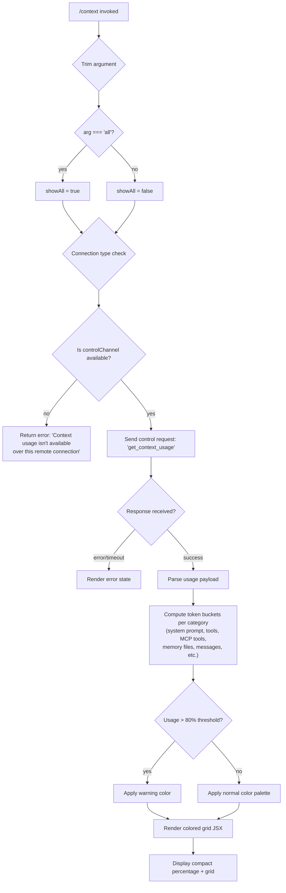

# `/context`

> Analysis basis: CC v2.1.175 bundle.js (AST extraction + Claude interpretation)
> Minimum version: v2.1.175

---

## Overview

The `/context` command visualizes the current conversation's context window usage as a colored grid rendered in the terminal. It dispatches a `get_context_usage` control request to the host process, then renders the response as a JSX component that breaks down context consumption by category (system prompt, tools, memory files, messages, etc.), using color-coded cells proportional to token counts.

---

## Registration

| Field | Value |
|---|---|
| type | `local-jsx` |
| name | `context` |
| description | `Visualize current context usage as a colored grid` |
| argumentHint | `[all]` |
| thinClientDispatch | `control-request` |
| module_id | `zeq` |
| load_inline | `true` |
| loc_byte | `11715604` |
| loc_byte_end | `11715830` |
| loc_line | `7540` |
| arbor_handler.name | `UC7` |
| arbor_handler.fqn | `claude-2.1.175::UC7` |
| arbor_handler.kind | `AsyncFunction` |
| arbor_handler.resolution_path | `module_id` |
| arbor_handler.n_hits | `0` |

Analysis basis: CC v2.1.175 bundle.js:+11715604

---

## Input Branching

The handler has 4+ distinct paths depending on argument content, connection type, and display mode:



Analysis basis: CC v2.1.175 bundle.js:+11714198 (handler entry `UC7`), +11714229 (`'all'` literal), +11714282 (remote error string), +11714394 (`get_context_usage` literal), +11714740 (`80` threshold literal)

---

## Behavioral Spec

### Handler Entry — `contextCommandHandler` (UC7)

The command's async handler is `UC7`, resolved via `module_id: "zeq"`.

```
async function contextCommandHandler(args, appState):
    trimmedArg = args.trim()                      // +11714204
    showAll    = (trimmedArg === "all")            // +11714229

    // Check whether a control channel is reachable
    channelType = getConnectionChannelType(appState)  // qL → +11714237
    if channelType !== "controlChannel":           // +11714255
        return staticText(
            "Context usage isn't available over this remote connection"
        )                                          // +11714282

    // Dispatch IPC request to host
    response = await sendControlRequest(           // K.sendControlRequest +11714364
        "get_context_usage"                        // +11714394
    )

    // Render JSX output
    usageData = parseContextUsageResponse(response)   // vu6 +11714534
    systemTokens  = computeSystemTokens(usageData)    // vu6.filter +11712301
    systemEntry   = findSystemEntry(usageData)         // vu6.find  +11712619

    grid = buildContextGrid(usageData, showAll)    // yx8 +11714757
    return createElement(contextGridComponent, {   // Nu6.createElement +11714428
        usage: grid,
        showAll: showAll
    })
```

Analysis basis: CC v2.1.175 bundle.js:+11714198

---

### Connection Gate — `channelTypeResolver` (qL / PI)

Before any data fetch, the handler checks whether the session supports the control channel protocol.

```
function resolveChannelType(appState):
    raw = getConnectionInfo(appState)      // pVH +11714237
    if raw is not "controlChannel":
        return null
    return "controlChannel"

function isControlChannelAvailable(appState):
    // PI wraps qL with additional capability check
    return resolveChannelType(appState) != null   // PI +11714252
```

Analysis basis: CC v2.1.175 bundle.js:+11714237, +11714252

---

### Context Usage Payload Parser — `parseUsagePayload` (vu6)

Transforms the raw `get_context_usage` IPC response into categorised token buckets for display.

```
function parseUsagePayload(response, showAll):
    // Filter visible categories
    categories = response.filter(entry => {        // A.filter +11712301
        return showAll OR entry.isNonZero
    })

    // Locate the system-prompt entry specifically
    systemEntry = categories.find(                 // A.find +11712619
        e => e.type === "system"                   // "system" +11714511
    )

    // Build display labels for known categories
    labels = {
        "Free space":          computeFreeSpace(response),    // +11712336
        "Autocompact buffer":  computeAutocompact(response),  // +11712359
        "Project":   readSetting("projectSettings"),  // +11713305
        "User":      readSetting("userSettings"),     // +11713342
        "Local":     readSetting("localSettings"),    // +11713377
        "Flag":      readSetting("flagSettings"),     // +11713412
        "Policy":    readSetting("policySettings"),   // +11713448
        "Plugin":    readSetting("plugin"),           // +11713467
        "Built-in":  readSetting("built-in"),         // +11713497
        "MCP":       readSetting("mcp"),              // +11713206
        "Managed":   readSetting("managed"),          // +11713120
    }

    // Format percentages
    for each entry in categories:
        entry.percentStr = formatPercent(           // J8H +11714036
            Math.round(entry.tokens / totalTokens * 100)  // +216842
        )
        // suffix ".0" if integer  // ".0" +216783

    return categories
```

Analysis basis: CC v2.1.175 bundle.js:+11712260, +11712301, +11712619, +11713305

---

### Grid Builder — `buildContextGrid` (yx8)

Assembles all token-bucket sections into a renderable data structure.

```
async function buildContextGrid(usageData, showAll):
    // Collect system prompt section
    systemSection = buildSystemSection(usageData)     // yZ +10761573
    toolSection   = buildToolSection(usageData)       // XZ7 +10762151
    msgSection    = buildMessageSection(usageData)    // MZ (via hZ7 +10762254)

    // Apply warning threshold at 80%
    totalUsedPct = sum(allSections) / contextLimit    // +11714740
    warningColor = totalUsedPct > 0.80 ? "warning" : "normal"

    // Compact boundary marker
    compactBoundary = resolveCompactBoundary()        // $z +11714707
    // "compact_boundary" label +11066427

    // Compute row widths
    maxCols  = Math.min(available, configured)        // +10763302
    minCols  = Math.max(1, minBound)                  // +10763291

    // Filter zero-token rows when showAll=false
    rows = rows.filter(r => showAll OR r.tokens > 0)  // +10763801

    // Round and floor for visual cell sizes
    cellSize = Math.round(tokens / totalTokens * cols)  // +10763881
    remainder = Math.floor(residual)                    // +10764043

    return { rows, warningColor, compactBoundary }
```

Analysis basis: CC v2.1.175 bundle.js:+10761467 (mE), +10762138 (Promise.all), +11714740 (80 threshold), +10763291, +10763302

---

### System Prompt Section Builder — `buildSystemSection` (yZ)

Collects and categorises the system-prompt token slice by reading the current prompt composition.

```
async function buildSystemSection(state):
    store    = getAsyncLocalStore()            // b6/Pa6 +13708168
    settings = loadSettings()                 // a_ +13708263

    // Resolve prompt sections in parallel
    [memoryPrompt, envInfo, systemPrompt] = await Promise.all([
        buildMemoryPrompt(state),             // lW6 +13708706
        buildEnvInfo(state),                  // Nq5 +13708807
        buildMainSystemPrompt(state)          // Pq5 +13708639
    ])

    // Include brief-mode if enabled
    if BJA.isBriefEnabled():                  // +13708333
        include briefSection                  // Rq5 +13708993

    // Merge and return ordered list
    sections = [systemPrompt, memoryPrompt, envInfo, ...]
    return sections
```

Analysis basis: CC v2.1.175 bundle.js:+13708117, +13708234, +13708333

---

### Tool Section Builder — `buildToolSection` (XZ7)

Enumerates built-in tools, MCP tools, and deferred tool sets and measures their token cost.

```
async function buildToolSection(usageData):
    builtinTools = filterBuiltins(usageData)   // XZ7.filter +10755352
    mcpTools     = filterMCPTools(usageData)   // Sx8 +10755529

    // Parse tool block via HTK
    for each entry in usageData:
        idx = entry.indexOf("# ")              // HTK +13709559, "# " +13709615
        if entry.startsWith(...):
            raise Error on malformed block     // Error +13709627

    // Build per-tool cost entries
    toolEntries = await Promise.all(
        builtinTools.map(t => measureTool(t))  // XZ7.map +10755795
    )

    // Aggregate by category label
    categories = {
        "System tools":           filterBuiltin(toolEntries),    // +10762501
        "MCP tools":              filterMCP(toolEntries),        // +10762564
        "MCP tools (deferred)":   filterDeferredMCP(toolEntries),// +10762639
        "System tools (deferred)":filterDeferredBuiltin(...),    // +10762724
        "Custom agents":          filterAgents(toolEntries),     // +10762812
        "Skills":                 filterSkills(toolEntries),     // +10762939
    }
    return categories
```

Analysis basis: CC v2.1.175 bundle.js:+10755332, +10755529, +10762501, +10762564

---

### Message Section Builder — `buildMessageSection` (MZ / hZ7)

Walks the conversation history to compute per-message and per-role token costs.

```
function buildMessageSection(messages, usageMap):
    result = new Map()

    for each message in messages:                 // hZ7.set +10761127
        roleKey = message.role                    // "assistant" +10756984
        blockType = detectBlock(message)          // MZ internal

        if blockType === "tool_use":              // "tool_use" +10757052
            cost = measureToolUse(message)        // VZ7 +10761178
        else if blockType === "tool_result":      // "tool_result" +10760346
            cost = measureToolResult(message)     // vZ7 +10761211
        else:
            cost = measureTextBlock(message)      // NZ7 +10761252

        // Attachment blocks tracked separately
        if hasAttachment(message):                // "attachment" +10761239
            cost += measureAttachment(message)

        result.set(message.id, cost)

    // Label rows
    rows = [
        { label: "Messages",   color: "purple_FOR_SUBAGENTS_ONLY" },   // +10763465, +10763491
        { label: "System Prompt", color: "cyan_FOR_SUBAGENTS_ONLY" },  // was promptBorder +10762454
    ]
    return result
```

Analysis basis: CC v2.1.175 bundle.js:+10761127, +10756984, +10757052, +10760346, +10761239, +10763465

---

### Compact-Boundary Resolver — `resolveCompactBoundary` ($z)

Determines the byte offset within the context window where autocompact last ran.

```
function resolveCompactBoundary(state):
    marker = state.get("compact_boundary")     // "compact_boundary" +11066427
    if marker is null:
        return null
    raw = getFullHistory()                     // pu8/FJ +11066510
    return raw.slice(0, marker)               // H.slice +11066580
```

Analysis basis: CC v2.1.175 bundle.js:+11066427, +11066557

---

### Percentage Formatter — `formatPercent` (J8H / OK)

```
function formatPercent(fraction, totalTokens):
    pct = Math.round(fraction / totalTokens * 100)   // Math.round +216842
    str = formatLocale(pct, "en-US", "compact")      // "en-US" +218795, "compact" +218813
    if str ends with ".0":                           // ".0" +216783
        str = str without ".0"
    // Apply color threshold
    if pct < 20:                                     // 20 +216813
        color = "< 20" bucket                        // "< 20" +216822
    elif pct < 10:                                   // 10 +216855
        color = lowest bucket
    return { pct, str, color }
```

Analysis basis: CC v2.1.175 bundle.js:+216769, +216813, +216855

---

### Control-Request Dispatcher — `sendControlRequestWrapper` (K.sendControlRequest)

The `thinClientDispatch: "control-request"` field on the registration instructs the CLI framework to route the `get_context_usage` payload through the established IPC control channel rather than via the agent API.

```
function dispatchControlRequest(type, payload):
    channel = getActiveControlChannel()
    // Pad channel ID to fixed width
    paddedId = channelId.padEnd(40, " ")     // L.padEnd +16902362, 40 +16904354
    return channel.sendControlRequest(type, payload)
```

Analysis basis: CC v2.1.175 bundle.js:+11714364, +16902362

---

## State & Side Effects

| Item | Detail |
|---|---|
| Telemetry | No `tengu_*` events fire directly inside the `context` command handler at depth ≤ 2. Adjacent infrastructure events (`tengu_amber_redwood2`, `tengu_amber_redwood3`, `tengu_orchid_mantis_v2`, `tengu_sparrow_ledger`, `tengu_heron_brook`, `tengu_amber_sextant`, etc.) are reachable via shared sub-functions called by `buildContextGrid`. |
| Hook registration | `u9` → `pvA.register` (+64135) is called within the transcript-logging sub-graph; not triggered by `/context` itself unless logging is active. |
| appState changes | None. The command is read-only — it queries and renders but does not mutate any app state keys. |
| Sound | None detected in depth-2 traversal. |
| IPC side effect | Issues exactly one `get_context_usage` control-channel request per invocation; the host process is expected to return token-count metadata synchronously. |
| React rendering | Returns a JSX element tree via `Nu6.createElement` (+11714428); the CLI framework renders it to the terminal using the `local-jsx` type pipeline. |

---

## Version History

| Version | Change |
|---|---|
| v2.1.175 | Initial analysis |

---

## Common Mistakes

1. **Running over a remote/thin-client connection** — If the session uses a transport that does not expose a control channel (e.g., plain SSE without the control-request extension), the command prints `"Context usage isn't available over this remote connection"` and exits. This is not a bug; it is the designed gate.
2. **Expecting live token counts without `/context [all]`** — By default, zero-token categories are hidden. Pass the `all` argument to see every bucket, including empty ones.
3. **Interpreting the 80% threshold as a hard limit** — The 80% mark (`bundle.js:+11714740`) only changes the warning color in the grid; it does not trigger autocompact or any other action by itself.
4. **Confusing the compact-boundary marker with the end of context** — The `compact_boundary` label (+11066427) marks where a prior autocompact happened, not the current limit.
5. **Assuming the grid reflects tool-call results** — The measurement covers the static token cost of tool *definitions* (system tools, MCP tools), not the dynamic tokens produced by tool invocations in the conversation history.

---

## Appendix — Identifier Mapping

> For bundle debugging only. Identifiers change across versions.

| Identifier | Role |
|---|---|
| `UC7` | Main async handler for `/context` command |
| `k1` | Session/app-state accessor (reads active session config) |
| `b8H` | Feature-flag set membership check |
| `TN_` | Terminal/display environment probe |
| `K6` | String coercion / key normaliser utility |
| `os` | OS/environment detection (shell, platform) |
| `eF4` | Terminal multiplexer detector (tmux/screen/iTerm) |
| `tF4` | String prefix checker for terminal names |
| `N` | Logger / debug-output utility |
| `J9f` | Structured log record builder |
| `BvA` | Log level selector |
| `H` | Global random / timer utility |
| `RH` | JSON serialiser wrapper |
| `nf` | Path normaliser / file-name formatter |
| `WIA` | Platform path-map builder |
| `mgH` | Terminal write helper (LIA) |
| `LIA` | Raw stdout writer |
| `G9f` | Transcript/log-file writer orchestrator |
| `$gH` | Debounced batch writer with setTimeout/setImmediate |
| `L4H` | Log rotation helper |
| `o6` | fs.stat / file-existence check |
| `l36` | Error classifier (EISDIR, ENOENT, etc.) |
| `EIA` | Log-file path joiner |
| `je8` | Log-file rename/rollover handler |
| `W9f` | Log-file append-and-rotate routine |
| `u9` | Hook/plugin registrar (pvA.register) |
| `GN_` | Boolean fullscreen-capability flag resolver |
| `a_` | Settings accessor |
| `gB` | Settings loader orchestrator |
| `Lq` | Dedup-set for settings load tracking |
| `I4_` | Settings-load telemetry reporter |
| `nC` | Multi-source settings merger |
| `Hg4` | Fullscreen mode initialiser |
| `z6` | App-state reactive store |
| `p58` | Fullscreen render guard |
| `C6` | Render scheduler |
| `qL` | Channel-type resolver (returns "controlChannel" or null) |
| `PI` | Control-channel availability check |
| `K` | Control-channel IPC client |
| `QA6` | IPC response event listener / toString parser |
| `rF` | JSX static-text renderer |
| `Vy_` | React.createElement thin wrapper |
| `jt` | Composite terminal renderer (K6 + z6) |
| `O5H` | Terminal output session state collector |
| `vu6` | Context-usage payload parser (categories, labels, percentages) |
| `OK` | Locale number formatter |
| `Hf` | Compact number formatter wrapper |
| `Z9f` | Intl.NumberFormat wrapper |
| `J8H` | Per-category percentage calculator |
| `TH` | String coercion utility |
| `pC7` | Compact-boundary token marker |
| `$z` | Compact-boundary resolver |
| `pu8` | History accessor for compact boundary |
| `FJ` | Full conversation-history reader |
| `yx8` | Grid builder (assembles all sections into renderable rows) |
| `mE` | Model/config resolution facade |
| `Xl` | Model registry lookup |
| `oK` | Model-name parser and normaliser |
| `PJ` | Provider + model joiner |
| `ILH` | Model-ID string builder |
| `yLH` | "pro" tier resolver |
| `n_` | Model-string normaliser |
| `NA` | Provider-name resolver |
| `$q` | Model canonical name resolver |
| `AF` | Model display-name cleaner ([1m] stripper) |
| `JD` | Model-family tag extractor |
| `hhH` | Model shortcode matcher |
| `qb` | Available-models enforcer |
| `DN1` | Admin policy model enforcement |
| `J1` | Full model-resolution pipeline |
| `Rz` | Model-ID normaliser |
| `_f` | Regex-based name sanitiser |
| `UI` | vhH allowlist checker |
| `hLH` | Model display-label builder |
| `Ol` | Model canonicaliser (n_ + jL) |
| `zT` | t18 — thinking-mode flag |
| `AjH` | UD_ — plan-mode flag |
| `YN1` | Shortcut model resolver |
| `q7` | Model string builder (n_) |
| `IhH` | tD4 inclusion test |
| `xnH` | Model-name string converter |
| `lD4` | Model-name lowercaser |
| `gI` | Model-ID full resolver (ILH + q1 + _z + jL) |
| `RZ` | Auto-compact config reader |
| `af` | Auto-compact settings loader |
| `ov` | Global config set tracker |
| `g4_` | Settings path resolver |
| `I8` | Settings composer (_t6 + nC) |
| `pr` | Auto-compact window resolver |
| `q1` | Token-window size resolver |
| `qnH` | Token-window entry point |
| `Sz` | Model-name substring matcher |
| `nM6` | Token-count lookup |
| `U7` | Token replacement formatter |
| `zX` | iG — identity/environment accessor |
| `LW` | Context-limit resolver (eA9 + iZ_ + H19) |
| `eA9` | Integer parser + NaN guard |
| `iZ_` | Window-size interpolator |
| `H19` | Rz + qF + gI + T58 resolver chain |
| `d1H` | Integer parser with validity states ("valid","invalid","capped") |
| `Ndq` | Auto-compact window calculation entry |
| `yfA` | Token-count string parser (parseFloat/parseInt + rounding) |
| `yZ` | System-prompt section builder |
| `b6` | Async-local-store accessor |
| `Pa6` | Store getStore + Ac accessor |
| `W_` | iG environment accessor |
| `_u8` | Object.values mapper for sub-agents |
| `LoH` | rZ_ — pewter_owl_tool dispatcher |
| `rZ_` | x_ + Cm4 + q1 + z6 + C6 composite |
| `Aq5` | System-prompt section builder (brief-aware) |
| `C_H` | q1 wrapper |
| `_q5` | Brief-enabled system-prompt variant |
| `qq5` | Confirmation-policy prompt builder |
| `Kq5` | Fable-identity prompt builder |
| `zjH` | Fable-model detector |
| `y_H` | Output-style prompt composer |
| `lJA` | System-prompt text assembler |
| `YK` | String coercion |
| `uq5` | lJA dispatcher |
| `JQ` | a_ settings accessor |
| `Pq5` | Main system prompt builder |
| `Mc` | bb_ — session metadata accessor |
| `Y2` | K6 + Ra8 model/key accessor |
| `Xq5` | ab — disabled-feature gate |
| `uLA` | uLA — additional context builder |
| `PL` | Permission/tool-list filter |
| `og` | B86 + _bH feature gate |
| `mQ` | flatMap/Array.isArray/map — content list flattener |
| `lW6` | Memory-prompt builder (CLAUDE.md + memdir) |
| `J4` | ZC + dK + K6 + YK + a_ — CLAUDE.md loader |
| `SAH` | o6 + mkdir + E8 — memory dir initialiser |
| `RF` | o6 + isFile + isDirectory — file-type detector |
| `M6` | d56 — config-dir resolver |
| `kH` | d + A6 — file reader |
| `m99` | bJH + TH + filter + allSettled — memory batch loader |
| `ZB4` | bJH — memory-file hash checker |
| `D` | Background-task / daemon process manager |
| `M` | MCP server registry |
| `cW6` | Memory-file path parser (trim + split + slice) |
| `Sj` | z6 — billiard_aviary telemetry gate |
| `s99` | Tv_.join + $.push + $.join — memory-path builder |
| `a99` | xJH — auto-memory reader |
| `o99` | xJH — auto-memory lister |
| `j` | A.values + S.kill — sub-process iterator |
| `J` | D — daemon orchestrator |
| `yv_` | xJH — memory-dir writer |
| `hq5` | Aw + QJA + mQ — environment-hint prompt builder |
| `Aw` | n_ + toLowerCase + q1 — model-name string builder |
| `QJA` | q1 — env-context question assembler |
| `Nq5` | System/env info builder (OS, shell, git-worktree, etc.) |
| `cJA` | QUH.version + .release + .type — OS info collector |
| `eM` | eM — env metadata accessor |
| `dJA` | Shell detection (zsh/bash/PowerShell) |
| `yq5` | We_ + _TK.join — background-session env builder |
| `We_` | a_ — worktree/none flag reader |
| `kq5` | OfH + zZH — scratchpad env builder |
| `OfH` | z6 + tengu_scratch — scratchpad accessor |
| `zZH` | gK.join + A76 + h6 — scratchpad path builder |
| `Rq5` | BJA.isBriefEnabled — brief-mode gate |
| `xq5` | x_ + I8 + yoH — context-management section builder |
| `yoH` | a_ + C6 — context-management config reader |
| `Tq5` | K6 + z6 + N — system-identity prefix builder |
| `Mq5` | C6 + trim + z6 — autonomy-append section builder |
| `$q5` | z6 + C_H — amber_sextant section builder |
| `Hbq` | dM6 + Promise.all + A.compute — MCP resource loader |
| `Gq5` | FJA — autonomy/task-ownership section |
| `Yq5` | Lq5 + mQ — system-compaction-reminder builder |
| `Dq5` | z6 + mQ — verified-vs-assumed section builder |
| `jq5` | lJA dispatcher for task reminders |
| `Jq5` | H.has + hT + mQ + Y2 — tool-use section builder |
| `hT` | Sc + YK + K6 + z6 — tool-context builder |
| `Wq5` | mQ — combined memory prompt flattener |
| `$q9` | Mq9 + yv_ — memory-index builder |
| `Mq9` | J4 + Sj + syH.isTeamMemoryEnabled + O$ — team memory builder |
| `WJH` | MN + jL + n_ — session-context header builder |
| `MN` | tZ_ + xyH — header token estimator |
| `jL` | EA8 — model-context lookup |
| `JU` | bf + kW + S_ + M + iz — agent/main-thread session builder |
| `kW` | K6 + P0 + Nq — worker context builder |
| `S_` | DVH + cr8 + KQ6.bind + StK + EEA.set — IPC bridge initialiser |
| `iz` | Agent identity flag |
| `A6` | d56 — config path resolver |
| `XZ7` | Tool-section builder (builtin + MCP, per-entry measurement) |
| `JZ7` | Tool-block text parser (match + split + trim + slice) |
| `Sx8` | Iq5 + Oq9 + HTK — system-context builder |
| `Iq5` | Full system-context assembler |
| `Oq9` | Mq9 + lW6 + LM + SAH + RF + M6 — context object builder |
| `HTK` | indexOf + slice + startsWith + Error — header parser |
| `$f6` | IRH + N + TH + SH + Idq — tool-list encoder |
| `IRH` | Tool metadata serialiser (cfA + gfA + U1 + wF + bdq + _z + gZ7 + U7 + NF + fW) |
| `SH` | GA + K6 + qq + mxf — stats accumulator |
| `Idq` | Per-tool detail encoder |
| `PZ7` | hAH + RE6 + dX + $f6 — CLAUDE.md / memory-file context section |
| `hAH` | Boolean + wf + GE — CLAUDE.md loader |
| `wf` | dK + D7 — file-type disambiguator |
| `RE6` | z6 + filter — AutoMem section builder |
| `WZ7` | Message-context assembler (filter + VTH + z.map + G) |
| `VTH` | Per-message token-cost mapper (Rx8 + $f6 + N + slice) |
| `Rx8` | Full message normalisation and cost pipeline |
| `ZS` | Wm + Sl.push + qIH + kX_ — conversation snapshot builder |
| `aU` | Promise.race + Promise.all — shutdown race |
| `G` | Main input/keyboard handler component |
| `EZ7` | MCP-tool message analysis section builder |
| `uM` | Math.round — token-usage rounding helper |
| `ZZ7` | System-tool message analysis section builder |
| `GZ7` | bb_ + b6 + hdq + VTH — global context-usage section builder |
| `bb_` | U1H + bJ + Mc — session bookmark accessor |
| `U1H` | H.filter + _.some + nWK — usage-filter helper |
| `hdq` | cK — recursive context-walk helper |
| `cK` | Object.hasOwn + j99 + K.get + J99 + XU4 + f.get + H.find + pf — cache-keyed context lookup |
| `hZ7` | Message-section map builder (VZ7 + vZ7 + NZ7 + $f6 + MZ) |
| `VZ7` | RH + uM — assistant-text cost calculator |
| `vZ7` | uM + RH + A.get — tool-result cost calculator |
| `NZ7` | RH + uM — text-block cost calculator |
| `MZ` | Full conversation-history token mapper (all block types) |
| `TZ7` | Thin-client context-section builder |
| `$W` | J1 + _f + q1 + sD4.has — model-context guard |
| `wb6` | uM + OqA — context-usage ratio calculator |
| `PKH` | Math.min + jMH + RZ + pr — max-output-token resolver |
| `jMH` | PJH + d1H — output-token limit lookup |
| `PJH` | q1 + sA9 + Math.min — context-window-size resolver |
| `t` | W.current + l.setTimeout + N + o — voice/recording timer |
| `W` | J56 + LR + iN + Promise.all — main session loop |
| `J56` | vaK — IPC frame dispatcher |
| `l` | Session-loop tick handler |
| `fE6` | CtH + Y4L.test + Math.min + BG9 — token-estimation heuristic |
| `OD8` | CtH + BG9 + Math.max — token-count upper-bound estimator |
| `vcK` | Boolean — loop-default-sentinel check |
| `f8H` | _.has — feature-flag membership check |
| `B1H` | f8H + dSH + q.filter + A.has + btH — background-task cleanup |
| `KeH` | c1H — context-usage-category gate |
| `c1H` | feH.has — feature-enabled check for usage display |
| `br` | x_ + z6 — context-boundary resolver |
| `nH` | N + dH.abort — bridge shutdown handler |
| `OH` | _ — cancel-key handler |
| `DH` | MCP/daemon orchestrator (main app loop) |
| `I6` | UH + QH + String.fromCharCode + G.push + t.push — keyboard input parser |
| `QH` | Zr + SD + GUH + KI + uH.find + he + P6.filter — render-state resolver |
| `FH` | V — mcp-tools subsystem |
| `ji9` | MCP server connect/disconnect lifecycle manager |
| `z8` | xdH.push + ua.logMCPDebug — MCP debug logger |
| `YL` | xdH.push + ua.logMCPError — MCP error logger |
| `pf` | Permission-filter helper |
| `su` | tK — URL/host string sanitiser |
| `tK` | H.replace + startsWith + _.replace — claude.ai URL normaliser |
| `QV9` | H.find + qm_ + d + z6 + Y3L + N — VSCode review-upsell gate |
| `Y3L` | z6 — VSCode feature-gate accessor |
| `lK8` | bl + iK8 — auto-mode config loader |
| `iK8` | C6 — auto-mode config applier |
| `zwq` | YN8 + JSON.stringify + dy6 + n_ — MCP message serialiser |
| `YN8` | I_H + oK + hLH + dy6 — MCP response normaliser |
| `dy6` | z6 + e67 — saffron_lattice telemetry gate |
| `yoK` | H.find + qm_ + RE5.has + h9 + d + nU + WTA — feedback-survey gate |
| `h9` | kU1 + m04 + Lb + p04 + qq + ULH + fIH — permission/allow-list checker |
| `nU` | String — string normaliser |
| `WTA` | h9 + BLH + d + nU + Bf + ULH — feedback-survey display handler |
| `ZH` | Object.keys — message-ID key extractor |
| `cH` | hU6 + Math.max + Promise.resolve + NH.slice + P6H + eKH + RHH — conversation-history ring-buffer |
| `NH` | XH + YK5 — history splice manager |
| `XH` | O9H + uH + nH6 + Promise.race — history append race |
| `P6H` | vQ8 + Q15.has — phantom-parent hint gate |
| `RHH` | zpH + h6 + $ZH + nOH + L.has + d + eKH + M.push + z4 + M.findLast — conversation tombstone/persist manager |
| `zpH` | H.filter + vQ8 + mQ8 + d15 — message-filter pipeline |
| `h6` | iG — identity accessor |
| `nOH` | K6 + M0K + vu + ShH — tombstone record builder |
| `z4` | u9 — hook registration for tombstone |
| `xH` | NH.findLastIndex + splice + d + A6 + kU6 — history slot manager |
| `kU6` | z4 — tombstone hook |