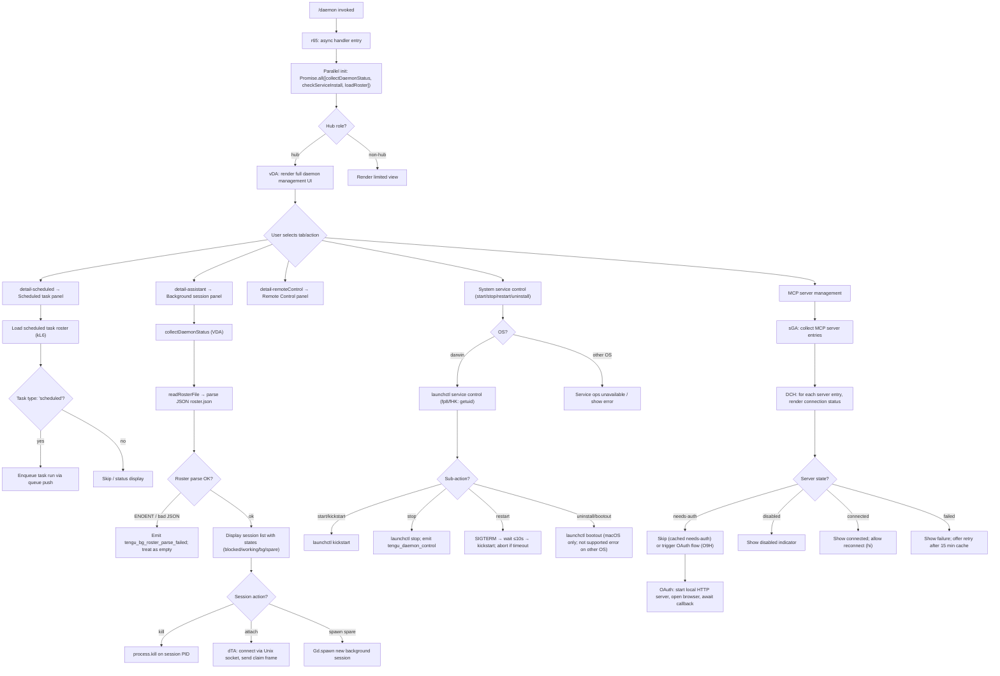

# `/daemon`

> Analysis basis: CC v2.1.175 bundle.js (AST extraction + Claude interpretation)
> Minimum version: v2.1.175

---

## Overview

`/daemon` opens an interactive management panel for the Claude Code background daemon process and its associated subsystems — including background sessions, scheduled tasks, MCP server connections, and the system-level service (launchctl on macOS). The command renders a live JSX UI and drives a rich async handler (`r65`) that collects daemon status, roster data, and MCP state before presenting control surfaces to the user.

---

## Registration

| Field | Value |
|---|---|
| type | `local-jsx` |
| name | `daemon` |
| description | `Manage background services and routines` |
| immediate | `true` |
| module_id | `NDA` |
| load_inline | `true` |
| loc_byte | `13263350` |
| loc_byte_end | `13263518` |
| loc_line | `9677` |
| arbor_handler.name | `r65` |
| arbor_handler.fqn | `claude-2.1.175::r65` |
| arbor_handler.kind | `AsyncFunction` |
| arbor_handler.resolution_path | `module_id` |
| arbor_handler.n_hits | `0` |

Analysis basis: CC v2.1.175 bundle.js:+13263350

---

## Input Branching

The command has 5+ distinct operational branches visible from literals and callGraph: status/info view, background session management, scheduled task management, MCP management, and system service control (start/stop/restart/uninstall). A Mermaid flowchart is used.



---

## Behavioral Spec

### Top-level Handler (`r65`)

Analysis basis: CC v2.1.175 bundle.js:+13252099

```
async function daemonCommandHandler(context):
    // Parallel initialization
    [daemonStatus, serviceInstallInfo, rosterData] = await Promise.all([
        collectDaemonStatus(),   // VDA
        checkServiceInstall(),   // TDA
        loadRosterConfig()       // PPK
    ])

    // Render JSX management UI
    app = renderUI(DaemonManagementComponent, {
        daemonStatus,
        serviceInstallInfo,
        rosterData
    })
    await app.unmount()
```

### Daemon Status Collection (`collectDaemonStatus` / `VDA`)

Analysis basis: CC v2.1.175 bundle.js:+13251620

```
async function collectDaemonStatus():
    [scheduledTaskStatus, mcpStatus, bgSessionStatus, rosterFileContent, supervisionInfo] =
        await Promise.all([
            loadScheduledTaskStatus(),   // KPK
            loadBgSessionStatus(),       // yjK
            loadScheduledBgStatus(),     // _XK
            readRosterFile(),            // sQ
            getSupervisionInfo()         // rr
        ])

    for key in Object.keys(combinedStatus):
        // merge and return unified status map
    return mergedStatus
```

### Roster File Loading (`sQ`)

Analysis basis: CC v2.1.175 bundle.js:+11765066

```
async function readRosterFile():
    rosterPath = buildRosterPath()   // $OH → MOH → k$.join → M_
    try:
        raw = await fs.readFile(rosterPath)
        parsed = JSON.parse(raw)
        if not isValid(parsed):
            throw Error("bad roster structure")
        // validate with cb7: Array.isArray + Object.keys check
        timestampNow = Date.now()
        // o5A: compare file mtime
        if fileIsStale(timestampNow):
            await rotateRosterFile()   // PHK: fs.rename, rebuild path, Date.now
        // optional: SH queue push for error tracking
        return parsed
    catch err:
        emit telemetry("tengu_bg_roster_parse_failed")   // bundle.js:+11765156
        return emptyRoster
```

Roster filename: `roster.json` (bundle.js:+11761241)

### Scheduled Task Loading (`kL6` / `yYA`)

Analysis basis: CC v2.1.175 bundle.js:+13140062

```
async function loadScheduledTasks():
    raw = await fs.readFile(taskFile, "utf8")   // bundle.js:+13047346
    trimmed = raw.trim()
    parsed = JSON.parse(trimmed)
    if not Array.isArray(parsed):
        throw Error("expected array")
    // ru: validate each entry
    tasks = parsed.filter(t => t.type === "scheduled")   // bundle.js:+13140074
    for each task:
        queue.push(task)   // enqueue for execution
    return tasks
```

### Service Installation Check (`TDA`)

Analysis basis: CC v2.1.175 bundle.js:+13235943

```
async function checkServiceInstall():
    homedir = os.homedir()   // HPK.homedir
    plistPath = path.join(homedir, "Library", "LaunchAgents", ...)   // BOH.join
    try:
        stat = await fs.stat(plistPath)   // rp6.stat
        installed = true
        role = "assistant"   // bundle.js:+13236003
    catch:
        installed = false
    return { installed, plistPath }
```

### macOS launchctl Control (`rr` / `b8` / `fp8`)

Analysis basis: CC v2.1.175 bundle.js:+11758329

```
async function launchctlServiceControl(action):
    uid = process.getuid()   // fHK; bundle.js:+11755186
    serviceLabel = "claude daemon"   // bundle.js:+11754228

    if action == "stop":
        run("launchctl", "print")   // bundle.js:+11758345
        await withTimeout(5000, ...)   // bundle.js:+11758379
        emit tengu_daemon_control

    elif action == "restart":
        sendSignal(SIGTERM)
        waitForExit(maxWait=50 polls)   // bundle.js:+11757546
        if not exited:
            throw Error("daemon did not exit within 10s of SIGTERM; restart aborted before kickstart")
            // bundle.js:+11757575
        run("launchctl", "kickstart")   // bundle.js:+11757253

    elif action == "start":
        run("launchctl", "kickstart")

    elif action == "uninstall":
        // only macOS; bundle.js:+11757022 notes "service uninstall not available on darwin"
        run("launchctl", "bootout")   // bundle.js:+11756890
```

Daemon process name used in launchctl: `"claude daemon"` (bundle.js:+11754228), argument count `4` (bundle.js:+11754255).

### Background Session Status (`yjK`)

Analysis basis: CC v2.1.175 bundle.js:+13046836

```
async function loadBgSessionStatus():
    store = asyncStore.getStore()   // n9 → hB4.getStore
    statusPath = buildStatusPath("daemon.status.json")   // Rp6 → NjK.join + M_
    // bundle.js:+13046550

    try:
        raw = await fs.readFile(statusPath)   // Mq
        parsed = parse(raw)
    catch ENOENT:
        return emptyStatus

    if killRequested:
        process.kill(sessionPid)   // bundle.js:+13047033

    if needsRespawn:
        respawnSession()   // OW → JS

    return parsed
```

Status file: `daemon.status.json` (bundle.js:+13046550)

### Scheduled Background Session Status (`_XK`)

Analysis basis: CC v2.1.175 bundle.js:+13138776

```
async function loadScheduledBgStatus():
    statusPath = buildScheduledStatusPath()   // HXK → tJK.join + M_
    // file: "daemon.scheduled.status.json"  bundle.js:+13138569

    try:
        raw = await fs.readFile(statusPath)   // sJK.readFile
        parsed = parse(raw)   // Mq
    catch ENOENT:
        return emptyStatus

    if killRequested:
        process.kill(scheduledPid)   // bundle.js:+13138975
    if needsRespawn:
        respawnSession()   // OW
    return parsed
```

Status file: `daemon.scheduled.status.json` (bundle.js:+13138569)

### MCP Server Management (`DCH` / `sGA`)

Analysis basis: CC v2.1.175 bundle.js:+16537046

```
async function manageMcpServers():
    entries = Object.entries(mcpConfig)
    validEntries = entries.filter(isNotDisabled)   // "disabled" bundle.js:+6758382

    for each entry:
        type = entry.type  // "stdio" | "sse" | "http" | "ws-ide" | "sse-ide" | "claudeai-proxy"
        switch type:
            "stdio" → connectStdioServer()   // spawns subprocess
            "sse" | "http" → connectRemoteServer()
            "ws-ide" | "sse-ide" → connectIdeServer()
            "claudeai-proxy" → connectProxyServer()

        if cachedNeedsAuth:
            log("Skipping connection (cached needs-auth)")   // bundle.js:+6759077
            return

        if recentFailure:
            log("Skipping connection (recent failure cached; retries automatically in 15 min...)")
            // bundle.js:+6759339
            return

        result = await connectServer(entry)
        applyConnectionResult(result)

async function applyConnectionResult(result):
    if slotConfigChangedMidFlight:
        log("applyConnectionResult: disposing orphaned connect (slot config changed mid-flight)")
        // bundle.js:+16537468
        dispose(result)
        return
    if slotRemovedMidFlight:
        log("applyConnectionResult: disposing orphaned connect (slot removed mid-flight)")
        // bundle.js:+16537553
        dispose(result)
        return
    updateServerState(result)
```

### MCP OAuth Flow (`O9H`)

Analysis basis: CC v2.1.175 bundle.js:+6529726

```
async function mcpOAuthFlow(serverEntry):
    emit tengu_mcp_oauth_flow_start   // bundle.js:+6529872

    // Start local HTTP callback server
    server = http.createServer()
    server.listen("127.0.0.1", autoPort)   // bundle.js:+6534335

    authUrl = buildAuthUrl(redirectUri="http://localhost:<port>/callback")
    // bundle.js:+6557819

    // Race: user completes auth vs timeout
    result = await Promise.race([
        waitForCallback(server),
        timeout(300000)   // 5 minutes, bundle.js:+6534432
    ])

    if result == "timeout":
        emit tengu_mcp_oauth_flow_error with reason="timeout"   // bundle.js:+6536569
        cleanup(server)
        return

    if stateMismatch:
        respond(400, "<h1>Authentication Error</h1>...")
        emit error with reason="state_mismatch"   // bundle.js:+6535430
        return

    respond(200, "<h1>Authentication Successful</h1>...")   // bundle.js:+6533592
    completeTokenExchange(authCode)
    emit tengu_mcp_oauth_flow_success   // bundle.js:+6534858
    cleanup(server)
```

Authentication timeout: 300000 ms (bundle.js:+6534432). OAuth callback path: `/callback` (bundle.js:+6532929).

### Background Session Attach (`dTA`)

Analysis basis: CC v2.1.175 bundle.js:+16855958

```
async function attachToBackgroundSession(sessionId):
    claimed = await Gd.claim(sessionId)
    if not claimed:
        emit tengu_bg_sendclaim_failed   // bundle.js:+16856159

    // Write session directory metadata
    await fs.mkdir(sessionDir, mode=0o700)   // bundle.js:+13823600; mode 448 decimal
    await fs.writeFile(sessionFile, JSON.stringify(metadata), mode=0o600)
    // bundle.js:+13823685; mode 384 decimal

    // Connect via Unix socket
    socket = net.connect(socketPath)   // ii8.connect
    socket.on("data", handleFrame)
    socket.write(buildClaimFrame())   // AV5 → Gd.buildClaimFrame

    // Send claim with timeout
    result = await withTimeout(sendClaimTimeout, claimPromise)
    if timeout:
        emit tengu_bg_sendclaim_failed
    return result
```

### Background Session Dispatcher / Supervisor Loop (`D` / `oTA`)

Analysis basis: CC v2.1.175 bundle.js:+16878725

```
async function supervisorDispatchLoop():
    while true:
        // Check free memory
        freeMem = os.freemem()   // aTA.freemem
        if freeMem low:
            emit tengu_bg_dispatch_low_mem   // bundle.js:+16877967

        // Retire settled sessions
        for session in sessionMap.values():
            session.retireIfSettled()   // Q.retireIfSettled

        // Spawn spare session if enabled
        if spareSessionEnabled:
            emit tengu_bg_spare_enable   // bundle.js:+16878671
            spareSession = Gd.spawn(spareConfig)
            emit tengu_bg_spare_claim   // bundle.js:+16878799

        // Process incoming dispatch requests
        for req in pendingDispatch:
            job = sessionMap.get(req.jobId)
            if not job:
                respond ENOJOB  // bundle.js:+16865907
                continue
            if job.state == "closed":
                // escalate after 30s → SIGKILL after 15s
                // bundle.js:+16877321, bundle.js:+16877332
                emit tengu_bg_dispatch_sigkill_escalate
            job.dispatch(req)

        await sleep(dispatchInterval)
```

Session states observed in literals: `starting`, `resuming`, `adopted`, `crashed`, `blocked`, `working`, `bg`, `spare`, `in-progress`, `done`, `killed`, `closed` (various bundle offsets).

### Daemon Config Reload (supervisor `w`)

Analysis basis: CC v2.1.175 bundle.js:+16892052

```
function supervisorConfigReload(newConfig):
    _ZH(newConfig)   // daemon status check
    q.write(serialized)
    for entry in configEntries:
        server = L.get(entry.key)
        if server:
            server.stop()
            server.updateConfig(newConfig)
            server.start()
        else:
            newServer = V.start(entry)
            L.set(entry.key, newServer)
    emit tengu_daemon_config_reload   // bundle.js:+16892870
```

### Daemon UI Component (`vDA`)

Analysis basis: CC v2.1.175 bundle.js:+13252310

```
function DaemonManagementComponent(props):
    [selectedTab, setSelectedTab] = useState("hub")   // "hub" bundle.js:+13252437
    clockContext = C1()   // k$9.useContext

    startTime = Date.now()
    nowFn = L.now

    // Collect live daemon status
    status = VDA(daemonConfig)

    // Scroll/focus refs
    scrollRef = HK.useRef()
    focusTracker = Rf()   // iF.useRef + useSyncExternalStore

    // Render tab panels
    switch selectedTab:
        "detail-scheduled"  → render ScheduledPanel   // bundle.js:+13252930
        "detail-assistant"  → render AssistantPanel   // bundle.js:+13253088
        "detail-remoteControl" → render RemoteControlPanel  // bundle.js:+13253209
        default             → render DaemonOverviewPanel

    // Sub-panels reference literals:
    // "Scheduled"      bundle.js:+13253857
    // "Remote Control" bundle.js:+13254178
    // "Claude daemon"  bundle.js:+13254463
```

---

## State & Side Effects

| Item | Detail |
|---|---|
| Telemetry: tengu_bg_roster_parse_failed | Fired when roster.json cannot be parsed (bundle.js:+11765156) |
| Telemetry: tengu_mcp_oauth_flow_start | Fired when MCP OAuth flow begins (bundle.js:+6529872) |
| Telemetry: tengu_mcp_oauth_flow_success | Fired on successful OAuth token exchange (bundle.js:+6534858) |
| Telemetry: tengu_mcp_oauth_flow_error | Fired on OAuth failure/timeout (bundle.js:+6536569) |
| Telemetry: tengu_daemon_config_reload | Fired when daemon config is reloaded (bundle.js:+16892870) |
| Telemetry: tengu_mcp_skills | Fired during MCP skill enumeration (bundle.js:+6636971) |
| Telemetry: tengu_config_auth_loss_prevented | Fired when a config write would have dropped auth data (bundle.js:+3325310) |
| Telemetry: tengu_feature_ok / tengu_feature_bad | Feature flag check results (bundle.js:+1017151, +1017218) |
| Telemetry: tengu_daemon_control | Fired on launchctl stop/start/restart actions (bundle.js:+16914553) |
| Telemetry: tengu_bg_proto_mismatch | Protocol mismatch between daemon client versions (bundle.js:+16864057) |
| Telemetry: tengu_bg_dispatch_stale_drop | Stale dispatch dropped (bundle.js:+16865425) |
| Telemetry: tengu_bg_attach_legacy_autorespawn | Legacy job auto-respawn during attach (bundle.js:+16868079) |
| Telemetry: tengu_bg_attach | Background session attach event (bundle.js:+16869237) |
| Telemetry: tengu_bg_attach_stall_gave_up | Attach stall gave up (bundle.js:+16870160) |
| Telemetry: tengu_bg_attach_stall_respawn | Attach stall triggered respawn (bundle.js:+16870430) |
| Telemetry: tengu_bg_attach_kick | Session kicked from attach (bundle.js:+16871380) |
| Telemetry: tengu_scheduled_task_missed | A scheduled task missed its window (bundle.js:+16371033) |
| Telemetry: tengu_bg_dispatch_sigkill_escalate | SIGKILL escalation after SIGTERM timeout (bundle.js:+16877366) |
| Telemetry: tengu_bg_low_mem_mb | Low memory detected on macOS (bundle.js:+13321809) |
| Telemetry: tengu_bg_dispatch_low_mem | Dispatch skipped due to low memory (bundle.js:+16877967) |
| Telemetry: tengu_scheduled_task_fire | Scheduled task executed (bundle.js:+16371784) |
| Telemetry: tengu_scheduled_task_expired | Scheduled task expired without running (bundle.js:+16372127) |
| Telemetry: tengu_bg_spare_enable | Spare session pool enabled (bundle.js:+16878671) |
| Telemetry: tengu_bg_sendclaim_failed | Claim frame send to background session failed (bundle.js:+16856159) |
| Telemetry: tengu_bg_state_read_transient | Transient state read during session lifecycle (bundle.js:+4249629) |
| Telemetry: tengu_bg_spare_claim | Spare session successfully claimed (bundle.js:+16878799) |
| Telemetry: tengu_bg_spare_claim_fail | Spare session claim failed (bundle.js:+16879065) |
| File I/O: roster.json | Read and rotated by sQ; path built via k$.join (bundle.js:+11761241) |
| File I/O: daemon.status.json | Read by yjK for background session status (bundle.js:+13046550) |
| File I/O: daemon.scheduled.status.json | Read by _XK for scheduled session status (bundle.js:+13138569) |
| File I/O: daemon.json | Used by hG/cx to locate daemon control socket (bundle.js:+11754802) |
| File I/O: mcp-needs-auth-cache.json | Caches needs-auth state for MCP servers (bundle.js:+6750351) |
| File I/O: pins.json | Pinned session data read by UG6 (bundle.js:+4250726) |
| Process signals | process.kill used for session teardown; SIGTERM with 10 s window, SIGKILL escalation (bundle.js:+13047033, +16870365) |
| Unix socket | dTA connects via ii8.connect for bg session attach |
| HTTP server | Local OAuth callback server started on 127.0.0.1 with auto port; unref()d (bundle.js:+6534335, +6534361) |
| appState changes | MCP server map updated (q/L/V maps); session roster updated |
| Hook registration | u9 → pvA.register for session tracking hooks (bundle.js:+64135) |
| Sound | None detected in traversal |
| JSX rendering | M.render / M.unmount for full TUI lifecycle (bundle.js:+13262723, +13262937) |

---

## Version History

| Version | Change |
|---|---|
| v2.1.175 | Initial analysis |

---

## Common Mistakes

1. **Assuming `/daemon` is non-interactive.** The command renders a full JSX UI (`local-jsx` type, `immediate: true`). It blocks until the UI is dismissed; do not expect a one-shot text response.
2. **Calling `/daemon` expecting `start`/`stop` subcommand syntax.** The command opens a management panel — service start/stop/restart/uninstall actions are available as interactive controls inside the panel, not as CLI arguments.
3. **Expecting service management on non-macOS.** The launchctl-based service control (`start`, `stop`, `restart`, `uninstall`) targets macOS only (`darwin`). On other platforms the service operations are unavailable or surface an error (bundle.js:+11757022).
4. **Treating roster.json as always present.** The roster file may be absent (`ENOENT`) or malformed. The handler gracefully returns an empty roster and emits `tengu_bg_roster_parse_failed` — callers must not assume the roster is populated.
5. **Expecting immediate MCP reconnect after auth failure.** A failed MCP server is cached for approximately 15 minutes before automatic retry. The cache can only be bypassed by editing the plugin config (bundle.js:+6759339).
6. **Misinterpreting the `uninstall` label.** On macOS the `uninstall` action runs `launchctl bootout`, not a full package removal. The literal `"service uninstall not available on darwin"` (bundle.js:+11757022) is an internal guard string indicating this path is macOS-gated, not that uninstall is disabled.

---

## Appendix — Identifier Mapping

> For bundle debugging only. Identifiers change across versions.

| Identifier | Role |
|---|---|
| r65 | Main async handler for `/daemon` (arbor_handler; AsyncFunction) |
| A85 | Inner UI render function wrapping r65 output |
| vDA | Daemon management JSX component (React function component) |
| VDA | Collect combined daemon status (parallel async aggregator) |
| TDA | Check service installation (plist stat on macOS) |
| PPK | Load roster configuration |
| SiH | Roster config loader helper |
| wPK | Parallel status fetch coordinator |
| kL6 | Scheduled task list loader |
| yYA | Raw task file reader / JSON parser |
| _DA | Task entry array validator |
| eYA | Task entry normalizer |
| hG | Daemon socket / process control (read daemon.json, kill) |
| Su6 | Read daemon socket file |
| B5A | Parse daemon process args from file |
| KPK | Load daemon status (status.json + same-dir check) |
| _ZH | Daemon status file parser with ENOENT handling |
| n9 | AsyncLocalStorage store accessor |
| E8 | Error kind classifier |
| GDA | Daemon status builder |
| TH | String coercion / type helper |
| cx | Daemon socket path resolver (joins F5A + M_) |
| yjK | Background session status loader (daemon.status.json) |
| Rp6 | Status path builder (NjK.join + M_) |
| _XK | Scheduled background session status loader |
| HXK | Scheduled status path builder |
| sQ | Roster file read, validate, rotate |
| $OH | Roster path resolver |
| MOH | Base roster directory path builder |
| o5A | Roster file staleness checker (Date.now based) |
| PHK | Roster file rotation handler (fs.rename) |
| cb7 | Roster structure validator (Array.isArray + Object.keys) |
| M1 | Miscellaneous helper (d56) |
| rr | launchctl service status / control entry point |
| b8 | launchctl invocation wrapper |
| c_ | Shell command executor with output capture |
| b6 | Command output parser |
| fp8 | Get current Unix UID (process.getuid) |
| fHK | UID retrieval helper |
| W_ | Path/directory utility (iG) |
| iG | OS-level path helper |
| ma6 | File existence check helper |
| o6 | Directory creation helper |
| N | Logger / notification emitter |
| J9f | Log message formatter |
| BvA | Log destination selector |
| RH | JSON serializer helper |
| nf | Log line formatter (REDACTED masking) |
| WIA | Log prefix mapper |
| mgH | Log writer (LIA → H.write) |
| G9f | Append-file log writer with rotation |
| $gH | Log buffer flush with setTimeout/setImmediate batching |
| L4H | Log file path builder |
| je8 | Log rotation (stat → rename → unlink) |
| W9f | Log file appender with mkdir-p |
| EIA | Log file path helper |
| u9 | Hook registrar (pvA.register) |
| M | MCP server state manager (render/unmount) |
| DCH | MCP server connection handler (per-entry) |
| Vi | MCP server entry processor |
| uV6 | MCP server slot updater |
| ze | MCP server connect orchestrator |
| yg | MCP server type enumerator |
| cX8 | MCP server error colorizer (red/yellow) |
| bV6 | MCP server state map manager |
| eV | MCP server event emitter |
| fw | MCP event bus (VAH, C6, Mq) |
| n8 | MCP server name resolver |
| Hi9 | MCP tool hash / cache key builder |
| gg_ | MCP cache read (n9 + Y28 + d6) |
| l2H | MCP tool list hasher (sha256/hex) |
| SJ8 | MCP tool schema validator |
| RJ8 | MCP tool result hasher |
| rX | MCP result hash builder |
| yJ8 | MCP server identity checker (Sf) |
| Sf | MCP server fingerprint |
| z8 | MCP debug logger (xdH.push + ua.logMCPDebug) |
| DP8 | MCP per-server connection driver |
| dc | MCP connection context (su + tK) |
| t1H | MCP connection transport selector |
| O9H | MCP OAuth server / token exchange |
| nH6 | MCP pending-connection tracker (fP8 map) |
| JP8 | MCP connection result recorder |
| hi | MCP reconnect handler |
| su | MCP session context |
| w | Daemon supervisor write loop |
| YL | MCP error logger (xdH.push + ua.logMCPError) |
| IEL | MCP SSH-tunnel auth path detector |
| jP8 | MCP tool call dispatcher |
| lH6 | MCP pending call lookup (KP8.get) |
| iH6 | MCP in-flight call lookup (fP8.get) |
| $i9 | MCP needs-auth cache accessor |
| Y28 | MCP needs-auth cache path builder |
| $F_ | MCP auth cache updater |
| j | MCP server kill list builder |
| S | MCP server subprocess manager |
| nN | MCP notification dispatcher (z6) |
| z6 | MCP notification fan-out |
| oB_ | MCP server capability checker |
| X8 | MCP server config reader |
| y | MCP usage/credit warning emitter |
| qs | Usage-based billing checker |
| Ki9 | MCP server limit enforcer (Kg) |
| Kg | MCP server request pipeline (AbortController + stream) |
| W66 | MCP port parser (parseInt) |
| D28 | MCP secondary port parser (parseInt) |
| ki8 | MCP connection result applier |
| YCH | MCP tool list reconciler (l2H) |
| AG | MCP server cleanup + reconnect |
| X66 | MCP tool list hash checker |
| $ | Background session background-task helper |
| hjK | Session heartbeat ticker |
| Ls | Session locking helper |
| sGA | MCP server entry collector |
| tX8 | MCP server filter (HEL/HF_ set checks) |
| i8 | Timeout-guarded async helper |
| O | Background session context accessor (C8) |
| SiH | Roster config loader |
| qX6 | Roster config set manager |
| qG4 | Roster config entry builder |
| C1 | Clock context accessor (k$9.useContext) |
| L | Server map (A.close/q.close) |
| Rf | Focus/scroll tracker (iF hooks) |
| z | Daemon UI state store |
| kH | Daemon state getter (d + A6) |
| A6 | Daemon state entry constructor (d56) |
| CH | Daemon state setter (d + A6) |
| ZS | Daemon session record builder (Wm + Sl) |
| Wm | Session record constructor (Kb) |
| qIH | Session event emitter (ES) |
| kX_ | Session UUID generator (IX_.randomUUID) |
| aU | Graceful shutdown orchestrator (Promise.race + process.exit) |
| cLH | Shutdown initiator (dLH.shutdown) |
| lLH | Shutdown timer clearer |
| G | Input key handler (full TUI vi-mode dispatch) |
| T | Keymap resolver (kv6 + J56) |
| J56 | Key sequence table lookup (vaK) |
| vaK | Key sequence map (Object.keys) |
| Pc | Cursor position helper (ZY) |
| ZyK | Vi normal-mode motion dispatcher |
| X35 | Vi cursor motion: setOffset + VyK |
| VyK | Vi motion: word/char movement |
| P35 | Vi motion: line-count parseInt |
| W35 | Vi motion: setOffset + setLastFind |
| G35 | Vi motion: OBH + setOffset |
| OBH | Vi motion: H35 + f.equals |
| T35 | Vi textobject selector |
| bc8 | Vi textobject inner/select range |
| qyK | Vi visual-mode op dispatcher |
| Qc8 | Vi selection range calculator |
| tIK | Vi lastIndexOf helper |
| gc8 | Vi selection end-check (R4 + H.endsWith) |
| R4 | String indexOf utility |
| LvH | Vi selection limiter (ZY) |
| AyK | Vi visual paste/yank |
| u76 | Vi register set + setText + setOffset |
| MyK | Vi visual replace |
| LyK | Vi visual replace helpers |
| zyK | Vi visual case toggle |
| OyK | Vi case transformers (toUpperCase/toLowerCase) |
| b | Vi register manager + history |
| dSH | Vi register file reader |
| HMH | Vi register path builder |
| N9 | Vi register error handler |
| Ty | Vi register entry parser |
| btH | Vi register file writer |
| yf | Vi register directory helper (iG) |
| FG9 | Vi register history filter |
| CtH | Vi register entry time filter |
| P | SSH/socket stream handler (Buffer.concat + Xv) |
| X | SSH stream multiplexer |
| b7 | SSH stream end handler |
| YV5 | PTY/terminal session protocol handler (full dispatch) |
| c | Daemon session process map |
| _HK | PID file unlinker |
| NcK | Cron schedule parser |
| uN | Cron string tokenizer |
| B1H | Scheduled job reconciler |
| f8H | Scheduled job set membership checker |
| YyK | Vi paste handler |
| jyK | Vi paste insert helpers |
| eIK | Vi indent operator |
| wBH | Vi indent slice helper |
| HyK | Vi unindent operator |
| Y2A | Vi line prefix stripper |
| D | Background session dispatcher / session lifecycle manager |
| ng8 | macOS memory check helper |
| UG6 | Pinned session loader (pins.json) |
| ZS_ | Pins file path builder |
| f8L | Pinned sessions directory scanner |
| Q | Background session process (socket + PTY lifecycle) |
| l | Session loop / dispatch consumer |
| C | PTY write helper |
| B | Session buffer helper |
| uZ | Session socket address builder |
| p | Session pong handler |
| Xv | Control-frame serializer (Buffer + writeUInt32BE) |
| Pm8 | Control-frame deserializer (Buffer.readUInt32BE) |
| dTA | Background session attach / claim sender |
| LXA | Session directory + metadata writer |
| qV5 | Claim timeout enforcer |
| AV5 | Claim frame builder (Gd.buildClaimFrame) |
| oTA | Background session lifecycle manager (spawn/retire/roster) |
| Af | Session artifact path builder |
| Vq | Session state file watcher |
| ZO | Session order tracker (ZN) |
| dXH | Session tag/filter classifier |
| n7 | Session journal writer |
| ef6 | Session finish handler (sQ roster update) |
| pu6 | Session socket path builder |
| OOH | Session roster address builder |
| aQ | Session socket file creator |
| mu6 | Session mutex file builder |
| W2A | Vi insert-mode motion dispatcher |
| f35 | Vi insert motion: setOffset + GyK |
| GyK | Vi insert motion: word navigation |
| L35 | Vi insert motion: line-count parseInt |
| M35 | Vi insert O2A + TyK |
| O2A | Vi insert text-object operator |
| TyK | Vi insert J2A + lc8/cc8 |
| $35 | Vi insert motion line parseInt |
| O35 | Vi insert find (xc8) |
| xc8 | Vi insert find + setLastFind |
| z35 | Vi insert textobject (X2A + uc8) |
| uc8 | Vi insert textobject bc8 + u76 |
| w35 | Vi insert setOffset + setLastFind |
| Y35 | Vi insert OBH + setOffset |
| D35 | Vi insert zBH + XyK |
| zBH | Vi insert delete/change range |
| XyK | Vi insert q.equals + z2A + u76 |
| j35 | Vi insert pc8 |
| pc8 | Vi insert paste-below |
| J35 | Vi insert Fc8 |
| Fc8 | Vi insert join/wrap |
| J | Background session job map reference (→ D) |
| if6 | macOS service uninstall flow (bootout) |
| d5A | macOS LaunchAgents plist path builder |
| xu6 | macOS service start flow (kickstart) |
| c5A | macOS kickstart executor with timeout |
| E | MCP server connection entry (W + Math) |
| W | MCP connection transport initiator |
| V | MCP server start handle |

---

Note: index built via Arbor fallback; some signals (telemetry, literals) may be missing — see arbor-fallback.js.