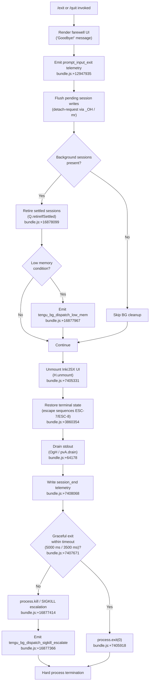

# `/exit`

> Analysis basis: CC v2.1.175 bundle.js (AST extraction + Claude interpretation)
> Minimum version: v2.1.175

---

## Overview

The `/exit` command (also aliased as `/quit`) terminates the current Claude Code CLI session. It initiates an orderly shutdown sequence: it displays a "Goodbye!" farewell message, performs cleanup of background sessions and scheduled tasks, flushes pending I/O and telemetry, and then calls `process.exit` to halt the process. The command is registered as `local-jsx` type and executes immediately upon invocation.

---

## Registration

| Field | Value |
|---|---|
| type | `local-jsx` |
| name | `exit` |
| description | `null` |
| aliases | `["quit"]` |
| immediate | `true` |
| module_id | `WYK` |
| load_inline | `true` |
| loc_byte | `12948498` |
| loc_byte_end | `12948694` |
| loc_line | `9144` |
| arbor_handler.name | `Ts7` |
| arbor_handler.fqn | `claude-2.1.175::Ts7` |
| arbor_handler.kind | `AsyncFunction` |
| arbor_handler.resolution_path | `module_id` |
| arbor_handler.n_hits | `1` |

Analysis basis: CC v2.1.175 bundle.js:+12948498

---

## Input Branching

The `/exit` command takes no user-supplied arguments. The branching logic occurs entirely within the shutdown orchestration: whether background sessions exist, whether active I/O needs draining, and whether the process-kill path escalates. Five or more distinct branches exist in the shutdown flow.



---

## Behavioral Spec

### 1. Command Entry — Handler `exitCommandHandler` (Ts7)

The handler is an `AsyncFunction` resolved via `module_id` → `WYK`.

```
async function exitCommandHandler(context):
    # 1. Display farewell message
    renderFarewellComponent()            # BwA.createElement + Gs7/gW
                                         # Literal "Goodbye!" at bundle.js:+12947711

    # 2. Emit input-exit telemetry marker
    emitTelemetry("prompt_input_exit")   # bundle.js:+12947935

    # 3. Flush background-session detach request
    flushDetachRequest()                 # _OH → mr → mHH.write
                                         # literal "detach-request" bundle.js:+11297141

    # 4. Cancel any scheduled tasks
    cancelScheduledTasks()               # Jm8 → WE, by7, Uq
                                         # literal "scheduled task" bundle.js:+11290354

    # 5. Run main shutdown sequence
    await runShutdownSequence()          # y9 — see §2

    # 6. Final stderr write if needed
    writeSync(stderr, ...)               # j3H.writeSync bundle.js:+7408138
```

Analysis basis: CC v2.1.175 bundle.js:+12947747

---

### 2. Shutdown Sequence — `shutdownOrchestrator` (y9)

```
async function shutdownOrchestrator():
    # Phase A: Prepare UI teardown
    unmountInkUI()                       # TbH → H.unmount bundle.js:+7405331
    restoreTerminalCursor()              # b$8 → ESC-7 / ESC-8 sequences
                                         # terminal compat: ghostty ≥1.2.0,
                                         # iTerm2 ≥3.6.6 bundle.js:+3587979

    # Phase B: Write scroll summary
    writeScrollSummary()                 # ll_ → j3H.writeSync bundle.js:+7405710
                                         # applies J6.dim styling

    # Phase C: Write and flush session-end record
    writeSessionEndRecord()              # LG8 → v8q (timestamps Date.now, Math.round)
                                         # literal "session_end" bundle.js:+7408068
    flushStartupPerfTelemetry()          # $$6 → uIA → FIA
                                         # event "tengu_startup_perf" bundle.js:+221966

    # Phase D: Stop supervisor / MCP connections
    stopSupervisor()                     # w → T.stop, E.stop, L.delete
                                         # literal "supervisor" bundle.js:+16892077

    # Phase E: Drain output buffer
    drainOutputBuffer()                  # OgH → pvA.drain bundle.js:+64178

    # Phase F: Race graceful shutdown vs. timeout
    graceful = await Promise.race([
        waitForAllSettled(),             # p8q → Promise.allSettled bundle.js:+13567082
        abortAfterTimeout(              # AbortSignal.timeout bundle.js:+7407956
            Math.max(5000, 3500))       # constants bundle.js:+7407671, +7407678
    ])

    if graceful:
        clearTimeout(shutdownTimer)      # clearTimeout bundle.js:+7407868
        process.exit(0)                  # nl_ → process.exit bundle.js:+7405918
    else:
        process.kill(pid, signal)        # nl_ → process.kill bundle.js:+7405943
        # escalates to SIGKILL if needed via D → b.kill bundle.js:+16877407
```

Analysis basis: CC v2.1.175 bundle.js:+7407574

---

### 3. Background Session Cleanup — `bgSessionManager` (D)

Called transitively from the shutdown path; handles daemon/worker processes.

```
function bgSessionManager():
    for session in A.values():           # bundle.js:+16878088
        session.retireIfSettled()        # Q.retireIfSettled bundle.js:+16878099

    if lowMemory(os.freemem()):          # aTA.freemem bundle.js:+16877797
        emitTelemetry("tengu_bg_dispatch_low_mem")  # bundle.js:+16877967
        dropExcessSessions()

    if spareSessionNeeded():
        emitTelemetry("tengu_bg_spare_enable")      # bundle.js:+16878671
        claimSpareSession()              # literal "spare" bundle.js:+16878158
        emitTelemetry("tengu_bg_spare_claim")       # bundle.js:+16878799

    if sigkillEscalation:
        emitTelemetry("tengu_bg_dispatch_sigkill_escalate")  # bundle.js:+16877366
        sendSignal("SIGKILL")            # bundle.js:+16877414
```

Analysis basis: CC v2.1.175 bundle.js:+16877248

---

### 4. Farewell UI Component — `farewellComponent` (Gs7 → gW)

```
function farewellComponent():
    return createElement(
        textElement,
        { content: "Goodbye!" }          # literal bundle.js:+12947711
    )
```

Analysis basis: CC v2.1.175 bundle.js:+12947702

---

### 5. Detach Request Flush — `flushDetachRequest` (_OH)

```
function flushDetachRequest():
    taskState = D98()                    # read task state
    if taskState has pending items:
        sendIPC(Yaq, { type: "detach-request" })   # literal bundle.js:+11297141
        mr()                             # write via mHH.write bundle.js:+10631546
        IKH()                            # finalize IPC record bundle.js:+11297187
```

Analysis basis: CC v2.1.175 bundle.js:+11297107

---

### 6. Scheduled Task Cancellation — `cancelScheduledTasks` (Jm8)

```
function cancelScheduledTasks():
    activeTasks = WE(taskRegistry)       # enumerate "scheduled task" entries
    for task in activeTasks:
        taskQueue.push(task)             # H.push bundle.js:+11290340
    scheduleInfo = by7(activeTasks)      # compute next-run offsets
        # by7 uses: uN (cron parser), Ty (time formatter),
        # StH (datetime arithmetic), m9 (duration formatter)
    textBlock = Uq(scheduleInfo)         # word-wrap for display
```

Analysis basis: CC v2.1.175 bundle.js:+11290335

---

### 7. Terminal State Restoration — `restoreTerminalState` (b$8)

```
function restoreTerminalState():
    Dt.writeSync(stdout, ESC_SAVE)       # "\x1B7" bundle.js:+3860354
    Dt.writeSync(stdout, ESC_RESTORE)    # "\x1B8" bundle.js:+3860365
    terminalCompat = ZkH()               # checks terminal identity:
        # ghostty ≥ 1.2.0 bundle.js:+3587979, +3588009
        # iTerm.app ≥ 3.6.6 bundle.js:+3588048, +3588080
    if tmuxIntegration:
        applyTmuxEscape(F0)              # replaces "\\" and "\"" bundle.js:+3509805
    DkH()                                # additional teardown step
    vM()                                 # finalize display state
    N(debugLog)                          # write debug-level log entry
```

Analysis basis: CC v2.1.175 bundle.js:+3860200

---

### 8. Scroll Summary Writer — `scrollSummaryWriter` (ll_)

```
function scrollSummaryWriter():
    P0()                                 # pre-write preparation
    vu()                                 # check viewport state
    h6()                                 # resolve terminal geometry (iG)
    bh6()                                # check stat of output path (q.statSync)
    V$(h6, z4)                           # measure visible region
    content = _.replaceAll(raw, "\\\\", "\\\"")  # escape sequences
               # bundle.js:+7405629, +7405652
    h8q()                                # format content block
    j3H.writeSync(stderr, content)       # bundle.js:+7405710
    applyDimStyling(J6.dim)              # bundle.js:+7405726
```

Analysis basis: CC v2.1.175 bundle.js:+7405541

---

### 9. Hard Process Termination — `forceExit` (nl_)

```
function forceExit():
    clearTimeout(shutdownTimer)          # bundle.js:+7405837
    pid = b4.get(processRegistry)        # bundle.js:+7405870
    process.exit(code)                   # bundle.js:+7405918
    # if exit does not complete:
    process.kill(pid, signal)            # bundle.js:+7405943
    # guard: throw new Error("unreachable")  # literal bundle.js:+7405991
```

Analysis basis: CC v2.1.175 bundle.js:+7405837

---

## State & Side Effects

| Item | Detail |
|---|---|
| Telemetry — `prompt_input_exit` | Fired immediately when `/exit` is invoked (bundle.js:+12947935) |
| Telemetry — `tengu_scroll_summary` | Fired during scroll-summary write phase (bundle.js:+7407087) |
| Telemetry — `tengu_cache_eviction_hint` | Fired during session-end record flush (bundle.js:+7408030) |
| Telemetry — `tengu_startup_perf` | Startup performance data flushed on exit (bundle.js:+221966) |
| Telemetry — `tengu_bg_dispatch_sigkill_escalate` | Fired when a background session requires SIGKILL (bundle.js:+16877366) |
| Telemetry — `tengu_bg_dispatch_low_mem` | Fired when free memory is critically low during BG cleanup (bundle.js:+16877967) |
| Telemetry — `tengu_bg_spare_enable` | Fired when a spare background session slot is activated (bundle.js:+16878671) |
| Telemetry — `tengu_bg_spare_claim` | Fired when a spare session is successfully claimed (bundle.js:+16878799) |
| Telemetry — `tengu_bg_spare_claim_fail` | Fired when spare session claim fails (bundle.js:+16879065) |
| Telemetry — `tengu_daemon_config_reload` | Daemon config reload event emitted during supervisor stop (bundle.js:+16892870) |
| Telemetry — `tengu_amber_creek` | Fired during fullscreen/rendering mode determination (bundle.js:+3520927) |
| Telemetry — `tengu_pewter_brook` | Fired during rendering mode determination path (bundle.js:+3520835) |
| Hook registration | `immediate: true` — command executes without entering agent loop |
| appState changes | Active sessions retired; supervisor stopped; MCP connections closed |
| Terminal side effects | ESC-7 / ESC-8 cursor-save/restore sequences written to stdout; tmux escape sequences handled separately |
| Process termination | `process.exit` called via `nl_`; SIGKILL escalation path available via `D → b.kill` |
| Timeout constants | Graceful shutdown window: `Math.max(5000, 3500)` ms = 5000 ms (bundle.js:+7407671, +7407678) |
| Farewell message | Literal string `"Goodbye!"` rendered via JSX component (bundle.js:+12947711) |
| stdout drain | `pvA.drain` called before process exit to ensure buffered output is flushed (bundle.js:+64178) |

---

## Version History

| Version | Change |
|---|---|
| v2.1.175 | Initial analysis |

---

## Common Mistakes

1. **Expecting `/exit` to accept arguments** — the command ignores any trailing text; it is purely a termination trigger with no configuration surface.
2. **Assuming synchronous termination** — the handler is `async`; a graceful drain phase runs first (up to 5000 ms). Scripts that `kill` the parent immediately after sending `/exit` may interrupt the flush.
3. **Forgetting the `/quit` alias** — both `/exit` and `/quit` map to the same `exitCommandHandler`; there is no behavioral difference between them.
4. **Expecting background sessions to be preserved** — `/exit` retires all settled background sessions; unsettled sessions may receive SIGTERM then SIGKILL escalation.
5. **Terminal escape leakage** — if Claude Code is killed hard (not via `/exit`), the ESC-7/ESC-8 restore sequences are never written, which may leave the terminal cursor in a saved state. Always prefer `/exit` or `/quit` over external `kill` signals for clean teardown.

---

## Appendix — Identifier Mapping

> For bundle debugging only. Identifiers change across versions.

| Identifier | Role |
|---|---|
| `Ts7` | Main exit command handler (`exitCommandHandler`) — AsyncFunction entry point |
| `P9` | Spawn-mode / process context helper |
| `fjH` | Process spawn helper (called from P9) |
| `H` | Animation / random-delay utility (uses Math.random + setTimeout) |
| `_OH` | Detach-request flush coordinator |
| `D98` | Task state reader |
| `Yaq` | IPC send helper |
| `qx8` | IPC channel accessor |
| `C8` | Session state accessor |
| `mr` | IPC write dispatcher (mHH.write) |
| `RH` | JSON serializer wrapper (JSON.stringify) |
| `IKH` | IPC record finalizer |
| `eM` | Exit-mode flag setter |
| `Jm8` | Scheduled-task cancellation coordinator |
| `WE` | Task registry enumerator |
| `iG` | Terminal geometry resolver |
| `by7` | Scheduled task next-run offset calculator |
| `uN` | Cron expression parser |
| `K` | Cron string formatter (padEnd) |
| `D` | Background session manager |
| `f` | Async task tracker (q.add / q.delete) |
| `j` | Process kill dispatcher |
| `Y` | Forced-shutdown finalizer (calls process.exit) |
| `$` | Helper matched against process signals |
| `J` | UTC date arithmetic helper |
| `Ty` | Time string formatter |
| `O4L` | Cron field parser (split / match / parseInt) |
| `A` | Token/label lowercase normalizer |
| `StH` | Datetime scheduler arithmetic |
| `_` | Generic string/date operand |
| `O` | Date object being mutated in scheduler |
| `L` | Session/connection close coordinator |
| `q` | Data-event emitter / queue |
| `m9` | Duration string formatter (floor/round) |
| `Uq` | Word-wrap / string truncation utility |
| `q8` | String visual width helper (Bun.stringWidth) |
| `n1` | Grapheme-aware string slicer |
| `ZY` | Zero-width character handler |
| `Gs7` | Farewell JSX component renderer |
| `y9` | Shutdown sequence orchestrator |
| `TbH` | Ink UI unmount coordinator |
| `vb` | Post-unmount state cleaner |
| `b$8` | Terminal state restoration handler |
| `ZkH` | Terminal identity / compatibility checker |
| `DkH` | Additional terminal teardown step |
| `F0` | Tmux escape sequence processor |
| `vM` | Display state finalizer |
| `N` | Debug-level log writer |
| `ll_` | Scroll summary writer |
| `P0` | Pre-write preparation step |
| `vu` | Viewport state checker |
| `h6` | Terminal geometry helper (iG wrapper) |
| `bh6` | Output path stat checker |
| `EC` | Terminal column calculator |
| `W_` | Terminal row calculator |
| `o6` | Path existence check utility |
| `V$` | Visible region measurer |
| `z4` | Region sizing helper |
| `h8q` | Content block formatter |
| `nl_` | Hard-exit / force-kill handler |
| `OgH` | stdout drain caller (pvA.drain) |
| `w` | Supervisor stop / MCP connection teardown |
| `_ZH` | Supervisor session stats writer |
| `n9` | Async-local store reader |
| `E8` | Session event emitter |
| `GDA` | Supervisor write-data helper |
| `TH` | String coercion utility |
| `eXK` | Key-width calculator for stats table |
| `T` | MCP transport stop controller |
| `kv6` | MCP transport variant accessor |
| `J56` | MCP connection state machine |
| `E` | MCP server lifecycle manager |
| `W` | MCP connection handler |
| `gsK` | Heartbeat manager |
| `GAH` | Heartbeat tick handler |
| `V` | Background session lifecycle controller |
| `d` | Daemon IPC dispatcher |
| `p8q` | Promise.allSettled wrapper for shutdown waiters |
| `$$6` | Startup-perf telemetry flush dispatcher |
| `he8` | Perf mark recorder |
| `FIA` | Startup perf metrics aggregator |
| `uIA` | Perf report writer (file + telemetry) |
| `UIA` | Perf report path builder |
| `vwH` | Sync file write helper (openSync/writeFileSync/fsyncSync/closeSync) |
| `RIA` | Perf checkpoint list builder |
| `Su` | `perf_hooks` require wrapper |
| `BIA` | Perf report alternate path builder |
| `LG8` | Session-end record writer |
| `N8q` | Session stats collector |
| `v8q` | Session metrics calculator (Date.now, Math.round) |
| `Z8q` | Session metrics sub-calculator |
| `k1` | Fullscreen / render-mode initializer |
| `b8H` | Agent type discriminator |
| `TN_` | Agent config accessor |
| `os` | OS-level fullscreen helper |
| `GN_` | Platform (Windows) fullscreen gate |
| `a_` | Fullscreen mode setter |
| `Hg4` | Amber-creek telemetry path |
| `z6` | Cache eviction / module registry helper |
| `JM6` | Session-end telemetry emitter |
| `M6` | Module metadata accessor (d56) |
| `ZbH` | Post-shutdown deferred resolver |
| `KG8` | Deferred completion callback |

---

Note: index built via Arbor fallback; some signals (telemetry, literals) may be missing — see arbor-fallback.js.