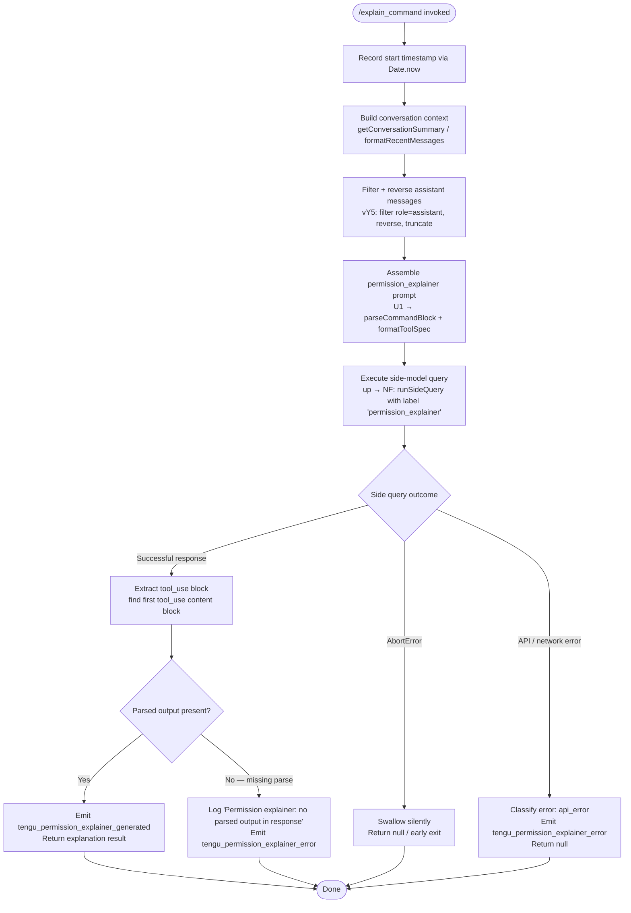

# `/explain_command`

> Analysis basis: CC v2.1.175 bundle.js (AST extraction + Claude interpretation)
> Minimum version: v2.1.175

---

## Overview

`/explain_command` is an internal `tool`-type slash command that drives the **permission explainer** subsystem. When invoked, it queries a side-model call (labeled `permission_explainer`) to produce a human-readable explanation of why a particular tool-use action requires (or does not require) specific permissions, then surfaces the result back to the user or the calling agent. The handler is an `AsyncFunction` resolved directly from the registration block.

---

## Registration

| Field | Value |
|---|---|
| type | `tool` |
| name | `explain_command` |
| description | `null` (not set in registration) |
| loc_byte | `14600374` |
| loc_byte_end | `14600410` |
| loc_line | `11383` |
| arbor_handler.name | `jbK` |
| arbor_handler.fqn | `claude-2.1.175::jbK` |
| arbor_handler.kind | `AsyncFunction` |
| arbor_handler.resolution_path | `direct` |
| arbor_handler.n_hits | `1` |

Analysis basis: CC v2.1.175 bundle.js:+14600374

---

## Input Branching

The handler exhibits four distinct execution paths (normal success, abort/cancel, API error, and no-parsed-output fallback), so a Mermaid flowchart is used.



---

## Behavioral Spec

### 1. Handler Entry — `jbK` (permissionExplainerHandler)

```
async function permissionExplainerHandler(toolInput, agentContext):
    startTime = Date.now()                          // bundle.js:+14600093

    // Build a compact conversation representation
    summary = getConversationSummary(agentContext)   // uWA → C6, bundle.js:+14600069

    // Collect recent assistant messages (up to last 3, max 1000 chars each)
    recentMessages = filterAndTruncateAssistantMessages(
        agentContext.messages,
        role = "assistant",
        maxCount = 3,                               // bundle.js:+14599693
        maxCharsEach = 1000                         // bundle.js:+14599638
    )                                               // vY5, bundle.js:+14600132

    // Assemble the structured prompt block for the explainer model
    promptBlock = buildPermissionExplainerPrompt(
        toolInput,
        summary,
        recentMessages
    )                                               // U1, bundle.js:+14600279

    // Execute side-model query tagged 'permission_explainer'
    response = await runSideQuery(
        label      = "permission_explainer",        // bundle.js:+14600432
        prompt     = promptBlock,
        agentCtx   = agentContext
    )                                               // up, bundle.js:+14600292

    return parseAndEmitResult(response, startTime)
```

Analysis basis: CC v2.1.175 bundle.js:+14600069, +14600093, +14600132, +14600279, +14600292

---

### 2. Conversation Summary Builder — `uWA` → `C6` (getConversationSummary)

```
function getConversationSummary(agentContext):
    config = loadConfigSafe()                       // U7H, bundle.js:+14599945
    // Reads global config via readFileSync (utf-8), parses JSON
    // Handles ENOENT gracefully, creates backup copy on migration
    // Returns structured summary object used to seed the explainer prompt
    timestamp = Date.now()                          // bundle.js:+3327001
    return summary
```

Analysis basis: CC v2.1.175 bundle.js:+14599945, +3326911, +3327001

---

### 3. Recent-Message Formatter — `vY5` (filterAndTruncateAssistantMessages)

```
function filterAndTruncateAssistantMessages(messages, maxCount, maxCharsEach):
    assistantMsgs = messages.filter(m => m.role == "assistant")
                                                    // bundle.js:+14599650, literal "assistant":+14599673
    assistantMsgs.reverse()                         // bundle.js:+14599718
    take = assistantMsgs.slice(0, maxCount)         // maxCount=3, bundle.js:+14599693

    result = []
    for msg in take:
        textContent = extractTextBlocks(msg)        // filters type="text" blocks, literal:+14599776
        truncated   = truncateAtSurrogateBoundary(  // yu, bundle.js:+14599861
            textContent, maxCharsEach               // 1000 chars, bundle.js:+14599638
        )
        result.unshift(truncated + "...")           // prepend, literal "...":+14599869
    return result.join("\n")                        // bundle.js:+14599910
```

Analysis basis: CC v2.1.175 bundle.js:+14599584, +14599638, +14599650, +14599693, +14599718, +14599776, +14599861, +14599877, +14599910

---

### 4. Permission-Explainer Prompt Assembly — `U1` (buildPermissionExplainerPrompt)

```
function buildPermissionExplainerPrompt(toolInput, summary, recentMessages):
    // Parses the tool specification block (Xl → XY/YB/rA)
    toolSpec = parseToolSpec(toolInput)             // Xl, bundle.js:+2258255–2258365

    // Formats command definition into natural-language description
    // oK orchestrates: normalizeFlags, resolveAliases, expandPolicies
    formattedCmd = formatCommandBlock(toolSpec)     // oK, bundle.js:+2254826–2255678

    // Assembles final prompt structure including policySettings key
    // (literal "policySettings" at bundle.js:+2255233)
    prompt = combinePromptParts(
        formattedCmd,
        summary,
        recentMessages
    )                                               // U1 → J1, jO, bundle.js:+2258443

    return prompt
```

Analysis basis: CC v2.1.175 bundle.js:+2258255, +2258407, +2258443, +2255233

---

### 5. Side-Query Executor — `up` → `NF` (runSideQuery / permissionExplainerSideQuery)

```
async function runSideQuery(label, prompt, agentCtx):
    // Resolves auth token, checks provider configuration
    authToken = resolveAuth(agentCtx)               // NF → cw → Ij, bundle.js:+3263041
    headers   = buildRequestHeaders(agentCtx)       // NF, bundle.js:+3235362–3235645
    //   includes: User-Agent, X-Claude-Code-Session-Id,
    //             x-client-app, x-claude-code-agent-id, etc.

    // Selects model tier for side query
    model = resolveModelTier(agentCtx, label)       // NF → _z → Aj6, bundle.js:+3236184

    // Dispatches API call; applies OAuth refresh if needed
    rawResponse = await dispatchAPICall(
        prompt, model, headers, authToken
    )                                               // NF → OjH → ij4, bundle.js:+3236500

    return rawResponse
```

Analysis basis: CC v2.1.175 bundle.js:+3235362, +3235406, +3235424, +3235582, +3236184, +3236500, +13789747

---

### 6. Result Parser and Emitter — `jbK` (continued)

```
function parseAndEmitResult(response, startTime):
    // Locate first tool_use content block in response
    // (literal "tool_use" at bundle.js:+14600587)
    toolUseBlock = response.content.find(
        block => block.type == "tool_use"
    )                                               // bundle.js:+14600587, +14600665

    if toolUseBlock is null or toolUseBlock.input is empty:
        logWarning("Permission explainer: no parsed output in response")
                                                    // bundle.js:+14601204
        emit("tengu_permission_explainer_error")    // bundle.js:+14601069
        return null

    emit("tengu_permission_explainer_generated",    // bundle.js:+14600857
         { elapsed: Date.now() - startTime,
           label: "permission_explainer_generate"   // bundle.js:+14600959
         })

    return toolUseBlock.input

exception AbortError:                               // literal "AbortError":+14601527
    // Silent swallow — user cancelled or upstream abort
    return null

exception APIError:                                 // literal "api_error":+14601598
    emit("tengu_permission_explainer_error")
    return null
```

Analysis basis: CC v2.1.175 bundle.js:+14600587, +14600665, +14600699, +14600857, +14600959, +14601069, +14601204, +14601527, +14601598

---

## State & Side Effects

| Item | Detail |
|---|---|
| Telemetry — success | `tengu_permission_explainer_generated` (bundle.js:+14600857) |
| Telemetry — failure | `tengu_permission_explainer_error` (bundle.js:+14601069) |
| Telemetry — side-query infra | `tengu_api_success` (bundle.js:+13791358), `tengu_lone_surrogate_sanitized` (bundle.js:+13791107) |
| Telemetry — config | `tengu_config_parse_error` (bundle.js:+3330793), `tengu_config_auth_loss_prevented` (bundle.js:+3325310) |
| Telemetry — stream watchdog | `tengu_stream_watchdog_default_on` (bundle.js:+3243855), `tengu_byte_watchdog_fired_late` (bundle.js:+3243137) |
| Side-model label | `"permission_explainer"` (bundle.js:+14600432); secondary label `"permission_explainer_generate"` (bundle.js:+14600959) |
| Content-type expected | `tool_use` block in response (bundle.js:+14600587) |
| appState changes | None observed at depth-2; result is returned to caller, not written to persistent state |
| Config reads | Global config read via `readFileSync` UTF-8 (bundle.js:+3330218, +3330245); ENOENT handled silently (bundle.js:+3330392) |
| Backup copy | Config backup written on migration (literal `"backups"` bundle.js:+3329730, `copyFileSync` bundle.js:+3331301) |
| OAuth refresh | Gateway JWT refresh may fire inside `runSideQuery` (bundle.js:+2317658–2318308) |
| Error string (abort) | `"AbortError"` (bundle.js:+14601527) |
| Error string (api) | `"api_error"` (bundle.js:+14601598) |
| Hook registration | `u9 → pvA.register` reachable via `sp4` (bundle.js:+64135); file-watch hooks set/cleared by `sp4` (bundle.js:+3326414, +3326747) |
| Sound | None observed |

---

## Version History

| Version | Change |
|---|---|
| v2.1.175 | Initial analysis |

---

## Common Mistakes

1. **Expecting a text response, not a tool-use block.** The command expects the side model to respond with a `tool_use`-typed content block. If the model returns plain text the handler logs a warning and returns `null` — callers must handle `null` gracefully.
2. **Invoking outside an authenticated session.** The handler calls `runSideQuery`, which requires a valid OAuth or API-key credential. Without one, it throws with `"ANTHROPIC_API_KEY, ANTHROPIC_AUTH_TOKEN, CLAUDE_CODE_OAUTH_TOKEN, or WIF env vars … required"` (bundle.js:+3265662).
3. **Assuming synchronous behaviour.** The handler is an `AsyncFunction`; callers that do not `await` it will receive an unresolved `Promise` and miss both the result and any emitted telemetry.
4. **Confusing `explain_command` with a user-facing slash command.** The registration `description` is `null` and the type is `tool`, meaning it is not surfaced in the user-visible `/` completion menu — it is invoked programmatically by the permission-checking subsystem.
5. **Ignoring the 3-message / 1000-character truncation.** The formatter only passes the last three assistant messages, each capped at 1000 characters with lone-surrogate sanitization. Longer conversations are silently truncated; callers should not assume full history is forwarded to the explainer model.

---

## Appendix — Identifier Mapping

> For bundle debugging only. Identifiers change across versions.

| Identifier | Role |
|---|---|
| `jbK` | Main handler — `permissionExplainerHandler` (AsyncFunction) |
| `uWA` | Conversation-summary builder (calls `C6`) |
| `C6` | Config-aware context assembler |
| `U7H` | Config file loader (readFileSync, JSON parse, backup logic) |
| `t19` | Directory/backup path resolver |
| `rV_` | Backup sub-directory path builder |
| `sp4` | File-watch registration / cleanup helper |
| `VY5` | Timestamp + string formatter for side-query metadata |
| `vY5` | Assistant-message filter, reverser, and truncator |
| `yu` | Surrogate-boundary-safe string truncator |
| `U1` | Permission-explainer prompt assembler (top-level) |
| `Xl` | Tool-spec parser (calls `XY`, `YB`, `rA`, `oK`) |
| `oK` | Command-block formatter (normalizes flags, aliases, policies) |
| `zN1` | Flag alias resolver |
| `ON1` | Object-entries policy expander |
| `QD4` | Policy-settings formatter |
| `dD4` | Claude-prefixed model name detector |
| `J1` | Model alias normaliser (fable/opus/sonnet/haiku/best) |
| `Fj6` | Model name lower-case canonicaliser |
| `H98` | Full tool-spec document formatter (keys, sections, params) |
| `BD_` | Individual parameter descriptor |
| `NhH` | Policy-include checker |
| `UI` | Permission-include checker |
| `jO` | Prompt combiner (wraps `J1` + `OT`) |
| `OT` | Outer prompt structure builder |
| `up` | Side-query dispatcher (calls `NF`) |
| `NF` | Core API call orchestrator (auth, headers, model, dispatch) |
| `cw` | Auth-profile resolver (OAuth / API-key / WIF) |
| `Ij` | Profile-type handler (user_oauth, profile-implicit, etc.) |
| `XO` | API-key and helper-auth resolver |
| `G68` | Proxy-auth helper executor |
| `hm4` | HTTP request builder and stream manager |
| `vm4` | Byte-stream watchdog and chunk reader |
| `_z` | Provider selector (bedrock / vertex / anthropic) |
| `Aj6` | Provider lower-case normaliser |
| `Bw` | Proxy configuration resolver |
| `RB` | AWS region resolver |
| `Gm4` | Model-tier and temperature assembler |
| `P58` | Request body finaliser |
| `OjH` | OAuth token refresh orchestrator |
| `ij4` | Gateway JWT POST handler |
| `WB1` | Session-context injector |
| `dZ_` | Session-config patcher |
| `Im4` | Request-header redactor (authorization, anthropic-beta) |
| `lA9` | Content-type builder |
| `dA9` | Response-header extractor |
| `Vm4` | Token-budget / timeout calculator |
| `qM` | AsyncLocalStorage store reader (session context) |
| `K98` | AsyncLocalStorage store reader (GN1 store) |
| `FZ_` | User-agent string parser |
| `hl` | Daemon session-ID provider |
| `h6` | Logger initialiser |
| `nD_` | URL-encode helper |
| `TN1` | Boolean coercion utility |
| `l26` | Header case-normaliser |
| `XJH` | Anthropic SDK error/warn logger |
| `na8` | Timestamp utility |
| `D7` | Git bare-repo detector |
| `woH` | Colour-scheme helper (dark/auto/normal) |
| `foH` | Foreground-session stamp builder |
| `N` | Logging / debug output helper |
| `RH` | JSON stringify helper |
| `d6` | JSON parse helper |
| `ru` | String prefix-strip helper |
| `E8` | Error code extractor |
| `SH` | Shell-execution / process-output helper |
| `kH` | Feature flag reader (ok path) |
| `CH` | Feature flag reader (bad path) |
| `t6` | Feature flag reader (sad path) |
| `TH` | String coercion helper |
| `Hq` | MCP-tool prefix checker (`mcp__`) |
| `ZY5` | Response content extractor |
| `d` | Generic async delay / deferred utility |
| `A6` | Build-metadata accessor |
| `M6` | Build-metadata accessor variant |
| `k` | Background-worker sweep scheduler |
| `z6` | Background-worker session registry |
| `D` | Background-worker process manager |
| `PK5` | Message role finder |
| `iJA` | SHA-256 hash builder |
| `aCH` | Prompt-cache 1-hour config builder |
| `MN` | HIPAA-mode checker |
| `ZWH` | Tool-result assembler |
| `LF` | Subagent session factory |
| `X8` | Subagent config builder |
| `n4` | Subagent context patcher |
| `oG6` | Agent-path resolver |
| `VJ9` | Builtin-agent identifier |
| `psH` | Agent metadata provider |
| `rG6` | Custom-agent path hasher |
| `xn` | Agent-prefix classifier |
| `I8L` | Agent-prefix strip and classify |
| `Jm` | Thread-name classifier |
| `PM6` | <!-- TODO: not found in depth-2 traversal; needs --depth 4 --> |
| `Nm4` | Request-config normaliser |
| `gA9` | Config-layer merger |
| `cA9` | Config-layer accessor |
| `qj6` | Provider-context builder |
| `$z4` | Anthropic-domain prefix checker |
| `RI` | First-party provider checker |
| `Sz` | Model-string canonicaliser |
| `q1` | Request-body schema builder |
| `U7` | Header replace helper |
| `uyH` | Side-query context builder |
| `v58` | Model-temperature resolver |
| `fW` | Tool-schema mapper |
| `LwH` | Lone-surrogate sanitiser |
| `M1` | Build-info provider |
| `MV` | Build-metadata root |
| `d56` | Metadata constant accessor |

---

Note: index built via Arbor fallback; some signals (telemetry, literals) may be missing — see arbor-fallback.js.