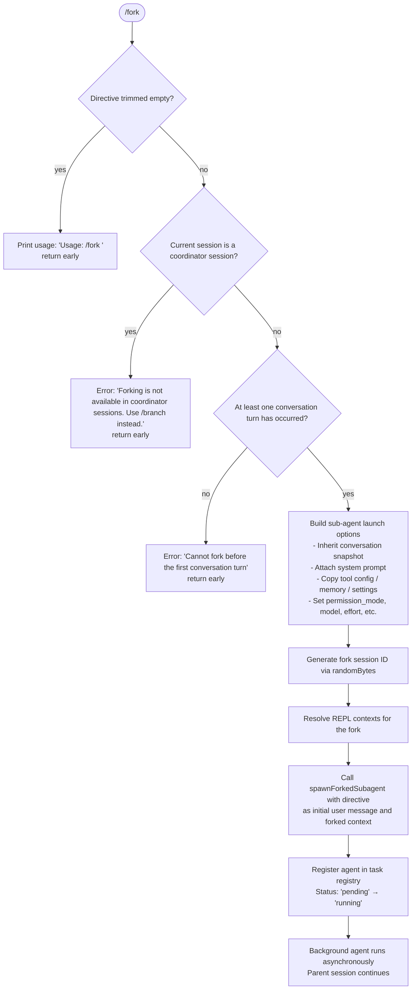

# `/fork`

> Analysis basis: CC v2.1.175 bundle.js (AST extraction + Claude interpretation)
> Minimum version: v2.1.175

---

## Overview

`/fork` spawns a detached background agent that inherits a complete snapshot of the current conversation context (messages, system prompt, working directory, tool configuration, and memory). The user supplies a directive string that steers the forked agent's task. The parent session continues independently while the child agent executes asynchronously in the background.

---

## Registration

| Field | Value |
|---|---|
| type | `local-jsx` |
| name | `fork` |
| description | Spawn a background agent that inherits the full conversation |
| argumentHint | `<directive>` |
| module_id | `i$K` |
| load_inline | `true` |
| loc_byte | `12779089` |
| loc_byte_end | `12779292` |
| loc_line | `9004` |
| arbor_handler.name | `Rr7` |
| arbor_handler.fqn | `claude-2.1.175::Rr7` |
| arbor_handler.kind | `AsyncFunction` |
| arbor_handler.resolution_path | `module_id` |
| arbor_handler.n_hits | `0` |

Analysis basis: CC v2.1.175 bundle.js:+12779089

---

## Input Branching

Three or more distinct branches are present (no directive supplied, coordinator-session guard, pre-first-turn guard, and normal fork path), so a Mermaid flowchart is used.



Analysis basis: CC v2.1.175 bundle.js:+12778648 (directive trim), +12778786 (coordinator guard), +12778859 (first-turn guard), +12778740 (fork launch path)

---

## Behavioral Spec

### Handler entry point — `forkCommandHandler` (`Rr7`)

```
async function forkCommandHandler(input, appState):
    directive = input.trim()                          // bundle.js:+12778648
    if directive is empty:
        print "Usage: /fork <directive>"
        return

    if currentSessionIsCoordinator(appState):         // bundle.js:+12778786
        print "Forking is not available in coordinator sessions. Use /branch instead."
        return

    if noConversationTurnYet(appState):               // bundle.js:+12778859
        print "Cannot fork before the first conversation turn"
        return

    launchOptions = buildSubagentLaunchOptions(appState)
    sessionId     = generateForkSessionId()           // randomBytes(8).toString("hex")
    spawnForkedSubagent(directive, launchOptions, sessionId)
```

Analysis basis: CC v2.1.175 bundle.js:+12778648, +12778670, +12778740, +12778781

---

### Sub-agent launch option builder — `buildSubagentLaunchOptions` (`FLA`)

```
function buildSubagentLaunchOptions(appState):
    options = {}

    // Coordinator-mode flag
    options["subagent_fork_coordinator_mode"] = resolveCoordinatorMode()   // +11216431

    // Conversation context
    options.messages = captureConversationSnapshot(appState)               // b_ +11217134
    options.systemPrompt = buildSystemPrompt(appState)                     // YI7 +11216517

    // Tool and permission configuration
    options["permission_mode"] = resolvePermissionMode(appState)           // +10723182
    options["bypassPermissions"] = false                                   // +10723213
    options["allowed_tools"]    = resolveAllowedTools(appState)            // +10722964
    options["disallowed_tools"] = resolveDisallowedTools(appState)         // +10723019
    options["avoid_prompts"]    = resolveAvoidPrompts(appState)            // +10723080

    // Working directory
    options["working_directory"] = resolveWorkingDirectory(appState)       // +10722909

    // Model / effort overrides
    options["model"]              = resolveModel(appState)                 // +10723550
    options["effort"]             = resolveEffort(appState)                // +10723537
    options["max_thinking_tokens"] = resolveMaxThinkingTokens(appState)    // +10723562
    options["flag_settings"]      = resolveFlagSettings(appState)          // +10723588

    // Identifiers and session metadata
    options["session"] = generateSessionRef(randomBytes)                   // zR +11216819
    options["type"]    = "fork"                                            // +11216604

    // REPL contexts
    options.replContexts = getReplContextsForFork(appState)                // +11216644

    return options
```

Analysis basis: CC v2.1.175 bundle.js:+11216398, +11216410, +11216517, +11216644

---

### Session-ID generation — `generateForkSessionId` (`zR`)

```
function generateForkSessionId():
    raw = crypto.randomBytes(8)                // +7222625
    hex = raw.toString("hex")                  // 8 bytes → 16-char hex string
    return hex
```

Constant: random byte count = 8 (bundle.js:+7222641); encoding = `"hex"` (bundle.js:+7222653).

Analysis basis: CC v2.1.175 bundle.js:+7222569, +7222625, +7222641

---

### System-prompt construction — `buildForkSystemPrompt` (`YI7`)

Calls a shared system-prompt assembly pipeline (`yZ`) that collects:

1. **Environment info** — static platform description, git-worktree notice when applicable (`env_info_static` / `env_info_simple` sections; bundle.js:+13708748, +13708785)
2. **Language and output-style directives** (`language`, `output_style`; bundle.js:+13708823, +13708858)
3. **Memory blocks** — user memory file, team memory file (when team memory is enabled via `syH.isTeamMemoryEnabled`), auto-memory content (bundle.js:+3435309, +3436321)
4. **Tool declarations** — MCP tool listing, bundled tools (bundle.js:+10995205)
5. **Session guidance** — context management, brief mode, scratchpad instructions (bundle.js:+13708942, +13708915)
6. **Behaviour/constraint blocks** — task continuity, fable identity, reproduce-verify workflow flags (bundle.js:+13708463, +13708496, +13709035)
7. **Background-session marker** — the system prompt includes a `bg-session` section identifying the agent as a background fork (bundle.js:+13708888)

The assembled prompt is passed to the agent as a `"system"` role message (literal `"system"` at bundle.js:+12778712).

Analysis basis: CC v2.1.175 bundle.js:+11218153, +11218253, +11218368

---

### Conversation snapshot — `captureConversationSnapshot` (`b_`)

```
function captureConversationSnapshot(appState):
    messages = appState.getAppState().messages
    last = messages.findLast(isNonEmptyTurn)          // +10722884
    snapshot = applyAllowedToolsFilter(last, appState) // Ex8 +10722982
    snapshot = applyDisallowedToolsFilter(snapshot)    // Zx8 +10723040
    snapshot = formatMessagesForSubagent(snapshot)     // mb  +10723235
    return snapshot
```

Fields threaded into snapshot options at bundle.js:+10722909, +10722964, +10723019, +10723080.

Analysis basis: CC v2.1.175 bundle.js:+10722804

---

### Sub-agent spawn and lifecycle — `spawnForkedSubagent` (`cq6` → `m86`)

High-level flow (depth-2 view):

```
function spawnForkedSubagent(directive, options, sessionId):
    // 1. Persist agent metadata
    persistAgentMetadata(sessionId, options)           // ymH +13565557

    // 2. Register in task registry
    taskRegistry.register(sessionId, {
        type: "local_agent",                           // +10413849
        status: "pending"                              // +13566632
    })

    // 3. Start async execution loop
    agentLoop = startAgentLoop(directive, options)     // m86 (main agent driver)

    agentLoop then:
        // Status transitions: "pending" → "running" → "completed"/"failed"
        // Telemetry emitted at each transition
        on complete:  emitTelemetry("subagent_complete")   // +7337121
        on stall:     emitTelemetry("subagent_stall_timeout") // +7337141
        on error:     emitTelemetry("subagent_async_errored")  // +7339852
        on kill:      emitTelemetry("tengu_agent_tool_terminated")

    // 4. Run handoff classifier before surfacing results to parent
    classifierResult = runHandoffClassifier(agentLoop.output)
    if classifierResult == "blocked":
        suppressOutput()
    if classifierResult == "unavailable":
        warn("Handoff classifier unavailable…")        // +7335022
```

Analysis basis: CC v2.1.175 bundle.js:+10413802, +10413808, +10413827, +10413844, +7335022

---

### REPL-context injection — `getReplContextsForFork` (`_C8`)

Slices the last 50 REPL-context entries (slice indices 50/49 at bundle.js:+11216789, +11216802) from the parent session and attaches them to the fork options under `"resume"` (literal at bundle.js:+11216723). Context items are classified as `assistant`, `tool_use`, `tool_result`, `code`, `error`, `ok`, `err` (literals at bundle.js:+9964649, +9963979, +9964138).

Analysis basis: CC v2.1.175 bundle.js:+11216644, +11216739

---

### Handoff safety classifier — `runHandoffClassifier` (`v08`)

```
function runHandoffClassifier(agentOutput):
    if classifier unavailable:                        // "unavailable" literal +7334520
        return "unavailable"
    if output matches blocked pattern:                // "blocked" literal +7334548
        return "blocked"
    return "allowed"                                  // "allowed" literal +7334558
```

When the classifier is unavailable the caller appends a warning to the output: short citation from the literal at bundle.js:+7335022 (`"Handoff classifier unavailable…"`).

Analysis basis: CC v2.1.175 bundle.js:+7334201, +7334520, +7334548, +7334558, +7335022

---

### Stall-timeout watchdog — within `m86`

A stall timeout of 10 × 600 000 ms is enforced (constants at bundle.js:+7335988 value=10, +7335993 value=600000; product = 6 000 000 ms = 100 minutes). If the agent loop produces no progress within this window, the telemetry event `tengu_async_agent_stall_timeout` is fired and the agent is aborted.

Analysis basis: CC v2.1.175 bundle.js:+7336884 (telemetry), +7335988, +7335993

---

## State & Side Effects

| Item | Detail |
|---|---|
| Telemetry — subagent lifecycle | `tengu_forked_agent_default_turns_exceeded` (+10721678), `tengu_agent_tool_completed` (+7332912), `tengu_agent_tool_terminated` (+7339393), `tengu_async_agent_stall_timeout` (+7336884), `tengu_agent_summary_skipped` (+9853630), `tengu_slim_subagent_claudemd` (+9842849) |
| Telemetry — task registry | `tengu_auto_mode_decision` (+7334573), `tengu_cache_eviction_hint` (+7333455) |
| Telemetry — daemon / background | `tengu_quartz_heron` (+7343698), `tengu_shale_finch` (+7329370), `tengu_daemon_control` (+16914553) |
| Telemetry — MCP / hooks | `tengu_run_hook` (+13628064), `tengu_repl_hook_finished` (+13628413), `tengu_mcp_elicitation_shown` (+16645935) |
| Agent metadata file | Written to disk by `DJA` (calls `V6H.mkdir` + `g66`; bundle.js:+13563129). Filename uses `.meta.json` suffix (+13473205) |
| Transcript file | Written to `<session>.jsonl` (+13473361); subdirectory determined by `transcriptSubdir` key (+9850928) |
| Fork-context reference | A `"fork-context-ref"` token is attached to the agent metadata (+13490217) |
| Task registry entry | Created with type `"local_agent"` (+10413849); transitions through `"pending"` → `"running"` → `"completed"` / `"failed"` |
| AbortController | A new `AbortController` is created for the fork; cancelled on user kill or timeout |
| Sound | <!-- TODO: not found in depth-2 traversal; needs --depth 4 --> |

---

## Version History

| Version | Change |
|---|---|
| v2.1.175 | Initial analysis |

---

## Common Mistakes

1. **Omitting the directive** — running `/fork` with no argument prints `Usage: /fork <directive>` and exits immediately. The `<directive>` argument is mandatory.
2. **Running in a coordinator session** — coordinator sessions (multi-agent orchestration contexts) reject `/fork` with a message to use `/branch` instead. Use `/branch` when inside an orchestrated flow.
3. **Forking before the first turn** — the command requires at least one completed conversation turn to snapshot. Invoking `/fork` as the very first action in a fresh session fails with a clear error.
4. **Expecting synchronous output** — the forked agent runs entirely in the background. Results appear via the task-notification system, not as an immediate reply in the current conversation.
5. **Assuming identical tool availability** — `allowed_tools` and `disallowed_tools` are re-evaluated at fork time; any tool-permission changes made after the fork do not propagate to the child agent.

---

## Appendix — Identifier Mapping

> For bundle debugging only. Identifiers change across versions.

| Identifier | Role |
|---|---|
| `Rr7` | Main handler (`forkCommandHandler`) — async entry point for `/fork` |
| `FLA` | Sub-agent launch option builder (`buildSubagentLaunchOptions`) |
| `YI7` | System-prompt assembly coordinator for the forked agent |
| `yZ` | System-prompt pipeline (collects environment, memory, tool, behaviour blocks) |
| `b_` | Conversation snapshot builder (`captureConversationSnapshot`) |
| `Ex8` | Allowed-tools filter applied to conversation snapshot |
| `Zx8` | Disallowed-tools filter applied to conversation snapshot |
| `mb` | Message formatter for sub-agent context |
| `zR` | Fork session-ID generator (randomBytes → hex) |
| `cq6` | Sub-agent spawner bootstrap |
| `ymH` | Agent metadata persistence (mkdir + writeFile + symlink) |
| `m86` | Core agent execution loop (watchdog, API streaming, tool dispatch) |
| `vR` | Background agent runner / session manager |
| `_C8` | REPL-context injector for fork |
| `urq` | Context trimmer (trims trailing whitespace from system prompt) |
| `v08` | Handoff safety classifier wrapper |
| `CHq` | Classifier invocation (calls `Qc_` for classification logic) |
| `eN6` | Classifier result interpreter (blocked / allowed / unavailable) |
| `lW6` | Memory-prompt assembler (user + team memory files) |
| `Ze` | System-prompt section renderer |
| `JU` | System-prompt builder (assembles `"system"` role block) |
| `kW` | Model-resolution utility |
| `CH` | Configuration helper (reads app-state config fields) |
| `JD7` | REPL-context classifier — `assistant` turn detector |
| `XD7` | REPL-context classifier — `tool_use` detector |
| `jD7` | REPL-context classifier — `tool_result` / `error` filter |
| `PD7` | REPL-context classifier — `code` / `ok` detector |
| `GR8` | App-state mutator called on fork agent state setup |
| `ER8` | MCP / permission resolver for forked agent |
| `CE7` | Main query loop (API streaming and tool execution) |
| `jU` | Turn-level query entry (wraps `CE7`) |
| `T2` | Hook execution engine (SubagentStart / SubagentStop etc.) |
| `h$H` | Attachment / deferred-tool configurator for sub-agent |
| `UfA` | Deferred-tools pool manager |
| `aw7` | MCP server configuration reconciler for fork |
| `PC6` | Sub-agent session initialiser |
| `I$H` | Sub-agent context hydrator |
| `GL` | MCP connection manager |
| `Ah6` | Per-turn agent state updater |
| `kT` | Stream-event processor (message_delta, progress) |
| `x86` | Task-progress emitter |
| `Ne` | Task notification handler |
| `Kq6` | Task registry updater |
| `N08` | Task-state change recorder |
| `hSq` | Agent-summary emitter |
| `Hbq` | Computed context value resolver |
| `he` | Permission-resolution engine for tool calls |
| `ac_` | Tool-permission filter chain |
| `hb8` | Sub-agent exit handler (VU registry cleanup) |
| `BD` | Batch-tool dispatcher |
| `Bq6` | Skill-progress tracker |
| `A3H` | Hook state machine (clearTimeout / Date.now / Fz) |
| `Be9` | Hook execution coordinator |
| `s6` | Headless session driver (plugin install + skill load) |
| `oc9` | OpenTelemetry span creator for subagent.spawn |
| `jU` | (also) Top-level query function wrapping CE7 |
| `SWH` | Session-state write helper |
| `XE6` | Session-context extension helper |
| `wwH` | Worker watchdog helper |
| `RN6` | H08 registry cleanup on fork teardown |

---

Note: index built via Arbor fallback; some signals (telemetry, literals) may be missing — see arbor-fallback.js.