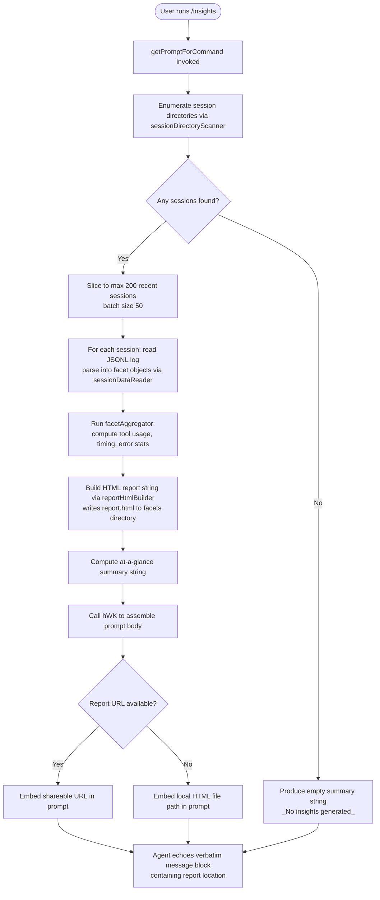

# `/insights`

> Analysis basis: CC v2.1.175 bundle.js (AST extraction + Claude interpretation)
> Minimum version: v2.1.175

---

## Overview

`/insights` generates a shareable HTML usage-analytics report by scanning the local Claude Code session data on disk, computing aggregated statistics across all recorded sessions, and then instructing the agent to deliver a fixed confirmation message pointing the user to the generated report file. The command's handler collects JSONL session logs from the Claude data directory, processes them through a multi-stage analysis pipeline (facet extraction, statistical summarisation, HTML rendering), writes the output report to disk, and finally constructs a prompt containing both the processed data and a verbatim `<message>` block that the agent must echo as its entire response.

---

## Registration

| Field | Value |
|---|---|
| type | `prompt` |
| name | `insights` |
| description | `Generate a report analyzing your Claude Code sessions` |
| loc_byte | `13455483` |
| loc_byte_end | `13456787` |
| loc_line | `10672` |
| handler_method | `getPromptForCommand` |
| handler_method_start | `13455657` |
| handler_method_end | `13456786` |
| prompt_body.length | `513` characters |
| prompt_body.trace | `call→hWK(...) (1 literals)` |
| arbor_handler.name | `getPromptForCommand` |
| arbor_handler.kind | `Method` |
| arbor_handler.resolution_path | `direct` |
| arbor_handler.fqn | `claude-2.1.175::getPromptForCommand` |
| arbor_handler.n_hits | `1` |

Analysis basis: CC v2.1.175 bundle.js:+13455483

---

## Input Branching

The handler follows a linear invocation path with no user-supplied arguments: it always runs the full analysis pipeline. Internally the pipeline has multiple sub-branches (session count limits, data availability checks, directory existence tests), so a flowchart is used.



Analysis basis: CC v2.1.175 bundle.js:+13455663 (handler entry), +13442420 (session scanner), +13442444 (batch limit 200), +13442439 (batch size 50), +13456689 (hWK prompt assembly), +13456554 (_No insights generated_ literal)

---

## Behavioral Spec

### 1. Handler Entrypoint — `getPromptForCommand`

The Arbor-resolved handler is `getPromptForCommand` (Method, direct resolution), invoked as an ObjectMethod on the registration object.

```
async function getPromptForCommand(context):
    sessionList  = await sessionDirectoryScanner(dataRoot)   // lA5
    recentSessions = sessionList.slice(0, 200)               // NWK → A.slice
    facetBatches = recentSessions in batches of 50
    allFacets    = await Promise.all(facetBatches.map(sessionDataReader))  // bA5
    analysisData = facetAggregator(allFacets)                // dA5 + vWK + pA5
    htmlContent  = reportHtmlBuilder(analysisData)           // NWK → KC.writeFile
    write htmlContent to <facetsDir>/report.html
    atAGlance    = buildAtAGlanceSummary(analysisData)       // NWK → pA5 → "at_a_glance"
    prompt       = assemblePrompt(                           // hWK
        insightsData  = analysisData,
        reportUrl     = deriveReportUrl(context),            // DQ8
        htmlFilePath  = path.join(facetsDir, "report.html"),
        facetsDir     = facetsDir,
        atAGlanceSummary = atAGlance
    )
    return { prompt: prompt }
```

Analysis basis: CC v2.1.175 bundle.js:+13455663

---

### 2. Session Directory Scanner — `sessionDirectoryScanner`

Discovers all Claude Code project session directories under the local data root.

```
async function sessionDirectoryScanner(dataRoot):
    projectsPath = path.join(dataRoot, "projects")          // "projects" literal
    entries      = await fs.readdir(projectsPath)
    dirs         = entries.filter(entry => entry.isDirectory())
    result       = []
    for each dir in dirs:
        sessionFiles = await sessionFileCollector(dir)      // aL6
        result.push(...sessionFiles)
        yield control via setImmediate every 10 items       // literals 10, 9
    return result.sort(byModificationTimeDescending)        // q.sort
```

Batch constants: up to 200 sessions processed (literal `200`, bundle.js:+13442444); internal directory enumeration yields every 10 entries (literal `10`, bundle.js:+13442297).

Analysis basis: CC v2.1.175 bundle.js:+13442028

---

### 3. Session File Collector — `sessionFileCollector`

Finds all `.jsonl` files within a single project directory.

```
async function sessionFileCollector(projectDir):
    entries = await fs.readdir(projectDir)
    files   = entries.filter(e => e.isFile() && hasJsonlExtension(e))  // ".jsonl" literal
    for each file in files:
        stat     = await fs.stat(path.join(projectDir, file))
        fileInfo = { name: basename(file), size: stat.size, path: ... }
        files.push(fileInfo)
    await Promise.all(files.map(enrichFileMetadata))
    return files
```

File extension filter: `".jsonl"` (bundle.js:+13531559).

Analysis basis: CC v2.1.175 bundle.js:+13531453

---

### 4. Session Data Reader — `sessionDataReader`

Reads and parses an individual session JSONL file, extracting facet data.

```
async function sessionDataReader(sessionInfo):
    rawPath  = buildSessionPath(sessionInfo)                // VjA → EU6
    //  EU6 joins dataRoot / "usage-data" / "session-meta"
    content  = await fs.readFile(rawPath, "utf-8")          // "utf-8" literal
    parsed   = safeJsonParse(content)                       // d6 → JSON.parse
    facets   = extractFacetsFromSession(parsed)             // ZWK
    return facets
```

Directory structure constants: `"usage-data"` (bundle.js:+13381372), `"session-meta"` (bundle.js:+13381468), `"facets"` (bundle.js:+13381422).

Analysis basis: CC v2.1.175 bundle.js:+13387436

---

### 5. Facet Aggregator — `facetAggregator`

Computes the full cross-session statistics that populate the report. This is the largest sub-component; it processes raw session facet arrays into structured analysis data.

```
function facetAggregator(allFacets):
    toolUsage     = aggregateToolUsage(allFacets)           // EWK
    timingStats   = aggregateTimingStats(allFacets)         // NjA → Math.round
    errorStats    = aggregateErrorStats(allFacets)
    suggestions   = buildSuggestions(toolUsage, errorStats) // vWK
    hourBuckets   = buildHourOfDayHistogram(timingStats)    // time-of-day literals
    responseTimeDistribution = buildResponseTimeBuckets(timingStats)
    // Response time bucket labels (bundle.js literals):
    //   "2-10s", "10-30s", "30s-1m", "1-2m", "2-5m", "5-15m", ">15m"
    sessionWindow = 1800000 ms (30 min)                     // literal +13389845
    toolCategoryMap includes: "WebSearch", "WebFetch",
        "Edit", "Write", "mcp__" prefix, "Other"            // literals +13382044–+13383000
    return {
        toolUsage, timingStats, errorStats,
        suggestions, hourBuckets, responseTimeDistribution
    }
```

Session inactivity window: 1 800 000 ms / 30 minutes (bundle.js:+13389845).
Response time buckets: `"2-10s"`, `"10-30s"`, `"30s-1m"`, `"1-2m"`, `"2-5m"`, `"5-15m"`, `">15m"` (bundle.js:+13398590–+13398650).
Time-of-day buckets: `"Morning (6-12)"`, `"Afternoon (12-18)"`, `"Evening (18-24)"`, `"Night (0-6)"` (bundle.js:+13399438–+13399591).

Analysis basis: CC v2.1.175 bundle.js:+13443127

---

### 6. Report HTML Builder — `reportHtmlBuilder`

Renders the analysis data as a self-contained HTML file and writes it to disk.

```
async function reportHtmlBuilder(analysisData, facetsDir):
    html = buildHtmlString(analysisData)    // dA5
    //  Colour palette used:
    //    primary    #2563eb  (bundle.js:+13436255)
    //    secondary  #0891b2  (bundle.js:+13436393)
    //    success    #10b981  (bundle.js:+13436565)
    //    accent     #8b5cf6  (bundle.js:+13436708)
    //    error      #dc2626  (bundle.js:+13439971)
    //    ok         #16a34a  (bundle.js:+13440220)
    //    warning    #eab308  (bundle.js:+13440713)
    await fs.mkdir(facetsDir, { recursive: true })          // KC.mkdir
    outPath = path.join(facetsDir, "report.html")           // "report.html" literal
    await fs.writeFile(outPath, html)                       // KC.writeFile
    return outPath
```

Output filename: `"report.html"` (bundle.js:+13444677).
Max token budget passed to HTML template: 8 192 tokens (bundle.js:+13397759); inner section truncation at 4 096 tokens (bundle.js:+13389321).

Analysis basis: CC v2.1.175 bundle.js:+13444098

---

### 7. Prompt Assembler — `promptAssembler` (`hWK`)

Constructs the final 513-character prompt delivered to the agent. The prompt:

- Declares the user just ran `/insights`.
- Embeds the full insights data object (serialised via `RH` → `JSON.stringify`).
- Provides the report URL, HTML file path, and facets directory path.
- Includes an "at-a-glance" summary prefixed `"at_a_glance"` (bundle.js:+13395617) for agent context only; the user has not yet seen any output.
- Issues an explicit instruction that the agent must output the text between `<message>` tags verbatim as its entire response, without omitting any line.
- The `<message>` block tells the user their shareable insights report is ready (citing the URL or path) and invites them to explore sections or act on suggestions.
- Fallback text when no insights exist: `"_No insights generated_"` (bundle.js:+13456554).
- Section separator used inside the summary: `" · "` (bundle.js:+13456115).

```
function promptAssembler(insightsData, reportUrl, htmlFilePath,
                         facetsDir, atAGlanceSummary):
    if insightsData is empty:
        summaryText = "_No insights generated_"
    else:
        summaryText = atAGlanceSummary joined with " · "
    body = interpolate(PROMPT_TEMPLATE,
        insightsData   = insightsData,
        reportUrl      = reportUrl,
        htmlFilePath   = htmlFilePath,
        facetsDir      = facetsDir,
        atAGlance      = summaryText
    )
    return body   // length ≈ 513 chars before data interpolation
```

Analysis basis: CC v2.1.175 bundle.js:+13456689 (hWK call), +13456707 (RH serialisation), +13456753 (DQ8 path builder)

---

### 8. Path Resolution — `reportPathBuilder` (`DQ8`)

Resolves the on-disk location of a session's data directory.

```
function reportPathBuilder(sessionId):
    base = EU6(sessionId)           // joins dataRoot + "usage-data"
    return path.join(base, sessionId)
```

Analysis basis: CC v2.1.175 bundle.js:+13381408

---

## State & Side Effects

| Item | Detail |
|---|---|
| Disk reads | Reads all `.jsonl` session files under the `projects/` subtree of the Claude data directory |
| Disk writes | Creates `<facetsDir>/report.html`; creates parent directories with `recursive: true` |
| Disk writes (secondary) | Writes session-level JSON facet cache files via `xA5` / `CA5` (bundle.js:+13388020, +13387263) |
| Directory creation | Calls `KC.mkdir` (recursive) for facets and usage-data directories |
| Session limit | Maximum 200 sessions processed per invocation (bundle.js:+13442444) |
| Batch concurrency | Sessions read in parallel batches of 50 via `Promise.all` (bundle.js:+13442516) |
| Telemetry | `tengu_mcp_skills` (bundle.js:+6636971) |
| Telemetry | `tengu_daemon_config_reload` (bundle.js:+16892870) |
| Telemetry | `tengu_daemon_idle_exit` (bundle.js:+16898123) |
| Telemetry | `tengu_daemon_control` (bundle.js:+16914553) |
| Telemetry | `tengu_bg_dispatch_sigkill_escalate` (bundle.js:+16877366) |
| Telemetry | `tengu_bg_dispatch_low_mem` (bundle.js:+16877967) |
| Telemetry | `tengu_bg_spare_enable` (bundle.js:+16878671) |
| Telemetry | `tengu_bg_spare_claim` (bundle.js:+16878799) |
| Telemetry | `tengu_bg_spare_claim_fail` (bundle.js:+16879065) |
| Telemetry | `tengu_bg_retire_pinned_low_mem` (bundle.js:+16882003) |
| Telemetry | `tengu_bg_prewarm_per_sweep` (bundle.js:+16882124) |
| Telemetry | `tengu_transcript_phantom_parent` (bundle.js:+13517018) |
| Telemetry | `tengu_relink_walk_broken` (bundle.js:+13496731) |
| Telemetry | `tengu_transcript_parent_cycle` (bundle.js:+13520823) |
| Telemetry | `tengu_chain_parent_cycle` (bundle.js:+13498504) |
| Telemetry | `tengu_chain_timestamp_fallback` (bundle.js:+13498653) |
| Telemetry | `tengu_chain_parallel_tr_recovered` (bundle.js:+13500519) |
| Telemetry | `tengu_daemon_yield` (bundle.js:+16897093) |
| Agent output | Agent is instructed to echo the `<message>` block verbatim; no tool calls expected |
| appState changes | None observed in depth-2 traversal |
| Sound | <!-- TODO: not found in depth-2 traversal; needs --depth 4 --> |
| Hook registration | <!-- TODO: not found in depth-2 traversal; needs --depth 4 --> |

---

## Version History

| Version | Change |
|---|---|
| v2.1.175 | Initial analysis |

---

## Common Mistakes

1. **Expecting interactive data entry**: `/insights` takes no arguments. Passing text after the command has no effect — the handler ignores all user-supplied input and always runs the full pipeline.
2. **Running before any sessions exist**: If no `.jsonl` session files are found under the `projects/` directory, the command still succeeds but the agent's response will reference `"_No insights generated_"` and no `report.html` is written.
3. **Assuming the report is opened automatically**: The command writes `report.html` to the facets directory and tells the agent to echo the file path/URL. It does not open a browser or viewer; the user must navigate to the path manually.
4. **Expecting real-time streaming data**: The pipeline reads only persisted `.jsonl` logs. Any session activity that has not yet been flushed to disk will be absent from the report.
5. **Running in an environment without a writable data directory**: The command calls `fs.mkdir` (recursive) and `fs.writeFile`; if the Claude data directory is read-only the command will throw and the agent will not produce the confirmation message.
6. **Interpreting the at-a-glance summary as user-visible output**: The summary injected into the prompt is marked "for your context only — the user has not seen any output yet." The agent is explicitly instructed to output only the `<message>` block and nothing else.

---

## Appendix — Identifier Mapping

> For bundle debugging only. Identifiers change across versions.

| Identifier | Role |
|---|---|
| `NWK` | Main insights pipeline orchestrator (called from `__handler_insights`) |
| `lA5` | Session directory scanner — enumerates project dirs, collects session file paths |
| `Li` | Path joiner for projects subdirectory (`"projects"` literal) |
| `aL6` | Session file collector — lists `.jsonl` files in a single project dir, stats them |
| `ng` | JSONL extension test predicate (`fbL.test`) |
| `bA5` | Session data reader — reads and parses individual JSONL session files |
| `VjA` | Session path builder (joins usage-data + session-meta) |
| `EU6` | Base usage-data path builder |
| `ZWK` | Facet extractor from parsed session JSON |
| `d6` | Safe JSON parser wrapper (`JSON.parse`) |
| `NjA` | Timing and numeric facet aggregator |
| `EWK` | Tool usage facet aggregator (classifies tool calls into categories) |
| `vWK` | Suggestions builder and cross-session statistical reducer |
| `VWK` | Percentile / distribution calculator for numeric metrics |
| `pA5` | At-a-glance summary builder (produces `"at_a_glance"` key) |
| `GWK` | Per-session HTML fragment generator |
| `dA5` | Full HTML report string builder |
| `iOH` | Table / bar-chart HTML section renderer |
| `FA5` | Object-values aggregation helper |
| `gA5` | Map-and-max aggregation helper |
| `QA5` | JSON serialiser helper (`RH` wrapper) |
| `YQ8` | HTML escape / markdown-to-HTML converter (`C7`) |
| `C7` | HTML entity escaper (handles `&amp;`, `&lt;`, `&gt;`, `&quot;`, `&apos;`) |
| `T7` | HTML replaceAll helper |
| `xA5` | Facet cache writer (writes per-session JSON to usage-data dir) |
| `CA5` | Secondary facet cache writer |
| `RA5` | Facet cache reader (reads previously written per-session JSON) |
| `DQ8` | Report path builder (resolves session data directory path) |
| `SA5` | Session batch processor (slices and parallel-maps sessions) |
| `IA5` | Inner session analysis loop |
| `uA5` | Top-level session analysis coordinator |
| `aq6` | Report generation orchestrator (calls HTML writer, report uploader) |
| `bf` | Report upload / sharing helper |
| `mx8` | Content hashing and cache-keyed file writer |
| `u8` | Random UUID generator wrapper |
| `TUH` | HTML template finaliser |
| `TWK` | Warmup / minimal-mode path selector |
| `JD` | Daemon/background context accessor (`hhH`) |
| `Zf` | Filter helper (array filter wrapper) |
| `GA` | Generic error wrapper (`Error`, `String`) |
| `hWK` | Prompt body assembler — builds the final 513-char prompt string |
| `RH` | JSON serialiser (`JSON.stringify`) |
| `NA5` | NaN-guard numeric validator |
| `oL6` | Object entries iterator helper |
| `J9` | String slice/index helper |
| `nA5` | Object-keys enumerator |
| `vjA` | Secondary aggregation pass |
| `H$` | Numeric rounding helper |
| `IWK` | Facet integrity validator |
| `oPH` | Diff computation helper (`RZ9.diff`) |
| `vA5` | File extension extractor (`Xd.extname`) |
| `TU6` | Tool-name classification helper |
| `R4` | Array index-of helper |
| `SH` | Error logging / telemetry reporter (`ua.logError`) |
| `oqH` | Transcript/session state manager (large orchestrator) |
| `aWK` | Session relink walker |
| `L$H` | Chain builder (builds ordered message chains) |
| `h15` | NaN-guard for chain timestamps |
| `I15` | Parallel transcript recovery handler |
| `v15` | Chain deduplication and sort helper |
| `P0K` | Chain value getter/setter |
| `jQ8` | Session context builder (assembles all per-session Maps) |
| `o96` | Session map iterator |
| `ojA` | Text normaliser (replaceAll, slice) |
| `am6` | Message content extractor |
| `sjA` | Filter-by-type helper |
| `y15` | Array-some predicate (with trim) |
| `k15` | Array-some predicate (type check) |
| `IQ8` | Message index builder |
| `yQ8` | Array.from / values wrapper |
| `DCH` | MCP connection manager orchestrator |
| `sGA` | MCP server group applicator |
| `ki8` | MCP connection result applier |
| `AG` | MCP cleanup coordinator |
| `YCH` | MCP log helper |
| `X66` | MCP connection slot initialiser |
| `Hi9` | MCP connection attempt handler |
| `RJ8` | MCP retry scheduler |
| `yJ8` | MCP success handler |
| `z8` | MCP debug logger |
| `DP8` | OAuth flow initiator |
| `jP8` | OAuth callback handler |
| `$i9` | MCP reconnect scheduler |
| `$F_` | MCP failure recorder |
| `nN` | MCP skills telemetry emitter (`tengu_mcp_skills`) |
| `oB_` | MCP capability checker |
| `YL` | MCP error logger (`ua.logMCPError`) |
| `TH` | String coercer (`String`) |
| `Ki9` | MCP config key extractor |
| `W66` | Integer parser (radix 10) |
| `D28` | Integer parser variant |
| `hjK` | Background session heartbeat helper |
| `tX8` | MCP transport type checker |
| `i8` | Async retry-with-abort helper |
| `F` | Background write supervisor |
| `w` | Background session transport writer |
| `_ZH` | ENOENT-aware file writer |
| `eXK` | Column-width calculator |
| `gsK` | Heartbeat registrar |
| `T` | Spinner/progress indicator |
| `E` | Viewport size calculator |
| `Q` | Background process lifecycle manager |
| `k` | Worker pool sweep / memory manager |
| `K6` | String coercer (Number → String) |
| `U15` | Binary JSONL parser (Buffer-based) |
| `B15` | Synchronous JSONL header reader |
| `x` | Process termination helper |
| `p15` | Binary buffer JSONL parser |
| `kNH` | Crypto / UUID helpers |
| `C` | Buffered writer with timeout |
| `N9` | Error type detector |
| `n8` | Generic utility wrapper |
| `kv6` | Key-value store helper |
| `eV` | MCP event emitter |
| `Vi` | MCP server descriptor builder |
| `H` | Random-delay scheduler (`Math.random`, `setTimeout`) |
| `M` | MCP registry / server map |
| `$` | Background job queue helper |
| `y` | Warning / credit-usage notifier |
| `D` | Background worker process manager |
| `W` | Connection state machine |
| `HH` | MCP hot-reload handler |
| `s` | MCP server config differ |
| `c` | Process supervisor |
| `n` | Key-event handler |
| `o` | Output stream handler |
| `G` | Vim-mode key handler |
| `z` | Editor state machine |
| `Y` | Shutdown / exit handler |
| `R` | Background yield writer |
| `S` | stdout writer |
| `P` | Buffer-line parser |
| `J` | Background session dispatcher |
| `X` | Timeout-aware channel |
| `O` | Background session state |
| `j` | Process kill list manager |
| `V` | Spinner/UI state |
| `d` | Generic deferred callback |
| `p` | Named pipe manager |
| `B` | Timer handle |
| `A` | String normaliser (toLowerCase etc.) |
| `L` | Collection / list abstraction |
| `N` | MIME / content-type resolver |
| `rG` | Randomness initialiser |
| `XE` | Report export helper |
| `aE` | Analytics event emitter |
| `TA5` | Daemon context accessor for analysis |