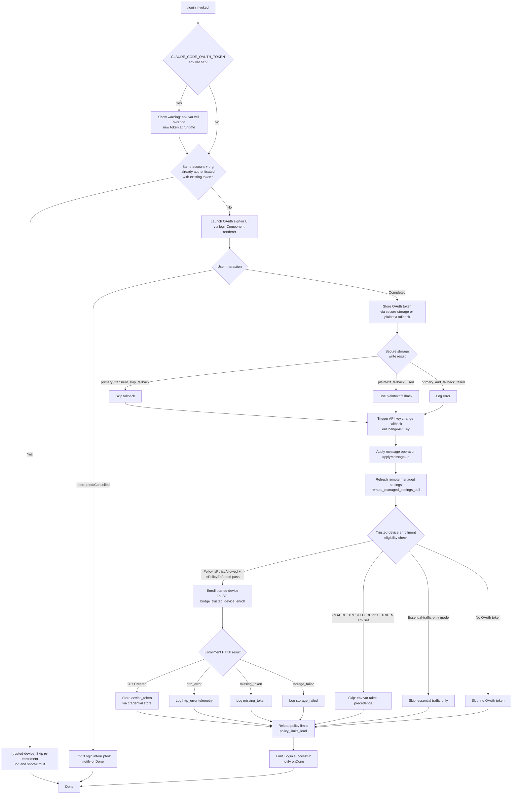

# `/login`

> Analysis basis: CC v2.1.175 bundle.js (AST extraction + Claude interpretation)
> Minimum version: v2.1.175

---

## Overview

The `/login` command launches an interactive OAuth-based sign-in flow that allows a user to authenticate with their Anthropic account or switch between Anthropic accounts. It renders a JSX UI component that manages the entire login lifecycle — from initiating the OAuth handshake through storing credentials and refreshing remote settings — directly within the Claude Code terminal session.

---

## Registration

| Field | Value |
|---|---|
| type | `local-jsx` |
| name | `login` |
| description | `Switch Anthropic accounts \| Sign in with your Anthropic account` |
| module_id | `ahq` |
| load_inline | `true` |
| loc_byte | `11877265` |
| loc_byte_end | `11877485` |
| loc_line | `8082` |
| arbor_handler.name | `D8K` |
| arbor_handler.fqn | `claude-2.1.175::D8K` |
| arbor_handler.kind | `Function` |
| arbor_handler.resolution_path | `direct` |
| arbor_handler.n_hits | `2` |

Analysis basis: CC v2.1.175 bundle.js:+11877265

---

## Input Branching

The login flow has more than three distinct runtime branches (credential-env-override check, same-account re-login skip, OAuth token missing, trusted-device enrollment gates, and post-login state transitions). A Mermaid flowchart is used.



---

## Behavioral Spec

### Top-Level Handler: loginComponent (m$7 / D8K)

The Arbor-resolved handler is `D8K`; the bundle's call-graph entry point for the rendered component is `m$7`. The component is a JSX functional component returned by the `local-jsx` command registration.

```
function loginComponent(commandContext):
    state = useState(initialLoginState)

    // Detect env-var conflict early
    if env.CLAUDE_CODE_OAUTH_TOKEN is set:
        display warning message:
            "Warning: CLAUDE_CODE_OAUTH_TOKEN is set in your environment..."
            (bundle.js:+9611988)

    // Check same-account re-login shortcut
    if existingToken.accountId == incomingAccount.id
    and existingToken.orgId == incomingAccount.orgId:
        log "[trusted-device] Same account+org re-login with existing token, skipping re-enrollment"
            (bundle.js:+9611614)
        notifyDone()
        return

    // Render interactive login UI
    renderLoginPanel(state, handlers):
        onConfirmNo = "confirm:no"            // (bundle.js:+9612766)
        titleLabel  = "Login"                 // (bundle.js:+9613475)
        scopeLabel  = "permission"            // (bundle.js:+9613500)

    // User resolves the login panel
    if user cancelled / interrupted:
        emitStatus("Login interrupted")       // (bundle.js:+9612383)
        commandContext.onDone()
        return

    // Credential persistence
    writeCredentials(oauthToken):
        attempt secureStorage.write()
        on transient skip  → record "primary_transient_skip_fallback"  (bundle.js:+2311432)
        on plaintext used  → record "plaintext_fallback_used"          (bundle.js:+2311581)
        on total failure   → record "primary_and_fallback_failed"      (bundle.js:+2311684)

    // Notify subscribers
    appState.onChangeAPIKey(newKey)            // (bundle.js:+9611361)
    appState.applyMessageOp(op)               // (bundle.js:+9611380)
    appState.setAppState(updatedState)        // (bundle.js:+9611865)

    // Refresh remote managed settings
    triggerRemoteSettingsRefresh()
        log "Remote settings: Refreshed after auth change"  (bundle.js:+7443847)

    // Trusted-device enrollment gate
    enrollTrustedDevice(oauthToken)           // see sub-section below

    // Reload policy limits
    reloadPolicyLimits()                      // (bundle.js:+9611757)

    emitStatus("Login successful")            // (bundle.js:+9612364)
    commandContext.onDone()
```

Analysis basis: CC v2.1.175 bundle.js:+9612331

---

### Sub-feature: OAuth Flow UI (loginOAuthRenderer — vh6)

This sub-component drives the actual browser-based OAuth exchange.

```
function loginOAuthRenderer(context):
    session  = initSession(S_)               // (bundle.js:+7399384)
    identity = resolveIdentity(V4)           // (bundle.js:+7399396)

    // Policy gate
    if not K.isPolicyAllowed("login"):       // (bundle.js:+7399819)
        block and surface policy error
    if K.isPolicyEnforced("login"):          // (bundle.js:+7399842)
        enforce additional constraints

    // Determine OAuth endpoint
    oauthBase = resolveEndpoint(m1):
        if env == "prod":                    // (bundle.js:+855892)
            use production claude.ai endpoint
        elif env == "local":                 // (bundle.js:+857046)
            use http://localhost:8000        // (bundle.js:+856166)
        elif env == "staging":               // (bundle.js:+857071)
            use http://localhost:4000 or :3000
        elif CLAUDE_CODE_CUSTOM_OAUTH_URL is set:
            validate against approved list
            else raise "CLAUDE_CODE_CUSTOM_OAUTH_URL is not an approved endpoint."
                                             // (bundle.js:+857231)

    // HTTP POST
    response = httpPost(oauthBase, payload,
        headers: {
            "Content-Type": "application/json",  // (bundle.js:+7400320)
            "User-Agent": userAgent
        },
        timeout: 10000,                      // (bundle.js:+7400363)
        retryDelay: 500                      // (bundle.js:+7400389)
    )

    // Parse / validate response
    hostname = D8q.hostname                  // (bundle.js:+7400242)
    storeCredentials(response)
    updateStateAfterOAuth(CH, kH)
```

Analysis basis: CC v2.1.175 bundle.js:+7399379

---

### Sub-feature: Trusted-Device Enrollment (trustedDeviceEnroller — vh6 branch)

```
function enrollTrustedDevice(oauthToken):
    // Fast-path skips
    if env.CLAUDE_TRUSTED_DEVICE_TOKEN is set:
        log "[trusted-device] CLAUDE_TRUSTED_DEVICE_TOKEN env var is set, skipping enrollment"
            (bundle.js:+7399642)
        return

    if essentialTrafficOnlyMode:
        log "[trusted-device] Essential traffic only, skipping enrollment"
            (bundle.js:+7399956)
        return

    if oauthToken is null or empty:
        log "[trusted-device] No OAuth token, skipping enrollment"
            (bundle.js:+7400069)
        return

    // Enroll
    response = httpPost(enrollEndpoint,
        telemetryEvent: "bridge_trusted_device_enroll",  // (bundle.js:+7400465)
        timeout: 10000,                                  // (bundle.js:+7400363)
    )

    if response.status == 201:                           // (bundle.js:+7400551)
        if response.body.device_token is missing:
            log "[trusted-device] Enrollment response missing device_token field"
                (bundle.js:+7400748)
            recordOutcome("missing_token")               // (bundle.js:+7400849)
            return
        store(device_token)
        // on storage failure → recordOutcome("storage_failed")  (bundle.js:+7401057)
    else:
        recordOutcome("http_error")                      // (bundle.js:+7400670)
        // on unknown outcome → recordOutcome("unknown")  (bundle.js:+7401010)
```

Analysis basis: CC v2.1.175 bundle.js:+7399806

---

### Sub-feature: Remote Managed Settings Refresh (remoteSettingsRefresher — __6 / ZG8 / vn_)

Triggered automatically after a successful login.

```
function remoteSettingsRefresher():
    log "Remote settings: Refreshed after auth change"   // (bundle.js:+7443847)
    notifyChange(xN)                                     // (bundle.js:+7443948)

    // Background polling cycle
    schedulePoll(QuL):
        loop:
            fetchRemoteSettings(vn_)
            hashBody = sha256(canonical(body), "hex")    // (bundle.js:+7415628, :+7415655)
            if HTTP 304:
                log "Remote settings: Cache still valid (304 Not Modified)"
                    (bundle.js:+7442586)
            elif HTTP 200:
                validateFormat()
                if valid:
                    showSecurityDialogIfNeeded(E_q)
                    if userAccepts:
                        applySettings()
                        log "Remote settings: Applied new settings successfully"
                            (bundle.js:+7442974)
                    elif userRejects:
                        log "Remote settings: User rejected new settings, using cached settings"
                            (bundle.js:+7442824)
                        record "rejected"                // (bundle.js:+7437539)
                else:
                    log "Remote settings: Settings validation failed..."
                        (bundle.js:+7440674)
            elif HTTP 401:
                emit "tengu_remote_settings_401_force_refresh_retry"
                    (bundle.js:+7441304)
            elif HTTP 404:
                log "Remote settings: Saved empty sentinel (404 response)"
                    (bundle.js:+7443124)
            on fetch failure:
                log "Remote settings: Using stale cache after fetch failure"
                    (bundle.js:+7442417)
                record "remote_managed_settings_fetch_failed"
                    (bundle.js:+7442366)
            on unexpected error:
                record "remote_managed_settings_unexpected"
                    (bundle.js:+7443289)
            on timeout:
                log "Remote settings: Loading promise timed out, resolving anyway"
                    (bundle.js:+7438669)
```

Analysis basis: CC v2.1.175 bundle.js:+7443770

---

### Sub-feature: Policy Limits Reload (policyLimitsLoader — Wh6 / w8q)

```
function reloadPolicyLimits():
    telemetry("policy_limits_load")                      // (bundle.js:+7394167)
    log "Policy limits: Refreshed after auth change"     // (bundle.js:+7396252)

    // Determine auth method for limits endpoint
    authMethod = detect():
        "wif"     if WIF env vars present               // (bundle.js:+7391887)
        "oauth"   if OAuth token present                // (bundle.js:+7391926)
        "api_key" if API key present                    // (bundle.js:+7391943)

    fetch(policyLimitsEndpoint, authMethod):
        if HTTP 200: succeed → "succeeded"              // (bundle.js:+7394373)
        if HTTP 304: use cache
            log "Policy limits: Cache still valid (304 Not Modified)"
                (bundle.js:+7395059)
        if fail:
            record "failed"                             // (bundle.js:+7394385)
            or "request_failed"                         // (bundle.js:+7394428)
            log "Policy limits: Using stale cache after fetch failure"
                (bundle.js:+7394894)

    if results contain restrictions:
        log "Policy limits: Applied new restrictions successfully"
            (bundle.js:+7395278)
    elif empty sentinel:
        log "Policy limits: No restrictions (cached empty)"
            (bundle.js:+7395333)
```

Analysis basis: CC v2.1.175 bundle.js:+9611757

---

### Sub-feature: Credential / API-Key Resolution (apiKeyResolver — XO)

The login flow relies on a multi-source API key resolution chain evaluated both before and after login.

```
function resolveApiKey(config):
    // Priority order (highest to lowest):
    1. ANTHROPIC_API_KEY env var                        // (bundle.js:+3265193)
    2. ANTHROPIC_AUTH_TOKEN env var                     // (bundle.js:+3263965)
    3. CLAUDE_CODE_OAUTH_TOKEN env var                  // (bundle.js:+3264054)
    4. CLAUDE_CODE_OAUTH_TOKEN_FILE_DESCRIPTOR          // (bundle.js:+3264171)
    5. CCR_OAUTH_TOKEN_FILE                             // (bundle.js:+3264240)
    6. apiKeyHelper config field                        // (bundle.js:+3265287)
    7. CLAUDE_CODE_API_KEY_FILE_DESCRIPTOR              // (bundle.js:+2135322)
       → read first 20 characters of FD               // (bundle.js:+2136990)
    8. profile stored credential                        // (bundle.js:+3264356)
    9. user_oauth stored credential                     // (bundle.js:+3261967)

    // Provider classification
    classify(key):
        "bedrock"      if bedrock prefix                // (bundle.js:+2112603)
        "foundry"      if foundry prefix                // (bundle.js:+2112653)
        "anthropicAws" if anthropicAws prefix           // (bundle.js:+2112709)
        "mantle"       if mantle prefix                 // (bundle.js:+2112763)
        "vertex"       if vertex prefix                 // (bundle.js:+2112811)
        "firstParty"   otherwise                        // (bundle.js:+2112820)

    if no key found from any source:
        throw error:
            "ANTHROPIC_API_KEY, ANTHROPIC_AUTH_TOKEN, CLAUDE_CODE_OAUTH_TOKEN,
             or WIF env vars (...) required"            // (bundle.js:+3265662)
```

Analysis basis: CC v2.1.175 bundle.js:+3265106

---

## State & Side Effects

| Item | Detail |
|---|---|
| Telemetry: tengu_remote_settings_401_force_refresh_retry | Fired when remote settings endpoint returns HTTP 401 (bundle.js:+7441304) |
| Telemetry: tengu_feature_bad | Fired when a feature flag evaluation fails (bundle.js:+1017218) |
| Telemetry: tengu_feature_ok | Fired when a feature flag evaluation succeeds (bundle.js:+1017151) |
| Telemetry: tengu_managed_settings_security_dialog_shown | Fired when new remote managed settings trigger a security confirmation dialog (bundle.js:+7436917) |
| Telemetry: tengu_managed_settings_security_dialog_accepted | Fired when user accepts the managed settings dialog (bundle.js:+7436601) |
| Telemetry: tengu_managed_settings_security_dialog_rejected | Fired when user rejects the managed settings dialog (bundle.js:+7436651) |
| Telemetry: tengu_policy_limits_fetch | Fired on each policy-limits fetch attempt (bundle.js:+7394467) |
| Telemetry: tengu_feature_sad | Fired on feature flag degraded path (bundle.js:+1017299) |
| Telemetry: tengu_policy_limits_cache_write_failed | Fired when writing the policy-limits cache to disk fails (bundle.js:+7393870) |
| Telemetry: tengu_disable_bypass_permissions_mode | Fired when bypassPermissions mode is blocked (bundle.js:+11159965) |
| Telemetry: tengu_auto_mode_config | Fired on auto-mode configuration evaluation (bundle.js:+11157854) |
| Telemetry: tengu_daemon_config_reload | Fired when the daemon reloads its config (bundle.js:+16892870) |
| Telemetry: tengu_keybinding_fallback_used | Fired when a keybinding fallback is invoked in the login UI (bundle.js:+4213210) |
| appState changes | `onChangeAPIKey`, `applyMessageOp`, `setAppState` all called after successful credential storage (bundle.js:+9611361, :+9611380, :+9611865) |
| Remote settings | `xN.notifyChange` called; background polling loop (`QuL`) started (bundle.js:+7443948) |
| Policy limits | Policy limits cache refreshed and re-applied via `w8q` / `Wh6` chain (bundle.js:+9611757) |
| Credential storage | Writes OAuth token to secure storage; falls back to plaintext. Device token written after trusted-device enrollment (bundle.js:+2311334) |
| Trusted-device enrollment | HTTP POST to bridge enrollment endpoint; result recorded in secure storage (bundle.js:+7400465) |
| Timers | `setTimeout` used for OAuth flow, remote settings, and policy polling; `setInterval`/`clearInterval` for background polls (bundle.js:+7390269, :+7390337) |
| Process listeners | `process.off` / `process.removeListener` called during cleanup (bundle.js:+3307539, :+3308334) |
| Hook registration | `f.registerHandler` called for global handler context (bundle.js:+4169773) |
| Sound | None detected |

---

## Version History

| Version | Change |
|---|---|
| v2.1.175 | Initial analysis |

---

## Common Mistakes

1. **Leaving `CLAUDE_CODE_OAUTH_TOKEN` set in the environment after logging in.** The command warns explicitly that the env var will override the freshly stored token at runtime. Unset the variable for the new credentials to take effect (bundle.js:+9611988).
2. **Invoking `/login` when already on the same account and organisation.** The command short-circuits and skips re-enrollment silently, which may be surprising if the intent was to force a token refresh. Use `/logout` first to clear the cached credential.
3. **Interrupting the login flow mid-OAuth.** If the terminal is closed or Ctrl-C is pressed during the OAuth browser step, the status is set to "Login interrupted" and no credentials are stored. The user must re-run `/login`.
4. **Running in an environment where secure storage is unavailable.** On headless Linux systems the credential write falls back to plaintext storage; users relying on secrets-manager integration should confirm the fallback path is acceptable.
5. **Setting `CLAUDE_CODE_CUSTOM_OAUTH_URL` to an unapproved endpoint.** The command validates the value against an allowlist and throws an error if it does not match an approved host (bundle.js:+857231).

---

## Appendix — Identifier Mapping

> For bundle debugging only. Identifiers change across versions.

| Identifier | Role |
|---|---|
| PS8 | Core login state-machine / lifecycle controller |
| m$7 | Top-level login JSX component (handler entry, callGraph root) |
| D8K | Arbor-resolved handler function (fqn: claude-2.1.175::D8K) |
| cGH | Login panel React component renderer |
| sFH | Timestamp helper (wraps Date.now) |
| __6 | Remote-settings orchestration entry point |
| R_q | Remote settings initialization helper |
| mh6 | Remote settings config loader |
| YnA | Remote settings utility |
| Qi | Session/auth-context builder |
| m4H | Auth token accessor |
| n8H | Auth state helper |
| n_ | Credential string normaliser |
| K6 | String construction utility |
| CVH | Auth credential validator |
| aO | App options accessor |
| jL | API-key file descriptor reader |
| EA8 | File descriptor read wrapper |
| iE | Auth state setter |
| MW6 | Auth state mutator |
| XO | API-key resolution chain handler |
| D7 | Config field reader |
| $N | Flag-settings accessor |
| _W6 | API-key-helper invoker |
| IP | Profile credential reader |
| _gH | VSCode extension detector (checks "claude-vscode") |
| zj6 | File-descriptor key reader |
| Ij | OAuth profile credential accessor |
| V4 | Identity/account resolver |
| C6 | Auth-change notifier with timestamp |
| _b | Key string slicer (first 20 chars) |
| ZG8 | Remote settings change notifier |
| DnA | Settings-diff helper |
| SH | Settings application / queue manager |
| GA | Error/String utility |
| qq | Essential-traffic traffic classifier |
| mxf | Settings queue shift/push manager |
| Zn_ | Remote-settings consent-dialog deferred loader |
| T_q | Consent timeout token |
| N | Log message dispatcher |
| J9f | Log initialiser |
| RH | JSON stringifier wrapper |
| nf | Log path/filename formatter |
| mgH | Log level mapper |
| G9f | Log file writer |
| vn_ | Remote managed settings fetch + apply |
| p4H | Credentials clear/reset helper |
| $Uf | Credential store accessor |
| rO | Dual-cache clear (dQ6 + Go8) |
| d8q | Settings body hasher (sha256) |
| Kn_ | Recursive object canonical serialiser |
| FuL | Remote settings HTTP fetch driver |
| UuL | HTTP fetch init builder |
| I_q | Remote settings HTTP response processor |
| n1H | Exponential-backoff calculator |
| i8 | Abort-controller / timeout wrapper |
| CH | Feature flag evaluator |
| d | Logging sink |
| A6 | App-state accessor |
| $cH | Cache-reset helper |
| kH | Feature flag state writer |
| N_q | Remote settings hash comparator |
| bYH | Policy field merger |
| E_q | Security-dialog gate for managed settings |
| OG8 | Settings keys extractor |
| o86 | Managed-settings field upper-caser |
| o8q | Settings field hash builder |
| P0 | Settings validation schema |
| G_q | Managed-settings approval state machine |
| CuL | Security-dialog pending-queue manager |
| rF | Write-permission checker |
| K | Column-padder / table formatter |
| f | Promise-set tracker (add/delete/finally) |
| q | Data stream writer (1024-byte buffer) |
| dy | Settings diff displayer |
| Z_q | Remote settings rejection recorder |
| vf | Settings change categoriser (type: "other") |
| h_q | Atomic file writer (open / writeFile / datasync / close) |
| Es6 | Config directory path joiner |
| A | File write/toLowerCase helper |
| k_q | Remote settings loaded-state updater |
| S_q | Remote-settings background poll scheduler |
| c08 | setInterval/clearInterval poll timer |
| QuL | Background poll execution loop |
| u9 | Handler registry (pvA.register) |
| Wh6 | Policy limits lifecycle orchestrator |
| Sl_ | Policy-limits current-request canceller |
| bl_ | In-flight request sentinel |
| nLH | Auth-type presence checker |
| dv1 | WIF credential detector |
| viH | Auth-token format validator |
| r08 | Policy-limits HTTP fetch with timeout |
| Lb | Policy-limits response parser |
| EjH | Policy-limits cache path builder |
| a08 | Policy-limits load coordinator |
| w8q | Policy-limits full fetch-and-cache cycle |
| aJ6 | Policy-limits cache file reader |
| O8q | Policy-limits cache freshness checker |
| oJ6 | Policy-limits etag tracker |
| quL | Policy-limits SHA hash builder |
| KuL | Policy-limits response applier |
| fuL | Policy-limits retry scheduler |
| M1 | App-state delta writer |
| fT | Policy-limits constraint applier |
| t6 | Policy-limits state persister |
| MuL | Policy-limits cache file writer |
| Y8q | Policy-limits polling loop |
| OuL | Policy-limits poll-cycle handler |
| JjH | Login UI label set |
| PAH | Session teardown / cleanup orchestrator |
| Rm | Session object factory |
| Wm | Session capabilities builder |
| Kb | Session auth-context assembler |
| GoH | Global resource cleanup (clears ZJH, u58, jW6, RV_, IF) |
| pV_  | Process-listener removal and interval clear |
| n4 | Conversation reset helper |
| cw | Conversation state rebuilder |
| qW6 | Message operation applier |
| woH | Message-op string encoder |
| Fl_ | Terminal input stream reader initialiser |
| S_ | Stdin reader (DVH / cr8 / KQ6 / StK) |
| KQ6 | Keypress binding installer |
| lWH | Terminal session state watcher |
| z6 | Session-state resolver |
| XW6 | Session-type extractor |
| PW6 | Session-capabilities extractor |
| p58 | Session dedup/RV_ registry helper |
| Sf | File-system credential reader |
| Mh1 | Secure-storage read/write/delete orchestrator |
| mhH | Secure-storage async read helper |
| vh6 | OAuth flow executor (browser handshake, POST, store) |
| kS | OAuth session builder |
| B19 | Feature-flag OAuth gate |
| wuL | jR-session writer |
| ul_ | kL-session writer |
| m1 | OAuth endpoint resolver (prod / local / staging / custom) |
| NuA | OAuth URL base builder |
| XWf | OAuth client-id selector |
| Ea6 | OAuth redirect-URI builder |
| TH | HTTP response string coercer |
| lhq | Login UI label resolver |
| dR6 | App permission-state manager |
| XS8 | bypassPermissions mode guard |
| mV_ | Permission-mode change applier |
| uh6 | Permission-state updater |
| yO | App-state permission writer |
| _M | sUf-based state merger |
| b_ | Last-active session finder |
| Ex8 | j1-based session extractor (working_directory) |
| j1 | Session field extractor |
| Zx8 | j1-based session extractor (allowed/disallowed tools) |
| mb | Session disable-flag writer |
| m_A | Login metadata accessor |
| cR6 | Full login orchestration wrapper |
| lR6 | Main login-command business logic |
| WAH | U58/B19 policy gate invoker |
| U58 | Policy availability checker |
| hLA | Login helper A |
| NLA | Login rA-field normaliser |
| U1 | Model resolution entry point |
| Xl | Model tier resolver |
| J1 | Model name parser (fable/opusplan/sonnet/haiku/opus/best) |
| jO | Model alias dispatcher |
| NjH | Supported-model list validator |
| q1 | Model string classifier |
| a26 | K6-based model name builder |
| hf6 | Hm-based login helper |
| Hm | Login secondary helper |
| w | Terminal/supervisor write loop |
| _ZH | ENOENT-safe config file reader |
| eXK | Config key/value renderer |
| L | Terminal output stream manager |
| T | kv6/J56 terminal stop helper |
| E | W/Math terminal bounds calculator |
| gsK | GAH heartbeat emitter |
| V | Terminal start helper |
| nHH | Model selection normaliser |
| NC | Auto-mode availability checker |
| m5H | Permission-mode-changed event emitter |
| Bf | Structured event emitter (event.name / event.timestamp etc.) |
| e$H | Entitlement map builder |
| dj | Login JSX sub-tree (ZxH / pz / J1 / zN8) |
| D6 | AppState context hook (useSyncExternalStore) |
| ky_ | AppState context validator |
| ZxH | Login reducer + effect hook |
| al | PoH subscriber / microtask scheduler |
| b19 | Promise-resolve session handler |
| pz | D6-based state projector |
| zN8 | Login screen sub-components composer |
| RY | Input trim/normalise helper |
| _f | String replace helper |
| bnH | Input blur helper |
| jN1 | Input dispatch helper |
| qb | Command table builder |
| DN1 | Command row renderer |
| oK | Command option row builder |
| OT | BD_/H98 composed form renderer |
| BD_ | Form field layout builder |
| H98 | Full login form renderer |
| yD | App context hook (_SH.useContext) |
| y_ | Global keybinding handler registrar |
| ID | mXH app context accessor |
| E3 | Lj9-based login panel compositor |
| Lj9 | $S_ panel factory |
| $S_ | Login screen state machine (useState / useMemo / useCallback) |
| rS | Screen resize observer |
| Uf | ID/useRef/useEffect credential-display hook |
| Rb | C1 animated-wait component |
| Y | Forced shutdown (KX / process.exit / z.abort) |