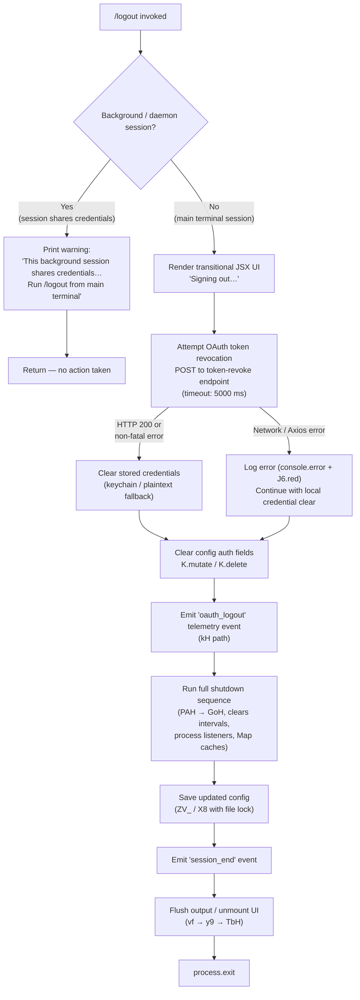

# `/logout`

> Analysis basis: CC v2.1.175 bundle.js (AST extraction + Claude interpretation)
> Minimum version: v2.1.175

---

## Overview

The `/logout` command signs the user out of their Anthropic account by revoking the active OAuth token, clearing all stored credentials and session state, and then exiting the CLI process. It is a `local-jsx` command that renders a transitional UI element before performing the full teardown sequence.

---

## Registration

| Field | Value |
|---|---|
| type | `local-jsx` |
| name | `logout` |
| description | `Sign out from your Anthropic account` |
| loc_byte | `11877546` |
| loc_byte_end | `11877830` |
| loc_line | `8082` |
| module_id | `hs_` |
| load_inline | `true` |
| arbor_handler.name | `s67` |
| arbor_handler.fqn | `claude-2.1.175::s67` |
| arbor_handler.kind | `AsyncFunction` |
| arbor_handler.resolution_path | `module_id` |
| arbor_handler.n_hits | `0` |

Analysis basis: CC v2.1.175 bundle.js:+11877546

---

## Input Branching

The command has three distinct top-level paths determined by session context and the outcome of the token-revocation network call, warranting a Mermaid flowchart.



Analysis basis: CC v2.1.175 bundle.js:+8342099 (handler entry), +8343514 (background-session guard), +8343867 (UI literal), +8342399 (token revocation), +8342522 (config mutation), +8343185 (telemetry event), +8342677 (shutdown), +8342729 (config save)

---

## Behavioral Spec

### 1. Background-Session Guard

If the current session is a background or daemon worker (determined by checking the process role flag), the command immediately displays a user-facing notice and returns without performing any logout actions.

```
function backgroundSessionGuard(sessionContext):
    if sessionContext.role in ["bg", "daemon", "daemon-worker"]:
        print("This background session shares credentials with other sessions; "
              "/logout here has no effect. Run /logout from your main terminal to sign out.")
        return EARLY_EXIT
    return CONTINUE
```

Analysis basis: CC v2.1.175 bundle.js:+8343514 (warning literal), +2283195 ("bg"), +2283205 ("daemon"), +2283219 ("daemon-worker")

---

### 2. UI Render — "Signing out…"

Before any async work, the handler uses `Ns_.createElement` to mount a JSX element that displays the transitional message "Signing out…". This gives the user immediate visual feedback.

```
function renderSigningOutUI():
    element = createElement(SigningOutComponent, props={})
    mount(element)
    # Display: "Signing out…"
```

Analysis basis: CC v2.1.175 bundle.js:+8343688 (createElement call), +8343867 ("Signing out…" literal)

---

### 3. OAuth Token Revocation

The handler calls the token-revocation helper (resolved as `Vw_`) which posts to the Anthropic OAuth revocation endpoint with `grant_type: "refresh_token"` and the stored token. A 5000 ms timeout is applied. If the server responds with HTTP 200, revocation is confirmed. Axios errors are caught and logged but do not abort the local logout sequence.

```
async function revokeOAuthToken(storedToken):
    try:
        response = await httpPost(
            url = oauthRevokeEndpoint,
            body = { grant_type: "refresh_token", token: storedToken },
            headers = { "Content-Type": "application/json" },
            timeout = 5000
        )
        if response.status == 200:
            return SUCCESS
    except AxiosError as err:
        console.error(redText(err))
        logError("oauth_token_revoke", err, category="network")
    return REVOKE_BEST_EFFORT
```

Analysis basis: CC v2.1.175 bundle.js:+2124486 (POST call), +2124546 ("refresh_token"), +2124601 ("Content-Type"), +2124616 ("application/json"), +2124644 (5000 ms timeout), +2124654 ("oauth_token_revoke"), +2124691 (Axios error check)

---

### 4. Credential and Config Clearance

After (or despite) token revocation, all locally stored credentials are wiped. The secure-storage helper (`Mh1`) attempts keychain deletion first; on failure it falls back to plaintext file removal. The global config object is then mutated via `K.mutate` and `K.delete` to remove auth fields.

```
async function clearLocalCredentials():
    try:
        await secureStorage.delete(key="claude-code-user")
    except err:
        logTelemetry("tengu_feature_bad")
        removeFile(plaintextCredentialPath)

    configStore.mutate(record => {
        delete record.auth
    })
    configStore.delete("oauthToken")
```

Analysis basis: CC v2.1.175 bundle.js:+2311313 (_.delete), +2136164 ("claude-code-user" key), +2136923 ("Failed to delete keychain entry"), +8342522 (K.mutate), +8342696 (K.delete), +1017218 (tengu_feature_bad)

---

### 5. Telemetry Emission — `oauth_logout`

Immediately after credential clearance the handler emits the `oauth_logout` telemetry event through the analytics pipeline (`kH`).

```
function emitLogoutTelemetry():
    recordTelemetryEvent("oauth_logout")
```

Analysis basis: CC v2.1.175 bundle.js:+8343182 (kH call site), +8343185 ("oauth_logout" literal)

---

### 6. Process Teardown Sequence

The shutdown orchestrator (`Qy6`) coordinates multiple cleanup sub-steps:

```
async function runShutdownSequence():
    # Step 1 – clear pending timers and event loops
    clearAllIntervals()               # pV_.clearInterval
    process.removeListener("beforeExit", ...)

    # Step 2 – drain Map caches
    for cache in [ZJH, u58, jW6, RV_, IF]:
        cache.clear()

    # Step 3 – remove process exit handlers
    process.off("exit", ...)

    # Step 4 – emit PoH "exit" event for subscribers
    eventBus.emit("exit")

    # Step 5 – flush pending error queue
    flushErrorQueue()                 # SH / GA

    # Step 6 – delete temp / lock files
    unlinkTempFiles()                 # y_q → H_6.unlink
    clearSocketFiles()                # Cl_ → DbH.unlink
```

Analysis basis: CC v2.1.175 bundle.js:+8342257 (Qy6 call), +3308299 (clearInterval), +3308334 (process.removeListener), +3308357 ("beforeExit"), +3307665–3307713 (Map clears), +3307597 ("exit"), +3307411 (PoH.emit), +7442002 (H_6.unlink), +7396335 (DbH.unlink)

---

### 7. Config Persistence with File Lock

The updated config (now missing auth fields) is written back to disk using the atomic config-save path (`ZV_` → `X8` → `t58`). A file lock is acquired; if contention is detected the telemetry event `tengu_config_lock_contention` is emitted.

```
async function persistConfig():
    acquireFileLock(configPath)
    # Guard: refuse to write if re-read config is missing auth that cache still has
    # (prevents GH#3117 regression)
    reRead = readFileSync(configPath)
    if reRead.auth is None and cache.auth is not None:
        log("saveConfigWithLock: re-read config is missing auth...")
        return
    atomicWrite(configPath, updatedConfig)
    releaseFileLock()
```

Analysis basis: CC v2.1.175 bundle.js:+8342494 (ZV_ call), +3328129 ("Lock acquisition took longer than expected"), +3328545 (GH#3117 guard message), +3328218 (tengu_config_lock_contention)

---

### 8. UI Unmount and Process Exit

Finally, the UI flush path (`vf` → `y9`) unmounts the Ink/JSX component, writes any remaining output, waits up to 3500 ms for the output stream to drain, then calls `process.exit`.

```
async function unmountAndExit():
    writeSync(fd, finalOutput)    # j3H.writeSync
    unmount(activeComponent)      # H.unmount
    await drain(timeout=3500)
    print("Successfully logged out from your Anthropic account.")
    process.exit(0)
```

Analysis basis: CC v2.1.175 bundle.js:+7405331 (H.unmount), +8343776 (setTimeout), +7407678 (3500 literal), +8343713 ("Successfully logged out…"), +7405918 (process.exit)

---

## State & Side Effects

| Item | Detail |
|---|---|
| Telemetry — `oauth_logout` | Emitted after credential clear; bundle.js:+8343185 |
| Telemetry — `tengu_feature_ok` | Emitted on successful secure-storage write; bundle.js:+1017151 |
| Telemetry — `tengu_feature_bad` | Emitted on secure-storage delete failure; bundle.js:+1017218 |
| Telemetry — `tengu_feature_sad` | Emitted on secondary storage path; bundle.js:+1017299 |
| Telemetry — `tengu_config_lock_contention` | Emitted if config file lock is contended; bundle.js:+3328218 |
| Telemetry — `tengu_config_stale_write` | Emitted on stale config write attempt; bundle.js:+3328354 |
| Telemetry — `tengu_config_auth_loss_prevented` | Emitted when GH#3117 guard trips; bundle.js:+3328697 |
| Telemetry — `tengu_cache_eviction_hint` | Emitted during session-end cache handling; bundle.js:+7408030 |
| Telemetry — `tengu_scroll_summary` | Emitted during UI teardown scroll summary; bundle.js:+7407087 |
| Config mutation | Auth fields removed from `~/.claude.json` via atomic write with lock |
| Keychain / secure storage | `claude-code-user` entry deleted; plaintext fallback also removed |
| Map caches cleared | `ZJH`, `u58`, `jW6`, `RV_`, `IF` all `.clear()`-ed |
| Interval / timer cleanup | All registered intervals cancelled; `beforeExit` listener removed |
| Process event listeners | `exit` and `beforeExit` listeners removed via `process.off` / `process.removeListener` |
| Temp / lock / socket files | Unlinked via `H_6.unlink` and `DbH.unlink` |
| Network call | OAuth token revoke POST; timeout 5000 ms; errors non-fatal |
| Process exit | `process.exit` called unconditionally after UI drain |

---

## Version History

| Version | Change |
|---|---|
| v2.1.175 | Initial analysis |

---

## Common Mistakes

1. **Running `/logout` in a background or IDE-embedded session**: The command detects daemon/background roles and prints a warning without performing any action. Always run `/logout` from the primary interactive terminal session.
2. **Expecting a no-exit behavior**: Unlike most slash commands, `/logout` terminates the entire CLI process (`process.exit`) after completing. Any unsaved session state will be lost.
3. **Assuming network failure blocks logout**: The OAuth token revocation is best-effort. If the network call fails, the local credentials are still cleared and the process still exits. A failed revocation does not prevent logout.
4. **Editing `~/.claude.json` auth fields manually before logging out**: The GH#3117 guard in the config-write path will refuse to write if the re-read file is missing auth that the in-memory cache holds, which can result in a stale-write telemetry event and the config not being flushed.
5. **Confusing `/logout` with a simple credential reset**: The command performs a full process teardown including clearing all Map caches, intervals, process listeners, temp files, and sockets — not merely deleting a credential file.

---

## Appendix — Identifier Mapping

> For bundle debugging only. Identifiers change across versions.

| Identifier | Role |
|---|---|
| `s67` | Main async logout handler (Arbor-resolved handler for `/logout`) |
| `FA6` | Core logout execution function (token revoke, config clear, shutdown orchestration) |
| `Qy6` | Shutdown sequence orchestrator (timers, caches, process events, temp files) |
| `PAH` | Process event / error bus teardown helper |
| `GoH` | Interval and Map cache cleaner |
| `pV_` | Per-interval clear + `process.removeListener("beforeExit")` helper |
| `SH` | Error queue flusher |
| `GA` | Error coercer / stringifier |
| `K6` | String coercer utility |
| `qq` | Essential-traffic queue helper |
| `mxf` | Rotating buffer shift/push helper |
| `y_q` | Temp/session file unlink coordinator |
| `mh6` | Session file path resolver (index 0) |
| `Es6` | Path join + file delete helper |
| `Cl_` | Socket / lock file cleanup orchestrator |
| `Sl_` | Socket cleanup with clearTimeout |
| `nLH` | Socket path existence checker (uses `dv1`, `A.some`, `_.includes`) |
| `EjH` | Socket path join + delete helper |
| `Vw_` | OAuth token revocation HTTP caller |
| `m1` | OAuth endpoint URL builder (env-aware: prod/local/staging) |
| `N` | Generic HTTP/network request helper |
| `J9f` | Request construction helper |
| `BvA` | TLS/cert helper |
| `RH` | JSON.stringify wrapper |
| `nf` | URL path formatter / redactor |
| `WIA` | Header map builder |
| `mgH` | Log writer helper |
| `LIA` | Terminal write wrapper |
| `G9f` | File-backed HTTP log helper |
| `$gH` | Batched log flush (clearTimeout/setTimeout/setImmediate) |
| `L4H` | Log entry formatter |
| `je8` | Log file rotation helper (stat/rename/unlink) |
| `W9f` | Log append + rotation dispatcher |
| `u9` | Telemetry drain registrar |
| `ZV_` | Config persistence entry point |
| `Z19` | Config read + write coordinator |
| `E21` | Config path resolver |
| `CI` | Config path hasher (sha256/NFC) |
| `r2` | Config environment resolver |
| `_N` | OS user info checker |
| `TH` | String coercer |
| `X8` | Atomic config writer with lock and backup |
| `t58` | File-lock acquire + write + backup helper |
| `Hh1` | Config object merger |
| `U7H` | Config file reader with backup/rotation |
| `NoH` | Config parse helper |
| `rV_` | Config backup path builder |
| `Ww6` | Atomic write-via-temp-file helper |
| `yJH` | Config version stamper |
| `s19` | Config entry enumerator |
| `vW6` | Timestamp generator for config |
| `s58` | Config save with staleness check |
| `C98` | Post-save config verifier |
| `K` | In-memory config store (mutate / delete / map / padEnd) |
| `bVH` | Config change broadcaster |
| `t67` | Logout UI component renderer |
| `JSH` | OTEL / telemetry attribute assembler |
| `$J` | TH-based attribute coercer |
| `Bf` | Telemetry event emitter / batcher |
| `jSH` | OTEL metric attribute builder |
| `LF` | Telemetry storage initialiser |
| `h6` | Telemetry tag helper |
| `zw8` | Telemetry schema builder (Object.freeze) |
| `sG6` | K6-based attribute string coercer |
| `b8H` | Rate-limit / allow-list checker |
| `n4` | Metric record builder |
| `RJ9` | Metric aggregation helper |
| `rM6` | Event batch flusher |
| `Ja8` | Event queue manager |
| `M` | MCP server manager (emit / get / values / sGA) |
| `DCH` | MCP connection dispatcher |
| `ki8` | MCP connection result applier |
| `$` | MCP helper (hjK) |
| `sGA` | MCP server state aggregator |
| `Xa8` | MCP shutdown helper |
| `vf` | UI exit / unmount dispatcher |
| `y9` | Full UI teardown + process exit sequencer |
| `TbH` | Ink component unmount + final write |
| `vb` | Terminal restore helper |
| `b$8` | ANSI cursor-save/restore write helper |
| `ll_` | Final output line renderer |
| `P0` | Output stream reference |
| `vu` | Terminal column query |
| `bh6` | Working-directory stat helper |
| `V$` | Tag/zone helper |
| `h8q` | Output line truncator |
| `nl_` | Force-kill fallback (SIGKILL / process.exit) |
| `OgH` | Telemetry drain caller |
| `w` | Daemon/supervisor config reloader |
| `_ZH` | Daemon wire-protocol writer |
| `eXK` | Daemon column-width calculator |
| `T` | Spinner stop helper |
| `gsK` | Heartbeat sender |
| `p8q` | Promise.allSettled shutdown waiter |
| `$$6` | Startup profiling flusher |
| `he8` | Profile record writer |
| `uIA` | Startup perf log serialiser |
| `LG8` | Session scroll-summary emitter |
| `N8q` | Scroll stats collector |
| `v8q` | Timing stats calculator |
| `k1` | Session initialiser / display-mode detector |
| `JM6` | Cache eviction hint emitter |
| `M6` | d56-based helper |
| `d56` | Low-level data store primitive |
| `ZbH` | Deferred resolve wrapper |
| `KG8` | Graceful-wait resolver |
| `Mh1` | Secure storage read/write/delete dispatcher |
| `mhH` | Secure storage async read path |
| `Uj4` | Keychain async store helper |
| `kH` | Telemetry event recorder (tengu_feature_*) |
| `d` | Generic data accessor |
| `A6` | d56 wrapper |
| `t6` | Telemetry "sad" path recorder |
| `CH` | Telemetry "bad" path recorder |
| `Sf` | Secure storage entry point |
| `n_` | Provider-type exclusion checker (bedrock/foundry/vertex/mantle) |
| `P9` | Daemon process type detector |
| `fjH` | Daemon role resolver |
| `Ha` | Session context reader |
| `Rm` | Config reader with lock |
| `Wm` | Kb-based config reader |
| `YX` | Plaintext credential file writer |
| `u1` | Error handler with process.exit |
| `bUH` | console.error + red-text formatter |
| `H` | Generic store / timer / random utility |
| `_` | Secondary store / string utility |

---

Note: index built via Arbor fallback; some signals (telemetry, literals) may be missing — see arbor-fallback.js.