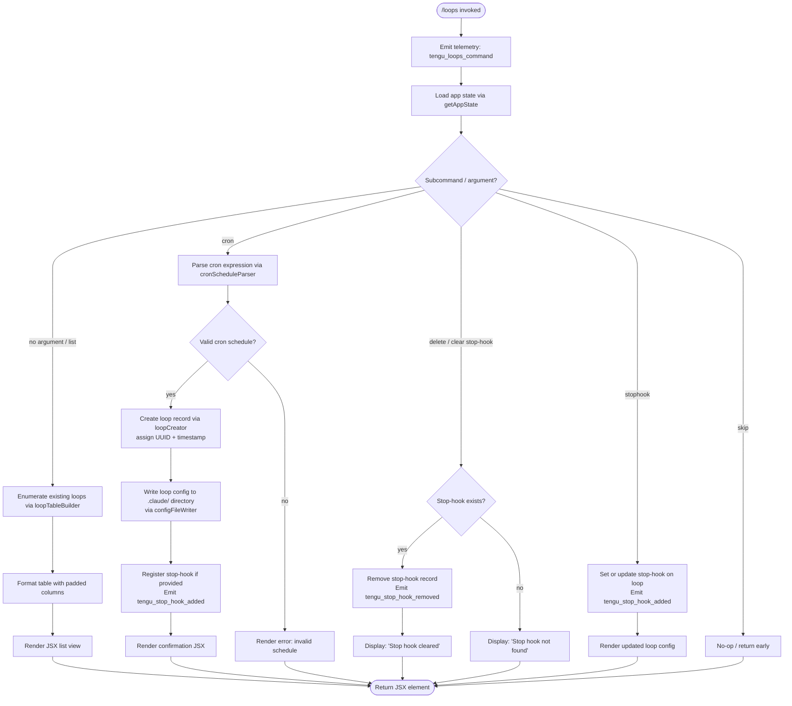

# `/loops`

> Analysis basis: CC v2.1.175 bundle.js (AST extraction + Claude interpretation)
> Minimum version: v2.1.175

---

## Overview

`/loops` is the primary management interface for Claude Code's background loop ("daemon loop") system. It allows users to list currently running or scheduled loops, create new loops with configurable cron schedules and stop-hook behaviors, and delete existing loops. The command is rendered as a JSX component and operates directly against live application state, dispatching to several sub-handlers depending on the user action.

---

## Registration

| Field | Value |
|---|---|
| type | `local-jsx` |
| name | `loops` |
| description | `List, create, and delete loops` |
| immediate | `true` |
| module_id | `g$K` |
| load_inline | `true` |
| loc_byte | `12778198` |
| loc_byte_end | `12778355` |
| loc_line | `9004` |
| arbor_handler.name | `yr7` |
| arbor_handler.fqn | `claude-2.1.175::yr7` |
| arbor_handler.kind | `AsyncFunction` |
| arbor_handler.resolution_path | `module_id` |
| arbor_handler.n_hits | `0` |

Analysis basis: CC v2.1.175 bundle.js:+12778198

---

## Input Branching

The handler `yr7` examines the subcommand string and application state to branch across five or more distinct paths (list, create/configure, run, delete stop-hook, and skip/no-op), requiring a Mermaid flowchart.



Analysis basis: CC v2.1.175 bundle.js:+12777153 (handler entry), +12777201 (loopTableBuilder call), +12777251 (cron literal), +12777337 (stophook literal), +12777579 (stop-hook error message), +12777803 (loop creator), +12777891 (stop-hook set path)

---

## Behavioral Spec

### 1. Handler Entry and Telemetry (`yr7`)

The main handler is the `AsyncFunction` `yr7`, resolved via `module_id` path against module `g$K`.

```
async function loopsCommandHandler(context):
    emit telemetry("tengu_loops_command")        // loc +12777155
    appState = context.getAppState()             // loc +12777205
    loops = loadLoopsFromDaemon(context)         // calls loopDaemonLoader (F1H) loc +12777193
    ...
    // Branch on subcommand (see Input Branching)
```

Analysis basis: CC v2.1.175 bundle.js:+12777153

---

### 2. Loop Daemon Loader (`F1H` → `dSH`)

Reads the current set of loop records from the daemon's persistent store.

```
function loopDaemonLoader(context):
    rawData = fileReader.readFile(path, "utf-8")  // encoding: "utf-8" loc +4871935
    parsedRecords = parseLoopConfig(rawData)       // via configParser (dSH) loc +4873896
    filteredRecords = applyArrayFilter(parsedRecords)
    return filteredRecords
```

Internally, `dSH` calls:
- `o6` — path resolution helper
- `_.readFile` — file system read (encoding `"utf-8"`)
- `HMH` → `MD8.join` — path joining, `yf` → `iG` for config directory resolution
- `N9` → `E8` — error code normalization (handles `ENOENT`, `EACCES`, `EPERM`, `ENOTDIR`, `ELOOP`, `EROFS`)
- `SH` — log-error path (`ua.logError`) for persistent failures
- `Mq` — metadata enrichment
- `Array.isArray` — guards the parsed result

Analysis basis: CC v2.1.175 bundle.js:+4873896, +4871888, +4871907, +4871918, +4871957

---

### 3. Loop Table Builder (`nK6`)

Formats the list of loops into a display table for the JSX renderer.

```
function loopTableBuilder(loopRecords):
    columnWidths = computeColumnWidths(loopRecords)  // hGH, K.set loc +9280144
    rows = loopRecords.map(record =>
        formatRow(record, columnWidths)               // XZq → H.map loc +9279913
    )
    paddedRows = rows.map(r => r.padEnd(width, "  ")) // pad constant "  " loc +16902383
    return paddedRows
```

The column width computation uses `K.set` and `XZq` (mapping over the loop array with `H.map`). Column padding uses a pad-width of 40 characters (literal `40` at loc +16904354).

Analysis basis: CC v2.1.175 bundle.js:+10592609, +9280144, +9280152, +16904354

---

### 4. Cron Schedule Parser (`Ir7` → `Ty` → `O4L`)

Parses and validates a cron schedule string supplied as the argument to the `cron` subcommand.

```
function cronScheduleParser(scheduleString):
    trimmed = scheduleString.trim()
    parts = splitIntoParts(trimmed)              // O4L → H.split loc +4867928
    for each part in parts:
        match = part.match(cronRegex)            // f.match loc +4867948
        value = parseInt(match)                  // loc +4867993
        if value is valid:
            fieldSet.add(value)                  // K.add loc +4868054
    result = Array.from(fieldSet)                // loc +4868456

    // Named schedule shortcuts:
    if scheduleString matches "Every minute":    // literal loc +4869799
        return minuteSchedule
    if scheduleString matches "Every hour":      // literal loc +4870016
        return hourlySchedule

    // Numeric field limits observed in literals:
    // max field count: 5 (loc +4868544)
    // max value:       10 (loc +4868007)
    // day-of-week:     3 (loc +4868169), 6 (loc +4868205), 7 (loc +4868211)
    // max runs/hour:   4 (loc +4868707)
    return parsedSchedule
```

The schedule string `"1-5"` is a recognized range literal (loc +4870723).
`Math.max`, `Math.ceil`, `Math.round` are used for normalization (loc +12776863, +12776874, +12776947).
The integer constant `59` (loc +12776920), `23` (loc +12776991), `31` (loc +12777044) are cron field upper bounds.

Analysis basis: CC v2.1.175 bundle.js:+12776741, +4867928, +4867948, +4867993, +4868054, +4868456

---

### 5. Loop Creator (`xtH`)

Creates a new loop record and writes it to disk.

```
async function loopCreator(schedule, context):
    id = crypto.randomUUID()                       // mG9.randomUUID loc +4873235
    timestamp = Date.now()                         // loc +4873297
    config = buildConfig(id, timestamp, schedule)  // uVH loc +4873343
    configFilePath = path.join(".claude", ...)     // ".claude" literal loc +4873076, MD8.join
    await fs.mkdir(configFilePath, {recursive: true}) // LD8.mkdir loc +4873055
    await fs.writeFile(configFilePath, serialize(config)) // LD8.writeFile loc +4873152
    loopRecord = buildLoopRecord(config)           // dSH loc +4873387
    runningLoops.push(loopRecord)                  // M.push loc +4873400
    return loopRecord
```

The loop file is written under the `.claude` directory (literal at loc +4873076). The UUID field occupies 8 bytes (literal `8` at loc +4873260).

Analysis basis: CC v2.1.175 bundle.js:+12777803, +4873235, +4873297, +4873343, +4873387

---

### 6. Stop-Hook Registration (`rK6` / `iK6`)

Two symmetric code paths handle adding or removing a stop-hook on a loop. Both call into `getAppState` / `setAppState` / `applyMessageOp`.

```
// ADD stop-hook (rK6)
function addStopHook(loopId, hookValue, context):
    currentState = context.H.getAppState()          // loc +10593413
    hookId = Tgq.randomUUID()                       // Pgq.randomUUID loc +10593762
    op = {
        type: "append",                             // literal loc +10593634
        kind: "attachment",                         // literal loc +10593744
        goalType: "goal",                           // literal loc +10593702
        goalStatus: "goal_status"                   // literal loc +10593831
    }
    context.H.applyMessageOp(op)                    // loc +10593611
    context.H.setAppState(newState)
    emit telemetry("tengu_stop_hook_added")         // loc +10593296
    display("Stop hook set")                        // literal loc +12777915

// REMOVE stop-hook (iK6)
function removeStopHook(loopId, context):
    currentState = context._.getAppState()          // loc +10592995
    if hookNotFound:
        display("Stop hook not found")              // literal loc +12777597
        return
    context._.applyMessageOp(removeOp)             // loc +10593239
    context._.setAppState(updatedState)
    emit telemetry("tengu_stop_hook_removed")       // loc +10593668
    display("Stop hook cleared")                    // literal loc +12777619
```

Gate checks `hooks_gate` (literal loc +10592806) and `trust_gate` (literal loc +10592860) are evaluated before mutation via `RKA` (loc +10592910).

Analysis basis: CC v2.1.175 bundle.js:+10593413, +10593296, +10593668, +12777597, +12777619, +12777915

---

### 7. Loop Status Computation (`oTA`)

Computes the derived status of each loop for display. States observed in literals:

| Status | Literal | loc_byte |
|---|---|---|
| `done` | `"done"` | +16883512 |
| `killed` | `"killed"` | +16883530 |
| `failed` | `"failed"` | +16883549 |
| `crashed` | `"crashed"` | +16883696 |
| `blocked` | `"blocked"` | +16883750 |
| `working` | `"working"` | +16883857 |
| `bg` | `"bg"` | +16884021 |
| `daemon` | `"daemon"` | +16884346 |
| `idle` | `"idle"` | +16884461 |
| `active` | `"active"` | +4256274 |
| `resuming` | `"resuming"` | +16885346 |
| `unknown` | `"unknown"` | +4249675 |

A loop enters idle timeout after 300,000 ms (literal `300000` at loc +16885132). Recurring loops show the suffix `" (recurring)"` (literal at loc +16371761); non-recurring show `"never"` (literal at loc +16371659).

```
function computeLoopStatus(loopRecord):
    if loopRecord.state == "done" or "killed":   return terminalStatus
    if loopRecord.state == "crashed":            return crashStatus
    if loopRecord.state == "blocked":            return blockedStatus
    if loopRecord.state == "working":            return workingStatus
    if loopRecord.state == "bg":                 return backgroundStatus
    if timeSinceLastActivity > 300000:           return "idle"
    return loopRecord.state
```

The supervisor role is referenced by literal `"supervisor"` (loc +16892077); background sessions by `"background session"` (loc +16914430).

Analysis basis: CC v2.1.175 bundle.js:+16883512, +16883696, +16885082, +16885132

---

### 8. Missed / Fired / Expired Scheduled Task Events

The loop scheduler emits dedicated telemetry when a scheduled task fires, is missed, or expires:

- `tengu_scheduled_task_fire` (loc +16371784) — task fires on schedule
- `tengu_scheduled_task_missed` (loc +16371033) — task was scheduled but not executed in time
- `tengu_scheduled_task_expired` (loc +16372127) — loop exceeded its lifetime

The scheduler uses `Math.floor` (loc +16371982) and a 60-second tick constant (literal `60` at loc +16372014) for interval alignment. `HG5.isLoopDefaultSentinel` is called to check whether a loop is in its uninitialized state (loc +16371873).

Analysis basis: CC v2.1.175 bundle.js:+16371784, +16371033, +16372127, +16372014

---

## State & Side Effects

| Item | Detail |
|---|---|
| Telemetry — primary | `tengu_loops_command` (loc +12777155) — emitted on every `/loops` invocation |
| Telemetry — stop hook added | `tengu_stop_hook_added` (loc +10593296) |
| Telemetry — stop hook removed | `tengu_stop_hook_removed` (loc +10593668) |
| Telemetry — task fire | `tengu_scheduled_task_fire` (loc +16371784) |
| Telemetry — task missed | `tengu_scheduled_task_missed` (loc +16371033) |
| Telemetry — task expired | `tengu_scheduled_task_expired` (loc +16372127) |
| Telemetry — daemon control | `tengu_daemon_control` (loc +16914553) |
| Telemetry — daemon config reload | `tengu_daemon_config_reload` (loc +16892870) |
| Telemetry — bg session create | `tengu_bg_session_create` (daemon, loc +16877682) — reachable via daemon dispatcher |
| Telemetry — spare enable/claim | `tengu_bg_spare_enable` (loc +16878671), `tengu_bg_spare_claim` (loc +16878799), `tengu_bg_spare_claim_fail` (loc +16879065) |
| Telemetry — low memory | `tengu_bg_low_mem_mb` (loc +13321809), `tengu_bg_dispatch_low_mem` (loc +16877967) |
| Telemetry — sigkill escalation | `tengu_bg_dispatch_sigkill_escalate` (loc +16877366) |
| Telemetry — sendclaim failed | `tengu_bg_sendclaim_failed` (loc +16856159) |
| Telemetry — bg state read transient | `tengu_bg_state_read_transient` (loc +4249629) |
| Telemetry — feature gates | `tengu_feature_ok` (loc +1017151), `tengu_feature_bad` (loc +1017218), `tengu_feature_sad` (loc +1017299) |
| Telemetry — MCP skills | `tengu_mcp_skills` (loc +6636971) |
| File system writes | New loop configs written to `.claude/` directory (literal loc +4873076) via `LD8.mkdir` + `LD8.writeFile` |
| File system reads | Loop config loaded via `_.readFile` with encoding `"utf-8"` |
| appState changes | `getAppState` / `setAppState` / `applyMessageOp` called when adding or removing stop-hooks |
| Hook registration | Stop-hook registered as `"attachment"` op of goal kind on the active session |
| Daemon interaction | Communicates with background daemon via socket (SIGTERM/SIGKILL escalation, `dTA` socket claim flow) |
| Idle timeout | Loops auto-transition to `"idle"` after 300,000 ms inactivity (loc +16885132) |
| Sound | <!-- TODO: not found in depth-2 traversal; needs --depth 4 --> |

---

## Version History

| Version | Change |
|---|---|
| v2.1.175 | Initial analysis |

---

## Common Mistakes

1. **Providing an invalid cron expression** — the parser (`Ir7` / `O4L`) validates field ranges strictly (max field 59/23/31 for minute/hour/day). An out-of-range value will result in a parse error and no loop is created.
2. **Forgetting the `cron` subcommand keyword** — the schedule string must be prefixed with `cron` (literal at loc +12777251); providing just a bare schedule expression is not recognized.
3. **Attempting to delete a non-existent stop-hook** — if no stop-hook is registered for the targeted loop, the command displays `"Stop hook not found"` (loc +12777597) and exits without error.
4. **Assuming loops persist across full CLI restarts without daemon** — the loop state is managed by the background daemon process; if the daemon is not running, the list will be empty or stale.
5. **Confusing `stophook` and the `cron` schedule** — `stophook` (literal loc +12777337) is a separate sub-action for configuring what happens when a loop's agent stops; it is not the same as setting the run frequency.
6. **Expecting synchronous output** — `yr7` is an `AsyncFunction`; the JSX component is rendered asynchronously and may briefly show a loading state before results appear.

---

## Appendix — Identifier Mapping

> For bundle debugging only. Identifiers change across versions.

| Identifier | Role |
|---|---|
| `yr7` | Main loops command handler (AsyncFunction, module `g$K`) |
| `d` | Generic utility / context accessor |
| `F1H` | Loop daemon loader (reads loop records from daemon store) |
| `dSH` | Loop config file parser and filter |
| `o6` | Path resolution helper |
| `HMH` | Config directory path builder (`MD8.join` + `yf`) |
| `yf` | Config base-path resolver (calls `iG`) |
| `N9` | File-error code normalizer (wraps `E8`) |
| `E8` | Low-level error code classifier |
| `SH` | Persistent error logger (`ua.logError`, MCP queue manager) |
| `GA` | Error string formatter |
| `K6` | String coercion helper |
| `qq` | Traffic-category tagger (`"essential-traffic"`) |
| `mxf` | Queue shift/push helper (`wa6`) |
| `N` | Loop record normalizer / field formatter |
| `J9f` | Record field validator |
| `H` | Miscellaneous runtime context (random, setTimeout) |
| `RH` | JSON serializer (`JSON.stringify`) |
| `nf` | String manipulation helper (replace, slice, lastIndexOf) |
| `mgH` | Locale-aware formatter (`LIA`) |
| `G9f` | Per-record path and size processor (`Buffer.byteLength`) |
| `Ty` | Schedule string trimmer and row accumulator |
| `O4L` | Cron field splitter and set builder |
| `A` | Array accumulator (lowercase normalizer) |
| `f` | Stream / set helper (add, finally, delete) |
| `q` | Data-event queue (`"data"` literal, 1024 buffer) |
| `L` | Stream lifecycle manager (close, finally) |
| `WE` | Utility initializer (calls `iG`) |
| `iG` | Base path / config directory resolver |
| `nK6` | Loop table builder (column widths, padding) |
| `hGH` | Column-width setter (`K.set`, `XZq`) |
| `K` | Column-width map |
| `XZq` | Row mapper (`H.map`) |
| `h6` | UI helper (calls `iG`) |
| `uN` | Cron schedule detail parser (minute/hour/day-of-week, UTC date math) |
| `D` | Background session / daemon process manager |
| `b` | Loop spawner and lifecycle coordinator |
| `w` | Daemon write / stop / update / start orchestrator |
| `Ls` | Log helper (`kLH`) |
| `btH` | Config file writer (`LD8.mkdir`, `LD8.writeFile`, `MD8.join`) |
| `FG9` | Record filter helper (`CtH`) |
| `P` | Socket read buffer (Buffer.concat, subarray, ETOOLARGE) |
| `z` | Daemon stop controller (`kH`, `CH`, `ZS`, `aU`) |
| `S` | Session writer / processor (`csK`, `vM`, `SH`, `kV5`) |
| `X` | Timeout-based session map (`M`, `q.setTimeout`) |
| `c` | Session constructor helper (`Su6`, `_HK`) |
| `NcK` | Loop display formatter (maps `uN`, `Math.max`, `q.join`) |
| `B1H` | Loop record re-loader / filter (`f8H`, `dSH`, `btH`) |
| `i8` | Async timeout wrapper (`clearTimeout`, `f.unref`) |
| `O` | Process event wrapper (`C8`) |
| `CH` | Channel/stream opener (`d`, `A6`) |
| `A6` | Channel config builder (`d56`) |
| `kH` | Channel closer (`d`, `A6`) |
| `ng8` | macOS memory reader (`a6`, `z6`) |
| `z6` | Memory pressure evaluator (`XW6`, `PW6`, `Rm`, `ZJH`, `jW6`, `IF`, `C6`) |
| `UG6` | Pins / config file loader (`vW.readFile`, `ZS_`, `d6`, `f8L`) |
| `ZS_` | Config file path builder (`yJ.join`, `_Z`) |
| `d6` | JSON parse wrapper |
| `y8` | Error categorizer (`E8`) |
| `f8L` | Directory-based config scanner (`vW.readdir`, `vW.readFile`, `Promise.all`) |
| `Q` | Background PTY session manager (connect, kill, splice, unlink) |
| `l` | Scheduled task executor (fire, expire, `HG5.isLoopDefaultSentinel`) |
| `C` | PTY write helper (`clearTimeout`, `O.write`) |
| `B` | PTY add helper |
| `uZ` | Windows named-pipe path builder (`k$.join`, `QpH`) |
| `p` | Framing helper |
| `Xv` | Binary frame encoder (`Buffer.from`, `Buffer.allocUnsafe`, `writeUInt32BE`) |
| `Pm8` | Binary frame decoder (`Buffer.alloc`, `readUInt32BE`, `Buffer.from`) |
| `dTA` | Daemon socket claim handler (`Gd.claim`, `LXA`, `qV5`, `AV5`, `Xv`) |
| `LXA` | Daemon directory initializer (`Td.mkdir`, `Td.writeFile`, `JSON.stringify`) |
| `qV5` | Claim timeout enforcer (`Date.now`, `Error`, `i8`) |
| `AV5` | Claim frame builder (`Gd.buildClaimFrame`) |
| `I7` | Error identity tester |
| `TH` | String coercion wrapper |
| `oTA` | Loop session lifecycle manager (status computation, file cleanup, setTimeout) |
| `Af` | Session artifact path builder (`yJ.join`, `_Z`) |
| `Vq` | Session state file reader (stat, readFile, JSON parse, R5H cache) |
| `ZO` | Active-state marker (`ZN`, `"active"` literal) |
| `dXH` | Tool filter builder (startsWith, indexOf, slice, S5H, gz8, WS_) |
| `n7` | Session name path builder (`JO`, `yJ.join`, `RH`, `kJ`) |
| `ef6` | Session event subscriber (`WHK.then`, `sQ`, `Date.now`, `lb7`) |
| `pu6` | Unix socket path builder (`k$.join`, `uu6`) |
| `OOH` | Socket path resolver (`k$.join`, `QpH`) |
| `aQ` | Session config writer (`a6`, `n5A`, `k$.join`, `sf6`) |
| `mu6` | Session directory builder (`k$.join`, `uu6`) |
| `Y` | Forced-shutdown handler (`KX`, `process.exit`, `z.abort`) |
| `KX` | Shutdown signal emitter |
| `j` | Active-sessions iterator (`A.values`, `S.kill`) |
| `$` | Telemetry dispatcher (`hjK`) |
| `hjK` | Structured log emitter (`Ls`, `Date.now`, `n9`, `Rp6`, `RH`) |
| `n9` | AsyncLocalStorage store reader (`hB4.getStore`) |
| `Rp6` | Log file path builder (`NjK.join`, `M_`, `"daemon.status.json"`) |
| `J` | Date-math wrapper (UTC day/date/hours) |
| `rK6` | Add-stop-hook handler (`H.getAppState`, `H.setAppState`, `H.applyMessageOp`, `Tgq`) |
| `Tgq` | UUID generator for stop-hook IDs (`Pgq.randomUUID`) |
| `M6` | Message object builder (`d56`) |
| `d56` | Base message shape factory |
| `Ir7` | Top-level schedule string parser (delegates to `Ty`) |
| `xtH` | Loop creator (UUID, timestamp, config write, `dSH`, `M.push`) |
| `uVH` | Loop config struct builder |
| `M` | MCP client manager (`DCH`, `ki8`, `f.get`, `sGA`) |
| `DCH` | MCP connection dispatcher (per-server connect logic) |
| `Vi` | MCP slot initializer (`uV6`, `ze`, `Q2H`, `yg`, `cX8`, `XX`, `bV6`) |
| `eV` | MCP transport builder (`fw`, `aB_`) |
| `n8` | Utility wrapper (`_`) |
| `kv6` | MCP version negotiator |
| `Hi9` | MCP capability handler (`gg_`, `l2H`, `SJ8`, `Date.now`) |
| `RJ8` | MCP result router (`SJ8`, `rX`) |
| `yJ8` | MCP success handler (`Sf`) |
| `z8` | MCP debug logger (`xdH.push`, `ua.logMCPDebug`) |
| `DP8` | MCP tool-call executor (OAuth, `NEL`, `TH`, `Promise.race`) |
| `jP8` | MCP OAuth complete-authentication handler (`hEL`, `lH6`, `iH6`) |
| `$i9` | MCP post-connect callback (`$28.then`, `gg_`, `n9`, `Y28`, `RH`) |
| `$F_` | MCP error reporter (`rX`, `Sf`, `z8`, `TH`) |
| `nN` | MCP skills telemetry emitter (`z6`, `tengu_mcp_skills`) |
| `oB_` | MCP include-filter checker (`X8`, `A.includes`) |
| `y` | Warning banner renderer (`qs`, `A`, `"warning"`, `"fable-usage-credits"`) |
| `YL` | MCP error logger (`xdH.push`, `ua.logMCPError`) |
| `Ki9` | MCP keepalive helper (`Kg`) |
| `W66` | MCP protocol version parser (`parseInt`) |
| `D28` | MCP request-ID parser (`parseInt`) |
| `ki8` | MCP connection result applier (`H.applyMcpUpdate`, `YCH`, `z8`, `AG`) |
| `YCH` | MCP update helper (`l2H`) |
| `AG` | MCP client cleanup (`X66`, `K.cleanup`, `nN`) |
| `sGA` | MCP server group synchronizer (`Object.entries`, `A.filter`, `_.getClients`, `DCH`, `ki8`) |
| `tX8` | MCP filter checker (`HEL.has`, `HF_.has`) |
| `X66` | MCP state logger (`l2H`) |
| `iK6` | Remove-stop-hook handler (`_.getAppState`, `_.setAppState`, `_.applyMessageOp`, `Tgq`, `kH`) |
| `RKA` | Policy/gate evaluator (`Gb`, `IAH`, `x_`, `B7`) |
| `Gb` | Policy settings reader (`I8`, `"policySettings"`) |
| `I8` | Feature flag reader (`_t6`, `nC`) |
| `IAH` | Policy reader (`I8`, `rA`) |
| `x_` | Trust gate evaluator |
| `B7` | hooks-gate checker (`np4`) |
| `np4` | Hook gate policy engine (`K6`, `KgH`, `P9`, `C6`, `VAH`, `mc`, `b6`, `ZD.resolve`) |
| `t6` | Goal-set state builder (`d`, `A6`, `"goal_set"`) |
| `_D` | Output-token counter (`nFH`, `Object.values`, `"outputTokens"`) |

---

Note: index built via Arbor fallback; some signals (telemetry, literals) may be missing — see arbor-fallback.js.