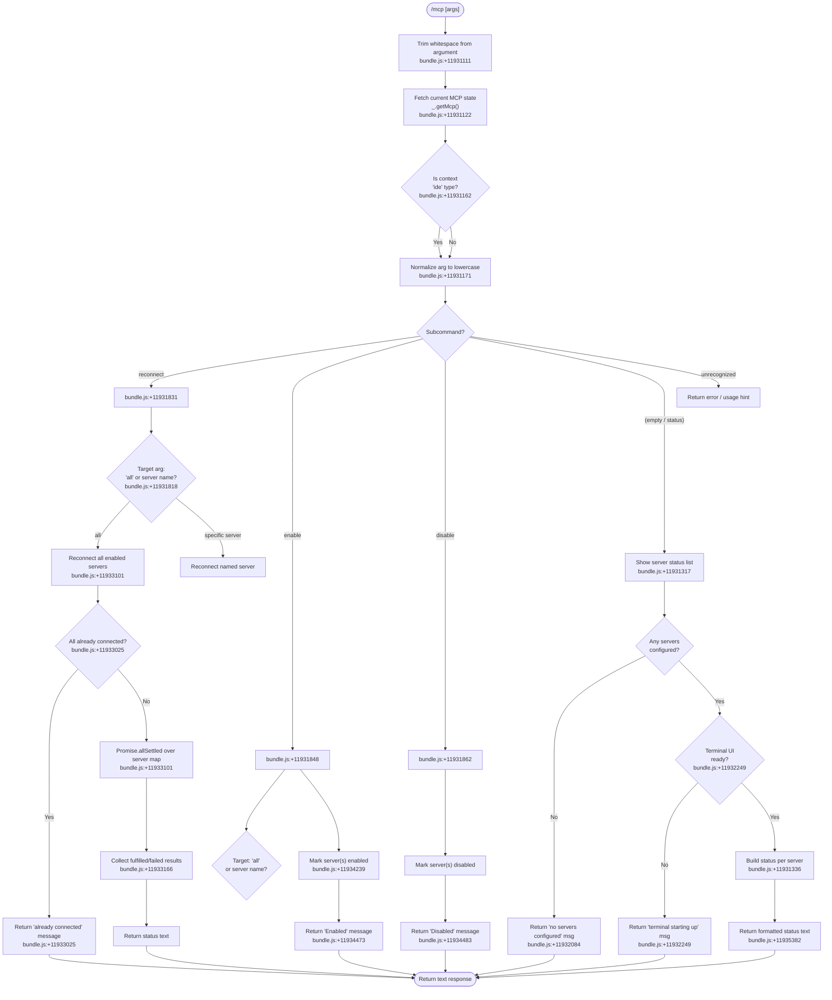

# `/mcp`

> Analysis basis: CC v2.1.174 bundle.js (AST extraction + Claude interpretation)
> Minimum version: v2.1.174

---

## Overview

The `/mcp` command provides interactive management of Model Context Protocol (MCP) servers within the Claude Code CLI. It allows users to inspect connection status, reconnect servers, and enable or disable individual servers or all servers at once. The command is fully supported in non-interactive mode and delegates its core logic to an async handler (`lx7`) that reads the current MCP state, processes a subcommand argument, and returns a text response with status or confirmation messaging.

---

## Registration

| Field | Value |
|---|---|
| type | `local` |
| name | `mcp` |
| description | `Manage MCP servers` |
| argumentHint | `[reconnect\|enable\|disable [<server>\|all]]` |
| supportsNonInteractive | `true` |
| module_id | `U8K` |
| load_inline | `true` |
| loc_byte | `12186969` |
| loc_byte_end | `12187161` |
| loc_line | `8304` |
| **arbor_handler.name** | `lx7` |
| **arbor_handler.fqn** | `claude-2.1.174::lx7` |
| **arbor_handler.kind** | `AsyncFunction` |
| **arbor_handler.resolution_path** | `module_id` |
| **arbor_handler.n_hits** | `0` |
| `arbor_handler.name` | `lx7` |
| `arbor_handler.kind` | `AsyncFunction` |
| `arbor_handler.resolution_path` | `module_id` |
| `arbor_handler.fqn` | `claude-2.1.174::lx7` |
| `arbor_handler.n_hits` | `0` |

Analysis basis: CC v2.1.174 bundle.js:+12186969

---

## Input Branching

The handler parses the trimmed argument string and dispatches across five distinct subcommand branches plus several sub-cases within each. A Mermaid flowchart is required.



---

## Behavioral Spec

### 1. Argument Parsing and MCP State Fetch

```
async function mcpCommandHandler(rawArgument, appState):
    # Trim whitespace from user-supplied argument
    arg = rawArgument.trim()                     # bundle.js:+11931111

    # Retrieve live MCP configuration and connection state
    mcpState = appState.getMcp()                 # bundle.js:+11931122

    # Determine if the current context is an IDE integration
    contextType = detectContextType()            # bundle.js:+11931162
    # "ide" is a recognized context literal       # bundle.js:+11931162

    # Normalize the subcommand to lowercase for case-insensitive matching
    subcommand = arg.toLowerCase()               # bundle.js:+11931171

    dispatch(subcommand, mcpState, appState)
```

Analysis basis: CC v2.1.174 bundle.js:+11931111

---

### 2. Status Display (no subcommand)

When the user types `/mcp` without any argument, the handler enters the status branch.

```
function handleStatusDisplay(mcpState, uiState):
    servers = getConfiguredServers(mcpState)     # bundle.js:+11931317

    if servers is empty:
        return "No MCP servers are configured. Add one with `claude mcp add`."
        # bundle.js:+11932084

    if not terminalUIReady(uiState):
        return "MCP controls aren't available right now — the terminal is still starting up or is showing another view."
        # bundle.js:+11932283

    # Build per-server status rows
    statusLines = []
    for server in servers:
        status = server.connectionStatus
        # Recognized status values: "connected", "pending", "failed",
        # "needs-auth", "disabled"
        # bundle.js:+11931336, +11931370, +11931402, +11931421, +11931456

        if status == "failed":
            hint = " Reply `/mcp reconnect all` here to retry."
            # bundle.js:+11931612
        else if status == "needs-auth":
            hint = "Authenticate with `/mcp` in the terminal."
            # bundle.js:+11933311
        else:
            hint = "Check its config with `/mcp` in the terminal."
            # bundle.js:+11933355

        statusLines.append(formatServerRow(server, status, hint))

    return joinLines(statusLines)  # type "text"   # bundle.js:+11935382
```

Analysis basis: CC v2.1.174 bundle.js:+11931317

---

### 3. Reconnect Subcommand

```
async function handleReconnect(targetArg, mcpState):
    # Check the "all" keyword                        # bundle.js:+11931818

    serversToReconnect = selectServers(targetArg, mcpState)
    # "all" → every enabled server
    # specific name → single matching server

    if allServersAlreadyConnectedOrConnecting(serversToReconnect):
        return "All enabled MCP servers are already connected or connecting."
        # bundle.js:+11933025

    # Fan out reconnect over all targets concurrently
    results = await Promise.allSettled(            # bundle.js:+11933101
        serversToReconnect.map(server => reconnectServer(server))
        # bundle.js:+11933120
    )

    # Collect outcomes
    for result in results:                         # bundle.js:+11933166
        if result.status == "fulfilled":           # bundle.js:+11933166
            recordSuccess(result.value)
        else:
            recordFailure(result.reason)

    # Emit inline MCP telemetry event              # bundle.js:+11931961
    telemetry.emit("tengu_mcp_command_inline")

    return buildReconnectSummaryText(successes, failures)
```

Analysis basis: CC v2.1.174 bundle.js:+11931831

---

### 4. Enable Subcommand

```
function handleEnable(targetArg, mcpState):
    # Recognized subcommand literal: "enable"       # bundle.js:+11931848
    # Recognized target literal: "all"              # bundle.js:+11931818

    servers = resolveTarget(targetArg, mcpState)

    for server in servers:
        server.enabled = true                       # bundle.js:+11934239

    # Emit inline MCP telemetry event              # bundle.js:+11931961
    telemetry.emit("tengu_mcp_command_inline")

    # Append status footer note                    # bundle.js:+11935308
    return "Enabled" + footer                      # bundle.js:+11934473
```

Analysis basis: CC v2.1.174 bundle.js:+11931848

---

### 5. Disable Subcommand

```
function handleDisable(targetArg, mcpState):
    # Recognized subcommand literal: "disable"      # bundle.js:+11931862

    servers = resolveTarget(targetArg, mcpState)

    for server in servers:
        server.enabled = false

    # Emit inline MCP telemetry event              # bundle.js:+11931961
    telemetry.emit("tengu_mcp_command_inline")

    # Append status footer note                    # bundle.js:+11935308
    return "Disabled" + footer                     # bundle.js:+11934483
```

Analysis basis: CC v2.1.174 bundle.js:+11931862

---

### 6. Server Connection Internals (via reconnectServer)

The reconnection path passes through the `serverConnectionManager` (`W`), which internally handles transport type resolution, permission checking, and connection lifecycle.

```
async function reconnectServer(server):
    transportType = resolveTransport(server)
    # Known transport types: "sdk", "http", "sse"   # bundle.js:+16700537, +16697846, +16697863

    permissionResult = checkServerPermissions(server)
    # Permission modes include "allow", "dynamic"   # bundle.js:+16697739, +16697943

    if permissionResult == "needs-approval":        # bundle.js:+11930470
        return pendingApproval()

    connection = await establishConnection(server, transportType)
    # On failure, records "Connection failed"        # bundle.js:+16700879

    return connection
```

Analysis basis: CC v2.1.174 bundle.js:+16700618

---

### 7. Daemon Stop / Shutdown Path (via abortController)

The `abortController` (`z`) and its associated daemon stop logic (`dU`) are reachable from the reconnect and map paths. This handles forced shutdown and graceful teardown.

```
async function daemonStop(reason):
    # Attempt graceful shutdown with 500ms timeout  # bundle.js:+16890416
    result = await Promise.race([
        Promise.all([shutdownServers()]),           # bundle.js:+16890386
        timeoutAfter(500)                           # bundle.js:+16890416
    ])

    if gracefulShutdownFailed:
        process.exit()                              # bundle.js:+16890455

    # Telemetry events emitted:
    # "daemon_stop"         bundle.js:+16895298
    # "daemon_stop_failed"  bundle.js:+16895335
    telemetry.emit("tengu_daemon_control")          # bundle.js:+16895373
```

Analysis basis: CC v2.1.174 bundle.js:+16895424

---

### 8. Server Close and Connection Queue

```
function closeServerConnection(server):
    # Sets connection position to 0                # bundle.js:+16870245
    server.close()                                 # bundle.js:+16870247
    queue.close()                                  # bundle.js:+16870257

    # Queue operations use 1024-byte buffer        # bundle.js:+16762936
    # Retry jitter: Math.random() * 2 + 1 seconds  # bundle.js:+14057533, +14057549, +14057535, +14057572
    # setTimeout used for retry scheduling         # bundle.js:+14057572

    # Reconnect loop timeout: 40ms                 # bundle.js:+16885174
```

Analysis basis: CC v2.1.174 bundle.js:+16870247

---

### 9. Feature Flag Gate

```
function checkFeatureFlag(featureName):
    result = evaluateFlag(featureName)             # bundle.js:+1016889
    if result is OK:
        telemetry.emit("tengu_feature_ok")         # bundle.js:+1016891
        return true
    else:
        telemetry.emit("tengu_feature_bad")        # bundle.js:+1016958
        return false
```

Analysis basis: CC v2.1.174 bundle.js:+1016889

---

### 10. Error Reporting Path

```
function reportCliError(errorData):
    # Serializes error with JSON.stringify          # bundle.js:+189093
    # Logs error category "cli_error"               # bundle.js:+13336999
    # Calls process.exit after recording            # bundle.js:+13337012
```

Analysis basis: CC v2.1.174 bundle.js:+13336989

---

## State & Side Effects

| Item | Detail |
|---|---|
| Telemetry: `tengu_mcp_command_inline` | Emitted on every `reconnect`, `enable`, or `disable` subcommand invocation (bundle.js:+11931961) |
| Telemetry: `tengu_feature_ok` | Emitted when a feature flag check passes (bundle.js:+1016891) |
| Telemetry: `tengu_feature_bad` | Emitted when a feature flag check fails (bundle.js:+1016958) |
| Telemetry: `tengu_daemon_control` | Emitted during daemon stop/shutdown sequences (bundle.js:+16895373) |
| MCP server state mutation | `enable` and `disable` subcommands mutate the enabled flag on server entries in app state |
| Connection lifecycle | `reconnect` triggers `Promise.allSettled` fan-out over target servers, each going through transport resolution and permission checks |
| Daemon shutdown | The abort/stop path can call `process.exit()` after a 500 ms graceful shutdown window (bundle.js:+16890455) |
| Error logging | CLI errors are serialized via `JSON.stringify` and logged under category `cli_error` before exit (bundle.js:+13336999) |
| Queue buffer | Internal connection queue uses a 1024-byte buffer (bundle.js:+16762936) |
| Retry jitter | Reconnection retries apply random jitter in the range [1, 3) seconds via `Math.random() * 2 + 1` (bundle.js:+14057533) |
| UUID generation | New connection sessions use `crypto.randomUUID()` (bundle.js:+2507302) |
| appState changes | `_.getMcp()` is used to read live MCP configuration; enable/disable subcommands write back to this state |
| Hook registration | No direct hook registration observed in depth-2 traversal |
| Sound | <!-- TODO: not found in depth-2 traversal; needs --depth 4 --> |

---

## Version History

| Version | Change |
|---|---|
| v2.1.174 | Initial analysis |

---

## Common Mistakes

1. **Omitting the target argument with `enable`/`disable`**: The argument hint requires either a named server or `all`; omitting it may result in no servers being affected or an error response.
2. **Expecting synchronous reconnection**: `reconnect` uses `Promise.allSettled`, meaning it fans out concurrently and returns a summary — partial failures are possible and reported per-server rather than as a hard failure.
3. **Using `/mcp` in a non-ready terminal state**: If the terminal UI is still initializing, the status display returns a "still starting up" message rather than server data; retrying after the UI stabilizes resolves this.
4. **Assuming `reconnect` is a no-op when servers are connected**: When all servers are already connected or connecting, the handler returns an early message and skips the reconnect fan-out entirely.
5. **Confusing `disable` with disconnection**: Disabling a server marks it disabled in configuration state; it does not necessarily immediately terminate an active connection — the connection lifecycle is managed separately through the close/queue path.
6. **Expecting `enable`/`disable` to persist across CLI restarts without config file changes**: State is held in app state; persistence depends on whether the MCP configuration file is updated.

---

## Appendix — Identifier Mapping

> For bundle debugging only. Identifiers change across versions.

| Identifier | Role |
|---|---|
| `lx7` | Main async handler for `/mcp` command (Arbor-resolved, `claude-2.1.174::lx7`) |
| `H` | Retry delay helper; uses `Math.random` and `setTimeout` for jitter scheduling |
| `_` | App state / config accessor (provides `getMcp`, `trim`) |
| `A` | Server connection context object; provides `toLowerCase`, `close` |
| `L` | Server connection manager; calls close on server and queue, delegates to connection tracker |
| `q` | Connection queue; provides `close`, `add`, `delete`, `filter` |
| `R1` | CLI error reporter; calls error logger, exit handler, and `process.exit` |
| `f` | Connection lifecycle tracker; manages queue add/delete with finally cleanup |
| `UZ` | Unknown helper called during status/subcommand dispatch |
| `c8` | Server status formatter or filter helper |
| `c` | Generic utility / shared helper |
| `A6` | Output builder or response formatter |
| `S56` | Sub-utility called by output builder |
| `zp8` | Unknown helper in status display path |
| `u8K` | Unknown helper in status display path |
| `fMA` | Helper that calls `SpH`; likely approval-status resolver |
| `SpH` | Approval status checker; recognizes `"needs-approval"` literal |
| `$` | Server list or result array; provides `filter`, `some` |
| `mDK` | Daemon status reader; reads `daemon.status.json`, calls `Date.now`, `c9`, `Dp6`, `RH` |
| `As` | File read or data fetch helper used by daemon status reader |
| `VLH` | Path/string processor; calls `p8H` and `_.trim`; uses 1000ms constant |
| `c9` | Async store accessor via `yU4.getStore` |
| `Dp6` | Path joiner for `daemon.status.json`; calls `uDK.join` and `q_` |
| `RH` | JSON serializer helper; wraps `JSON.stringify` |
| `E` | Reconnect concurrency controller; uses `Math.max`, `Math.min`, delegates to `W` |
| `W` | Server connection orchestrator; handles transport, permissions, `Promise.all`, error recording |
| `A56` | Transport type resolver; calls `CoK` |
| `CoK` | Object key inspector for transport config (`Object.keys`) |
| `SH` | Connection error handler; records errors, pushes to error list, calls `Sa.logError` |
| `DA` | Error normalizer; wraps raw errors using `Error` and `String` |
| `L6` | String coercion helper |
| `_q` | Traffic classifier; recognizes `"essential-traffic"` literal |
| `dbf` | Request queue manager; shifts and pushes to `io6` buffer |
| `O` | Result collector or output accumulator |
| `x8` | Sub-helper called by result collector |
| `Y` | Forced shutdown initiator; calls `_X`, `process.exit`, `z.abort` |
| `_X` | Pre-exit cleanup routine |
| `z` | AbortController / daemon lifecycle manager; calls `kH`, `CH`, `WS`, `dU` |
| `kH` | Feature-flag OK path handler; emits `tengu_feature_ok` |
| `CH` | Feature-flag bad path handler; emits `tengu_feature_bad` |
| `WS` | Daemon start/session initiator; uses `zm`, push to `Nl`, `chH`, `qX_` |
| `zm` | Session context builder; calls `tC` |
| `chH` | First-party session classifier; recognizes `"firstParty"` literal; calls `PS` |
| `qX_` | Session UUID generator and event emitter; calls `randomUUID`, `_iH`, `HF`, `H.emit` |
| `dU` | Daemon stop/graceful shutdown handler; uses `Promise.race`/`Promise.all`, 500ms timeout, `process.exit` |
| `ULH` | Shutdown initiator; calls `pLH.shutdown` |
| `BLH` | Shutdown timer cleaner; calls `clearTimeout` and `yV_` |
| `l8` | Abort/timeout utility; manages abort state, `setTimeout`, `clearTimeout`, `f.unref` |

---

Note: index built via Arbor fallback; some signals (telemetry, literals) may be missing — see arbor-fallback.js.