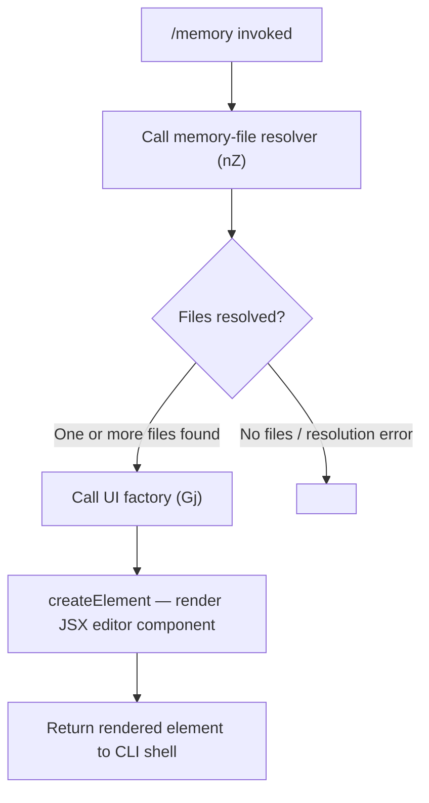

# `/memory`

> Analysis basis: CC v2.1.132 bundle.js (AST extraction + Claude interpretation)
> Minimum version: v2.1.132

---

## Overview

The `/memory` command opens an interactive editing interface for Claude Code's persistent memory files, allowing users to view and modify the content that Claude retains across sessions. It is implemented as a local JSX command, meaning the handler renders a React element directly into the CLI's terminal UI rather than sending a prompt to the agent. The command resolves available memory files via a dedicated file-resolution helper and then presents them through a JSX component for in-terminal editing.

---

## Registration

| Field | Value |
|---|---|
| type | `local-jsx` |
| name | `memory` |
| description | `Edit Claude memory files` |
| module_id | `MHq` |
| load_inline | `true` |
| handler | `U17` (async function; resolved via `module_id` path) |
| loc_byte | `10324720` |
| loc_byte_end | `10324842` |
| loc_line | `5744` |
| `arbor_handler.name` | `U17` |
| `arbor_handler.kind` | `AsyncFunction` |
| `arbor_handler.resolution_path` | `module_id` |
| `arbor_handler.fqn` | `claude-2.1.132::U17` |
| `arbor_handler.n_hits` | `0` |

The handler `U17` is an `AsyncFunction` resolved through the `module_id → MHq` path by the Arbor symbol graph. Because `load_inline: true` is set, the loader shape is `load: () => Promise.resolve({ call: U17 })` — no separate dynamic import is involved.

Analysis basis: CC v2.1.132 bundle.js:+10324720

---

## Input Branching

The `/memory` command takes no mandatory user-supplied arguments at invocation. The branching that occurs inside the handler concerns the availability and resolution of memory files rather than parsing user text input.



Analysis basis: CC v2.1.132 bundle.js:+10324525 (call to `nZ`), +10324536 (call to `Gj`), +10324541 (call to `BI.createElement`)

---

## Behavioral Spec

### Handler Entry Point

The command's main handler is the async function `U17` exported from module `MHq`. When the CLI shell dispatches `/memory`, it awaits `U17` and mounts the returned React element in the terminal renderer.

```
async function memoryCommandHandler(context):
    // Step 1: resolve the set of memory files available to this session
    memoryFiles = await resolveMemoryFiles(context)   // nZ

    // Step 2: obtain a configured UI descriptor for the editor
    editorProps = buildEditorProps(memoryFiles)        // Gj

    // Step 3: construct and return the JSX element for the CLI shell to mount
    element = createElement(MemoryEditorComponent, editorProps)
    return element
```

Analysis basis: CC v2.1.132 bundle.js:+10324525, +10324536, +10324541

### Memory File Resolution (`nZ`)

`nZ` is called first inside `U17`. Based on its position in the call graph and its role as a prerequisite to UI construction, it is responsible for locating the CLAUDE.md (or equivalent) memory files that are in scope for the current project — this may include project-level, global, and any imported memory files that Claude Code tracks.

```
function resolveMemoryFiles(context):
    // Enumerate candidate memory file paths (project, global, imported)
    candidates = enumerateMemoryFilePaths(context.cwd, context.globalConfigDir)
    // Filter to those that exist on disk and are readable
    existing = candidates.filter(path => fileExistsAndReadable(path))
    return existing
```

<!-- TODO: not found in depth-2 traversal; needs --depth 4 — internal branching of nZ (e.g. creation of missing files, path precedence rules) is not visible at depth ≤ 2. -->

Analysis basis: CC v2.1.132 bundle.js:+10324525

### UI Props Construction (`Gj`)

`Gj` is called after file resolution succeeds. It takes the resolved file list and produces the props object passed to the JSX editor component. The exact shape of these props (e.g., whether they include callbacks for save/discard) is not visible at traversal depth ≤ 2.

```
function buildEditorProps(memoryFiles):
    // Construct props that wire resolved files into the editor component
    props = {
        files: memoryFiles,
        // onSave / onDiscard callbacks: <!-- TODO: not found in depth-2 traversal; needs --depth 4 -->
    }
    return props
```

Analysis basis: CC v2.1.132 bundle.js:+10324536

### JSX Rendering (`BI.createElement`)

The final step uses React's `createElement` (namespaced under `BI` in the bundle) to instantiate the memory editor component with the props produced by `Gj`. The returned element is handed back to the CLI shell, which is responsible for mounting it in the terminal viewport.

```
function renderMemoryEditor(editorProps):
    return BI.createElement(MemoryEditorComponent, editorProps)
```

Analysis basis: CC v2.1.132 bundle.js:+10324541

---

## State & Side Effects

| Item | Detail |
|---|---|
| Telemetry | None detected at traversal depth ≤ 2 (telemetry array is empty) |
| Hook registration | <!-- TODO: not found in depth-2 traversal; needs --depth 4 --> |
| appState changes | <!-- TODO: not found in depth-2 traversal; needs --depth 4 --> |
| File writes | Likely triggered by user action inside the editor component (save), but the write path is not visible at depth ≤ 2 |
| Sound | None detected |
| Terminal rendering | Returns a JSX element (`local-jsx` type); the CLI shell mounts it in-place, replacing the prompt until the editor is dismissed |

---

## Version History

| Version | Change |
|---|---|
| v2.1.132 | Initial analysis — `local-jsx` handler `U17` in module `MHq`; calls `nZ` (file resolver) and `Gj` (UI props builder) before `BI.createElement` |

---

## Common Mistakes

1. **Expecting agent output**: Because the command type is `local-jsx` (not `prompt`), invoking `/memory` does not send any message to the Claude model. Users should not expect a conversational response; instead, an interactive editor UI appears directly in the terminal.
2. **Assuming arguments are supported**: No argument literals were found in the extraction. Passing sub-commands or file paths after `/memory` may be silently ignored or cause unexpected behavior — behavior with arguments is <!-- TODO: not found in depth-2 traversal; needs --depth 4 -->.
3. **Editing memory files externally while the editor is open**: Because the editor component reads file contents at mount time, concurrent external edits may be overwritten when the user saves from within the editor. Save or close external editors before invoking `/memory`.
4. **Confusing project-level and global memory**: The file resolver (`nZ`) appears to enumerate multiple scopes (project and global). Users editing the wrong scope may find their changes have no effect on the intended Claude context.

---

## Appendix — Identifier Mapping

> For bundle debugging only. Identifiers change across versions.

| Identifier | Role |
|---|---|
| `U17` | Main async handler for the `/memory` command; entry point resolved via `module_id → MHq` |
| `nZ` | Memory file resolver; enumerates and filters candidate CLAUDE.md / memory files before UI construction |
| `Gj` | UI props builder; constructs the props object passed to the JSX editor component (not listed in `identifiers` array but present in callGraph at +10324536) |
| `BI` | React (or React-compatible) namespace providing `createElement`; not listed in `identifiers` array but referenced at +10324541 |