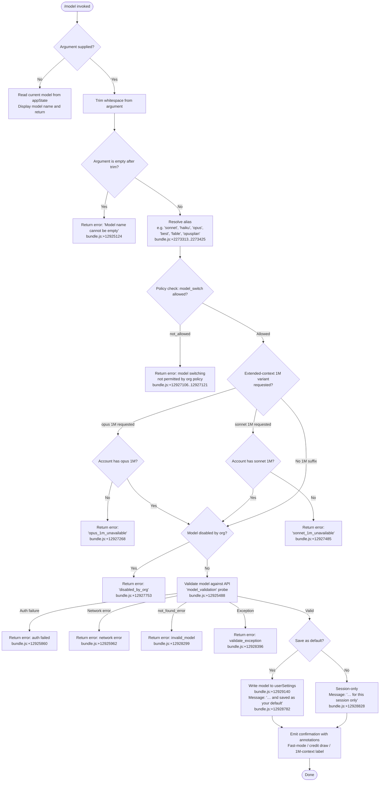

# `/model`

> Analysis basis: CC v2.1.175 bundle.js (AST extraction + Claude interpretation)
> Minimum version: v2.1.175

---

## Overview

The `/model` command allows the user to inspect or change the AI model used by Claude Code for the current session and/or as the persistent default. When invoked with a model name argument, it validates the requested model against available models, enforces policy restrictions, writes the selection to configuration, and reports the resulting model plus any context-window or credit annotations. When invoked without an argument it displays the currently active model.

---

## Registration

| Field | Value |
|---|---|
| type | `local` |
| name | `model` |
| description | `Set the AI model for Claude Code` |
| argumentHint | `<model>` |
| supportsNonInteractive | `true` |
| module_id | `FYK` |
| load_inline | `true` |
| loc_byte | `12996771` |
| loc_byte_end | `12996945` |
| loc_line | `9153` |
| arbor_handler.name | `ps7` |
| arbor_handler.fqn | `claude-2.1.175::ps7` |
| arbor_handler.kind | `AsyncFunction` |
| arbor_handler.resolution_path | `module_id` |
| arbor_handler.n_hits | `0` |

Analysis basis: CC v2.1.175 bundle.js:+12996771

---

## Input Branching

The handler exhibits five or more distinct execution paths depending on: whether a model argument was supplied, whether the argument is a well-known alias, whether the model passes policy/availability checks, and whether the model is valid against the live API. A Mermaid flowchart is used.



Analysis basis: CC v2.1.175 bundle.js:+12965823 (handler entry), +12965862 (appState read), +12927106 (policy check), +12927268 (1M availability checks), +12925488 (validation probe)

---

## Behavioral Spec

### 1. Entry Point — Handler `ps7`

```
async function handleModelCommand(args, context):
    rawInput = args.trim()                          // bundle.js:+12965823

    if rawInput is empty:
        display current model from appState         // bundle.js:+12965862
        return

    resolvedModel = resolveModelAlias(rawInput)     // calls aliasResolver (J1)

    if modelSwitchPolicy == "not_allowed":          // bundle.js:+12927121
        return error("model switching not allowed by policy")

    check1MAvailability(resolvedModel)              // may return 1M-unavailable errors

    if modelDisabledByOrg(resolvedModel):           // bundle.js:+12927753
        return error("disabled_by_org")

    validationResult = validateModelWithAPI(resolvedModel)  // bundle.js:+12925488

    if validationResult.ok:
        applyModelSelection(resolvedModel, context) // calls modelApplier (RwA)
    else:
        return error based on validationResult kind
```

Analysis basis: CC v2.1.175 bundle.js:+12965823

---

### 2. Alias Resolution — `aliasResolver` (J1)

Short-form aliases map to canonical model identifiers. Known aliases found in literals:

| Alias | Resolved canonical (display name) |
|---|---|
| `sonnet` | claude-sonnet-4-6 ("Sonnet 4.6") — bundle.js:+2273313 |
| `haiku` | claude-haiku-4-5 ("Haiku 4.5") — bundle.js:+2273352 |
| `opus` | claude-opus-4-x ("Opus 4") — bundle.js:+2273391 |
| `best` | highest-tier available — bundle.js:+2273425 |
| `fable` | claude-fable-5 ("Fable 5") — bundle.js:+2273209 |
| `opusplan` | Opus in plan mode, else Sonnet — bundle.js:+2271666 |
| `sonnet[1m]` | claude-sonnet-4-6 with 1M context — bundle.js:+12929667 |
| `sonnet-4-6[1m]` | explicit sonnet 4.6 with 1M context — bundle.js:+12929693 |
| `[1m]` | any model with 1M context window suffix — bundle.js:+2273257 |

Additional canonical model strings found in the model registry (bundle.js:+2269885–2270886):

- `claude-fable-5`, `claude-mythos-5`
- `claude-opus-4-8`, `claude-opus-4-7`, `claude-opus-4-6`, `claude-opus-4-5`, `claude-opus-4-1`, `claude-opus-4-0`
- `claude-sonnet-4-6`, `claude-sonnet-4-5`, `claude-sonnet-4-0`
- `claude-haiku-4-5`
- `claude-3-7-sonnet`, `claude-3-5-sonnet`, `claude-3-5-haiku`
- `claude-3-opus`, `claude-3-sonnet`, `claude-3-haiku`

Alias resolution normalises input with `.trim()` and `.toLowerCase()` before matching.
Analysis basis: CC v2.1.175 bundle.js:+2273132 (trim), +2273143 (toLowerCase)

---

### 3. Policy and Availability Checks — `policyChecker` (CF8)

```
function policyChecker(resolvedModel, appState):

    // 1. Org-level model-switching policy
    if appState.policySettings.model_switch == "not_allowed":   // +12927106
        return { allowed: false, reason: "not_allowed" }

    // 2. 1M context availability
    if resolvedModel includes opus 1M variant:
        if account lacks opus 1M entitlement:                   // +12927268
            return { allowed: false, reason: "opus_1m_unavailable" }

    if resolvedModel includes sonnet 1M variant:
        if account lacks sonnet 1M entitlement:                 // +12927485
            return { allowed: false, reason: "sonnet_1m_unavailable" }

    // 3. Org-disabled models
    if orgPolicy.disabledModels.includes(resolvedModel):        // +12927753
        return { allowed: false, reason: "disabled_by_org" }

    // 4. Fable probe
    if resolvedModel is fable variant:
        probe result may be "fable_unavailable" or              // +12928004
        "fable_probe_failed"                                    // +12928024

    return { allowed: true }
```

Analysis basis: CC v2.1.175 bundle.js:+12927090 (policyChecker entry `oK`), +12927106

---

### 4. API Validation — `modelValidator` (Gp6)

```
async function modelValidator(resolvedModel, context):
    if resolvedModel is empty:                                  // +12925124
        throw "Model name cannot be empty"

    knownModels = fetchKnownModels()                            // oK / model list
    if resolvedModel in knownModels and not startsWith "claude-":
        // skip live probe for well-known builtins
        return { valid: true }

    // Live probe: send minimal "model_validation" request      // +12925488
    probe = {
        model: resolvedModel,
        role: "user",
        content: "Hi",                                          // +12925557
        cacheControl: "ephemeral"                               // +12925582
    }

    try:
        response = await apiCall(probe)
        return { valid: true }
    catch AuthError:                                            // HTTP 401/403
        return { valid: false, reason: "auth_failed",
                 message: "Authentication failed. Please check your API credentials." }
                                                               // +12925860
    catch NetworkError:
        return { valid: false, reason: "network_error",
                 message: "Network error. Please check your internet connection." }
                                                               // +12925962
    catch NotFoundError where error.type == "not_found_error": // +12926081
        // response body mentions "model:"                      // +12926163
        return { valid: false, reason: "invalid_model" }       // +12928299
    catch other Exception:
        return { valid: false, reason: "validate_exception" }  // +12928396
```

Analysis basis: CC v2.1.175 bundle.js:+12925087 (Gp6 entry), +12925488 (validation probe)

---

### 5. Model Application and Confirmation — `modelApplier` (RwA)

```
function modelApplier(resolvedModel, saveAsDefault, context):
    // Determine persistence scope
    if saveAsDefault:                                           // +12929140
        writeUserSettings({ model: resolvedModel })            // +12929187
        scope = " and saved as your default for new sessions"  // +12928782
    else:
        scope = " for this session only"                       // +12928828

    // Build annotation string
    annotations = []
    if isFastModeModel(resolvedModel):
        annotations.append(" · Fast mode ON")                  // +12928946
    if drawsFromUsageCredits(resolvedModel):
        annotations.append(" · Draws from usage credits")      // +12928997
    if isSlowModel(resolvedModel):
        annotations.append(" · Fast mode OFF")                 // +12929043
    if has1MContext(resolvedModel):
        annotations.append(" (1M context)")                    // +2272307

    // Display result
    boldName = bold(displayName(resolvedModel))
    print(boldName + scope + annotations.join(""))

    // Managed settings notice if applicable
    if context.hasManagedSettings:                             // +12929349
        print("Managed settings" notice)
```

Analysis basis: CC v2.1.175 bundle.js:+12928581 (RwA entry), +12929140

---

### 6. Model Bootstrap — `bootstrapFetch` (K87)

On startup (not directly triggered by `/model` but reachable via `gA6`), Claude Code may fetch the live model list from `GET /v1/models` when `CLAUDE_CODE_ENABLE_GATEWAY_MODEL_DISCOVERY` is set. The bootstrap is skipped in several conditions:

- Gateway discovery env-var not set — "Skipped gateway /v1/models" (bundle.js:+8347557)
- Non-essential traffic disabled — "Skipped: Nonessential traffic disabled" (bundle.js:+8347712)
- Third-party provider in use — "Skipped: 3P provider" (bundle.js:+8347803)
- No usable OAuth, WIF, or API key available (bundle.js:+8348743)

Request timeout: **5000 ms** (bundle.js:+8348066).
Hash algorithm: **SHA-256**, truncated to **12 hex characters** for cache keying (bundle.js:+2523444, +2523471, +2523486).

---

### 7. Inline Non-Interactive Invocation

When the command is invoked non-interactively (e.g. from a script with `--model` flag), the handler records a telemetry event `tengu_model_command_inline` and short-circuits the interactive confirmation flow. Analysis basis: CC v2.1.175 bundle.js:+12965981.

---

### 8. Tier-Pinning Logic (within model resolution)

The model registry includes internal policy logic for tier defaults:

- **"tier default is the admin-mapped value"** — when no user steering is detected, the tier default is used as-is, then policy mapping re-applies at exit (bundle.js:+2265502).
- **"user steering detected"** — when the user explicitly names a model, the env-free tier builtin is pinned and policy-mapped if applicable (bundle.js:+2265624).
- **"keeping the tier default"** — fallback when neither condition applies (bundle.js:+2265720).

Analysis basis: CC v2.1.175 bundle.js:+2265502

---

## State & Side Effects

| Item | Detail |
|---|---|
| Telemetry: `tengu_model_command_inline` | Fired when `/model` is used in non-interactive mode (bundle.js:+12965981) |
| Telemetry: `tengu_feature_ok` | Fired on successful feature check (bundle.js:+1017151) |
| Telemetry: `tengu_feature_bad` | Fired on failed feature check (bundle.js:+1017218) |
| Telemetry: `tengu_api_success` | Fired after a successful API call during model validation (bundle.js:+13791358) |
| Telemetry: `tengu_lone_surrogate_sanitized` | Fired if response content contains lone surrogates that must be sanitised (bundle.js:+13791107) |
| Telemetry: `tengu_config_auth_loss_prevented` | Fired when a config write is aborted to prevent auth loss (bundle.js:+3325310) |
| appState changes | `model` field in appState updated to new canonical model string |
| userSettings persistence | When saving as default: writes `model` key to `~/.claude/settings.json` (bundle.js:+1298382, +1298392) |
| Session-only setting | When not saving as default: model change applies only for current session |
| Bootstrap cache | Model list fetched from `/v1/models` may be written to disk cache; write is skipped when cache is unchanged ("Cache unchanged, skipping write" bundle.js:+8349551) |
| Auth-loss guard | Config write is refused if re-read config is missing auth present in cache (bundle.js:+3325182) — see GH #3117 |
| Sound | None observed |

---

## Version History

| Version | Change |
|---|---|
| v2.1.175 | Initial analysis |

---

## Common Mistakes

1. **Omitting the model name** — `/model` without an argument displays the current model; to change it you must supply the model name or alias (e.g. `/model sonnet`).
2. **Using an unrecognised alias** — Only the aliases in the table above (`sonnet`, `haiku`, `opus`, `best`, `fable`, `opusplan`) are built-in shorthands. Typos cause a live API probe that will fail with `invalid_model`.
3. **Expecting 1M context on all accounts** — The `[1m]` suffix variants (`sonnet[1m]`, `opus` with 1M) require a specific account entitlement; requests fail with `opus_1m_unavailable` / `sonnet_1m_unavailable` on ineligible accounts (bundle.js:+12927268, +12927485).
4. **Assuming session changes are permanent** — Unless the command explicitly saves the model as the default, the change lasts only for the current session.
5. **Model switching blocked by org policy** — In managed deployments the `model_switch: not_allowed` policy silently forbids any change; users see a policy error rather than a validation error (bundle.js:+12927106).
6. **Using third-party provider model IDs** — When Claude Code is configured for Bedrock (`bedrock`/`anthropicAws` bundle.js:+2112603, +2112709) or Vertex (`vertex` bundle.js:+2112811), gateway discovery is skipped and model IDs must match the provider's namespace.

---

## Appendix — Identifier Mapping

> For bundle debugging only. Identifiers change across versions.

| Identifier | Role |
|---|---|
| `ps7` | Main async handler for `/model` command (Arbor handler) |
| `bF8` | Model application helper — applies resolved model to state |
| `Tk` | Model options builder — constructs model selection structure |
| `cj6` | Model list / available-models retriever |
| `G3` | Model entry formatter |
| `J1` | Alias resolver — maps short names to canonical model IDs |
| `OT` | Model availability checker |
| `BD_` | Model status classifier (active/inactive/refused/mantle) |
| `H98` | Full model resolution pipeline — resolves aliases, applies tier policy |
| `d` | Utility / logger dependency |
| `T3` | Hash utility — SHA-256 model ID fingerprinting |
| `MV` | Hash helper wrapper |
| `d56` | Low-level digest primitive |
| `awK` | Model selection orchestrator — coordinates policy check + apply |
| `CF8` | Policy and model-switch enforcement module |
| `oK` | Model list builder / known-models lookup |
| `WY6` | Settings reader (pair: init + normalise) |
| `GY6` | Model registry loader |
| `q` | Data accessor utility |
| `_f` | String formatter / template helper |
| `$` | Highlight / chalk wrapper |
| `K` | Column formatter (padEnd for display) |
| `NhH` | Model feature-flag checker |
| `UI` | Model type classifier |
| `zN1` | Model name normaliser |
| `ON1` | Object-entries iterator helper |
| `I8` | Settings node accessor |
| `qnH` | Provider-entries iterator |
| `L` | Stream/connection closer |
| `$N1` | Model index lookup |
| `QD4` | Display-name builder |
| `Fj6` | Model ID canonicaliser (toLowerCase pipeline) |
| `dD4` | Model prefix validator (startsWith checks) |
| `CH` | Feature-flag evaluator |
| `A6` | Feature-flag reader (secondary) |
| `ia7` | First-party model check (includes check + lowercase) |
| `Ps` | Provider config reader (first-party path) |
| `PJ` | Provider info resolver |
| `ra7` | Alternative model check (includes check + lowercase) |
| `rLH` | Provider config reader (alternative path) |
| `HjH` | Full model metadata builder |
| `n_` | Provider type extractor |
| `jL` | Model capability resolver |
| `Sz` | Model string normaliser (lowercase, includes, replace) |
| `_jH` | Array-shape validator |
| `q1` | Model capability flag setter |
| `I_H` | Model metadata combiner |
| `Z_H` | 1M context suffix detector (endsWith) |
| `e18` | Model entry constructor |
| `RnH` | Model capability aggregator |
| `Gp6` | API model validator (live probe) |
| `A` | String lower-case utility |
| `up` | Side-query API request executor |
| `la7` | Confirmation message builder |
| `owK` | Model display-name formatter (toLowerCase) |
| `gA6` | Bootstrap / model-list fetch orchestrator |
| `K87` | Bootstrap fetch executor (GET /v1/models) |
| `kH` | Feature-flag store accessor |
| `C6` | Cache entry constructor |
| `Ywq` | Cache validity checker |
| `N` | Logger / debug emitter |
| `X8` | Config persistence helper |
| `vz` | Version comparator |
| `SH` | Global config writer |
| `TH` | String coercion utility |
| `RwA` | Model applier — writes selection, builds confirmation output |
| `cfH` | Config field accessor |
| `Tp6` | Default-save path handler |
| `wA` | Settings file writer |
| `zf` | Model tier resolver |
| `K6` | String conversion primitive |
| `sDH` | Session-scope annotation builder |
| `W3` | Model inclusion validator |
| `rTH` | Fast-mode / credit annotation builder |
| `NA` | Error constructor / classifier |
| `jO` | Model type + OT combiner |
| `Rz` | ILH-based error wrapper |
| `CwA` | Managed-settings notice renderer |
| `xNH` | Settings overlay resolver |
| `eu` | Path joiner (`.claude/` prefix) |
| `Pl` | Model confirmation display renderer |