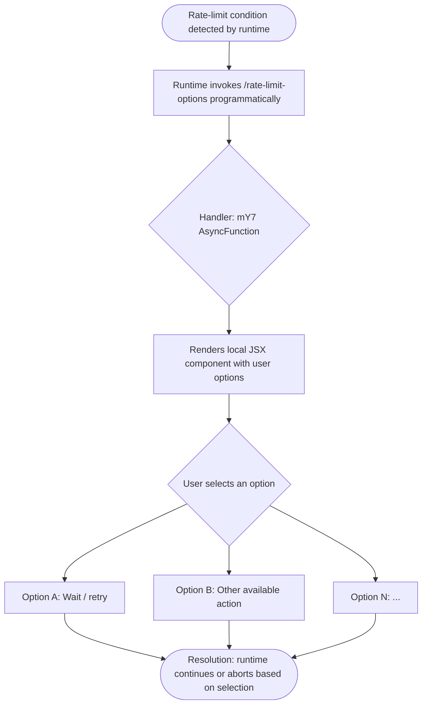

# `/rate-limit-options`

> Analysis basis: CC v2.1.132 bundle.js (AST extraction + Claude interpretation)
> Minimum version: v2.1.132

---

## Overview

`/rate-limit-options` is a hidden, locally-rendered (JSX) slash command that surfaces user-facing choices when Claude Code encounters an API rate limit. It renders UI options rather than dispatching a text prompt, allowing the user to decide how to proceed (e.g., wait, switch API keys, or cancel) without injecting agent-visible text into the conversation.

---

## Registration

| Field | Value |
|---|---|
| type | `local-jsx` |
| name | `rate-limit-options` |
| description | `Show options when rate limit is reached` |
| isHidden | `true` |
| module_id | `sOq` |
| load_inline | `true` |
| handler | `mY7` (AsyncFunction, resolved via `module_id` path) |
| loc_byte span | `11362801` – `11362985` |
| loc_line | `7115` |
| `loc_byte_end` | `11362985` |
| `arbor_handler.name` | `mY7` |
| `arbor_handler.kind` | `AsyncFunction` |
| `arbor_handler.resolution_path` | `module_id` |
| `arbor_handler.fqn` | `claude-2.1.132::mY7` |
| `arbor_handler.n_hits` | `0` |

Analysis basis: CC v2.1.132 bundle.js:+11362801

**Notes on registration shape:**

- `type: "local-jsx"` means the command's output is rendered as a React/JSX component directly in the terminal UI, not as plain text or a prompt sent to the model.
- `isHidden: true` means this command does not appear in `/help` listings or autocomplete; it is invoked programmatically by the runtime when a rate-limit condition is detected, not by the user typing it.
- `load_inline: true` means the handler is inlined via a `load: () => Promise.resolve({ call: mY7 })` shape rather than a separately exported module entry. The Arbor symbol graph resolved the handler to `mY7` via the `module_id` path (`sOq`).

---

## Input Branching

Because `callGraph` is empty at depth ≤ 2 and `literals` contains no constants, the internal branching logic of `mY7` cannot be reconstructed from the available extraction data. The command is triggered by the runtime's rate-limit detection path rather than by direct user input parsing.



> **Note:** The specific options rendered inside the JSX component (e.g., wait durations, key-switching, cancel) cannot be enumerated from the depth-2 traversal. The flowchart above reflects the structural role of the command. See TODO below.

<!-- TODO: internal JSX branch options not found in depth-2 traversal; needs --depth 4 -->

---

## Behavioral Spec

### Rate-Limit Options Handler

The handler is an `AsyncFunction` (`mY7`) loaded inline from module `sOq`.

```
async function rateLimitOptionsHandler(context):
    # Called programmatically by the runtime when a rate-limit is detected.
    # Not triggered by manual user input.

    uiComponent = buildRateLimitOptionsJSX(context)
    # Renders a JSX component presenting the user with available actions.
    # The component is "local" — it does not send any text to the model.

    userSelection = await presentComponent(uiComponent)
    # Awaits the user's choice within the rendered UI.

    return userSelection
    # The runtime acts on the returned selection (e.g., retry, abort, switch key).
```

Analysis basis: CC v2.1.132 bundle.js:+11362801

**Key behavioral properties:**

1. **Hidden command** — not accessible via the standard slash-command menu; invoked only by the internal rate-limit handling path.
2. **No model interaction** — because `type` is `local-jsx`, no prompt text is forwarded to the Claude API. The command is entirely client-side.
3. **Async** — the handler is declared `async`, confirming it suspends while awaiting a user selection before returning control to the calling runtime path.
4. **No telemetry events** — no `tengu_*` events were found in the implementation at depth ≤ 2. Either telemetry is absent for this command or is emitted deeper in the call tree.

<!-- TODO: full JSX render logic and option enumeration not found in depth-2 traversal; needs --depth 4 -->

---

## State & Side Effects

| Item | Detail |
|---|---|
| Telemetry | None found at depth ≤ 2 traversal |
| Hook registration | Not detected at depth ≤ 2 |
| appState changes | Not detected at depth ≤ 2; likely managed by the calling rate-limit runtime path based on user selection |
| Sound | Not detected |
| Model prompt injection | None — `local-jsx` type; no text is sent to the API |
| Visibility | Hidden from user-facing menus (`isHidden: true`) |

---

## Version History

| Version | Change |
|---|---|
| v2.1.132 | Initial analysis — command registered as `local-jsx`, handler `mY7`, module `sOq`, hidden, load-inline shape |

---

## Common Mistakes

1. **Attempting to invoke manually** — because `isHidden: true`, this command does not appear in autocomplete or `/help`. Typing `/rate-limit-options` directly may have no effect or behave unexpectedly; it is designed for programmatic invocation only.
2. **Expecting a model response** — the `local-jsx` type means no prompt is sent to Claude. Tooling that monitors the API conversation thread will not see any message from this command.
3. **Assuming synchronous execution** — the handler is `async` and suspends on user input; callers in the runtime must `await` its resolution before acting on the selected option.
4. **Looking for telemetry in shallow traces** — no telemetry events are emitted at depth ≤ 2. Any analytics for rate-limit handling are likely fired by the parent runtime path or at greater call depth.

---

## Appendix — Identifier Mapping

> For bundle debugging only. Identifiers change across versions.

| Identifier | Role |
|---|---|
| `mY7` | Rate-limit options command handler (AsyncFunction); entry point resolved from module `sOq` via `module_id` path by Arbor symbol graph |

---

*Note: index built via Arbor fallback; some signals (telemetry, literals) may be missing — see arbor-fallback.js.*