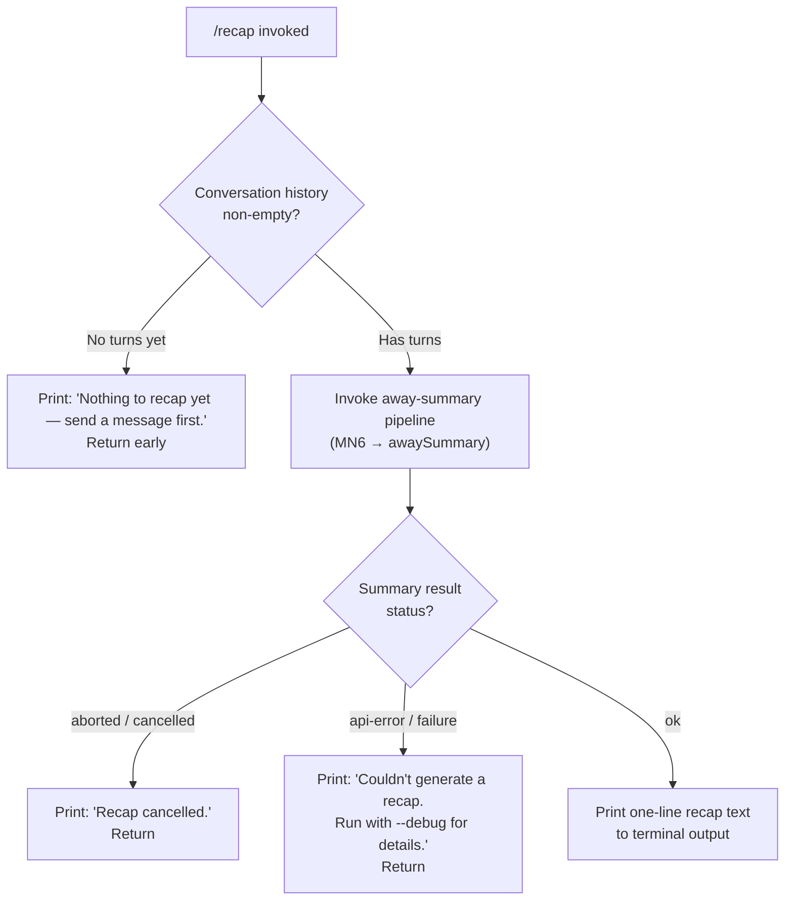

# `/recap`

> Analysis basis: CC v2.1.175 bundle.js (AST extraction + Claude interpretation)
> Minimum version: v2.1.175

---

## Overview

The `/recap` command triggers an on-demand, one-line summary of the current session's conversation history. It is implemented as an async handler (`p85`) that invokes the same "away summary" pipeline used for background session summarisation, running it synchronously from the user's explicit request and printing the resulting single-sentence recap to the terminal.

---

## Registration

| Field | Value |
|---|---|
| type | `local` |
| name | `recap` |
| description | `Generate a one-line session recap now` |
| loc_byte | `13277694` |
| loc_byte_end | `13277910` |
| loc_line | `9688` |
| supportsNonInteractive | `false` |
| thinClientDispatch | `post-text` |
| load_inline | `true` |
| load_ident | `p85` |
| arbor_handler.name | `p85` |
| arbor_handler.fqn | `claude-2.1.175::p85` |
| arbor_handler.kind | `AsyncFunction` |
| arbor_handler.resolution_path | `load_ident` |
| arbor_handler.n_hits | `0` |

Analysis basis: CC v2.1.175 bundle.js:+13277694

---

## Input Branching

The handler has four distinct outcome branches depending on session state and the result of the underlying summary call. A Mermaid flowchart is used below.



Analysis basis: CC v2.1.175 bundle.js:+13277444, +13277536, +13277594, +13277302

---

## Behavioral Spec

### Top-level handler (`p85`)

```
async function recapCommandHandler(context):
    turns = getCurrentConversationTurns(context)

    if turns is empty:
        printToTerminal("Nothing to recap yet — send a message first.")
        return

    result = await invokeAwaySummaryPipeline(context)

    if result.status == "aborted":
        printToTerminal("Recap cancelled.")
        return

    if result.status in ["api-error", "failed"]:
        printToTerminal("Couldn't generate a recap. Run with --debug for details.")
        return

    // result.status == "ok"
    printToTerminal(result.summaryLine)
```

Analysis basis: CC v2.1.175 bundle.js:+13277302, +13277444, +13277536, +13277594

---

### Away-summary pipeline invocation (`MN6`)

The handler delegates to the away-summary subsystem (`MN6`), which is the same pipeline used when the session is backgrounded. Key behaviours observed in the call graph:

```
async function invokeAwaySummaryPipeline(context):
    params = getCacheSafeParams(context)

    if params is null:
        log("[awaySummary] no CacheSafeParams saved, skipping")
        return { status: "no-turn" }

    abortController = new AbortController()
    context.signal.addEventListener("abort", () => abortController.abort("abort"))

    // Tool use is explicitly denied for the away-summary call
    // (tools are not available to this sub-invocation)
    summaryResult = await runSummaryQuery(params, {
        toolPolicy: "deny",
        label: "Away summary cannot use tools",
        abortSignal: abortController.signal
    })

    return classifyResult(summaryResult)
        // Possible: "aborted", "api-error", "ok", "no-turn"
```

Analysis basis: CC v2.1.175 bundle.js:+6963539, +6963560, +6963618, +6963674, +6963851, +6963866, +6963934, +6964078, +6964167, +6964228

---

### Session turn check (`N`)

Before queuing the model call, the pipeline checks whether any conversation turns exist. The check uses a string representation of current state, normalised to uppercase for comparison, then trims whitespace before passing it downstream.

```
function checkAndFormatTurnContext(turnData, options):
    if turnData includes "debug" mode flag:
        enableDebugLogging()

    formattedKey = turnData.toUpperCase()
    normalized  = applyTokenReplacement(formattedKey)   // covers [REDACTED] tokens
    trimmed     = normalized.trim()

    writeToTranscriptStream(trimmed)       // via mgH → LIA → H.write
    scheduleFileFlush(trimmed)             // via G9f persistence path
    registerHookListener(trimmed)          // via u9 → pvA.register
```

Analysis basis: CC v2.1.175 bundle.js:+210927, +210951, +210969, +210991, +211053, +211073, +211076, +211092, +211098, +211112

---

### Transcript persistence path (`G9f`)

The summary text is persisted to the session transcript file before the result is returned to the user. The persistence subsystem:

1. Resolves the transcript directory and file path (`L4H`, `EIA`).
2. Checks whether an existing file ends with `.txt`; if so, strips the last 4 characters before constructing the rotated name (`je8`, literal `".txt"` at +209868, strip-length `4` at +209890).
3. Measures `Buffer.byteLength` of the content to decide whether rotation is needed.
4. Appends the new content via `Uk.appendFile` (`W9f`).
5. On size overflow, rotates the file via `Uk.rename` / `Uk.unlink`.

```
async function persistToTranscript(content, transcriptDir):
    filePath = joinPath(transcriptDir, buildFileName())

    byteSize = Buffer.byteLength(content)

    if fileExists(filePath):
        stat = await fs.stat(filePath)
        if stat.size + byteSize > rotationThreshold:
            await rotatefile(filePath)        // rename then unlink old

    await fs.mkdir(transcriptDir, { recursive: true })
    await fs.appendFile(filePath, content)
    scheduleSymlinkUpdate(filePath)           // via EIA / h6
```

Analysis basis: CC v2.1.175 bundle.js:+210124, +210138, +210193, +210252, +209764, +209857, +209868, +209879, +209890, +209920, +210345, +210378, +210647

---

### Token / path normalisation (`nf`)

A helper normalises content strings prior to writing. It replaces known placeholder tokens (literal `"[REDACTED]"` at +202404), trims the last element via `Array.at`, resolves the final path component with `lastIndexOf`, and slices the result.

```
function normalizeContentString(raw, pathParts):
    mapped      = mapTokens(pathParts)          // WIA: w9f.map
    replaced    = raw.replace("[REDACTED]", …)  // H.replace at +202352
    lastPart    = replaced.at(-1)               // q.at at +202462
    splitIdx    = lastPart.lastIndexOf(…)       // A.lastIndexOf at +202488
    return lastPart.slice(splitIdx)             // A.slice at +202514
```

Analysis basis: CC v2.1.175 bundle.js:+202325, +202352, +202404, +202462, +202488, +202514

---

### Main query engine (`CE7`)

`CE7` is the core agentic query loop reached through `jU` from `kT`. For `/recap` it is invoked in a constrained mode:

- Thread label is set to `"repl_main_thread"` or `"subagent"` depending on caller context (literals at +10664564, +10664655).
- Tools are blocked (`"deny"` policy): the tool-use check path gates on `"Away summary cannot use tools"`.
- A single `Y.callModel` call is made; no multi-turn looping is expected because the task is a one-shot summarisation.
- The autocompact path (`query_autocompact_start` / `query_autocompact_end`) may trigger if the conversation context is large enough to require compaction before the recap can be generated.
- Telemetry events fire throughout (see State & Side Effects).

Analysis basis: CC v2.1.175 bundle.js:+10663326, +10664564, +10664655, +10665528, +10665844, +10669788, +6963851

---

### Fork-agent sub-path (`kT` / `oE7`)

`kT` is the fork-agent query coordinator, reachable when the away-summary pipeline chooses to run in an isolated agent context. It:

1. Stamps `Date.now()` at entry (+10720092).
2. Selects thread label `"main"` (+10720404).
3. Calls into `GR8` for app-state management (reads `getAppState`, writes `setAppState`, runs `Object.assign` to merge state).
4. Runs the main query loop (`CE7`) via `jU`.
5. On completion maps results with `Y.map`, separating them by `", "` (literal at +10721478).
6. Emits `tengu_forked_agent_default_turns_exceeded` if the agent exhausted allowed turns (+10721678).

Analysis basis: CC v2.1.175 bundle.js:+10720092, +10720404, +10721098, +10721454, +10721478, +10721678

---

## State & Side Effects

| Item | Detail |
|---|---|
| Telemetry — query lifecycle | `tengu_query_error`, `tengu_fork_agent_query`, `tengu_forked_agent_default_turns_exceeded` |
| Telemetry — autocompact | `tengu_auto_compact_rapid_refill_breaker`, `tengu_auto_compact_succeeded`, `tengu_post_autocompact_turn` |
| Telemetry — refusal/fallback | `tengu_ptl_surfaced_to_user`, `tengu_refusal_fallback_suppressed`, `tengu_refusal_fallback_triggered`, `tengu_refusal_fallback_dialog_suppressed`, `tengu_refusal_fallback_prompt_shown`, `tengu_refusal_fallback_prompt_choice`, `tengu_fallback_credit_forfeited`, `tengu_refusal_fallback_supersedes`, `tengu_model_fallback_triggered` |
| Telemetry — model behaviour | `tengu_rotunda_pennant_applied`, `tengu_rotunda_pennant_tools`, `tengu_model_response_keyword_detected`, `tengu_malformed_tool_use_retry_outcome`, `tengu_malformed_tool_use_response` |
| Telemetry — hooks | `tengu_stop_hook_block_count`, `tengu_loop_dynamic_wakeup_ends_turn`, `tengu_mcp_tools_refreshed_mid_turn` |
| Telemetry — attachments | `tengu_query_before_attachments`, `tengu_query_after_attachments` |
| Telemetry — feature flags | `tengu_feature_ok`, `tengu_feature_bad` |
| Telemetry — convolute/arcades | `tengu_convolute_arcades_retry`, `tengu_convolute_arcades_retry_outcome` |
| Telemetry — orphans | `tengu_orphaned_messages_tombstoned` |
| Transcript file | Content is appended to the session transcript via `fs.appendFile`; file is rotated when size threshold is exceeded. |
| Hook registration | `u9` → `pvA.register` registers a listener against the summary pipeline result. |
| appState changes | `GR8` reads and writes `appState` (via `H.getAppState` / `H.setAppState`) during fork-agent execution. `Object.assign` is used to merge partial state updates. |
| AbortController | A new `AbortController` is created per recap invocation; its `abort()` is wired to the parent signal's `"abort"` event. |
| Sound | <!-- TODO: not found in depth-2 traversal; needs --depth 4 --> |
| Non-interactive support | `supportsNonInteractive: false` — the command cannot be used in non-interactive (pipe/script) mode. |
| thinClientDispatch | `post-text` — the result is dispatched as plain text in thin-client mode. |

---

## Version History

| Version | Change |
|---|---|
| v2.1.175 | Initial analysis |

---

## Common Mistakes

1. **Running `/recap` before any messages have been sent.** The handler short-circuits immediately with "Nothing to recap yet — send a message first." There is no way to override this guard; at least one conversation turn must exist.
2. **Expecting a rich, multi-sentence summary.** The command is explicitly scoped to generate a *one-line* recap. The underlying away-summary pipeline is constrained to produce a single sentence; users wanting longer summaries should use a different workflow.
3. **Using `/recap` in non-interactive scripts.** `supportsNonInteractive` is `false`; the command will be rejected or unavailable when Claude Code is driven programmatically via stdin pipes or `--print` mode.
4. **Assuming tool use is available during recap generation.** The away-summary invocation explicitly sets tool policy to `"deny"`. Any attempt to rely on tool results from the current session being re-executed during recap generation will not occur.
5. **Interpreting "Recap cancelled" as an error.** This message appears when the user (or parent signal) aborts the underlying query — it is a normal cancellation path, not a bug.
6. **Expecting the recap to reflect in-flight, uncommitted changes.** The recap is based on the persisted conversation state; messages that have not yet been written to the transcript may not be included.

---

## Appendix — Identifier Mapping

> For bundle debugging only. Identifiers change across versions.

| Identifier | Role |
|---|---|
| `p85` | Top-level `/recap` async command handler (Arbor-resolved entry point) |
| `MN6` | Away-summary pipeline coordinator |
| `h9H` | Away-summary internal helper (called from `MN6`) |
| `N` | Turn-context formatter and state-check helper |
| `J9f` | Sub-helper called from turn formatter |
| `BvA` | Nested helper within `J9f` |
| `H` | Context / state carrier object (multi-purpose, context-dependent) |
| `RH` | JSON serialisation helper (`JSON.stringify` wrapper) |
| `_` | Generic utility / string transformation helper |
| `nf` | Content string normaliser (token replacement, path slicing) |
| `WIA` | Token mapping helper (`w9f.map` wrapper) |
| `q` | Data/path array helper |
| `A` | Path string / lowercase helper |
| `mgH` | Transcript write scheduler |
| `LIA` | Low-level transcript stream writer (`H.write` wrapper) |
| `G9f` | Transcript persistence orchestrator (mkdir / appendFile / rotate) |
| `$gH` | Timer-aware flush / batch helper (`clearTimeout`, `setTimeout`, `setImmediate`) |
| `L4H` | Transcript file path builder |
| `o6` | Directory resolver helper |
| `l36` | Error classifier (handles `"EISDIR"`) |
| `EIA` | Symlink / secondary-path updater (`path.join` + `h6`) |
| `je8` | File rotation helper (`stat`, `rename`, `unlink`) |
| `W9f` | Append-file writer with rotation logic |
| `u9` | Hook registration helper (`pvA.register`) |
| `kT` | Fork-agent query coordinator (`Date.now`, `GR8`, `jU`) |
| `GR8` | App-state read/write manager (`getAppState`, `setAppState`, `Object.assign`) |
| `_x` | Internal state accessor helper |
| `$MH` | State load/dump helper |
| `lPH` | App-state merge helper |
| `sQ9` | App-state validation helper |
| `M` | Core state-map accessor (DCH, ki8, f.get, f.values) |
| `Tx8` | State transition helper |
| `zR` | Randomised identifier generator (`TvA.test`, `randomBytes`) |
| `TR8` | Thread/turn routing helper |
| `fKH` | Filter/pipeline setup helper |
| `z4` | Hook-chain initialiser |
| `zpH` | Message filter (`H.filter`, `vQ8`, `mQ8`, `d15`) |
| `jU` | Query dispatcher (routes to `CE7` / `hb8` / `kH` / `CH`) |
| `CE7` | Core agentic query loop (main model call, tool execution, compaction) |
| `hb8` | Subagent registry helper (`VU.get`, `VU.delete`, `zKA.delete`) |
| `kH` | Feature-flag "ok" branch evaluator |
| `CH` | Feature-flag "bad" branch evaluator |
| `XE` | Execution-context helper |
| `tb6` | In-progress tool-use set checker (`rE7.has`) |
| `pHH` | Post-turn processing helper |
| `Vx8` | Turn completion helper |
| `aQq` | Tool-use check helper (calls `tb6`) |
| `Y` | Session / push helper (also `process.exit`, `z.abort` wrappers) |
| `KX` | Forced-shutdown helper |
| `z` | Daemon/session control object (`kH`, `CH`, `ZS`, `aU`) |
| `_3H` | Hook filter helper (`FJ`, `qbL`, `H.filter`, `f.has`) |
| `FJ` | Hook-find helper |
| `qbL` | Hook-entry finder (`H.find`) |
| `f` | Promise-tracking set (`q.add`, `L.finally`, `q.delete`) |
| `d` | Core logging / diagnostics helper |
| `oE7` | Fork-agent result formatter (uses `d`, `A6`) |
| `A6` | Low-level output helper (`d56`) |
| `u8` | IPC / subprocess communication helper (`Ok.randomUUID`, `X`) |
| `P` | IPC transport (Buffer concat, `j.off`, `b7`, `YV5`) |
| `X` | IPC channel / multiplexer (`M`, `q.setTimeout`) |
| `j` | Process manager (`A.values`, `S.kill`) |
| `b7` | IPC write helper (`H.end`, `RH`) |
| `YV5` | Full IPC session handler (PTY control, resize, attach, snapshot, etc.) |
| `TH` | String-conversion helper for IPC output |
| `Fa9` | Result-flattening helper (`H.flatMap`) |

---

Note: index built via Arbor fallback; some signals (telemetry, literals) may be missing — see arbor-fallback.js.