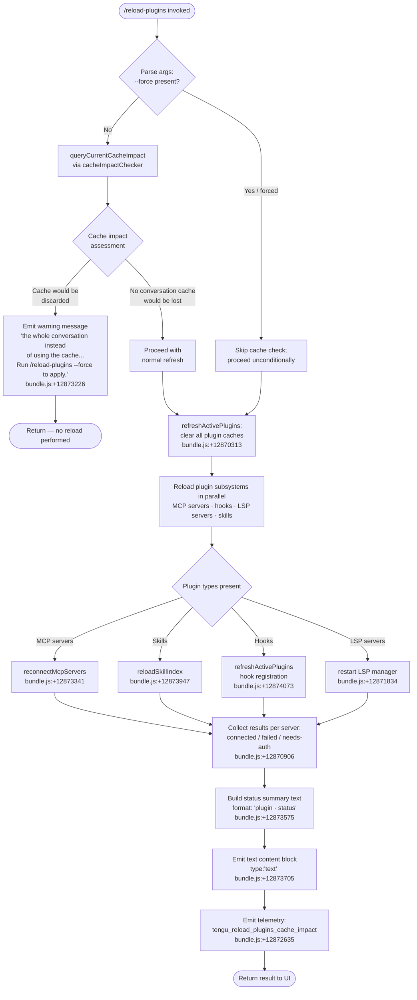

# `/reload-plugins`

> Analysis basis: CC v2.1.175 bundle.js (AST extraction + Claude interpretation)
> Minimum version: v2.1.175

---

## Overview

`/reload-plugins` activates any pending plugin changes (MCP servers, hooks, LSP servers, skills) within the current Claude Code session without requiring a full restart. By default it operates in a cache-aware mode that avoids discarding the conversation context; passing `--force` bypasses that cache check and performs a full refresh of all plugin subsystems. The command is dispatched via the thin-client `control-request` channel, meaning the actual reload logic executes in the daemon/host process rather than in the UI layer.

---

## Registration

| Field | Value |
|---|---|
| type | `local` |
| name | `reload-plugins` |
| description | `Activate pending plugin changes in the current session` |
| argumentHint | `[--force]` |
| supportsNonInteractive | `false` |
| thinClientDispatch | `control-request` |
| module_id | `BzK` |
| load_inline | `true` |
| loc_byte | `12874643` |
| loc_byte_end | `12874887` |
| loc_line | `9119` |
| arbor_handler.name | `oo7` |
| arbor_handler.fqn | `claude-2.1.175::oo7` |
| arbor_handler.kind | `AsyncFunction` |
| arbor_handler.resolution_path | `module_id` |
| arbor_handler.n_hits | `0` |

Analysis basis: CC v2.1.175 bundle.js:+12874643

---

## Input Branching

The command has four meaningfully distinct paths (no argument vs. `--force`, and within each path a sub-branch on whether active-plugin state is cache-clean or dirty), warranting a Mermaid flowchart.



---

## Behavioral Spec

### Top-level handler (`oo7`)

Analysis basis: CC v2.1.175 bundle.js:+12873341

```
async function reloadPluginsHandler(args, context):
    # Step 1 — parse flag
    forceFlag = args includes "--force"              # bundle.js:+12873763

    # Step 2 — cache-impact guard (normal mode only)
    if not forceFlag:
        impact = queryCacheImpact(context)           # calls cacheImpactChecker (PX→qL→pVH)
        if impact.wouldDiscardCache:
            return textResult(
                "...the whole conversation instead of using the cache. "
                "Run /reload-plugins --force to apply."
            )                                        # bundle.js:+12873226

    # Step 3 — emit telemetry about cache impact before clearing
    emitTelemetry("tengu_reload_plugins_cache_impact", {impact})  # bundle.js:+12872635

    # Step 4 — determine which plugin types to reload
    pluginTypes = classifyActivePlugins(context)    # distinguishes:
    #   "plugin"        bundle.js:+12873457
    #   "skill"         bundle.js:+12873488
    #   "agent"         bundle.js:+12873516
    #   "plugin MCP server"  bundle.js:+12873548

    # Step 5 — full cache clear
    refreshActivePlugins(context)                   # SOH; logs "refreshActivePlugins: clearing all
                                                    # plugin caches"  bundle.js:+12870313

    # Step 6 — parallel reload of subsystems
    results = await Promise.all([
        reconnectMcpServers(context),               # bundle.js:+12873341
        reloadSkillIndex(context),                  # bundle.js:+12873947
        reregisterHooks(context),                   # bundle.js:+12874073
        restartLspManager(context),                 # bundle.js:+12871834
    ])

    # Step 7 — assemble human-readable summary
    summaryLines = []
    for each result in results:
        label = result.pluginType + " · " + result.status   # separator " · "  bundle.js:+12873575
        if result.status == "error":                         # bundle.js:+12873630
            label = formatError(result)
        summaryLines.push(label)

    trimmedSummary = summaryLines.join("\n").trim()          # bundle.js:+12873727

    # Step 8 — return content block
    return {
        type: "text",                               # bundle.js:+12873705
        content: trimmedSummary
    }
```

### Cache-impact checker (`PX` → `qL` → `pVH`)

Analysis basis: CC v2.1.175 bundle.js:+12873341, +1129486, +1129414

```
function queryCacheImpact(context):
    # Inspects current conversation cache budget (qL) against plugin state (pVH).
    # Returns a descriptor indicating whether a plugin reload would force
    # the model to re-process the whole conversation instead of hitting cache.
    rawBudget = getConversationCacheBudget()        # qL bundle.js:+1129486
    pluginStateHash = computePluginStateHash()      # pVH bundle.js:+1129414
    return {wouldDiscardCache: rawBudget > 0 and pluginStateHash != currentHash}
```

### Plugin-type classifier (`Ao`)

Analysis basis: CC v2.1.175 bundle.js:+12873437, +12872994

```
function classifyActivePlugins(context):
    # Ao calls C8 to enumerate loaded plugin entries.
    # Returns list tagged with one of:
    #   "plugin", "skill", "agent", "plugin MCP server"
    rawEntries = enumerateLoadedModules()           # C8  bundle.js:+12872994
    return rawEntries.map(entry => tagPluginType(entry))
```

### Full plugin refresh (`SOH`)

Analysis basis: CC v2.1.175 bundle.js:+12874073, +12870313

```
async function refreshActivePlugins(context):
    log("refreshActivePlugins: clearing all plugin caches")  # bundle.js:+12870313

    # Clear installed-plugins cache
    clearInstalledPluginsCache()   # Elq bundle.js:+12870365
    # "Cleared installed plugins cache"  bundle.js:+10914592

    # Clear skill index cache
    clearSkillIndexCache()         # h$ / pp bundle.js:+12870371, +13460636

    # Clear LSP / hook caches
    clearLspCache()                # $p bundle.js:+10878511 (zx6.clear)

    # Reload MCP server configuration from all scopes:
    #   projectSettings, userSettings, localSettings, policySettings
    mcpConfigs = loadMcpConfigs()  # O2 bundle.js:+6499987
    #   Reads .mcp.json files      bundle.js:+6500296
    #   Merges: project, user, local, enterprise scopes

    # Process each MCP server entry (ze / iTL)
    for each serverConfig in mcpConfigs:
        applyMcpUpdate(serverConfig)  # sGA→DCH→ki8  bundle.js:+16538278

    # Reload hooks
    reregisterHooks(context)       # YMH → safe-mode guard  bundle.js:+12871173
    # "Safe mode: skipping plugin hook registration"  bundle.js:+5105017

    # Reload LSP manager
    restartLspManager()            # io7 → ro7  bundle.js:+12870989

    # Emit HR event to notify subscribers of state change
    emitPluginStateChanged()       # HR.emit  bundle.js:+12871419
```

### Skill-index reload (`YOH` → `lV` / `pp`)

Analysis basis: CC v2.1.175 bundle.js:+12874105, +13460636

```
async function reloadSkillIndex(context):
    # YOH coordinates skill (agent prompt) loading
    # pp calls H.clearSkillIndexCache() before repopulating  bundle.js:+13460636
    clearSkillIndexCache()
    entries = await loadSkillEntries()        # reads known_marketplaces.json  bundle.js:+10885103
    for each entry in entries:
        resolveAndStoreSkill(entry)           # hU, PZ, v4A, DM  bundle.js:+12007324
    return {loaded: entries.length, errors: collectErrors()}
```

### MCP server reconnection (`pzK` → `hQ9` → `ze`)

Analysis basis: CC v2.1.175 bundle.js:+12873795, +12872359, +6504185

```
async function reconnectMcpServers(context):
    # pzK checks existing server map (_.has, A.has) then delegates to hQ9
    existing = getServerMap()             # _.has  bundle.js:+12872409
    hasPending = checkPendingSlots()      # A.has  bundle.js:+12872448

    # UN resolves plugin-source URLs / local paths
    resolvedSources = resolvePluginSources()  # UN → Lu_ → xyH  bundle.js:+12872492

    # nt normalises server names (toLowerCase)
    normalised = normaliseName(source)        # nt  bundle.js:+12872498

    # hQ9 dispatches to:
    #   KwH — kill/stop existing server process  bundle.js:+6504185
    #   eB_  → U4A — start new server           bundle.js:+6504218
    #   ze   — full reconnect cycle              bundle.js:+6504242
    for each slot in resolvedSources:
        stopExistingServer(slot)              # KwH
        newConn = await startServer(slot)     # U4A
        applyConnectionResult(newConn)        # ze → sGA → ki8

    return collectConnectionStatuses()
        # statuses: "connected" bundle.js:+6759523
        #           "failed"    bundle.js:+6759315
        #           "needs-auth" bundle.js:+6759143
        #           "pending"   bundle.js:+6502750
        #           "approved"  bundle.js:+6502723
```

### Plugin-load result assembly (`assemblePluginLoadResult` / `U4A`)

Analysis basis: CC v2.1.175 bundle.js:+10989477, +10990306

```
async function assemblePluginLoadResult(pluginSlots):
    # Fires plugin_load_all telemetry (string literal)  bundle.js:+10990306
    # On total failure: plugin_load_total_failure       bundle.js:+10990324
    # On partial: plugin_load_partial_failures          bundle.js:+10990393

    # Guard against working-directory change mid-scan
    if originalCwd != currentCwd:
        log("assemblePluginLoadResult: originalCwd changed mid-scan; skipping side-effects (stale early-kick)")
        # bundle.js:+10990459
        return earlyKickResult()

    results = await Promise.all(pluginSlots.map(loadSinglePlugin))  # bundle.js:+10989726
    return partitionResultsByStatus(results)
    # statuses include:
    #   "marketplace-blocked-by-policy"  bundle.js:+10970474
    #   "marketplace-not-found"          bundle.js:+10971028
    #   "marketplace-load-failed"        bundle.js:+10971220
    #   "cache-miss"                     bundle.js:+10971276
    #   "plugin-not-found"               bundle.js:+10971314
    #   "fulfilled" / "rejected"         bundle.js:+10971783, +10971839
    #   "generic-error"                  bundle.js:+10971955
```

### `--force` flag parsing (`ao7`)

Analysis basis: CC v2.1.175 bundle.js:+12874001, +12873123

```
function parseForceFlag(rawArgs):
    # ao7: splits raw argument string on whitespace  bundle.js:+12873123
    tokens = rawArgs.split(" ")
    return tokens.includes("--force")    # literal "--force"  bundle.js:+12873763
    #  internal key stored as "force"    bundle.js:+12873778
```

### Result formatter (`D1H`)

Analysis basis: CC v2.1.175 bundle.js:+12874148, +4314326

```
function formatResultLines(rawResults):
    # D1H maps each result to a human-readable line
    lines = rawResults.map(r => formatSingleResult(r, f1))   # bundle.js:+4314326, +4314337
    joined = lines.slice(0, MAX).join("\n")                  # bundle.js:+4314379
    return joined
```

---

## State & Side Effects

| Item | Detail |
|---|---|
| Telemetry | `tengu_reload_plugins_cache_impact` (bundle.js:+12872635) — fired once per invocation before cache clear; carries impact descriptor. Additional plugin-load telemetry fired inside `assemblePluginLoadResult`: `plugin_load_all`, `plugin_load_total_failure`, `plugin_load_partial_failures` (bundle.js:+10990306, +10990324, +10990393). `tengu_plugin_state_file_error` may fire on disk errors (bundle.js:+10914771). `tengu_mcp_list_changed` fires when MCP tool list changes after reconnect (bundle.js:+16647410). |
| Plugin cache cleared | Installed-plugins cache, skill index cache, LSP cache, and MCP server map are all reset when the reload proceeds (bundle.js:+12870313, +13460636, +10848249). |
| Hook registration | All hooks are re-registered via `YMH`; skipped entirely when `--safe-mode` is active: "Safe mode: skipping plugin hook registration" (bundle.js:+5105017). |
| MCP server processes | Existing server child processes are killed (`KwH` → `b.kill` bundle.js:+16877407) and re-spawned (`Gd.spawn` bundle.js:+16879128). Connection state transitions from `"pending"` → `"connected"` or `"failed"`. |
| appState changes | `_.getAppState` is read (bundle.js:+12873841) to resolve active session context; plugin state changes are broadcast via `HR.emit` (bundle.js:+12871419). |
| thinClientDispatch | Dispatched as `"control-request"` — the reload runs in the daemon/host process, not the UI process. |
| Sound | None detected in depth-2 traversal. |
| Working-directory guard | If `originalCwd` changes between plugin scan start and result assembly, side-effects are skipped with a stale-kick log message (bundle.js:+10990459). |

---

## Version History

| Version | Change |
|---|---|
| v2.1.175 | Initial analysis |

---

## Common Mistakes

1. **Running `/reload-plugins` when the conversation cache would be discarded without `--force`.** Without `--force`, if the reload would force the model to reprocess the entire conversation, the command aborts and prints a warning directing the user to `/reload-plugins --force`. This is intentional — the default protects conversation context.

2. **Expecting interactive behaviour in non-interactive mode.** `supportsNonInteractive` is `false` (bundle.js:+12874643), so calling this command from a non-interactive pipeline will fail or be silently skipped.

3. **Assuming local execution.** The command is dispatched via `thinClientDispatch: "control-request"`, meaning the actual plugin reload runs in the host/daemon process. Changes to plugin files must already be visible to that process; if the daemon and client share a different working directory the reload may not see newly added plugin files.

4. **Expecting instant LSP server restart.** LSP server restart is asynchronous and may lag behind the command return. The summary line reports the reconnection *initiation* status, not the final connected state.

5. **Overlooking safe-mode suppression.** If Claude Code was launched with `--safe-mode`, hook re-registration is silently skipped even when `/reload-plugins` completes successfully (bundle.js:+5105017).

6. **Mixing yarn/pnpm lockfiles with plugin installs.** The plugin loader explicitly skips packages with yarn or pnpm lockfiles: "Skipped: yarn/pnpm lockfiles are not supported … Use bun or npm." (bundle.js:+10925253). Plugins in such directories will not load on reload.

---

## Appendix — Identifier Mapping

> For bundle debugging only. Identifiers change across versions.

| Identifier | Role |
|---|---|
| `oo7` | Main async handler for `/reload-plugins` (Arbor-resolved entry point) |
| `PX` | Cache-impact query dispatcher (calls `qL`) |
| `qL` | Conversation cache budget reader |
| `pVH` | Plugin state hash computer |
| `Ao` | Active-plugin classifier (calls `C8`) |
| `C8` | Loaded-module enumerator |
| `pzK` | MCP server reconnection orchestrator |
| `hQ9` | MCP reconnect inner dispatcher (KwH / eB_ / ze) |
| `KwH` | Existing MCP server stopper |
| `eB_` | New MCP server starter (delegates to `U4A`) |
| `U4A` | Plugin-load result assembler |
| `p4A` | Single-plugin loader |
| `ze` | Full MCP reconnect cycle |
| `O2` | MCP config file reader (`.mcp.json`) |
| `M9H` | MCP config merger (project/user/local/enterprise scopes) |
| `iTL` | MCP slot tracker / de-duplicator |
| `BX8` | MCP binary (`mcpb`) manifest processor |
| `UzK` | Cache-impact telemetry emitter |
| `ao7` | `--force` flag parser (splits raw arg string) |
| `SOH` | `refreshActivePlugins` — master plugin cache clear and reload |
| `Elq` | Installed-plugins cache clearer |
| `h$` | Skill index + hook + LSP cache clearer |
| `Yv7` | Hook registration coordinator |
| `lV` | Skill index reload coordinator |
| `pp` | Skill index cache clear + repopulate |
| `$p` | LSP cache clearer (`zx6.clear`) |
| `n$H` | Skill index cache clear helper |
| `YOH` | Skill-entry resolution and storage |
| `hU` | Single skill entry loader |
| `PZ` | Skill entry resolver (reads marketplace.json) |
| `v4A` | Skill file reader |
| `DM` | Skill manifest parser |
| `Yu8` | Marketplace path builder |
| `YMH` | Hook registration entry point (safe-mode aware) |
| `Fu_` | Hook registration worker |
| `io7` | LSP manager restart (active-plugin filter) |
| `ro7` | LSP manager restart (inactive-plugin filter) |
| `Oe` | Plugin directory scanner (`.mcpb` / `.dxt` extensions) |
| `hV6` | MCPB archive extractor and manifest reader |
| `MQ9` | Plugin discovery and path resolver |
| `QB_` | Plugin manifest file reader |
| `JCH` | LSP config (`.lsp.json`) reader |
| `bNL` | LSP server path validator |
| `CNL` | Relative-path traversal checker |
| `W28` | LSP extension conflict resolver |
| `DCH` | MCP server connection constructor |
| `ki8` | MCP connection result applier |
| `sGA` | MCP server apply-update orchestrator |
| `D` | Background-session manager / process supervisor |
| `Y` | Forced-shutdown handler (`process.exit`) |
| `hjK` | Daemon status recorder |
| `Rp6` | Daemon status file path builder |
| `RH` | JSON stringifier helper |
| `N` | Common logging / notification utility |
| `SH` | Telemetry / log error emitter |
| `TH` | String coercion helper |
| `UN` | Plugin source URL/path resolver |
| `Lu_` | Plugin source normaliser |
| `xyH` | HIPAA-mode source validator |
| `fu_` | `auto:` concurrency token parser |
| `q5L` | `auto` keyword detector |
| `nt` | Server name normaliser (toLowerCase) |
| `f5L` | Tool-search flags reader |
| `z6` | Telemetry gate (ZJH / IF maps) |
| `_D` | Output-token counter |
| `Rx6` | Plugin resolution engine (dependency graph walker) |
| `Ef6` | Git-source plugin fetcher |
| `Sx6` | npm-source plugin installer / updater |
| `Eu8` | npm version resolver |
| `I4A` | Installed-plugin registry updater |
| `Pu8` | npm package directory scanner |
| `EKH` | Plugin source hash computer (sha256) |
| `Dv` | Local-source plugin loader |
| `N4A` | Plugin JSON file reader (sync) |
| `h4A` | Plugin entry normaliser |
| `vx6` | Plugin state file writer |
| `JH` | MCP WebSocket/stdio session manager |
| `Ug8` | MCP transport handler (WebSocket) |
| `zH` | MCP message router |
| `DH` | MCP client state tracker |
| `PH` | MCP tools/list_changed handler |
| `z8` | MCP debug logger |
| `wH` | Main session controller (load/resume) |
| `kB8` | Session state validator |
| `iqH` | Session resume handler |
| `f$H` | Live-session lister |
| `D1H` | Result line formatter |
| `pv7` | Dependency-resolution conflict reporter |
| `dJ9` | Dependency cycle / cross-marketplace checker |
| `Rx6` | (also) dependency-resolution main loop |
| `klq` | Dependency queue manager |
| `wA` | Settings file writer (atomic, via temp file) |
| `Ww6` | Atomic file write (with fsync + rename) |
| `Os6` | gitignore-tracking settings appender |
| `gB` | Settings load coordinator |
| `bNH` | Settings schema validator |
| `rO` | Cache-map clearer (`dQ6.clear`, `Go8.clear`) |
| `l` | Scheduled-task runner |
| `B1H` | Scheduled-task batch processor |
| `vcK` | Boolean coercion helper |
| `mzK` | LSP-server plugin-name tagger |
| `Bf` | OTEL metrics attribute builder |
| `jSH` | OTEL resource attribute injector |
| `NN` | Tool-name case normaliser |
| `w$` | Identifier prefix builder |
| `ZH` | Tool-list concatenator |
| `W66` | MCP protocol version parser (parseInt) |
| `D28` | MCP capabilities version parser (parseInt) |
| `HH` | MCP update batch coordinator |
| `YCH` | MCP auth-state updater |
| `s` | MCP slot state machine |
| `W` | MCP connection attempt executor |
| `Kg` | Async-iterator / Promise.all polyfill |
| `su` | Telemetry key formatter |
| `qH` | Input-line tokeniser |
| `UzK` | `d` (internal state) writer for cache impact |

---

Note: index built via Arbor fallback; some signals (telemetry, literals) may be missing — see arbor-fallback.js.