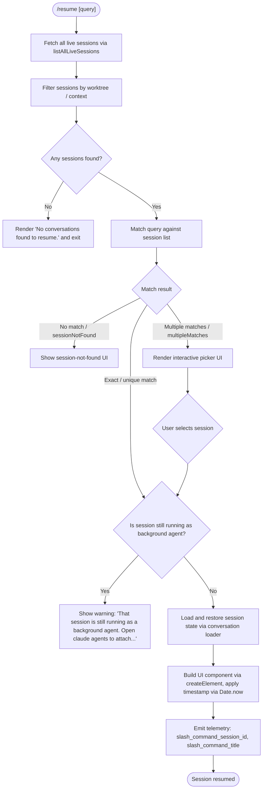

# `/resume`

> Analysis basis: CC v2.1.175 bundle.js (AST extraction + Claude interpretation)
> Minimum version: v2.1.175

---

## Overview

`/resume` (aliased as `/continue`) allows the user to resume a previously recorded conversation session by searching for it by ID or keyword. The command lists available sessions, matches the user's input against them, and either directly restores a matching session or presents an interactive selection UI when multiple candidates are found. It also guards against resuming sessions that are still live as background agents.

---

## Registration

| Field | Value |
|---|---|
| type | `local-jsx` |
| name | `resume` |
| description | `Resume a previous conversation` |
| aliases | `["continue"]` |
| argumentHint | `[conversation id or search term]` |
| module_id | `_7K` |
| load_inline | `true` |
| loc_byte | `12478208` |
| loc_byte_end | `12478405` |
| loc_line | `8585` |
| arbor_handler.name | `tc7` |
| arbor_handler.fqn | `claude-2.1.175::tc7` |
| arbor_handler.kind | `AsyncFunction` |
| arbor_handler.resolution_path | `module_id` |
| arbor_handler.n_hits | `0` |

Analysis basis: CC v2.1.175 bundle.js:+12478208

---

## Input Branching

The command has five or more distinct branches depending on session list state and user input, so a Mermaid flowchart is used.



Analysis basis: CC v2.1.175 bundle.js:+12476694, +12476808, +12477243, +12474451, +12474522

---

## Behavioral Spec

### 1. Session Enumeration and Filtering

On invocation, the handler calls `listAllLiveSessions` (via the `f$H` helper) to obtain all persisted sessions. Sessions are filtered by worktree context: the helper calls `git worktree list --porcelain` and normalises paths using NFC normalisation before comparison. Only sessions whose working directory matches the current worktree are surfaced.

Analysis basis: CC v2.1.175 bundle.js:+9309919, +9299553, +9299564, +9299571, +181826

```
function enumerateSessions(worktreeContext):
    allSessions = await listAllLiveSessions()
    worktrees = await runGit(["worktree", "list", "--porcelain"])
    parsedTrees = parseWorktreePorcelain(worktrees)
    return allSessions.filter(s => worktreeMatchesContext(s, parsedTrees, worktreeContext))
```

### 2. Background-Agent Guard

Before restoring any session, the handler checks whether the target session is currently live as a background agent. If so, it displays the message:

> "That session is still running as a background agent. Open `claude agents` to attach to it, or stop it there first to resume here."

(Analysis basis: CC v2.1.175 bundle.js:+12476808)

The check inspects the session list filtered against known live background sessions (`H7K → H.filter`, `H$` at +12476694 and +12476724).

```
function guardAgainstLiveBackgroundSession(session, liveSessions):
    if liveSessions.includes(session.id):
        displayWarning(BACKGROUND_AGENT_MESSAGE)
        return BLOCKED
    return ALLOWED
```

### 3. Session Matching

The handler uses the raw argument string (conversation ID or search term) to locate a session. The matching logic (inside `q$H`) performs:

1. A direct UUID-prefix lookup (`.startsWith` on session IDs).
2. A case-insensitive substring match on session titles / summaries (`.toLowerCase`, `.localeCompare`).
3. Sessions are ranked and sliced; if exactly one result remains it is used directly; otherwise an interactive picker is shown.

The `sessionNotFound` and `multipleMatches` literal keys (+12474451, +12474522) drive the two non-happy-path branches.

```
function matchSession(query, sessions):
    normalised = query.trim().toLowerCase()
    if isUUID(normalised):
        exact = sessions.find(s => s.id.startsWith(normalised))
        if exact: return { kind: "unique", session: exact }
    candidates = sessions.filter(s =>
        s.title.toLowerCase().includes(normalised) OR
        s.summary.toLowerCase().includes(normalised))
    candidates.sort((a, b) => a.title.localeCompare(b.title))
    if candidates.length == 0: return { kind: "sessionNotFound" }
    if candidates.length == 1: return { kind: "unique", session: candidates[0] }
    return { kind: "multipleMatches", sessions: candidates }
```

Analysis basis: CC v2.1.175 bundle.js:+9299734, +9299759, +9299795, +9299898, +9299917, +9299944, +9299977

### 4. Empty State

If no sessions are found at all, the handler renders the static message:

> "No conversations found to resume."

(Literal at CC v2.1.175 bundle.js:+12477243)

### 5. Session Restoration

When a unique, non-live session is identified, the handler:

1. Loads the full conversation transcript via the conversation-loading subsystem (`a96` → `E0K` → session-state stores).
2. Calls `c_` to spawn a new process/session context, registering the conversation's message chain and metadata.
3. Calls `oj.createElement` to build the JSX component used in the TUI.
4. Captures `Date.now()` as the session start timestamp.
5. Calls `q$H` to compose the session context (worktree state, message ordering, file history snapshots).
6. Calls `SB8` to format and present the session summary header.

Analysis basis: CC v2.1.175 bundle.js:+12477094, +12477120, +12477165, +12477183, +12477550

```
async function restoreSession(session):
    transcript = await loadConversationTranscript(session.id)   // a96 path
    ctx = await buildSessionContext(transcript)                  // q$H
    header = formatSessionHeader(ctx)                            // SB8 / Z0K
    component = createElement(SessionComponent, { ctx, header })
    startedAt = Date.now()
    return { component, startedAt }
```

### 6. Compact/Summary Metadata Handling

The session-loading subsystem reads tagged metadata records from the conversation log: `summary`, `last-prompt`, `custom-title`, `ai-title`, `tag`, `agent-name`, `agent-color`, `agent-setting`, `mode`, `permission-mode`, `isolation-latch`, `worktree-state`, `pr-link`, `bridge-session`, `file-history-snapshot`, `attribution-snapshot`, `content-replacement`, `fork-context-ref`.

Analysis basis: CC v2.1.175 bundle.js:+13518243 through +13519741 (various `oqH` map-set calls)

### 7. No-Match and Multiple-Match UI

- `sessionNotFound`: The TUI component uses the `tLK` helper (bold text via `J6.bold`) to highlight the "not found" state. Analysis basis: CC v2.1.175 bundle.js:+12477780, +12474486
- `multipleMatches`: An interactive picker is rendered, collecting a user selection before proceeding to the guard/restore flow.

Analysis basis: CC v2.1.175 bundle.js:+12474522

---

## State & Side Effects

| Item | Detail |
|---|---|
| Telemetry (slash command) | `slash_command_session_id` (bundle.js:+12477505), `slash_command_title` (bundle.js:+12477730) |
| Telemetry (worktree) | `tengu_worktree_detection` (bundle.js:+9299653) |
| Telemetry (background attach) | `tengu_bg_attach` (+16869237), `tengu_bg_attach_kick` (+16871380), `tengu_bg_attach_stall_gave_up` (+16870160), `tengu_bg_attach_stall_respawn` (+16870430), `tengu_bg_attach_legacy_autorespawn` (+16868079), `tengu_bg_attach_upgrade` (+13321999) |
| Telemetry (daemon/session lifecycle) | `tengu_daemon_control` (+16914553), `tengu_bg_dispatch_stale_drop` (+16865425), `tengu_bg_proto_mismatch` (+16864057), `tengu_bg_spare_claim` (+16878799), `tengu_bg_spare_claim_fail` (+16879065), `tengu_bg_spare_enable` (+16878671), `tengu_daemon_yield` (+16897093) |
| Telemetry (transcript/chain) | `tengu_transcript_phantom_parent` (+13517018), `tengu_transcript_parent_cycle` (+13520823), `tengu_chain_parent_cycle` (+13498504), `tengu_chain_timestamp_fallback` (+13498653), `tengu_chain_parallel_tr_recovered` (+13500519), `tengu_relink_walk_broken` (+13498014) |
| Telemetry (memory/scheduling) | `tengu_bg_low_mem_mb` (+13321809), `tengu_bg_dispatch_low_mem` (+16877967), `tengu_bg_retire_pinned_low_mem` (+16882003), `tengu_scheduled_task_fire` (+16371784), `tengu_scheduled_task_missed` (+16371033), `tengu_scheduled_task_expired` (+16372127) |
| Telemetry (feature flags) | `tengu_feature_ok` (+1017151), `tengu_feature_bad` (+1017218) |
| appState changes | Conversation context is loaded into the active session store; worktree state, file-history snapshots, and metadata maps are populated by `oqH`. |
| Process spawn | `c_` may spawn a new Claude worker process for the resumed session (calls `ENH`, which calls `Gd.spawn` transitively). |
| Background-agent guard | Blocks resume with a static message if the target session is detected as a live background agent; no state mutation occurs in that branch. |
| Sound | <!-- TODO: not found in depth-2 traversal; needs --depth 4 --> |
| Hook registration | `CcA` registers an `exit` event listener on the spawned process. Analysis basis: CC v2.1.175 bundle.js:+1120798 |

---

## Version History

| Version | Change |
|---|---|
| v2.1.175 | Initial analysis |

---

## Common Mistakes

1. **Using `/resume` with a session that is still live as a background agent.** The command will not restore it — it will display a warning directing you to `claude agents` instead.
2. **Providing a partial search term that matches multiple sessions.** The command will enter an interactive picker rather than resuming immediately; supply a more specific ID prefix or title fragment to skip the picker.
3. **Expecting cross-worktree sessions to appear.** Sessions are filtered to the current git worktree; sessions created in another worktree will not be listed.
4. **Confusing `/resume` with `/continue`.** Both names invoke the same handler (`tc7`); `/continue` is a registered alias and behaves identically.
5. **Assuming instant restoration after background-agent guard bypass.** After stopping a background agent and re-running `/resume`, the daemon must de-register the session; a brief delay or retry may be required.

---

## Appendix — Identifier Mapping

> For bundle debugging only. Identifiers change across versions.

| Identifier | Role |
|---|---|
| `tc7` | Main `/resume` command handler (AsyncFunction) |
| `H7K` | Live-session filter entry point |
| `H$` | Session list helper (used in filtering and in `dr`) |
| `f$H` | Session enumeration wrapper; calls `listAllLiveSessions` |
| `q$H` | Session context builder; handles worktree matching, ID prefix lookup, and session ordering |
| `c_` | Session/process spawn coordinator |
| `ENH` | Process spawner core (calls `Gd.spawn`) |
| `SH` | Error/log reporting helper (calls `ua.logError`) |
| `GA` | Error-string formatter |
| `K6` | String-coercion utility |
| `qq` | Queue/batch helper (calls `QgA`) |
| `QgA` | Queue action helper |
| `mxf` | Rotating-queue helper (`wa6.shift`/`wa6.push`) |
| `TH` | String coercion helper |
| `rcA` | Process option builder (`Opf`, `ndA`) |
| `dK_` | Process config helper (`UcA`) |
| `cK_` | Process config helper variant (`UcA`, `Kpf`) |
| `nK_` | Process config helper variant (`Mpf`) |
| `AcA` | Numeric validation (`Number.isFinite`) |
| `Tw6` | Process-run core logic (`Vmf`) |
| `QK_` | Reflect-apply dispatch helper |
| `CcA` | Process exit-event registrar |
| `_cA` | Timeout-race helper (`Promise.race`, `clearTimeout`) |
| `qcA` | Kill-on-timeout helper (`H.kill`) |
| `edA` | Data-event handler bind |
| `HcA` | SIGKILL escalation bind |
| `ScA` | Parallel-spawn helper (`Promise.all`) |
| `vw6` | Spawn-result handler (`ZK_`) |
| `ycA` | Stdio pipe handler (`A.pipe`) |
| `kcA` | Stdio add helper (`NcA.default`) |
| `McA` | Stdio bind helper (`CK_.bind`) |
| `Y` | Process-exit coordinator (`process.exit`, `z.abort`) |
| `KX` | Forced-shutdown label |
| `z` | Daemon/abort-controller object |
| `Ypf` | String path formatter |
| `vM` | <!-- TODO: not found in depth-2 traversal; needs --depth 4 --> |
| `N` | Conversation transcript loader (calls `J9f`, `RH`, `nf`, `mgH`, `G9f`) |
| `J9f` | Transcript fetch helper |
| `RH` | JSON-stringify wrapper |
| `nf` | Path/content formatter (`.replace`, `.at`, `.lastIndexOf`, `.slice`) |
| `mgH` | Log-line formatter (`LIA`) |
| `G9f` | Conversation file reader (calls `Buffer.byteLength`, `Y8H.dirname`) |
| `E8` | <!-- TODO: not found in depth-2 traversal; needs --depth 4 --> |
| `hjK` | Daemon status reader (`daemon.status.json`) |
| `Ls` | Daemon log helper (`kLH`) |
| `n9` | Async-storage accessor (`hB4.getStore`) |
| `Rp6` | Status-file path builder (`NjK.join`, `M_`) |
| `sO` | Path normaliser (`H.normalize`, NFC) |
| `W_` | Working-directory resolver (`iG`) |
| `iG` | <!-- TODO: not found in depth-2 traversal; needs --depth 4 --> |
| `SB8` | Session-header formatter (calls `bU6`) |
| `bU6` | Header builder (calls `Z0K`, `UUH`, `N`, `W_`) |
| `Z0K` | File-tree / context builder (calls `gjA`, `NU6`, `MZH`, etc.) |
| `Li` | Project-path builder (`A2H.join`, `M_`) |
| `MZH` | Message-tree walker (`aL6`, `$NH`) |
| `gjA` | Directory-tree walker (`nK.readdir`, recursive) |
| `NU6` | Node-map get/set helper |
| `uw` | Content truncation helper (`H.replace`, `_.slice`, `Tuf`) |
| `UUH` | Buffer-based file scanner (`Buffer.alloc`, `r15`) |
| `r15` | File-parse worker (`V0K`, `t$`, `N`) |
| `ng` | Regex tester for session IDs (`fbL.test`) |
| `M$H` | App state store accessor (provides `.get` for all state maps) |
| `oqH` | Session state hydrator; populates all conversation metadata maps |
| `w15` | <!-- TODO: not found in depth-2 traversal; needs --depth 4 --> |
| `wU` | <!-- TODO: not found in depth-2 traversal; needs --depth 4 --> |
| `Cc6` | Message-chain entry parser (`Array.isArray`, `Sc6`, `OIA`) |
| `Sc6` | Compact-summary detector (`MIA`, `M9f.test`) |
| `OIA` | Content-replacement applier (`H.replace`) |
| `FJ` | <!-- TODO: not found in depth-2 traversal; needs --depth 4 --> |
| `M` | Daemon-state supervisor (`DCH`, `ki8`, `sGA`) |
| `DCH` | MCP connection coordinator (`Object.entries`, `Vi`, `eV`) |
| `ki8` | MCP apply-update handler (`H.applyMcpUpdate`, `YCH`) |
| `sGA` | Server-group aggregator (`_.getClients`, `DCH`, `ki8`) |
| `O` | Background-session object (`C8`) |
| `C8` | Background-session state store |
| `P` | Socket/stream message parser (`Buffer.concat`, `YV5`) |
| `b7` | Socket end/log helper (`H.end`, `RH`) |
| `YV5` | Daemon protocol dispatch core |
| `D` | Worker-lifecycle manager (`A.get`, `b.kill`, `dTA`, `oTA`) |
| `b` | Worker-spawn tracker (`Ls`, `btH`, `Date.now`) |
| `i8` | Async-timeout helper (`setTimeout`, `clearTimeout`) |
| `CH` | Feature-ok telemetry emitter (`A6`) |
| `kH` | Feature-ok telemetry emitter variant (`A6`) |
| `ng8` | Memory-check helper (`a6`, `z6`) |
| `UG6` | Config-file reader (`vW.readFile`, `ZS_`) |
| `Q` | Unix-socket client manager (`c.on`, `process.kill`, `Td8.unlink`) |
| `z6` | Daemon-socket pool (`XW6`, `PW6`, `Rm`, `IF`) |
| `dTA` | Daemon-socket claim+connect (`Gd.claim`, `ii8.connect`) |
| `oTA` | Worker lifecycle/teardown (`hw.rm`, `hw.unlink`, `SH`) |
| `A6` | Telemetry emitter bootstrap (`d56`) |
| `k` | Grace-clock / sweep loop (`l.shiftGraceClocksForward`, `zU6`, `v2K`, `UG6`) |
| `y` | Fable-usage-credits warning emitter (`qs`) |
| `l` | Scheduled-task loop (`fE6`, `OD8`, `vcK`, `B1H`) |
| `R` | Foreground-yield writer (`w.write`) |
| `zU6` | Memory-free sampler (`ng8`, `V2K.freemem`) |
| `v2K` | Socket-memory checker (`z6`) |
| `n8` | No-op / identity helper (`_`) |
| `c` | Session-close helper (`Su6`, `_HK`) |
| `ig8` | Upgrade-attach helper (`z6`) |
| `n` | Keyboard-event preventDefault handler |
| `U15` | Binary-file parser (Buffer-level, `fC.openSync`) |
| `i` | Diff/comparison object (`D`, `o`) |
| `T0K` | Array-at accessor |
| `AH` | Buffer-set comparison helper |
| `d6` | JSON.parse wrapper |
| `S` | Session-write coordinator (`csK`, `vM`, `kV5`) |
| `m15` | Buffer compare helper |
| `t` | Timer/ref object (`W.current`, `l.setTimeout`) |
| `o` | Background-session descriptor (`gd8`) |
| `qH` | Inline-content parser (`i.trim`, `D`, `M`, `B`, `F`) |
| `_vH` | JSON.parse wrapper (alternate) |
| `HH` | MCP-update broadcaster (`Promise.all`, `t.applyMcpUpdate`, `sGA`) |
| `B15` | Sync file-read helper (`fC.openSync`, `fC.readSync`, `d6`) |
| `x` | Socket teardown helper (`clearTimeout`, `O.end`, `L.emit`) |
| `C` | Write-then-clear helper (`clearTimeout`, `O.write`) |
| `aWK` | Conversation-chain walker (parent-link traversal) |
| `V15` | Parent-chain resolver (`_.get`, `q.has`, `K.push`, `K.reverse`) |
| `M1` | <!-- TODO: not found in depth-2 traversal; needs --depth 4 --> |
| `p15` | Compact binary-log parser (`Buffer.from`, `H.indexOf`) |
| `kNH` | Stream-frame parser (`tpf`, `epf`, `_Uf`, `HUf`) |
| `tpf` | Frame-type detector |
| `epf` | Frame-content extractor |
| `_Uf` | JSON-frame parser (`JSON.parse`) |
| `HUf` | String-frame parser (`JSON.parse`) |
| `N9` | Error-code helper (`E8`) |
| `s` | MCP-slot state tracker (`ki8`, `t.applyMcpUpdate`, `YCH`) |
| `YCH` | MCP-channel update helper (`l2H`) |
| `hQ8` | Timestamp sorter (`Date.parse`) |
| `L$H` | Conversation-chain builder (`h15`, `I15`, `v15`, `P0K`) |
| `h15` | NaN-check helper (`Number.isNaN`) |
| `I15` | Message-index builder (sets, maps, sort) |
| `v15` | Message-queue shifter (`f.shift`, `K.sort`) |
| `P0K` | Message-pointer map helper |
| `o96` | Conversation-row mapper |
| `ojA` | Message-content normaliser (`_.replaceAll`, `A.slice`) |
| `am6` | Message-body parser (`VK`, `f.replace`, `Nx`) |
| `VK` | Tool-call parser (`Uv`, `q.exec`, `M.exec`, `$.exec`) |
| `sjA` | Side-chain classifier (`y15`, `k15`) |
| `y15` | Array-some predicate helper |
| `k15` | Array-some predicate helper (alternate) |
| `IQ8` | Message-map get/set helper |
| `yQ8` | Message-map array accessor (`Array.from`) |
| `a96` | App-state snapshot assembler |
| `E0K` | Conversation initialiser (`F15`, `oqH`, `Object.assign`) |
| `F15` | Directory-stat helper (`nK.stat`, `t$`) |
| `EC` | Environment-check helper (`iG`) |
| `h0` | Directory-listing helper (`uB.readdir`, `uw`) |
| `BjA` | Message-body builder (`ojA`, `o96`, `sjA`) |
| `ZOH` | <!-- TODO: not found in depth-2 traversal; needs --depth 4 --> |
| `dr` | Session-display composer (`q$H`, `Z0K`, `UUH`, `H$`) |
| `tLK` | Bold-text renderer (`J6.bold`) |

---

Note: index built via Arbor fallback; some signals (telemetry, literals) may be missing — see arbor-fallback.js.