# `/team-onboarding`

> Analysis basis: CC v2.1.175 bundle.js (AST extraction + Claude interpretation)
> Minimum version: v2.1.175

---

## Overview

`/team-onboarding` is a `prompt`-type slash command that helps a power user of Claude Code generate a structured onboarding guide (`ONBOARDING.md`) for teammates who are new to Claude Code. It does this by scanning the invoking user's local Claude Code transcript history over a configurable window of days, classifying their past sessions by task type, and co-authoring a ready-to-share Markdown document — then iterating on it collaboratively before saving the final result.

---

## Registration

| Field | Value |
|---|---|
| type | `prompt` |
| name | `team-onboarding` |
| description | `Help teammates ramp on Claude Code with a guide from your usage` |
| isHidden | `false` |
| handler_method | `getPromptForCommand` |
| handler_method_start (byte) | `12378812` |
| handler_method_end (byte) | `12379522` |
| loc_byte | `12378474` |
| loc_byte_end | `12379523` |
| loc_line | `8555` |
| prompt_body.length | `4539` characters |
| prompt_body.trace | `identifier→$ (local→1 ext vars)` |
| arbor_handler.name | `getPromptForCommand` |
| arbor_handler.kind | `Method` |
| arbor_handler.fqn | `claude-2.1.175::getPromptForCommand` |
| arbor_handler.resolution_path | `direct` |
| arbor_handler.n_hits | `2` |
| `handler_method_start` | `12378812` |
| `handler_method_end` | `12379522` |

Analysis basis: CC v2.1.175 bundle.js:+12378474

---

## Input Branching

The handler's logic involves more than three distinct branches (transcript scan result, session count, MCP config presence, guide template fill-in, and the two-phase review loop), so a Mermaid flowchart is used.

```mermaid
flowchart TD
    A([User invokes /team-onboarding]) --> B[getPromptForCommand called]
    B --> C[Compute WINDOW_DAYS\nMath.min / Math.max / Math.floor\nbounded to 365 days]
    C --> D[Scan local JSONL transcripts\nvia d4K — readdir + stat + readFile\non ~/.claude/projects/**/*.jsonl]
    D --> E{Transcript files found?}
    E -- None / ~0 sessions --> F[USAGE_DATA is sparse;\nleave work-type breakdown as TODO]
    E -- Sessions found --> G[Parse sessionDescriptors:\ntitle, prNumbers, firstUserMessage\ntool/MCP counts as weak hint]
    G --> H[Classify each session into\nbuild_feature / debug_fix /\nimprove_quality / analyze_data /\nplan_design / prototype / write_docs]
    H --> I[Pick top 3-5 categories\nwith rough percentages]
    I --> J[Read currentRepo + sibling dirs\nfor repo list]
    J --> K[Read .mcp.json → mcpServers\nfor MCP server list via iQ7]
    K --> L[Read git config user.name\nand git remote get-url origin\nvia nQ7 / c_]
    L --> M[Resolve generatedBy name\nfrom git config or omit]
    M --> N[Inject WINDOW_DAYS, USAGE_DATA,\nGUIDE_TEMPLATE into prompt body\nvia replaceAll]
    N --> O[Emit telemetry:\ntengu_team_onboarding_invoked\ntengu_flint_harbor_prompt]
    O --> P[Agent outputs acknowledgment line\nimmediately — no thinking first]
    P --> Q[Agent writes draft ONBOARDING.md\nwith ASCII bar charts █░\n20 chars wide]
    Q --> R[Agent renders guide in code block\nthen adds Review section\nwith 3 numbered questions]
    R --> S{User responds to Review}
    S -- Provides team name / tips / task --> T[Agent updates ONBOARDING.md\nwith answers]
    T --> U[Agent emits closing line verbatim:\nSaved to ONBOARDING.md...]
    U --> V[Emit telemetry:\ntengu_team_onboarding_generated\ntengu_flint_harbor_share]
    S -- Provides further edits --> T
```



---

## Behavioral Spec

### 1. Handler Entry and Window Calculation

`getPromptForCommand` is the inline ObjectMethod on the registration object, resolved by Arbor via `direct` path (n_hits: 2).

```
function getPromptForCommand(context):
    rawDays = computeWindowDays(context)
    WINDOW_DAYS = Math.floor(Math.max(1, Math.min(365, rawDays)))
    // 365-day cap found at bundle.js:+12379061
    usageData = scanTranscripts(WINDOW_DAYS)
    guideTemplate = loadGuideTemplate()
    prompt = buildPrompt(WINDOW_DAYS, usageData, guideTemplate)
    emit("tengu_team_onboarding_invoked")
    emit("tengu_flint_harbor_prompt")
    return prompt
```

Analysis basis: CC v2.1.175 bundle.js:+12379015, +12379024, +12379033, +12379061, +12378849, +12379072

Window calculation applies `Math.min`, `Math.max`, and `Math.floor` in sequence. Maximum window: **365 days** (bundle.js:+12379061).

---

### 2. Transcript Scanning (transcriptScanner / d4K)

```
async function scanTranscripts(windowDays):
    cutoff = Date.now() - windowDays * 24 * 60 * 60 * 1000
    // 24h * 60m * 60s constants at bundle.js:+12367310, +12367313
    transcriptDir = resolveProjectsPath()   // via lu / JI
    files = await fs.readdir(transcriptDir)  // F46.readdir at +12367338
    jsonlFiles = files.filter(f => extname(f) === ".jsonl")
    // ".jsonl" literal at bundle.js:+12367425

    sessions = []
    for file in jsonlFiles:
        stat = await fs.stat(joinPath(transcriptDir, file))
        if not stat.isFile(): continue
        if stat.mtime < cutoff: continue
        raw = await fs.readFile(joinPath(transcriptDir, file))
        lines = raw.split("\n")
        session = parseSessionDescriptor(lines)
        // Extracts title, prNumbers ("\"name\":\"mcp__" sentinel at +12368004),
        // firstUserMessage, tool counts, MCP tool counts
        sessions.push(session)

    return { sessionDescriptors: sessions, generatedBy: resolveAuthorName() }
```

Analysis basis: CC v2.1.175 bundle.js:+12367297, +12367338, +12367365, +12367394, +12367408, +12367444, +12367681, +12367795

The scanner applies three regex patterns (`QQ7`, `dQ7`, `cQ7`) to extract structured data (PR numbers, content blocks, MCP tool invocations) from raw JSONL lines. The sentinel `"content":[` string (bundle.js:+12368354) and `"name":"mcp__` prefix (bundle.js:+12368004) are used to identify MCP tool call lines within transcript entries.

---

### 3. MCP Configuration Reader (iQ7)

```
async function readMcpConfig(projectPath):
    mcpConfigPath = join(projectPath, ".mcp.json")
    // ".mcp.json" literal at bundle.js:+12369536
    try:
        raw = await fs.readFile(mcpConfigPath)
        parsed = JSON.parse(raw)   // via d6
        servers = parsed["mcpServers"]  // "mcpServers" literal at +12369592
        return normalizeServerEntries(servers)
    except:
        return []
```

Analysis basis: CC v2.1.175 bundle.js:+12369512, +12369525, +12369559, +12369592

---

### 4. Author Name Resolution (nQ7 / c_ / git subprocess)

```
function resolveAuthorName():
    // Runs: git config user.name  (literals at +12370159, +12370166, +12370175)
    name = runGit(["config", "user.name"])
    if not name:
        // Runs: git remote get-url origin  (literals at +12370231, +12370240, +12370250)
        remote = runGit(["remote", "get-url", "origin"])
        name = inferNameFromRemoteUrl(remote)
    return name or null
```

Analysis basis: CC v2.1.175 bundle.js:+12370156, +12370159, +12370166, +12370175, +12370231, +12370240, +12370250, +12370301, +12370339, +12370347

The `NNH` helper normalises the git remote URL: it trims whitespace, matches against a pattern, strips `git/` prefixes (literal at bundle.js:+12370247), lowercases, and extracts a basename via `DB8.basename`. If git is unavailable or returns nothing, `generatedBy` is omitted from the prompt.

---

### 5. Prompt Assembly and Template Injection

```
function buildPrompt(windowDays, usageData, guideTemplate):
    body = PROMPT_TEMPLATE   // 4539-char string, resolved via identifier→$
    body = body.replaceAll("{{WINDOW_DAYS}}", String(windowDays))
    // "{{WINDOW_DAYS}}" literal at bundle.js:+12379272
    body = body.replaceAll("{{GUIDE_TEMPLATE}}", guideTemplate)
    // "{{GUIDE_TEMPLATE}}" literal at bundle.js:+12379312
    body = body.replaceAll("{{USAGE_DATA}}", JSON.stringify(usageData))
    // "{{USAGE_DATA}}" literal at bundle.js:+12379347
    return { type: "text", content: body }
    // "text" literal at bundle.js:+12379506
```

Analysis basis: CC v2.1.175 bundle.js:+12379259, +12379272, +12379290, +12379312, +12379347, +12379506

Three template variables are substituted via `String.replaceAll` before the prompt is sent to the agent. The prompt body itself is 4,539 characters and was resolved through a one-hop external variable reference (`identifier→$ (local→1 ext vars)`).

---

### 6. Agent-Side Guide Generation (as instructed by prompt)

The prompt instructs the agent to follow a strict five-step procedure:

```
procedure agentGenerateOnboardingGuide(promptContext):

    // Step 1 — Immediate acknowledgment (no deferred thinking)
    output("> Looking at how you've used Claude over the last [N] days...")

    // Step 2 — Session classification
    for session in promptContext.sessionDescriptors:
        label = classifySession(session)
        // Labels: build_feature | debug_fix | improve_quality |
        //         analyze_data | plan_design | prototype | write_docs
        // Display with spaces+TitleCase in the guide
    topCategories = pickTop(3..5, withRoughPercentages)

    // Step 3 — Gather remaining context
    repoList = [currentRepo] + siblingRepoDirs
    mcpServerDescriptions = inferFromMcpConfig(promptContext.mcpServers)
    // Team Tips and Get Started are left as TODO placeholders

    // Step 4 — Write ONBOARDING.md
    guide = renderGuide(
        teamName = inferredOrAsked,
        workTypeBreakdown = topCategories,     // ASCII bar charts █░, 20 chars wide
        repos = repoList,
        mcpServers = mcpServerDescriptions,
        generatedBy = promptContext.generatedBy  // omit if null
    )
    writeFile("ONBOARDING.md", guide)

    // Step 5 — Render code block + Review section
    output(codeBlock(guide))
    output("---")
    output("**Review**")
    output("1. Team name confirmation or question")
    output("2. Starter task link (optional)")
    output("3. Team tips not in CLAUDE.md")

    // After user responds — update and close
    applyUserAnswers("ONBOARDING.md")
    output("Saved to `ONBOARDING.md`. Drop it in your team docs and channels...")
    // This closing line must be verbatim and unnumbered

    // Further edits from user → re-apply to file
```

Analysis basis: CC v2.1.175 bundle.js:+12378812 through +12379522 (handler method body)

---

### 7. Prompt Dispatch via Harbor (z6 / DK6 / flint harbor)

```
function dispatchPromptToAgent(prompt):
    harborResult = harborShare(prompt)           // DK6 → z6 path
    emit("tengu_flint_harbor_share")             // +10153195
    emit("tengu_team_onboarding_generated")      // +12379391
    return harborResult
```

Analysis basis: CC v2.1.175 bundle.js:+12379368, +10153153, +10153171, +10153192, +10153195, +12379391

`DK6` bridges into the shared flint-harbor dispatch layer (`z6`), which handles session creation (`SX_`), experiment tracking (`GrowthbookExperimentEvent` at +2520891), and random-bytes-based session ID generation (`LF` → `e19.randomBytes`, 32 bytes hex at +3334790/+3334803).

---

## State & Side Effects

| Item | Detail |
|---|---|
| Telemetry — invocation | `tengu_team_onboarding_invoked` (bundle.js:+12379072) |
| Telemetry — prompt dispatch | `tengu_flint_harbor_prompt` (bundle.js:+12378849) |
| Telemetry — guide generated | `tengu_team_onboarding_generated` (bundle.js:+12379391) |
| Telemetry — harbor share | `tengu_flint_harbor_share` (bundle.js:+10153195) |
| Telemetry — config errors (ancillary) | `tengu_config_parse_error`, `tengu_config_lock_contention`, `tengu_config_stale_write`, `tengu_config_auth_loss_prevented` |
| Telemetry — background daemon (ancillary) | `tengu_bg_dispatch_sigkill_escalate`, `tengu_bg_dispatch_low_mem`, `tengu_bg_spare_enable`, `tengu_bg_spare_claim`, `tengu_bg_spare_claim_fail`, `tengu_bg_proto_mismatch`, `tengu_bg_dispatch_stale_drop`, `tengu_bg_attach_*` series |
| File system reads | Local JSONL transcripts under `~/.claude/projects/` (via `F46.readdir` + `F46.readFile`); `.mcp.json` in project directory |
| File system writes | `ONBOARDING.md` written to current working directory by the agent |
| Git subprocess | `git config user.name` and `git remote get-url origin` executed to resolve author name |
| appState changes | Session registered via flint-harbor (`z6` / `SX_`); experiment event emitted (`GrowthbookExperimentEvent`) |
| Hook registration | File-watch hooks registered via `sp4` → `r58.watchFile` / `r58.unwatchFile` (config layer) |
| Sound | None detected |
| Session ID | Generated with `IX_.randomUUID()` and/or 32-byte hex from `e19.randomBytes` |

---

## Version History

| Version | Change |
|---|---|
| v2.1.175 | Initial analysis — command registered, `getPromptForCommand` handler, 4539-char prompt body, 365-day window cap, seven session task-type categories |

---

## Common Mistakes

1. **Running the command with no prior Claude Code usage.** If the transcript directory is empty or no JSONL files fall within the window, the agent will leave the work-type breakdown as a `TODO` placeholder. The resulting guide will be mostly empty; the user should accumulate at least a few sessions before invoking this command.

2. **Expecting an instant interactive Q&A.** The command is designed to emit a full draft immediately (Step 1 of the prompt instructs the agent to output an acknowledgment line before any extended thinking). Users who wait for the agent to ask questions first will find the design runs counter to that expectation — a draft always comes first.

3. **Ignoring the Review section.** The three numbered questions in the `Review` block are a required collaborative loop. The agent intentionally leaves the Team Tips and Get Started sections as `TODO` until the user answers them; the final `ONBOARDING.md` will be incomplete if the user simply uses the first draft.

4. **Misplacing the output file.** `ONBOARDING.md` is written to the current working directory at the time of the session. If Claude Code was launched from a different directory than the team repo root, the file lands in the wrong place.

5. **Assuming git is always available.** Author name resolution calls `git config user.name` and `git remote get-url origin`. If git is not installed or the project is not a git repository, `generatedBy` is silently omitted from the guide — no error is surfaced to the user.

6. **Using an overly narrow or wide window.** The window is clamped to a maximum of **365 days** (bundle.js:+12379061). Values outside `[1, 365]` are silently clamped; requesting "last 2 years" will only surface 1 year of sessions.

---

## Appendix — Identifier Mapping

> For bundle debugging only. Identifiers change across versions.

| Identifier | Role |
|---|---|
| `__handler_team-onboarding` | Synthetic BFS entry point for the `getPromptForCommand` ObjectMethod |
| `z6` | Flint-harbor prompt dispatch / session bootstrap |
| `XW6` | Harbor sub-routine called from dispatch (purpose: session init detail) |
| `PW6` | Harbor sub-routine called from dispatch (purpose: session init detail) |
| `Rm` | Harbor session state helper |
| `Wm` | Session state reader / accessor |
| `Kb` | Lower-level session accessor (calls `yW4`, `aO`, `zNH`) |
| `p58` | Deduplication gate for harbor prompts (checks `RV_` Set, `ZJH` Map) |
| `SX_` | Session creation: UUID generation, experiment event emission, `Ds.emit` |
| `qIH` | Session state query helper |
| `LF` | Session ID generator (32-byte hex via `e19.randomBytes`) |
| `RH` | JSON serialiser wrapper (delegates to `JSON.stringify`) |
| `v04` | Post-creation hook within session setup |
| `uV_` | Prompt dedup / forwarding helper |
| `vp1` | Inner dedup helper (calls `jiH`) |
| `a_` | Helper calling `gB` (likely logging/state) |
| `U19` | Utility used in dedup path |
| `b8H` | Set membership check (`dRf.has`) |
| `C6` | Config file reader / watcher orchestrator |
| `o6` | Config path resolver |
| `nV_` | Config accessor helper |
| `U7H` | Config file loader: `readFileSync`, `JSON.parse`, backup management |
| `q` | Filesystem module alias (Node `fs`) |
| `d6` | JSON parse wrapper |
| `ru` | String prefix stripper (uses `startsWith` / `slice`) |
| `_` | Filesystem operations alias (stat, readdirString, toUpperCase) |
| `E8` | Error classifier / code extractor |
| `t19` | Sibling repo directory scanner (readdirString, path joins) |
| `N` | Template string builder / formatter |
| `d` | General-purpose utility (used in config, daemon, and handler paths) |
| `rV_` | Backup directory path builder |
| `D` | Daemon session manager (spawn, kill, memory check, adopt) |
| `sp4` | Config file watcher (watchFile / unwatchFile lifecycle) |
| `yF` | Watcher callback helper |
| `u9` | Hook registrar (`pvA.register`) |
| `X8` | Transcript scanner orchestrator (entry for `t58`) |
| `t58` | Core transcript file processor (stat, read, parse, copy, backup) |
| `f` | Daemon process set manager (add/delete/finally) |
| `L` | Daemon connection lifecycle (close, finally) |
| `Hh1` | Session descriptor builder (`Gj_`, `Object.assign`) |
| `Gj_` | Session descriptor inner constructor (`eN1`) |
| `NoH` | Unknown helper in transcript / config path |
| `A` | Daemon session map (get/set/values/toLowerCase) |
| `V` | String value with `startsWith` check (JSONL line filter) |
| `P` | IPC message pipe (Buffer.concat, split, off, setTimeout, reply, kill) |
| `X` | IPC timeout handler |
| `j` | Daemon process registry (values, kill) |
| `b7` | Message finaliser (end, RH serialise) |
| `YV5` | IPC protocol handler (full dispatch/attach/respawn/snapshot loop) |
| `TH` | String coercion wrapper |
| `E` | Slice/range helper (Math.max, Math.min) |
| `W` | SDK connection manager (connect, Ci, Ax, SH, GA) |
| `Ww6` | Atomic file writer (random bytes temp file, fchmod, fsync, rename) |
| `O` | Stream / symlink helper |
| `y8` | Error code helper (`E8` wrapper) |
| `H` | Retry-with-jitter helper (Math.random, setTimeout) |
| `yJH` | Unknown helper called from transcript scanner entry |
| `s19` | Object.entries iterator for session descriptor map |
| `vW6` | Timestamp helper (Date.now) |
| `s58` | File metadata writer (dirname, XX, RH, Ww6) |
| `rQ7` | Top-level usage data collector (calls `lu`, `d4K`, `iQ7`, `nQ7`, `c_`) |
| `W_` | Project path helper (calls `iG`) |
| `iG` | Inner project path resolver |
| `lu` | Projects directory path builder (`Ua.join`, `JI`, `uw`) |
| `JI` | Projects sub-path joiner |
| `uw` | Path string normaliser (replace, slice, `Tuf`) |
| `Tuf` | Numeric path segment calculator (`Math.abs`, `jYH`) |
| `d4K` | JSONL transcript reader and session parser (readdir, stat, readFile, regexes) |
| `N9` | Error handler for transcript read failures |
| `K` | Array map/padEnd helper |
| `$` | Outer prompt body variable (holds the 4539-char template string) |
| `hjK` | Auxiliary helper called from `$` resolution path |
| `z` | Background daemon control object (kH, CH, ZS, aU) |
| `kH` | Daemon feature flag check — OK path |
| `CH` | Daemon feature flag check — bad path |
| `ZS` | Daemon session list manager (Wm, Sl.push, qIH, kX_) |
| `aU` | Daemon shutdown orchestrator (Promise.race, process.exit) |
| `Y` | Abort / force-quit controller (KX, process.exit, z.abort) |
| `KX` | Inner abort helper |
| `iQ7` | `.mcp.json` reader and `mcpServers` extractor |
| `nQ7` | Git metadata collector (user.name, remote origin) sub-routine |
| `c_` | Subprocess executor for git commands (`ENH` — child process spawner) |
| `ENH` | Child process spawn manager (full lifecycle: timeout, kill, pipe, stdio) |
| `rcA` | Argument builder for child process |
| `dK_` | Spawn option builder variant A |
| `cK_` | Spawn option builder variant B (adds `.exe`/`cmd` on win32) |
| `nK_` | Spawn option builder variant C |
| `AcA` | Numeric argument validator (`Number.isFinite`) |
| `Tw6` | Child process error wrapper |
| `QK_` | Reflect.apply / Reflect.defineProperty shim |
| `CcA` | Exit-event listener registrar |
| `_cA` | Timeout-race wrapper for child process promise |
| `qcA` | Kill-on-timeout handler |
| `edA` | Child process event emitter binding |
| `HcA` | SIGKILL escalation binding |
| `ScA` | stdio stream pipeline setup |
| `vw6` | ZK_ stream connector |
| `ycA` | stdout pipe setup |
| `kcA` | stderr collector (NcA.default, A.add) |
| `McA` | CK_ stream binding |
| `Ypf` | String coercion for subprocess output |
| `vM` | Unknown utility in subprocess result path |
| `SH` | Error logger / reporter (GA, K6, qq, mxf, xdH, ua.logError) |
| `GA` | Error string builder |
| `K6` | String wrapper |
| `qq` | Queue/buffer manager (`QgA`) |
| `mxf` | Rolling queue shift/push manager |
| `NNH` | Git URL / remote string parser (trim, match, slice, split, toLowerCase) |
| `gpf` | URL segment extractor (`J9`) |
| `J9` | String index/slice utility |
| `DK6` | Harbor share bridge (connects handler to `z6` via `iE`) |
| `iE` | Inner harbor initialiser (`D9`) |