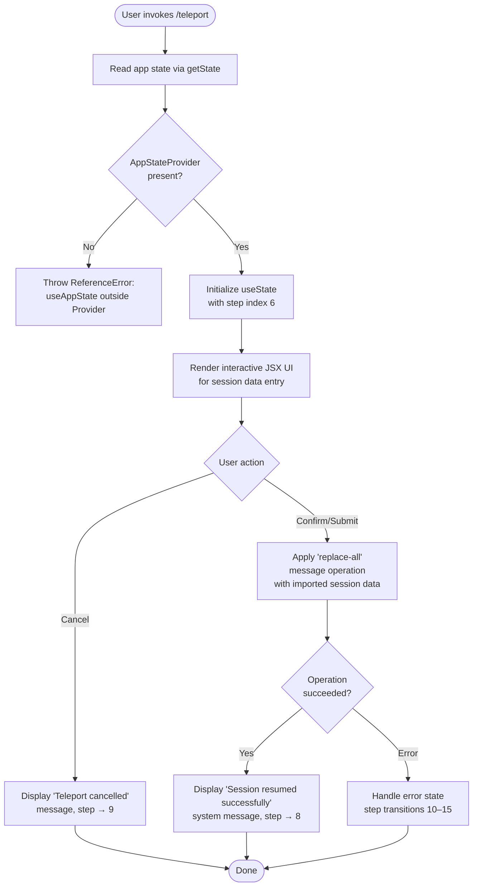

# `/teleport`

> Analysis basis: CC v2.1.169 bundle.js (AST extraction + Claude interpretation)
> Minimum version: v2.1.169

---

## Overview

`/teleport` (alias `/tp`) resumes a Claude Code session that was previously exported from claude.ai, injecting the remote session's message history into the current local session via a `replace-all` message operation. If the user confirms the import, the session is restored and a success notification is shown; if the user cancels, a "Teleport cancelled" message is displayed instead.

---

## Registration

| Field | Value |
|---|---|
| type | `local-jsx` |
| name | `teleport` |
| description | `Resume a Claude Code session from claude.ai` |
| aliases | `["tp"]` |
| isHidden | `null` (not hidden) |
| module_id | `GqK` |
| load_inline | `true` |
| loc_byte | `12505285` |
| loc_byte_end | `12505549` |
| arbor_handler.name | `upf` |
| arbor_handler.fqn | `claude-2.1.169::upf` |
| arbor_handler.kind | `AsyncFunction` |
| arbor_handler.resolution_path | `module_id` |
| arbor_handler.n_hits | `1` |

Analysis basis: CC v2.1.169 bundle.js:+12505285

---

## Input Branching

The command has 4+ distinct branches (cancellation, confirmation + success, error/outside-provider guard, and intermediate UI states), requiring a Mermaid flowchart.



---

## Behavioral Spec

### Handler Entry — Session Teleport (`upf`)

The Arbor-resolved handler `upf` is an `AsyncFunction` reached via the `module_id` resolution path (module `GqK`).

Analysis basis: CC v2.1.169 bundle.js:+12505285

```
async function sessionTeleport(commandContext):
    // Guard: must be inside AppStateProvider
    appContext = getAppContext()          // uses useContext(aJH)
    if appContext is undefined:
        throw ReferenceError(
            "useAppState/useSetAppState cannot be called outside of an <AppStateProvider />"
        )

    // Read current application state
    currentState = stateStore.getState()

    // Check initial condition (value 0 guard)
    if not Boolean(currentState):
        return early

    // Initialize React step state, starting at step index 6
    [step, setStep] = useState(6)

    // Render multi-step JSX UI (steps 6–15)
    return renderTeleportUI(step, setStep, commandContext)
```

Analysis basis: CC v2.1.169 bundle.js:+12504425, +12504460, +12504472, +12504493, +12504560

---

### UI Step State Machine

The command implements a numeric step-index state machine driven by `useState`. The step indices found in the bundle are:

| Step Index | Semantic Meaning |
|---|---|
| `6` | Initial state — prompt user to paste session data (bundle.js:+12504583) |
| `7` | Validating / processing pasted data (bundle.js:+12504593) |
| `8` | Success — "Session resumed successfully" shown (bundle.js:+12504732) |
| `9` | Cancelled — "Teleport cancelled" shown (bundle.js:+12504762) |
| `10` | Error state entry (bundle.js:+12504864) |
| `11` | Error detail display (bundle.js:+12504872) |
| `12` | Secondary error handling (bundle.js:+12504910) |
| `13` | Tertiary error handling (bundle.js:+12504921) |
| `14` | Final error state (bundle.js:+12504932) |
| `15` | Cleanup / exit step (bundle.js:+12505071) |

```
function renderTeleportUI(step, setStep, context):
    switch step:
        case 6:
            display input prompt for session data paste
            on submit  → setStep(7)
            on cancel  → setStep(9)

        case 7:
            validate and process session payload (max chunk size: 1024 bytes)
            if valid    → applyReplaceAll(sessionData); setStep(8)
            if invalid  → setStep(10)

        case 8:
            emit system message "Session resumed successfully"
            mark command type as "localCommand"
            terminate UI

        case 9:
            emit message "Teleport cancelled"
            terminate UI

        case 10..14:
            display error detail; attempt recovery or escalate
            on unrecoverable → setStep(15)

        case 15:
            final cleanup; exit
```

Analysis basis: CC v2.1.169 bundle.js:+12504583, +12504593, +12504664, +12504704, +12504778, +12505028

---

### Message Operation — Replace-All Injection

When the user confirms the teleport, the handler calls `applyMessageOp` with operation type `"replace-all"`, replacing the current conversation history with the imported session messages.

```
function applyReplaceAll(importedSessionData):
    // Truncate or chunk payload at 1024-byte boundary
    chunkedData = chunk(importedSessionData, maxSize=1024)

    // Apply replace-all operation to message queue
    messageQueue.applyMessageOp({
        type: "replace-all",
        messages: chunkedData
    })

    // Emit success as a system-role message
    emitMessage({
        role: "system",
        content: "Session resumed successfully"
    })
```

Analysis basis: CC v2.1.169 bundle.js:+12504608, +12504631, +12504664, +12504704, +16413011

---

### AppState Context Guard (`contextAccessor` / `Ov_`)

Before the main logic runs, the handler verifies it is executing inside a React `<AppStateProvider />` by reading the context value from `aJH`. If the context is absent, a `ReferenceError` is thrown immediately, preventing any state mutation.

```
function getAppContext():
    ctx = React.useContext(appStateContext)   // aJH
    if ctx is undefined or null:
        throw new ReferenceError(
            "useAppState/useSetAppState cannot be called outside of an <AppStateProvider />"
        )
    return ctx
```

Analysis basis: CC v2.1.169 bundle.js:+3864862, +3864894, +3864909

---

### Session / Transport Layer (`sessionRunner` / `L` and sub-functions)

The call graph reveals a session management layer reachable from the main handler. This layer handles lifecycle operations for the underlying transport connection.

```
function sessionLifecycle(sessionEntry):
    try:
        // Map over active sessions
        for each session in activeSessions.map():
            add session to runQueue

        // Process queue entry
        runQueue.add(sessionEntry)

    finally:
        // Always clean up on exit
        transport.close()
        runQueue.close()
        activeSessions.delete(sessionEntry)

    // Pad status string to width 40, separator "  "
    status = sessionEntry.padEnd(40, "  ")
```

Analysis basis: CC v2.1.169 bundle.js:+16512500, +16512509, +16512523, +16518551, +16518561, +16531348, +16531361, +16531382, +16533353

---

### Error / Exit Path (`errorHandler` / `$1`)

On unrecoverable error the handler emits a `cli_error` signal and terminates the process with exit code `1`.

```
function handleFatalError(err):
    emitCliError(err)          // smH — error reporting
    logError(err)              // ij  — internal log
    process.exit(1)            // exit code 1
```

Analysis basis: CC v2.1.169 bundle.js:+13208371, +13208378, +13208394, +13208381, +13208407

---

## State & Side Effects

| Item | Detail |
|---|---|
| Telemetry | No `tengu_*` events found in depth-2 traversal <!-- TODO: not found in depth-2 traversal; needs --depth 4 --> |
| React state | `useState` initialized at step index `6`; transitions through indices `6`–`15` (bundle.js:+12504560, +12504583) |
| Message queue | `applyMessageOp` called with `"replace-all"` operation type to inject imported session (bundle.js:+12504608, +12504631) |
| System message emitted | `"Session resumed successfully"` with role `"system"` on success (bundle.js:+12504664, +12504704) |
| Cancellation message | `"Teleport cancelled"` displayed when user aborts (bundle.js:+12504778) |
| Command type tag | Sets `"localCommand"` metadata on completion (bundle.js:+12505028) |
| Transport/session cleanup | `transport.close()` and `runQueue.close()` always called in `finally` block (bundle.js:+16518551, +16518561) |
| Fatal exit | `process.exit(1)` on unrecoverable CLI error (bundle.js:+13208394) |
| AppStateProvider guard | `ReferenceError` thrown if context is missing (bundle.js:+3864909) |
| Chunk size limit | Session payload processed in 1024-byte chunks (bundle.js:+16413011) |

---

## Version History

| Version | Change |
|---|---|
| v2.1.169 | Initial analysis |

---

## Common Mistakes

1. **Invoking `/teleport` outside a full Claude Code session UI context** — the command requires an active `<AppStateProvider />` in the React tree. Running it in an environment without this provider throws a `ReferenceError` immediately.
2. **Pasting malformed or truncated session data** — the handler validates the payload before applying the `replace-all` operation. Invalid data drives the step machine into error states (steps 10–14) rather than step 8 (success).
3. **Expecting the current conversation to be preserved** — `/teleport` uses a `"replace-all"` message operation, meaning the entire existing message history is overwritten by the imported session.
4. **Confusing `/tp` alias scope** — `/tp` is a registered alias for `/teleport` only within Claude Code CLI; it is not a general shell alias and will not function outside the slash-command system.
5. **Assuming telemetry is emitted** — no `tengu_*` telemetry events were found in this command's depth-2 call graph. Downstream analytics should not rely on a teleport-specific event being fired.

---

## Appendix — Identifier Mapping

> For bundle debugging only. Identifiers change across versions.

| Identifier | Role |
|---|---|
| `upf` | Main async handler for `/teleport` (Arbor-resolved, `claude-2.1.169::upf`) |
| `WqK` | JSX render function / component wrapper for the teleport UI |
| `l4` | App-state accessor — calls `useContext` to retrieve `AppStateProvider` value |
| `Ov_` | Context guard — throws `ReferenceError` if called outside `<AppStateProvider />` |
| `K` | Session map/status formatter — pads status strings, maps active sessions |
| `L` | Session lifecycle runner — manages `add`/`delete`/`finally` on run queue |
| `q` | Run queue / active-session set — exposes `add`, `close`, `delete` |
| `$1` | Fatal error handler — emits `cli_error`, calls `process.exit(1)` |
| `f` | Transport / connection object — exposes `close`, `toLowerCase` (name normalization) |
| `A` | Secondary utility called from render function; also a transport-name normalizer |