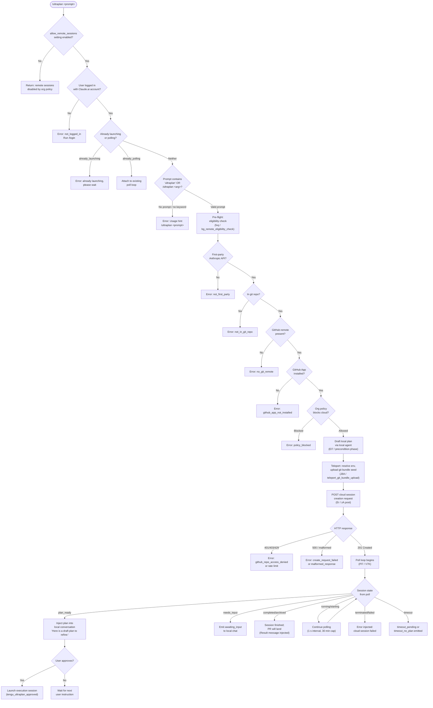

# `/ultraplan`

> Analysis basis: CC v2.1.175 bundle.js (AST extraction + Claude interpretation)
> Minimum version: v2.1.175

---

## Overview

`/ultraplan` launches a cloud-hosted planning session from Claude Code CLI, drafting an editable implementation plan on the web (claude.ai) via a remote agent ("teleport") workflow. The command validates pre-conditions (login, git repository, remote URL, GitHub App installation, org policy), uploads the local repository state as a git bundle seed, creates a background cloud session, and then polls for the session result — ultimately delivering a drafted plan back to the local conversation for the user to review and approve.

---

## Registration

| Field | Value |
|---|---|
| type | `local-jsx` |
| name | `ultraplan` |
| description | `Draft an editable plan in Claude Code on the web ( ... ) · See ...` |
| argumentHint | `<prompt>` |
| load_inline | `true` |
| load_ident | `Zl7` |
| loc_byte | `12510961` |
| loc_byte_end | `12511193` |
| loc_line | `8676` |
| arbor_handler.name | `Zl7` |
| arbor_handler.fqn | `claude-2.1.175::Zl7` |
| arbor_handler.kind | `AsyncFunction` |
| arbor_handler.resolution_path | `load_ident` |
| arbor_handler.n_hits | `1` |

Analysis basis: CC v2.1.175 bundle.js:+12510961

The handler is inlined as `load: () => Promise.resolve({ call: Zl7 })`. The Arbor symbol graph confirmed `Zl7` as the unambiguous entry point via `load_ident` resolution.

---

## Input Branching

The command has many distinct code paths based on pre-condition checks, session state, and polling outcomes. A Mermaid flowchart is used.



Analysis basis: CC v2.1.175 bundle.js:+12509094 (handler entry), +12506282 (pre-condition gating), +12509115 (`allow_remote_sessions`), +12506541 (`already_polling`), +12506559 (`already_launching`)

---

## Behavioral Spec

### 1. Entry Point — Handler (`Zl7`)

```
async function ultraplanHandler(context):
    if appState.allow_remote_sessions is falsy:
        return early (remote sessions disabled)

    prompt = extractPromptArgument(context)       // calls promptNormalizer (ax8)
    authState = getAuthState(context)             // calls authChecker (h9)

    if authState indicates not logged in:
        emit error: "Please run /login …"
        return

    sessionFlags = getSessionFlags(context)       // reads H, z$H

    result = await launchPlan(context, prompt, authState, sessionFlags)  // Hp6

    appState = _.getAppState()                    // bundle.js:+12509429
    _.setAppState(updatedState)                   // bundle.js:+12509651

    if result is error:
        emit error and telemetry tengu_ultraplan_create_failed
    else:
        return plan result to conversation
```

Analysis basis: CC v2.1.175 bundle.js:+12509094

---

### 2. Prompt Normalization (`ax8` / `ox8` / `_4A`)

```
function normalizePrompt(rawInput):
    // ox8: strip leading/trailing whitespace, parse inline tokens
    tokens = parseTokenStream(rawInput)            // _4A

    for token in tokens:
        if token.startsWith(knownPrefix):          // H.startsWith  +10818650
            closeActiveSegments(token)             // L  +10818848
            pushSegment(token)                     // q.push  +10818867

    matches = rawInput.matchAll(regex_gi)          // H.matchAll  +10819056  flag "gi" +10819048
    existing = segments.some(matchesCriteria)      // q.some  +10819148

    if "ultraplan" literal found in input:         // literal +10819400
        push recognized segment                    // M.push  +10819328

    // ax8 post-processing: slice prompt, apply replacement pattern
    sliced = rawInput.slice(boundary)              // H.slice  +10819628
    cleaned = sliced.replace(pattern, "$1$2")      // A.replace, literal "$1$2" +10819725
    // truncate to 5-word summary if needed        // literal 5  +10819748

    return { prompt: cleaned, segments: M }
```

Analysis basis: CC v2.1.175 bundle.js:+10819600

Segment buffer `M` (descriptor: segment accumulator) feeds the downstream eligibility check and display layer. The `"ultraplan"` literal at +10819400 is the keyword the parser searches for when the user embeds the word anywhere in free-form input rather than using the slash command directly.

---

### 3. Auth / Eligibility Check (`h9` / `fIH` / `nLH`)

```
function checkAuth(context):
    config = readConfig()                          // fIH -> aJ6 -> IU1.readFileSync  +2530744
    tier   = config.tier                           // literals: "firstParty" +2530386,
                                                   //           "enterprise" +2530659,
                                                   //           "team"       +2530694

    if config.has(m04) or config.has(p04):         // +2530904, +2530936
        // account-level flag check
        pass

    allowed = checkTelemetryPolicy(config)         // qq -> QgA -> K6  +2530948
    //   "no-telemetry" +1046409, "essential-traffic" +1046350
    //   "allow_product_feedback" +2530960

    features = loadFeatureFlags(config)            // ULH  +2530986
    // checks "allow_remote_sessions" +12509115

    if not features.allow_remote_sessions:
        return { ok: false, reason: "policy_blocked" }

    return { ok: true, tier, config }
```

Analysis basis: CC v2.1.175 bundle.js:+2530888

---

### 4. Remote Eligibility Pre-flight (`fvq`)

```
async function bgRemoteEligibilityCheck(context):
    // telemetry: "bg_remote_eligibility_check"  +9412585
    await h9(context)                              // auth re-check

    if provider is not first-party:
        // "Cloud sessions are only available on the first-party Anthropic API provider."
        return { ok: false, code: "not_first_party" }   // +9338174

    if not inGitRepo:
        return { ok: false, code: "not_in_git_repo" }   // +9414544

    gitRemoteUrl = getGitRemoteUrl()               // c8H -> git config --get remote.origin.url +1141427
    if not gitRemoteUrl:
        // "Cloud agents require a GitHub remote…"  +9414700
        return { ok: false, code: "no_git_remote" } // +9414678

    if gitRemoteUrl contains "github.com":          // +9413184
        githubAppInstalled = checkGithubAppInstalled()  // VuH  +9287133
        if not githubAppInstalled:
            return { ok: false, code: "github_app_not_installed" }  // +9414791

    if byoc mode:                                  // "byoc" +9412896
        // seed-bundle mode enabled                // tengu_ccr_bundle_seed_enabled  +9412988
        pass

    return { ok: true }
```

Analysis basis: CC v2.1.175 bundle.js:+9412515

---

### 5. Local Plan Draft (`El7` — "precondition" phase)

Before launching the remote session the command first runs a **local agent pass** to produce an initial draft plan:

```
async function localPlanDraft(context, prompt, authState):
    // phase tag: "precondition"  +12507134

    // Register task notification  +12507310
    registerTaskNotification("task-notification")  // u9 -> pvA.register  +64135

    // Run local workflow to gather context
    localResult = await runLocalWorkflow(context, prompt)  // xGH -> fvq

    // Construct plan text for display
    planLines = buildPlanLines(localResult)        // Xl7  +12502148
    planLines.push("Here is a draft plan to refine:")  // literal  +12502155
    planLines = planLines.join(delimiter)          // Xl7 -> q.join  +12502238

    // Open cloud.ai browser session link
    sessionUrl = resolveClaudeAiUrl(env)           // BY -> S_ -> cm_
    //   local:   "http://localhost:4000"           // +5202004
    //   staging: "https://claude-ai.staging.ant.dev" // +5202046
    //   prod:    "https://claude.ai"               // +5202088

    // Update session store
    updateSessionStore(planResult)                 // Pl7

    if launchFailed:
        // telemetry: tengu_ultraplan_create_failed  +12506319
        // error tag: "create_api_fail"  +12507702
        // error tag: "teleport_null"    +12507720
        return error

    // telemetry: tengu_ultraplan_launched  +12508026
    return { ok: true, planLines, sessionUrl }
```

Analysis basis: CC v2.1.175 bundle.js:+12507051

Label `"Refine local plan"` (+12507466) and type tag `"plan"` (+12507501) are attached to the UI element that presents the draft. The `"cli"` literal (+12507939) marks the session origin.

---

### 6. Teleport — Git Bundle Upload (`J8A`)

```
async function teleportGitBundleUpload(context, options):
    // telemetry: tengu_ccr_bundle_upload  +9322690

    if not inGitRepo:
        throw Error("Not in a git repository")    // +9322458

    // Clean stale seed refs
    git("update-ref", "-d", "refs/seed/stash")    // +9322549, +9322562
    git("update-ref", "-d", "refs/seed/root")

    // Check for commits
    commitCount = git("for-each-ref", "--count=1", "refs/")  // +9322600, +9322615, +9322627
    if commitCount == 0:
        // "Repository has no commits yet"         // +9322808
        return { status: "empty_repo" }           // +9322426

    // Create git stash
    stashRef = git("stash", "create")             // +9322886, +9322894
    headRef  = git("rev-parse", "--verify", "HEAD")  // +9323238–9323261

    if stash creation failed:
        return { status: "stash_failed" }         // +9323335

    // Write bundle file: "ccr-seed.bundle"        // +9323693, +9323704
    // Full path template: "_source_seed.bundle"   // +9324000
    bundleFile = writeBundleFile(stashRef, headRef)

    uploadResult = postBundle(bundleFile, presignedUrl)
    // HTTP 200 expected                           // +9323214

    if uploadResult.status == "failed":
        return { status: "upload_failed" }        // +9324149

    cleanup: fs.unlink(bundleFile)                // t96.unlink  +9324645

    return {
        status: "success",                        // +9324301
        bundleMode: one of:
            "head"             // +9324370
            "fallback_head"    // +9324409
            "squashed"         // +9324444
            "fallback_squashed"// +9324487
    }
```

Analysis basis: CC v2.1.175 bundle.js:+9322368

---

### 7. Cloud Session Creation (`Er`)

```
async function createCloudSession(prompt, env, bundleResult, authState):
    // Resolve access token (m1)                  // +9338923
    if no access token:
        throw Error("No access token found…")     // +9338238
        // code: "no_access_token"                // +9338511

    // Resolve org UUID                           // QC  +9339568
    if no org UUID:
        throw Error("Unable to get organization UUID…")  // +9338565
        // code: "no_org_uuid"                    // +9338807

    // Build request headers
    headers = {
        "anthropic-beta":       "ccr-byoc-2025-07-29",  // +9338984
        "x-organization-uuid":  orgUuid,                 // +9339006
        "Content-Type":         "application/json",      // +2490293/2490308
        "anthropic-version":    "2023-06-01",            // +2490347
    }

    // Resolve bundle/source mode               // telemetry: tengu_teleport_bundle_mode  +9339334
    // phase log: "[teleport] phase: POST-sent" // +9345928

    response = await apiClient.post(endpoint, payload, headers)  // zA.post  +9340207

    if response.status == 500:
        return { error: "create_request_failed" }   // +9340597
    if response.status in [401, 403, 429]:
        return { error: "github_repo_access_denied" }  // +9340419
    if response.status == 201 and no session_id:
        return { error: "malformed_response" }       // +9340811

    // telemetry: tengu_ccr_session_link  +9332673
    // phase log: "[teleport] phase: env-select"   // +9340959

    return { sessionId: response.body.id }
```

Analysis basis: CC v2.1.175 bundle.js:+9337927

---

### 8. Environment Selection (`MHH` / `c96`)

```
async function resolveCloudEnvironment(authState):
    // telemetry: teleport_environments_list  +9284795

    environments = await apiClient.get(envListEndpoint)  // zA.get  +9285350

    if no environments:
        // Auto-create default cloud environment
        // telemetry: teleport_default_environment_create  +9285715
        newEnv = await createDefaultEnv(authState)       // c96 -> zA.post  +9286107
        // Default env spec:
        //   name:        "Default - trusted network access"  // +9286160
        //   provider:    "anthropic_cloud"                   // +9286130
        //   homeDir:     "/home/user"                        // +9286236
        //   pythonVer:   "3.11"                              // +9286315
        //   nodeVer:     "20"                                // +9286344
        return newEnv

    // pick first matching environment
    // timeout for env fetch: 15 000 ms           // +9285430
    return environments[0]
```

Analysis basis: CC v2.1.175 bundle.js:+9284792

---

### 9. Poll Loop (`Pl7` / `V7K`)

```
async function pollCloudSession(sessionId, context):
    // telemetry: tengu_ultraplan_timeout_seconds  +12501814
    // Max timeout: 5 400 s (~90 min ceiling in V7K)  // +12501848

    startTime = Date.now()                         // Pl7 -> Date.now  +12502292
    pollIntervalMs = 1 000                         // +9421060
    maxSessionMs   = 1 800 000  (30 min)           // +9421067

    loop:
        sessionData = pollSessionState(sessionId)  // wl7 -> z6  +12501811

        switch sessionData.status:
            case "plan_ready":
                // telemetry: tengu_ultraplan_plan_ready  +12502526
                planText = extractPlan(sessionData)
                injectToConversation("Here is a draft plan to refine:", planText)
                waitForUserApproval()              // → tengu_ultraplan_approved  +12502946
                break loop

            case "needs_input":
                // telemetry: tengu_ultraplan_awaiting_input  +12502458
                notifyUser("awaiting input")
                continue

            case "requires_action":
                // handle mid-session permission request
                continue

            case "running" | "starting":
                // log progress; keep polling
                sleep(pollIntervalMs)
                continue

            case "completed" | "archived":
                // "Results will land as a pull request when the cloud session finishes."
                // literal  +12503436
                injectResultMessage()
                break loop

            case "terminated" | "failed":
                // telemetry: tengu_ultraplan_failed  +12503835
                // "Cloud ultraplan session failed…"  // +12504259
                injectErrorMessage()
                break loop

        elapsed = Date.now() - startTime
        minutesElapsed = Math.round(elapsed / 60 000)  // +12493994

        if sessionData.status == "pending" and elapsed > timeoutPending:
            emit "timeout_pending"                 // +12494217
            break loop
        if plan never arrived and elapsed > maxSessionMs:
            emit "timeout_no_plan"                 // +12494235
            break loop

    cleanup: archiveOrphanedSession(sessionId)
    // "ultraplan: failed to archive orphaned session"  // +12508779
```

Analysis basis: CC v2.1.175 bundle.js:+12502292

---

### 10. Session Monitoring / Remote Workflow Driver (`uuH` / `Ovq`)

```
async function monitorRemoteSession(sessionId, context):
    // telemetry tag: "remote_agent"  +9419382
    sessionToken = generateSessionToken()         // By -> c0K.randomBytes  +13566509

    openBrowserSession(sessionUrl, sessionToken)  // x96 -> V6H.open  +13565434
    // marks session "pending"                   // +13566632

    pollResult = await pollSessionMessages(sessionId)  // Ovq

    // Ovq internals:
    //   - uses 1 000 ms interval / 1 800 000 ms max  // +9421060, +9421067
    //   - recognises message types:
    //       "assistant"       // +9421338
    //       "result"          // +9422074
    //       "hook_progress"   // +9422257
    //       "hook_response"   // +9422286
    //       "hook_started"    // +9422777
    //       "SessionStart"    // +9422867
    //       "remote-workflow" // +9421720
    //   - session states polled:
    //       "idle"            // +9422693
    //       "starting"        // +9423094
    //       "running"         // +9419490
    //       "completed"       // +9421586
    //       "archived"        // +9421511
    //   - error messages:
    //       "cloud session returned an error"          // +9423668
    //       "cloud session exceeded 30 minutes"        // +9423708
    //       "no review output — orchestrator may …"    // +9423744

    return pollResult
```

Analysis basis: CC v2.1.175 bundle.js:+9419379

---

### 11. Duplicate / Re-entry Guard (`Hp6`)

```
async function launchPlan(context, prompt, authState, flags):
    // Guard: "already_polling"    +12506541
    // Guard: "already_launching"  +12506559
    if activeSessionSet.has(sessionKey):
        if state == "already_launching":
            emitError("ultraplan: already launching. Please wait for the session to start.")
            // literal  +12505094
            return
        if state == "already_polling":
            attachToExistingPoll()
            return

    // Usage guard
    if prompt is empty and input does not contain "ultraplan":
        emitError("Usage: /ultraplan \\<prompt\\>, or include "ultraplan" anywhere in your prompt")
        // literals  +12506606, +12506672
        return

    // Register in flight
    activeSessionSet.add(sessionKey)              // f -> q.add  +16883376
    try:
        result = await runSession(context, prompt, authState, flags)
    finally:
        activeSessionSet.delete(sessionKey)       // f -> q.delete  +16883399

    return result
```

Analysis basis: CC v2.1.175 bundle.js:+12506282

---

### 12. User Approval / Plan Injection (`Pl7` continuation)

```
function injectPlanAndAwaitApproval(planText, sessionId):
    // Display label: "Ultraplan"  +12508190
    // Display sub-label: "Refine local plan"  +12507466

    uiMessage = buildTaskMessage({
        type: "precondition",
        content: planText,
        label: "Ultraplan",
        sessionType: "cli",                        // +12507939
    })

    showMessageInChat(uiMessage)
    // "Here is a draft plan to refine:" prefix    // +12502155

    // agent receives system prompt fragment:
    // "Results will land as a pull request when the cloud session finishes.
    //  There is nothing to do here."              // +12503436

    // On session failure, agent receives:
    // "Cloud ultraplan session failed. Wait for the user's next instructions." // +12504259

    if unexpectedError:
        // code: "unexpected_error"  +12508446
        // "Ultraplan hit an unexpected error during launch…"  // +12508618
        emit tengu_ultraplan_create_failed

    // telemetry on invocation type:
    // "slash"  +12509240
```

Analysis basis: CC v2.1.175 bundle.js:+12502155

---

## State & Side Effects

| Item | Detail |
|---|---|
| Telemetry — ultraplan lifecycle | `tengu_ultraplan_create_failed` (+12506319), `tengu_ultraplan_prompt_identifier` (+12501981), `tengu_ultraplan_launched` (+12508026), `tengu_ultraplan_timeout_seconds` (+12501814), `tengu_ultraplan_awaiting_input` (+12502458), `tengu_ultraplan_plan_ready` (+12502526), `tengu_ultraplan_approved` (+12502946), `tengu_ultraplan_failed` (+12503835) |
| Telemetry — teleport / CCR | `tengu_ccr_bundle_seed_enabled` (+9412988), `tengu_ccr_bundle_upload` (+9322690), `tengu_teleport_bundle_mode` (+9339334), `tengu_ccr_session_link` (+9332673), `tengu_teleport_source_decision` (+9344810) |
| Telemetry — background / infra | `tengu_bg_dispatch_sigkill_escalate` (+16877366), `tengu_bg_low_mem_mb` (+13321809), `tengu_bg_dispatch_low_mem` (+16877967), `tengu_bg_spare_enable` (+16878671), `tengu_bg_sendclaim_failed` (+16856159), `tengu_bg_spare_claim` (+16878799), `tengu_bg_spare_claim_fail` (+16879065), `tengu_scheduled_task_missed` (+16371033), `tengu_feature_bad` (+1017218), `tengu_feature_ok` (+1017151), `tengu_config_parse_error` (+3330793) |
| `appState` reads | `_.getAppState()` (+12509429): reads `allow_remote_sessions` flag before launch |
| `appState` writes | `_.setAppState(…)` (+12509651): updates session state after launch completes or fails |
| In-flight guard set | A `Set` (via `f` / `oTA`) tracks active session keys; `q.add` on entry, `q.delete` in `finally` — prevents concurrent launches (+16883376, +16883399) |
| File I/O | `IU1.readFileSync` (config, UTF-8, +2530744); git bundle written to temp path `_source_seed.bundle` then `t96.unlink` on cleanup (+9324645); `nK.unlink` for temp file cleanup (+13474225); `q.copyFileSync` for config backup (+3331301) |
| Git operations | `git stash create`, `git rev-parse --verify HEAD`, `git update-ref -d refs/seed/*`, `git for-each-ref --count=1 refs/`, `git config --get remote.origin.url`, `git symbolic-ref --short refs/remotes/origin/HEAD` |
| Network | HTTP POST to cloud sessions endpoint (axios, `zA.post`, header `anthropic-beta: ccr-byoc-2025-07-29`); HTTP GET for environment list; S3 presigned PUT for bundle upload |
| Browser | Opens `https://claude.ai` (prod) / `https://claude-ai.staging.ant.dev` (staging) for the plan editing session (`V6H.open`, +13565434) |
| Token | `c0K.randomBytes` generates an 8-byte session token (+13566509) for the browser hand-off |
| Poll timing | 1 000 ms interval (+9421060); 1 800 000 ms (30 min) cloud-side cap (+9421067); 5 400 s (~90 min) local poller ceiling (+12501848); 60 000 ms per-minute display unit (+12493994) |
| Sound | <!-- TODO: not found in depth-2 traversal; needs --depth 4 --> |
| Hook registration | Task notification hook registered via `pvA.register` (`u9`, +64135) during the precondition phase |

---

## Version History

| Version | Change |
|---|---|
| v2.1.175 | Initial analysis |

---

## Common Mistakes

1. **Not logged in to Claude.ai**: `/ultraplan` requires a Claude.ai account login (`/login`), not just an API key. API-key-only auth is explicitly rejected with the `not_logged_in` code.
2. **Missing or non-GitHub git remote**: The command requires a GitHub remote (`git remote add origin <REPO_URL>`). Non-GitHub remotes (`no_git_remote`) or repositories without any remote will fail at eligibility.
3. **GitHub App not installed**: Even with a GitHub remote, the Anthropic GitHub App must be installed on the repository's org/account. The check can fail silently if no access token or org UUID is available.
4. **Running `/ultraplan` twice**: A duplicate invocation while a session is launching or polling triggers a guard error (`already_launching`) rather than a second session. Wait for the first session to complete.
5. **Empty repository**: A git repo with no commits will fail with `empty_repo`. Run `git add . && git commit -m "initial"` before invoking the command.
6. **Organization policy block**: Enterprise/team accounts may have cloud sessions disabled via org policy (`policy_blocked`). Contact your org admin to enable them.
7. **Omitting the prompt**: Invoking `/ultraplan` with no argument and no `"ultraplan"` keyword in context produces a usage hint error, not a session launch.

---

## Appendix — Identifier Mapping

> For bundle debugging only. Identifiers change across versions.

| Identifier | Role |
|---|---|
| `Zl7` | Main async handler for `/ultraplan` (entry point via `load_ident`) |
| `ax8` | Prompt normalization wrapper |
| `ox8` | Token stream parser (called by `ax8`) |
| `_4A` | Segment accumulation / keyword scan (called by `ox8`) |
| `h9` | Auth and feature-flag state checker |
| `kU1` | Config loader orchestrator |
| `fIH` | Config file reader |
| `Lb` | Config parser (tier / flags) |
| `aJ6` | Raw config file reader (`readFileSync`, UTF-8) |
| `nLH` | Feature inclusion checker |
| `qq` | Telemetry policy resolver |
| `QgA` | Telemetry mode mapper |
| `K6` | String normalizer utility |
| `ULH` | Feature flag lookup |
| `z$H` | Session flags accessor |
| `Hp6` | Launch guard and session coordinator |
| `d` | App state accessor |
| `M6` | UI display helper |
| `d56` | Core display primitive |
| `f` | In-flight session guard (Set wrapper) |
| `R7K` | Session state reader |
| `uB8` | Session store accessor |
| `xB8` | Session store implementation |
| `z6` | Session store core (get/set/has) |
| `Dl7` | Session store cleanup |
| `El7` | Local plan draft orchestrator (precondition phase) |
| `xGH` | Local workflow runner wrapper |
| `fvq` | Background remote eligibility checker |
| `d9` | React/UI component primitive |
| `iG` | UI base component |
| `J5` | UI layout helper |
| `Xl7` | Plan text builder |
| `Jl7` | Plan text formatter |
| `Er` | Cloud session creation (teleport main) |
| `b6` | API provider resolver |
| `V4` | Auth token reader |
| `DO` | Token refresh handler |
| `Tk8` | Auth token builder |
| `SH` | Error log helper |
| `Hb` | HTTP error classifier |
| `m1` | Access token resolver (local/staging/prod) |
| `XD` | HTTP client builder |
| `J8A` | Git bundle upload (teleport seed) |
| `h6` | Component base |
| `N` | Log level formatter |
| `A6` | App-state writer |
| `QC` | Git remote URL resolver |
| `hVq` | Control-request event builder |
| `_R6` | Session payload builder |
| `RH` | JSON stringify wrapper |
| `NVq` | Session link logger |
| `fk8` | Session phase logger |
| `MHH` | Environment list fetcher |
| `c96` | Default environment creator |
| `TH` | String coercion utility |
| `O` | Session object collection |
| `B57` | Branch/title generator |
| `kS` | GitHub preflight checker |
| `VuH` | GitHub App installation checker |
| `WI` | Default branch resolver |
| `U1` | Permission mode handler |
| `c8H` | Git remote URL parser |
| `i` | Permission allow-list |
| `GA` | Error constructor helper |
| `tz` | Cancel-error classifier |
| `vz` | Abort-error classifier |
| `BY` | Claude.ai URL opener |
| `S_` | Browser open utility |
| `cm_` | Claude.ai URL resolver |
| `Gl7` | Session status updater |
| `uuH` | Remote session monitor (opens browser, launches poll) |
| `By` | Session token generator |
| `x96` | Browser session opener |
| `lW` | Session timestamp recorder |
| `GM7` | Session metadata builder |
| `Ovq` | Remote session message poller |
| `Gh` | Task event dispatcher |
| `QX7` | Task started event handler |
| `FX7` | Task updated event handler |
| `_` | Task/agent state store |
| `u9A` | Agent state updater |
| `dX7` | Task detail updater |
| `cX7` | Task field updater |
| `zKH` | Agent state reader |
| `Pl7` | Poll loop controller (plan_ready / timeout handling) |
| `V7K` | Poll iteration executor |
| `wl7` | Session state getter |
| `Tl7` | Session state parser |
| `ER6` | Temp file cleanup helper |
| `K` | String padding utility |
| `zU` | Session archive helper |
| `u9` | Hook registration wrapper |
| `Wl7` | Orphaned session archiver |
| `C6` | Config file watcher |
| `o6` | File path resolver |
| `nV_` | Path normalizer |
| `U7H` | Config file loader (with backup/migration) |
| `d6` | JSON parse wrapper |
| `ru` | Path prefix stripper |
| `E8` | Error type constant |
| `t19` | Backup directory scanner |
| `rV_` | Backup path builder |
| `$` | File entry helper |
| `D` | Background session daemon dispatcher |
| `b` | Background process manager |
| `i8` | Process timeout wrapper |
| `CH` | Feature OK telemetry emitter |
| `kH` | Feature error telemetry emitter |
| `ng8` | Low-memory checker |
| `UG6` | Process memory reader |
| `Q` | PTY socket manager |
| `dTA` | Daemon socket claim handler |
| `oTA` | Background session lifecycle manager |
| `Y` | Forced shutdown handler |
| `B` | Process event listener |
| `sp4` | Config file watcher (watchFile/unwatchFile) |
| `yF` | Config change callback |
| `a46` | Parallel pre-flight check runner |