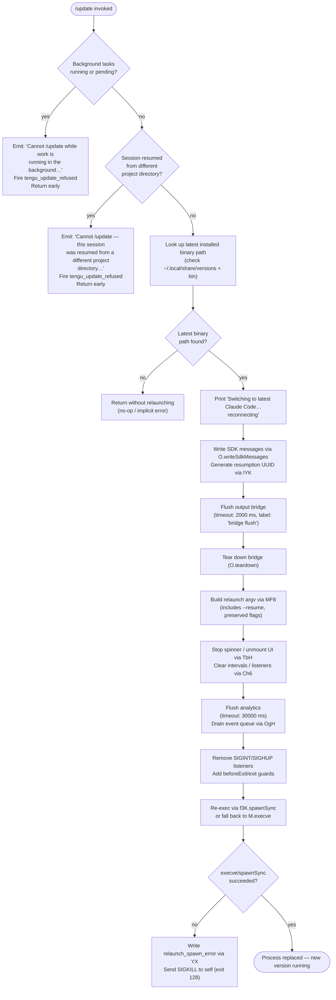

# `/update`

> Analysis basis: CC v2.1.175 bundle.js (AST extraction + Claude interpretation)
> Minimum version: v2.1.175

---

## Overview

`/update` switches the running Claude Code process to the latest installed version without ending the current conversation. It validates preconditions (no background work in flight, matching project directory), emits a status message to the user, flushes and tears down the current session infrastructure, then relaunches itself via `execve`/`spawnSync` with a `--resume` flag so the conversation state is carried forward.

---

## Registration

| Field | Value |
|---|---|
| type | `local` |
| name | `update` |
| description | `Switch to the latest version (conversation continues)` |
| loc_byte | `12960094` |
| loc_byte_end | `12960335` |
| loc_line | `9147` |
| supportsNonInteractive | `false` |
| isHidden | `true` |
| module_id | `kYK` |
| load_inline | `true` |
| arbor_handler.name | `hs7` |
| arbor_handler.fqn | `claude-2.1.175::hs7` |
| arbor_handler.kind | `AsyncFunction` |
| arbor_handler.resolution_path | `module_id` |
| arbor_handler.n_hits | `0` |

Analysis basis: CC v2.1.175 bundle.js:+12960094

---

## Input Branching

The handler has 4+ distinct branches: blocked by background work, blocked by mismatched project directory, successful update path, and error/cleanup sub-paths.



---

## Behavioral Spec

### 1. Precondition Check — Background Work

```
function checkBackgroundWorkBlocked(appState):
    statuses = Object.values(appState.backgroundTasks)
    for status in statuses:
        if status == "running" or status == "pending":
            return true
    return false
```

If any background task is in a `"running"` or `"pending"` state the command emits the hard-coded refusal message ("Cannot /update while work is running in the background — wait for it to finish, then try again.") and fires the `tengu_update_refused` telemetry event, then returns without proceeding.

Analysis basis: CC v2.1.175 bundle.js:+12958257, +12958279, +12958360, +12957996

---

### 2. Precondition Check — Project Directory Mismatch

```
function checkDirectoryMismatch(currentSession):
    if sessionWasResumedFromDifferentProjectDir(currentSession):
        return true
    return false
```

If the session was resumed from a project directory that differs from the current working directory, the command emits the second refusal message ("Cannot /update — this session was resumed from a different project directory…") and returns.

Analysis basis: CC v2.1.175 bundle.js:+12958604

---

### 3. Binary Path Resolution (`binaryPathResolver` / `pR`)

```
function binaryPathResolver():
    versionsDir = path.join(homeDir(), ".local", "share", "versions")
    candidates   = listVersionEntries(versionsDir)           // jS8 helper
    binDir       = path.join(homeDir(), ".local", "share", "bin")  // v9H helper
    return resolvedPath
```

The helper `jS8` normalises the version directory list (using `Array.isArray` and `iuH.join`) while `rMH` resolves the home directory via `os.homedir()` and `_N6.join`. The sibling helper `v9H` resolves the `bin` sub-path the same way.

Analysis basis: CC v2.1.175 bundle.js:+12957949, +9594336, +9594356, +6934441, +6934714, +6934723, +6934794

---

### 4. Status Message Emission

```
function emitSwitchingMessage(outputWriter):
    outputWriter.writeTextBlock("Switching to latest Claude Code… reconnecting")
```

The literal `"Switching to latest Claude Code… reconnecting"` is sent as a `"text"` content block via the output writer before any teardown begins.

Analysis basis: CC v2.1.175 bundle.js:+12959116, +12958042

---

### 5. Session Flush & Teardown

```
async function flushAndTeardown(bridge, timeout_ms = 2000):
    bridge.writeSdkMessages(resumePayload)           // include assistant-prefixed UUID
    await timedRace(bridge.flush(), timeout_ms, "bridge flush")
    bridge.teardown()
```

`C4` implements the timed race: it uses `setTimeout` / `Promise.race` / `clearTimeout` with a 2000 ms deadline labelled `"bridge flush"`.

Analysis basis: CC v2.1.175 bundle.js:+12959092, +12959183, +12959186, +12959237, +12959196, +12959201, +2482711, +2482742, +2482789

---

### 6. Resumption UUID Generation (`IYK`)

```
function generateResumptionId():
    return UF8.randomUUID()   // crypto.randomUUID
```

A fresh UUID is generated and embedded into the SDK messages written before teardown so the resumed session can be correlated with the previous one.

Analysis basis: CC v2.1.175 bundle.js:+12959112, +12956969

---

### 7. Relaunch Argument Assembly (`MF8`)

```
function buildRelaunchArgv(originalArgv, sessionState):
    args = Array.from(originalArgv)
    args.push("--resume")
    if sessionState.addDirs:
        for dir in sessionState.addDirs:
            args.push("--add-dir", dir)
    if sessionState.effort:
        args.push("--effort", sessionState.effort)
    if sessionState.permissionMode:
        args.push("--permission-mode", sessionState.permissionMode)
    if sessionState.allowDangerouslySkipPermissions:
        args.push("--allow-dangerously-skip-permissions")
    return args.flatMap(identity).filter(nonEmpty)
```

The function uses `Array.from`, conditional push operations, and a final `flatMap`/`filter` pass. The `--resume`, `--add-dir`, `--effort`, `--permission-mode`, and `--allow-dangerously-skip-permissions` flags are forwarded.

Analysis basis: CC v2.1.175 bundle.js:+12959418, +12679716, +12679863, +12679891, +12679913, +12679950, +12679995, +12680006, +12680110, +12680148, +12680165, +12678367

---

### 8. UI Teardown (`TbH` + `Ch6`)

```
function teardownUI(inkInstance):
    stopSpinner()                          // Ch6 → Hn_ → clearInterval
    inkInstance.unmount()                  // H.unmount
    writeSync(terminalOutputBuffer)        // j3H.writeSync
    restoreTerminalState()                 // b$8 → escape sequences \x1b7/\x1b8
```

The UI is unmounted via the Ink render instance. Terminal save/restore escape sequences (`\x1b7` / `\x1b8`) are written synchronously. Terminal multiplexer detection (tmux, screen) influences whether full-screen mode is used.

Analysis basis: CC v2.1.175 bundle.js:+12678389, +12678395, +7405253, +7405331, +7405365, +7405413, +3860354, +3860365

---

### 9. Analytics Flush & Queue Drain

```
async function flushAnalyticsAndDrain(timeout_ms = 30000):
    await timedRace(analyticsFlush(), timeout_ms, "flush timeout (relaunch)")
    await timedCleanup(timeout_ms, "cleanup timeout")
    await timedRace(analyticsDrain(), timeout_ms, "analytics flush timeout")
    pvA.drain()    // OgH
```

Three separate timed-race calls guard analytics teardown. Timeouts are 30 000 ms each.

Analysis basis: CC v2.1.175 bundle.js:+12678426, +12678429, +12678485, +12678541, +30000, +12678434, +12678440, +12678496, +12678552

---

### 10. Re-exec via `execve` / `spawnSync` (`q3K`)

```
function reexecProcess(binaryPath, argv, env):
    // Platform-specific native library
    if platform == "macos":
        lib = dlopen("/usr/lib/libSystem.B.dylib", { execve: { args: ["ptr","ptr","ptr"], returns: "int" } })
    else:
        lib = dlopen("libc.so.6", ...)
    encoded = Buffer.from(argv, "utf8")
    M.execve(binaryPath, encoded, env)   // native execve replaces process image
    // Fallback if execve returns (should not happen):
    fallbackSpawnSync(binaryPath, argv, { stdio: "inherit" })
    process.exit(128)
```

The function uses Bun FFI (`bun:ffi`) to call the POSIX `execve` syscall directly, which atomically replaces the running process image with the new binary. Before exec it sets up `beforeExit` / `exit` guards and removes SIGINT/SIGHUP listeners.

Analysis basis: CC v2.1.175 bundle.js:+12677463, +12677471, +12677494, +12677507, +12677515, +12677544, +12677571, +12677598, +12677626, +12677647, +12677870, +12678907, +12678926, +12678936, +12678966, +12678993, +12679082, +12679123, +12679242, +12679307, +12679355

---

### 11. Spawn Error Handling (`YX`)

```
function handleRelaunchSpawnError(errorInfo, logDir):
    writeFileSync(path.join(logDir, "relaunch_spawn_error"), JSON.stringify(errorInfo))
    process.kill(process.pid, "SIGKILL")
```

If the relaunch attempt fails (execve returned or spawnSync errored), a `relaunch_spawn_error` file is written to the log directory and the process terminates with exit code 128 via SIGKILL.

Analysis basis: CC v2.1.175 bundle.js:+12679215, +12679218, +196667, +196685, +12679355

---

### 12. Daemon Stop Helpers (`z` / `ZS`)

```
async function stopDaemon():
    try:
        kH.stop()    // daemon_stop
        CH.stop()
    catch:
        logTelemetry("tengu_daemon_control", { event: "daemon_stop_failed" })
    signal("daemon_stop")
```

The `z` function attempts to gracefully stop daemon-side infrastructure before the exec. `ZS` handles IPC/socket cleanup and pushes items to a `Sl` list.

Analysis basis: CC v2.1.175 bundle.js:+16914475, +16914498, +16914550, +16914478, +16914515, +16914553

---

## State & Side Effects

| Item | Detail |
|---|---|
| Telemetry — `tengu_update_refused` | Fired when background work is running/pending or project directory is mismatched (bundle.js:+12957996) |
| Telemetry — `tengu_scroll_summary` | Fired inside the scroll/summary helper (`LG8`) during session save (bundle.js:+7407087) |
| Telemetry — `tengu_amber_creek` / `tengu_pewter_brook` | Fired by fullscreen-mode detection helper (`k1`) (bundle.js:+3520927, +3520835) |
| Telemetry — `tengu_bg_dispatch_sigkill_escalate` | Fired if background session requires SIGKILL escalation (bundle.js:+16877366) |
| Telemetry — `tengu_config_parse_error` | Fired on config parse failure during relaunch prep (bundle.js:+3330793) |
| Telemetry — `tengu_daemon_control` | Fired on daemon stop success/failure (bundle.js:+16914553) |
| Telemetry — `tengu_disable_bypass_permissions_mode` | Fired when bypass-permissions mode is removed before relaunch (bundle.js:+4282589) |
| Telemetry — `tengu_feature_bad` / `tengu_feature_ok` | Fired by feature-flag checks (bundle.js:+1017218, +1017151) |
| Telemetry — `tengu_bg_*` | Various background-session lifecycle events (bundle.js:+16877682, +16878671, +16878799, +16879065, +16877967, +13321809) |
| appState changes | `_.getAppState` read before flush; `_.setAppState` called to mark update in progress (bundle.js:+12958852, +12959006) |
| Hook registration | `pvA.register` called via `u9`/`z4` for lifecycle hooks; hooks drained via `pvA.drain` before relaunch (bundle.js:+64135, +64178) |
| Conversation history append | `_.appendEntry` called via `lwA` to append a `"last-prompt"` entry (bundle.js:+13489950, +13489970) |
| SDK message write | `O.writeSdkMessages` writes assistant-prefixed UUID message before teardown (bundle.js:+12959092, +12956945) |
| File write on error | `xgH.writeFileSync` writes `relaunch_spawn_error` log file on spawn failure (bundle.js:+196667) |
| Process signal handling | SIGINT/SIGHUP listeners removed; `beforeExit`/`exit` guards registered; SIGKILL sent on failure (bundle.js:+12678907, +12678926, +12678936, +12678966, +12679307) |
| Sound | <!-- TODO: not found in depth-2 traversal; needs --depth 4 --> |

---

## Version History

| Version | Change |
|---|---|
| v2.1.175 | Initial analysis |

---

## Common Mistakes

1. **Running `/update` while a background task is active** — The command will refuse with an explicit message. Wait for all background tasks to reach a non-`running`/non-`pending` state before invoking `/update`.
2. **Using `/update` after `--resume` from a different project directory** — If the session was resumed across project boundaries the command will refuse. Re-invoke with an explicit `--resume` from the correct directory instead.
3. **Expecting `/update` to appear in the slash-command menu** — The registration sets `isHidden: true`, so the command does not surface in autocomplete; it must be typed manually.
4. **Expecting instant reconnection** — The flush and analytics-drain timeouts can take up to 30 seconds each before the new process launches.
5. **Assuming the conversation is lost** — The handler writes resumption UUID into the SDK message stream and passes `--resume` to the new binary, so conversation context is carried forward.

---

## Appendix — Identifier Mapping

> For bundle debugging only. Identifiers change across versions.

| Identifier | Role |
|---|---|
| `hs7` | Main update command handler (AsyncFunction) — arbor_handler |
| `BF8` | Binary path resolution entry wrapper (calls `Y3` and `pR`) |
| `Y3` | `Bun.which`-based binary lookup |
| `yuA` | Thin wrapper around `Bun.which` |
| `pR` | Full binary path resolver (versions dir + bin dir) |
| `jS8` | Version-directory list normaliser |
| `d$` | Array-isArray guard helper |
| `rMH` | Home-directory + `.local/share` path builder |
| `e28` | `os.homedir()` wrapper |
| `v9H` | Home-directory + `.local/share/bin` path builder |
| `P9` | Background-task state reader (checks `running`/`pending`) |
| `fjH` | Task-state predicate helper |
| `d` | Generic debug/log helper |
| `SJ` | Process basename resolver (uses `yJ.basename`) |
| `h6` | Ink / React render helper |
| `iG` | JSX/render primitive |
| `Mk` | App-state accessor |
| `NzA` | CWD-match / directory-change helper (uses `$3K.dirname`) |
| `W_` | Inner `iG` render call inside directory helper |
| `yf` | Inner `iG` render call inside directory helper |
| `eKH` | Assistant-message prefix constant builder (`"assistant-"`) |
| `P6H` | Hook-type filter (`"attachment"`, `"hook_success"`, `"ant"`) |
| `vQ8` | Hook payload validator |
| `lwA` | Conversation-entry appender (writes `"last-prompt"`) |
| `z4` | Lifecycle-hook register helper |
| `u9` | `pvA.register` wrapper |
| `_` | App-state / conversation store (shared context object) |
| `SH` | Telemetry/network client wrapper |
| `GA` | Error-to-string converter |
| `K6` | String coercion helper |
| `qq` | Network queue processor |
| `QgA` | Queue entry builder |
| `mxf` | Circular queue shift/push helper |
| `EG` | appState mutation helper |
| `O` | Output bridge (writeSdkMessages, flush, teardown) |
| `C8` | Bridge internal transport |
| `IYK` | Resumption UUID generator (`UF8.randomUUID`) |
| `C4` | Timed-race (Promise.race + setTimeout + clearTimeout) |
| `lXH` | String-based content block builder |
| `mEH` | Full relaunch orchestrator (stat, teardown, exec) |
| `Ch6` | Spinner / interval stopper |
| `Hn_` | `clearInterval` wrapper |
| `TbH` | UI unmount + terminal-state restore |
| `H` | Ink render instance (also used as a render host) |
| `vb` | Terminal raw-mode toggle |
| `b$8` | Terminal output writer (escape sequences, ANSI) |
| `ZkH` | Terminal emulator version checker (ghostty, iTerm) |
| `DkH` | Terminal detection helper |
| `F0` | tmux/screen escape-sequence rewriter |
| `vM` | Terminal size helper |
| `N` | ANSI colour/style formatter |
| `LG8` | Scroll/summary persister (fires `tengu_scroll_summary`) |
| `P0` | Scroll-summary state reader |
| `N8q` | Summary threshold checker |
| `v8q` | Scroll-metric calculator (Date.now, Math.max, Math.round) |
| `Z8q` | Scroll-state updater |
| `k1` | Fullscreen mode controller (fires amber_creek / pewter_brook) |
| `b8H` | Feature-flag presence check (`dRf.has`) |
| `TN_` | Feature-flag string normaliser |
| `os` | OS detection helper |
| `GN_` | Windows-over-SSH detector |
| `a_` | Fullscreen grant helper |
| `Hg4` | Fullscreen sub-helper |
| `z6` | Render-slot state machine |
| `bZ` | Analytics-flush timed-race wrapper |
| `OgH` | Analytics event queue drainer (`pvA.drain`) |
| `ZbH` | Analytics flush with Promise.resolve fallback |
| `KG8` | Analytics inner flush |
| `q3K` | Native re-exec via `execve` (Bun FFI, platform-specific libc) |
| `L` | FFI library handle (dlopen result) |
| `A` | FFI symbol map |
| `q` | Active-connection/IPC set |
| `f` | Connection lifecycle manager |
| `$` | Pending-spawn tracker |
| `hjK` | Spawn-event logger |
| `D` | Background-session / daemon manager |
| `b` | Individual daemon session object |
| `i8` | Abort-signal timed helper |
| `CH` | Daemon stop handler (feature_bad path) |
| `kH` | Daemon stop handler (feature_ok path) |
| `ng8` | Low-memory background dispatcher helper |
| `UG6` | Config file reader (reads JSON, filters entries) |
| `Q` | IPC socket connection manager |
| `dTA` | Background session claim/connect helper |
| `oTA` | Background session lifecycle FSM |
| `Y` | Forced-shutdown / process.exit wrapper |
| `E8` | Event emitter helper |
| `A6` | Async helper with `d56` |
| `B` | Disposable resource wrapper |
| `M` | MCP / background daemon orchestrator (execve entry) |
| `DCH` | MCP server connection factory |
| `ki8` | MCP `applyMcpUpdate` caller |
| `sGA` | MCP client synchroniser |
| `z` | Daemon stop sequencer |
| `ZS` | IPC/socket cleanup sequencer |
| `aU` | Graceful-exit with Promise.race + process.exit |
| `TH` | String-based error formatter |
| `YX` | Relaunch-spawn-error file writer |
| `MF8` | Relaunch argv builder (`--resume`, `--add-dir`, flags) |
| `hVH` | Session state extractor for argv rebuild |
| `mK8` | Boolean coercion / flag normaliser |
| `C6` | Config file watcher / Bun config reader |
| `o6` | Config path resolver |
| `nV_` | Config schema validator |
| `U7H` | Config file reader + directory scanner |
| `sp4` | `fs.watchFile`-based config watcher |
| `b_` | Session state serialiser (working_directory, allowed_tools, etc.) |
| `Ex8` | `allowed_tools` serialiser |
| `j1` | Tool-list formatter |
| `Zx8` | `disallowed_tools` serialiser |
| `mb` | `disable`/`bypassPermissions` flag serialiser |
| `v$` | Session effort/model/max_thinking_tokens extractor |