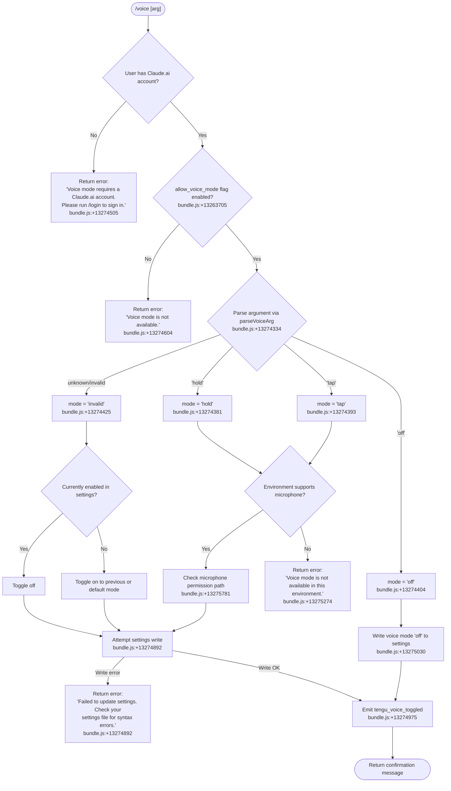

# `/voice`

> Analysis basis: CC v2.1.175 bundle.js (AST extraction + Claude interpretation)
> Minimum version: v2.1.175

---

## Overview

The `/voice` command toggles voice mode in Claude Code, allowing users to select between `hold`, `tap`, or `off` activation modes. It validates prerequisites (Claude.ai account login, feature flag `allow_voice_mode`, environment microphone availability) before writing the chosen mode to user settings, and emits a telemetry event on each successful toggle. The command is not available in non-interactive sessions.

---

## Registration

| Field | Value |
|---|---|
| type | `local` |
| name | `voice` |
| description | `Toggle voice mode` |
| argumentHint | `[hold\|tap\|off]` |
| supportsNonInteractive | `false` |
| isHidden | `null` |
| module_id | `CPK` |
| load_inline | `true` |
| loc_byte | `13276979` |
| loc_byte_end | `13277221` |
| loc_line | `9688` |
| arbor_handler.name | `x85` |
| arbor_handler.fqn | `claude-2.1.175::x85` |
| arbor_handler.kind | `AsyncFunction` |
| arbor_handler.resolution_path | `module_id` |
| arbor_handler.n_hits | `1` |

Analysis basis: CC v2.1.175 bundle.js:+13276979

---

## Input Branching

The handler has more than three distinct branches keyed on argument value, account state, feature-flag state, and environment availability; a Mermaid flowchart is used.



---

## Behavioral Spec

### Top-level handler: voiceCommandHandler (x85)

Analysis basis: CC v2.1.175 bundle.js:+13274464

```
async function voiceCommandHandler(commandArgs, appContext):

    # 1. Account check
    authState = getAuthState(appContext)          # calls cw → bundle.js:+13274475
    if authState does not include a Claude.ai account:
        return textMessage("Voice mode requires a Claude.ai account. Please run /login to sign in.")
        # bundle.js:+13274505

    # 2. Feature flag check
    voiceAllowed = checkFeatureFlag("allow_voice_mode", appContext)   # mg8 → bundle.js:+13263705
    if not voiceAllowed:
        return textMessage("Voice mode is not available.")
        # bundle.js:+13274604

    # 3. Parse argument
    rawArg   = commandArgs.trim()                 # b85 → bundle.js:+13274334
    mode     = parseVoiceArg(rawArg)              # returns "hold" | "tap" | "off" | "invalid"
    # "hold"    bundle.js:+13274381
    # "tap"     bundle.js:+13274393
    # "off"     bundle.js:+13274404
    # "invalid" bundle.js:+13274425

    # 4. If mode is "invalid" (no recognizable arg), derive from current state
    if mode == "invalid":
        currentMode = readCurrentVoiceMode(appContext)
        mode = (currentMode != "off") ? "off" : "hold"   # toggle behaviour

    # 5. Environment availability check (for hold / tap)
    if mode in ["hold", "tap"]:
        envAvailable = checkVoiceEnvironment()    # bundle.js:+13275274
        if not envAvailable:
            return textMessage("Voice mode is not available in this environment.")

    # 6. Microphone permission hint (macOS path shown to user)
    if mode in ["hold", "tap"]:
        # Surface privacy path if needed: bundle.js:+13275781
        # "System Settings → Privacy & Security → Microphone"
        maybeShowMicrophonePermissionHint()

    # 7. Write setting
    writeResult = writeVoiceModeSetting(mode, appContext)   # wA → bundle.js:+13274794
    if writeResult is error:
        return textMessage("Failed to update settings. Check your settings file for syntax errors.")
        # bundle.js:+13274892

    # 8. Emit telemetry
    emitTelemetry("tengu_voice_toggled", { mode })   # bundle.js:+13274975

    # 9. Respond
    if mode == "off":
        return textMessage("Voice mode disabled.")   # bundle.js:+13275030
    else:
        return successMessage(mode)
```

### Authentication / account resolution (cw, uL6)

Analysis basis: CC v2.1.175 bundle.js:+13263638

```
function resolveAccountState(appContext):
    # uL6 branches into two sub-checks
    oauthState   = getOAuthCredentials(appContext)   # sp6 → bundle.js:+13263754
    featureFlags = loadFeatureFlags(appContext)       # mg8 → bundle.js:+13263761
    return { oauthState, featureFlags }
```

### Feature flag resolver (mg8 → h9)

Analysis basis: CC v2.1.175 bundle.js:+13263702

```
function checkVoiceModeFlag(appContext):
    settings = loadSettingsFromDisk()      # h9 → bundle.js:+13263702
    # Checks policy set (enterprise / team plan checks)
    # "enterprise" bundle.js:+2530659 , "team" bundle.js:+2530694
    # "allow_voice_mode" flag key bundle.js:+13263705
    policyValue = settings.policySettings.get("allow_voice_mode")
    return policyValue != false
```

### Argument parser (b85)

Analysis basis: CC v2.1.175 bundle.js:+13274334

```
function parseVoiceArg(raw):
    trimmed = raw.trim()
    switch trimmed:
        case "hold"    → return "hold"    # bundle.js:+13274381
        case "tap"     → return "tap"     # bundle.js:+13274393
        case "off"     → return "off"     # bundle.js:+13274404
        default        → return "invalid" # bundle.js:+13274425
```

### Settings writer (wA)

Analysis basis: CC v2.1.175 bundle.js:+13274794

```
async function writeVoiceModeSetting(mode, appContext):
    configPath  = resolveSettingsPath()           # es6 / eu → .claude/settings.json
    currentText = readFileSync(configPath, "utf8")
    newText     = patchJsonSetting(currentText, "voice", mode)
    try:
        writeFileAtomically(configPath, newText)  # Ww6 atomic write with temp file
        clearSettingsCache()                       # rO → bundle.js:+1318228
        return { ok: true }
    catch error:
        return { ok: false, error }
```

### Keybinding registration for push-to-talk (H2)

Analysis basis: CC v2.1.175 bundle.js:+13276240

```
function registerVoiceKeybindings(mode, appContext):
    # Registers the action "voice:pushToTalk"   bundle.js:+13276243
    # Context: "Chat"                            bundle.js:+13276262
    # Default key: "Space"                       bundle.js:+13276269
    # Only active when mode != "off"
    keybindingConfig = loadKeybindingConfig()    # dkH → bundle.js:+3949152
    if mode in ["hold", "tap"]:
        registerAction("voice:pushToTalk", context="Chat", defaultKey="Space")
    else:
        unregisterAction("voice:pushToTalk")
```

### MCP / app-state refresh (M → sGA → DCH)

Analysis basis: CC v2.1.175 bundle.js:+13275549

```
function refreshMCPAndAppState(appContext):
    # After settings change, the MCP server list and internal
    # connection map are re-evaluated via sGA → DCH.
    # This is a shared side-effect path also used by other commands.
    mcpConnectionManager.syncAll(appContext)
```

---

## State & Side Effects

| Item | Detail |
|---|---|
| Telemetry | `tengu_voice_toggled` (bundle.js:+13274975); `tengu_feature_ok` (bundle.js:+1017151); `tengu_feature_sad` (bundle.js:+1017299); `tengu_feature_bad` (bundle.js:+1017218) |
| Settings write | Patches `~/.claude/settings.json` with the chosen voice mode value; atomic write via temp-file pattern (bundle.js:+1318086) |
| Settings cache cleared | `rO` (clearCaches) is called after every successful write (bundle.js:+1318228) |
| Keybinding registration | `voice:pushToTalk` action registered in `Chat` context with `Space` key when mode is `hold` or `tap` (bundle.js:+13276243) |
| appState changes | Voice mode flag propagates to the interactive UI rendering layer; MCP connection state is re-synced via `sGA`/`DCH` (bundle.js:+13275549) |
| Sound | None detected in depth-2 traversal |
| Hook registration | `pvA.register` called during settings file watcher setup via `u9` (bundle.js:+64135) |
| Non-interactive | `supportsNonInteractive: false` — command is rejected in headless/non-interactive invocations (bundle.js:+13276979) |

---

## Version History

| Version | Change |
|---|---|
| v2.1.175 | Initial analysis |

---

## Common Mistakes

1. **Running `/voice` without being logged in to Claude.ai** — The command explicitly checks for a Claude.ai OAuth account before anything else. Use `/login` first; API-key-only setups will receive the "requires a Claude.ai account" error (bundle.js:+13274505).
2. **Running in a non-interactive shell or pipe** — `supportsNonInteractive` is `false`; the command will be silently unavailable in CI or piped sessions (bundle.js:+13276979).
3. **Passing an unrecognised argument** — Any value other than `hold`, `tap`, or `off` is treated as `invalid` and triggers the toggle-from-current-state behaviour rather than an error (bundle.js:+13274425).
4. **Expecting voice to work without an `allow_voice_mode` policy flag** — Enterprise and team accounts may have this feature disabled at the policy level; the command returns "Voice mode is not available" without further explanation (bundle.js:+13274604).
5. **Ignoring the microphone permission message on macOS** — When the system microphone permission is not granted, the path hint `System Settings → Privacy & Security → Microphone` is shown (bundle.js:+13275781), but the mode may still be written to settings; the audio input will simply fail silently until the OS permission is granted.

---

## Appendix — Identifier Mapping

> For bundle debugging only. Identifiers change across versions.

| Identifier | Role |
|---|---|
| `x85` | Main async handler for `/voice` command (`voiceCommandHandler`) |
| `uL6` | Account/credential resolution (auth + feature flags) |
| `ug8` | Inner auth-state fetch helper |
| `cw` | Auth configuration reader |
| `D7` | Auth token retrieval utility |
| `Ij` | OAuth credential resolution (profile-implicit / user_oauth paths) |
| `V4` | First-party credential check |
| `IP` | Auth-info accessor |
| `XO` | Auth environment variable checker (ANTHROPIC_API_KEY etc.) |
| `qW6` | Auth state helper (claude-desktop-3p path) |
| `woH` | Auth state accessor |
| `iE` | Feature flag fetcher |
| `sp6` | OAuth credentials getter |
| `mg8` | `allow_voice_mode` flag loader |
| `h9` | Settings-from-disk reader for feature flags |
| `kU1` | Settings file initializer |
| `Lb` | Settings loader (per-scope) |
| `qq` | Essential-traffic policy check |
| `ULH` | Policy settings accessor |
| `fIH` | Settings merger/finalizer |
| `a_` | Telemetry/logging initializer |
| `gB` | Telemetry dispatcher / settings load orchestrator |
| `nG` | Telemetry event name resolver |
| `Lq` | Memory usage recorder for telemetry |
| `Su` | `perf_hooks` `require` wrapper |
| `I4_` | Settings loader core (loadSettingsFromDisk) |
| `R8` | Log file appender |
| `lQ6` | Settings log helper |
| `OY6` | Flag settings accumulator |
| `yiA` | Settings object keys enumerator |
| `f` | Async queue / in-flight set |
| `K` | In-flight request tracker |
| `uYH` | User settings path builder (`.claude/settings.json`) |
| `L` | Active connection/session map |
| `FB` | SDK inline settings reader |
| `hiA` | SDK inline settings applier |
| `nC` | Settings layer compositor |
| `W_` | WSL environment detector |
| `bM6` | Settings layer: `bM6` |
| `Ba8` | Settings layer: `Ba8` |
| `SM6` | Settings layer: `SM6` |
| `kVH` | Settings layer: `kVH` |
| `SVH` | Settings layer: `SVH` |
| `uM6` | Settings layer: `uM6` |
| `t8H` | Settings layer: `t8H` |
| `pYH` | Settings layer: `pYH` |
| `$t6` | Settings layer: `$t6` |
| `ciA` | Settings layer: `ciA` |
| `ca` | Settings layer: `ca` |
| `zY6` | WSL / platform-specific settings layer |
| `cQ6` | Settings cache-clear helper |
| `tp6` | Telemetry path helper |
| `b85` | Voice argument parser (`parseVoiceArg`) |
| `H` | Random / timer utility (also used for arg trimming) |
| `wA` | Settings file writer (`writeVoiceModeSetting`) |
| `p3` | Path resolver for settings |
| `o6` | File path utility |
| `h4_` | Settings write helper |
| `c2` | Config file locator |
| `pa` | Config file reader |
| `M$` | Real path resolver |
| `N` | File encoding detector |
| `Wa6` | Config path helper |
| `Ga6` | Config content slicer |
| `y8` | ENOENT error checker |
| `E8` | Error code extractor |
| `uf_` | Timestamp setter (Date.now cache) |
| `bNH` | Settings write path builder |
| `es6` | Settings directory resolver (`.claude`) |
| `Ww6` | Atomic file writer (temp-file + rename) |
| `O` | Background session state holder |
| `C8` | Session state constant |
| `RH` | JSON serializer |
| `rO` | Settings/cache invalidator |
| `Os6` | Settings patch writer |
| `b6` | Async store getter |
| `Pa6` | AsyncLocalStorage getStore |
| `Pf_` | Settings zone resolver |
| `A` | String utility (toLowerCase etc.) |
| `$s6` | Git ignore checker |
| `c_` | Git command runner |
| `dpf` | Path normalizer (home-dir expansion) |
| `IlA` | Already-tracked file checker |
| `ylA` | Settings write warning logger |
| `eu` | Settings path joiner |
| `kH` | Feature telemetry emitter (`tengu_feature_ok/bad/sad`) |
| `d` | App state accessor |
| `A6` | App state updater |
| `d56` | App state root |
| `t6` | Feature-sad telemetry emitter |
| `CH` | Conditional settings-write guard |
| `SH` | Message queue / chat output pusher |
| `GA` | Error-to-string converter |
| `K6` | String coercer |
| `mxf` | Message queue ring-buffer manager |
| `M` | MCP connection manager top-level |
| `DCH` | MCP server connection dispatcher |
| `Vi` | MCP server list builder |
| `uV6` | MCP server entry builder |
| `ze` | MCP connection resolver |
| `yg` | SDK MCP server enumerator |
| `cX8` | MCP error colorizer |
| `bV6` | MCP transport factory |
| `eV` | MCP event emitter |
| `fw` | MCP message formatter |
| `aB_` | MCP abort handler |
| `n8` | MCP debug logger |
| `kv6` | MCP connection filter |
| `Hi9` | MCP hash / cache key computer |
| `gg_` | MCP session fingerprinter |
| `l2H` | MCP object hasher |
| `SJ8` | MCP schema key extractor |
| `RJ8` | MCP tool definition hasher |
| `rX` | MCP content hasher |
| `yJ8` | MCP server fingerprinter |
| `Sf` | SHA-256 utility wrapper |
| `z8` | MCP debug log pusher |
| `DP8` | MCP OAuth + connection handler |
| `yEL` | MCP OAuth config extractor |
| `dc` | Token storage accessor |
| `t1H` | MCP claudeai-proxy message builder |
| `e1H` | MCP authentication event handler |
| `O9H` | MCP OAuth local server |
| `nH6` | MCP pending-auth map manager |
| `Y` | Process exit handler |
| `JP8` | MCP session ID generator |
| `hi` | MCP reconnect handler |
| `su` | Token key constant |
| `w` | Supervisor / daemon writer |
| `YL` | MCP error logger |
| `TH` | String coercion helper |
| `kEL` | MCP auth timeout |
| `IEL` | MCP SSH detection for claudeai-proxy |
| `jP8` | MCP complete-authentication tool handler |
| `lH6` | MCP pending connection getter |
| `iH6` | MCP auth pending-entry getter |
| `$i9` | MCP needs-auth cache reader |
| `n9` | AsyncLocalStorage store getter |
| `Y28` | MCP needs-auth cache path builder |
| `$F_` | MCP connection result validator |
| `j` | Process kill array |
| `S` | Child process manager |
| `nN` | MCP skills telemetry emitter |
| `z6` | MCP skills collector |
| `oB_` | MCP server filter (disabled check) |
| `X8` | MCP server config parser |
| `y` | Usage credits warning emitter |
| `qs` | Usage type checker |
| `Ki9` | MCP config integer parser |
| `Kg` | Async iterator / stream handler |
| `W66` | MCP integer config parser A |
| `D28` | MCP integer config parser B |
| `ki8` | MCP connection result applier |
| `YCH` | MCP tool list hasher |
| `AG` | MCP connection cleanup orchestrator |
| `X66` | MCP cleanup helper |
| `$` | MCP connection scheduler |
| `hjK` | Daemon status writer |
| `Ls` | Daemon log helper |
| `Rp6` | Daemon status path builder |
| `sGA` | MCP full sync / retry orchestrator |
| `tX8` | MCP transport capability checker |
| `i8` | Timeout-with-abort helper |
| `H2` | Keybinding loader + push-to-talk registration |
| `OO8` | Keybinding config outer loader |
| `dkH` | Keybinding file parser |
| `py_` | Keybinding schema validator |
| `aF` | Keybinding platform filter |
| `wf` | Keybinding default set builder |
| `J5H` | Keybinding file path builder |
| `d6` | JSON parser wrapper |
| `LO8` | Keybinding array validator |
| `qO8` | Keybinding entry expander |
| `XO9` | Keybinding action table |
| `uy_` | Keybinding duplicate detector |
| `my_` | Keybinding block merger |
| `zO8` | Keybinding default config builder |
| `Qy_` | Keybinding platform selector |
| `gy_` | Keybinding platform entry builder |
| `$O9` | Keybinding map constructor |
| `Oo4` | Keybinding entry formatter |
| `M6` | App state updater (alternate) |
| `iFH` | Locale/language detector |
| `C6` | File context reader / CLAUDE.md loader |
| `nV_` | CLAUDE.md path builder |
| `U7H` | Global config file reader |
| `ru` | Config version prefix stripper |
| `t19` | Config backup directory scanner |
| `rV_` | Backup path builder |
| `D` | Daemon background session manager |
| `b` | Background session worker |
| `ng8` | Low-memory checker |
| `UG6` | Usage file reader |
| `Q` | Background PTY reconnect handler |
| `dTA` | Daemon socket claim sender |
| `oTA` | Background session lifecycle manager |
| `B` | Session record holder |
| `sp4` | Settings file watcher |
| `yF` | Settings file watch callback |
| `u9` | File watch registration (`pvA.register`) |