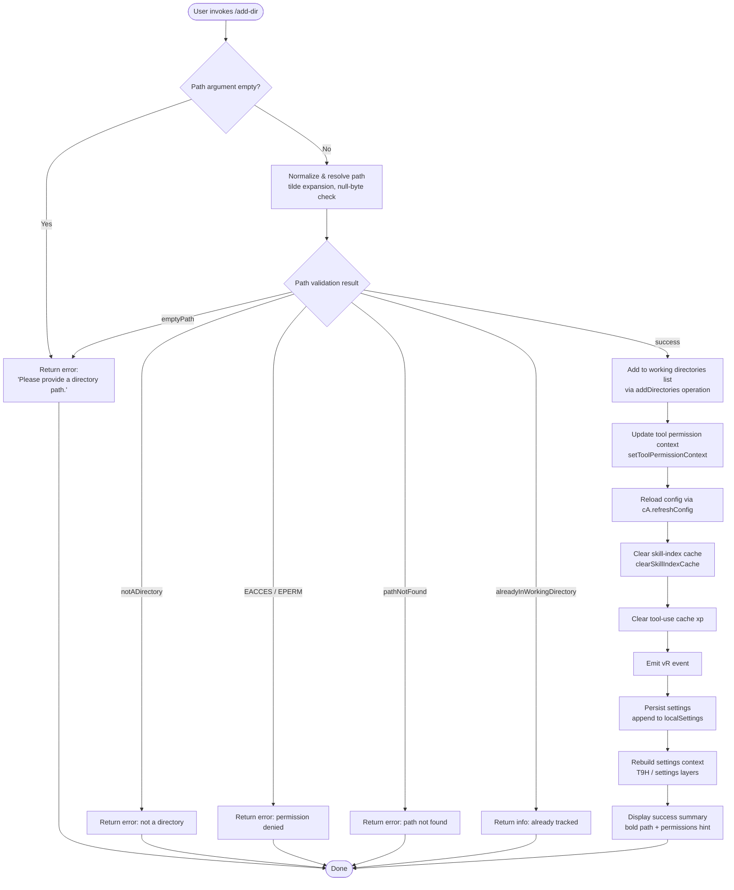

# `/add-dir`

> Analysis basis: CC v2.1.176 bundle.js (AST extraction + Claude interpretation)
> Minimum version: v2.1.176

---

## Overview

`/add-dir` allows users to register an additional working directory with the Claude Code session at runtime. It resolves and validates the supplied path, then appends the directory to the session's active working-directory list so that subsequent tool calls can operate within it. The command performs permission checks, path normalization (including tilde expansion), and updates both the session tool-permission context and the persisted configuration.

---

## Registration

| Field | Value |
|---|---|
| type | `local-jsx` |
| name | `add-dir` |
| description | `Add a new working directory` |
| argumentHint | `<path>` |
| module_id | `vsq` |
| load_inline | `true` |
| loc_byte | `11240200` |
| loc_byte_end | `11240348` |
| loc_line | `7320` |
| arbor_handler.name | `MRL` |
| arbor_handler.fqn | `claude-2.1.176::MRL` |
| arbor_handler.kind | `AsyncFunction` |
| arbor_handler.resolution_path | `module_id` |
| arbor_handler.n_hits | `0` |

Analysis basis: CC v2.1.176 bundle.js:+11240200

---

## Input Branching

The handler has more than three distinct outcome branches based on path validation and directory state, so a Mermaid flowchart is used.



Analysis basis: CC v2.1.176 bundle.js:+11238934 (handler entry `MRL`), +3931020 (error-code literals), +3931464 (`success` literal)

---

## Behavioral Spec

### 1. Handler Entry (`MRL`)

The top-level async handler `MRL` orchestrates the full add-directory flow:

```
async function addDirHandler(input, context):
    path = input.argument          // <path> token from the command line

    // Step 1 – resolve & validate path
    result = await validateAndResolvePath(path)   // csH

    if result.status != "success":
        return renderErrorMessage(result)         // see §2

    // Step 2 – retrieve current session state
    sessionState = getSessionState(context)       // u_

    // Step 3 – apply addDirectories update
    applySettingsUpdate(sessionState, {           // FO
        operation: "addDirectories",
        path: result.resolvedPath
    })

    // Step 4 – update tool permission context
    context.setToolPermissionContext(...)         // _.setToolPermissionContext

    // Step 5 – cascade invalidation
    await refreshConfig(context)                  // cA.refreshConfig
    await clearSkillIndexCache(context)           // YU / Av
    clearToolUseCache()                           // xp → Tu6.clear
    emitChangeEvent()                             // vR.emit

    // Step 6 – persist to localSettings
    await persistLocalSettings(result, context)   // o5A

    // Step 7 – rebuild and re-evaluate settings layers
    await rebuildSettingsContext(context)         // T9H / CP9

    // Step 8 – render success UI
    return renderSuccess(result)                  // bold path + dim hint
```

Analysis basis: CC v2.1.176 bundle.js:+11238934–11239756

---

### 2. Path Validation (`csH`)

Path validation is a multi-stage async function that resolves the raw string into a canonical absolute path and checks filesystem state:

```
async function validateAndResolvePath(rawPath):
    if rawPath is null or rawPath.trim() == "":
        return { status: "emptyPath" }

    // Normalize: tilde expansion, null-byte detection, platform quirks
    normalized = normalizePath(rawPath)           // W1
        // handles "~/..." via os.homedir()
        // rejects strings containing null bytes
        // calls path.normalize, path.resolve, path.isAbsolute
        // applies /var/ → /tmp substitution on some platforms  // iV

    // Filesystem stat
    try:
        stat = await fs.stat(normalized)          // cw9.stat
    catch err:
        if err.code == "ENOENT":
            return { status: "pathNotFound" }
        if err.code in ["EACCES", "EPERM"]:
            return { status: err.code }
        return { status: "pathNotFound" }

    if not stat.isDirectory():
        return { status: "notADirectory" }

    // Duplicate detection against current working directory list
    currentDirs = getCurrentWorkingDirs(context) // u_
    if normalized is already in currentDirs:
        return { status: "alreadyInWorkingDirectory" }

    return { status: "success", resolvedPath: normalized }
```

Error-code literals confirmed: `"emptyPath"` (+3931020), `"notADirectory"` (+3931118), `"EACCES"` (+3931223), `"EPERM"` (+3931237), `"pathNotFound"` (+3931263), `"alreadyInWorkingDirectory"` (+3931388), `"success"` (+3931464).

Analysis basis: CC v2.1.176 bundle.js:+3931039

---

### 3. Session-State Retrieval (`u_`)

```
function getSessionStateForAddDir(context):
    appState = H.getAppState(context)             // H.getAppState
    // Finds the last matching session entry
    entry = appState.findLast(item =>
        item.working_directory  // literal key +10759788
        && item.allowed_tools   // literal key +10759843
        && item.disallowed_tools // literal key +10759898
        && item.avoid_prompts   // literal key +10759959
    )
    return entry
```

Relevant configuration keys extracted from literals: `"working_directory"` (+10759788), `"allowed_tools"` (+10759843), `"disallowed_tools"` (+10759898), `"avoid_prompts"` (+10759959), `"bypassPermissions"` (+10760092), `"permission_mode"` (+10760061).

Analysis basis: CC v2.1.176 bundle.js:+10759683

---

### 4. Settings Update Application (`FO`)

`FO` applies structured update operations to the live settings map:

```
function applySettingsUpdate(sessionState, update):
    switch update.operation:
        case "addDirectories":   // literal +11238970
            sessionState.set(update.path, ...)    // A.set
        case "addRules":         // literal +5149720
            // adds to alwaysAllowRules / alwaysDenyRules / alwaysAskRules
        case "replaceRules":     // literal +5150068
            ...
        case "removeRules":      // literal +5150725
            ...
        case "removeDirectories": // literal +5151109
            sessionState.delete(update.path)      // A.delete
        case "setMode":          // literal +5149356
            if mode == "bypassPermissions" and not allowed:
                log("Ignoring permission update: setMode 'bypassPermissions' rejected...")
                // emits tengu_disable_bypass_permissions_mode
            ...

    // Filter active entries after mutation
    active = K.filter(sessionState, entry => not f.has(entry))
```

Analysis basis: CC v2.1.176 bundle.js:+5149442

---

### 5. Local-Settings Persistence (`o5A`)

```
async function persistLocalSettings(resolvedPath, context):
    // Determine settings file location
    settingsDir = path.join(resolvedPath, ".claude")   // Q$.join +13529661
    settingsFile = path.join(settingsDir, "settings.local.json") // "settings.local.json" +1303755

    // Resolve real path
    realPath = await fs.realpath(settingsDir)    // nK.realpath +13529503

    // Read existing file (utf8) or start fresh
    existing = await fs.readFile(settingsFile, "utf8")  // "utf8" +13529704
    parsed = JSON.parse(existing) or {}

    // Append new directory entry
    await fs.mkdir(settingsDir, { recursive: true, mode: 0o700 })  // mode 448 +13529828
    await fs.appendFile(settingsFile, ...)      // nK.appendFile +13529867

    return result
```

File-permission constant: `448` (octal `0o700`) at +13529828; `384` (octal `0o600`) at +13529895.

Analysis basis: CC v2.1.176 bundle.js:+13529468

---

### 6. Settings Layer Rebuild (`T9H`)

After persistence, the full settings context is rebuilt from all layers:

```
async function rebuildSettingsContext(context):
    // Layer precedence (low → high)
    layers = [
        loadLayer("policySettings"),    // literal +5147592
        loadLayer("projectSettings"),   // literal +5151538
        loadLayer("userSettings"),      // literal +5151518
        loadLayer("localSettings"),     // literal +11239017
        loadLayer("flagSettings"),      // literal +1322780
    ]
    merged = mergeSettingsLayers(layers)  // zA
    context.applyMergedSettings(merged)

    // Emit change notification
    XlH.emit(...)
```

Analysis basis: CC v2.1.176 bundle.js:+5151576

---

### 7. Success / Error Rendering (`MRL` output section)

```
function renderResult(status, resolvedPath):
    if status == "success":
        line1 = bold(resolvedPath)                       // X6.bold +11239232
        line2 = dim("· /permissions to manage")         // X6.dim  +11239518
                                                         // literal +11239525
        return [line1, line2]

    if status == "emptyPath" or arg was blank:
        return "Please provide a directory path."        // literal +3931549

    if status == "alreadyInWorkingDirectory":
        // informational, not an error
        ...

    // Generic failure fallback
    return "Did not add a working directory."            // literal +11239661

    // Unknown-error fallback label
    // "Unknown error"                                   // literal +11239417
```

Analysis basis: CC v2.1.176 bundle.js:+11239232

---

### 8. CLI Alias

The command also registers a CLI flag alias `--add-dir` (literal `"--add-dir"` at +11239184) used in the `CP9` / `T9H` pipeline, allowing programmatic invocation from the command line to produce the same effect.

Analysis basis: CC v2.1.176 bundle.js:+11239184

---

## State & Side Effects

| Item | Detail |
|---|---|
| Telemetry | `tengu_disable_bypass_permissions_mode` (+4295143) — fired when a `setMode:"bypassPermissions"` attempt is blocked |
| Telemetry | `tengu_daemon_config_reload` (+16997877) — fired on watcher config reload inside path-validation flow |
| Telemetry | `tengu_feature_ok` (+1018758) — generic success path in feature-gate helper |
| Telemetry | `tengu_feature_bad` (+1018825) — generic rejection path in feature-gate helper |
| Telemetry | `tengu_daemon_control` (+17019560) — daemon lifecycle event reached through deep call path |
| Telemetry | `tengu_bg_state_read_transient` (+4261246) — background-state read in settings-persistence helper |
| Telemetry | `tengu_feature_sad` (+1018906) — error branch in feature-gate helper |
| appState changes | New directory appended to `working_directory` list in live session state; `setToolPermissionContext` updated |
| Config refresh | `cA.refreshConfig()` called to reload merged config after directory addition |
| Cache invalidation | `clearSkillIndexCache` (`H.clearSkillIndexCache`) called via `YU`; tool-use cache cleared via `xp → Tu6.clear` |
| Event emission | `vR.emit` fires a change event after state update |
| File I/O | `settings.local.json` written / appended under `<path>/.claude/` with directory `mode 0o700`, file `mode 0o600` |
| CLI alias | `--add-dir` flag registered for non-interactive invocation |

---

## Version History

| Version | Change |
|---|---|
| v2.1.176 | Initial analysis |

---

## Common Mistakes

1. **Omitting the path argument** — invoking `/add-dir` with no argument returns `"Please provide a directory path."` The `<path>` argument is required.
2. **Providing a file path instead of a directory** — the command stats the path and returns `"notADirectory"` if the target is a regular file or symlink to a file.
3. **Using a non-existent path** — the filesystem stat will fail with `ENOENT`, producing a `"pathNotFound"` error; create the directory first.
4. **Re-adding an already-tracked directory** — the duplicate check (`alreadyInWorkingDirectory`) will silently or informationally reject the second addition; no harm done, but no change is made either.
5. **Permission-denied paths** — `EACCES` or `EPERM` from `fs.stat` causes an immediate failure; ensure the process user has read access to the target path.
6. **Tilde paths on Windows** — tilde expansion relies on `os.homedir()` and platform branch detection (`"windows"` literal at +1087800); the expansion may behave differently across platforms.
7. **Expecting `/permissions` changes to be immediate** — the tool-permission context (`setToolPermissionContext`) and config reload (`cA.refreshConfig`) happen asynchronously; rapid follow-up commands may race the update.

---

## Appendix — Identifier Mapping

> For bundle debugging only. Identifiers change across versions.

| Identifier | Role |
|---|---|
| `MRL` | Main async handler for `/add-dir` (arbor_handler) |
| `u_` | Session-state retrieval helper (getAppState + findLast) |
| `H` | App-state / context object (multiple roles by call site) |
| `A` | Settings map or array (context-dependent) |
| `L` | Connection/session entry object |
| `q` | Queue or set helper object |
| `f` | Filter/task-tracking set |
| `mu8` | Settings key extractor (working_directory branch) |
| `f1` | Settings field reader |
| `pu8` | Settings key extractor (allowed_tools branch) |
| `Mx` | Permission-mode resolver |
| `$6` | Permission check dispatcher |
| `W06` | Permission rule evaluator A |
| `G06` | Permission rule evaluator B |
| `em` | Permission emission helper |
| `eM8` | Permission-set membership checker |
| `C6` | Permission context builder |
| `FO` | Settings-update applier |
| `N` | STDIO / output writer |
| `gff` | Debug-output formatter |
| `JyA` | Log-line constructor |
| `CH` | JSON-stringify wrapper |
| `bf` | Path-fragment formatter |
| `ikA` | Path-map helper |
| `kQH` | Terminal write helper |
| `mkA` | Raw write wrapper |
| `lff` | Log-file writer / rotator |
| `AQH` | Async queue / batch writer |
| `g4H` | Log-segment assembler |
| `Q6` | Error-code normalizer |
| `r$6` | Error-to-string converter |
| `skA` | Log-path joiner |
| `dH_` | Log-file rename / rotate helper |
| `cff` | Log-file append + rotate |
| `u9` | Async-context registrar (DyA.register) |
| `$M` | String escape helper (backslash sequences) |
| `CQf` | replaceAll-based string sanitizer |
| `K` | Settings filter / map collection |
| `kE` | Feature-gate checker |
| `w` | Working-directory watcher / process manager |
| `nZH` | Filesystem stat + file-type validator |
| `E8` | Error constructor / re-thrower |
| `l9` | AsyncLocalStorage store reader |
| `mJA` | File-metadata helper |
| `TH` | String coercion wrapper |
| `q0K` | Key-width calculator (Object.keys + Math.max) |
| `T` | Watcher/supervisor process handle |
| `uN6` | Process-handle utility |
| `jM6` | Process-stop dispatcher |
| `aeK` | Process-key enumerator |
| `E` | Watcher config/lifecycle object |
| `W` | Watcher connection manager |
| `kH` | Hook-registration helper |
| `JA` | Error/string normalizer |
| `j6f` | Heartbeat scheduler |
| `cAH` | Heartbeat callback |
| `V` | Secondary watcher/supervisor handle |
| `d` | Output/display primitive |
| `nwH` | Notification-write helper |
| `Av` | Cache-invalidation coordinator |
| `YU` | Skill-index cache clearer |
| `vm8` | Cache-version bump |
| `qrq` | Cache-queue flusher |
| `mpH` | MCP plugin-cache invalidator |
| `yx6` | Plugin-cache map accessor |
| `Nx6` | Plugin-cache entry rebuilder |
| `yOH` | Session-change notifier |
| `Zm8` | Session-state emitter |
| `xp` | Tool-use cache clearer (Tu6.clear) |
| `o5A` | Local-settings persistence writer |
| `Yd` | Settings-file locator |
| `A6` | String normalizer (String coercion) |
| `XEK` | Settings-path resolver |
| `iu` | Settings-environment detector |
| `TyH` | Settings-object constructor |
| `N0` | Settings primitive builder |
| `wM` | Settings transformer |
| `Mz` | Path normalizer (NFC Unicode) |
| `k8` | Error-code classifier |
| `iC` | Output-renderer helper A |
| `eG` | Ink/React render primitive |
| `T_` | Output-renderer helper B |
| `CP9` | CLI-flag settings applier |
| `lJ` | CLI state-delete helper |
| `$q` | Background-state reader/writer |
| `M` | MCP client manager |
| `LbH` | MCP connection orchestrator |
| `Ho8` | MCP connection-result applier |
| `$` | MCP client-set accessor |
| `vZA` | MCP server-diff applier |
| `z` | Daemon-stop coordinator |
| `IH` | Daemon-stop success renderer |
| `bH` | Daemon-stop failure renderer |
| `gS` | Daemon-control event emitter |
| `hB` | Process-exit race handler |
| `GL` | Error-code-to-label mapper |
| `c6` | JSON.parse wrapper |
| `xL` | Background-state file writer |
| `IO` | Atomic file-write helper (randomBytes + rename) |
| `k3` | Feature-flag evaluator |
| `T9H` | Settings-layer rebuild orchestrator |
| `Qp_` | Policy-settings loader |
| `hh9` | Settings merge / layer joiner |
| `WV6` | Settings-entry wrapper |
| `I8` | Settings-record builder |
| `lz7` | Settings-path resolver (realpathSync) |
| `n3` | Settings-file reader |
| `UL` | Path resolver (realpathSync branch) |
| `_W` | OS-path helper |
| `rz7` | Settings-override applier |
| `l3` | Settings-string sanitizer |
| `xQf` | String-escape map A |
| `BE` | Object.hasOwn guard |
| `uQf` | String-escape map B |
| `bQf` | replaceAll-based sanitizer |
| `zA` | Settings-file write orchestrator |
| `_L_` | Settings-path builder |
| `Tb` | Settings-record type dispatcher |
| `z7_` | Write-timestamp recorder (Rt6.set) |
| `ZhH` | Settings-record finalizer |
| `EY6` | Atomic file-write with fsync |
| `Kz` | Settings-cache clearer (Ac6 + ra8) |
| `Nt6` | Gitignore / excludes-file tracker |
| `Tm` | `.claude` directory path builder |
| `n6` | Output renderer C |
| `GF` | Settings-load telemetry emitter |
| `csH` | Path-validation entry point (stat + error classification) |
| `W1` | Path-normalization + tilde-expansion function |
| `x6` | AsyncLocalStorage context accessor |
| `bs6` | Store-get + fallback helper |
| `wp` | macOS /var→/tmp path rewriter |
| `iV` | Platform-specific path adjuster |
| `p46` | Path-adjustment helper A |
| `MO` | Case-normalizer (toLowerCase) |
| `w_H` | Path-adjustment helper B |
| `lsH` | Success-UI renderer (bold + dirname) |

---

Note: index built via Arbor fallback; some signals (telemetry, literals) may be missing — see arbor-fallback.js.