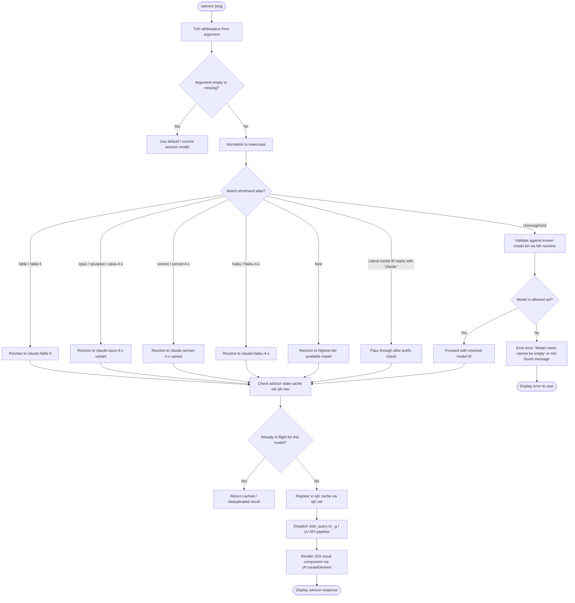

# `/advisor`

> Analysis basis: CC v2.1.176 bundle.js (AST extraction + Claude interpretation)
> Minimum version: v2.1.176

---

## Overview

The `/advisor` command allows Claude Code to consult a stronger or more capable model at key decision points during a session. It accepts an optional model shorthand argument (e.g., `opus`, `sonnet`, `fable`, `best`) and launches a side-query to the chosen advisor model, rendering results as a JSX component. The command validates the requested model, resolves it to a fully-qualified Anthropic model identifier, and dispatches a background API call using its own authentication and request pipeline.

---

## Registration

| Field | Value |
|---|---|
| type | `local-jsx` |
| name | `advisor` |
| description | `Let Claude consult a stronger model at key moments` |
| argumentHint | `[ ... ]` |
| isHidden | `null` (not hidden) |
| module_id | `qJK` |
| load_inline | `true` |
| loc_byte | `12983778` |
| loc_byte_end | `12984034` |
| loc_line | `9167` |
| arbor_handler.name | `D65` |
| arbor_handler.fqn | `claude-2.1.176::D65` |
| arbor_handler.kind | `AsyncFunction` |
| arbor_handler.resolution_path | `module_id` |
| arbor_handler.n_hits | `2` |

Analysis basis: CC v2.1.176 bundle.js:+12983778

---

## Input Branching

The command processes the user-supplied argument through multiple validation and resolution stages with 5+ distinct branches, requiring a flowchart representation.



Analysis basis: CC v2.1.176 bundle.js:+12983226, +12974480, +12974665, +12974786, +12974994

---

## Behavioral Spec

### 1. Entry Point — Handler (`D65`)

The async handler `D65` is the top-level entry for `/advisor`. It trims the raw input, invokes the model-resolution pipeline, registers the in-flight request, dispatches the side query, and returns a JSX element for rendering.

```
async function advisorHandler(rawArg, appState):
    trimmedArg = rawArg.trim()                    // bundle.js:+12983226
    modelId = resolveAdvisorModel(trimmedArg)     // via RU6 at +12983394
    jsxElement = createElement(AdvisorComponent)  // +12983262
    subResult = await dispatchSideQuery(modelId)  // via j1 at +12983380, zU at +12983394
    return renderResult(jsxElement, subResult)
```

Analysis basis: CC v2.1.176 bundle.js:+12983226

---

### 2. Model Resolution (`RU6`)

`RU6` (the model-resolution function) implements the core logic for translating user-supplied shorthand arguments into canonical model identifiers.

```
function resolveAdvisorModel(arg):
    trimmed = arg.trim()                            // +12974480
    if trimmed is empty:
        raise "Model name cannot be empty"          // +12974517

    lower = trimmed.toLowerCase()                   // +12974665

    // Check if model is in the blocked/disabled set
    if jyH_blocklist.includes(lower):               // +12974684
        raise validation error

    // Check deduplication cache
    if sjK.has(lower):                              // +12974786
        return cachedResult

    // Resolve shorthand via NK model-normalization subsystem
    resolved = normalizeModelName(lower)            // NK at +12974551

    // Register in-flight entry
    sjK.set(lower, resolved)                        // +12974994

    // Dispatch and return
    return launchSideQuery(resolved)                // q65 at +12975035
```

Analysis basis: CC v2.1.176 bundle.js:+12974480

---

### 3. Model Name Normalization (`NK` subsystem)

`NK` performs the multi-step normalization from shorthand to full model identifier. It handles alias expansion, provider-prefix validation, policy enforcement, and model-tier mapping.

```
function normalizeModelName(lower):
    // Alias expansion
    if lower == "fable" or lower == "fable-5":
        return "claude-fable-5"                     // literals at +2279270

    if lower in ["opusplan", "opus"]:
        return resolveOpusVariant()                 // +2279333, +2279452

    if lower == "sonnet":
        return resolveSonnetVariant()               // +2279374

    if lower == "haiku":
        return resolveHaikuVariant()                // +2279413

    if lower == "best":
        return resolveHighestTierModel()            // +2279486

    // Direct prefix check: must start with "claude-"
    if lower.startsWith("claude-"):                 // NP4 at +2261483, literal +2259998
        return lower  // pass-through

    // Policy settings check
    policyModels = getPolicySettings()              // +2260941
    if lower in policyModels:
        return policyModels[lower]

    // Fallback: attempt JyH inclusion check
    if not JyH_allowlist.includes(lower):           // +2260763
        raise not_found_error with "model: " prefix // +12975474, +12975556

    return lower
```

Analysis basis: CC v2.1.176 bundle.js:+12974551, +2279270, +2279333, +2279374, +2279413, +2279486

---

### 4. Model Variant Tables

The following model version strings are enumerated in the literals at depth ≤ 2 and represent the full set of known canonical identifiers resolvable by the advisor command:

| Shorthand Family | Canonical Model IDs (from literals) |
|---|---|
| `fable` | `claude-fable-5` (+2264345) |
| `opus` | `claude-opus-4-8`, `claude-opus-4-7`, `claude-opus-4-6`, `claude-opus-4-5`, `claude-opus-4-1`, `claude-opus-4-0` |
| `sonnet` | `claude-sonnet-4-6`, `claude-sonnet-4-5`, `claude-sonnet-4-0`, `claude-3-7-sonnet`, `claude-3-5-sonnet` |
| `haiku` | `claude-haiku-4-5`, `claude-3-5-haiku`, `claude-3-haiku` |
| legacy | `claude-3-opus`, `claude-3-sonnet` |
| `mythos` | `claude-mythos-5` (+2276001) |

Analysis basis: CC v2.1.176 bundle.js:+2276001, +2276058, +2276286, +2276407, +2276563, +2276597

---

### 5. Side-Query Dispatch (`zU` / `_g` pipeline)

After model resolution, the advisor dispatches a "side_query" type API call through the main background request pipeline. This pipeline handles authentication, header composition, request tracking, and streaming result assembly.

```
async function dispatchSideQuery(resolvedModelId):
    // Tag this request as a side query
    requestContext = buildRequestContext(
        type: "side_query",                         // literal +13846700
        model: resolvedModelId
    )

    // Retrieve auth token (OAuth or API key)
    token = authPipeline.getToken()                 // E.getToken at +3246272

    // Build headers including User-Agent, session IDs, agent IDs
    headers = composeHeaders(token, requestContext) // _g at +3241784

    // Dispatch via fetch-based API client
    response = await apiClient.fetch(headers, body) // SrH.fetch at +2569009

    // Track timing and handle streaming
    result = await streamResponse(response)         // FM8, bM8 pipeline

    return result
```

Key header constants attached to every advisor side-query:

| Header | Value |
|---|---|
| `x-app` | `cli-bg` (background) or `cli` |
| `User-Agent` | includes `@anthropic-ai/claude-code` and version `2.1.176` |
| `X-Claude-Code-Session-Id` | session UUID |
| `x-claude-code-agent-id` | agent identifier |
| `content-type` | `text/event-stream` |

Analysis basis: CC v2.1.176 bundle.js:+3241700, +3241711, +3241739, +3251035, +3251068

---

### 6. Error Handling in Model Validation (`RU6`)

Three distinct error paths are observable within the model-validation call chain:

```
function handleValidationErrors(apiError):
    if apiError.type == "not_found_error":           // +12975474
        // Extract model name from error message
        modelName = apiError.message after "model:" // +12975556
        raise user-facing not-found error

    if network failure:
        raise "Network error. Please check your internet connection." // +12975355

    if auth failure:
        raise "Authentication failed. Please check your API credentials." // +12975253
```

Analysis basis: CC v2.1.176 bundle.js:+12975253, +12975355, +12975474

---

### 7. In-Flight Deduplication (`sjK` cache)

The `sjK` Map prevents duplicate concurrent advisor queries for the same model shorthand within a session.

```
function checkOrRegisterInFlight(modelKey):
    if sjK.has(modelKey):                           // +12974786
        return DEDUPLICATED  // skip re-dispatch
    sjK.set(modelKey, pendingPromise)               // +12974994
    return PROCEED
```

Analysis basis: CC v2.1.176 bundle.js:+12974786, +12974994

---

### 8. Advisor-Specific Model Config (`K65` / `q65`)

After the canonical model ID is established, `K65` applies per-model configuration (e.g., temperature, cache control, ephemeral flags) before the final API call is assembled.

```
function applyAdvisorModelConfig(modelId):
    lower = modelId.toLowerCase()                   // +12975805

    if lower.includes("fable-5") or lower == "fable_5": // +12975835, +12975858
        config.cacheControl = "ephemeral"           // +12974975
        config.priority = "Hi"                      // +12974950

    if lower.includes("opus-4-8"):                  // +12975935
        config.tier = "opus_4_8"                    // +12975959

    // Similar mappings for opus-4-7, opus-4-6, opus-4-5, sonnet-4-6, sonnet-4-5
    // (literals at +12976004 through +12976312)

    applyPolicySettings(config)                     // fL at +12975787
    return config
```

Analysis basis: CC v2.1.176 bundle.js:+12974950, +12974975, +12975787, +12975835

---

### 9. JSX Rendering (`D65` → `yP.createElement`)

The command's output is a JSX/React component tree, consistent with the `local-jsx` registration type.

```
function renderAdvisorResponse(modelId, responseText):
    element = yP.createElement(
        AdvisorResponseComponent,
        { model: modelId, response: responseText }  // +12983262
    )
    return element
```

Analysis basis: CC v2.1.176 bundle.js:+12983262

---

## State & Side Effects

| Item | Detail |
|---|---|
| Telemetry — `tengu_api_success` | Emitted on successful advisor API round-trip (bundle.js:+13848279) |
| Telemetry — `tengu_lone_surrogate_sanitized` | Emitted when response text contains lone surrogates that are cleaned (bundle.js:+13848028) |
| Telemetry — `tengu_prompt_cache_1h_config` | Emitted when 1-hour prompt cache is configured for the advisor call (bundle.js:+13793631) |
| Telemetry — `tengu_bg_dispatch_low_mem` | Emitted if background worker encounters memory pressure during dispatch (bundle.js:+16982600) |
| Telemetry — `tengu_bg_spare_claim` | Emitted when a spare background worker is claimed for the advisor side query (bundle.js:+16983432) |
| In-flight cache (`sjK`) | A Map keyed by lowercase model shorthand; prevents duplicate concurrent requests within session |
| `sjK.set` | Called after validation passes, before dispatch (bundle.js:+12974994) |
| Background worker pool | Advisor may claim a spare worker via the `$6` / `lbH` background dispatch path |
| Auth side-effect | OAuth token refresh may be triggered if token is stale (`t$` → `rM8`, literal "refreshed" at +3287589) |
| Sound | <!-- TODO: not found in depth-2 traversal; needs --depth 4 --> |
| appState changes | <!-- TODO: not found in depth-2 traversal; needs --depth 4 --> |

---

## Version History

| Version | Change |
|---|---|
| v2.1.176 | Initial analysis |

---

## Common Mistakes

1. **Passing an unrecognized shorthand**: If the argument does not match any alias (`fable`, `opus`, `sonnet`, `haiku`, `best`) and does not begin with `"claude-"`, the command raises a `not_found_error`. Use the exact shorthands listed or a full `claude-*` model ID.
2. **Omitting the argument and expecting a default non-current model**: When the argument is empty, the command uses the session's default model rather than escalating to a stronger one. To explicitly target a stronger model, always supply a shorthand or model ID.
3. **Concurrent duplicate calls**: Issuing `/advisor opus` twice simultaneously for the same model key within a session returns the cached/deduplicated result rather than initiating a second API call. This is by design (`sjK` deduplication).
4. **Assuming availability of all model variants**: Not all `claude-opus-4-x` variants may be accessible depending on the API key's allowed models and policy settings. Variants are filtered by `JyH` allowlist and `NK` policy checks.
5. **Expecting synchronous output**: The command is an `AsyncFunction` (`D65`). The JSX component is returned asynchronously; UI rendering is gated on the completion of the side-query fetch pipeline.

---

## Appendix — Identifier Mapping

> For bundle debugging only. Identifiers change across versions.

| Identifier | Role |
|---|---|
| `D65` | Main async handler for `/advisor` (entry point, `arbor_handler`) |
| `RU6` | Model resolution and validation function |
| `NK` | Model name normalization subsystem (alias expansion, policy checks) |
| `K65` | Per-model configuration applicator (cache control, tier flags) |
| `q65` | Adapter wrapping K65 for final model config assembly |
| `zU` | Top-level side-query dispatch orchestrator |
| `_g` | Core API request builder and header composer |
| `j1` | Model-tier resolution helper (shorthand → canonical ID) |
| `y0H` | Advisor component state setup helper |
| `d_6` | Argument filtering and pre-processing helper |
| `tG8` | Argument transformation wrapper (calls y0H, QL, j1) |
| `zi_` | Advisor context initializer (session state, trust checks) |
| `RU6` | Model validation and sjK deduplication gatekeeper |
| `SrH` | HTTP fetch wrapper for Anthropic API calls |
| `$F4` | Request object builder (UUID, headers, content-type) |
| `bM8` | Response stream assembler |
| `FM8` | Response inclusion checker (model family filter) |
| `Fj` | Auth profile selector (OAuth vs. API key) |
| `sw` | Auth credential resolver |
| `HF4` | Auth header finalizer |
| `u88` | Proxy auth helper runner |
| `nw` | API key resolution helper |
| `zF` | Token/credential refresh dispatcher |
| `t$` | OAuth token refresh handler |
| `_g` | Full API pipeline coordinator (headers, auth, dispatch) |
| `lbH` | Background worker selector for side queries |
| `$6` | Background worker pool event emitter |
| `NA` | Background worker state renderer |
| `G38` | Response context builder helper |
| `Zq8` | Request metadata assembler (session ID, subagent flag) |
| `Tq8` | Store accessor for request context |
| `zM` | Store accessor for session context |
| `XW` | Message mapper for side-query payload |
| `M0H` | Request payload constructor |
| `BkA` | Message array transformer |
| `nl6` | Message array normalizer |
| `HS` | Deep-clone utility (`structuredClone` wrapper) |
| `CH` | JSON serialization wrapper |
| `A6` | String coercion utility |
| `o_` | Core object-property accessor |
| `M7` | Model metadata resolver |
| `fL` | Feature-flag / policy lookup |
| `WN` | Model-type inclusion checker |
| `Kf` | String replace/sanitize helper |
| `dJ6` | Model ID lowercase normalizer |
| `sJ6` | Model string replacement helper |
| `BY` | Model-family builder |
| `$LH` | Model-family lookup table |
| `bm` | Model descriptor builder |
| `Dz` | Model descriptor formatter |
| `L1` | Model info resolver |
| `dz` | Model ID pattern matcher |
| `QL` | Model string cleaner |
| `LJ6` | Model object accessor |
| `cD4` | Model prefix checker (`anthropic.`) |
| `fJ6` | Model value enumerator |
| `vN` | HIPAA flag resolver |
| `Iv_` | HIPAA object accessor |
| `ZkH` | HIPAA model builder |
| `iVK` | Message content mapper |
| `yP4` | Model ID lowercaser |
| `kiH` | Model ID string constructor |
| `PyH` | Model prefix inclusion checker |
| `_I1` | Full model-info assembler |
| `HAH` | Model metadata accessor |
| `yiH` | Model inclusion checker |
| `Jq8` | Model object builder with metadata |
| `ujH` | Model array handler |
| `LLH` | Model string inclusion checker |
| `JT` | Model-version tier router |
| `jq8` | Tier-based model resolver |
| `mjH` | Model-descriptor helper |
| `DJ_` | Model-descriptor builder |
| `RF` | Model string replacer |
| `yD` | Extended model info resolver |
| `XyH` | Extended model builder |
| `MLH` | Multi-model list builder |
| `wJ_` | Model list constructor |
| `V5` | Model property assembler |
| `nl` | Provider-aware model accessor |
| `ED6` | Provider metadata accessor |
| `ZD6` | Full provider config builder |
| `JyH` | Model allowlist checker |
| `Yq8` | Model resolution recursion helper |
| `ey1` | Model entry iterator |
| `I8` | Policy settings accessor |
| `tnH` | Model entry enumerator |
| `ty1` | Model index finder |
| `vP4` | Alias-to-model resolver |
| `NP4` | Claude-prefix model resolver |
| `CL5` | User/text message finder |
| `D2A` | SHA-256 hash generator for request dedup |
| `G` | Main interactive terminal UI component |
| `Wi` | Agent ID parser |
| `G97` | Agent ID prefix resolver |
| `Cb` | Agent context prefix checker |
| `kH` | Logging and error reporting helper |
| `djH` | Timing and latency tracker |
| `Et8` | Timestamp utility |
| `oW6` | Header entry normalizer |
| `sJH` | SDK error logger |
| `S6` | App-type header setter |
| `G9` | Background app-type setter |
| `On` | Error reporting / crash helper |
| `ZJ_` | URL encoder for headers |
| `N` | Message formatter (debug/log levels) |
| `OI1` | Boolean coercion helper |
| `Lz` | Logger instance |
| `p_` | Workspace trust checker |
| `e1` | Error classifier |
| `V` | Response validator |
| `u8H` | Content-type header resolver |
| `DW` | Worker option builder |
| `AE6` | Streaming response processor |
| `Y29` | Stream event handler |
| `utH` | Stream error logger |
| `_E6` | Stream cleanup handler |
| `T36` | Retry / backoff controller |
| `z1` | Module loader initializer |
| `nM6` | Module loader bootstrap |
| `FwH` | Lone-surrogate sanitizer |

---

Note: index built via Arbor fallback; some signals (telemetry, literals) may be missing — see arbor-fallback.js.