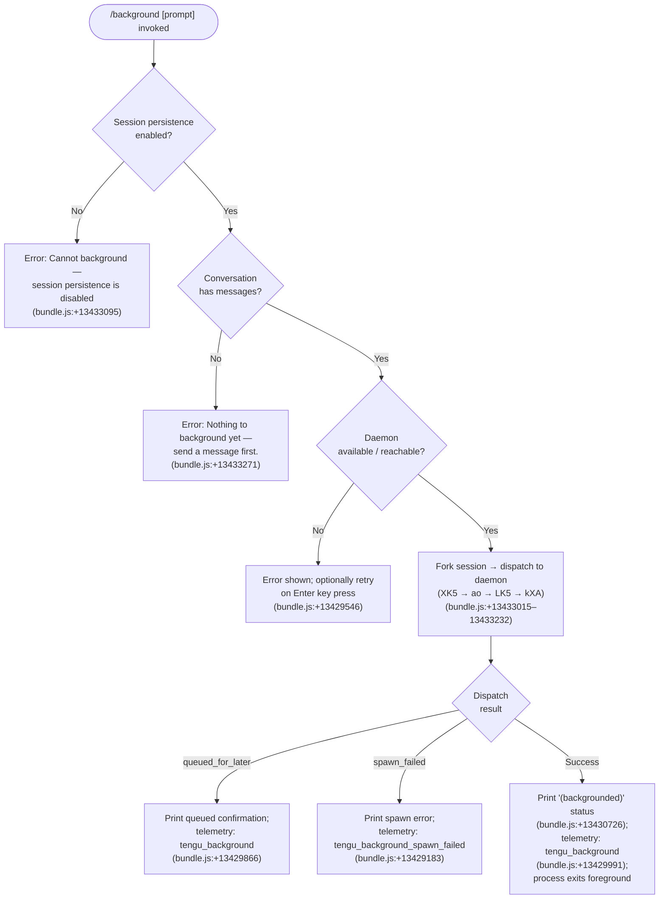

# `/background`

> Analysis basis: CC v2.1.176 bundle.js (AST extraction + Claude interpretation)
> Minimum version: v2.1.176

---

## Overview

`/background` (alias `/bg`) sends the current interactive REPL session to the Claude Code background daemon, freeing the terminal for other use. It forks the existing session into a daemon-managed job, optionally forwarding a follow-up prompt, and exits the foreground process once the handoff is confirmed. If the daemon is unavailable or the session has no conversational history yet, the command aborts with a user-visible error.

---

## Registration

| Field | Value |
|---|---|
| type | `local-jsx` |
| name | `background` |
| description | `Send this session to the background and free the terminal` |
| aliases | `["bg"]` |
| argumentHint | `[prompt]` |
| immediate | `null` |
| module_id | `PTK` |
| load_inline | `true` |
| loc_byte | `13433741` |
| loc_byte_end | `13433981` |
| loc_line | `9801` |
| arbor_handler.name | `XK5` |
| arbor_handler.fqn | `claude-2.1.176::XK5` |
| arbor_handler.kind | `AsyncFunction` |
| arbor_handler.resolution_path | `module_id` |
| arbor_handler.n_hits | `0` |

Analysis basis: CC v2.1.176 bundle.js:+13433741

---

## Input Branching

Five distinct paths exist, so a flowchart is used.



---

## Behavioral Spec

### Handler Entry (`XK5`)

The Arbor-resolved handler `XK5` is the `AsyncFunction` reached via `module_id → PTK`.

```
async function backgroundCommandHandler(appState, userInput):
    // Guard 1: persistence check
    sessionPersistenceEnabled = checkSessionPersistence(appState)   // Yd → iu
    if not sessionPersistenceEnabled:
        display error "Cannot background — session persistence is disabled, ..."
        return                                          // bundle.js:+13433095

    // Guard 2: conversation must have at least one message
    conversationMessages = getConversationMessages(appState)       // G9 → BjH
    if conversationMessages is empty:
        display error "Nothing to background yet — send a message first."
        return                                          // bundle.js:+13433271

    // Build fork descriptor
    forkDescriptor = buildForkDescriptor(appState, userInput)     // kd8
    forkDescriptor.label = "(backgrounded)"                        // bundle.js:+13430726

    // Attempt daemon dispatch
    result = await dispatchToDaemon(forkDescriptor)               // ao → LK5 → kXA
    handleDispatchResult(result)
```

Analysis basis: CC v2.1.176 bundle.js:+13433015

---

### Pre-flight Validation (`Yd` / session-persistence check)

```
function checkSessionPersistence(appState):
    // Inspects appState for a persistence flag
    env = getEnvironmentMode(appState)                 // A6 → XEK
    if env is "production" and persistence disabled:   // bundle.js:+13529161
        return false
    return true
```

Analysis basis: CC v2.1.176 bundle.js:+13433081

---

### Fork Descriptor Assembly (`kd8`)

`kd8` constructs the argument vector passed to the daemon for the new background job. Key arguments assembled from literals:

- `--resume <sessionId>` (bundle.js:+13428539)
- `--fork-session` (bundle.js:+13428552)
- `--reply-on-resume <prompt>` when an optional prompt argument was provided (bundle.js:+13428594)
- `--add-dir <paths>` if extra directories were added (bundle.js:+13428646)
- `--allowed-tools` / `--disallowed-tools` forwarded from current session (bundle.js:+13428681, +13428722)
- `--model` forwarded (bundle.js:+13428753)
- `--effort` / `--permission-mode` forwarded (bundle.js:+13428782, +13428799)
- `--` separator before any trailing prompt text (bundle.js:+13428827)

```
function buildForkDescriptor(appState, promptText):
    sessionId  = getCurrentSessionId(appState)
    args = ["--fork-session", "--resume", sessionId]

    if promptText is not empty:
        args += ["--reply-on-resume", promptText]

    args += forwardCurrentFlags(appState)   // model, effort, permissions, tools
    args += ["--", promptText] if promptText
    return { type: "bg", args, sessionId }
```

Analysis basis: CC v2.1.176 bundle.js:+13428539 – +13428827

---

### Daemon Dispatch (`ao` → `LK5` → `kXA`)

```
async function dispatchToDaemon(descriptor):
    // Ensure daemon is running (may spawn transient daemon if service not installed)
    daemon = await ensureDaemonRunning()               // JB — bundle.js:+13362162
    if daemon is null:
        return { status: "daemon_unavailable" }        // bundle.js:+13411802

    // Write dispatch file; connect to control socket
    dispatchId = randomBytes(8).toString("hex")        // KTK.randomBytes — bundle.js:+13401899
    writeDispatchFile(dispatchId, descriptor)          // IO — bundle.js:+13402536
    socketResult = await connectSocket(dispatchId)     // JY — bundle.js:+13410450

    return socketResult   // queued_for_later | spawn_failed | { sessionId, pid }
```

Analysis basis: CC v2.1.176 bundle.js:+13406742, +13401803

---

### Flush-and-Exit Sequence (`uOH` → detach-request)

Once the daemon acknowledges, the foreground process:

1. Sends a `"detach-request"` control message over the PTY channel (bundle.js:+13339954).
2. Waits up to **2000 ms** for a flush confirmation (`"flush timeout"` sentinel, bundle.js:+13428483, +13428488).
3. Calls `process.exit(1)` on error or clean exit on success (via `u1 → process.exit`, bundle.js:+13404912).

```
async function detachForeground(daemonAck):
    sendControlMessage("detach-request")               // uOH — bundle.js:+13433067
    result = await Promise.race([
        waitForFlushConfirm(),
        timeout(2000, "flush timeout")                 // bundle.js:+13428483
    ])
    if result === "flush timeout" or error:
        reportError("cli_error", exitCode=1)           // bundle.js:+13404899
        process.exit(1)
    else:
        process.exit(0)
```

Analysis basis: CC v2.1.176 bundle.js:+13428475, +13404912

---

### Error Display — Retry on `spawn_failed`

When dispatch fails, the handler emits a JSX element (type `local-jsx`) with the message:

> "couldn't start in the background — press Enter to retry" (bundle.js:+13429546)

The `left_arrow` key binding (bundle.js:+13429235) is registered temporarily; pressing Enter re-invokes dispatch.

Telemetry: `tengu_background_spawn_failed` (bundle.js:+13429183)

---

### Permission / Bypass Guards (`jK5` / `iL6`)

If the current session has `bypassPermissions` active (bundle.js:+13426475):

- The background fork requires that `--dangerously-skip-permissions` was accepted interactively first (bundle.js:+13426644).
- Similarly, `auto` permission mode requires prior interactive opt-in (bundle.js:+13426806).

```
function validatePermissionForBg(settings):
    if settings.bypassPermissions and not disclaimerAccepted:
        abort("--bg with bypassPermissions requires accepting the disclaimer first. ...")
    if settings.permissionMode == "auto" and not autoOptedIn:
        abort("--bg with auto mode requires opting in first. ...")
```

Analysis basis: CC v2.1.176 bundle.js:+13426475, +13426644, +13426806

---

### Already-Backgrounded Guard

If the current process is itself already running as a daemon worker, `/background` emits a telemetry event and returns early rather than recursively detaching:

Telemetry: `tengu_background_already_bg` (bundle.js:+13433029)

Analysis basis: CC v2.1.176 bundle.js:+13433027

---

## State & Side Effects

| Item | Detail |
|---|---|
| Telemetry | `tengu_background` (+13429991), `tengu_background_spawn_failed` (+13429183), `tengu_background_already_bg` (+13433029), `tengu_bg_dispatch` (+13403674), `tengu_bg_dispatch_fallback` (+13404204), `tengu_bg_dispatch_rescued` (+13410647), `tengu_bg_daemon_cold_start_ask` (+13363248), `tengu_bg_daemon_spawn_failed` (+13363767), `tengu_bg_attach` (+16973229), `tengu_bg_attach_kick` (+16975414), `tengu_bg_dispatch_stale_drop` (+16969183), `tengu_bg_spare_claim` (+16983432), `tengu_bg_retire_grace_bridged_min` (+13372903), `tengu_daemon_control` (+17019560), `tengu_rename_full_session_fork` (+12350969), `tengu_feature_ok` (+1018758), `tengu_feature_bad` (+1018825), `tengu_feature_sad` (+1018906) |
| Daemon interaction | Writes a dispatch file; opens a Unix socket to the daemon control endpoint; sends `detach-request` PTY control frame |
| Process lifecycle | Foreground process calls `process.exit` (code 0 on success, code 1 on `cli_error`) after detach handshake |
| Session fork | Creates a new daemon-managed job with a forked session; original session ID preserved via `--resume`; new job inherits tool allow/disallow lists, model, effort, and permission-mode flags |
| appState changes | `(backgrounded)` status string set in UI state (bundle.js:+13430726); `repl_background_fork` tracking event emitted (bundle.js:+13429843) |
| Sound | None observed in depth-2 traversal |
| Hook registration | `left_arrow` key temporarily bound for retry on `spawn_failed` (bundle.js:+13429235) |
| Flush timeout | 2000 ms hard limit before treating detach as failed (bundle.js:+13428483) |
| Daemon cold-start | If no daemon is running, CLI may prompt "Install as a service now? [y/N/never, or 'once' just for now]" (bundle.js:+13369809) |

---

## Version History

| Version | Change |
|---|---|
| v2.1.176 | Initial analysis |

---

## Common Mistakes

1. **Running `/background` before sending any message.** The command guards on a non-empty conversation; attempting it on a fresh session yields "Nothing to background yet — send a message first." Send at least one user message first.
2. **No daemon installed and declining the install prompt.** Without an installed or transient daemon the dispatch cannot succeed; running `claude daemon install` in advance avoids the interactive prompt.
3. **Using `/background` with `--dangerously-skip-permissions` without prior interactive acceptance.** The bypass-permissions guard will block the fork and emit an error; run `claude --dangerously-skip-permissions` interactively at least once to accept the disclaimer.
4. **Confusing `/background` with `--cloud`.** The literal `"--bg and --cloud are different backends…"` (bundle.js:+13372209) is emitted if a `--cloud` flag is detected; these are separate execution backends.
5. **Expecting an immediate prompt response.** The optional `[prompt]` argument is passed via `--reply-on-resume`; it will be processed by the daemon job only after the fork is fully established, not synchronously.

---

## Appendix — Identifier Mapping

> For bundle debugging only. Identifiers change across versions.

| Identifier | Role |
|---|---|
| `XK5` | Main handler for `/background` command (AsyncFunction, arbor_handler) |
| `Id8` | Background session dispatch orchestrator (depth-1 caller of most sub-functions) |
| `kd8` | Fork descriptor / argument vector builder |
| `ao` | Session fork initiator; calls `LK5` with assembled descriptor |
| `LK5` | Core background-launch function; manages daemon socket lifecycle |
| `kXA` | Daemon dispatch driver; writes dispatch file, connects socket, handles retries |
| `JB` | Daemon ensure-running / cold-start manager |
| `JY` | Unix socket connector to daemon control endpoint |
| `uOH` | Detach-request sender; triggers PTY detach frame |
| `Yd` | Session-persistence and environment mode checker |
| `G9` | Conversation-messages accessor (checks non-empty guard) |
| `BjH` | Conversation state reader |
| `jK5` | Permission / bypass-permissions validator for background mode |
| `iL6` | Additional permission gate checker |
| `vd8` | `--resume` / `--session-id` argument builder |
| `wTK` | Argument assembler for `--resume=<id>` flag |
| `aZH` | Argument-list accumulator helper |
| `od` | Permission-context gate helper |
| `u1` | Process-exit wrapper (calls `process.exit` on detach failure) |
| `Z4` | Flush-timeout race helper (`Promise.race` + `setTimeout` 2000 ms) |
| `QZ` | Post-flush confirmation handler |
| `BXA` | Signal / shutdown registration helper |
| `P4` | Signal handler registrar |
| `u9` | Hook registration utility |
| `tf8` | Config watcher / file-watch bootstrap |
| `C6` | Config loader / settings reader |
| `G5H` | Settings file parser |
| `EB6` | Dispatch telemetry emitter |
| `yXA` | Path-bearing argument formatter |
| `qTK` | Dispatch-result state processor |
| `SU8` | Socket connection with timeout and retry |
| `pUH` | Socket path builder |
| `$fH` | Dispatch-file lstat / read helper |
| `IO` | Atomic file writer (randomBytes temp file + rename) |
| `xL` | Dispatch file path resolver |
| `lJ` | Stale dispatch file cleanup |
| `m1H` | Message formatter for fork descriptor |
| `fK5` | Shell command launcher (cmd.exe / /bin/sh) |
| `Fs6` | Shell-path resolution helper |
| `kPH` | Working-directory and state-file path builder |
| `k3` | State-file existence checker |
| `TH` | Error-string converter (`String(err)`) |
| `n8` | Promise-abort wrapper |
| `hB` | Graceful shutdown sequencer |
| `NLH` | MCP server shutdown caller |
| `hLH` | Timeout clear helper |
| `Y` | Forced-shutdown / process.exit path |
| `EX` | Forced-exit signal emitter |
| `z` | AbortController wrapper |
| `IH` | `tengu_feature_ok` telemetry emitter |
| `bH` | `tengu_feature_bad` telemetry emitter |
| `n6` | `tengu_feature_sad` telemetry emitter |
| `gS` | MCP first-party skill registration |
| `f2_` | Skill event emitter |
| `K` | Active-sessions map iterator |
| `f` | Session connection lifecycle manager |
| `q` | Session registry (add/delete/close) |
| `vY` | Sessions values accessor |
| `M3` | Boolean session-filter helper |
| `mT` | Agent query orchestrator (used in fork's new job) |
| `xC8` | App-state getter/setter for forked job |
| `tR` | Top-level agent runner for background job |
| `nVK` | Core agent turn-loop (very large — main reasoning loop) |
| `JBH` | Agent response assembler |
| `d7A` | Sub-agent context builder |
| `tu8` | Tool-use executor |
| `fG` | Message normalization and tool-dispatch engine |
| `Tz` | Compact-boundary message slicer |
| `_p8` | Compact marker helper |
| `tg` | Array.isArray guard |
| `y46` | Tool-result predicate |
| `Eh` | Tool-use filter |
| `Yo` | Tool-use array checker |
| `QKH` | Starts-with-prefix checker |
| `x$` | Render helper (S6 + P4) |
| `S6` | JSX render entrypoint |
| `yd` | Secondary render path |
| `eG` | Root JSX render function |
| `HT` | Heading/title renderer |
| `PW` | Provider-type formatter |
| `o_` | A6 string helper |
| `M7` | Model-name formatter |
| `GJ_` | Managed-key / sk-ant prefix checker |
| `g1` | UI layout helper |
| `mjH` | DJ_ message display helper |
| `KZ` | Final rendering step |
| `Yf` | Message-type filter |
| `A6` | String coercion wrapper |
| `XEK` | Environment-key extractor |
| `iu` | Persistence-mode resolver |
| `TyH` | Session-name renderer |
| `N0` | Name display helper |
| `wM` | XT store accessor |
| `XT` | AsyncLocalStorage getStore |
| `D` | Background-job supervisor / spawn manager |
| `k` | Grace-clock / idle-sweeper |
| `c` | Job lifecycle state machine |
| `R` | Supervisor write helper |
| `l` | Job retire-if-settled helper |
| `ZB6` | Free-memory reporter |
| `SGK` | `$6` memory gate |
| `aSH` | State-file cleanup helper |
| `Dd8` | `$6` notification sender |
| `$6` | UI notification / alert bus |
| `_I5` | `$6` + Math.max attachment sizer |
| `AI5` | Session kill-and-cleanup helper |
| `G` | PTY repaint / key-event router |
| `qI5` | PTY IPC message handler (large function) |
| `P` | PTY buffer / TH helper |
| `mL` | PTY end/CH writer |
| `jw` | MXH message formatter |
| `MXH` | `$6` message wrapper |
| `EVA` | PTY event validator |
| `rHf` | Retry-with-backoff helper |
| `kH` | MCP error logger |
| `K6H` | Timing-safe key comparison |
| `LI5` | Replace/includes string sanitizer |
| `yQ6` | PTY write helper |
| `LbH` | MCP connection manager (large) |
| `LQ` | MCP slot config processor |
| `EZ` | MCP Jw/Fg_ helper |
| `do9` | MCP connection date/retry tracker |
| `oX8` | MCP retry zP helper |
| `nX8` | MCP mf helper |
| `z8` | MCP debug log pusher |
| `k28` | MCP OAuth tool builder |
| `S28` | MCP OAuth callback handler |
| `to9` | MCP connection transition helper |
| `_Q_` | MCP zP/mf/z8 debug helper |
| `j` | Process kill iterator |
| `wh` | `$6` skill helper |
| `Bg_` | MCP includes checker |
| `I` | Is/A connection helper |
| `K7` | MCP error log pusher |
| `ro9` | bg connection result helper |
| `J86` | parseInt port parser |
| `kW8` | parseInt port parser (variant) |
| `Ho8` | MCP update applier |
| `fbH` | SWH status helper |
| `wG` | MCP cleanup helper |
| `N` | Message normalizer (large) |
| `gff` | Zy/BH_/JyA message formatter |
| `CH` | JSON.stringify wrapper |
| `_` | Main utility / path helper |
| `bf` | Message-content extractor |
| `kQH` | mkA key formatter |
| `lff` | File-context loader |
| `$` | kPK session-cost helper |
| `kPK` | Cs/Date.now/l9 cost tracker |
| `vZA` | MCP entries filter/update orchestrator |
| `j28` | MCP pv7/ig_ has-checker |
| `D86` | SWH status helper (variant) |
| `u76` | API-call orchestrator (large) |
| `V7A` | Date.now / G36 version helper |
| `jlL` | API request builder |
| `e9H` | Request context helper |
| `RKH` | P4/fUH retry handler |
| `dU` | pNL/gx8/IH/bH sub-agent exit handler |
| `hE` | Streaming-event helper |
| `zu6` | eNL.has tombstone checker |
| `L6H` | Log-level helper |
| `Uu8` | Stream-event helper |
| `fnq` | zu6 tombstone fanout |
| `p3H` | AX/dm7 filter/push helper |
| `HhL` | d/eH fork-agent turn handler |
| `U8` | P/Zk.randomUUID/X message builder |
| `p7K` | Lq/Wb prompt formatter |
| `Wb` | H.trim prompt trimmer |
| `MF8` | Array/join/slice message builder |
| `gf` | Agent context helper |
| `su8` | Sub-agent base helper |
| `BhL` | H.map/_/A.map/Array.isArray content mapper |
| `Bnq` | ghL hash builder |
| `d7A` | su8/_/tu8 sub-agent context |
| `HT` | eG title renderer |
| `eG` | Root render (Ink) |
| `bs6` | Cs6.getStore / pc context reader |
| `T_` | eG environment bootstrap |
| `kvH` | zyA/Me8/c5/PD path helper |
| `zyA` | H.includes path checker |
| `Me8` | H.startsWith/H.slice path prefix helper |
| `c5` | Path normalizer |
| `PD` | Path display helper |
| `IO` | Atomic write (randomBytes + writeFile + rename) |
| `lJ` | st.delete stale-entry cleaner |
| `_TK` | H.map argument mapper |
| `YTK` | od/_.has/A.push/K.startsWith path-token validator |
| `DTK` | od/_.has/A.push/l6H/K.includes/aZH/Wp.has/gT6.has path-token validator |
| `jTK` | Argument token helper |
| `x6` | bs6/T_ context accessor |
| `Pi` | Permission-item parser |
| `htH` | i17.has/gP permission helper |
| `$Y8` | H.startsWith permission prefix helper |
| `gP` | kvH/Me8 permission gate |
| `E` | W/Math.max/Math.min filter helper |
| `Ca` | GL/TH cleanup helper |
| `rC` | Argument re-constructor |
| `r_6` | Argument helper |
| `R0H` | Argument render helper |
| `Nd8` | od/_.has/A.push/K.startsWith/aZH/L.startsWith/l6H path-scope validator |
| `hPH` | Permission-path parser (Wp.has/gT6.has/rSH.has) |
| `n17` | Permission-item sub-parser |
| `wXA` | Argument validator helper |
| `YXA` | H.some/_.startsWith cloud-flag detector |
| `Em` | `--bg with auto mode` error emitter |
| `Eb` | I8 bypass-permissions guard |
| `I8` | Pe6/Tb settings reader |

Note: index built via Arbor fallback; some signals (telemetry, literals) may be missing — see arbor-fallback.js.