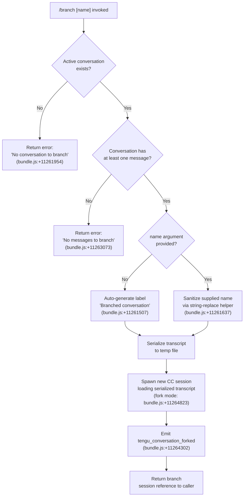

# `/branch`

> Analysis basis: CC v2.1.176 bundle.js (AST extraction + Claude interpretation)
> Minimum version: v2.1.176

---

## Overview

The `/branch` command creates a divergent copy of the current conversation starting from the current point in history. It serializes the existing conversation transcript to disk, spawns a new Claude Code session that replays that transcript, and then emits a `tengu_conversation_forked` telemetry event to record the fork. An optional `[name]` argument customizes the branch label.

---

## Registration

| Field | Value |
|---|---|
| type | `local-jsx` |
| name | `branch` |
| description | `Create a branch of the current conversation at this point` |
| argumentHint | `[name]` |
| module_id | `_MA` |
| load_inline | `true` |
| loc_byte | `12828333` |
| loc_byte_end | `12828510` |
| loc_line | `9030` |
| arbor_handler.name | `NRL` |
| arbor_handler.fqn | `claude-2.1.176::NRL` |
| arbor_handler.kind | `AsyncFunction` |
| arbor_handler.resolution_path | `module_id` |
| arbor_handler.n_hits | `0` |

Analysis basis: CC v2.1.176 bundle.js:+12828333

---

## Input Branching

The command has four meaningfully distinct paths (no conversation present, no messages available, optional name supplied vs. auto-generated, and the normal fork path), so a flowchart is used.



---

## Behavioral Spec

### 1. Entry Point — `branchCommandHandler` (NRL)

The Arbor-resolved handler is `NRL` (AsyncFunction, resolved via `module_id`).

```
async function branchCommandHandler(commandArgs, appContext):
    label = extractBranchLabel(commandArgs)   // asq
    transcript = getCurrentTranscript(appContext)

    if transcript is null or undefined:
        return errorResult("No conversation to branch")

    messages = filterTranscriptMessages(transcript)
    if messages.length == 0:
        return errorResult("No messages to branch")

    branchLabel = label ?? "Branched conversation"
    tempPath    = await writeBranchTranscript(branchLabel, messages)  // ssq
    session     = await spawnForkSession(tempPath, appContext)         // tsq
    emitTelemetry("tengu_conversation_forked")
    return session
```

Analysis basis: CC v2.1.176 bundle.js:+11265087

---

### 2. Label Extraction — `extractBranchLabel` (asq)

```
function extractBranchLabel(rawArgs):
    // Look up existing conversation names to avoid collisions
    existing = globalConversationMap.find(entry => matches(entry, rawArgs))
    // Replace special characters in the supplied string
    sanitized = rawArgs.replace(reservedCharPattern, safeSubstitute)
    return sanitized or null
```

Analysis basis: CC v2.1.176 bundle.js:+11261559, +11261637

---

### 3. Transcript Serialization — `writeBranchTranscript` (ssq)

This is the most complex sub-routine; it writes a copy of the conversation history to a temporary file that the new session will consume.

```
async function writeBranchTranscript(label, messages):
    newId   = crypto.randomUUID()          // isq.randomUUID, bundle.js:+11261746
    dataDir = resolveDataDirectory()       // S6, T_, lh, dM
    tmpDir  = path.join(dataDir, newId)
    await fs.mkdir(tmpDir, { recursive: true })   // Xp8.mkdir, bundle.js:+11261808

    // Open source transcript as a read stream (448-byte initial buffer)
    readStream  = fs.createReadStream(sourcePath, { encoding: "utf8" })
                                          // bundle.js:+11261857, +11261890
    // Wait for the stream 'open' event before writing
    await waitForEvent(readStream, "open") // HMA.once, bundle.js:+11261905

    // Write branched header object: type="text", label, role data
    writeStream = fs.createWriteStream(destPath, { flags: "content-replacement",
                                        bufferSize: 384 })
                                          // bundle.js:+11262003, +11262049

    // Pipe lines through readline interface; map each to JSON with
    // { type: "text", ... } shape (bundle.js:+11261580)
    rl = readline.createInterface({ input: readStream })
    transformed = await mapLines(rl, messages)  // H.map, bundle.js:+11262152

    // Handle model_refusal_fallback entries specially
    // (bundle.js:+11262748)

    // On error during streaming: destroy streams, unlink temp file
    readStream.on("error", handler)        // O.on, bundle.js:+11262062
    on fatal: fs.unlink(tmpDir)           // Xp8.unlink, bundle.js:+11262217

    writeStream.write(serializedData)     // O.write, bundle.js:+11262286
    writeStream.end()
    await stream.finished(writeStream)    // osq.finished, bundle.js:+11263483

    return tmpDir
```

Constants observed:
- Read-stream initial buffer: 448 bytes (bundle.js:+11261839)
- Write-stream buffer size: 384 bytes (bundle.js:+11262049)
- Progress batch size: 100 (bundle.js:+11261674)

Analysis basis: CC v2.1.176 bundle.js:+11261746–+11263483

---

### 4. Fork Session Spawn — `spawnForkSession` (tsq)

```
async function spawnForkSession(transcriptPath, appContext):
    // Register the session with the session-store (x$, P4, u9)
    sessionId = registerSession(transcriptPath)  // bundle.js:+11264005

    // Copy the serialized transcript into the new session's data directory (ssq)
    await copyTranscript(transcriptPath, sessionId)  // bundle.js:+11264106

    // Find matching entry in the conversation list ($.find, bundle.js:+11264169)
    entry = conversationList.find(e => e.id == sessionId)

    // Build worktree detection context (vRL → No → B$H)
    worktreeInfo = detectWorktree(appContext)    // bundle.js:+11264238

    // Set session title / custom-title metadata (DC → NzH, bundle.js:+11264269)
    setSessionTitle(sessionId, branchLabel)     // literal "custom-title", +13561564

    // Set agent-name metadata (VOH, bundle.js:+11264287)
    setAgentName(sessionId)                     // literal "agent-name", +13564587

    // Record fork timestamp (z.toISOString, bundle.js:+11264392)
    forkTime = new Date().toISOString()

    // Tag session as a fork (literal "fork", bundle.js:+11264823)
    tagSession(sessionId, "fork")

    // Resume the read stream so data flows (H.resume, bundle.js:+11264810)
    transcriptStream.resume()

    return sessionId
```

Analysis basis: CC v2.1.176 bundle.js:+11263998–+11264831

---

### 5. Worktree Detection — `detectWorktreeForBranch` (vRL → No → B$H)

When the current working directory is inside a Git worktree, the branch command captures that context so the forked session inherits the same working tree.

```
function detectWorktreeForBranch(cwd):
    result = runGit(["worktree", "list", "--porcelain"])
               // literals: "worktree", "list", "--porcelain", bundle.js:+9324688
    lines  = result.split("\n")
    for line in lines:
        if line.startsWith("worktree "):     // bundle.js:+9324907
            path = line.slice(9)             // numeric constant 9, bundle.js:+9324941
            ...
    emitTelemetry("tengu_worktree_detection")  // bundle.js:+9324788
    return worktreeMap
```

Analysis basis: CC v2.1.176 bundle.js:+9324644–+9325112

---

### 6. Session-Title Persistence — `setSessionTitle` (DC → NzH)

```
function setSessionTitle(sessionId, label):
    logPath = resolveLogPath(sessionId)          // lh, bundle.js:+13561543
    logger  = createLogger(logPath)              // NzH, bundle.js:+13561552
    // Write "custom-title" metadata entry via appendFileSync
    // (bundle.js:+13560596)
    logger.appendFileSync(logPath, CH(label))
    // mkdirSync for parent if missing (bundle.js:+13560635)
    emitTelemetry("tengu_session_renamed")       // bundle.js:+13561656
```

Analysis basis: CC v2.1.176 bundle.js:+13561543–+13561656

---

### 7. Agent-Name Tagging — `setAgentName` (VOH)

```
function setAgentName(sessionId):
    logPath = resolveLogPath(sessionId)          // lh, bundle.js:+13564566
    logger  = createLogger(logPath)              // NzH, bundle.js:+13564575
    // Write "agent-name" metadata entry
    emitEvent(GPA, "agent-name")                // GPA.emit, bundle.js:+13564672
    emitTelemetry("tengu_agent_name_set")       // bundle.js:+13564685
```

Analysis basis: CC v2.1.176 bundle.js:+13564566–+13564685

---

## State & Side Effects

| Item | Detail |
|---|---|
| Telemetry | `tengu_conversation_forked` (bundle.js:+11264302) — primary fork event |
| Telemetry | `tengu_session_renamed` (bundle.js:+13561656) — custom title applied |
| Telemetry | `tengu_agent_name_set` (bundle.js:+13564685) — agent name tagged |
| Telemetry | `tengu_worktree_detection` (bundle.js:+9324788) — worktree context captured |
| Telemetry (indirect) | `tengu_bg_spare_claim`, `tengu_bg_spare_claim_fail`, `tengu_bg_sendclaim_failed` — background daemon session allocation for the fork |
| Filesystem | Creates a new UUID-named subdirectory under the CC data dir containing a serialized copy of the transcript |
| Filesystem | Writes `custom-title` and `agent-name` metadata via `appendFileSync` to the new session's log file |
| Filesystem | Cleans up temp files on stream error via `fs.unlink` |
| Session state | Registers a new session entry in the internal session map (`D.set`, `X.set`) |
| Session state | Tags the new session with `"fork"` mode (bundle.js:+11264823) |
| Background daemon | Optionally claims a spare background session for the new fork (`WVA`, `vVA`) |
| Sound | <!-- TODO: not found in depth-2 traversal; needs --depth 4 --> |
| Hook registration | <!-- TODO: not found in depth-2 traversal; needs --depth 4 --> |

---

## Version History

| Version | Change |
|---|---|
| v2.1.176 | Initial analysis |

---

## Common Mistakes

1. **Running `/branch` with no active conversation** — the command immediately returns `"No conversation to branch"` (bundle.js:+11261954). Open or resume a session before branching.
2. **Running `/branch` on a fresh session with zero messages** — even if a session object exists, a transcript with no messages triggers `"No messages to branch"` (bundle.js:+11263073). Send at least one message first.
3. **Assuming the branch inherits tool permissions** — the fork replays the serialized transcript but spawns a new session; any in-memory allow/deny state from the parent is not automatically transferred.
4. **Supplying a name with special characters** — the label is sanitized via a regex replace (bundle.js:+11261637); reserved characters are silently substituted, so the resulting branch name may differ from the supplied string.
5. **Expecting instant availability** — the fork spawns asynchronously through the background daemon (`vVA`); if no spare session is available, a `tengu_bg_spare_claim_fail` event is emitted and the claim may retry or fail.

---

## Appendix — Identifier Mapping

> For bundle debugging only. Identifiers change across versions.

| Identifier | Role |
|---|---|
| `NRL` | Main handler — `branchCommandHandler` (AsyncFunction, Arbor-resolved) |
| `tsq` | Fork session spawn orchestrator |
| `ssq` | Transcript serializer — writes branch copy to disk |
| `asq` | Branch label extractor / sanitizer |
| `vRL` | Worktree detection coordinator |
| `No` | Worktree list parser (calls `B$H`) |
| `B$H` | Git worktree porcelain parser |
| `REK` | Conversation file enumerator |
| `xBH` | Buffer builder for transcript output |
| `DC` | Session-title setter (calls `NzH`) |
| `NzH` | Log-file writer (`appendFileSync`-based logger) |
| `VOH` | Agent-name tagger (calls `GPA.emit`) |
| `_n` | Settings persistence helper (calls `KX6`) |
| `KX6` | Config file read/write helper |
| `x$` | Session registration helper (calls `P4`) |
| `P4` | Session-store initializer (calls `u9`) |
| `u9` | Session registry — `DyA.register` wrapper |
| `vVA` | Background daemon session allocator |
| `WVA` | Spare session claim manager |
| `ry5` | Claim retry loop with timeout (5000 ms, bundle.js:+16960271) |
| `iy5` | Claim-frame builder (`ed.buildClaimFrame`) |
| `h2A` | Session metadata writer (`Hc.writeFile`) |
| `D` | Background session dispatch loop (SIGKILL escalation) |
| `b` | Background session lifecycle manager |
| `bRH` | Session file reader |
| `keH` | `.claude` directory setup helper (bundle.js:+4886695) |
| `Y9H` | Session roster updater |
| `yZ9` | Inactive-session filter |
| `c` | Session event loop handler |
| `w` | Supervisor process writer |
| `S` | Session output pump |
| `P` | PTY read-buffer manager (ETOOLARGE / EUNKNOWN error codes) |
| `z` | Daemon control dispatcher |
| `Q` | Background PTY lifecycle manager |
| `lZ` | Background PTY reconnect helper |
| `hv` | PTY frame builder (Buffer-level encoding) |
| `up8` | PTY frame parser |
| `riK` | File-change notification formatter |
| `N` | Message role normalizer (user/assistant/system/attachment) |
| `CH` | JSON serializer wrapper (`JSON.stringify`) |
| `TH` | String coercion wrapper |
| `GL` | Error logger wrapper (`E8`) |
| `k8` | Error classification helper (`E8`) |
| `kH` | Network request dispatcher (essential-traffic / no-telemetry) |
| `JA` | Error constructor helper |
| `A6` | String normalization utility |
| `Aq` | Request retry coordinator |
| `ycA` | Retry sub-helper (calls `A6`) |
| `JUf` | Request queue manager (`shift`/`push`) |
| `lh` | Log-path resolver (calls `S6`, `gh`, `dM`) |
| `dM` | Data-directory path builder |
| `gh` | Global home-directory resolver |
| `S6` | App-data root resolver |
| `T_` | Platform-path helper (`eG`) |
| `iC` | Config-root resolver (`eG`) |
| `eG` | Environment variable reader |
| `Yd` | Log entry formatter (calls `A6`, `XEK`, `iu`, `TyH`) |
| `Q6` | Log-level classifier |
| `P9` | String slice utility (`indexOf`/`slice`) |
| `tv` | Regex escape helper (`H.replace`, `\\$&`) |
| `c6` | Safe JSON parse wrapper |
| `aSH` | Session state file reader (`cJ.lstat` / `cJ.readFile`) |
| `a17` | Session directory walker (`cJ.readdir`, recursive) |
| `cT6` | Session path builder (`nj.join`, `zZ`) |
| `$q` | Session state cache manager (`st.get`/`st.set`/`st.delete`) |
| `_O` | Active-session state checker (`BN`) |
| `hPH` | Context-file filter / classifier |
| `xL` | Context-path join helper |
| `A76` | Async task runner with `Date.now` timing |
| `im6` | Session path composer (`B$.join`, `lm6`) |
| `nm6` | Session name builder (`B$.join`, `lm6`) |
| `QOH` | Session roster reader (`B$.join`, `UUH`) |
| `Nk` | Session entry builder (`a6`, `f$A`, `B$.join`, `_76`) |
| `Rv` | Session late-marker helper (`y_K`) |
| `Yd8` | macOS memory reporter (`a6`, `$6`) |
| `$6` | Memory-pressure handler (calls `W06`, `G06`, `em`, `eM8`) |
| `kPK` | Daemon-status writer (`dU6`, `CH`) |
| `dU6` | Daemon status-path builder (`IPK.join`, `M_`) |
| `l9` | Async-local-storage store reader (`zd4.getStore`) |
| `W` | SDK connection manager (`jM6`, `SR`, `Yh`, `jr`, `hx`) |
| `jM6` | SDK request dispatcher |
| `aeK` | SDK options key enumerator (`Object.keys`) |
| `j` | Session kill coordinator (`A.values`, `S.kill`) |
| `Y` | Forced-shutdown handler (`EX`, `process.exit`, `z.abort`) |
| `EX` | Shutdown reason emitter |
| `n8` | Timeout-based async waiter (`setTimeout`, `clearTimeout`) |
| `K` | Column formatter (`f.map`, `L.padEnd`) |
| `bH` | Feature-ok event emitter (`tengu_feature_ok`) |
| `IH` | Feature-bad event emitter (`tengu_feature_bad`) |
| `eH` | Feature-event base (`nM6`) |
| `Cs` | Config serializer (`zLH`) |
| `FU` | Unknown — reached via `ssq` at bundle.js:+11262513 |
| `m8` | Unknown — reached via `O` at bundle.js:+17019432 |

---

Note: index built via Arbor fallback; some signals (telemetry, literals) may be missing — see arbor-fallback.js.