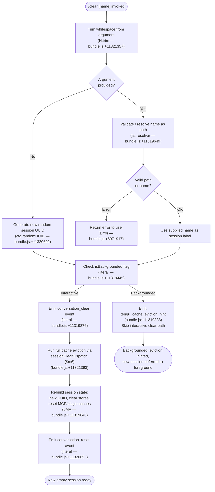

# `/clear`

> Analysis basis: CC v2.1.176 bundle.js (AST extraction + Claude interpretation)
> Minimum version: v2.1.176

---

## Overview

`/clear` starts a fresh conversation session with an empty context window while preserving the current session's transcript on disk, making it resumable later via `/resume`. The command accepts an optional session name argument, triggers a full in-memory cache eviction across numerous subsystems, and emits a `conversation_clear` / `conversation_reset` telemetry event pair before constructing the new session.

---

## Registration

| Field | Value |
|---|---|
| type | `local` |
| name | `clear` |
| description | Start a new session with empty context; previous session stays on disk (resumable with /resume) |
| argumentHint | `[name]` |
| supportsNonInteractive | `true` |
| thinClientDispatch | `post-text` |
| aliases | `reset`, `new` |
| module_id | `itq` |
| load_inline | `true` |
| loc_byte | 11321531 |
| loc_byte_end | 11321822 |
| loc_line | 7379 |
| arbor_handler.name | `yCL` |
| arbor_handler.fqn | `claude-2.1.176::yCL` |
| arbor_handler.kind | `AsyncFunction` |
| arbor_handler.resolution_path | `module_id` |
| arbor_handler.n_hits | 0 |

Analysis basis: CC v2.1.176 bundle.js:+11321531

---

## Input Branching

The handler has three distinct top-level branches (no argument / valid named argument / named argument that resolves to a path), plus a backgrounded-session guard, warranting a flowchart.



---

## Behavioral Spec

### Top-level handler (`yCL`)

```
async function clearCommandHandler(userInput, appContext):
    rawName = userInput.trim()                       // bundle.js:+11321357

    if rawName is non-empty:
        resolvedName = resolveSessionPath(rawName)   // az — bundle.js:+11319649
        if resolvedName is error:
            return error(resolvedName)
    else:
        resolvedName = null

    if appContext.isBackgrounded:                     // bundle.js:+11319445
        emitTelemetry("tengu_cache_eviction_hint")   // bundle.js:+11319338
        return early
    end if

    emitLiteral("conversation_clear")                // bundle.js:+11319376

    sessionClearDispatch(appContext, resolvedName)    // $m6 — bundle.js:+11321393

    emitLiteral("conversation_reset")                // bundle.js:+11320653
```

Analysis basis: CC v2.1.176 bundle.js:+11321357, +11319649, +11319376, +11320653

---

### Session clear dispatcher (`sessionClearDispatch` / `$m6`)

This is the primary workhorse. It orchestrates the full teardown and re-initialisation sequence.

```
async function sessionClearDispatch(appContext, sessionName):
    // 1. Compute timeout budget for background work
    timeoutBudget = computeContextLimit(parseInt, Number.isFinite)
                    // zm6 chain — bundle.js:+11319234
                    // base unit 10 (bundle.js:+13660922), scaled by 1000 (bundle.js:+13661098)
                    // clamped with Math.max / Math.min

    // 2. Abort any in-flight agent turn
    abortSignal = AbortSignal.timeout(timeoutBudget)   // bundle.js:+11319294

    // 3. Fire SessionEnd hook for outgoing session
    dispatchSessionEndHooks(appContext)                // WUH — bundle.js:+11319246
                                                       // literal "SessionEnd" bundle.js:+13651430

    // 4. Wipe all in-process caches
    fullCacheWipe(appContext)                          // bMA — bundle.js:+11319640

    // 5. Allocate new session UUID
    newSessionId = ctq.randomUUID()                   // bundle.js:+11320692

    // 6. Initialise new session with optional name label
    initialiseNewSession(appContext, newSessionId, sessionName)
                                                       // ta8 — bundle.js:+11320710

    // 7. Re-register hooks and plugin state
    reloadHooksAndPlugins(appContext)                  // sg — bundle.js:+11321132

    // 8. Emit coordinator / normal mode markers
    // literals "coordinator" (bundle.js:+11321045), "normal" (bundle.js:+11321059)

    // 9. Persist new session roster entry
    writeSessionRosterEntry(appContext, newSessionId)  // _.rosterEntry via vVA
                                                       // bundle.js:+16989632

    // 10. Clear abort controller reference from appState
    // literal "abortController" (bundle.js:+11319994)

    // 11. Clear object-key maps and internal collections
    _.clear()                                          // bundle.js:+11319658
    Object.keys(appContext)                            // bundle.js:+11319683
```

Analysis basis: CC v2.1.176 bundle.js:+11319234, +11319294, +11319246, +11319640, +11320692, +11320710, +11321132

---

### Full cache wipe (`bMA`)

`bMA` coordinates a wide multi-subsystem cache clear. Each call clears a distinct in-memory store.

```
function fullCacheWipe(appContext):
    clearSkillIndex(appContext)           // YU / Av — bundle.js:+11318202
    clearNonce()                          // aN9 — bundle.js:+11318210
    clearContextLimitCache()              // A6H — bundle.js:+11318229
    clearTuningCache()                    // xp — bundle.js:+11318243
    clearFlagCache()                      // FZ6 — bundle.js:+11318248
    clearMCPSkillsCache()                 // xNq — bundle.js:+11318493
    clearPluginSettingsCache()            // PWq — bundle.js:+11318502
    clearToolDefinitionCache()            // g4_ — bundle.js:+11318511
    clearScheduledTaskCache()             // Saq — bundle.js:+11318517
    clearXG8Cache()                       // C8q — bundle.js:+11318526
    clearOt8Cache()                       // ot8 — bundle.js:+11318532
    clearLcHCache()                       // R4_ — bundle.js:+11318539
    clearIgqCache()                       // Igq — bundle.js:+11318545
    clearQeAndDWHCache()                  // ja9 — bundle.js:+11318551
    return Promise.resolve()              // bundle.js:+11318557
```

Analysis basis: CC v2.1.176 bundle.js:+11318193 – +11318665

---

### Session-end hook dispatch (`WUH`)

Fired synchronously before the cache wipe to allow hooks to observe the outgoing session.

```
function dispatchSessionEndHooks(appContext):
    buildSessionEndPayload(appContext)    // v7 — bundle.js:+13651403
                                         // event literal "SessionEnd" bundle.js:+13651430
    runHookPipeline(appContext, payload)  // QG — bundle.js:+13651461
    emitS6()                             // S6 — bundle.js:+13651658
    runPostSessionMetrics(appContext)     // PmH — bundle.js:+13651663
```

Analysis basis: CC v2.1.176 bundle.js:+13651403, +13651430, +13651461

---

### Path resolver (`az`)

Validates an optional user-supplied session name / path argument.

```
function resolveSessionPath(rawArg):
    if V08.isAbsolute(rawArg):           // bundle.js:+6971815
        candidate = rawArg
    else:
        candidate = V08.resolve(rawArg)  // bundle.js:+6971835

    exists = checkFileExists(candidate)  // k8 — bundle.js:+6971905
    if not exists:
        throw Error("...")               // bundle.js:+6971917

    contextPath = Cf_(candidate)         // context-store lookup — bundle.js:+6971957
    return contextPath
```

Analysis basis: CC v2.1.176 bundle.js:+6971815, +6971835, +6971905, +6971917

---

### New session initialisation (`ta8`)

```
function initialiseNewSession(appContext, sessionId, name):
    uuid = P4H.randomUUID()              // bundle.js:+43699
    applyDefaultConfig(_yA, appContext)  // _yA — bundle.js:+43829
    emitSessionStartEvent(HyA)          // HyA → fc6.emit — bundle.js:+43908
                                         // event "session_start" bundle.js:+5037875
```

Analysis basis: CC v2.1.176 bundle.js:+43699, +43829, +43908

---

### Context-window limit calculation (`zm6`)

Used to set the abort-signal timeout budget for the outgoing session teardown.

```
function computeContextLimit(raw):
    parsed  = parseInt(raw, 10)          // bundle.js:+13660911, literal 10 at +13660922
    if not Number.isFinite(parsed):
        return defaultLimit(cj)          // cj — bundle.js:+13660976
    clamped = Math.max(                  // bundle.js:+13661129
                Math.min(parsed, MAX),   // bundle.js:+13661142
                MIN)
    return clamped * 1000                // literal 1000 — bundle.js:+13661098
```

Analysis basis: CC v2.1.176 bundle.js:+13660911, +13660922, +13660933, +13661098

---

## State & Side Effects

| Item | Detail |
|---|---|
| Telemetry — `tengu_cache_eviction_hint` | Fired when the session is backgrounded at the time `/clear` is invoked (bundle.js:+11319338) |
| Telemetry — `tengu_run_hook` | Fired during the outgoing SessionEnd hook pipeline (bundle.js:+13700860) |
| Telemetry — `tengu_repl_hook_finished` | Fired after hook execution completes (bundle.js:+13684628) |
| Telemetry — `tengu_hook_plugin_metrics` | Collected per plugin hook run (bundle.js:+13679155) |
| Telemetry — `tengu_session_renamed` | Fired if the new session receives a custom name (bundle.js:+13561656) |
| Telemetry — `tengu_shell_set_cwd` | Fired when the working-directory context is re-established for the new session (bundle.js:+6971970) |
| Literal event — `conversation_clear` | Written to app state before teardown begins (bundle.js:+11319376) |
| Literal event — `conversation_reset` | Written to app state after new session is live (bundle.js:+11320653) |
| Hook: `SessionEnd` | Dispatched to all registered hooks for the outgoing session before caches are wiped (bundle.js:+13651430) |
| appState `abortController` | Cleared to `null` during session teardown (bundle.js:+11319994) |
| appState `isBackgrounded` | Read to decide whether to short-circuit into hint-only mode (bundle.js:+11319445) |
| In-memory cache stores cleared | `ag`, `EmH`, `n_A`, `U96`, `rS6`, `ncH`, `XG8`, `lcH`, `Tu6`, `AN6`, `NQ_`, `sdq`, `Qe`, `dWH`, `wx8` and others via the `bMA` sweep |
| Disk persistence | Previous session transcript remains on disk unchanged; new roster entry written for new session |
| Sound | <!-- TODO: not found in depth-2 traversal; needs --depth 4 --> |

---

## Version History

| Version | Change |
|---|---|
| v2.1.176 | Initial analysis |

---

## Common Mistakes

1. **Expecting the old session to be lost.** `/clear` does not delete the previous session — it stays on disk and is resumable with `/resume`. Use it deliberately if you need a clean slate without losing history.
2. **Using `/clear` inside a backgrounded session.** When the session is backgrounded, the command issues only a cache-eviction hint and returns early; the full teardown runs when the session is foregrounded. Do not rely on a fully initialised new session being immediately available.
3. **Supplying an invalid path as the optional name argument.** The path resolver (`az`) throws an error if the resolved path does not exist; ensure the target path is accessible before invoking `/clear <name>`.
4. **Confusing aliases.** `/reset` and `/new` are exact aliases registered at the same registration block (bundle.js:+11321531); they invoke the identical handler with no behavioral difference.
5. **Assuming hooks are skipped.** `SessionEnd` hooks fire synchronously before caches are cleared. If a `SessionEnd` hook is expensive or failing, it can delay or break the clear sequence.

---

## Appendix — Identifier Mapping

> For bundle debugging only. Identifiers change across versions.

| Identifier | Role |
|---|---|
| `yCL` | Top-level async handler for `/clear` (Arbor-resolved entry point) |
| `$m6` | Session clear dispatcher — orchestrates teardown and re-init |
| `zm6` | Context-window limit calculator (parseInt + clamp + ×1000) |
| `WUH` | SessionEnd hook dispatcher |
| `bMA` | Full multi-subsystem cache wipe coordinator |
| `QG` | Hook pipeline runner (used by SessionEnd dispatch) |
| `v7` | Session-end payload builder |
| `ta8` | New session initialiser (UUID + config + session-start event) |
| `az` | Optional session name / path resolver |
| `Cf_` | Context-store path lookup helper |
| `Mz` | Path normalisation helper |
| `y8H` | Working-directory context helper |
| `sg` | Hook reload and plugin re-registration after clear |
| `wV6` | Post-clear agent turn rebuilder |
| `u2` | Agent-turn execution loop (reached via wV6) |
| `cj` | Default context-limit fallback provider |
| `SK` | Settings key reader |
| `tAH` | Policy-settings accessor |
| `iB` | Environment-guard check |
| `eG` | Global event emitter handle |
| `Lg` | Cache store group coordinator |
| `gN_` | Cache store get/set helper (Pf9 map) |
| `Kz` | Dual-cache (Ac6 + ra8) clear helper |
| `QN_` | Secondary cache clear helper (hooks key) |
| `Av` | Skill-index cache clear helper |
| `YU` | Skill-index async reset (clearSkillIndexCache) |
| `aN9` | Nonce / ag-cache clear helper |
| `HCH` | Nonce regeneration writer (zJ8.writeFile) |
| `A6H` | Context-limit cache invalidator |
| `cyH` | Sub-cache clearer (`Cb`) |
| `gx8` | Cache-entry eviction helper (eU map) |
| `FZ6` | Feature-flag cache clearer (uT) |
| `ux8` | sdq store clearer |
| `fi9` | AN6 / NQ_ store clearers |
| `IWq` | IWq store invalidator |
| `CGH` | CGH store invalidator |
| `DD` | Token-output tracker resetter |
| `xp` | Tu6 tuning-cache clearer |
| `xNq` | EmH / n_A MCP-skills cache clearers |
| `PWq` | U96 / rS6 plugin-settings cache clearers |
| `g4_` | ncH tool-definition cache clearer |
| `Saq` | Scheduled-task cache clearer |
| `C8q` | XG8 store clearer |
| `ot8` | ot8 has-check cache |
| `R4_` | lcH store clearer |
| `Igq` | yx6 cache invalidator |
| `yx6` | wx8 map cache accessor/clearer |
| `ja9` | Qe + dWH dual-store clearer |
| `PmH` | Post-session metrics emitter |
| `hzH` | Hook context builder helper |
| `lPA` | Pre/Post tool hook loader |
| `cPA` | Third-party hook filter |
| `vc8` | Hook spawn executor (shell process) |
| `BPA` | HTTP hook executor |
| `Vc8` | Hook output JSON parser |
| `cZK` | Hook output plain-text parser |
| `lKH` | Hook object-entry transformer |
| `FPA` | MCP-tool hook executor |
| `Tc8` | Worktree hook helper |
| `kH` | Hook registration / deregistration manager |
| `bH` | Hook state reader |
| `QNH` | Hook state writer |
| `IH` | Hook success state recorder |
| `Ph` | Abort-controller wrapper for hooks |
| `xg` | Telemetry emitter (v97.emit + Date.now) |
| `Tf` | Hook loader (reads settings-file hooks) |
| `zt` | Hook entry deduplicator |
| `I8` | Hook instance builder |
| `ccH` | Hook metrics recorder |
| `S8` | Hook log writer (appendFileSync) |
| `rMH` | Safe-mode hook guard |
| `DC` | Session event emitter (nB6.emit) |
| `NzH` | Append-file session log writer |
| `Yd` | Session-log path builder |
| `iU` | Session-update emitter (vu8.emit) |
| `sKH` | Session isolation-latch writer |
| `IEK` | Isolation-latch file writer (nK.appendFile) |
| `VpH` | Worktree symlink manager |
| `bPA` | Worktree directory creator |
| `b$` | Worktree path joiner |
| `pq6` | Worktree file opener |
| `qv` | Subagent context builder |
| `dM` | Display-message formatter |
| `iC` | Inner display-text helper |
| `om6` | Tool-output renderer |
| `ho` | Hook-output display helper |
| `ta8` | New-session initialiser |
| `_yA` | Default-config applier |
| `HyA` | Session-start event emitter (fc6.emit) |
| `T_` | eG event dispatcher |
| `x$` | Pre-run session setup |
| `P4` | Agent-loop entry runner |
| `u9` | DyA hook registrar |
| `ntq` | cwH notification helper |
| `wG` | MCP plugin cleanup / reload |
| `D86` | MCP server config hasher |
| `SWH` | SHA-256 config hash builder |
| `wh` | MCP $6 skill reload |
| `W` | SDK / SSE transport manager |
| `jM6` | aeK transport key enumerator |
| `T` | Transport coordinator |
| `M3` | Mode-reset helper |
| `az` | Path resolver for optional session name argument |
| `Cf_` | Context-store path lookup (Cs6.getStore) |
| `nRH` | Internal reset-step helper |
| `FT` | Feature-toggle reader |
| `tz` | Lc8 flush coordinator |
| `$c8` | rEK task-set manager |
| `i86` | AHq async-task helper |
| `K6` | nM6 initialiser |
| `nM6` | Low-level module initialiser |
| `vL` | Session-state version tag |
| `oD` | Output-display helper |
| `W36` | Worker-pool size constant |
| `D` | Background-daemon session manager |
| `b` | Background PTY session runner |
| `bRH` | PTY session state reader |
| `w` | PTY session writer / supervisor |
| `Cs` | zLH cleanup handler |
| `keH` | `.claude` directory / file writer |
| `yZ9` | PTY session filter helper |
| `P` | Background-buffer reader |
| `z` | Daemon control dispatcher |
| `S` | Daemon write helper |
| `X` | Socket timeout manager |
| `l` | Session list manager |
| `riK` | Session-summary formatter |
| `Y9H` | PTY session initialiser |
| `n8` | Subprocess wrapper (timeout + clearTimeout) |
| `K` | Column-pad formatter |
| `Yd8` | Low-memory checker (a6 + $6) |
| `$6` | Memory-pressure telemetry emitter |
| `aSH` | pins.json reader / directory walker |
| `cT6` | Path join helper (nj.join + zZ) |
| `c6` | JSON.parse wrapper |
| `k8` | E8 file-existence checker |
| `a17` | Recursive directory reader |
| `Q` | PTY lifecycle manager (connect / destroy) |
| `E8` | Error code extractor |
| `c` | PTY task dispatcher |
| `C` | PTY write-drain handler |
| `F` | PTY task set |
| `lZ` | y_K reconnect helper |
| `hv` | Binary frame builder (Buffer.allocUnsafe) |
| `up8` | Binary frame parser (Buffer.concat) |
| `WVA` | Background-session claim handler |
| `h2A` | Session metadata file writer (Hc.writeFile) |
| `ry5` | Claim-retry loop (ECONNREFUSED backoff) |
| `iy5` | Claim-frame builder (ed.buildClaimFrame) |
| `GL` | E8 guard helper |
| `TH` | String coercion helper |
| `vVA` | Background-session full lifecycle manager |
| `wf` | Path-join / zZ helper |
| `$q` | Context-file state reader (cJ.lstat + cJ.readFile) |
| `_O` | BN active-state helper |
| `hPH` | Watch-path collector |
| `xL` | IO path builder (nj.join + CH) |
| `A76` | Roster-entry async updater |
| `im6` | B$ path joiner + lm6 |
| `QOH` | UUH roster-entry writer |
| `Nk` | _76 session-state writer |
| `Rv` | y_K late-reconnect helper |
| `nm6` | B$ base path builder |
| `Y` | Process exit handler (z.abort + process.exit) |
| `EX` | Forced-shutdown label |
| `eH` | nM6 teardown helper |
| `LbH` | MCP server connection builder |
| `Ho8` | MCP client update applicator |
| `vZA` | MCP connection pool updater |
| `M` | MCP manager (LbH + Ho8 + vZA) |
| `z9` | Session UUID builder (wLA.randomUUID) |
| `G5` | Guard-flag helper |
| `x_` | Module bootstrap (_vH + Ga8 + Xd6 + Pd6) |
| `JA` | Error / String coercion pair |
| `uN6` | Transport name resolver |

---

Note: index built via Arbor fallback; some signals (telemetry, literals) may be missing — see arbor-fallback.js.