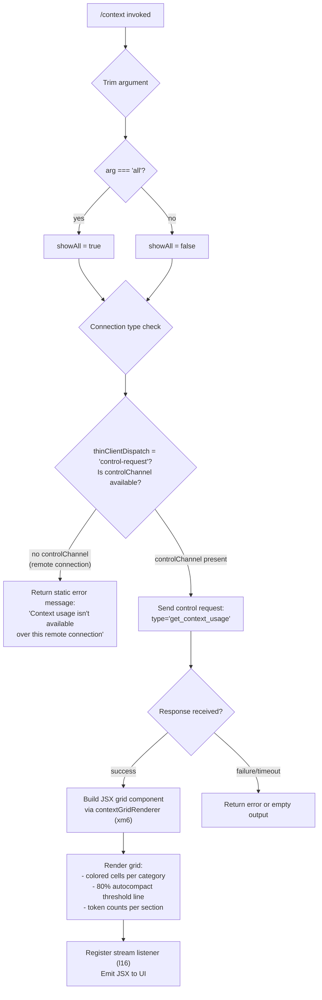

# `/context`

> Analysis basis: CC v2.1.176 bundle.js (AST extraction + Claude interpretation)
> Minimum version: v2.1.176

---

## Overview

`/context` visualizes the current context window usage as a colored grid displayed in the terminal. The command dispatches a `get_context_usage` control request over the active session channel and renders the response as a JSX-based grid component, showing breakdowns by category (system prompt, messages, tools, memory files, etc.) along with a threshold indicator for the autocompact boundary (80%).

---

## Registration

| Field | Value |
|---|---|
| type | `local-jsx` |
| name | `context` |
| description | `Visualize current context usage as a colored grid` |
| argumentHint | `[all]` |
| thinClientDispatch | `control-request` |
| module_id | `V8K` |
| load_inline | `true` |
| loc_byte | `11762563` |
| loc_byte_end | `11762789` |
| loc_line | `7562` |
| arbor_handler.name | `amL` |
| arbor_handler.fqn | `claude-2.1.176::amL` |
| arbor_handler.kind | `AsyncFunction` |
| arbor_handler.resolution_path | `module_id` |
| arbor_handler.n_hits | `0` |

Analysis basis: CC v2.1.176 bundle.js:+11762563

---

## Input Branching

The command has three distinct branches based on the argument and connection state:



Analysis basis: CC v2.1.176 bundle.js:+11761157, +11761214, +11761241, +11761323, +11761353

---

## Behavioral Spec

### Handler Entry Point (asyncContextHandler)

```
async function asyncContextHandler(args, context):
    trimmedArg = args.trim()                        // +11761163
    showAll = (trimmedArg === "all")                // +11761188, +11761196

    if context.type === "controlChannel":            // +11761214
        return errorMessage(
            "Context usage isn't available over this remote connection"
        )                                            // +11761241

    usageResponse = await context.sendControlRequest(
        { type: "get_context_usage" }               // +11761323, +11761353
    )

    gridElement = buildContextGrid(usageResponse, showAll)   // xm6, +11761493
    thresholdLine = computeThreshold(usageResponse)          // omL/Tz, +11761666

    jsxOutput = createElement(
        streamWrapper,                               // um6.createElement, +11761387
        gridElement,
        thresholdLine
    )

    registerStreamListener(jsxOutput)               // l16, +11761383
    return jsxOutput
```

Analysis basis: CC v2.1.176 bundle.js:+11761157

### Context Grid Builder (contextGridBuilder / xm6)

```
function contextGridBuilder(usageResponse, showAll):
    // Obtain total context window size
    contextWindowSize = getContextWindowSize()      // wK/Of/rff, +11759219

    // Filter categories based on showAll flag
    categories = usageResponse.filter(...)          // +11759260
    if not showAll:
        // Hide zero-count or minor categories
        categories = categories.filter(nonZero)

    // Find the autocompact boundary category
    autocompactEntry = categories.find(            // +11759578
        c => c.type === "compact_boundary"         // literal +11104756
    )

    // Build label strings for each category
    labels = [
        "Free space",                              // +11759295
        "Autocompact buffer",                      // +11759318
        "System prompt",                           // +10800092
        "System tools",                            // +10800173
        "MCP tools",                               // +10800238
        "Memory files",                            // +10800556
        "Messages",                                // +10801079
        // ... additional categories
    ]

    // Build colored grid cells
    for each category in categories:
        percentage = category.tokens / contextWindowSize
        colorCode = pickColor(percentage)          // g8H/wK, +11760995
        cell = renderCell(colorCode, percentage)

    // Format percentage string
    formattedPct = formatLocale(percentage,
        locale="en-US",                            // +219441
        style="compact"                            // +219459
    )

    // Render threshold marker at 80%
    thresholdPct = 0.80                            // literal +11761699 (value 80)

    return gridComponent
```

Analysis basis: CC v2.1.176 bundle.js:+11759219, +11759260, +11759295, +11759578, +11760995

### Threshold / Autocompact Boundary Renderer (thresholdRenderer / omL + Tz)

```
function thresholdRenderer(usageData):
    boundary = extractCompactBoundary(usageData)   // Tz/_p8/AX, +11761119
    // Slice the boundary position for display     // +11104909
    return boundaryMarker(boundary)
```

Analysis basis: CC v2.1.176 bundle.js:+11761666, +11761119, +11104886

### Control Request Dispatch (sendControlRequest)

```
function sendControlRequest(requestPayload):
    // Dispatches via the bridge control channel
    // Request type: "get_context_usage"            // +11761353
    // thinClientDispatch mode: "control-request"  // registration
    response = await bridgeChannel.sendControlRequest(requestPayload)
    return response
```

Analysis basis: CC v2.1.176 bundle.js:+11761323, +11761353

### Stream Listener Registration (l16)

```
function registerStreamListener(jsxElement):
    // Attaches a 'write' event listener to the stream  // literal +3928619
    stream.on("write", handler)                         // +8383421
    outputString = stream.toString()                    // +8383458
    // Renders via Vg/Ft/eXH component tree
    renderJsx(jsxElement)                               // Vg, +8383485
```

Analysis basis: CC v2.1.176 bundle.js:+11761383, +8383421

### Color Threshold Logic (percentageColorPicker / g8H)

```
function percentageColorPicker(percentage, contextWindowSize):
    roundedPct = Math.round(percentage * 100)      // +217488
    if roundedPct < 20:                            // literal +217459, "< 20" string +217468
        return greenCell
    if roundedPct < 10:                            // literal +217501
        return greenCell (bright)
    // default: gradient by percentage
    return coloredCell(roundedPct)
```

Analysis basis: CC v2.1.176 bundle.js:+217485, +217488, +217459, +217501

### Percentage Formatter (percentFormatter / wK / Of)

```
function percentFormatter(value):
    // Formats with en-US locale, compact notation
    // Appends ".0" if no decimal present            // literal +217429
    formatted = value.toLocaleString("en-US",       // +219441
        { style: "compact" }                         // +219459
    )
    return formatted
```

Analysis basis: CC v2.1.176 bundle.js:+217415, +217362, +219441, +219459

---

## State & Side Effects

| Item | Detail |
|---|---|
| Telemetry | No `tengu_*` events are fired directly from the `amL` handler or its immediate children (`xm6`, `omL`, `l16`). Telemetry events in the call graph belong to deep infrastructure (settings load, compaction, MCP flows) not triggered by this command path. |
| Hook registration | `l16` registers a `write` event listener on the output stream (bundle.js:+8383421). Listener is torn down after render via standard stream lifecycle. |
| appState changes | None directly. The command is read-only: it queries context usage without mutating session state. |
| Control channel | Sends one `get_context_usage` control request (bundle.js:+11761353) via the bridge transport (`K.sendControlRequest`). |
| Sound | None. |
| Remote connection guard | If `thinClientDispatch` context type equals `"controlChannel"` (i.e., a remote thin-client connection), the command returns the static error string instead of making a network call (bundle.js:+11761214, +11761241). |

---

## Version History

| Version | Change |
|---|---|
| v2.1.176 | Initial analysis |

---

## Common Mistakes

1. **Running `/context` over a remote thin-client connection** — The command cannot retrieve context usage when the session transport lacks a local control channel. It will return `"Context usage isn't available over this remote connection"` and produce no grid.

2. **Expecting a full category breakdown by default** — Without the `[all]` argument, zero-usage categories are filtered out. Pass `/context all` to see every category including empty ones.

3. **Misinterpreting the 80% line** — The threshold marker at 80% (`literal +11761699`) indicates the autocompact trigger boundary (`"compact_boundary"` category, `+11104756`), not a hard context limit. Actual eviction may be delayed.

4. **Assuming token counts are real-time** — The grid reflects a snapshot at the moment the `get_context_usage` control request is serviced. Long-running tool calls happening concurrently may not be reflected.

5. **Confusing category color semantics** — Green cells indicate low utilization (< 20%, `+217459`). The color gradient does not map to error severity; it is purely a usage density indicator.

---

## Appendix — Identifier Mapping

> For bundle debugging only. Identifiers change across versions.

| Identifier | Role |
|---|---|
| `amL` | Async handler entry point for `/context` command |
| `y1` | Fullscreen / display environment detection utility |
| `f_H` | Environment flag checker (checks `Zuf` set) |
| `ah_` | Local-agent detection helper |
| `A6` | Generic string coercion / formatting utility |
| `Et` | Terminal capability probe |
| `pc4` | tmux control-mode detector |
| `mc4` | Terminal string prefix checker (`H.startsWith`) |
| `N` | Environment / platform info aggregator |
| `gff` | OS info collector (calls `Zy`, `BH_`, `JyA`) |
| `JyA` | Color support detector (`c9f`, `l9f`) |
| `CH` | JSON.stringify wrapper |
| `bf` | Path / string formatter (redaction, truncation) |
| `ikA` | Prefix mapping helper |
| `kQH` | Write-to-stream helper |
| `mkA` | Stream write executor |
| `lff` | File log writer / rotator |
| `AQH` | Deferred queue flusher (setTimeout/setImmediate loop) |
| `g4H` | Log segment joiner |
| `r$6` | File error handler (`E8`) |
| `skA` | Log path builder |
| `dH_` | File rotation handler (stat/rename/unlink) |
| `cff` | Async file append with rotation |
| `u9` | Hook registrar (`DyA.register`) |
| `oh_` | Windows-SSH ConPTY detection |
| `r_` | Settings loader / resolver |
| `GF` | Settings load orchestrator |
| `fq` | Deduplication guard (LSA set) |
| `AL_` | Settings load-from-disk core |
| `Tb` | Settings object constructor |
| `Uc4` | Context-state subscriber |
| `$6` | Reactive state read (qg Map) |
| `C6` | State-change emitter (Date.now, ug4) |
| `L7` | Locale / model name resolver |
| `by` | Model alias builder |
| `l16` | Stream write-event registrar and JSX renderer |
| `Vg` | JSX render root (Fk_, HS_) |
| `HS_` | React createElement wrapper |
| `Ft` | Context grid frame component |
| `eXH` | Grid inner component (Et, dy_, y1, A6, $6) |
| `gk_` | Grid segment sub-component |
| `xm6` | Context grid builder — main renderer |
| `wK` | Percentage formatter (Of/rff) |
| `Of` | Number locale formatter |
| `rff` | Locale string helper |
| `HlH` | Grid row label renderer |
| `g8H` | Color/percentage cell picker (Math.round) |
| `TH` | Token-count string formatter |
| `omL` | Threshold / compact-boundary renderer |
| `Tz` | Compact boundary extractor |
| `_p8` | Boundary position calculator |
| `AX` | Boundary value accessor |
| `cu8` | Full context-data assembly function |
| `nE` | Message/conversation data extractor |
| `el` | Conversation element parser |
| `NK` | Message content normalizer |
| `CJ` | Content-block categorizer |
| `Mq` | Model/tier resolver |
| `RF` | Replacement/redaction formatter |
| `yD` | Content-type dispatcher |
| `Sb` | System-prompt block handler |
| `AI1` | Admin model enforcement checker |
| `Kf` | String replace utility |
| `WN` | Provider inclusion checker |
| `Yq8` | Model alias resolution chain |
| `j1` | Model name normalizer |
| `MLH` | Model family classifier |
| `nl` | Provider resolver |
| `JT` | Token-length estimator |
| `mjH` | Diagnostic formatter |
| `_I1` | Content sub-type router |
| `fL` | Provider fallback resolver |
| `PyH` | Model capability checker |
| `kiH` | Model-id string builder |
| `yP4` | Case-normalizer for model names |
| `bm` | Model display-name mapper |
| `FZ` | Auto-compact config reader |
| `K4` | Config key accessor |
| `zN` | Config set tracker |
| `XL_` | Config path resolver |
| `I8` | Config value evaluator |
| `Pd` | Token window calculator |
| `L1` | Token-limit resolver |
| `tnH` | Per-entry token counter |
| `dz` | Model-specific limit lookup |
| `QL` | Limit string replacer |
| `JD` | Error normalizer |
| `bJ` | Numeric token-limit parser |
| `Qq9` | parseInt validator |
| `Vv_` | Compound limit evaluator |
| `dq9` | Model-default limit selector |
| `X9H` | Env-var token-limit parser |
| `bnq` | Compact-window size calculator |
| `R7A` | Token string parser (parseFloat/parseInt) |
| `mZ` | System-prompt assembly orchestrator |
| `M2A` | System prompt section builder |
| `x6` | Async store getter |
| `bs6` | Async store resolver |
| `T_` | Store error normalizer |
| `Tm8` | Sub-agent prompt section builder |
| `_aH` | Pewter-owl tool prompt builder |
| `vv_` | Tool prompt assembler |
| `J75` | Brief-mode system prompt selector |
| `bs` | Base system prompt accessor |
| `j75` | Brief-enabled system prompt |
| `X75` | Confirmation-prompt selector |
| `P75` | Wk1 prompt builder |
| `cjH` | Cj-section prompt accessor |
| `Ss` | Kf-based section builder |
| `w2A` | System prompt writer |
| `PK` | String coercion (String()) |
| `a75` | Alternate prompt writer |
| `nQ` | SDK prompt resolver |
| `R75` | Main system prompt composer |
| `S75` | Ip-based prompt sub-builder |
| `Ip` | jV9 prompt part |
| `hQ` | Hook prompt builder |
| `jd` | Flat-map prompt joiner |
| `i06` | Memory-load prompt builder |
| `V4` | Memory section accessor |
| `_1H` | Memory directory creator |
| `Mg` | Memory file stat checker |
| `K6` | nM6 helper |
| `IH` | Memory content reader |
| `Nf9` | Memory file batch processor |
| `Ld4` | JXH-based loader |
| `D` | Background session manager |
| `M` | MCP connection manager |
| `n06` | Memory path splitter |
| `dj` | Memory dispatch helper |
| `Ff9` | Team memory path joiner |
| `Bf9` | XXH-based memory filter |
| `Uf9` | XXH-based memory loader |
| `qh_` | XXH-based memory query |
| `g75` | env-info static section builder |
| `Yw` | OS/shell info formatter |
| `$2A` | Static env section accessor |
| `F75` | Full env-info assembler |
| `z2A` | OS version/type reader |
| `O2A` | Shell type detector |
| `V75` | Language section builder |
| `v75` | Output-style section builder |
| `d75` | Scratchpad/tmp dir section |
| `Y6A` | Worktree resolver |
| `c75` | Context-management section |
| `FfH` | $6 state reader |
| `AVH` | iK path joiner |
| `n75` | Brief-mode guard |
| `o75` | Reproduce-verify section builder |
| `vaH` | r_/C6 section resolver |
| `x75` | GrowthBook feature section |
| `E75` | Heron-brook section builder |
| `Z75` | Autonomy-append section |
| `_mq` | n36 / Promise.all cache section |
| `b75` | L2A section builder |
| `h75` | System section joiner |
| `T75` | System section core |
| `y75` | Verified-vs-assumed section |
| `I75` | w2A delegator |
| `k75` | Scheduled-task section builder |
| `bT` | zl/PK/$6 prompt part |
| `C75` | jd-delegating section |
| `sf9` | Memory system prompt combiner |
| `af9` | Memory prompt part builder |
| `HXH` | vN/$6 section |
| `vN` | Iv_/ZkH resolver |
| `M7` | p18 utility |
| `U75` | Token-window section builder |
| `Jm8` | Math.max token calculator |
| `cU` | Main conversation runner |
| `gf` | Conversation state getter |
| `UW` | A6/N0/hq context builder |
| `x_` | Module init bootstrap |
| `tO` | System prompt getter |
| `eH` | nM6 event emitter |
| `reH` | P9H filter runner |
| `P9H` | oeH set checker |
| `ThL` | Tool-list assembler |
| `GhL` | Tool header parser |
| `nu8` | Q75/tf9 sub-prompt builder |
| `Q75` | Full prompt builder for tools |
| `tf9` | Memory + tool combined builder |
| `$VK` | Section header slicer |
| `w46` | WCH/unq tool section renderer |
| `WCH` | Tool token counter / renderer |
| `kH` | JA/A6/JUF tool logger |
| `unq` | Token count section builder |
| `EhL` | Attachment/tool analyzer |
| `sAH` | ClaudeMd/Tf attachment handler |
| `Tf` | SK/XL attachment filter |
| `kE` | Attachment key extractor |
| `gZ6` | AutoMem filter |
| `ZhL` | MCP tool section builder |
| `jEH` | Promise.all tool map |
| `iu8` | Individual tool descriptor |
| `gS` | Fm/Dn.push stream segment |
| `hB` | Promise.race/all shutdown handler |
| `G` | Main UI component (editor/keyboard) |
| `tc` | kY UI helper |
| `lRK` | AY5/qY5/KY5/fY5/LY5 find operations |
| `hRK` | zn8/On8/NRK yank handler |
| `SRK` | zn8/On8/kRK visual-replace handler |
| `bRK` | zn8/On8/CRK visual-case handler |
| `b` | Register/clipboard manager |
| `uRK` | Visual-paste handler |
| `ZRK` | Join operation handler |
| `VRK` | Indent operation handler |
| `l0A` | Operator sub-command router |
| `S` | Command executor |
| `NhL` | Context usage data aggregator |
| `gM` | Math.round percentage helper |
| `hhL` | Deferred tool section builder |
| `VhL` | Built-in tool section builder |
| `Tu_` | oJ/Qc prompt section |
| `w9H` | Filter + some + eTK checker |
| `xnq` | xK recursive resolver |
| `xK` | Object property resolver (HasOwn, get, find) |
| `ShL` | Section state setter |
| `yhL` | CH/gM token section |
| `IhL` | gM/CH/A.get section |
| `khL` | CH/gM key section |
| `fG` | Full conversation formatter |
| `PkL` | Lu6 / K.push conversation chunk builder |
| `nLA` | Array label builder |
| `ioq` | waq conversation item handler |
| `ZkL` | f5A/L5A/M5A/$5A block renderer |
| `Q` | MCP process manager |
| `hkL` | eu8/Array.isArray block checker |
| `iLA` | Array.some/_.has inclusion checker |
| `VkL` | Array.some content filter |
| `vkL` | Array get/startsWith/add resolver |
| `y46` | _.some block checker |
| `FkL` | UUID generator (Zk.randomUUID) |
| `U8` | P/UUID/X message wrapper |
| `f0` | Message footer builder |
| `sm8` | tm8/soq/SkL state machine step |
| `Hh` | pu_/N/o_/M7 hook handler |
| `eLA` | Array.some/_.map/M6H extended block |
| `WkL` | Array.some/M6H/_.has/BE/A.map block |
| `Zoq` | Array flatMap/_.has block |
| `GkL` | H.some/Array.isArray block |
| `BkL` | Array/_.get/P9/pkL/aLA block |
| `Daq` | Deferred action queue |
| `IkL` | N/A.filter/q.some/ooq block |
| `ooq` | pN_/d/H.filter output handler |
| `eu8` | Full tool-result/attachment formatter |
| `gkL` | _.push/aLA/_.join/A.trim block |
| `ykL` | tm8/soq/RkL state step |
| `TC6` | Array/K.some/_.add/f.every/_.has block |
| `akL` | H.at/A.at/Yu6/d/A.slice block |
| `GC6` | Array/Ioq/L.some/A.add/sm8 block |
| `skL` | Array/d/H.slice block |
| `kkL` | _.at/H.slice/_.push/U8/aoq block |
| `noq` | H.map/Array/A.some/K.push block |
| `aoq` | A.at/sm8/A.push step |
| `EkL` | Array/$.every/$.filter/O.join block |
| `vhL` | vhL built-in tool list renderer |
| `Eu_` | w9H/oJ/Qc filter |
| `q2` | j1/Kf/L1/bP4 model resolver |
| `Vx6` | gM/$fA percentage cell |
| `JA` | Error/String error wrapper |
| `dKH` | Math.min/aMH/FZ/Pd token limit calc |
| `aMH` | eJH/X9H outer token limit |
| `eJH` | L1/Fq9/Math.min token limit core |
| `qH` | e/AH/E/y session holder |
| `e` | Promise.all session runner |
| `bg` | Core async iterator (TypedArray-based) |
| `J86` | parseInt hex parser |
| `kW8` | parseInt string parser |
| `t` | MCP update applier |
| `fbH` | SWH feedback handler |
| `vZA` | MCP client state rebuilder |
| `AH` | J session mapper |
| `E` | W/Math session handler |
| `W` | jM6/SR/Yh/Promise.all runner |
| `Po` | p_/$6 compact window reader |
| `pv9` | mv9/H.slice/fP/fG batch processor |
| `mv9` | P9H/uv9 filter |
| `fP` | chL/eu8 context packer |
| `chL` | D2H/eu8 content chunker |
| `J6` | Session connection handler |
| `MH` | Bridge connection manager |
| `S8` | sFf/Q6/CH file logger |
| `o6` | tH/J5 event dispatcher |
| `tH` | process.emit / RH status handler |
| `J5` | L6/aR/dH/E.push/pH session step |
| `t6` | Promise.all session runner (ccH/LQ/rZA) |
| `ccH` | Date.now/S8/ccH log flusher |
| `LQ` | p66/Kr/IWH/ip/$28 MCP config reader |
| `rZA` | Headless plugin installer |
| `p6` | LQ/Q4H plugin reconciler |
| `t4` | Math.round timing helper |
| `IJK` | Bridge ingress message handler |
| `YG8` | Message type reader |
| `c6` | JSON.parse helper |
| `u65` | Message ID reader |
| `m65` | Message handler router |
| `KjA` | Message dedup checker |
| `RH` | H display state holder |
| `kJK` | Control request handler (initialize/set_model/…) |
| `I` | Is/A identity handler |
| `v6` | M/rY/h8.map session viewer |
| `zH` | process.exit wrapper |
| `EA` | t.push/dH session tracker |
| `u9H` | qf/H.filter session filter |
| `u$H` | $6 session reader |
| `I_A` | $1/rk8 session initializer |
| `VH` | Session manager (m9H, d66, race) |
| `m9H` | MCP server connection handler |
| `y9H` | A6 session id maker |
| `$Q` | MQ/dv6 session state |
| `qN7` | OAuth/MCP server authenticator |
| `mf` | aI1 credential accessor |
| `zP` | CH/cp9.createHash token hasher |
| `HQ_` | File read async result |
| `z8` | ycH.push / Ms.logMCPDebug debug logger |
| `QX8` | Port randomizer |
| `h28` | zP/mf/z8 token refresh |
| `v28` | V28/A.startsWith/fetch HTTP fetcher |
| `Z28` | Array.isArray scope checker |
| `k` | Session lifecycle sweeper |
| `x` | clearTimeout / O.end / L.emit cleanup |
| `c` | Session slot manager |
| `R` | w.write / d writer |
| `ni` | TU_ token refresher |
| `V28` | AbortSignal.timeout / fetch HTTP client |
| `n` | i.preventDefault / Q key handler |
| `HN7` | H.includes inclusion guard |
| `d66` | E28 map get/set/delete entry manager |
| `xH` | YBH/K/q response container |
| `gH` | Ko/rY/jBH/Ty/se/of session completion handler |
| `Ko` | ph/xKH/K.sort sort merger |
| `jBH` | kNH/rY/K.sort/q.sort sort handler |
| `Ty` | eG display helper |
| `se` | ln_/l3/O.add session event aggregator |
| `j6` | h8.includes session filter |
| `of` | Prompt-injection detector |
| `kc6` | Session state checker |
| `meH` | eZ9.get/uM7/eZ9.set metadata cache |
| `PH` | clearTimeout promise holder |
| `NH` | PH/yL5 promise chain |
| `yL5` | Session task resolver |