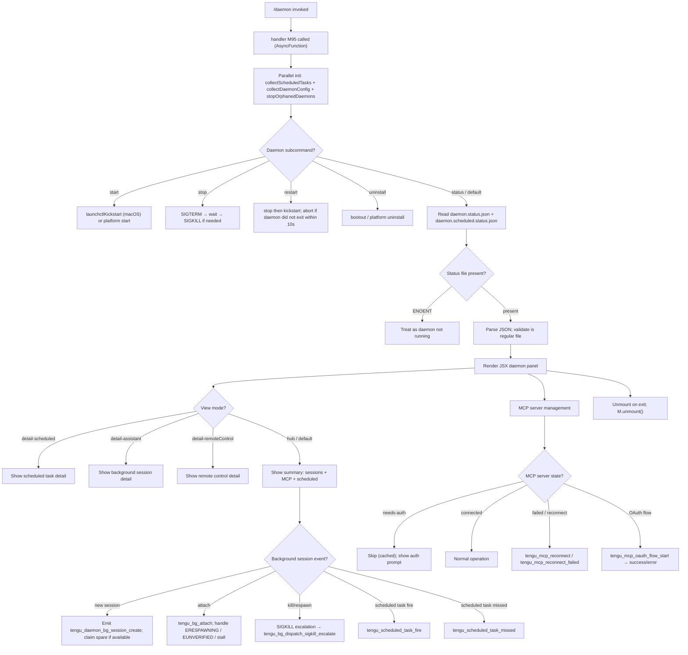

# `/daemon`

> Analysis basis: CC v2.1.176 bundle.js (AST extraction + Claude interpretation)
> Minimum version: v2.1.176

---

## Overview

The `/daemon` command provides a management interface for the Claude Code background daemon process and its associated background services. It allows users to inspect, start, stop, restart, and monitor daemon-managed background sessions, scheduled tasks, and MCP server connections. The command renders a live JSX UI panel that reflects daemon state in real time.

---

## Registration

| Field | Value |
|---|---|
| type | `local-jsx` |
| name | `daemon` |
| description | `Manage background services and routines` |
| immediate | `true` |
| module_id | `QJA` |
| load_inline | `true` |
| loc_byte | `13313437` |
| loc_byte_end | `13313605` |
| loc_line | `9703` |
| arbor_handler.name | `M95` |
| arbor_handler.fqn | `claude-2.1.176::M95` |
| arbor_handler.kind | `AsyncFunction` |
| arbor_handler.resolution_path | `module_id` |
| arbor_handler.n_hits | `0` |

Analysis basis: CC v2.1.176 bundle.js:+13313437

---

## Input Branching

The command has more than three distinct branches spanning daemon subcommand dispatch, background session lifecycle, scheduled task firing, and MCP reconnect logic. A Mermaid flowchart is used below.



Analysis basis: CC v2.1.176 bundle.js:+13302187 (M95 entry), +13301708 (daemonStatusCollector/FJA), +13312393 (J95 parallel init)

---

## Behavioral Spec

### 1. Top-level Handler — `daemonCommandHandler` (M95)

```
async function daemonCommandHandler(context):
    results = await Promise.all([
        collectDaemonStatus(),       // FJA
        collectScheduledConfig(),    // pJA
        evaluateModelConfig()        // E0K
    ])
    render daemonUI(results)
```

The handler is an `AsyncFunction` resolved via `module_id → QJA`. It fans out into three parallel async operations before mounting the JSX panel.

Analysis basis: CC v2.1.176 bundle.js:+13302187

---

### 2. Daemon Status Collection — `collectDaemonStatus` (FJA)

```
async function collectDaemonStatus():
    [scheduledTasks, resolvedConfig, orphanResult, statusJson, scheduledStatusJson, rosterData] =
        await Promise.all([
            readScheduledTaskList(),    // J0K
            resolveConfigPath(),        // $0K
            stopOrphanedDaemons(),      // xG
            readDaemonStatusFile(),     // RPK
            readScheduledStatusFile(),  // KWK
            readRosterFile()            // Rd
        ])
    return merged status object
```

Key file names observed:
- `"daemon.status.json"` — main daemon status file (bundle.js:+13096311)
- `"daemon.scheduled.status.json"` — scheduled daemon status (bundle.js:+13188463)
- `"daemon.json"` — daemon configuration (bundle.js:+11801882)
- `"roster.json"` — background session roster (bundle.js:+11808621)

Analysis basis: CC v2.1.176 bundle.js:+13301708

---

### 3. Scheduled Task List Reading — `readScheduledTaskList` (J0K)

```
async function readScheduledTaskList():
    [rawList, logBuffer, pidFileData] = await Promise.all([
        readConfigFile(),       // RL6 → ljA
        readRingBuffer(),       // kH
        readPidFile()           // xG
    ])

    for each entry in rawList:
        if entry type == "scheduled":
            accumulate into scheduledEntries
    return scheduledEntries
```

- Config file is read with encoding `"utf8"`, max size `1048576` bytes (1 MiB). Analysis basis: CC v2.1.176 bundle.js:+13097131, +13097250
- The string `"scheduled"` is used as the task type discriminator. Analysis basis: CC v2.1.176 bundle.js:+13189968
- Data events on the ring buffer use chunk size `1024`. Analysis basis: CC v2.1.176 bundle.js:+16884532

---

### 4. Orphaned Daemon Cleanup — `stopOrphanedDaemons` (xG)

```
async function stopOrphanedDaemons():
    pidFileState = await readAndStatPidFile()   // Fm6

    if pidFileState is not a regular file:
        if size > 65536: remove file             // bundle.js:+11800383
        return

    pidContent = await readPidFile()
    lines = pidContent.split(newline)
    processSlice = lines.slice(0, 4)             // bundle.js:+11801335

    for each pid in processSlice:
        if process name matches "claude daemon":  // bundle.js:+11801308
            process.kill(pid)
        else:
            log mismatch

    daemonSocket = await connectOrProbe()        // WW → bS
```

Analysis basis: CC v2.1.176 bundle.js:+11801389 (Fm6), +11801417 (process.kill), +11801308 (string match)

---

### 5. Roster File Handling — `parseRosterFile` (Rd)

```
async function parseRosterFile():
    stat = await fs.lstat(rosterPath)           // V6H → gOH path builder

    if not a regular file:
        log "is not a regular file — removing"  // bundle.js:+11812797
        emit tengu_bg_roster_parse_failed
        await fs.rm(rosterPath)
        return empty roster

    if error code in {E2BIG, EFTYPE}:          // bundle.js:+11812923, +11812935
        rotate file via renameWithTimestamp()   // RU8 → fs.rename + Date.now
        return empty roster

    rawContent = await fs.readFile(rosterPath)
    decoded = decodeUtf8(rawContent)            // k8
    parsed = JSON.parse(decoded)                // c6
    validated = validateRosterSchema(parsed)    // S_K → Array.isArray + Object.keys

    for each entry in validated:
        if entry.sessionId in allowedSet:       // AUL.has
            accumulate
        else:
            encode as String and skip

    return validated roster entries
```

Analysis basis: CC v2.1.176 bundle.js:+11812650 (Rd), +11812843 (telemetry), +11812923 (E2BIG)

---

### 6. macOS Service Control — `launchctlControl` (Ro / p8 / vU8)

```
async function launchctlControl(subcommand):
    // subcommand ∈ {"kickstart","bootout","start","stop","restart"}
    agentPath = buildLaunchAgentsPath()   // path.join(homedir(), "Library", "LaunchAgents", ...)
                                          // bundle.js:+11802197, +11802207

    if subcommand == "start":
        exec launchctl kickstart agentPath
    elif subcommand == "stop":
        exec launchctl bootout agentPath  // bundle.js:+11803968
        wait for process exit
    elif subcommand == "restart":
        exec stop, then kickstart
        timeout = 50 polls × 200ms       // bundle.js:+11804623
        if timeout exceeded:
            log "daemon did not exit within 10s of SIGTERM; restart aborted before kickstart"
                                         // bundle.js:+11804652
    elif subcommand == "uninstall":
        log "service uninstall not available on darwin"  // bundle.js:+11804099

    launchctlPrint = exec("launchctl print ...")  // bundle.js:+11805470, +11805483
    timeout 5000ms for print result               // bundle.js:+11805517

    uid = process.getuid()                        // W_K
```

Analysis basis: CC v2.1.176 bundle.js:+11805467 (Ro), +11803940 (t46/_$A)

---

### 7. Background Session Dispatch — `sessionDispatcher` (qI5 / D)

This is the core daemon-side IPC handler. Messages arrive over a Unix socket.

```
function handleSocketMessage(message, peerContext):
    switch message.type:
        case "ping":   reply "pong"
        case "yield":  yield timeslice
        case "lease":  return active lease set
        case "leases": enumerate all leases
        case "shutdown": initiate graceful shutdown
        case "dispatch": route to agent job
            if client lacks daemon control key → EAUTH
            if job not found → ENOJOB            // bundle.js:+16969844
            if job not accepting replies → ENOREPLY  // bundle.js:+16969961
        case "reply":   forward reply to job
        case "exec":    spawn new job
        case "kill":    SIGTERM → escalate to SIGKILL if needed
            emit tengu_bg_dispatch_sigkill_escalate  // bundle.js:+16981999
        case "respawn-stale": check staleness → respawn
        case "resize":  resize PTY
        case "attach":  attach viewer to session
            states: starting / resuming / adopted / crashed
            on stall → tengu_bg_attach_stall_respawn  // bundle.js:+16974422
            on kick   → tengu_bg_attach_kick          // bundle.js:+16975414
        case "ensure-spare": provision spare slot
        case "permission-response": forward permission answer
        case "snapshot": return terminal snapshot
        case "subscribe": register event subscriber
        case "stream":   stream output
        case "list":     list active jobs
        case "has":      check job exists
```

Error codes observed: `EAUTH`, `ENOJOB`, `ENOREPLY`, `ESTARTING`, `EPROTO`, `EUNKNOWN`, `ETOOLARGE`, `EUNVERIFIED`, `ERESPAWNING`, `ECONNREFUSED`.
Analysis basis: CC v2.1.176 bundle.js:+16966340 through +16977605

---

### 8. Spare Session Management — `spareSessionManager` (vVA / WVA)

```
async function manageSpareSession(config):
    emit tengu_bg_spare_enable                   // bundle.js:+16983304
    claimResult = await claimSpareSlot()         // WVA → ed.claim
    if claim succeeded:
        emit tengu_bg_spare_claim                // bundle.js:+16983432
        writeSessionState()                      // h2A → fs.mkdir + fs.writeFile
        dimensions = {cols: 448, rows: 384}      // bundle.js:+13881050, +13881101
    else:
        emit tengu_bg_spare_claim_fail           // bundle.js:+16983698

    spawnWorker = ed.spawn()

    monitor memory:
        freeMemMB = os.freemem() / (1024*1024)
        if freeMemMB < threshold:
            emit tengu_bg_dispatch_low_mem       // bundle.js:+16982600
            emit tengu_bg_low_mem_mb             // bundle.js:+13372785

    on SIGTERM:
        emit tengu_daemon_control with event "daemon_stop"    // bundle.js:+17019485
        if stop fails:
            emit tengu_daemon_control with "daemon_stop_failed" // bundle.js:+17019522
```

Analysis basis: CC v2.1.176 bundle.js:+16983394 (vVA), +16959636 (WVA), +16982315 (tengu_daemon_bg_session_create)

---

### 9. Scheduled Task Lifecycle — `scheduledTaskRunner` (c / c66 / vVA inner)

```
function processScheduledTask(task, now):
    if task.nextFireTime <= now:
        emit tengu_scheduled_task_fire          // bundle.js:+16468243
        executeTask(task)

        if task missed window:
            emit tengu_scheduled_task_missed    // bundle.js:+16467492

        if task expired:
            emit tengu_scheduled_task_expired   // bundle.js:+16468586

        if task is recurring:
            schedule next fire
            label includes " (recurring)"       // bundle.js:+16468220

    maxRunTimeSec = 60                          // bundle.js:+16468473
```

Analysis basis: CC v2.1.176 bundle.js:+16467492, +16468243

---

### 10. MCP Server Lifecycle within Daemon — `mcpServerManager` (LbH / k28 / $r)

```
async function manageMcpServer(serverConfig):
    if serverConfig.state == "disabled": skip
    if serverConfig.type == "stdio":    launchStdioServer
    if serverConfig.type == "sse":      connectSSE
    if serverConfig.type == "http":     connectHTTP
    if serverConfig.type == "sse-ide":  connectIDESSE
    if serverConfig.type == "ws-ide":   connectIDEWebSocket
    if serverConfig.type == "claudeai-proxy": connectProxy

    if server needs-auth (cached):
        log "Skipping connection (cached needs-auth)"  // bundle.js:+6776742
        return

    if recent failure cached:
        log "Skipping connection (recent failure cached; retries in 15 min...)"
                                                       // bundle.js:+6777004
        return

    connection = await connect(serverConfig)
    if connection == "needs-auth":
        startOAuthFlow():                   // m9H
            emit tengu_mcp_oauth_flow_start  // bundle.js:+6546116
            openLocalCallbackServer on 127.0.0.1  // bundle.js:+6550571
            timeout = 300000ms               // bundle.js:+6550668
            on success:
                emit tengu_mcp_oauth_flow_success  // bundle.js:+6551094
            on error (state_mismatch / token_exchange_failed / timeout / etc.):
                emit tengu_mcp_oauth_flow_error    // bundle.js:+6552805

    on reconnect needed:
        emit tengu_mcp_reconnect             // bundle.js:+6774747
        if reconnect returns needs-auth:
            log "Reconnect returned 'needs-auth'; retrying once after cache clear"
                                             // bundle.js:+6774592
            emit tengu_mcp_reconnect_needs_auth_discovery  // bundle.js:+6775075
        if reconnect fails:
            emit tengu_mcp_reconnect_failed  // bundle.js:+6775460

    log MCP skills telemetry:
        emit tengu_mcp_skills                // bundle.js:+6653207
```

MCP server config scopes: `"enterprise"`, `"user"`, `"project"`, `"local"`, `"mcp"`. Analysis basis: CC v2.1.176 bundle.js:+6518123–+6518394

---

### 11. Daemon Config Hot Reload — `daemonConfigReloader` (w)

```
function watchConfigForChanges(supervisor):
    if config file mtime changed:              // bundle.js:+17002500
        reload config
        emit tengu_daemon_config_reload        // bundle.js:+16997877

    actions on config change:
        service.stop()
        service.updateConfig(newConfig)
        service.start()

    supervisor state label = "supervisor"      // bundle.js:+16997084
```

Analysis basis: CC v2.1.176 bundle.js:+16997059

---

### 12. JSX Panel Rendering — `renderDaemonPanel` (J95 / gJA)

```
function renderDaemonPanel(state):
    [view, setView] = useState(initialView)
    clockRef = useClock()                    // b1 → Gw9.useContext
    startTime = Date.now()

    switch view:
        case "hub":              renderSummaryHub()
        case "detail-scheduled": renderScheduledDetail()   // bundle.js:+13303018
        case "detail-assistant": renderAssistantDetail()   // bundle.js:+13303176
        case "detail-remoteControl": renderRemoteControlDetail()  // bundle.js:+13303297

    // Subcommand buttons rendered: start, stop, restart, uninstall, new
    // Labels: "Scheduled", "Remote Control", "Claude daemon"
    //         bundle.js:+13303945, +13304266, +13304551

    on unmount:
        M.unmount()                          // bundle.js:+13313024
```

Analysis basis: CC v2.1.176 bundle.js:+13302398 (gJA), +13312810 (M.render), +13313024 (M.unmount)

---

## State & Side Effects

| Item | Detail |
|---|---|
| Telemetry: `tengu_bg_roster_parse_failed` | Fired when roster.json cannot be parsed as a regular file (bundle.js:+11812843) |
| Telemetry: `tengu_mcp_oauth_flow_start` | MCP OAuth flow initiated (bundle.js:+6546116) |
| Telemetry: `tengu_mcp_oauth_flow_success` | OAuth flow completed successfully (bundle.js:+6551094) |
| Telemetry: `tengu_mcp_oauth_flow_error` | OAuth flow failed (bundle.js:+6552805) |
| Telemetry: `tengu_daemon_config_reload` | Daemon config reloaded after mtime change (bundle.js:+16997877) |
| Telemetry: `tengu_mcp_skills` | MCP server skill inventory reported (bundle.js:+6653207) |
| Telemetry: `tengu_config_auth_loss_prevented` | Auth loss prevented during config save (bundle.js:+3331874) |
| Telemetry: `tengu_feature_ok` / `tengu_feature_bad` | Feature flag checks (bundle.js:+1018758, +1018825) |
| Telemetry: `tengu_daemon_control` | Daemon stop / stop-failed (bundle.js:+17019560) |
| Telemetry: `tengu_bg_proto_mismatch` | Protocol version mismatch on socket (bundle.js:+16967784) |
| Telemetry: `tengu_bg_dispatch_stale_drop` | Stale dispatch dropped (bundle.js:+16969183) |
| Telemetry: `tengu_bg_attach_legacy_autorespawn` | Legacy client auto-respawn triggered (bundle.js:+16972071) |
| Telemetry: `tengu_bg_attach` | Session attach recorded (bundle.js:+16973229) |
| Telemetry: `tengu_bg_attach_stall_gave_up` | Attach stall — gave up (bundle.js:+16974152) |
| Telemetry: `tengu_bg_attach_stall_respawn` | Attach stall — respawning (bundle.js:+16974422) |
| Telemetry: `tengu_bg_attach_kick` | Session kicked from another window (bundle.js:+16975414) |
| Telemetry: `tengu_scheduled_task_missed` | Scheduled task missed its window (bundle.js:+16467492) |
| Telemetry: `tengu_bg_dispatch_sigkill_escalate` | SIGTERM escalated to SIGKILL (bundle.js:+16981999) |
| Telemetry: `tengu_bg_low_mem_mb` | Low memory event with MB value (bundle.js:+13372785) |
| Telemetry: `tengu_bg_dispatch_low_mem` | Dispatch blocked due to low memory (bundle.js:+16982600) |
| Telemetry: `tengu_scheduled_task_fire` | Scheduled task fired (bundle.js:+16468243) |
| Telemetry: `tengu_scheduled_task_expired` | Scheduled task expired without firing (bundle.js:+16468586) |
| Telemetry: `tengu_bg_spare_enable` | Spare session pool enabled (bundle.js:+16983304) |
| Telemetry: `tengu_bg_sendclaim_failed` | Send-claim to spare session failed (bundle.js:+16959837) |
| Telemetry: `tengu_bg_state_read_transient` | Background state read transient error (bundle.js:+4261246) |
| Telemetry: `tengu_bg_spare_claim` | Spare session successfully claimed (bundle.js:+16983432) |
| Telemetry: `tengu_bg_spare_claim_fail` | Spare session claim failed (bundle.js:+16983698) |
| Telemetry: `tengu_mcp_reconnect` | MCP server reconnect attempted (bundle.js:+6774747) |
| Telemetry: `tengu_mcp_reconnect_not_connected` | Reconnect found server not connected (bundle.js:+6774763) |
| Telemetry: `tengu_mcp_reconnect_needs_auth_discovery` | Reconnect triggered auth re-discovery (bundle.js:+6775075) |
| Telemetry: `tengu_mcp_reconnect_failed` | Reconnect failed (bundle.js:+6775460) |
| Telemetry: `tengu_daemon_bg_session_create` | New background session created (bundle.js:+16982315) |
| File reads | `daemon.status.json`, `daemon.scheduled.status.json`, `daemon.json`, `roster.json`, `mcp-needs-auth-cache.json` |
| File writes | Session state JSON (cols 448, rows 384); config updates via atomic rename |
| Socket | Unix domain socket for IPC between CLI and daemon supervisor |
| JSX mount/unmount | Panel mounts on command entry; `M.unmount()` called on exit |
| Process signals | `SIGTERM` sent for stop; escalates to `SIGKILL`; `process.kill()` for orphan cleanup |
| macOS launchctl | `kickstart`, `bootout`, `print` used for service management |
| MCP OAuth HTTP server | Localhost callback server on `127.0.0.1`; timeout 300 000 ms; path `/callback` |

---

## Version History

| Version | Change |
|---|---|
| v2.1.176 | Initial analysis |

---

## Common Mistakes

1. **Running `/daemon restart` when the daemon is already unresponsive** — the restart waits for SIGTERM to be acknowledged (up to 10 s / 50 polls); if the daemon process is zombied, the restart will abort before `kickstart`. Manually remove the PID file and retry.
2. **Expecting `/daemon uninstall` to work on macOS** — the `"service uninstall not available on darwin"` path is logged and the command exits early (bundle.js:+11804099). Use `bootout` manually.
3. **Stale roster.json blocking session attach** — if `roster.json` is not a regular file (e.g., a directory or symlink), the command removes it automatically and emits `tengu_bg_roster_parse_failed`. Do not replace it manually with a non-file.
4. **MCP auth cache preventing reconnects** — the `mcp-needs-auth-cache.json` file causes 15-minute backoff. Editing the plugin config to trigger a hash change bypasses the cache.
5. **OAuth callback URL on remote sessions** — the local callback server runs on `127.0.0.1`; on SSH/remote sessions the browser redirect fails to load. Users must copy the full redirect URL from the browser address bar and provide it manually (bundle.js:+6577394–+6577537).

---

## Appendix — Identifier Mapping

> For bundle debugging only. Identifiers change across versions.

| Identifier | Role |
|---|---|
| `M95` | Main async handler for `/daemon` command (arbor_handler) |
| `J95` | JSX panel renderer / render loop |
| `gJA` | React component for daemon panel UI |
| `FJA` | Daemon status collector (fans out to all status reads) |
| `J0K` | Scheduled task list reader |
| `RL6` | Config file reader dispatcher |
| `ljA` | Low-level config file reader (stat + readFile + JSON.parse) |
| `WJA` | Scheduled entry array validator |
| `XJA` | Scheduled entry transformer |
| `kH` | Ring buffer / log buffer reader |
| `JA` | Error constructor wrapper |
| `A6` | String coercion utility |
| `Aq` | Essential-traffic filter |
| `JUf` | Ring buffer shift/push manager |
| `xG` | Orphaned daemon stopper / PID file reader |
| `Fm6` | PID file stat + conditional removal |
| `s3A` | PID file content parser (split lines, slice) |
| `WW` | Daemon socket connector |
| `$0K` | Config path resolver |
| `nZH` | Config file stat + ENOENT handler |
| `E8` | Base error type |
| `l9` | AsyncLocalStorage store accessor |
| `mJA` | Config path builder helper |
| `TH` | String formatter |
| `ju` | Path join + M_ helper |
| `RPK` | daemon.status.json reader |
| `dU6` | daemon.status.json path builder |
| `KWK` | daemon.scheduled.status.json reader |
| `qWK` | daemon.scheduled.status.json path builder |
| `Rd` | Roster file parser (main) |
| `V6H` | Roster path builder |
| `gOH` | Roster base path builder |
| `K6` | nM6 wrapper (small utility) |
| `nM6` | Core utility (low-level) |
| `RU8` | Roster file rotate-on-error (rename + Date.now) |
| `rm6` | Timestamp helper using Date.now |
| `c6` | JSON.parse wrapper |
| `k8` | UTF-8 decoder |
| `GL` | Error code classifier |
| `Ca` | Error category tagger |
| `S_K` | Roster schema validator (Array.isArray + Object.keys) |
| `uIA` | Unified error annotator |
| `sG` | nM6-backed error sink |
| `z1` | nM6-backed classifier |
| `Ro` | macOS launchctl service controller |
| `p8` | launchctl process spawner |
| `n_` | Process spawner with signal handling |
| `x6` | Low-level exec helper |
| `vU8` | UID-aware launchctl wrapper |
| `W_K` | process.getuid() wrapper |
| `pJA` | Scheduled config collector |
| `T_` | eG-backed template helper |
| `eG` | String template engine |
| `ts6` | Scheduling config reader |
| `Q6` | Config key accessor |
| `N` | Notification / log emitter |
| `gff` | Notification formatter |
| `JyA` | Notification type classifier |
| `H` | Random-delay helper (Math.random + setTimeout) |
| `CH` | JSON.stringify wrapper |
| `bf` | Text redactor / "[REDACTED]" replacer |
| `ikA` | Map-based text processor |
| `kQH` | Write-to-stream helper |
| `mkA` | H.write wrapper |
| `lff` | Log file writer (mkdir + appendFile + rotate) |
| `AQH` | Batch log flusher (clearTimeout + setTimeout + setImmediate) |
| `g4H` | Log path builder |
| `r$6` | E8-backed write error handler |
| `skA` | Log path finalizer |
| `dH_` | Log file rotator (stat + rename + unlink) |
| `cff` | Log append-and-rotate core |
| `u9` | DyA.register hook |
| `M` | JSX render engine (render + unmount) |
| `LbH` | MCP server manager / connection orchestrator |
| `LQ` | MCP server slot processor |
| `p66` | Mh + y7H server wrapper |
| `Kr` | Per-server connection handler |
| `ip` | SDK-type server connector |
| `$28` | Error color formatter (red/yellow) |
| `x66` | SSE/HTTP server connector |
| `EZ` | Jw + Fg_ connection result handler |
| `Jw` | Connection result applier (rAH + C6 + Lq) |
| `d8` | _ wrapper |
| `uN6` | MCP update dispatcher |
| `do9` | MCP state diff calculator |
| `ud_` | MCP needs-auth cache reader |
| `SWH` | MCP config hasher (sha256) |
| `rX8` | MCP server state mapper |
| `oX8` | MCP server observable builder |
| `zP` | MCP hash builder (CH + createHash) |
| `nX8` | mf-backed MCP normalizer |
| `mf` | aI1 core |
| `z8` | MCP debug logger (ycH.push + Ms.logMCPDebug) |
| `k28` | Per-slot MCP connection manager |
| `wN7` | MCP server type router |
| `hl` | Wm + qf OAuth helper |
| `N9H` | MCP claudeai-proxy connector |
| `h9H` | MCP ws-ide connector |
| `m9H` | MCP OAuth server (localhost callback, token exchange) |
| `d66` | Pending-connection deduplicator (E28 map) |
| `Y` | Forced-shutdown handler (process.exit + z.abort) |
| `R28` | MCP state persistence reader |
| `$r` | MCP reconnect orchestrator |
| `Wm` | qf-backed OAuth token manager |
| `w` | Daemon config supervisor (stop/updateConfig/start) |
| `K7` | MCP error logger (ycH.push + Ms.logMCPError) |
| `YN7` | Promise.race timeout wrapper |
| `zN7` | SSH detection + URL builder |
| `S28` | MCP OAuth tool registration |
| `Q66` | T28.get accessor |
| `c66` | E28.get accessor |
| `f` | Pending-set manager (add/finally/delete) |
| `to9` | MCP needs-auth cache writer |
| `IW8` | Cache file path builder |
| `_Q_` | MCP tool result hash updater |
| `j` | Job kill iterator (A.values + S.kill) |
| `S` | Worker process wrapper (P6f + N + kH + ZI5 + w.write) |
| `wh` | $6-backed MCP skills emitter |
| `$6` | Skills telemetry reporter |
| `Bg_` | P8-backed background agent launcher |
| `P8` | Agent config builder |
| `I` | Is-backed usage warning banner |
| `Is` | rf-backed usage credit checker |
| `ro9` | bg-backed async iterator |
| `bg` | Generic async iterator / stream processor |
| `J86` | parseInt-based port extractor (low bound) |
| `kW8` | parseInt-based port extractor (high bound) |
| `Ho8` | MCP update applier (applyMcpUpdate) |
| `fbH` | SWH-backed fingerprint builder |
| `wG` | D86-backed cleanup + reconnect |
| `D86` | SWH-backed server disposer |
| `$` | kPK-backed session store accessor |
| `kPK` | Session state reader (Cs + Date.now + l9 + dU6 + CH) |
| `Cs` | zLH session context builder |
| `vZA` | Session update dispatcher |
| `j28` | pv7 + ig_ permission set checker |
| `n8` | Timeout-backed retry helper |
| `O` | m8-backed output stream |
| `E0K` | Model config evaluator |
| `NrH` | MP6-backed model registry |
| `MP6` | BZ4-backed model config resolver |
| `BZ4` | Full model config object builder |
| `b1` | Gw9.useContext clock accessor |
| `pf` | Zg.useRef + useSyncExternalStore store hook |
| `z` | IH + bH + gS + hB shutdown coordinator |
| `IH` | d + eH feature-ok emitter |
| `eH` | nM6-backed feature error handler |
| `bH` | d + eH feature-bad emitter |
| `gS` | Fm + iyH + f2_ background session starter |
| `Fm` | Rb-backed session factory |
| `iyH` | FS-backed session initializer |
| `f2_` | Qf8 + randomUUID + OrH session spawner |
| `hB` | Promise.race shutdown race (NLH + hLH + n8 + process.exit) |
| `NLH` | vLH.shutdown wrapper |
| `hLH` | clearTimeout + SN_ shutdown cleaner |
| `G` | Main input handler / keypress router |
| `T` | uN6 + jM6 UI component |
| `jM6` | aeK key layout builder |
| `aeK` | Object.keys key map builder |
| `tc` | kY grapheme handler |
| `kY` | Grapheme cluster utility |
| `lRK` | AY5 + qY5 + KY5 + fY5 + LY5 vi-operator dispatcher |
| `AY5` | Vi normal-mode operator handler |
| `nRK` | Vi motion resolver |
| `qY5` | Vi count-prefixed motion |
| `KY5` | Vi find-motion handler |
| `fY5` | Vi f/F/t/T handler |
| `fFH` | Fw5 + f.equals find result comparer |
| `LY5` | d0A mark-based motion |
| `_n8` | GRK + Rw8 + Qw5 + dw5 mark handler |
| `hRK` | zn8 + On8 + NRK vi-insert dispatcher |
| `zn8` | Math.min/max + ERK cursor range calculator |
| `ERK` | H.lastIndexOf line-end finder |
| `On8` | x4 + H.endsWith + rvH line detector |
| `x4` | H.indexOf character finder |
| `rvH` | kY-backed grapheme wrapper |
| `NRK` | Vi insert-mode key handler |
| `x56` | Vi register + offset + text setter |
| `SRK` | Vi substitute handler |
| `kRK` | kY + q.setText + q.setOffset substitute core |
| `bRK` | Vi visual-replace handler |
| `CRK` | kY + toUpperCase/toLowerCase case handler |
| `b` | bRH + keH + yZ9 + riK register/history manager |
| `bRH` | Register file reader |
| `bMH` | yj8.join register path builder |
| `M9` | E8-backed register error |
| `xI` | H.trim + s57 + A.push register entry parser |
| `keH` | hj8.mkdir + hj8.writeFile register writer |
| `Cf` | eG-backed config path |
| `yZ9` | H.filter + IeH expired-entry pruner |
| `IeH` | xI + heH + q.getTime expiry checker |
| `P` | Buffer.concat + j.off + mL + TH socket reader |
| `X` | M + q.setTimeout socket frame handler |
| `mL` | H.end + CH socket message finalizer |
| `qI5` | Full daemon socket protocol handler |
| `l` | Fm6 + j_K PID file cleanup pair |
| `j_K` | ih.unlink + LfH + k8 PID unlinker |
| `riK` | H.map + eN + Math.max + q.join cron formatter |
| `eN` | Cron expression parser |
| `Y9H` | C8H + bRH + keH register sync |
| `C8H` | _.has register existence checker |
| `uRK` | Vi paste handler |
| `pRK` | Vi paste-at-offset handler |
| `ZRK` | Vi delete-motion handler |
| `MFH` | H.slice line splitter |
| `VRK` | Vi change-motion handler |
| `B0A` | L.startsWith + L.slice indent stripper |
| `D` | Background session dispatcher / job map manager |
| `Yd8` | a6 + $6 macOS memory probe |
| `aSH` | cJ.lstat + cJ.rm + cJ.readFile pins.json reader |
| `cT6` | nj.join + zZ pin path builder |
| `a17` | cJ.readdir recursive pin scanner |
| `Q` | l.on + process.kill + KF6.unlink PTY session manager |
| `c` | Session job record (z + F.add + G.has + X map) |
| `C` | clearTimeout + O.write PTY write helper |
| `F` | Job lifecycle tracker |
| `lZ` | y_K-backed late-connect handler |
| `p` | PTY pipe helper |
| `hv` | Buffer.from + Buffer.allocUnsafe + writeUInt32BE frame builder |
| `up8` | Buffer.alloc + Buffer.concat + readUInt32BE frame parser |
| `WVA` | ed.claim + h2A + ry5 + iy5 spare claim orchestrator |
| `h2A` | a6 + nm6 + Hc.mkdir + Hc.writeFile session state writer |
| `ry5` | Date.now + Error + E8 + n8 claim-timeout handler |
| `iy5` | ed.buildClaimFrame claim frame builder |
| `vVA` | Full spare session lifecycle manager |
| `wf` | nj.join + zZ workspace path builder |
| `$q` | cJ.lstat + st map file state tracker |
| `_O` | BN-backed object normalizer |
| `hPH` | K.startsWith + Wp.has + gT6.has permission filter |
| `xL` | IO + nj.join + CH + lJ workspace initializer |
| `A76` | R_K.then + Rd + Date.now + KUL roster update poller |
| `im6` | B$.join + lm6 import path builder |
| `QOH` | B$.join + UUH queue output helper |
| `Nk` | a6 + f$A + B$.join + _76 notify-kick helper |
| `Rv` | y_K-backed reconnect helper |
| `nm6` | B$.join + lm6 notify-message builder |
| `l0A` | Vi normal-mode motion dispatcher |
| `lw5` | Vi setOffset + QRK word-motion |
| `QRK` | Vi full normal-mode key handler |
| `nw5` | Vi count-prefixed word-motion |
| `iw5` | Vi insert-mode dispatcher |
| `m0A` | Vi text-object motion core |
| `dRK` | Vi delete-range handler |
| `rw5` | Vi count-prefixed delete |
| `ow5` | Vi An8-backed object motion |
| `An8` | Vi find + setLastFind + recordChange |
| `aw5` | Vi d0A mark + qn8 |
| `qn8` | Vi _n8 + x56 + recordChange |
| `sw5` | Vi setOffset + setLastFind |
| `tw5` | Vi fFH-backed forward motion |
| `ew5` | Vi LFH + BRK end-of-word |
| `LFH` | Vi fFH + K.equals + LFH insert handler |
| `BRK` | Vi q.equals + p0A + x56 + recordChange |
| `HY5` | Vi fn8-backed history motion |
| `fn8` | Vi qO6 + setText + setOffset + recordChange |
| `_Y5` | Vi $n8-backed line-end motion |
| `$n8` | Vi Math.min + B0A + K.join + setText line-end handler |
| `J` | D-backed job lookup |
| `t46` | _$A + p8 + vU8 + So.unlink macOS service bootstrapper |
| `_$A` | Qm6.join + e3A.homedir LaunchAgents path builder |
| `cm6` | A$A-backed scheduled manager restarter |
| `A$A` | vU8 + p8 + P_K.setTimeout scheduled daemon starter |
| `E` | W + Math.max + Math.min session event router |
| `W` | jM6 + SR + Yh + Promise.all + jr + hx + kH + JA MCP update broadcast |
| `V` | View state accumulator |

---

Note: index built via Arbor fallback; some signals (telemetry, literals) may be missing — see arbor-fallback.js.