# `/exit`

> Analysis basis: CC v2.1.176 bundle.js (AST extraction + Claude interpretation)
> Minimum version: v2.1.176

---

## Overview

The `/exit` command (also aliased as `/quit`) terminates the Claude Code CLI session. It triggers a multi-phase shutdown sequence: displaying a farewell message, flushing pending I/O, persisting session state, stopping background supervisors and MCP connections, and finally calling `process.exit`. The command is registered as a `local-jsx` type with `immediate: true`, meaning it executes without waiting for the agent turn to complete.

---

## Registration

| Field | Value |
|---|---|
| type | `local-jsx` |
| name | `exit` |
| description | `null` |
| aliases | `["quit"]` |
| immediate | `true` |
| loc_byte | `12997914` |
| loc_byte_end | `12998110` |
| loc_line | `9170` |
| module_id | `EJK` |
| load_inline | `true` |
| arbor_handler.name | `C65` |
| arbor_handler.fqn | `claude-2.1.176::C65` |
| arbor_handler.kind | `AsyncFunction` |
| arbor_handler.resolution_path | `module_id` |
| arbor_handler.n_hits | `1` |

Analysis basis: CC v2.1.176 bundle.js:+12997914

---

## Input Branching

The command follows a largely linear invocation path, but the shutdown sequence inside the main exit orchestrator (`exitOrchestrator`, resolved as `y9`) has 4+ distinct internal branches based on process state (running subprocesses, pending tasks, timeout racing, and forced-kill fallback). A Mermaid flowchart is used to represent this.

```mermaid
flowchart TD
    A["/exit or /quit invoked"] --> B["handler: exitHandler (C65)"]
    B --> C["Display farewell message: 'Goodbye!'"]
    C --> D["Play exit sound (H via Math.random + setTimeout)"]
    D --> E["Send detach-request via IPC (uOH → Jd)"]
    E --> F["Render scheduled-task status (bp8)"]
    F --> G["Start exit orchestration (y9)"]

    G --> H{"Any active UI mounts?"}
    H -- Yes --> I["Unmount Ink UI (XxH → H.unmount)"]
    H -- No --> J["Write terminal restore sequences to stdout (a3H.writeSync)"]
    I --> J

    J --> K["Flush stdout drain (qQH → DyA.drain)"]
    K --> L{"Background subprocesses running?"}
    L -- Yes --> M["Retire settled subprocesses (Q.retireIfSettled)"]
    M --> N["Send SIGTERM; wait up to 5000 ms"]
    N --> O{"Settled within timeout?"}
    O -- Yes --> P["Clean shutdown"]
    O -- No --> Q["Escalate: send SIGKILL (Fi_ → process.kill)"]
    Q --> P

    L -- No --> P

    P --> R["Stop supervisor (w → T.stop / E.stop)"]
    R --> S["Stop MCP connections (w → L.delete)"]
    S --> T["Await pending tool calls (m1q → Promise.allSettled)"]
    T --> U["Emit session_end telemetry (K6 → nM6)"]
    U --> V["Write startup-perf report if enabled (wO6)"]
    V --> W["Emit tengu_cache_eviction_hint"]
    W --> X["process.exit(0) via Fi_"]
```



Analysis basis: CC v2.1.176 bundle.js:+12997163, +7431716, +7430060

---

## Behavioral Spec

### 1. Top-Level Handler (`exitHandler` / `C65`)

```
async function exitHandler(context):
    // Step 1: show farewell
    displayFarewell("Goodbye!")                  // literal at +12997127
    renderJSXElement(AjA.createElement(...))     // local-jsx render at +12997240

    // Step 2: optional exit sound
    playExitSound()                              // soundPlayer(H) at +12997175

    // Step 3: send detach-request IPC message
    sendDetachRequest(context)                   // uOH at +12997179; literal "detach-request" at +11339954

    // Step 4: render scheduled-task status panel
    renderScheduledTaskStatus()                  // bp8 at +12997210; literal "scheduled task" at +11332964

    // Step 5: record prompt_input_exit telemetry marker
    recordTelemetryMarker("prompt_input_exit")   // literal at +12997351

    // Step 6: delegate to full exit orchestration
    await exitOrchestrator(context)              // y9 at +12997346

    return R65(aW)                               // farewell component at +12997333
```

Analysis basis: CC v2.1.176 bundle.js:+12997163

---

### 2. Exit Sound Player (`soundPlayer` / `H`)

```
function playExitSound():
    delay = Math.random() * 2 + 1   // random delay: 1–2 range, constants at +14138789, +14138805
    setTimeout(playAudioCallback, delay)
```

Analysis basis: CC v2.1.176 bundle.js:+14138791, +14138828

---

### 3. Detach-Request IPC Sender (`detachRequestSender` / `uOH`)

```
function sendDetachRequest(context):
    kq8(context)                                // pre-send check at +11339917
    sessionState = Zeq(context)                 // fetch session state (Wu8, m8) at +11339936
    writeIPCMessage(Jd, "detach-request")       // f6H.write via Jd at +10666076; literal at +11339954
    serializePayload(CH, JSON.stringify)        // JSON.stringify via CH at +189743
    eKH(context)                                // post-send callback at +11340030
```

Analysis basis: CC v2.1.176 bundle.js:+11339917, +11339954

---

### 4. Scheduled-Task Status Panel (`scheduledTaskRenderer` / `bp8`)

```
function renderScheduledTaskStatus():
    IE(eG)                                      // init render env at +11332945
    pushToRenderQueue(H)                        // H.push at +11332950; literal "scheduled task" at +11332964
    lines = lCL(context)                        // collect task lines at +11332991
    truncatedLine = Bq(line)                    // truncate to terminal width at +11333006
    return formatted lines
```

The `lCL` sub-function computes time-until-next-run for scheduled tasks:

```
function computeScheduledTaskLines(tasks):
    for each task:
        parsedTime = parseCronOrNatural(task)   // xI, s57 at +11333094
        nextRun = computeNextRunTime(parsedTime) // heH at +11333110
        delta = Math.max(0, nextRun.getTime() - Date.now())  // +11333169, +11333192
        humanDuration = formatDuration(delta)   // m9: Math.floor, Math.round at +216433
    return lines
```

Analysis basis: CC v2.1.176 bundle.js:+11332945, +11333077, +11333169

---

### 5. Exit Orchestrator (`exitOrchestrator` / `y9`)

This is the central shutdown sequencer.

```
async function exitOrchestrator(context):
    // Phase A: UI teardown
    unmountResult = XxH(context)               // unmount Ink, restore terminal at +7431784
    writeSync(a3H, restoreSequences)           // terminal escape sequences at +7432280

    // Phase B: flush output
    await qQH(DyA.drain)                       // drain stdout at +7431909; DyA.drain at +65246

    // Phase C: subprocess shutdown with timeout
    timeout = Math.max(5000, 3500)             // constants at +7431813, +7431820
    timer = setTimeout(forcedKillCallback, timeout)
    raceResult = await Promise.race([          // +7431933
        awaitSubprocessSettle(),               // Fi_ path
        AbortSignal.timeout(timeout)           // +7432098
    ])
    clearTimeout(timer)                        // +7432010

    // Phase D: stop supervisor and MCP
    supervisorRef = w(context)                 // supervisor wrapper at +7431987
    supervisorRef.T.stop()                     // +16997352
    supervisorRef.E.stop()                     // +16997472
    supervisorRef.L.delete(...)                // MCP connection cleanup at +16997361

    // Phase E: await pending tool calls
    await m1q(Promise.allSettled, Array.from) // +7432058

    // Phase F: write startup-perf report if profiling enabled
    wO6(perfData)                              // _6_ → XSA at +7432134

    // Phase G: cache eviction hint telemetry
    emit("tengu_cache_eviction_hint")          // +7432172

    // Phase H: session end event
    K6("session_end")                          // literal at +7432207; K6→nM6 at +3779

    // Phase I: final process exit
    d(context)                                 // +7432170
    writeSync(a3H, finalBytes)                 // +7432280
```

Analysis basis: CC v2.1.176 bundle.js:+7431716, +7431933, +7432058, +7432207

---

### 6. UI Unmount & Terminal Restore (`uiUnmounter` / `XxH`)

```
function unmountUI(context):
    writeSync(a3H, ESC_SAVE_CURSOR)            // "\x1b7" at +3868501
    inkInstance = u4.get(context)              // get Ink instance at +7429422
    if inkInstance:
        H.unmount()                            // +7429473
    _R(context)                                // restore routine at +7429507
    aO8(context)                               // terminal state finalizer at +7429555
    writeSync(a3H, ESC_RESTORE_CURSOR)         // "\x1b8" at +3868512
```

The `terminalStateFinalizer` (`aO8`) handles terminal-specific restore escape sequences and checks for terminal emulator identity:
- Detects `ghostty` ≥ 1.2.0 and `iTerm.app` ≥ 3.6.6 for OS-level notification support (literals at +3594681, +3594711, +3594750, +3594782)
- Handles `tmux` multiplexer double-escape sequences (`\x1b\x1b`) (literal at +3516432)
- Handles `screen` multiplexer (literal at +3516459)

Analysis basis: CC v2.1.176 bundle.js:+7429395, +7429473, +3868501, +3868512

---

### 7. Forced Kill Fallback (`forcedKillHandler` / `Fi_`)

```
async function forcedKillHandler(context):
    clearTimeout(pendingTimer)                  // +7429979
    procMap = u4.get(context)                   // +7430012
    if procMap is empty:
        process.exit(0)                         // +7430060
        return
    // escalate
    process.kill(pid, signal)                   // +7430085
    throw new Error("unreachable")              // literal "unreachable" at +7430133
```

Analysis basis: CC v2.1.176 bundle.js:+7430060, +7430085, +7430133

---

### 8. Supervisor Shutdown (`supervisorShutdown` / `w`)

```
function shutdownSupervisor(context):
    nZH(A0K.stat, ...)                         // file stat check at +16997059
    q.write(supervisionData)                    // +16997076
    q0K(sessionData)                            // session data writer at +16997278
    T.stop()                                    // stop primary supervisor at +16997352
    L.delete(connectionId)                      // remove MCP connection at +16997361
    E.stop()                                    // stop secondary supervisor at +16997472
    E.updateConfig(newConfig)                   // +16997481
    E.start()                                   // restart with updated config at +16997499
    j6f(cAH)                                   // heartbeat stop at +16997601; literal "heartbeat" at +16996305
    L.set(key, value)                           // update connection map at +16997646
    V.start()                                   // start replacement at +16997657
    emit("tengu_daemon_config_reload")          // +16997877
    d(context)                                  // finalize at +16997875
```

Analysis basis: CC v2.1.176 bundle.js:+16997059, +16997352, +16997877

---

### 9. Startup-Perf Report Writer (`startupPerfReporter` / `wO6`)

```
function writeStartupPerfReport(perfData):
    if not profiling enabled:
        return "Startup profiling not enabled"  // literal at +220432
    if no checkpoints:
        return "No profiling checkpoints recorded" // literal at +220522
    // build report
    _6_(perfData)                               // XSA: collects marks at +222577
    // serialize to file
    wSA(reportPath, reportData)                 // +220941
        // writes via fYH: openSync, writeFileSync, fsyncSync, closeSync
    emit("tengu_startup_perf")                  // +222612
    // write to stderr
    N(stderr, "Startup profiling report:")      // literal at +221310
```

Analysis basis: CC v2.1.176 bundle.js:+220432, +222612

---

## State & Side Effects

| Item | Detail |
|---|---|
| Telemetry: `tengu_cache_eviction_hint` | Fired during exit orchestration phase G (bundle.js:+7432172) |
| Telemetry: `tengu_daemon_config_reload` | Fired if supervisor config is reloaded/restarted during shutdown (bundle.js:+16997877) |
| Telemetry: `tengu_startup_perf` | Fired if startup profiling was active and a report is written (bundle.js:+222612) |
| Telemetry: `tengu_scroll_summary` | Fired by `ET8` during session teardown (bundle.js:+7431229) |
| Telemetry: `tengu_amber_creek` | Fired by `y1` / `Uc4` during display-mode teardown (bundle.js:+3527636) |
| Telemetry: `tengu_pewter_brook` | Fired by `y1` / `$6` during display-mode teardown (bundle.js:+3527544) |
| Telemetry: `tengu_bg_dispatch_sigkill_escalate` | Fired if a background session requires SIGKILL escalation (bundle.js:+16981999) |
| Telemetry: `tengu_bg_dispatch_low_mem` | Fired if low memory detected during background session cleanup (bundle.js:+16982600) |
| Telemetry: `tengu_bg_spare_enable` | Fired when a spare background session slot is enabled (bundle.js:+16983304) |
| Telemetry: `tengu_bg_spare_claim` | Fired when a spare session slot is claimed (bundle.js:+16983432) |
| Telemetry: `tengu_bg_spare_claim_fail` | Fired when spare session claim fails (bundle.js:+16983698) |
| Literal marker | `"prompt_input_exit"` recorded at command entry (bundle.js:+12997351) |
| Literal marker | `"session_end"` recorded at final exit phase (bundle.js:+7432207) |
| IPC message | `"detach-request"` sent to daemon/background process before teardown (bundle.js:+11339954) |
| Terminal escape sequences | Cursor save (`\x1b7`) and restore (`\x1b8`) written around UI unmount (bundle.js:+3868501, +3868512) |
| Sound | Random-delay audio played on exit via `Math.random` + `setTimeout` (bundle.js:+14138791, +14138828) |
| Subprocess cleanup | SIGTERM sent; SIGKILL escalation after ~5000 ms timeout (bundle.js:+7431813, +7430085) |
| Ink UI unmount | `H.unmount()` called if an Ink instance is active (bundle.js:+7429473) |
| Startup perf file | Written to disk via `fsyncSync` if profiling was active (bundle.js:+190354) |
| `process.exit` | Called unconditionally at end of `Fi_` shutdown path (bundle.js:+7430060) |

---

## Version History

| Version | Change |
|---|---|
| v2.1.176 | Initial analysis |

---

## Common Mistakes

1. **Typing `/quit` expecting different behavior** — `/quit` is a registered alias for `/exit` and follows the identical shutdown path. There is no behavioral difference between the two.
2. **Expecting instant termination** — Because `immediate: true` only means the command fires without waiting for the current agent turn, the actual `process.exit` call happens only after the full multi-phase shutdown sequence (IPC detach, UI unmount, stdout drain, subprocess termination, supervisor stop). In sessions with active subprocesses this may take up to ~5 seconds before SIGKILL escalation.
3. **Assuming background sessions are killed** — The command sends a `"detach-request"` IPC message rather than forcibly terminating daemon/background sessions. Background sessions may continue running independently.
4. **Expecting no disk I/O on exit** — If startup profiling is enabled, a performance report is written synchronously to disk (via `fsyncSync`) before `process.exit` is called.
5. **Ignoring SIGKILL escalation telemetry** — The `tengu_bg_dispatch_sigkill_escalate` event indicates a subprocess did not respond to SIGTERM within the grace period. If this appears frequently, investigate hung subprocesses or tools that do not honor SIGTERM.

---

## Appendix — Identifier Mapping

> For bundle debugging only. Identifiers change across versions.

| Identifier | Role |
|---|---|
| `C65` | Main exit command handler (AsyncFunction; Arbor-resolved entry point) |
| `G9` | Pre-exit context resolver / state accessor |
| `BjH` | Downstream state helper called by G9 |
| `H` | Exit sound player (also used as Ink instance reference in XxH context) |
| `uOH` | Detach-request IPC sender |
| `kq8` | Pre-send validation check within detach sender |
| `Zeq` | Session state fetcher within detach sender |
| `Wu8` | Session state sub-component (fetched by Zeq) |
| `m8` | Session state sub-component (fetched by Zeq) |
| `Jd` | IPC message writer (wraps f6H.write) |
| `CH` | JSON payload serializer (wraps JSON.stringify) |
| `eKH` | Post-send callback after detach request |
| `M3` | Intermediate context accessor in handler |
| `bp8` | Scheduled-task status panel renderer |
| `IE` | Render environment initializer |
| `eG` | Shared render environment object |
| `lCL` | Scheduled-task line collector / time formatter |
| `eN` | Per-task time-until-next-run calculator |
| `K` | Cron/schedule pattern formatter (padEnd, map) |
| `D` | Background daemon session manager |
| `f` | Subprocess tracking set manager (add/delete/finally) |
| `j` | Subprocess killer (iterates A.values, S.kill) |
| `Y` | Forced-shutdown initiator (EX, process.exit, z.abort) |
| `$` | Pattern matcher helper (kPK) |
| `J` | Date/UTC manipulation helper for schedule computation |
| `xI` | Natural-language time parser (trim, s57) |
| `s57` | Cron field tokenizer (split, match, parseInt, K.add, Array.from) |
| `A` | String normalizer (toLowerCase) |
| `heH` | Next-run time calculator (Date arithmetic) |
| `_` | Date instance used in heH |
| `O` | Mutable Date target in heH (setSeconds, setMinutes, etc.) |
| `L` | MCP connection map / closer |
| `q` | Data-channel / store reference |
| `m9` | Duration humanizer (Math.floor, Math.round) |
| `Bq` | Terminal-width-aware line truncator |
| `K8` | String visual-width measurer (Bun.stringWidth) |
| `B1` | Grapheme-aware string slicer |
| `kY` | Grapheme helper used by B1 |
| `R65` | Farewell JSX component wrapper |
| `y9` | Exit orchestrator (main shutdown sequencer) |
| `XxH` | Ink UI unmounter + terminal escape writer |
| `_R` | Terminal state restore routine |
| `aO8` | Terminal state finalizer (escape sequences, emulator detection) |
| `OSH` | Terminal emulator identifier / version checker |
| `_SH` | Terminal state sub-restorer |
| `i0` | Tmux/screen escape sequence handler (replaceAll) |
| `L5` | Supplementary terminal cleanup step |
| `N` | Stderr/debug message writer |
| `Bi_` | Shutdown path writer (writes final output lines, X6.dim) |
| `N0` | Shared utility used by Bi_ and ET8 |
| `iu` | Utility used by Bi_ |
| `S6` | Shared environment getter (eG) |
| `Fy6` | File existence / stat checker during shutdown |
| `iC` | Environment accessor (eG) |
| `T_` | Alternate environment accessor (eG) |
| `Q6` | Path resolver used by Fy6 / wSA |
| `x$` | Module resolution helper (S6, P4) |
| `P4` | Module path resolver (u9) |
| `N1q` | Output formatter used by Bi_ |
| `Fi_` | Forced-kill handler (clearTimeout, process.exit, process.kill) |
| `qQH` | Stdout drain awaiter (DyA.drain) |
| `w` | Supervisor shutdown orchestrator |
| `nZH` | File stat / session-file validator |
| `E8` | Error categorizer used by nZH and D |
| `l9` | AsyncLocalStorage store accessor (zd4.getStore) |
| `mJA` | Session metadata helper (uJA) |
| `TH` | String coercer used by nZH |
| `q0K` | Session data writer (Object.keys, Math.max, ZD) |
| `T` | Primary supervisor instance (stop method) |
| `uN6` | Supervisor internal utility |
| `jM6` | Supervisor transport manager (aeK) |
| `E` | Secondary supervisor instance (stop, updateConfig, start, Math.max, Math.min) |
| `W` | MCP connection manager (jM6, SR, Yh, Promise.all, jr, hx, kH, JA) |
| `j6f` | Heartbeat stopper (cAH) |
| `cAH` | Heartbeat implementation |
| `V` | Replacement supervisor/connection starter |
| `d` | Session finalizer / context disposer |
| `m1q` | Pending tool-call awaiter (Promise.allSettled, Array.from) |
| `wO6` | Startup-perf report writer (_6_, wSA) |
| `_6_` | Performance mark collector (XSA, d) |
| `XSA` | Performance mark aggregator (eu, q.set/get, Object.entries, Math.round, Number.parseInt, Object.assign) |
| `wSA` | Perf report file serializer (fYH, MSA, eu, JSA, XSA, JSON.stringify, K.map, N) |
| `jSA` | Report path builder ($O6.join, M_, S6) |
| `fYH` | Atomic file writer (openSync, writeFileSync, fsyncSync, closeSync) |
| `MSA` | Report content builder (eu, A.push, _.entries, qn6, _.at, pa, A.join) |
| `eu` | perf_hooks require() wrapper |
| `JSA` | Alternate path builder for perf report |
| `ET8` | Scroll summary / session metrics emitter (N0, v1q, d, V1q, y1) |
| `v1q` | Metrics sub-collector used by ET8 |
| `V1q` | Timing calculator (Date.now, Math.max, Math.round, Object.assign, E1q) |
| `E1q` | Timing sub-utility |
| `y1` | Display-mode teardown handler (f_H, ah_, Et, N, oh_, r_, Uc4, $6) |
| `f_H` | Feature-flag checker (Zuf.has) |
| `ah_` | Display alternate handler (A6) |
| `Et` | Display state restorer (pc4) |
| `oh_` | OS/platform checker (windows detection, Boolean) |
| `r_` | Fullscreen mode restorer (GF) |
| `Uc4` | Telemetry sender for amber-creek event ($6) |
| `$6` | Telemetry dispatcher (W06, G06, em, KXH.has, eM8, X06.add, qg.has/get, C6) |
| `W36` | Miscellaneous shutdown utility |
| `K6` | Session-end event emitter (nM6) |
| `nM6` | Session-end event implementation |
| `WxH` | Async wrapper / final write step (Promise.resolve, GT8, H) |
| `GT8` | Final output step used by WxH |