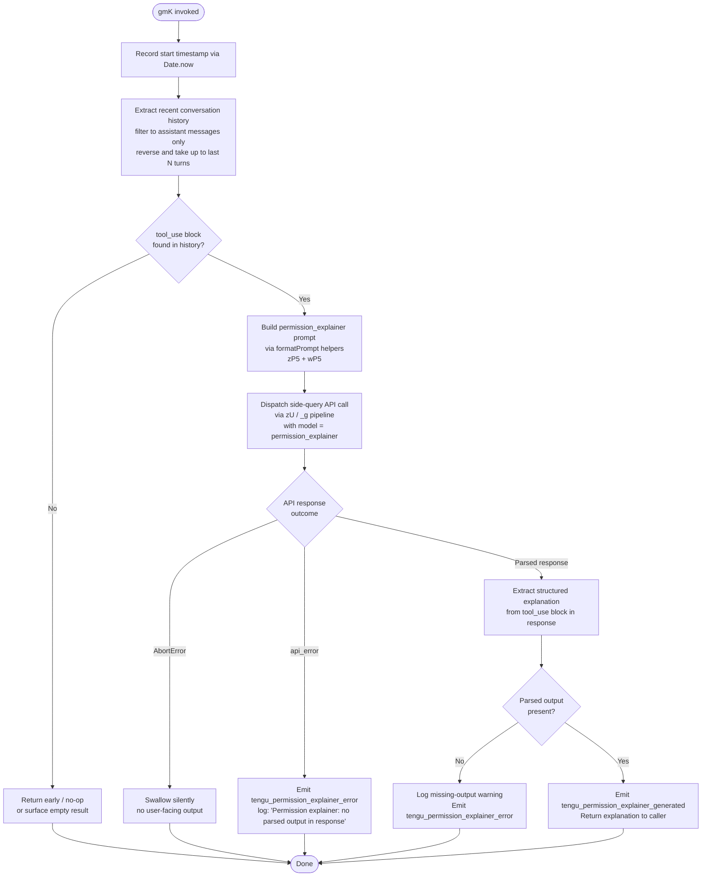

# `/explain_command`

> Analysis basis: CC v2.1.176 bundle.js (AST extraction + Claude interpretation)
> Minimum version: v2.1.176

---

## Overview

The `explain_command` tool is an internal slash command that generates human-readable permission explanations for Claude Code tool invocations. When invoked, it calls a dedicated "permission explainer" sub-agent (`permission_explainer`) that analyzes a recent tool-use message from the conversation history and returns a structured explanation of why the tool requires the permissions it requests. The result is emitted as a telemetry-tagged response and surfaced to the user.

---

## Registration

| Field | Value |
|---|---|
| type | `tool` |
| name | `explain_command` |
| description | `null` (no description registered) |
| loc_byte | `14668377` |
| loc_byte_end | `14668413` |
| loc_line | `11416` |
| arbor_handler.name | `gmK` |
| arbor_handler.fqn | `claude-2.1.176::gmK` |
| arbor_handler.kind | `AsyncFunction` |
| arbor_handler.resolution_path | `direct` |
| arbor_handler.n_hits | `1` |

Analysis basis: CC v2.1.176 bundle.js:+14668377 – +14668413

---

## Input Branching

The handler has four or more distinct paths (conversation-history lookup hit/miss, abort signal, API error, successful parse), requiring a flowchart.



---

## Behavioral Spec

### 1. Entry Point — Handler `gmK`

```
async function permissionExplainerHandler(toolInput, context):
    startTime = Date.now()                        # +14668096

    # Step 1: Build a short summary string of the tool call being explained
    toolSummary = formatToolSummary(toolInput)    # calls zP5 → CH → JSON.stringify

    # Step 2: Retrieve and filter recent conversation messages
    recentMessages = filterRecentMessages(        # calls wP5
        conversationHistory,
        roleFilter = "assistant",                 # literal: +14667676
        maxMessages = 1000,                       # literal: +14667641
        lookbackDepth = 2                         # literal: +14667597
    )

    # Step 3: Walk messages in reverse; locate the most recent tool_use block
    targetBlock = findLastToolUseBlock(recentMessages)   # reverse + unshift: +14667721/+14667880

    if targetBlock is None:
        return  # early exit

    # Step 4: Truncate content to "..." sentinel if over limit (+14667872)
    truncatedContent = truncateContent(targetBlock.content, sentinel="...")

    # Step 5: Render prompt for the permission_explainer sub-agent
    explainerPrompt = buildExplainerPrompt(targetBlock)  # via g1 → NK → Xq8 chain

    # Step 6: Issue side-query to the model
    response = await dispatchSideQuery(           # via zU pipeline; label="side_query" +13846700
        prompt = explainerPrompt,
        agentRole = "permission_explainer",       # literal: +14668435
        taskLabel = "permission_explainer_generate" # literal: +14668962
    )

    # Step 7: Parse response
    parsedOutput = extractToolUseBlock(response)  # scan for tool_use +14668590

    if parsedOutput is None:
        logWarning("Permission explainer: no parsed output in response")  # +14669207
        emitTelemetry("tengu_permission_explainer_error")                 # +14669072
        return

    emitTelemetry("tengu_permission_explainer_generated")                 # +14668860
    return parsedOutput
```

Analysis basis: CC v2.1.176 bundle.js:+14668072

---

### 2. Conversation History Filtering — `filterRecentMessages` (wP5)

```
function filterRecentMessages(history, roleFilter, maxMessages, lookbackDepth):
    # Keep only messages with role == "assistant" (+14667676)
    filtered = history.filter(m => m.role == roleFilter)

    # Reverse chronological order (+14667721)
    filtered.reverse()

    # Take up to maxMessages entries (+14667641)
    filtered = filtered.slice(0, maxMessages)

    # Apply surrogate-safe truncation (su) to each text content block
    for each message in filtered:
        message.content = sanitizeSurrogates(message.content)   # su: +14667864

    # Prepend a sentinel entry if needed, then join
    filtered.unshift(sentinel)    # +14667880
    return filtered.join(separator)  # +14667913
```

Analysis basis: CC v2.1.176 bundle.js:+14667653

---

### 3. Prompt Construction — `buildExplainerPrompt` (g1 / NK / Xq8)

```
function buildExplainerPrompt(toolUseBlock):
    # Normalise tool name (lowercase, trim)  +2260690 / +2260720
    toolName = toolUseBlock.name.trim().toLowerCase()

    # Check if the tool is an MCP tool (prefix "mcp__" +2505346)
    isMcpTool = toolName.startsWith("mcp__")    # e9 / +2505346
    if isMcpTool:
        category = "mcp_tool"    # literal: +2505365
    else:
        category = "builtin"

    # Resolve policy settings block (+2260941)
    policySettings = resolvePolicySettings(toolName)

    # Build the structured prompt sections via NK / Xq8
    prompt = assemblePromptSections(
        toolName      = toolName,
        category      = category,
        inputSummary  = formatInputSummary(toolUseBlock.input),
        policyBlock   = policySettings
    )
    return prompt
```

Analysis basis: CC v2.1.176 bundle.js:+14668282, +2264147, +2260534

---

### 4. Side-Query Dispatch — `dispatchSideQuery` (zU / _g)

```
async function dispatchSideQuery(prompt, agentRole, taskLabel):
    # Attach standard HTTP headers including:
    #   X-Claude-Code-Session-Id  (+3241757)
    #   User-Agent                (+3241739)
    #   x-client-app              (+3241881)
    #   x-claude-code-agent-id    (+3241915)

    # Obtain auth token via E.getToken() (+3246272)
    token = await authProvider.getToken()

    # Build request body; include side_query label (+13846700 "side_query")
    requestBody = buildRequestBody(
        prompt    = prompt,
        label     = "side_query",
        cacheMode = "1h"    # literal: +13847550
    )

    # Fire request through the API pipeline (_g → $F4 → LF4)
    # Watchdog timeouts:
    #   idle timeout  = 15000 ms   (+3248470)
    #   hard timeout  = 120000 ms  (+3248488)
    response = await apiPipeline.send(requestBody, token)

    return response
```

Analysis basis: CC v2.1.176 bundle.js:+14668295, +13846668

---

### 5. Error Handling

```
function handleExplainerError(error, context):
    if error.name == "AbortError":     # literal: +14669530
        # Silent discard — user aborted
        return

    if error is API error:             # "api_error" literal: +14669601
        emitTelemetry("tengu_permission_explainer_error")
        logDebug(error)
        return

    # Unexpected error: propagate up
    throw error
```

Analysis basis: CC v2.1.176 bundle.js:+14669530, +14669601

---

## State & Side Effects

| Item | Detail |
|---|---|
| Telemetry — success | `tengu_permission_explainer_generated` (bundle.js:+14668860) |
| Telemetry — error | `tengu_permission_explainer_error` (bundle.js:+14669072) |
| Telemetry — side-query API | `tengu_api_success` (bundle.js:+13848279) |
| Telemetry — surrogate sanitize | `tengu_lone_surrogate_sanitized` (bundle.js:+13848028) |
| Sub-agent label | `permission_explainer` — registered as a named agent role |
| Task label | `permission_explainer_generate` — used in the API request body |
| Conversation history mutation | None — read-only scan; history is not modified |
| appState changes | None observed at depth ≤ 2 |
| Sound | None observed |
| File I/O | Config read (`G5H` → `q.readFileSync`, utf-8, +3336782/+3336809); no writes triggered by this command |
| Hook registration | `u9 → DyA.register` reached via file-watch path (+65203); not directly triggered by explain_command invocation |
| Network | One outbound HTTPS call to the Anthropic API (`https://api.anthropic.com` +2568968) for the side-query |

---

## Version History

| Version | Change |
|---|---|
| v2.1.176 | Initial analysis |

---

## Common Mistakes

1. **Expecting visible slash-command UI**: `explain_command` is registered as type `tool`, not a user-facing `/command`. It is invoked programmatically (e.g., by the permission-approval flow), not by typing `/explain_command` in the chat prompt.
2. **Assuming it works on any message**: The handler silently exits if no `tool_use` block is found in recent assistant messages. Callers must ensure there is a pending tool-use turn in the conversation window.
3. **Misreading the agent label**: The sub-agent role is `permission_explainer` (not the tool name `explain_command`). Filtering telemetry or logs by the wrong label will miss events.
4. **Ignoring the `AbortError` path**: If the user cancels a permission prompt mid-flight, the explainer absorbs the `AbortError` silently. Callers should not treat missing output as a hard failure.
5. **Assuming synchronous execution**: `gmK` is an `AsyncFunction`. Any caller must `await` it; fire-and-forget usage will swallow the returned explanation.

---

## Appendix — Identifier Mapping

> For bundle debugging only. Identifiers change across versions.

| Identifier | Role |
|---|---|
| `gmK` | Main async handler for `explain_command` (Arbor-resolved entry point) |
| `MTA` | Intermediate dispatch wrapper called by `gmK` |
| `C6` | Config loader / file-read utility |
| `Q6` | Config path resolver |
| `ZN_` | Config section accessor |
| `G5H` | Low-level config file reader (readFileSync, JSON parse, backup logic) |
| `gK9` | Config backup directory helper (readdirStringSync, statSync) |
| `vN_` | Config backup path builder (xD.join + M_) |
| `N` | Log-level normaliser / debug logger |
| `d` | Generic async utility / promise helper |
| `D` | Daemon background-session manager |
| `ug4` | File-watch subscription manager (z38.watchFile / unwatchFile) |
| `Kg` | Config-watch change handler |
| `u9` | Hook registrar (DyA.register) |
| `zP5` | Tool-summary formatter (CH → JSON.stringify + String coercion) |
| `CH` | JSON serialiser wrapper |
| `wP5` | Conversation-history filter/truncation helper |
| `su` | Surrogate-safe string truncator (charCodeAt 55296–56319) |
| `g1` | Prompt assembly entry (calls NK and j1) |
| `el` | Prompt section compositor |
| `vY` | Prompt part: preamble |
| `lB` | Prompt part: body |
| `NK` | Core prompt normaliser (trim, lowercase, policy lookup, model-tier resolution) |
| `ED6` | Model-tier registry reader |
| `ZD6` | Policy-settings block builder |
| `Kf` | String replacement utility |
| `JyH` | Inclusion-list checker |
| `WN` | Exclusion-list checker |
| `Yq8` | Recursive prompt normaliser helper |
| `ey1` | Object-entries prompt iterator |
| `I8` | Permission-block builder |
| `tnH` | Tool-parameter section renderer |
| `ty1` | Tool-type discriminator |
| `vP4` | Tool-variant prompt builder |
| `j1` | Full tool-prompt assembler (trim, lowercase, model alias resolution) |
| `dJ6` | Tool-name lowercase normaliser |
| `NP4` | Tool-name prefix classifier (`claude-` prefix check +2259998) |
| `yO` | Output-section builder |
| `jT` | Sub-prompt tree walker |
| `jJ_` | Inner prompt node renderer |
| `Xq8` | Full structured-prompt builder (handles tool_use, MCP, foundry, policySettings) |
| `zU` | Side-query dispatcher (top-level; calls _g, globalThis.fetch, G, etc.) |
| `_g` | API request pipeline orchestrator |
| `zM` | Async-storage context reader (fI1.getStore) |
| `Xv_` | Query-string / header-value parser |
| `G9` | Background-job context tagger (BjH) |
| `On` | Request-context store reader (Tq8 / $I1.getStore) |
| `S6` | Event-emitter bootstrapper (eG) |
| `ZJ_` | URL encoder for auth headers (encodeURIComponent) |
| `A6` | String coercion helper |
| `t$` | OAuth token refresh dispatcher (rM8 → pv_) |
| `rM8` | Token-refresh state machine |
| `OI1` | Boolean coercion helper |
| `sw` | HTTP request builder and auth attachment |
| `XL` | Base-URL resolver (A6 + dc6) |
| `Fj` | Request-options assembler |
| `nf` | No-op / passthrough guard (o_) |
| `QP` | Header-merge utility |
| `kO` | Full HTTP request executor (C6 config + Fj + error handling) |
| `L06` | Request-lifecycle logger |
| `LaH` | Auth header injector (A6 + L_H) |
| `Lz` | Logging sink |
| `HF4` | Request timing / metric collector |
| `HaH` | Request duration recorder (MK9 + Date.now) |
| `p_` | Proxy configuration reader |
| `u88` | Proxy-auth helper (trust check + timeout 30000 ms +1849423) |
| `chH` | Proxy credential formatter (A6) |
| `R31` | Proxy auth retry helper |
| `Hq4` | Proxy port parser (parseInt, Number.isNaN) |
| `NS` | Network-error sentinel |
| `fW` | Proxy-auth error emitter (zhH) |
| `$F4` | Full API call orchestrator (UUID, watchdog, stream, cache) |
| `o_` | Null-check / option accessor (A6) |
| `bq9` | Request-body serialiser (M7) |
| `M` | Model-registry accessor |
| `gwH` | Request-context enricher |
| `MQ1` | API-call wrapper (C6) |
| `Gv_` | Config-aware API wrapper (C6) |
| `OF4` | Response-header inspector (authorization, anthropic-beta) |
| `xq9` | API endpoint builder (A6) |
| `Cq9` | API request options builder (PK + A6 + $6) |
| `fF4` | Token-budget calculator (Number.isFinite, Math.min/max) |
| `LF4` | Stream-watchdog + ReadableStream consumer |
| `Dz` | Auth-type discriminator (firstParty / bedrock / vertex) |
| `LJ6` | Auth-type classifier entry |
| `cD4` | Auth-prefix checker (H.startsWith) |
| `fJ6` | Auth-value normaliser (toLowerCase + Object.values) |
| `zF` | AWS/Bedrock credential resolver (OUf + nNH) |
| `nNH` | AWS-region helper |
| `nw` | Proxy-URL parser + validation |
| `PK` | String-to-string coercion (String) |
| `Ql` | URL-component parser (split, toLowerCase, includes, startsWith) |
| `TlH` | TLS/cert helper (Zb + EF) |
| `C31` | Connection-options builder |
| `DO_` | IP/hostname validator (YO_.isIP + hL_) |
| `XO_` | Protocol-scheme classifier |
| `MF4` | API-options merger (Cq9 + Sq9 + o_) |
| `Sq9` | Request-body merger (bq9 + xq9) |
| `_F4` | Pre-flight config validator (bM8 + nNH + Lz + F1) |
| `bM8` | Config-snapshot builder (PW + g1 + L1 + nNH) |
| `fQH` | Config-validation flag |
| `u8H` | Startup-check helper (n9f.find + H.startsWith + Qc6) |
| `F1` | OAuth endpoint validator (OUA + iTf + Za6.includes) |
| `djH` | Gateway-token refresh scheduler (Date.now + Zt8 + k24) |
| `k24` | Gateway-token refresh executor (Ej.post, retry, invalid_grant handling) |
| `Vc6` | Refresh-state store |
| `Et8` | Elapsed-time tracker (Date.now) |
| `oW6` | Environment-variable lowercase mapper |
| `sJH` | SDK error/warn/info/debug logger (console.error) |
| `S` | Output/terminal writer (w.write, ZI5, kH) |
| `P6f` | File realpath + stat resolver |
| `L5` | Stream output formatter |
| `kH` | Error logger with stack trace (JA + A6 + Aq + JUf + Ms.logError) |
| `ZI5` | Output-flush helper (kR8) |
| `w` | Terminal supervisor (write, stop, start, updateConfig) |
| `I` | Session-state reader (Is → rf) |
| `Is` | Session-store accessor |
| `k` | Background-worker sweep manager |
| `c` | Scheduled-task / grace-clock manager |
| `R` | Foreground-session writer (w.write + d) |
| `ZB6` | Memory-pressure probe (Yd8 + kGK.freemem) |
| `SGK` | Memory-threshold helper ($6) |
| `aSH` | Stale-artifact cleaner (cJ.lstat / rm / readFile / c6) |
| `d8` | Misc cleanup utility |
| `l` | Worker-pool lifecycle manager (Fm6 + j_K) |
| `Dd8` | Worker-count limiter ($6) |
| `$6` | Pending-work queue dispatcher (W06 + G06 + C6) |
| `n` | Keyboard-event interceptor |
| `V` | UI component / view |
| `DW` | Worker dispatch wrapper (kO) |
| `$JH` | WIF credential injector (SrH + IH + bH + iZ4) |
| `SrH` | WIF credential resolver (fetch + AbortSignal.timeout) |
| `IH` | Feature-flag evaluator (d + eH) |
| `bH` | Feature-flag evaluator variant (d + eH) |
| `iZ4` | WIF scope-inclusion checker |
| `E` | Auth-token provider (W + Math.max/min) |
| `W` | OAuth token manager (jM6 + SR + Yh + kH + JA) |
| `X` | HTTP keep-alive pool (M + q.setTimeout) |
| `VkH` | API-client factory (L1 + Dz + iy + _.includes) |
| `L1` | Model-ID normaliser (tnH + dz + QL) |
| `dz` | Model-alias expander (toLowerCase + includes + replace) |
| `o36` | Model-option merger |
| `QL` | Model-name cleaner (H.replace) |
| `iy` | Auth-type option injector (o_) |
| `G` | Main UI / input handler (key events, vim operations, history search) |
| `y` | UI child component |
| `Y` | Process-exit / abort controller (EX + process.exit + z.abort) |
| `EX` | Exit-code resolver |
| `z` | Abort signal manager (IH + bH + gS + hB) |
| `T` | Terminal input handler (uN6 + jM6) |
| `uN6` | Raw-mode toggle |
| `jM6` | Terminal-event multiplexer (aeK) |
| `tc` | Cursor-position calculator (kY) |
| `kY` | Character-width measurer |
| `j` | Process-kill helper (A.values + S.kill) |
| `lRK` | Vim-motion dispatcher (AY5 + qY5 + KY5 + fY5 + LY5) |
| `AY5` | Vim offset-set handler (_.setOffset + nRK) |
| `qY5` | Vim numeric-prefix handler (Math.min + parseInt + String + nRK) |
| `KY5` | Vim last-find setter (A.setOffset + A.setLastFind) |
| `fY5` | Vim find-character handler (A.setOffset + fFH) |
| `LY5` | Vim mark handler (d0A.has + _n8) |
| `hRK` | Vim change/yank operator router (zn8 + On8 + NRK + A.recordChange) |
| `zn8` | Vim motion range calculator (Math.min/max + ERK + f.indexOf) |
| `On8` | Vim end-of-line detector (x4 + H.endsWith + rvH) |
| `NRK` | Vim change executor (q.setRegister + setText + enterInsert + setOffset) |
| `SRK` | Vim yank executor (zn8 + On8 + kRK + A.recordChange) |
| `kRK` | Vim yank inner (kY + q.setText + setOffset) |
| `bRK` | Vim visual-replace executor (zn8 + On8 + CRK + A.recordChange) |
| `CRK` | Vim case-change executor (toUpperCase + toLowerCase + setText) |
| `b` | Clipboard / register manager (bRH + keH + yZ9 + Y9H) |
| `bRH` | Register-read helper (readFile + bMH + M9 + kH + Lq) |
| `Cs` | Clipboard sync helper (zLH) |
| `keH` | Register-write helper (mkdir + writeFile + bMH + CH) |
| `yZ9` | Register-list filter (H.filter + IeH) |
| `P` | PTY byte-stream reader (Buffer.concat + X.indexOf) |
| `riK` | PTY line formatter (H.map + eN + Math.max + q.join) |
| `Y9H` | Register-save orchestrator (C8H + bRH + q.filter + keH) |
| `uRK` | Vim paste executor (_.getRegister + zn8 + On8 + pRK + _.recordChange) |
| `pRK` | Vim paste inner (H.endsWith/slice + q.setRegister + setText + setOffset + tc) |
| `ZRK` | Vim line-join executor (Math.min/max + x4 + K.slice/split + _.setText/setOffset) |
| `x4` | String-index finder (H.indexOf) |
| `O` | OS/platform helper (m8) |
| `MFH` | Multi-line slice helper (H.slice) |
| `VRK` | Vim indent executor (Math.min/max + x4 + L.slice/split + B0A + q.setText) |
| `B0A` | Indent-prefix detector (L.startsWith + L.slice) |
| `l0A` | Vim-mode operator table (lw5…_Y5) |
| `CL5` | Command-history searcher (H.find + A.find) |
| `D2A` | SHA-256 content hasher (XVK.createHash) |
| `Zq8` | Session-header builder (PK + o_ + Tq8 + zM + TJ_) |
| `TJ_` | Sub-agent session-ID tagger |
| `G38` | Request-guard helper (o_) |
| `lbH` | Response-content extractor (A6 + o_ + NA + He8 + $6 + _e8) |
| `NA` | Content-block normaliser (sw + yb + e1) |
| `yb` | Array/include type guard |
| `He8` | Content-block type checker |
| `_e8` | Content-block filter |
| `vN` | Response validator (Iv_ + ZkH) |
| `Iv_` | Response-error detector (o_) |
| `ZkH` | Response-type classifier (A6 + FJ6) |
| `FJ6` | HIPAA/compliance flag checker (_J_.includes) |
| `iVK` | Response-item mapper |
| `FM8` | Model-selection helper (xs + L1 + A.includes) |
| `XW` | Message-transform mapper (H.map) |
| `M0H` | Conversation orchestrator (Lq + Array.isArray + uF + rf + S6 + CH) |
| `uF` | Session-start helper (C6 + QK9.randomBytes + P8) |
| `P8` | Conversation-session initialiser (G5H + EaH + D38) |
| `rf` | Response-flow router (sw + C6) |
| `BkA` | Message-history push helper (_.pop + Array.isArray + dl6 + _.push + Object.keys) |
| `dl6` | Message deduplication (pkA + bff.test) |
| `HS` | Deep-clone helper (structuredClone) |
| `nl6` | Message-history normaliser (A.pop + Array.isArray + dl6 + cl6 + Object.keys) |
| `cl6` | Message-content cleaner (UkA + H.replace) |
| `FwH` | Surrogate-pair sanitiser |
| `z1` | Module initialiser (nM6) |
| `nM6` | Bundle bootstrap |
| `AE6` | Agent-registry accessor (Y29 + utH + _E6) |
| `Y29` | Built-in agent loader (T97 + kH) |
| `T97` | Agent-cache checker (O29.has + qf + EY8.has) |
| `utH` | Agent executor (sG) |
| `sG` | Agent-run bootstrap (nM6) |
| `_E6` | Agent-definition resolver (utH + GY8) |
| `GY8` | Agent-source hasher (M29.createHash) |
| `Wi` | Agent-identifier parser (G97 + Cb + kH) |
| `G97` | Agent-ID prefix router (H.startsWith/slice + TY8 + bP_) |
| `TY8` | Custom-agent loader (bP_) |
| `bP_` | Agent-path splitter (H.indexOf/slice) |
| `Cb` | Agent-name validator (H.startsWith) |
| `T36` | <!-- TODO: not found in depth-2 traversal; needs --depth 4 --> |
| `e9` | Tool-type discriminator (Object.hasOwn + sG + H.startsWith + K6; MCP prefix check) |
| `K6` | Tool-kind constant emitter (nM6) |
| `n6` | Error-result builder (d + eH) |
| `eH` | Error-kind emitter (nM6) |
| `TH` | String coercion wrapper (String) |

---

Note: index built via Arbor fallback; some signals (telemetry, literals) may be missing — see arbor-fallback.js.