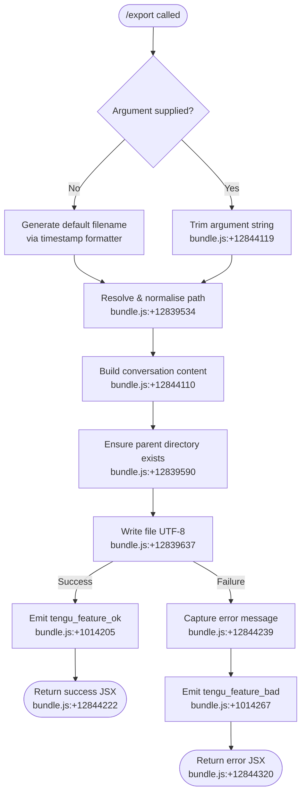

# `/export`

> Analysis basis: CC v2.1.170 bundle.js (AST extraction + Claude interpretation)
> Minimum version: v2.1.170

---

## Overview

The `/export` command serializes the current conversation's messages into a structured text representation and writes the result to a caller-specified file path (or a default timestamped filename). If writing succeeds, the command emits a success telemetry event; if it fails, it records the failure reason and surfaces an error message. No clipboard path is observable in the depth-2 call graph; the primary output mechanism is filesystem write.

---

## Registration

| Field | Value |
|---|---|
| type | `local-jsx` |
| name | `export` |
| description | `Export the current conversation to a file or clipboard` |
| argumentHint | `[filename]` |
| module_id | `PMK` |
| load_inline | `true` |
| loc_byte | `12844678` |
| loc_byte_end | `12844874` |
| loc_line | `9133` |
| arbor_handler.name | `Mdf` |
| arbor_handler.fqn | `claude-2.1.170::Mdf` |
| arbor_handler.kind | `AsyncFunction` |
| arbor_handler.resolution_path | `module_id` |
| arbor_handler.n_hits | `0` |

Analysis basis: CC v2.1.170 bundle.js:+12844678

---

## Input Branching

Four distinct runtime paths exist: (1) no filename argument supplied → generate default timestamped name; (2) filename argument supplied and path is resolvable → use caller-supplied path; (3) filesystem write succeeds → emit success telemetry and display confirmation; (4) filesystem write fails → emit failure telemetry and display error.



---

## Behavioral Spec

### Handler entry point (`Mdf` — AsyncFunction)

```
async function exportCommandHandler(context, argument):
    // Step 1 — resolve output path
    rawArg = argument.trim()                        // bundle.js:+12844119
    if rawArg is empty:
        outputPath = buildDefaultFilename()         // bundle.js:+12844375
    else:
        outputPath = resolveFilePath(rawArg)        // bundle.js:+12839534

    // Step 2 — serialise conversation
    content = buildConversationText(context)        // bundle.js:+12844110

    // Step 3 — write to disk
    try:
        writeConversationFile(outputPath, content)  // bundle.js:+12839590, +12839637
        emitTelemetry("tengu_feature_ok", {feature: "export_file"})
                                                    // bundle.js:+1014205, +12844162
        return renderSuccessComponent(outputPath)   // bundle.js:+12844222
    catch error:
        reason = error.message ?? "Unknown error"   // bundle.js:+12844320
        emitTelemetry("tengu_feature_bad", {feature: "write_failed", reason})
                                                    // bundle.js:+1014267, +12844239
        return renderErrorComponent(reason)         // bundle.js:+12844320
```

Analysis basis: CC v2.1.170 bundle.js:+12844110–12844403

---

### Default filename generation (`Ldf`)

When no filename argument is given, a timestamp-derived filename is computed using the local wall-clock date and time fields.

```
function buildDefaultFilename():
    now = new Date()
    year   = now.getFullYear()                      // bundle.js:+12843318
    month  = zeroPad(now.getMonth() + 1)            // bundle.js:+12843343
    day    = zeroPad(now.getDate())                 // bundle.js:+12843384
    hours  = zeroPad(now.getHours())                // bundle.js:+12843422
    mins   = zeroPad(now.getMinutes())              // bundle.js:+12843461
    secs   = zeroPad(now.getSeconds())              // bundle.js:+12843502
    return "claude-" + year + month + day + "-" + hours + mins + secs + ".md"
    // exact separator/extension not confirmed at depth-2; shape inferred from date parts
```

Analysis basis: CC v2.1.170 bundle.js:+12843318

---

### Conversation serialiser (`fdf` / `Qp8` / `Kdf`)

The serialiser iterates conversation messages, filters by role, strips ANSI escape codes, and assembles a plain-text or markdown body.

```
function buildConversationText(messages):
    lines = []
    for each message in messages:
        if message.role == "assistant":             // bundle.js:+12842237
            header = formatAssistantHeader(message)
        else if message.role == "user":             // bundle.js:+12843613
            header = formatUserHeader(message)
        
        textContent = extractTextContent(message)   // bundle.js:+12843770
        stripped    = stripANSI(textContent)        // Bun.stripANSI, bundle.js:+3890257
        lines.push(header)
        lines.push(stripped)
    
    return lines.join("\n")                         // bundle.js:+12843127
```

Analysis basis: CC v2.1.170 bundle.js:+12844054, +12843082, +12843100

---

### Message-part extractor (`jMK`)

Individual messages may contain multi-part content arrays. The extractor locates the first `text`-typed part and optionally truncates long content.

```
function extractTextContent(message):
    content = message.content
    if not Array.isArray(content):                  // bundle.js:+12843725
        return content.trim()                       // bundle.js:+12843708
    
    textPart = content.find(p => p.type == "text")  // bundle.js:+12843749, +12843770
    if textPart is null:
        return ""
    
    raw = textPart.text
    if raw.length > 50:                             // bundle.js:+12843831
        return raw.substring(0, 49)                 // bundle.js:+12843836, +12843850
    return raw
```

> Note: the truncation limit of 50 characters (bundle.js:+12843831) and the substring upper-bound of 49 (bundle.js:+12843850) suggest this function may be used only for preview/header generation rather than the full body output. The full-body path likely flows through `Qp8`/`Kdf` without truncation.

Analysis basis: CC v2.1.170 bundle.js:+12843592

---

### File-write helper (`gp8` / `Hdf`)

```
async function writeConversationFile(outputPath, content):
    resolvedPath = resolveFilePath(outputPath)      // y1, bundle.js:+12839534
    parentDir    = path.dirname(resolvedPath)       // Fp8.dirname, bundle.js:+12839600
    await fs.mkdir(parentDir, {recursive: true})    // Bp8.mkdir, bundle.js:+12839590
    await fs.writeFile(resolvedPath, content, "utf-8")
                                                    // Bp8.writeFile, bundle.js:+12839637
                                                    // encoding literal: bundle.js:+12839665
```

Analysis basis: CC v2.1.170 bundle.js:+12844150

---

### Path resolution utility (`y1`)

```
function resolveFilePath(rawPath):
    if rawPath contains null bytes:                 // bundle.js:+1057012
        throw Error("Path contains null bytes")
    
    normalised = path.normalize(rawPath)            // FI.normalize, bundle.js:+1057071
                                                    // NFC normalisation also applied, bundle.js:+180108
    if normalised.startsWith("~/"):                 // bundle.js:+1057140
        home = os.homedir()                         // Or6.homedir, bundle.js:+1057109
        normalised = path.join(home, normalised.slice(2))
                                                    // bundle.js:+1057156
    
    if platform == "windows":                       // bundle.js:+1057209
        normalised = applyWindowsPathRules(normalised)
    
    if path.isAbsolute(normalised):                 // bundle.js:+1057269
        return normalised
    else:
        return path.resolve(normalised)             // bundle.js:+1057323
```

Analysis basis: CC v2.1.170 bundle.js:+12839534

---

### Role-header formatter (`XMK`)

```
function formatRoleHeader(role):
    return role.toLowerCase() + ":"                 // bundle.js:+12843895
```

Analysis basis: CC v2.1.170 bundle.js:+12843895

---

## State & Side Effects

| Item | Detail |
|---|---|
| Telemetry — success | `tengu_feature_ok` with feature tag `"export_file"` (bundle.js:+1014205, +12844162) |
| Telemetry — failure | `tengu_feature_bad` with feature tag `"write_failed"` (bundle.js:+1014267, +12844239) |
| Filesystem write | Creates parent directories recursively; writes UTF-8 file at resolved path (bundle.js:+12839590, +12839637) |
| ANSI stripping | `Bun.stripANSI` applied to each message's text content before writing (bundle.js:+3890257) |
| Error surface | "Unknown error" fallback string used when `error.message` is absent (bundle.js:+12844320) |
| Hook registration | <!-- TODO: not found in depth-2 traversal; needs --depth 4 --> |
| appState changes | <!-- TODO: not found in depth-2 traversal; needs --depth 4 --> |
| Sound | <!-- TODO: not found in depth-2 traversal; needs --depth 4 --> |
| Clipboard | Not observed in depth-2 call graph despite description mentioning clipboard |

---

## Version History

| Version | Change |
|---|---|
| v2.1.170 | Initial analysis |

---

## Common Mistakes

1. **Omitting the filename argument** — the command will auto-generate a timestamped filename rather than erroring, which may produce unexpected files in the working directory if the user expected a prompt or clipboard copy.
2. **Relative paths without context** — the path is resolved relative to the process working directory via `path.resolve`; running Claude Code from a different directory than expected will place the file elsewhere (bundle.js:+1057323).
3. **Tilde expansion scope** — only the `~/` prefix triggers home-directory expansion (bundle.js:+1057140). A bare `~` without a slash will not expand and may be treated as a literal directory name.
4. **Windows path rules** — a separate platform-conditional branch handles Windows paths (bundle.js:+1057209); paths with mixed separators may behave differently across platforms.
5. **Large conversation truncation** — the `extractTextContent` helper applies a 50-character limit (bundle.js:+12843831) in at least one code path; consumers expecting full-fidelity output of very long messages should verify the actual serialisation path used.

---

## Appendix — Identifier Mapping

> For bundle debugging only. Identifiers change across versions.

| Identifier | Role |
|---|---|
| `Mdf` | Main async export command handler (entry point) |
| `fdf` | Conversation-to-text serialiser wrapper |
| `Qp8` | Inner serialiser — accumulates lines, joins result |
| `Kdf` | Message-iteration core; dispatches per-role formatting |
| `Adf` | Assistant-role header formatter (called from `Kdf`) |
| `Wg` | Context/model-mode inspector (checks teammate, plan-mode, etc.) |
| `L_6` | React/JSX element constructor helper |
| `qdf` | Array type-guard helper used in message processing |
| `O` | Session-state accessor (references "stopped", "background session") |
| `U4` | ANSI-strip wrapper around `Bun.stripANSI` |
| `gp8` | File-write orchestrator (mkdir + writeFile) |
| `Hdf` | Path-extension inspector (`path.extname`) and pre-write path prep |
| `y1` | Path resolution and normalisation utility |
| `C6` | Sub-utility called by `y1`; likely charset/encoding helper |
| `n6` | Sub-utility called by `y1`; role unclear at depth-2 |
| `RO` | NFC Unicode normalisation wrapper (`H.normalize`) |
| `SH` | Success telemetry emitter (`tengu_feature_ok`) |
| `xH` | Failure telemetry emitter (`tengu_feature_bad`) |
| `d` | Low-level telemetry dispatch primitive |
| `K6` | Telemetry event formatter/sender |
| `ff6` | Base telemetry utility (called by `K6`) |
| `Ldf` | Default filename generator using `Date` fields |
| `jMK` | Message text-content extractor with 50-char truncation |
| `XMK` | Role-header formatter (`role.toLowerCase()`) |
| `pL` | Content-part helper, calls `f9` for string slicing |
| `f9` | String index + slice utility |
| `H` | Generic helper with `Math.random` / `setTimeout` (utility context) |
| `A` | Generic helper; `toLowerCase` and file-close calls |
| `f` | Stream/connection close helper |
| `q` | Stream/queue object (`.add`, `.delete`, data events) |
| `Y1` | Process-exit orchestrator (`process.exit`, `cli_error`) |
| `L` | Promise lifecycle tracker (`.add`, `.finally`, `.delete`) |