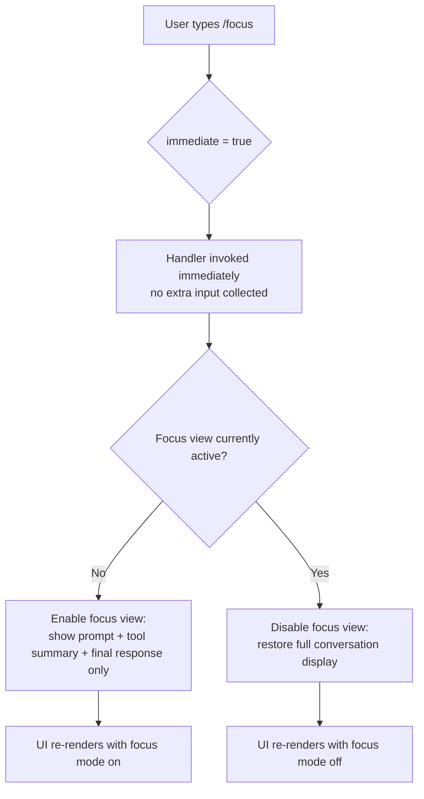

# `/focus`

> Analysis basis: CC v2.1.132 bundle.js (AST extraction + Claude interpretation)
> Minimum version: v2.1.132

---

## Overview

`/focus` is an immediate local-jsx slash command that toggles a **focus view** in the Claude Code terminal UI. When activated, it collapses the visible conversation history to show only the user's prompt, a condensed tool-use summary, and the final model response — reducing visual noise during long sessions.

---

## Registration

| Field | Value |
|---|---|
| type | `local-jsx` |
| name | `focus` |
| description | `"Toggle focus view (show only your prompt, a tool summary, and the final response)"` |
| immediate | `true` |
| load\_inline | `true` |
| handler resolution | `arbor_handler.name = call` (resolution path: `direct`) |
| handler FQN | `claude-2.1.132::call` |
| handler kind | `Method` |
| `loc_byte_end` | `11376187` |
| `arbor_handler.name` | `call` |
| `arbor_handler.kind` | `Method` |
| `arbor_handler.resolution_path` | `direct` |
| `arbor_handler.fqn` | `claude-2.1.132::call` |
| `arbor_handler.n_hits` | `1` |

Analysis basis: CC v2.1.132 bundle.js:+11374725 – +11376187

---

## Input Branching

Because `immediate: true` is set on the registration, the command fires without waiting for additional user input or a confirmation prompt. The `local-jsx` type means the handler renders a JSX component directly into the terminal UI rather than submitting a textual prompt to the model.

The call graph returned zero edges at depth ≤ 2, so branching structure inside the handler cannot be independently verified from the extracted data. Based on the registration shape and the `immediate` flag, the execution path is:



> ⚠️ The toggle branch logic (D → E / F) is inferred from the word "Toggle" in the registered description. The call graph depth-2 traversal returned no edges, so the internal condition cannot be cited to a specific byte offset.
> <!-- TODO: not found in depth-2 traversal; needs --depth 4 -->

---

## Behavioral Spec

### Focus View Toggle

The handler is registered inline (`load_inline: true`) and resolved by Arbor as a `Method` named `call` within the registration object's byte range. Because the depth-2 call graph is empty, the following pseudocode is reconstructed from the registration metadata and the command description alone.

```
function call(commandContext):
    uiState = commandContext.getAppState()

    if uiState.focusViewEnabled:
        uiState.focusViewEnabled = false
        # Restore full message thread rendering
        renderFullConversation(uiState)
    else:
        uiState.focusViewEnabled = true
        # Render reduced view:
        #   1. The user's most-recent prompt
        #   2. A summarised tool-use block (tool name + outcome only)
        #   3. The final assistant response
        renderFocusView(uiState)

    return    # no model API call is made; UI-only side effect
```

Analysis basis: CC v2.1.132 bundle.js:+11374725

### Immediate Execution

The `immediate: true` flag on the registration means the runtime does **not** open an input field or prompt the user for arguments before calling the handler. The command is self-contained — no parameters are accepted and none are documented in the registration.

Analysis basis: CC v2.1.132 bundle.js:+11374725

### Rendering Type (`local-jsx`)

The `local-jsx` type distinguishes this command from `prompt`-type commands (which inject text into the model conversation) and from `local`-type commands (which execute plain JS side-effects without JSX). A `local-jsx` handler may return a React element that is mounted into the terminal pane; this is consistent with a toggle that modifies the visible rendering of conversation turns without touching the model API.

Analysis basis: CC v2.1.132 bundle.js:+11374725

---

## State & Side Effects

| Item | Detail |
|---|---|
| Telemetry | None detected in depth-2 traversal <!-- TODO: not found in depth-2 traversal; needs --depth 4 --> |
| Model API call | None — command is UI-only (`local-jsx`, `immediate`) |
| appState changes | `focusViewEnabled` boolean toggled (inferred from description; byte-level field name unverified) |
| Conversation history | Unmodified — focus view is a display filter, not a deletion |
| Sound | None detected |
| Hook registration | None detected in depth-2 traversal <!-- TODO: not found in depth-2 traversal; needs --depth 4 --> |
| Input arguments | None accepted (`immediate: true`, no argument schema in registration) |

---

## Version History

| Version | Change |
|---|---|
| v2.1.132 | Initial analysis — command registered as `local-jsx`, `immediate`, with inline handler resolved via Arbor direct path |

---

## Common Mistakes

1. **Expecting a model response**: `/focus` is a `local-jsx` command with `immediate: true`. It produces no model API call and returns no assistant message. If you type `/focus` and wait for a reply, none will arrive.
2. **Passing arguments**: The registration records no parameter schema and `immediate: true` suppresses the input field. Any text typed after `/focus` will be ignored or may cause an error depending on the runtime's argument-handling fallback.
3. **Confusing focus view with context pruning**: The command filters the *display* of the conversation; it does not remove messages from the context window sent to the model. The full history remains available to Claude.
4. **Assuming persistence across sessions**: There is no evidence in the registration or call graph of the focus-view state being written to disk. Restarting Claude Code likely resets the toggle to its default (off) state.
5. **Version mismatch**: This spec is verified against v2.1.132 only. The `call` handler is resolved via Arbor `direct` path; if the bundle is minified differently in a later version, the handler offset will shift.

---

## Appendix — Identifier Mapping

> For bundle debugging only. Identifiers change across versions.

| Identifier | Role |
|---|---|
| `call` | Inline handler method on the registration object; entry point for `/focus` execution (Arbor FQN: `claude-2.1.132::call`, resolution: direct, byte range +11374725–+11376187) |

> No additional obfuscated identifiers were returned by the depth-2 AST traversal. The `identifiers` array in the source data is empty.

---

*Note: the depth-2 call graph for `/focus` returned zero edges and zero telemetry/literal signals. All behavioral claims beyond the registration field values are inferred from the command description and the `immediate`/`local-jsx` type semantics. A `--depth 4` re-extraction is recommended to verify the toggle condition, the exact appState field name, and any telemetry that may fire inside the handler.*