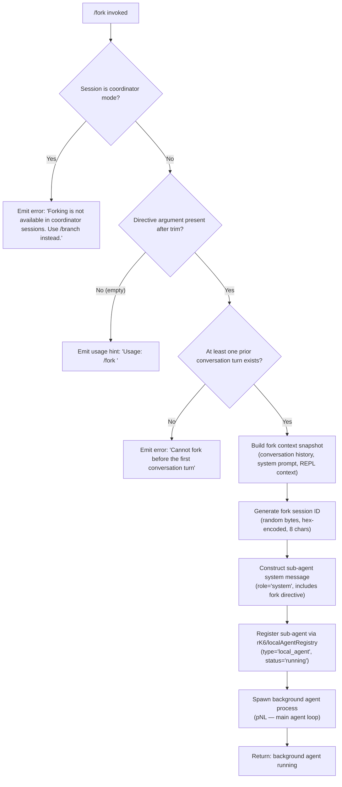

# `/fork`

> Analysis basis: CC v2.1.176 bundle.js (AST extraction + Claude interpretation)
> Minimum version: v2.1.176

---

## Overview

`/fork` spawns a new background agent that inherits a full snapshot of the current conversation, then executes an independent directive without interfering with the foreground session. The handler validates preconditions (no coordinator session, at least one prior turn), builds the sub-agent context from the conversation history, and registers a local agent process that runs asynchronously.

---

## Registration

| Field | Value |
|---|---|
| type | `local-jsx` |
| name | `fork` |
| description | Spawn a background agent that inherits the full conversation |
| argumentHint | `<directive>` |
| module_id | `AYK` |
| load_inline | `true` |
| loc_byte | `12829025` |
| loc_byte_end | `12829228` |
| loc_line | `9030` |
| arbor_handler.name | `itL` |
| arbor_handler.fqn | `claude-2.1.176::itL` |
| arbor_handler.kind | `AsyncFunction` |
| arbor_handler.resolution_path | `module_id` |
| arbor_handler.n_hits | `0` |

Analysis basis: CC v2.1.176 bundle.js:+12829025

---

## Input Branching

Four distinct input paths are identified; a Mermaid flowchart is used.



Analysis basis: CC v2.1.176 bundle.js:+12828584 (handler entry), +12828608 (usage literal), +12828722 (coordinator guard), +12828795 (no-turn guard)

---

## Behavioral Spec

### 1. Entry Point — Handler (`itL`)

The handler (`itL`) is an `AsyncFunction` resolved by Arbor via `module_id` path against module `AYK`.

```
async function forkCommandHandler(args, appState):
    directive = args.trim()                          # +12828584

    if isCoordinatorSession(appState):               # +12828722
        return errorMessage("Forking is not available in coordinator sessions. Use /branch instead.")

    if directive == "":
        return usageMessage("Usage: /fork <directive>")  # +12828608

    if noConversationTurnsYet(appState):             # +12828795
        return errorMessage("Cannot fork before the first conversation turn")

    forkContext = buildForkContext(appState, directive)   # calls t5A
    agentId     = generateSessionId()                      # calls XR → randomBytes(8, hex)
    launchBackgroundAgent(forkContext, agentId)            # calls rK6, then pNL
```

Analysis basis: CC v2.1.176 bundle.js:+12828584

---

### 2. Fork Context Builder (`t5A`)

Assembles the full snapshot passed to the background agent.

```
function buildForkContext(appState, directive):
    baseSystemPrompt = buildSystemPrompt(appState)   # calls UW
    conversationMessages = getConversationSnapshot(appState)  # calls VRL

    replContexts = appState.getReplContexts()        # +11259172
    conversationSlice = conversationMessages.slice(0, 50)  # +11259320, literal 50 at +11259317
    # Keeps last 49 messages before slice boundary   # literal 49 at +11259330

    sessionId = generateForkSessionId()              # calls XR
    launchTimestamp = Date.now()                     # +11259374

    localAgentOptions = buildAgentOptions(           # calls rK6
        sessionType="fork",                          # literal "fork" at +11259132
        resumeMode="resume",                         # literal "resume" at +11259251
        directive=directive,
        systemPrompt=baseSystemPrompt,
        messages=conversationSlice,
    )

    return localAgentOptions
```

Key literals observed:
- `"subagent_launch"` at `+11258941` — launch event tag
- `"subagent_fork_coordinator_mode"` at `+11258959` — guard telemetry tag
- `"subagent_fork_prompt_missing"` at `+11259083` — telemetry when directive is absent
- `"fork"` at `+11259132`
- `"resume"` at `+11259251`
- Message slice window: 50 / 49 messages at `+11259317` / `+11259330`

Analysis basis: CC v2.1.176 bundle.js:+11258926

---

### 3. Conversation Snapshot Builder (`VRL`)

Reconstructs the message list the forked agent will receive.

```
function buildConversationSnapshot(appState):
    state = appState.getAppState()            # +11260681
    messages = Array.from(state.messages)     # +11260781
    filtered = applyMessageFilters(messages)  # calls u_
    systemPromptSection = buildSystemSection(appState)  # calls mZ
    contextSection = buildContextSection(appState)      # calls cU
    return { messages: filtered, system: systemPromptSection, context: contextSection }
```

Analysis basis: CC v2.1.176 bundle.js:+11260681

---

### 4. Agent Launch / Registration (`rK6`)

Registers and starts the background local agent.

```
async function launchLocalAgent(options):
    agentDir = prepareAgentDirectory(options)  # calls VpH → bPA, b$
    agentHandle = createAgentHandle(options)   # calls pq6

    agentRecord = {
        type: "local_agent",      # literal at +10444962
        status: "running",        # literal at +10445007
        mode: "general-purpose",  # literal at +10445145
        launchTime: Date.now(),
    }

    agentRegistry.register(agentRecord)        # +10445337
    agentProcess = spawnAgentProcess(options)  # calls pNL (main agent loop)
    storeContext(agentProcess)                 # calls zM → fI1 async-local storage

    return agentHandle
```

The agent is given a fork-context-ref token (`"fork-context-ref"` at `+13544620`) so the daemon can associate the forked conversation with its parent session.

Analysis basis: CC v2.1.176 bundle.js:+10444915

---

### 5. Session ID Generation (`XR`)

```
function generateForkSessionId(existingId):
    if rhA.test(existingId):          # regex test for existing hex pattern
        return existingId.replace(...)
    randomHex = crypto.randomBytes(8).toString("hex")  # +4248884, 8 bytes → 16 hex chars
    return randomHex
```

Constants: byte count = 8 (`+4248900`), encoding = `"hex"` (`+4248912`), regex group size = 63 (`+4248874`).

Analysis basis: CC v2.1.176 bundle.js:+4248828

---

### 6. Sub-agent Main Loop (`pNL`)

The forked agent's execution loop is the same `pNL` function used by all local agent types. Notable behaviors visible in the call graph:

- Reads `appState` via `x.getAppState` / `x.setAppState` (`+10704540`, `+10710488`)
- Calls the model via `Y.callModel` (`+10706677`)
- Handles auto-compaction (`Y.autocompact` at `+10702354`)
- Executes tool batches, runs hooks, emits telemetry events throughout
- On completion emits `"subagent_complete"` (`+7360754`) or `"subagent_stall_timeout"` (`+7360774`)
- Writes progress events with type `"agent_summary"` (`+9880963`) for the parent session to consume

Analysis basis: CC v2.1.176 bundle.js:+10700972

---

## State & Side Effects

| Item | Detail |
|---|---|
| Telemetry — fork guard | `tengu_quartz_heron` (coordinator-mode guard, `+7367326`) |
| Telemetry — prompt missing | No dedicated event; `"subagent_fork_prompt_missing"` literal at `+11259083` used as log tag |
| Telemetry — launch | `"subagent_launch"` string tag at `+11258941`; `"subagent_fork_coordinator_mode"` at `+11258959` |
| Telemetry — completion | `tengu_agent_tool_completed` (`+7356671`), `tengu_agent_tool_terminated` (`+7363021`) |
| Telemetry — stall | `tengu_async_agent_stall_timeout` (`+7360517`) |
| Telemetry — forked agent turns exceeded | `tengu_forked_agent_default_turns_exceeded` (`+10758557`) |
| Telemetry — sub-agent exit | `"subagent_exit"` literal at `+10597652` |
| Telemetry — bg dispatcher | `tengu_bg_dispatch_sigkill_escalate` (`+16981999`), `tengu_bg_dispatch_low_mem` (`+16982600`), `tengu_bg_spare_claim` (`+16983432`) |
| Agent registry | New entry added via `agentRegistry.register` (`+10445337`); type `"local_agent"`, mode `"general-purpose"` |
| Filesystem | Agent working directory created (`bPA` → `i6H.mkdir`), symlink created/unlinked (`VpH` → `i6H.symlink`, `i6H.unlink`), transcript file written (`lK6` → `nK.writeFile`) |
| Async-local storage | Fork context stored via `zM` → `fI1.getStore` (`+2281943`) |
| Conversation snapshot | Message slice of up to 50 messages copied to forked agent; slice indices 50/49 at `+11259317`/`+11259330` |
| appState changes | Forked agent registered in parent's agent map; parent receives `"agent_summary"` progress events from child |
| Sound | <!-- TODO: not found in depth-2 traversal; needs --depth 4 --> |
| Hook registration | `SubagentStart` (`+13651185`) and `SubagentStop` (`+13692973`) hooks fired around agent lifecycle |
| OTEL tracing | Span `"claude_code.subagent.spawn"` created via `BWH` / `G3H.enterWith` (`+6638222`) with `"subagent.spawn"` type at `+6645992` |

---

## Version History

| Version | Change |
|---|---|
| v2.1.176 | Initial analysis |

---

## Common Mistakes

1. **Running `/fork` before any conversation turn** — the command explicitly guards against this with the message `"Cannot fork before the first conversation turn"` (`+12828795`). Always issue at least one user/assistant exchange before forking.
2. **Using `/fork` in a coordinator session** — coordinator (multi-agent orchestrator) sessions block forking and direct the user to `/branch` instead (`+12828722`). Use `/branch` in those contexts.
3. **Omitting the directive argument** — calling `/fork` with no text after it prints the usage hint `"Usage: /fork <directive>"` and does nothing. The directive is mandatory.
4. **Expecting synchronous results** — the forked agent runs as a background process (`type: "local_agent"`, `status: "running"`). Results surface as `"agent_summary"` progress events; the foreground session continues independently.
5. **Assuming full conversation history is forwarded** — the snapshot is capped at 50 messages (slice literal at `+11259317`). Long sessions will have older messages truncated in the fork.

---

## Appendix — Identifier Mapping

> For bundle debugging only. Identifiers change across versions.

| Identifier | Role |
|---|---|
| `itL` | Fork command handler (AsyncFunction, Arbor-resolved via module_id `AYK`) |
| `t5A` | Fork context builder — assembles sub-agent options from conversation snapshot |
| `VRL` | Conversation snapshot builder — filters messages and constructs system/context sections |
| `u_` | Message filter — reads appState, finds last relevant message, applies tool filters |
| `mZ` | System prompt assembler — composes all system prompt sections for sub-agent |
| `cU` | Context section builder — collects REPL context, system prompt, memory |
| `rK6` | Local agent launcher — creates directory, registers agent, spawns process |
| `VpH` | Agent directory setup — mkdir, symlink, unlink for agent working directory |
| `pq6` | Agent file handle opener |
| `b$` | Agent path joiner |
| `bPA` | Agent directory creator |
| `$c8` | Agent tracking set manager (add/delete on lifecycle) |
| `pNL` | Main agent execution loop (shared with all local agent types) |
| `XR` | Session ID generator — randomBytes(8) → hex string |
| `qv` | Sub-agent context store accessor |
| `zM` | Async-local storage accessor (fI1.getStore) |
| `iR` | REPL session orchestrator — wraps full agent session lifecycle |
| `A6` | String coercion / formatting utility |
| `N0` | <!-- TODO: not found in depth-2 traversal; needs --depth 4 --> |
| `hq` | <!-- TODO: not found in depth-2 traversal; needs --depth 4 --> |
| `mu8` | Sub-agent option builder (working_directory field) |
| `pu8` | Sub-agent option builder (allowed_tools / disallowed_tools fields) |
| `Mx` | Permission-mode normalizer (bypassPermissions / disable) |
| `UW` | System prompt template composer |
| `bH` | Error/exception formatter |
| `eH` | Error handler dispatcher |
| `nM6` | Low-level error logger |
| `x6` | System prompt section joiner |
| `T_` | System prompt utility |
| `M2A` | System prompt metadata builder |
| `Tm8` | Plugin/tool section builder for system prompt |
| `r_` | System prompt section renderer |
| `_aH` | Pewter-owl tool section builder |
| `SG` | System prompt flag-settings section |
| `J75` | Task continuity section builder |
| `X75` | Confirm-first instruction builder |
| `P75` | Irreversible-action instruction builder |
| `w2A` | Model-specific instruction builder (claude-opus-4-7 additive/compact) |
| `a75` | Instruction assembler delegating to w2A |
| `nQ` | SDK section renderer |
| `R75` | Tool-use instruction builder (schedule/routines, session guidance) |
| `i06` | Memory/CLAUDE.md loader and prompt injector |
| `g75` | Environment info (static) section builder |
| `F75` | Environment info (simple/worktree) section builder |
| `d75` | Background-session section builder |
| `c75` | Scratchpad section builder |
| `n75` | Brief/context-management section builder |
| `o75` | Reproduce-verify workflow section builder |
| `x75` | Act-don't-rederive section builder |
| `E75` | Heron-brook section builder |
| `Z75` | Autonomy-append section builder |
| `_mq` | Async context data fetcher (compute/has/get pattern) |
| `b75` | Base identity section builder |
| `h75` | System header section builder |
| `y75` | Verified-vs-assumed section builder |
| `I75` | Model-specific identity builder |
| `k75` | Tool-param-json section builder |
| `C75` | Tone-and-style section builder |
| `sf9` | Memory section finalizer |
| `HXH` | Provider-mode section builder (firstParty / anthropicAws) |
| `U75` | Final system prompt assembler |
| `gf` | Agent state getter utility |
| `x_` | Module/ESM interop helper |
| `M` | MCP server connection manager |
| `tO` | System prompt getter proxy |
| `K6` | Key-normalizer (nM6-backed) |
| `Xb8` | REPL context message cleaner (removes tool_use / tool_result blocks) |
| `$PL` | Assistant message filter |
| `OPL` | Tool-result block filter |
| `MPL` | Code-block filter |
| `exq` | Content-type classifier |
| `zPL` | Error-block filter |
| `lsq` | Whitespace trimmer for conversation snapshot |
| `GK` | AbortController / max-listeners setter |
| `Cv9` | Abort signal binder |
| `H0` | Agent timestamp recorder |
| `d9` | Environment-type detector |
| `ie` | Model name resolver / normalizer |
| `nE` | Model metadata loader |
| `el` | Base model record builder |
| `CJ` | Model policy settings extractor |
| `RF` | Model name cleaner (strips `[1m]` suffix) |
| `yD` | Model XyH-type detector |
| `Sb` | Plan-mode model selector |
| `NK` | Full model config resolver |
| `j1` | Model alias resolver (fable/sonnet/haiku/opus/best) |
| `JT` | jq8-backed model token limit lookup |
| `cm7` | Context-N provider |
| `Kf` | Model name replace normalizer |
| `u18` | ARN/Bedrock path detector |
| `dD4` | ARN substring extractor |
| `Dz` | Provider type detector (bedrock/vertex/foundry/mantle) |
| `LJ6` | Bedrock region extractor |
| `cD4` | Anthropic-prefix checker |
| `o_` | Provider string builder |
| `fJ6` | Provider normalization (toLowerCase + Object.values) |
| `anH` | Path-prefix replacer |
| `RY_` | Starts-with prefix checker |
| `U8q` | Application-inference-profile detector |
| `L1` | Message formatter (tnH/dz/includes/o36/QL) |
| `O` | m8 wrapper |
| `p8q` | Prompt builder (L1 + CF + CJ + BY) |
| `CF` | Conversation formatter ($LH/PJ_/L1/iy/Dz) |
| `BY` | Conversation formatter variant ($LH) |
| `um` | Async-local run wrapper (fI1.run) |
| `mm` | Store getter (XT → yJ_.getStore) |
| `XT` | Store accessor |
| `p_6` | Background agent watchdog / event loop |
| `vL` | Agent state value extractor |
| `l` | File reader/unlinker (Fm6, j_K) |
| `Fm6` | File lstat/rm/readFile handler |
| `j_K` | File unlink handler |
| `S` | Process/worker supervisor writer |
| `P6f` | Realpath/stat resolver |
| `L5` | <!-- TODO: not found in depth-2 traversal; needs --depth 4 --> |
| `ZI5` | kR8-backed utility |
| `w` | Worker write/start/stop manager |
| `b` | Background agent runner (bRH + w + Cs + keH + yZ9) |
| `bRH` | Config file reader for agent |
| `Cs` | zLH-backed context store |
| `keH` | Agent directory/file writer (.claude dir) |
| `yZ9` | Agent file filter |
| `P` | Buffer/stream protocol handler (ETOOLARGE/EUNKNOWN) |
| `z` | Daemon stop/control helper |
| `X` | Connection manager (M + q.setTimeout) |
| `riK` | Result formatter (H.map + eN + Math.max + q.join) |
| `Y9H` | Agent config reader/writer (C8H + bRH + keH) |
| `R` | Worker writer (w.write + d) |
| `u_6` | Agent state updater (A.update + ZfA + tz + VfA) |
| `ZfA` | Timestamp-based state tracker (TOH + Date.now) |
| `tz` | State flusher ($c8 + Lc8) |
| `VfA` | State value reader (_.get + vL + Bh + p_ + n2H + G5 + z5 + d9) |
| `ae` | Task notification handler |
| `K` | Task display formatter (f.map + L.padEnd) |
| `Bh` | TOH-backed state accessor |
| `$K6` | Task registry updater (A.update + vL + K.delete + nT) |
| `VL` | HTML entity replacer (replaceAll) |
| `ibH` | In-progress filter (Yf) |
| `Yf` | Text-block filter |
| `obH` | xK-backed option resolver |
| `xK` | Tool-option cache (qf9/Kf9/HQ4) |
| `zy6` | Background agent dispatch loop (N + q + g9A + W + mT + U8 + rJL + ybq) |
| `g9A` | Tool-set builder for agent (Array.isArray + _.add + H.filter + K.some + _.has) |
| `W` | SDK agent wrapper (jM6 + SR + Yh + Promise.all + jr + hx + kH + JA) |
| `mT` | Agent model-call manager (Date.now + xC8 + uC8 + XR + RKH + dU + hE + zu6) |
| `U8` | UUID generator wrapper (Zk.randomUUID) |
| `rJL` | <!-- TODO: not found in depth-2 traversal; needs --depth 4 --> |
| `ybq` | Agent state batch updater (A.update + k8H + S_6) |
| `gG8` | Message last-index finder |
| `V0H` | Tool batch processor (BpH) |
| `BpH` | Tool batch runner (tTL + y1 + xK + KOH + q.isSearchOrReadCommand) |
| `Yy6` | Agent update handler (A.update + YEL) |
| `c3H` | wy6-backed context helper |
| `UG8` | Agent context store updater (c3H + S_6) |
| `S_6` | Progress event emitter ($P + Date.now) |
| `o_q` | Agent-prefix state reader (_.get + vL + TOH + q.startsWith) |
| `mG8` | Subagent completion handler (fv + Pe + gp7 + D + V$ + dN + sf + XMH + Qp7) |
| `fv` | Last-assistant-message finder |
| `Pe` | <!-- TODO: not found in depth-2 traversal; needs --depth 4 --> |
| `gp7` | <!-- TODO: not found in depth-2 traversal; needs --depth 4 --> |
| `D` | Process lifecycle manager (SIGKILL + NVA.freemem + kH + ed.spawn) |
| `V$` | A6-backed formatter |
| `dN` | ODH-case-normalizer |
| `sf` | Event emitter (KRH + s36 + K.split + Object.entries + cs8 + M.emit + ls8) |
| `XMH` | GY8-backed classifier |
| `Qp7` | TG8-based gate checker |
| `FG8` | Final state flusher (_.update + Date.now + ZfA + Bh + p_ + tz + IH + VfA) |
| `IH` | Low-level state I/O (d + eH) |
| `BG8` | Agent output renderer (k_q + My6 + d + eH + rB + fv + z1 + N + a_q) |
| `k_q` | Output prefix handler (pn_ + h_q + I_q) |
| `My6` | Summary renderer (pn_ + $p7 + P_q + jp7 + Yf + h_q + Op7 + y_q + LP + Zy + oe + un_) |
| `TH` | String coercion wrapper |
| `LqH` | Token-usage recorder (_.get + vL + Bh + ae + _.update + Date.now + ZfA + VfA + tz) |
| `B` | Keepalive timer manager (clearTimeout + setTimeout + w.write + Math.round + d + p.unref) |
| `Uh6` | XG8.delete cleanup |
| `iR` | Full REPL session runner — outer orchestrator called by pNL |
| `l3H` | $6-backed list accessor |
| `zh9` | up_.set context setter |
| `E3H` | <!-- TODO: not found in depth-2 traversal; needs --depth 4 --> |
| `o28` | Span context setter (Xi9 + Ji9 + i28.set + uh7) |
| `Xi9` | SQ_ get/set context accessor |
| `Ji9` | Math.abs span duration helper |
| `uh7` | IQ_.push span queue pusher |
| `uC8` | <!-- TODO: not found in depth-2 traversal; needs --depth 4 --> |
| `dMH` | Nx/_.load/H.dump session data loader |
| `Nx` | <!-- TODO: not found in depth-2 traversal; needs --depth 4 --> |
| `fH` | MCP session handler (JH.has + z8 + CH + d + eH + wN6 + CeK + YN6 + wr + $P + JH.add) |
| `JH` | MCP connection state machine (N + T + oY + n + a + MH) |
| `z8` | MCP debug logger (ycH.push + Ms.logMCPDebug) |
| `CH` | JSON.stringify wrapper |
| `wN6` | MCP data handler (DN6 + K7) |
| `CeK` | q-based MCP context accessor |
| `YN6` | MCP elicitation handler (jN6 + wr + K7) |
| `wr` | MCP notification router (v7 + QG) |
| `$P` | Message queue manager (p_ + SE + Kw7 + _.shift + _.push) |
| `se` | Tool-list builder / permission filter for session |
| `ln_` | Tool availability filter (T2H/Am_/NZ6/OV9 membership checks) |
| `l3` | Tool name formatter (xQf + BE + uQf + H.substring + bQf) |
| `$` | kPK-backed utility |
| `bT` | Tool record builder (zl + PK + A6 + $6) |
| `k` | Agent lifecycle ticker (Date.now + I.values + c.shiftGraceClocksForward + ZB6 + SGK) |
| `IV` | Tool name splitter (H.split + K.join) |
| `$D6` | hl-backed tool path helper |
| `T` | MCP connection pair (uN6 + jM6) |
| `j` | Process kill helper (A.values + S.kill) |
| `G` | Keyboard input handler (BK.fromText + y + Y + T.preventDefault + z.handleKeyDown) |
| `y2` | Local-agent metadata builder (A6 + Lt8) |
| `i_q` | $6-backed item accessor |
| `$H` | Cancel-action handler (_) |
| `lJL` | System prompt loader for REPL (H.getSystemPrompt + hb6) |
| `hb6` | B75-backed system prompt helper |
| `yb6` | Sub-agent start emitter (v7 + u2 + Xc8.randomUUID) |
| `v7` | Agent event emitter (S6 + Ty + L2 + VN + lh + x6) |
| `u2` | Full agent execution context (model call, hooks, tool execution) |
| `RH` | Agent result holder |
| `z9` | UUID + timestamp generator (wLA.randomUUID + _.uuid + _.now) |
| `o` | Ol8-backed output accumulator |
| `uD` | Tool decision classifier (I8 + Array.isArray + _.includes) |
| `I8` | Pe6/Tb-backed classifier |
| `V5H` | hQ4.has tool deny-list checker |
| `u8q` | Registered-tools index builder (Object.keys + N + H.add) |
| `Cf` | eG-backed utility |
| `nJL` | Slash-command lookup (QK6 + P9 + _.find) |
| `QK6` | wX-backed command resolver |
| `P9` | Command string slicer (H.indexOf + H.slice) |
| `OpH` | wX command resolver with ReferenceError guard |
| `wX` | Command find helper (_.find + eTK) |
| `Z7` | <!-- TODO: not found in depth-2 traversal; needs --depth 4 --> |
| `u6` | GT/w subagent output channel |
| `GT` | zA-backed output writer |
| `ZH` | Slash-command dispatcher (b + yH.preventDefault + j + k + mH) |
| `yH` | File-attachment preprocessor (KQ + Array.isArray + iH.some + xOA.join + GKK.readFile) |
| `mH` | Message history trimmer (NH.findLastIndex + NH.splice + d + eH + cB6) |
| `B8` | Timer-managed agent wrapper (I8 + GT + w + z3A + d + K6 + String) |
| `z3A` | Agent data deserializer (dHK + Object.keys + lHK) |
| `dJL` | MCP server config loader (V5H + uD + UwH + Tf + SK + hq + Mh + N + Object.keys + Promise.all) |
| `UwH` | <!-- TODO: not found in depth-2 traversal; needs --depth 4 --> |
| `Tf` | MCP config type selector (SK + XL) |
| `SK` | Safe-mode flag reader (A6 + dc6) |
| `rp` | MCP config processor (wP + uD + dCH) |
| `RtH` | MCP config validator (YMH + tjH) |
| `ip` | MCP entry builder (Object.entries + ue + A.push) |
| `Y` | Session cleanup handler (EX + process.exit + z.abort) |
| `$OH` | Background permission resolver (Hh + Ye + hpH + g7A) |
| `Hh` | Permission standard handler (pu_ + N + o_ + M7) |
| `Ye` | Permission mode normalizer (H.toLowerCase + IM7 + _.includes) |
| `hpH` | Tool-use deny checker (H.some + of) |
| `g7A` | Tool allow/deny set manager |
| `JG8` | Registered-commands index builder (C6 + L1 + Object.entries + A.includes) |
| `C6` | Command registry (Q6 + MT + ZN_ + G5H + Date.now + ug4) |
| `xC8` | App-state initializer for sub-agent (pI + H.getAppState + dMH + b2H + Fl9 + H.setAppState) |
| `b2H` | <!-- TODO: not found in depth-2 traversal; needs --depth 4 --> |
| `Fl9` | <!-- TODO: not found in depth-2 traversal; needs --depth 4 --> |
| `uu8` | <!-- TODO: not found in depth-2 traversal; needs --depth 4 --> |
| `mC8` | MCP tool resolver (aC + of + Cf + oJ + Eu6 + H.getMcp + ar + rY + w9H + Qc + Uiq + N + bJ + JD + Gu_ + euH + q2) |
| `aC` | <!-- TODO: not found in depth-2 traversal; needs --depth 4 --> |
| `Eu6` | MCP tool filter (aC + wh + H.filter + Fd8) |
| `ar` | MCP tool bundler (Fd8 + _.add + H.filter + _.has + N) |
| `w9H` | MCP tool filter v2 (H.filter + _.some + eTK) |
| `Qc` | <!-- TODO: not found in depth-2 traversal; needs --depth 4 --> |
| `Uiq` | MCP dedup cache (Tu6.get/set + hOH.has + q.add + _.filter + q.has) |
| `bJ` | Conversation builder (Qq9 + Vv_ + dq9) |
| `JD` | eG-backed formatter |
| `Gu_` | Tool-use block assembler |
| `euH` | Exponential backoff calculator (C6 + Date.now + Math.pow + Math.max) |
| `q2` | Message pair builder (j1 + Kf + L1 + bP4.has) |
| `hE` | <!-- TODO: not found in depth-2 traversal; needs --depth 4 --> |
| `HT` | eG-backed handler |
| `N8H` | <!-- TODO: not found in depth-2 traversal; needs --depth 4 --> |
| `J` | D-backed process accessor |
| `n` | Key-press event dispatcher (i.preventDefault + Q) |
| `i` | Output writer (o.write + LI5 + P.write) |
| `Q` | Unix socket lifecycle manager (l.on + E8 + c + l.once + C + process.kill + N + F + KF6.unlink + lZ + p + hv) |
| `c9A` | P4-backed context accessor |
| `P4` | u9-backed protocol handler |
| `RKH` | Tool filter for sub-agent (P4 + fUH) |
| `fUH` | Filter list builder (H.filter + cd8 + Ac8 + A45) |
| `lK6` | Transcript writer (jEK + nK.mkdir + Q$.dirname + nK.writeFile + CH + A.replace + P4) |
| `jEK` | qv-backed transcript context |
| `t6` | Headless session bootstrapper (Promise.all + Promise.resolve + ccH + ny6 + kH + Object.keys + LQ + rZA + performance.now + p6 + N + TH + t4) |
| `ccH` | Timing/state recorder (Date.now + S8 + _ + A) |
| `ny6` | <!-- TODO: not found in depth-2 traversal; needs --depth 4 --> |
| `LQ` | Plugin/skill loader (p66 + Kr + IWH + ip + $28 + xX + q.has + x66 + Object.assign) |
| `rZA` | Marketplace reconciler (Td + N + Cm8 + ZEH + BW + Q6 + frq + Lrq + Object.keys + Ou + ccH + kr8 + Orq + KeK + ql8 + TH + d) |
| `p6` | Plugin config processor (LQ + Q4H + Object.keys + LQ6 + Object.entries + z6 + pwH + YH + N) |
| `t4` | Math.round-based duration recorder |
| `Ui9` | OTEL subagent span manager (g9H + IR + eCH + zh + BWH + performance.now) |
| `g9H` | <!-- TODO: not found in depth-2 traversal; needs --depth 4 --> |
| `IR` | G3H.active span accessor |
| `eCH` | KRH-backed span context |
| `zh` | <!-- TODO: not found in depth-2 traversal; needs --depth 4 --> |
| `BWH` | Span context setter (UWH.set + G3H.enterWith) |
| `dU` | Sub-agent exit handler (pNL + gx8 + IH + bH) |
| `gx8` | Agent exit cleanup (px8 + eU.get + Fx8 + eU.delete + O4A.delete + mx6.delete) |
| `d9A` | <!-- TODO: not found in depth-2 traversal; needs --depth 4 --> |
| `J6` | Remote bridge session manager (MH.setOnConnect + clearTimeout + N + S8 + Q + d + eH + o6 + t6 + MH.setOnData + IJK + D + RH + kJK + MH.setOnClose + v6 + RIK) |
| `MH` | Remote bridge transport (setOnConnect + setOnData + setOnClose) |
| `S8` | File-append logger (sFf + Q6 + CH + f.appendFileSync + f.mkdirSync + diA.dirname) |
| `o6` | tH/J5-backed utility |
| `IJK` | Bridge ingress message parser (YG8 + c6 + u65 + N + m65 + KjA + _.has + A.has + A.add + d + IH + TH + bH) |
| `kJK` | Bridge egress message writer (N + A.write + Y + TH + D + j + J + X + P + I) |
| `v6` | Remote session state syncer (M + rY + h8.map + zH.map + EA.has + u9H + S_.isReadOnly + u$H + I_A + Object.keys) |
| `RIK` | <!-- TODO: not found in depth-2 traversal; needs --depth 4 --> |
| `p3H` | Active-tool tracker (AX + dm7 + H.filter + f.has + H.push) |
| `AX` | <!-- TODO: not found in depth-2 traversal; needs --depth 4 --> |
| `dm7` | H.find-backed tool finder |
| `cJL` | <!-- TODO: not found in depth-2 traversal; needs --depth 4 --> |
| `S8q` | <!-- TODO: not found in depth-2 traversal; needs --depth 4 --> |
| `wY` | Dialog/prompt queue manager (JkL + A.get + K.push + iu6 + XkL) |
| `JkL` | iu6-backed dialog initializer |
| `iu6` | <!-- TODO: not found in depth-2 traversal; needs --depth 4 --> |
| `XkL` | Dialog runner (iu6 + lu6 + U8) |
| `pC8` | K/q-backed prompt context |
| `dK6` | Skill progress tracker (wY + eHH + S6 + A6 + Date.now + Yx6.get/keys/delete/set) |
| `eHH` | _.trim-backed text cleaner |
| `Nbq` | Agent-prefix state reader variant (_.get + vL + TOH) |
| `OOH` | Sub-agent output handler (S6 + uh + fv + Yf + IZK + kZK + v7 + qv + u2 + RZK.randomUUID) |
| `uh` | Subagent lifecycle display (Lg + cj + iB + ru) |
| `IZK` | Object.values-based output collector (zX + cvH + _.push) |
| `kZK` | Output mapper (IE + H.map + cvH) |
| `cH` | $6-backed context helper |
| `Qi` | gN9-backed notification sender |
| `oN9` | Notification cleanup (ag.delete + HCH) |
| `HCH` | Notification file writer (QN9 + dN9 + CH + mN9.then + zJ8.mkdir + Xx + zJ8.writeFile) |
| `Q9A` | Tu6.delete MCP dedup cleaner |
| `aCH` | Span context cleaner (i28.delete + SQ_.delete) |
| `Bi9` | OTEL span finalizer (UWH.get + H.setAttribute + tCH + H.end + FWH) |
| `tCH` | H.setStatus span status setter |
| `FWH` | Span context restorer (IR + G3H.enterWith) |
| `wh9` | up_.delete context cleaner |
| `x8q` | All-agents state updater (Object.entries + _.all + FT + N + U3H + n2H) |
| `FT` | <!-- TODO: not found in depth-2 traversal; needs --depth 4 --> |
| `U3H` | Per-agent state flusher (_.update + FT + N + kH + clearTimeout + Date.now + C$ + tz) |
| `hZ6` | <!-- TODO: not found in depth-2 traversal; needs --depth 4 --> |
| `j0H` | <!-- TODO: not found in depth-2 traversal; needs --depth 4 --> |

---

Note: index built via Arbor fallback; some signals (telemetry, literals) may be missing — see arbor-fallback.js.