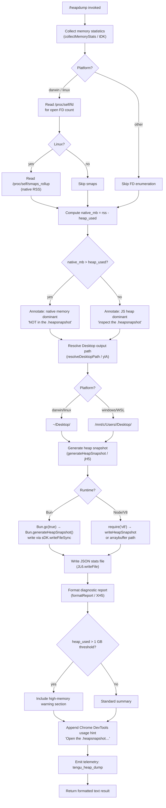

# `/heapdump`

> Analysis basis: CC v2.1.176 bundle.js (AST extraction + Claude interpretation)
> Minimum version: v2.1.176

---

## Overview

`/heapdump` is a hidden developer-diagnostic command that captures the current JavaScript heap state of the Claude Code process and writes it to the user's Desktop directory. It also collects a broad set of memory and runtime statistics — including V8 heap details, native memory, open file descriptors, and Linux `smaps_rollup` data — and presents a formatted diagnostic summary alongside instructions for loading the snapshot in Chrome DevTools. The command is intended for debugging memory leaks and native-addon memory pressure; it is not surfaced in the normal command listing.

---

## Registration

| Field | Value |
|---|---|
| type | `local` |
| name | `heapdump` |
| description | `Dump the JS heap to ~/Desktop` |
| supportsNonInteractive | `true` |
| isHidden | `true` |
| module_id | `HjK` |
| load_inline | `true` |
| loc_byte | `12930569` |
| loc_byte_end | `12930997` |
| loc_line | `9152` |
| arbor_handler.name | `JH5` |
| arbor_handler.fqn | `claude-2.1.176::JH5` |
| arbor_handler.kind | `AsyncFunction` |
| arbor_handler.resolution_path | `module_id` |
| arbor_handler.n_hits | `0` |

Analysis basis: CC v2.1.176 bundle.js:+12930569

---

## Input Branching

The command has more than three distinct execution paths based on runtime conditions (Bun vs. V8 heap snapshot engine, Linux smaps availability, native-vs-JS memory dominance, platform-specific Desktop path resolution), so a Mermaid flowchart is used.



Analysis basis: CC v2.1.176 bundle.js:+12928076, +12929138, +12927225, +12927644, +12930487

---

## Behavioral Spec

### 1. Main Handler (`JH5` → `heapDumpHandler`)

The async entry point dispatches to two subordinate functions: `collectAndDump` (identifier `SDA`) which performs all I/O and snapshot generation, and `formatReport` (identifier `XH5`) which assembles the human-readable output. Results are gathered into a lines array, joined, and returned as a plain-text tool result.

```
async function heapDumpHandler(args, context):
    lines = []
    dumpResult = await collectAndDump(context)
    reportLines = formatReport(dumpResult)
    lines.push(...reportLines)
    lines.push("Open the .heapsnapshot in Chrome DevTools → Memory → Load to inspect retainers.")
    return { type: "text", content: lines.join("\n") }
```

Analysis basis: CC v2.1.176 bundle.js:+12929438, +12929557, +12929584, +12929706, +12929470

---

### 2. Collect-and-Dump Orchestrator (`SDA` → `collectAndDump`)

This function drives the full diagnostic pipeline: gather stats, resolve the output path, write both the snapshot and a JSON stats sidecar, and then return structured results.

```
async function collectAndDump(context):
    stats        = await collectMemoryStats()         // tDK
    desktopPath  = resolveDesktopPath()               // ylA
    timestamp    = currentTimestamp()                 // Q6
    snapshotName = path.join(desktopPath, timestamp + ".heapsnapshot")
    statsName    = path.join(desktopPath, timestamp + ".json")

    snapshotData = await generateHeapSnapshot()       // jH5
    await fs.writeFile(snapshotName, snapshotData, { mode: 0o600 })   // mode 384 decimal
    await fs.writeFile(statsName, JSON.stringify(stats))               // CH / JSON.stringify

    emit telemetry("tengu_heap_dump")

    return {
        stats,
        snapshotPath: snapshotName,
        statsPath: statsName
    }
```

File permission `384` (octal `0o600`, owner read/write only) is applied to the snapshot file.
Analysis basis: CC v2.1.176 bundle.js:+12928076, +12928396, +12928408, +12928505, +12928548, +12928564, +12928583, +12928639, +12928688, +12928690

---

### 3. Memory Statistics Collector (`tDK` → `collectMemoryStats`)

Calls a broad set of Node/Bun runtime APIs to build a statistics object. On Linux it additionally reads pseudo-filesystem entries for open file descriptors and native RSS.

```
async function collectMemoryStats():
    stats = {}

    // Core V8 / process metrics
    stats.memoryUsage        = process.memoryUsage()
    stats.heapStatistics     = v8.getHeapStatistics()          // rg8.getHeapStatistics
    stats.resourceUsage      = process.resourceUsage()
    stats.uptimeSeconds      = process.uptime()
    stats.heapSpaceStats     = v8.getHeapSpaceStatistics()     // rg8.getHeapSpaceStatistics
    stats.activeHandleCount  = process._getActiveHandles().length
    stats.activeRequestCount = process._getActiveRequests().length

    // Linux-specific: open FD count via /proc/self/fd
    try:
        fds = await fs.readdir("/proc/self/fd")                // JL6.readdir
        stats.openFdCount = fds.length
    catch:
        stats.openFdCount = null

    // Linux-specific: native RSS from smaps_rollup
    try:
        smaps = await fs.readFile("/proc/self/smaps_rollup", "utf8")   // JL6.readFile
        stats.smapsRollup = parseSmaps(smaps)
    catch:
        stats.smapsRollup = null

    // Require bun:jsc module if available (Bun runtime)
    try:
        jsc = require("bun:jsc")
        stats.jscStats = jsc.getHeapStatistics()
    catch:
        stats.jscStats = null

    // Threshold checks (3600 seconds uptime / 1048576 bytes per MB)
    stats.uptimeHours    = stats.uptimeSeconds / 3600
    stats.heapUsedMB     = stats.memoryUsage.heapUsed / 1048576

    // Native memory dominance detection (threshold: 500 MB delta)
    stats.nativeDominant = (stats.heapUsedMB - stats.smapsRollup?.heap_used_mb) > 500

    return stats
```

Constants: uptime divisor `3600` (bundle.js:+12926133), byte-to-MB divisor `1048576` (bundle.js:+12926138), native-dominance delta threshold `500` (bundle.js:+12926526).
Native-leak annotation literal: `"Native memory > heap - leak may be in native addons (node-pty, sharp, etc.)"` (bundle.js:+12926371).
No-leak annotation literal: `"No obvious leak indicators. Check heap snapshot for retained objects."` (bundle.js:+12927490).
Analysis basis: CC v2.1.176 bundle.js:+12925601, +12925625, +12925651, +12925677, +12925702, +12925744, +12925781, +12925832, +12925844, +12925894, +12925907, +12925933, +12925992, +12926005

---

### 4. Desktop Path Resolver (`ylA` → `resolveDesktopPath`)

Determines the platform-appropriate Desktop directory.

```
function resolveDesktopPath():
    platform = detectPlatform()   // a6

    if platform == "windows":
        // WSL path: scan /mnt/c/Users for first real user directory
        // skipping "Public", "Default", "Default User", "All Users"
        candidates = fs.readdir("/mnt/c/Users")
        for entry in candidates:
            if entry not in ["Public", "Default", "Default User", "All Users"]:
                return "/mnt/c/Users/" + entry + "/Desktop"
        return "/mnt/c/Users/Public/Desktop"   // fallback

    else:
        // macOS / Linux
        home = os.homedir()                    // Ff_.homedir
        return path.join(home, "Desktop")      // MM.join + "Desktop"
```

Literals: `"Desktop"` (bundle.js:+1095608), `"windows"` (bundle.js:+1095626), `"/mnt/c/Users"` (bundle.js:+1095830), `"Public"` (bundle.js:+1095874), `"Default"` (bundle.js:+1095893), `"Default User"` (bundle.js:+1095913), `"All Users"` (bundle.js:+1095938).
Analysis basis: CC v2.1.176 bundle.js:+12928396, +1095555, +1095562, +1095598, +1095738, +1095775

---

### 5. Heap Snapshot Generator (`jH5` → `generateHeapSnapshot`)

Branches on whether the Bun runtime is present.

```
async function generateHeapSnapshot(outputPath):
    if typeof Bun != "undefined":
        Bun.gc(true)                                    // force GC before snapshot
        snapshot = Bun.generateHeapSnapshot()           // returns object
        sDK.writeFileSync(outputPath, JSON.stringify(snapshot))
    else:
        // V8 path
        v8module = require("v8")
        // writes arraybuffer snapshot
        v8module.writeHeapSnapshot(outputPath, { format: "arraybuffer" })
```

Literals: `"v8"` (bundle.js:+12929163), `"arraybuffer"` (bundle.js:+12929168).
Analysis basis: CC v2.1.176 bundle.js:+12929118, +12929138, +12929195

---

### 6. Report Formatter (`XH5` → `formatReport`)

Assembles the lines returned to the user. Compares heap totals against a 1 GiB threshold and emits one of two diagnostic annotations. Numeric values are rendered with fixed-point formatting (`.toFixed()`).

```
function formatReport(dumpResult):
    lines = []
    stats = dumpResult.stats
    ONE_GIB = 1073741824   // bytes

    heapUsedBytes  = stats.memoryUsage.heapUsed
    heapTotalBytes = stats.memoryUsage.heapTotal

    // Per-space breakdown (up to 8 heap spaces shown)
    maxSpaces = Math.max(stats.heapSpaceStats.length, 8)
    for space in stats.heapSpaceStats[0..maxSpaces]:
        lines.push(formatSpaceLine(space))   // XL6

    // Dominant-memory annotation
    if heapUsedBytes > (heapTotalBytes - heapUsedBytes):
        lines.push("— most memory is JS heap (inspect the .heapsnapshot)")
    else:
        lines.push("— most memory is native (NOT in the .heapsnapshot)")

    if not stats.nativeDominant:
        lines.push("  (no obvious leak indicators)")

    // High-memory warning section
    if heapUsedBytes > ONE_GIB:
        lines.push(highMemoryWarningBlock(stats))

    lines.push("Snapshot: " + dumpResult.snapshotPath)
    lines.push("Stats:    " + dumpResult.statsPath)

    return lines
```

Threshold literal `1073741824` (1 GiB): bundle.js:+12930487.
Annotation literals: `"— most memory is JS heap (inspect the .heapsnapshot)"` (bundle.js:+12929881), `"— most memory is native (NOT in the .heapsnapshot)"` (bundle.js:+12929941), `"  (no obvious leak indicators)"` (bundle.js:+12930078).
Analysis basis: CC v2.1.176 bundle.js:+12929557, +12929813, +12930125, +12930213

---

## State & Side Effects

| Item | Detail |
|---|---|
| Telemetry | `tengu_heap_dump` (bundle.js:+12928690) — fired after successful snapshot write |
| Telemetry (incidental, deep graph) | `tengu_daemon_control` (+17019560), `tengu_bg_dispatch_sigkill_escalate` (+16981999), `tengu_bg_dispatch_low_mem` (+16982600), `tengu_bg_spare_enable` (+16983304), `tengu_bg_spare_claim` (+16983432), `tengu_bg_spare_claim_fail` (+16983698), `tengu_scheduled_task_missed` (+16467492) — these belong to shared daemon/background infra reached by traversal depth ≤ 2 and are NOT fired by `/heapdump` directly |
| File writes | `<Desktop>/<timestamp>.heapsnapshot` (mode `0o600`) and `<Desktop>/<timestamp>.json` |
| GC side effect | On Bun runtime: `Bun.gc(true)` is called before snapshot generation, forcing a full garbage collection |
| Hook registration | None observed in depth-2 traversal |
| appState changes | None observed in depth-2 traversal |
| Sound | None observed in depth-2 traversal |
| Visibility | `isHidden: true` — not shown in `/help` or command autocomplete listings |
| Non-interactive | `supportsNonInteractive: true` — can be invoked in headless/scripted sessions |

---

## Version History

| Version | Change |
|---|---|
| v2.1.176 | Initial analysis |

---

## Common Mistakes

1. **Expecting output in the working directory.** The snapshot is always written to `~/Desktop` (or the WSL equivalent), never to the current project directory. Check `~/Desktop` for the `.heapsnapshot` and `.json` files.
2. **Opening the `.json` sidecar in DevTools.** The Chrome DevTools Memory panel requires the `.heapsnapshot` file, not the `.json` stats file. The `.json` file contains raw runtime statistics for manual inspection.
3. **Running in a headless environment without a Desktop directory.** If `~/Desktop` does not exist, the write will fail. Create the directory first: `mkdir -p ~/Desktop`.
4. **Interpreting "native memory dominant" as a definitive leak.** The annotation `"— most memory is native (NOT in the .heapsnapshot)"` indicates that RSS exceeds JS heap allocation, which may implicate native addons (e.g., `node-pty`, `sharp`), but this requires further investigation.
5. **Forgetting to force GC before interpreting heap size.** The command calls `Bun.gc(true)` only on the Bun runtime. On Node/V8, no explicit GC is triggered before snapshot generation, so the snapshot may include collectable objects.
6. **Assuming the command is visible.** `isHidden: true` means it will not appear in `/help`. It must be typed explicitly as `/heapdump`.

---

## Appendix — Identifier Mapping

> For bundle debugging only. Identifiers change across versions.

| Identifier | Role |
|---|---|
| `JH5` | Main async handler (`heapDumpHandler`) — Arbor-resolved entry point |
| `SDA` | Collect-and-dump orchestrator (`collectAndDump`) |
| `tDK` | Memory statistics collector (`collectMemoryStats`) |
| `jH5` | Heap snapshot generator (`generateHeapSnapshot`) |
| `XH5` | Diagnostic report formatter (`formatReport`) |
| `XL6` | Per-heap-space line formatter (called from `XH5`) |
| `ylA` | Desktop path resolver (`resolveDesktopPath`) |
| `S6` | Platform detection utility |
| `eG` | Low-level platform helper (called from `S6`) |
| `a6` | Platform string helper (called from `tDK` and `ylA`) |
| `G` | Top-level UI / input-loop component (reached by traversal; unrelated to heapdump core) |
| `N` | Log/output formatting utility |
| `CH` | JSON serialisation wrapper (`JSON.stringify` caller) |
| `K` | Table/column padding formatter |
| `L5` | Likely result-wrapping utility |
| `kH` | Error logging utility (calls `Ms.logError`) |
| `JA` | Error constructor wrapper |
| `A6` | String conversion helper |
| `Aq` | Telemetry configuration accessor |
| `ycA` | Telemetry configuration helper (called from `Aq`) |
| `JUf` | Rolling log queue manager |
| `Q6` | Timestamp generator |
| `gff` | Output stream writer (called from `N`) |
| `JyA` | Stream helper (called from `gff`) |
| `bf` | Text sanitiser / redactor |
| `ikA` | Pattern-map helper (called from `bf`) |
| `kQH` | Terminal write helper |
| `mkA` | Raw terminal write (called from `kQH`) |
| `lff` | File-based log writer |
| `AQH` | Buffered log flush handler |
| `g4H` | Log rotation helper (called from `lff`) |
| `r$6` | Error type checker |
| `skA` | Log file path builder |
| `dH_` | Log file rotation (rename/unlink) |
| `cff` | Log append worker (called from `lff`) |
| `u9` | Finalizer / cleanup registrar |
| `lRK` | Vim-mode find operator handler |
| `hRK` | Vim-mode yank operator handler |
| `SRK` | Vim-mode visual-replace operator handler |
| `bRK` | Vim-mode visual-case operator handler |
| `uRK` | Vim-mode visual-paste operator handler |
| `ZRK` | Vim-mode join operator handler |
| `VRK` | Vim-mode indent operator handler |
| `rg8` | V8 module reference (`require('v8')`) |
| `JL6` | Async filesystem module (`fs/promises`) |
| `sDK` | Sync filesystem module (`fs`) |
| `kDA` | Path utility reference |
| `Ff_` | OS module reference (`os`) |
| `MM` | Path join reference |
| `d` | Result/content builder |
| `D` | Background session dispatcher (reached by graph traversal; unrelated to heapdump core) |
| `H` | History search component (reached by graph traversal; unrelated to heapdump core) |
| `P` | Stream/buffer reader (reached by graph traversal; unrelated to heapdump core) |
| `S` | Process executor (reached by graph traversal; unrelated to heapdump core) |
| `l0A` | Vim operator-G sub-command registry (reached by traversal; unrelated to heapdump core) |

---

Note: index built via Arbor fallback; some signals (telemetry, literals) may be missing — see arbor-fallback.js.