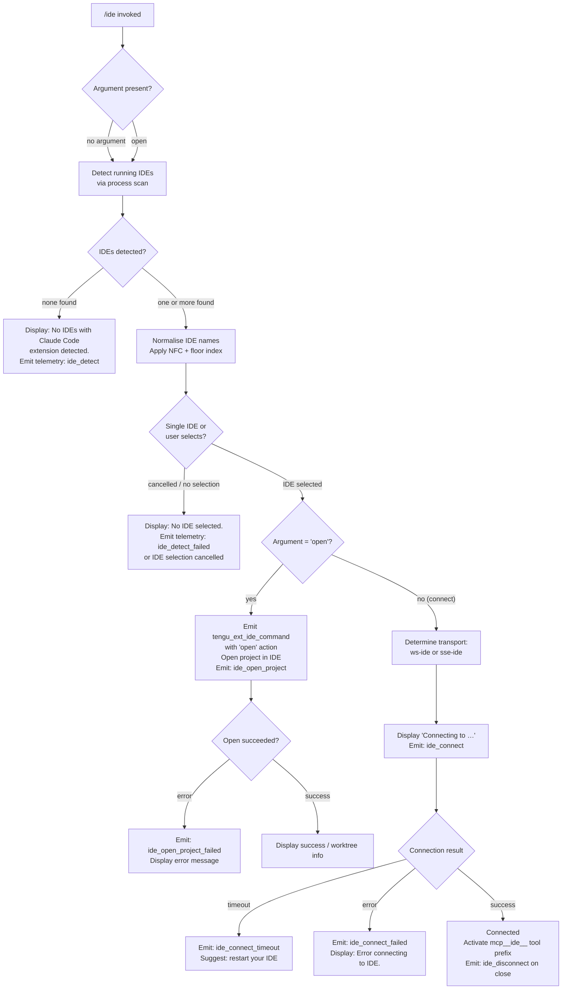

# `/ide`

> Analysis basis: CC v2.1.176 bundle.js (AST extraction + Claude interpretation)
> Minimum version: v2.1.176

---

## Overview

`/ide` manages IDE integrations for Claude Code, allowing users to detect connected IDEs, open projects within a supported IDE, and connect Claude Code to an active IDE extension. The command inspects running processes for known IDE identifiers, presents a selection interface when multiple IDEs are available, and establishes either a WebSocket (`ws-ide`) or SSE (`sse-ide`) connection to the chosen IDE's Claude Code extension.

---

## Registration

| Field | Value |
|---|---|
| type | `local-jsx` |
| name | `ide` |
| description | `Manage IDE integrations and show status` |
| argumentHint | `[open]` |
| module_id | `w1K` |
| load_inline | `true` |
| loc_byte | `11890808` |
| loc_byte_end | `11890964` |
| loc_line | `7620` |
| arbor_handler.name | `SBL` |
| arbor_handler.fqn | `claude-2.1.176::SBL` |
| arbor_handler.kind | `AsyncFunction` |
| arbor_handler.resolution_path | `module_id` |
| arbor_handler.n_hits | `0` |

Analysis basis: CC v2.1.176 bundle.js:+11890808

---

## Input Branching

Five or more distinct logical paths exist (no argument vs. `open` argument, detection results, IDE selection, connection type, error conditions), so a Mermaid flowchart is used.



Analysis basis: CC v2.1.176 bundle.js:+11886924 (handler `SBL`)

---

## Behavioral Spec

### 1. Entry Point — Handler Dispatch (`SBL`)

The Arbor-resolved handler is `SBL` (AsyncFunction, resolved via `module_id` → `w1K`).

```
async function handleIdeCommand(args, appState):
    emit telemetry: tengu_ext_ide_command   // always first
    action = args[0]                        // "open" or undefined

    ideList = await detectRunningIDEs()
    if ideList is empty:
        display "No IDEs with Claude Code extension detected."
        return

    selectedIDE = await promptIDESelection(ideList)
    if selectedIDE is null:
        display "No IDE selected."
        return

    if action == "open":
        await openProjectInIDE(selectedIDE)
    else:
        await connectToIDE(selectedIDE)
```

Analysis basis: CC v2.1.176 bundle.js:+11886924

---

### 2. IDE Detection (`d28` → `Q28` → `Xh7`)

Detection runs in two stages: gathering candidate process entries and resolving them to known IDE identities.

```
async function detectRunningIDEs():
    // Stage 1: platform-aware process enumeration
    processList = await enumerateIDEProcesses()   // d28 -> Q28

    // On Linux: shell out to ps aux with grep pattern covering
    //   code, cursor, windsurf, devin-desktop, idea, pycharm,
    //   webstorm, phpstorm, rubymine, clion, goland, rider,
    //   datagrip, dataspell, aqua, gateway, fleet, android-studio
    // On WSL: also checks /mnt/c/Users paths
    // On macOS: lstat-based scan of known application directories

    // Stage 2: normalise and classify each candidate
    results = []
    for each entry in processList:
        ideKind = classifyIDEProcess(entry)   // zG
        if ideKind != null:
            results.push(ideKind)
    return deduplicated(results)
```

Known IDE name tokens (literals found in implementation):
- `windsurf`, `devin`, `cursor`, `insiders`, `vscode`, `vs code`,
  `visual studio code`, `vscodium`, `code - oss`, `codium`, `jetbrains`,
  `appcode`, `Devin Desktop`

Analysis basis: CC v2.1.176 bundle.js:+6611513 (`d28`), +6609306 (`Xh7`), +6616238 (Linux ps pattern)

---

### 3. IDE Classification (`zG`, `cn9`, `c28`)

```
function classifyIDEProcess(processEntry):
    name = processEntry.toLowerCase()

    // Check Windsurf, Devin, Cursor, VS Code family, VSCodium, JetBrains
    // cn9: checks lowercase name against known token list
    // c28: checks basename, applies .cmd suffix normalisation on Windows
    // zG:  extracts canonical IDE label and basename

    if name includes "windsurf"  -> return { kind: "windsurf", ... }
    if name includes "devin"     -> return { kind: "devin",    ... }
    if name includes "cursor"    -> return { kind: "cursor",   ... }
    if name includes any VS Code variant -> return { kind: "vscode", ... }
    if name includes "jetbrains" / JetBrains product -> return { kind: "jetbrains", ... }
    return null
```

Analysis basis: CC v2.1.176 bundle.js:+6614308 (`cn9`), +6614751 (`c28`), +6617132 (`zG`)

---

### 4. IDE Name Normalisation (handler `b$A`)

Before display and comparison, IDE names go through Unicode normalisation.

```
function normaliseIDEList(rawList):
    // NFC normalisation on each name string
    // Math.floor used for index arithmetic
    // Slice for truncation: separator ", " and overflow marker ", …"
    normalised = rawList.map(name => name.normalize("NFC"))
    if normalised.length > MAX_DISPLAY:
        return normalised.slice(0, MAX_DISPLAY).join(", ") + ", …"
    return normalised.join(", ")
```

- Separator literal: `", "` (bundle.js:+11890564)
- Overflow suffix: `", …"` (bundle.js:+11890578)
- Unicode form: `"NFC"` (bundle.js:+11890407)

Analysis basis: CC v2.1.176 bundle.js:+11890395 (`A.normalize`), +11890370 (`Math.floor`)

---

### 5. Open Project Sub-command (`openProjectInIDE`)

Triggered when the user passes `open` as the argument.

```
async function openProjectInIDE(selectedIDE):
    emit telemetry: ide_open_project
    record context: { type: "worktree" | "project" }

    result = await sendOpenCommandToIDE(selectedIDE)
    if result.error:
        emit telemetry: ide_open_project_failed
        display error details
        return
    // On unexpected exit:
    display "Exited without opening IDE"   // literal at +11887874
```

- Telemetry `ide_open_project` at bundle.js:+11887477
- Telemetry `ide_open_project_failed` at bundle.js:+11887584
- Context keys: `"worktree"` (+11887511), `"project"` (+11887522)

Analysis basis: CC v2.1.176 bundle.js:+11887474

---

### 6. IDE Connection (`connectToIDE`, React component `z1K`)

```
async function connectToIDE(selectedIDE):
    display "Connecting to <IDE name>"
    setState: pending

    // Determine transport
    // "sse-ide" for SSE-based IDE extensions (+11884911)
    // "ws-ide"  for WebSocket-based IDE extensions (+11884931)
    transport = resolveTransport(selectedIDE)

    connectionResult = await establishConnection(transport)

    if connectionResult == TIMEOUT:
        emit telemetry: ide_connect_timeout
        display "Error connecting to IDE."
        suggest "restart your IDE"
        return

    if connectionResult == ERROR:
        emit telemetry: ide_connect_failed
        display "Error connecting to IDE."
        return

    // Success path
    emit telemetry: ide_connect
    activateMCPToolPrefix("mcp__ide__")   // prefix literal +11889617
    registerDisconnectHandler():
        emit telemetry: ide_disconnect    // on close

    // React component z1K manages live state via useState/useEffect/useCallback
```

Analysis basis: CC v2.1.176 bundle.js:+11888983 (`"pending"`), +11889027 (`ide_connect`), +11889114 (`ide_connect_failed`), +11889221 (`ide_connect_timeout`), +11889339, +11889720 (`ide_disconnect`)

---

### 7. MCP Tool Prefix Activation

On a successful connection, the IDE integration registers tools under the `mcp__ide__` prefix namespace.

```
function activateMCPToolPrefix(prefix):
    // prefix = "mcp__ide__"  (literal at +11889617)
    // Tools exposed by the IDE extension become available as
    // mcp__ide__<toolName> within the current session.
    // wG / wh / D86 / SWH handle MCP skill registration
    registerMCPSkills(prefix)
    emit telemetry: tengu_mcp_skills   // +6653207
```

Analysis basis: CC v2.1.176 bundle.js:+11889617, +6653207

---

### 8. Status Display Component (`z1K`)

The JSX component `z1K` renders the IDE status panel using React hooks.

```
function IDEStatusComponent(props):
    [state, setState] = useState(initial)
    appState         = useAppState()          // D6 / LS_
    ideState         = useIDEState()          // TA
    ref              = useRef()
    effect           = useEffect(...)         // monitors connection state
    cb               = useCallback(...)       // handles IDE selection / action

    if j.startsWith("ws:"):                   // WebSocket transport indicator
        renderWebSocketStatus()
    else:
        renderSSEStatus()

    render: connection status, IDE name (bold via X6.bold), action buttons
```

Analysis basis: CC v2.1.176 bundle.js:+11888810 (`z1K`), +11889824 (`j.startsWith("ws:")`)

---

## State & Side Effects

| Item | Detail |
|---|---|
| Telemetry — `tengu_ext_ide_command` | Fired at handler entry for every `/ide` invocation (bundle.js:+11886926) |
| Telemetry — `ide_detect` | Fired after IDE process scan (literal `"ide_detect"` at +6612868) |
| Telemetry — `ide_detect_failed` | Fired when detection scan errors (literal at +6612932) |
| Telemetry — `ide_open_project` | Fired when `open` sub-command is dispatched (+11887477) |
| Telemetry — `ide_open_project_failed` | Fired on `open` sub-command error (+11887584) |
| Telemetry — `ide_connect` | Fired on successful IDE connection (+11889027) |
| Telemetry — `ide_connect_failed` | Fired on connection error (+11889114) |
| Telemetry — `ide_connect_timeout` | Fired when connection times out (+11889221) |
| Telemetry — `ide_disconnect` | Fired when IDE connection closes (+11889720) |
| Telemetry — `tengu_mcp_skills` | Fired when MCP tool skills are registered (+6653207) |
| Telemetry — `tengu_feature_ok` / `tengu_feature_bad` / `tengu_feature_sad` | Generic feature outcome signals emitted by underlying infra (+1018758, +1018825, +1018906) |
| appState changes | Connection state transitions: `"pending"` → connected or error; `ide_disconnect` clears IDE binding |
| MCP tool namespace | `mcp__ide__` prefix namespace populated on successful connection (+11889617) |
| Transport channels | Two transport types used: `"sse-ide"` (+11884911) and `"ws-ide"` (+11884931) |
| Hook registration | `useEffect` in `z1K` monitors connection lifecycle; `useCallback` handles selection events |
| Sound | None detected in depth-2 traversal |
| `.claude` directory | Extension config written under `.claude` subdirectory (literal `".claude"` at +4886695) |

---

## Version History

| Version | Change |
|---|---|
| v2.1.176 | Initial analysis |

---

## Common Mistakes

1. **Passing `open` without an active IDE extension** — Detection runs before the `open` action is dispatched. If no IDE extension is installed and running, the command exits early with "No IDEs with Claude Code extension detected." and never attempts to open a project.

2. **Expecting synchronous connection** — The connection phase is asynchronous. The UI shows a `"pending"` state; tools under `mcp__ide__` are only available after `ide_connect` telemetry fires. Using IDE tools immediately after invoking `/ide` in a script may fail.

3. **Ignoring transport type** — Connections use either `sse-ide` or `ws-ide` depending on the IDE extension's capabilities. Firewall or proxy rules that block WebSocket upgrades may silently cause fallback or timeout without a clear user error message.

4. **Running in a non-interactive shell** — The command's IDE-selection prompt requires an interactive terminal. In non-interactive or piped shells, selection may not complete and will emit "IDE selection cancelled".

5. **Reusing a stale connection** — If the IDE is restarted after `/ide` connects, the `ide_disconnect` event fires and the `mcp__ide__` tools are removed. Re-running `/ide` is required to re-establish the connection; there is no automatic reconnect in this version.

---

## Appendix — Identifier Mapping

> For bundle debugging only. Identifiers change across versions.

| Identifier | Role |
|---|---|
| `SBL` | Main async handler for `/ide` command (Arbor-resolved, AsyncFunction) |
| `b$A` | IDE name list normalisation / display formatting function |
| `x6` | App-state store getter utility |
| `bs6` | Store context reader (calls `Cs6.getStore`) |
| `T_` | Secondary state accessor |
| `eG` | Config / environment getter |
| `d28` | IDE detection orchestrator — parses process list, dispatches to `Q28` / `jh7` |
| `Q28` | IDE directory scan coordinator (Promise.all over candidate paths) |
| `Xh7` | Per-entry IDE path resolver and classifier |
| `jh7` | IDE entry formatter |
| `VJ_` | Shell command runner for IDE process enumeration |
| `n_` | Process execution helper with timeout |
| `zG` | IDE canonical-name extractor from process entry |
| `cn9` | IDE name token matcher (lowercase string inclusion checks) |
| `c28` | IDE basename classifier (handles `.cmd` suffix on Windows) |
| `p8` | Prompt / selector helper calling `n_` and `x6` |
| `GQ_` | IDE selection UI dispatcher |
| `vh7` | IDE list rendering helper (builds display entries) |
| `fW` | Connection initiator wrapper |
| `zhH` | Core connection factory (creates SSE or WS transport) |
| `z1K` | React JSX component for IDE status panel |
| `D6` | `useAppState` React hook implementation |
| `LS_` | App-state context reader (throws `ReferenceError` outside provider) |
| `TA` | `useIDEState` hook |
| `ML` | MCP state hook (`useSyncExternalStore`-based) |
| `wG` | MCP skills registration coordinator |
| `D86` | MCP config hash builder (calls `SWH`) |
| `SWH` | MCP capability hash utility (`createHash("sha256")`) |
| `wh` | MCP skill set updater |
| `Ue` | IDE extension install event handler |
| `vBL` | Post-connection IDE state broadcaster |
| `M3` | IDE metadata resolver |
| `A6` | String coercion utility |
| `Uj9` | Regex-based argument matcher |
| `W` | IDE transport-level connector (dispatches to `jM6`, `SR`, `Yh`) |
| `jM6` | IDE config key enumerator |
| `aeK` | Object key iterator for IDE config |
| `JA` | Error/String wrapper utility |
| `Fn9` | Process signal sender (`process.kill`) |
| `ln9` | String replacement helper |
| `P9` | String slice/index utility |
| `n6` | Feature-event emitter wrapping `d` and `eH` |
| `IH` | Feature-ok telemetry emitter |
| `bH` | Feature-bad telemetry emitter |
| `eH` | Tengu event recorder |
| `d` | Low-level telemetry write primitive |
| `b` | Background session / daemon job manager |
| `D` | Daemon process lifecycle manager |
| `vVA` | Daemon roster entry processor |
| `WVA` | Daemon claim/spawn orchestrator |
| `ry5` | Daemon connection retry loop |
| `oy5` | Single daemon socket connect attempt |
| `iy5` | Claim frame builder |
| `qI5` | Daemon PTY protocol message dispatcher |
| `P6f` | Daemon socket path resolver |
| `ZI5` | Daemon socket kind selector |
| `Rd` | Roster file reader and parser |
| `A76` | Roster watcher loop |
| `KUL` | Roster entry writer |
| `nZH` | File stat / existence checker |
| `q0K` | Object-key width calculator (for display padding) |
| `K` | Display padding helper (`padEnd`) |
| `riK` | Scheduled-task cron formatter |
| `eN` | Cron expression parser |
| `Y9H` | Task config loader and writer |
| `C8H` | Config key presence checker |
| `bRH` | Configuration file reader |
| `kH` | Config schema validator |
| `keH` | Config directory and file writer |
| `bMH` | Config path builder |
| `xI` | Config value parser |
| `yZ9` | Task expiry filter |
| `IeH` | Task timestamp checker |
| `jZ6` | Task window calculator (lower bound) |
| `kj8` | Task window calculator (upper bound) |
| `Cs` | Cron string normaliser |
| `zLH` | Cron trim/parse helper |
| `w` | Daemon supervisor process manager |
| `j6f` | Heartbeat scheduler |
| `T` | Spinner/timer stop helper |
| `E` | Progress bar controller |
| `B` | Idle-exit timer manager |
| `Q` | Background PTY socket session |
| `c` | Scheduled-task fire logic |
| `iiK` | Boolean coercion helper |
| `lZ` | Socket path builder |
| `y_K` | Socket path components assembler |
| `hv` | Binary protocol frame encoder |
| `up8` | Binary protocol frame decoder |
| `P` | PTY buffer / data stream handler |
| `mL` | PTY stream ender |
| `gS` | Daemon control event dispatcher |
| `f2_` | Daemon event UUID emitter |
| `iyH` | First-party daemon event marker |
| `hB` | Daemon graceful shutdown orchestrator |
| `NLH` | MCP server shutdown caller |
| `hLH` | Shutdown timer clearer |
| `n8` | Abort/timeout signal factory |
| `Yd8` | macOS memory check helper |
| `$6` | Low-memory guard dispatcher |
| `eM8` | Memory warning deduplicator |
| `C6` | Telemetry rate-limiter |
| `aSH` | Pins file reader/writer |
| `cT6` | Pins path builder |
| `zZ` | Workspace path resolver |
| `a17` | Recursive directory pin scanner |
| `RP9` | Pin entry writer |
| `k3` | Pin schema validator |
| `$q` | File-watcher state tracker |
| `_O` | Active-session marker |
| `BN` | Session activity flag |
| `hPH` | Permission path filter |
| `n17` | Nested permission path filter |
| `xL` | Atomic config file writer |
| `IO` | Atomic file write primitive (`randomBytes`-based) |
| `lJ` | Stale state cleanup |
| `im6` | PTY PID path builder |
| `nm6` | Roster path builder |
| `lm6` | Roster directory path builder |
| `QOH` | PTY PID file path resolver |
| `UUH` | PTY PID directory resolver |
| `Nk` | PTY entry path builder |
| `f$A` | PTY handle lookup |
| `_76` | PTY socket path builder |
| `Rv` | Late-join path resolver |
| `h2A` | Roster entry writer (mkdir + writeFile) |
| `GL` | Error code extractor |
| `S` | Daemon attach handler |
| `ZI5` | Socket kind resolver |
| `l` | File cleanup mapper |
| `Fm6` | Stale lock file remover |
| `j_K` | Stale unlink helper |
| `Cf` | Config directory path getter |
| `M` | MCP server registry |
| `G` | Vim-mode key handler |
| `F` | Set/collection utility |
| `O` | Output stream abstraction |
| `C` | Timeout-write helper |
| `Fm` | Event registration helper |
| `Rb` | Event registry |