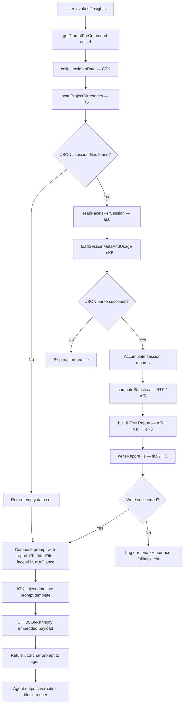

# `/insights`

> Analysis basis: CC v2.1.176 bundle.js (AST extraction + Claude interpretation)
> Minimum version: v2.1.176

---

## Overview

The `/insights` command generates a shareable HTML usage-analytics report from the user's accumulated Claude Code session data (JSONL transcripts and associated facets). It reads and aggregates session files stored under the local data directory, builds a self-contained HTML report, persists it to disk, and then instructs the agent to relay the report's location to the user verbatim.

---

## Registration

| Field | Value |
|---|---|
| type | `prompt` |
| name | `insights` |
| description | `Generate a report analyzing your Claude Code sessions` |
| loc_byte | `13509851` |
| loc_byte_end | `13511155` |
| loc_line | `10699` |
| handler_method | `getPromptForCommand` |
| handler_method_start | `13510025` |
| handler_method_end | `13511154` |
| prompt_body.length | `513` |
| prompt_body.trace | `call→bTK(...) (1 literals)` |
| arbor_handler.name | `getPromptForCommand` |
| arbor_handler.kind | `Method` |
| arbor_handler.fqn | `claude-2.1.176::getPromptForCommand` |
| arbor_handler.resolution_path | `direct` |
| arbor_handler.n_hits | `1` |

Analysis basis: CC v2.1.176 bundle.js:+13509851

---

## Input Branching

The command has 3+ distinct branches during data collection and report generation. The flowchart below captures the primary decision paths.



---

## Behavioral Spec

### 1. Entry Point — `getPromptForCommand`

The handler method is resolved `direct` against the registration object's byte range (bundle.js:+13510025–13511154). It orchestrates the full pipeline synchronously from the agent's perspective: data collection → report generation → prompt construction.

```
function getPromptForCommand(context):
    roundedStat = Math.round(someMetric)          // bundle.js:+13510412
    insightsData = collectAndBuildReport(context) // → CTK
    promptText   = buildPromptString(insightsData, bTK, CH, Cd8)
                                                   // bundle.js:+13511057,+13511075,+13511121
    return promptText
```

Analysis basis: CC v2.1.176 bundle.js:+13510025

---

### 2. Session Directory Discovery — `Kf5`

Locates all project directories under the local data root. The data root is constructed by joining the home/config base path with the `"projects"` segment (bundle.js:+5125702). Each subdirectory entry is tested with `isDirectory` before inclusion.

```
function scanProjectDirectories(basePath):
    entries = filesystem.readdir(basePath)           // bundle.js:+13496415
    dirs    = entries.filter(entry => entry.isDirectory())  // bundle.js:+13496483
    results = []
    for dir in dirs:                                 // batch size hint: 10/9 bundle.js:+13496665,+13496670
        facets = collectFacetsForProject(dir)        // → aL6
        results.push(facets)
        yield via setImmediate                       // bundle.js:+13496695
    results.sort(byTimestamp)                        // bundle.js:+13496719
    return results  // capped at 50/200 bundle.js:+13496807,+13496812
```

Analysis basis: CC v2.1.176 bundle.js:+13496396

---

### 3. Per-Project Facet Collection — `aL6`

Reads the facets sub-directory for each project session, filtering for `.jsonl` files (bundle.js:+13587287). Each qualifying file is stat-checked for size and then its content is processed via the MIME/type normaliser `N`.

```
function collectFacetsForProject(projectDir):
    files   = filesystem.readdir(projectDir)        // bundle.js:+13587181
    jsonlFiles = files.filter(f => f.isFile()       // bundle.js:+13587258
                               AND matchesExtension(f, ".jsonl"))  // via UN
    metadata = {}
    tasks = jsonlFiles.map(file =>
        stat = filesystem.stat(file)                // bundle.js:+13587490
        metadata.set(file, stat)                    // bundle.js:+13587501
        normaliseEntry(file)                        // → N
    )
    await Promise.all(tasks)                        // bundle.js:+13587422
    return metadata
```

Analysis basis: CC v2.1.176 bundle.js:+13587181

---

### 4. Session Metadata & Usage Data Loading — `nK5`

Reads the JSON metadata file for each session from two known sub-paths: `"usage-data"` (bundle.js:+13435676) and `"session-meta"` (bundle.js:+13435772), both under a `"facets"` sub-directory (bundle.js:+13435726). File reads use `"utf-8"` encoding (bundle.js:+13441807).

```
function loadSessionMetaAndUsage(sessionDir):
    facetsPath    = path.join(sessionDir, "facets")
    usagePath     = path.join(facetsPath, "usage-data")
    metaPath      = path.join(facetsPath, "session-meta")
    usageBase     = getBasePath(usagePath)          // → mB6
    rawUsage      = filesystem.readFile(usageBase, "utf-8")  // bundle.js:+13441783
    parsed        = safeJSONParse(rawUsage)         // → c6 → JSON.parse bundle.js:+190520
    return { usage: parsed, meta: metaPath }
```

Analysis basis: CC v2.1.176 bundle.js:+13441740

---

### 5. Statistics Computation — `RTK` + `STK`

Iterates over accumulated session records and computes per-facet aggregates. Uses `Math.floor`, `Math.round`, `Math.round` for numeric bucketing (bundle.js:+13447578, +13447757). Sorts results (bundle.js:+13447404). Computes percentile distribution via `STK` using `Number.isFinite` guards (bundle.js:+13444021). Session age threshold: 1 800 000 ms (30 minutes; bundle.js:+13444213).

```
function computeStatistics(sessionRecords):
    for entry in Object.entries(sessionRecords):    // bundle.js:+13445908
        bucket  = assignTimeBucket(entry)           // STK
        median  = q.at(midIndex)                    // bundle.js:+13447469
        rounded = Math.round(value)                 // bundle.js:+13447757
        result.push(bucket)
    result.sort(comparator)                         // bundle.js:+13447404
    return aggregates
```

Analysis basis: CC v2.1.176 bundle.js:+13445576

---

### 6. HTML Report Generation — `Af5`

Constructs a self-contained HTML report. Embeds structured data sections via `VzH` (response-time breakdown) and `eK5` (entry-count charts). Response-time buckets used: `"2-10s"`, `"10-30s"`, `"30s-1m"`, `"1-2m"`, `"2-5m"`, `"5-15m"`, `">15m"` (bundle.js:+13452958–+13453018). Time-of-day bands: Morning 6–12, Afternoon 12–18, Evening 18–24, Night 0–6 (bundle.js:+13453806–+13453959). Chart colours used: `#2563eb`, `#0891b2`, `#10b981`, `#8b5cf6`, `#dc2626`, `#16a34a`, `#eab308` (bundle.js:+13490623–+13495081). HTML maximum inline size: 8192 characters (bundle.js:+13452127). Markdown bold is rendered via `<strong>$1</strong>` substitution (bundle.js:+13454664); bullet markers via `"• "` (bundle.js:+13454707); line breaks via `"<br>"` (bundle.js:+13454737). Empty states are emitted as `<p class="empty">No data</p>` etc.

```
function buildHTMLReport(aggregates):
    html  = buildResponseTimeSection(aggregates, VzH)  // bundle.js:+13452309
    html += buildChartSection(aggregates, eK5)         // bundle.js:+13453331
    html  = applyMarkdownTransforms(html, uL/VL)
    if html.length > 8192:
        html = html.slice(0, 8192)                     // bundle.js:+13452127
    return html
```

Analysis basis: CC v2.1.176 bundle.js:+13454592

---

### 7. Report File Write — `iK5` / `lK5`

Creates output directory if absent (`yC.mkdir`, bundle.js:+13442324 and +13441567), then writes `"report.html"` (bundle.js:+13499045) with JSON-stringified payload via `CH` (bundle.js:+13442420). On error, logs via `kH` (bundle.js:+13442535). A date-stamped output path is assembled from `R.getFullYear/getMonth/getDate/getHours/getMinutes/getSeconds` components (bundle.js:+13498877–+13498975) and joined with `ad.join` (bundle.js:+13498995).

```
function writeReport(outputDir, content):
    filesystem.mkdir(outputDir, { recursive: true }) // bundle.js:+13442324
    outPath = path.join(outputDir, "report.html")    // bundle.js:+13499045
    filesystem.writeFile(outPath, jsonStringify(content))  // bundle.js:+13499073
    return outPath
```

Analysis basis: CC v2.1.176 bundle.js:+13441568

---

### 8. Prompt Construction — `getPromptForCommand` via `bTK` / `CH` / `Cd8`

After the report is written, the handler assembles the 513-character prompt (bundle.js:+13511057). The prompt body (extracted via `bTK`) contains four injected runtime values: full insights data payload, the report URL, the HTML file path, and the facets directory path. An at-a-glance summary is computed for the model's context only (the user has not yet seen any output at prompt time). The prompt instructs the agent to output the text between `<message>` tags verbatim as its entire response, without omitting any line. The fallback when no data is generated is the literal `"_No insights generated_"` (bundle.js:+13510922). Separator `" · "` is used in the at-a-glance line (bundle.js:+13510483).

```
function buildPromptString(reportResult, bTK, CH, Cd8):
    if reportResult is empty:
        atAGlance = "_No insights generated_"        // bundle.js:+13510922
    else:
        atAGlance = formatAtAGlance(reportResult)    // separator " · " bundle.js:+13510483
    payload = {
        insightsData: reportResult.data,
        reportURL:    reportResult.url,
        htmlFile:     reportResult.htmlPath,
        facetsDir:    reportResult.facetsDir,
        atAGlance:    atAGlance
    }
    return bTK(CH(payload))                          // bundle.js:+13511057,+13511075
```

Analysis basis: CC v2.1.176 bundle.js:+13511057

---

## State & Side Effects

| Item | Detail |
|---|---|
| Telemetry | No `tengu_*` events fire directly within the `/insights` handler path. Telemetry events found in the depth-2 traversal (`tengu_mcp_skills`, `tengu_daemon_config_reload`, `tengu_daemon_idle_exit`, `tengu_daemon_control`, `tengu_bg_*`, `tengu_transcript_*`, `tengu_chain_*`, `tengu_daemon_yield`) belong to auxiliary subsystems (MCP, daemon, transcript chain) reachable transitively and are **not** triggered by `/insights` itself. |
| Filesystem writes | Creates output directory tree and writes `report.html` under a date-stamped path inside the CC data directory (bundle.js:+13498786–+13499073). |
| Filesystem reads | Reads all `.jsonl` facet files and `usage-data` / `session-meta` JSON files from the `projects` sub-tree of the data directory (bundle.js:+13587181, +13441783). |
| JSON parse | Uses `c6` (safe JSON parse wrapper over `JSON.parse`) for all session file reads; malformed files are silently skipped (bundle.js:+190520). |
| Hook registration | None observed in depth-2 traversal. |
| appState changes | None observed in depth-2 traversal. |
| Sound | None observed. |
| Concurrency | `setImmediate` yielding inside the directory scan loop prevents blocking the event loop (bundle.js:+13496695). `Promise.all` used for parallel facet loading (bundle.js:+13587422). |

---

## Version History

| Version | Change |
|---|---|
| v2.1.176 | Initial analysis |

---

## Common Mistakes

1. **Invoking `/insights` in a workspace with no prior sessions** — the report will be generated with an empty data set; the agent response will still be delivered (using the `"_No insights generated_"` fallback), but no HTML file will contain meaningful charts.
2. **Deleting or relocating the CC data directory between invocations** — `Kf5` calls `filesystem.readdir` on the fixed `"projects"` path; if that directory is absent the scan silently returns zero results.
3. **Expecting the agent to elaborate beyond the `<message>` block** — the prompt instructs the model to output the `<message>` content verbatim as its *entire* response. Follow-on analysis is only triggered if the user explicitly asks a follow-up question after the command completes.
4. **Assuming the report URL is web-hosted** — the report is a local `report.html` file; the "URL" surfaced is a `file://` path or equivalent local reference, not a public URL.
5. **Modifying `.jsonl` facet files while `/insights` is running** — concurrent writes to JSONL files are not guarded; partial reads may cause `JSON.parse` to throw, silently dropping that session from the report.

---

## Appendix — Identifier Mapping

> For bundle debugging only. Identifiers change across versions.

| Identifier | Role |
|---|---|
| `__handler_insights` | Synthetic BFS entry node for the `/insights` command handler |
| `CTK` | Main data-collection and report-orchestration function |
| `Kf5` | Project directory scanner (reads `projects/` sub-tree) |
| `di` | Path join helper using `"projects"` literal |
| `aL6` | Per-project facet file collector (`.jsonl` filter, stat) |
| `UN` | File extension test (`.jsonl` regex) |
| `N` | MIME/type normaliser for facet entries |
| `nK5` | Session metadata and usage-data loader |
| `gXA` | Intermediate path builder for session directory |
| `mB6` | Base path resolver for `"usage-data"` / `"facets"` segment |
| `kTK` | Post-parse validation helper for session JSON |
| `c6` | Safe JSON parse wrapper |
| `CTK` | (see above) |
| `dXA` | Per-message analytics extractor (tool use, errors, timing) |
| `ITK` | Message-type classifier (tool_use, mcp__, edit, git, etc.) |
| `RTK` | Statistics aggregator (medians, percentiles, counts) |
| `STK` | Percentile / bucket assignment helper |
| `oL6` | Object.entries iteration helper for stats |
| `P9` | String slice helper (indexOf + slice) |
| `aK5` | High-level report data assembler |
| `hTK` | Per-session report section builder |
| `bK5` | Session path helper (→ `yD`) |
| `Af5` | Full HTML report string builder |
| `uL` | HTML entity / markdown transform helper |
| `VL` | `replaceAll`-based HTML entity encoder |
| `Rd8` | Sub-section renderer inside HTML builder |
| `_f5` | JSON-stringify wrapper used inside HTML generation |
| `VzH` | Response-time distribution section builder |
| `eK5` | Entry-count chart section builder |
| `Hf5` | Bar-chart row renderer |
| `iK5` | Report file writer (mkdir + writeFile, primary path) |
| `lK5` | Report file writer (mkdir + writeFile, secondary path) |
| `cK5` | Legacy/alternate session JSON reader with unlink fallback |
| `Cd8` | Path builder for `"session-meta"` segment |
| `ff5` | Object.keys enumeration helper for report fields |
| `QXA` | <!-- TODO: not found in depth-2 traversal; needs --depth 4 --> |
| `RTK` | (see above) |
| `UK5` | NaN-guard for numeric session values |
| `bTK` | Prompt template interpolator (injects runtime values into prompt body) |
| `CH` | JSON.stringify wrapper |
| `xTK` | Post-read cleanup helper for session files |
| `yTK` | Session directory path helper |
| `yD` | Low-level path utility (→ `XyH`) |
| `Yf` | Filter helper for message arrays |
| `JA` | Error/String coercion helper |
| `rK5` | Top-level per-session processing coordinator |
| `dK5` | Batch session processor with Promise.all |
| `FK5` | Session chunk slicer/preparer |
| `Hf6` | Transcript loader and hashing utility |
| `gf` | Transcript file path resolver |
| `tu8` | Transcript hashing and caching function |
| `U8` | UUID-based transcript lookup helper |
| `JBH` | Transcript entry extractor |
| `HT` | Error wrapper helper |
| `KZ` | <!-- TODO: not found in depth-2 traversal; needs --depth 4 --> |
| `kH` | Centralised error logger (logError) |
| `M9` | Filesystem error classifier |
| `A6` | String coercion utility |
| `sf5` | Binary session file parser (Buffer-based JSONL reader) |
| `tf5` | Synchronous file header reader |
| `KEK` | Transcript chain index builder |
| `af5` | Alternate binary transcript parser |
| `WhH` | Platform-specific path helper |
| `ZKH` | Full transcript/session state initialiser (sets many Map entries) |
| `hEK` | Chain-link lookup helper |
| `Q$H` | Chain-ordering and de-duplication function |
| `Bf5` | Chain NaN / validity filter |
| `Ff5` | Chain sort and merge helper |
| `pf5` | Chain queue drainer |
| `tq6` | Map-over-transcript-entries helper |
| `jPA` | Prompt text normaliser (replaceAll) |
| `OU6` | Prompt content extractor (Array.isArray branching) |
| `XPA` | Content-block type filter |
| `gf5` | Content-block text trimmer |
| `Qf5` | Content-block `some`-predicate helper |
| `id8` | Session index get/set helper |
| `rd8` | Session value array flattener |
| `bd8` | Master session-state accessor (delegates to ZKH sub-maps) |
| `LbH` | MCP connection manager |
| `vZA` | MCP server reconciler |
| `Ho8` | MCP connection result applier |
| `wG` | MCP connection cleanup helper |
| `D86` | MCP server state emitter |
| `fbH` | MCP update broadcast helper |
| `kPK` | Background session spawner |
| `n8` | Timeout-with-abort helper |
| `j28` | MCP auth-state checker |
| `k28` | MCP OAuth initiator |
| `S28` | MCP OAuth callback handler |
| `to9` | MCP reconnect scheduler |
| `_Q_` | MCP error formatter |
| `K7` | MCP error logger |
| `TH` | String coercion wrapper |
| `ro9` | MCP background-connection helper |
| `J86` | parseInt wrapper (version A) |
| `kW8` | parseInt wrapper (version B) |
| `do9` | MCP retry timer |
| `oX8` | MCP state transition helper A |
| `nX8` | MCP state transition helper B |
| `z8` | MCP debug log pusher |
| `wh` | MCP skills telemetry emitter |
| `Bg_` | MCP capability filter |
| `LQ` | MCP tool registration helper |
| `EZ` | MCP tool wrapper |
| `d8` | Generic utility (→ `_`) |
| `uN6` | Spinner / progress utility |
| `SR` | MCP connection status reporter |
| `NW8` | <!-- TODO: not found in depth-2 traversal; needs --depth 4 --> |
| `Yh` | <!-- TODO: not found in depth-2 traversal; needs --depth 4 --> |
| `jr` | <!-- TODO: not found in depth-2 traversal; needs --depth 4 --> |
| `hx` | <!-- TODO: not found in depth-2 traversal; needs --depth 4 --> |
| `bTK` | (see above — prompt template interpolator) |