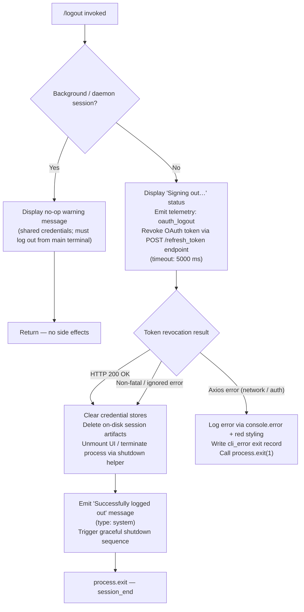

# `/logout`

> Analysis basis: CC v2.1.176 bundle.js (AST extraction + Claude interpretation)
> Minimum version: v2.1.176

---

## Overview

`/logout` signs the user out of their Anthropic account by revoking the OAuth token via a remote API call, clearing all in-memory credential stores, cleaning up session artifacts from disk, and then terminating the CLI process. In background/daemon sessions the command is a no-op that instructs the user to run `/logout` from their primary terminal instead.

---

## Registration

| Field | Value |
|---|---|
| type | `local-jsx` |
| name | `logout` |
| description | Sign out from your Anthropic account |
| loc_byte | `11926464` |
| loc_byte_end | `11926748` |
| loc_line | `8104` |
| module_id | `Te_` |
| load_inline | `true` |
| arbor_handler.name | `U1L` |
| arbor_handler.fqn | `claude-2.1.176::U1L` |
| arbor_handler.kind | `AsyncFunction` |
| arbor_handler.resolution_path | `module_id` |
| arbor_handler.n_hits | `0` |

Analysis basis: CC v2.1.176 bundle.js:+11926464

---

## Input Branching

Four distinct execution paths exist depending on session context and the outcome of the OAuth revocation call, so a Mermaid flowchart is used.



Analysis basis: CC v2.1.176 bundle.js:+8367708 (handler entry `U1L`), +8367818 (background session guard), +8367781 (main logout body), +8366702 (OAuth revocation call `eY_`), +13404899 (cli_error exit path)

---

## Behavioral Spec

### 1 — Background-session Guard

```
function checkBackgroundSession(sessionContext):
    if sessionContext.kind is "bg" or "daemon" or "daemon-worker":
        display message:
            "This background session shares credentials with other sessions;
             /logout here has no effect. Run /logout from your main terminal
             to sign out."
        return EARLY_EXIT   // no network call, no state change
```

Analysis basis: CC v2.1.176 bundle.js:+8367818 (message literal), +2289261–2289285 (`"bg"`, `"daemon"`, `"daemon-worker"` literals used in session-kind check via `G9` / `BjH`)

---

### 2 — OAuth Token Revocation

```
async function revokeOAuthToken(storedCredentials):
    payload = { grant_type: "refresh_token", token: storedCredentials.refreshToken }
    headers = { "Content-Type": "application/json" }
    response = await httpClient.post(oauthEndpoint, payload, { timeout: 5000 })
    // Telemetry event label at loc_byte 2130172: "oauth_token_revoke"
    if response is AxiosError:
        classify error (network / auth / timeout)
        if error.code is "ECONNABORTED"  → category "timeout"
        if error.code is "ECONNREFUSED" or "ENOTFOUND" → category "network"
        if status is 401 or 403          → category "auth"
    return response
```

Analysis basis: CC v2.1.176 bundle.js:+2130004 (`OA.post`), +2130064 (`"refresh_token"`), +2130119 (`"Content-Type"`), +2130162 (timeout `5000`), +2130172 (`"oauth_token_revoke"` telemetry label), +2130209 (`OA.isAxiosError`)

---

### 3 — Credential-store Teardown

```
function clearAllCredentialStores():
    // Clear the in-memory credential cache map
    credentialCache.clear()                  // QM8 → eq9.clear

    // Remove event listeners and intervals that keep credentials live
    clearAllProcessListeners()               // JaH → process.off, DN_ → clearInterval,
                                             //        process.removeListener
    // Clear multiple auxiliary maps
    for store in [KXH, sM8, X06, MN_, qg]:
        store.clear()

    // Emit shutdown event so subscribers can flush
    eventBus.emit(shutdownEvent)             // DaH.emit

    // Log any remaining errors in the error queue
    flushErrorLog()                          // kH path → JA, A6, JUf, ycH.push, Ms.logError
```

Analysis basis: CC v2.1.176 bundle.js:+3263941 (`eq9.clear`), +3314103 (`process.off`), +3314863 (`clearInterval`), +3314229–3314277 (auxiliary `.clear()` calls), +3313975 (`DaH.emit`), +8366980 (`kH` call from handler)

---

### 4 — On-disk Session Artifact Cleanup

```
async function cleanupDiskArtifacts(sessionPaths):
    // Remove the session lock file / socket
    unlinkSessionSocket(sessionPaths.socket)      // y9q → qA6.unlink

    // Tear down the IPC / daemon socket file
    unlinkDaemonSocket(sessionPaths.daemon)        // hi_ → OxH.unlink

    // Flush and close any pending async storage writes
    await flushStorageQueue()                      // mf → aI1 → H.readAsync / H.update / _.delete / H.delete

    // Delete the secure-storage credential entry for "claude-code-user"
    await deleteKeychainEntry("claude-code-user")  // tv_ → wK9 → wG1 → ry
    // On failure logs: "Failed to delete keychain entry"
```

Analysis basis: CC v2.1.176 bundle.js:+7466145 (`qA6.unlink`), +7420471 (`OxH.unlink`), +2323416 (`aI1` storage flush), +2141682 (`"claude-code-user"`), +2142441 (`"Failed to delete keychain entry"`)

---

### 5 — Configuration Persistence (auth-safe write)

```
function saveConfigRemovingAuthTokens(configPath):
    acquireLock(configPath)
    // Re-read config from disk before writing to avoid wiping auth for
    // OTHER concurrent sessions (see safety guard literals below)
    freshConfig = readConfigFromDisk(configPath)
    if freshConfig.auth is present and cacheHasAuth and freshConfig.auth ≠ cache.auth:
        log warning:
            "saveConfigWithLock: re-read config is missing auth that cache has;
             refusing to write to avoid wiping ~/.claude.json. See GH #3117."
        releaseLock()
        return
    freshConfig.apiKey   = undefined
    freshConfig.oauthToken = undefined
    writeConfigAtomic(configPath, freshConfig)   // EY6 atomic-write helper
    releaseLock()
```

Analysis basis: CC v2.1.176 bundle.js:+3335109 (safety guard message literal), +3334693 (lock-contention warning), +3331746 (global-config fallback guard), `tengu_config_auth_loss_prevented` telemetry (+3335261), `tengu_config_lock_contention` (+3334782)

---

### 6 — Graceful Process Shutdown

```
async function gracefulShutdown():
    // Display success message in the chat UI as a system turn
    renderSystemMessage("Successfully logged out from your Anthropic account.")
    // Wait briefly for React/Ink to flush the final render frame
    await delay(200)                           // setTimeout 200 ms (literal +8368112)
    // Initiate the Ink/React unmount + terminal restore sequence
    unmountUI()                                // Sf → y9 → XxH → H.unmount
    // Drain telemetry queue before exit
    drainTelemetryQueue()                      // qQH → DyA.drain
    // Signal session_end
    emitSessionEnd()                           // K6 → "session_end" literal (+7432210)
    process.exit(0)
```

Analysis basis: CC v2.1.176 bundle.js:+8368017 (success message literal), +8368112 (`200` ms delay), +7429473 (`H.unmount`), +65246 (`DyA.drain`), +7432210 (`"session_end"`)

---

### 7 — Error Path (CLI Error Exit)

```
function handleFatalLogoutError(error):
    formattedMessage = X6.red(error.message)     // red ANSI styling
    console.error(formattedMessage)
    writeExitRecord({ type: "cli_error" })        // kX → p8H.writeFileSync
    process.exit(1)
```

Analysis basis: CC v2.1.176 bundle.js:+13404844 (`console.error`), +13404858 (`X6.red`), +13404899 (`"cli_error"`), +13404896 (`kX` → `p8H.writeFileSync`), +13404912 (`process.exit`)

---

## State & Side Effects

| Item | Detail |
|---|---|
| Telemetry — `oauth_token_revoke` | Fired during the OAuth POST call (bundle.js:+2130172) |
| Telemetry — `oauth_logout` | Fired at the start of the main handler (bundle.js:+8367488 literal label) |
| Telemetry — `tengu_feature_ok` / `tengu_feature_sad` / `tengu_feature_bad` | Fired by the feature-event helper `kH` when recording the logout result (bundle.js:+1018758, +1018906, +1018825) |
| Telemetry — `tengu_config_lock_contention` | Fired if config lock acquisition stalls (bundle.js:+3334782) |
| Telemetry — `tengu_config_stale_write` | Fired if a stale write is detected during config save (bundle.js:+3334918) |
| Telemetry — `tengu_config_auth_loss_prevented` | Fired when the safety guard blocks an auth-erasing write (bundle.js:+3335261) |
| Telemetry — `tengu_cache_eviction_hint` | Fired during session teardown (bundle.js:+7432172) |
| Telemetry — `tengu_scroll_summary` | Fired by the scroll-metrics subsystem on shutdown (bundle.js:+7431229) |
| Telemetry — `tengu_startup_perf` | Startup profiling report emitted via `wO6` path (bundle.js:+222612) |
| Telemetry — `tengu_pewter_brook` | Fired by the fullscreen-capability probe (bundle.js:+3527544) |
| Telemetry — `tengu_daemon_config_reload` | Fired during daemon config reload on shutdown (bundle.js:+16997877) |
| Network call | `POST` to OAuth revocation endpoint with `refresh_token` grant; timeout 5000 ms |
| Credential cache | `eq9.clear()` — in-memory OAuth token map cleared |
| Auxiliary caches | Five auxiliary stores (`KXH`, `sM8`, `X06`, `MN_`, `qg`) cleared |
| Config file (`~/.claude.json`) | Auth tokens removed; written atomically via rename (EY6 helper) with auth-loss safety guard |
| Keychain entry | `"claude-code-user"` entry deleted via OS keychain API |
| Socket / lock files | Session socket and daemon socket unlinked from disk |
| Storage queue | Async credential storage queue flushed and closed (`aI1`) |
| Process listeners | All `process.on('exit')`, `process.on('beforeExit')` listeners removed |
| UI | Ink/React tree unmounted; terminal cursor position restored (ANSI `\x1b7` / `\x1b8`) |
| Process | Exits with code `0` on success, `1` on fatal error |
| Background session | No side effects at all — early return with informational message |

---

## Version History

| Version | Change |
|---|---|
| v2.1.176 | Initial analysis |

---

## Common Mistakes

1. **Running `/logout` inside a background or daemon session** — the command silently does nothing and prints an advisory message. Users must switch to their primary terminal and run `/logout` there.
2. **Expecting the OAuth token to be revoked offline** — the revocation requires a network POST. If the network is unavailable (`ECONNREFUSED` / `ENOTFOUND`), the call fails; local credential files are still cleaned up but the server-side token may remain valid until it expires naturally.
3. **Assuming `/logout` preserves other config** — the command triggers an atomic rewrite of `~/.claude.json`. The auth-loss safety guard (GH #3117) prevents accidental data loss, but any unsaved in-memory config changes may be lost.
4. **Re-invoking Claude immediately after logout** — the process exits after logout; any subsequent invocation starts a fresh authentication flow via `/login`.
5. **Confusing `oauth_token_revoke` with `oauth_logout`** — `oauth_logout` is the outer command-level event; `oauth_token_revoke` is the lower-level network-call event. Both appear in telemetry for a successful logout.

---

## Appendix — Identifier Mapping

> For bundle debugging only. Identifiers change across versions.

| Identifier | Role |
|---|---|
| `U1L` | Main handler async function for `/logout` (arbor_handler) |
| `d16` | Core logout execution logic — orchestrates all sub-steps |
| `B1L` | UI wrapper / JSX render component for the logout flow |
| `ok6` | Session teardown coordinator — calls cache clears and listener removal |
| `eY_` | OAuth token revocation HTTP helper |
| `QAH` | Process-listener and interval cleanup dispatcher |
| `JaH` | Multi-store clear and process.off orchestrator |
| `DN_` | clearInterval + process.removeListener helper |
| `QM8` | Credential-cache clear helper (`eq9.clear`) |
| `y9q` | Session socket unlink helper |
| `hi_` | Daemon socket unlink helper |
| `vi_` | Inner daemon socket tear-down (clearTimeout + unlink) |
| `yLH` | Socket path resolution helper |
| `_JH` | Path join helper used by daemon socket cleanup |
| `mf` | Async storage queue flush dispatcher |
| `aI1` | Storage queue read/update/delete operations |
| `hyH` | Storage async-read helper |
| `T24` | Storage context / lock-store accessor |
| `IH` | Storage secure-write telemetry helper (`tengu_feature_ok`) |
| `n6` | Storage telemetry helper (`tengu_feature_sad`) |
| `bH` | Storage telemetry helper (`tengu_feature_bad`) |
| `eH` | Inner telemetry emission helper |
| `tv_` | Keychain / credential-deletion helper |
| `wK9` | Keychain orchestrator |
| `wG1` | Keychain path + hash computation |
| `ry` | Config path normaliser and SHA-256 hasher |
| `PN` | OS user-info lookup helper |
| `P8` | Global config save-with-lock orchestrator |
| `j38` | Atomic config file write (with backup rotation) |
| `G5H` | Config read + backup helper |
| `EY6` | Atomic file-write via temp file + rename |
| `vN_` | Backup path join helper |
| `D38` | Config diff / stale-write helper |
| `h06` | Timestamp helper (Date.now) |
| `FK9` | Config entry enumerator (Object.entries) |
| `EaH` | Config parse helper |
| `zXH` | Config serialise helper |
| `rq8` | Lock acquisition retry helper |
| `kH` | Feature-event logger (`tengu_feature_ok/sad/bad`) |
| `JA` | Error-to-string converter |
| `A6` | String coercion helper |
| `Aq` | Essential-traffic queue accessor |
| `JUf` | Event-queue shift/push helper (`ys6`) |
| `o_` | Provider-type resolver (bedrock / vertex / firstParty etc.) |
| `G9` | Session-kind / background check helper |
| `BjH` | Background-mode predicate |
| `Na` | Notification / alert display helper |
| `EvH` | App-state mutation helper post-logout |
| `q` | Data-channel reader helper (`"data"` literal, 1024 chunk size) |
| `u1` | CLI error exit routine |
| `kBH` | Error formatter using red ANSI styling |
| `kX` | cli_error file writer (`p8H.writeFileSync`) |
| `F1` | OAuth endpoint URL builder |
| `OUA` | OAuth URL constant accessor |
| `iTf` | OAuth client-id accessor |
| `N` | HTTP request builder / normaliser |
| `gff` | Log-writer dispatcher |
| `lff` | Log file append helper |
| `AQH` | Log queue flush / setTimeout batching helper |
| `g4H` | Log file path builder |
| `Q6` | File-existence / mkdirp guard |
| `r$6` | EISDIR error classifier |
| `skA` | Log file path join helper |
| `dH_` | Log file rotation helper (`.txt` rename) |
| `cff` | Log file append with rotation |
| `u9` | Telemetry drain registration (`DyA.register`) |
| `Sf` | Shutdown orchestrator (unmount + drain + exit) |
| `y9` | Core shutdown sequence (unmount / race / allSettled) |
| `XxH` | Terminal write + unmount helper |
| `Bi_` | Final output line renderer (dim styling) |
| `Fi_` | Force-exit helper (process.exit / SIGKILL) |
| `qQH` | Telemetry drain caller (`DyA.drain`) |
| `wO6` | Startup profiling helper (`tengu_startup_perf`) |
| `wSA` | Profiling report writer |
| `ET8` | Session metrics collector (`tengu_scroll_summary`) |
| `V1q` | Scroll metric calculator |
| `y1` | Fullscreen-capability probe (`tengu_pewter_brook`) |
| `W36` | <!-- TODO: not found in depth-2 traversal; needs --depth 4 --> |
| `K6` | Session-end signal emitter (`"session_end"`) |
| `nM6` | nM6 base module (used by K6) |
| `WxH` | Post-unmount cleanup helper |
| `GT8` | Terminal state restore helper |
| `m1q` | Parallel cleanup waiter (`Promise.allSettled`) |
| `w` | MCP supervisor / daemon config-reload handler |
| `nZH` | File stat / read worker |
| `q0K` | Column-width calculator |
| `T` | Supervisor stop helper |
| `j6f` | Heartbeat helper |
| `M` | MCP connection manager emit |
| `LbH` | MCP server connection orchestrator |
| `Ho8` | MCP apply-connection-result handler |
| `vZA` | MCP connection-slot updater |
| `sf` | Settings serialiser |
| `KRH` | Settings store reader/writer |
| `uF` | Settings random-ID generator |
| `S6` | Secure storage accessor (`eG`) |
| `IY8` | Settings schema validator |
| `KE6` | Settings key coercion helper |
| `f_H` | Feature-flag gate (`Zuf.has`) |
| `rf` | Settings write helper |
| `T29` | Settings merge helper |
| `fRH` | Auth token classifier (`isAxiosError`, status 401/403) |
| `ZJ` | Status-code string converter |
| `cs8` | Settings change event helper |
| `ls8` | Settings broadcast helper |
| `s36` | Settings key splitter |
| `E8` | Error code extractor (`"code"` field) |
| `dI1` | Storage initialiser helper |
| `TH` | String coercion helper |
| `CH` | JSON.stringify wrapper |
| `bf` | Header redaction helper (`[REDACTED]`) |
| `ikA` | Header map helper |
| `kQH` | stdout write helper |
| `mkA` | Raw stdout write (`H.write`) |
| `_` | Miscellaneous utility (storage / string ops) |
| `H` | Random / timer / storage context object |
| `d` | Base storage primitive |
| `eH` | Storage event emitter helper |
| `f` | Async file / queue helper |
| `L` | Connection / file handle wrapper |
| `A` | Promise / array utility |
| `K` | State-mutation map |
| `N0` | Numeric zero or render-origin helper |
| `iu` | UI instance accessor |
| `x$` | Source / platform identifier |
| `N1q` | Newline / separator helper |
| `aO8` | Terminal write helper (ANSI save/restore) |