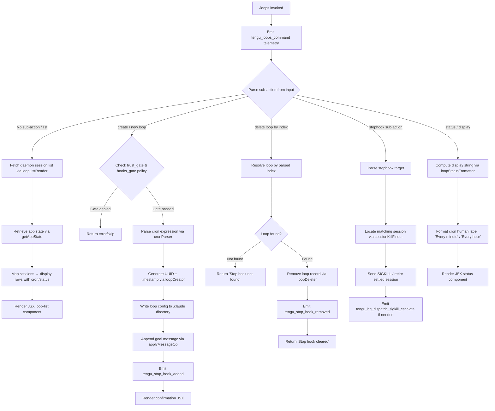

# `/loops`

> Analysis basis: CC v2.1.176 bundle.js (AST extraction + Claude interpretation)
> Minimum version: v2.1.176

---

## Overview

The `/loops` command provides an interactive management interface for Claude Code's background agent loops — persistent, scheduled, or triggered background sessions. It allows the user to list existing loops, create new loops (with an optional stop hook and cron schedule), and delete loops by index. The command renders a JSX UI component and drives the background daemon subsystem to fulfill each operation.

---

## Registration

| Field | Value |
|---|---|
| type | `local-jsx` |
| name | `loops` |
| description | `List, create, and delete loops` |
| immediate | `true` |
| module_id | `awK` |
| load_inline | `true` |
| loc_byte | `12828134` |
| loc_byte_end | `12828291` |
| loc_line | `9030` |
| arbor_handler.name | `ctL` |
| arbor_handler.fqn | `claude-2.1.176::ctL` |
| arbor_handler.kind | `AsyncFunction` |
| arbor_handler.resolution_path | `module_id` |
| arbor_handler.n_hits | `0` |

Analysis basis: CC v2.1.176 bundle.js:+12828134

---

## Input Branching

The handler `ctL` branches across five distinct paths based on the sub-action present in the command input and the current application/daemon state. A Mermaid flowchart is required.



Analysis basis: CC v2.1.176 bundle.js:+12827089 – +12827944

---

## Behavioral Spec

### Handler entry — `loopsCommandHandler` (`ctL`)

The main async handler is `ctL`, resolved via `module_id → awK` (Arbor `module_id` resolution path).

```
async function loopsCommandHandler(context):
    emit telemetry("tengu_loops_command")           // +12827091
    rawLoops = await loopListReader(context)         // D9H, +12827129
    scheduleTable = buildScheduleTable(rawLoops)     // rf6, +12827137
    appState = context.getAppState()                 // +12827141
    displayRows = appState.loops.map(renderLoopRow)  // +12827169

    subAction = parseSubAction(context.input)

    if subAction == "stophook":                      // +12827273
        result = handleStophook(context, displayRows)
    else if subAction == "create":
        result = handleCreate(context, appState)
    else if subAction == "delete":
        result = handleDelete(context, displayRows)
    else:
        result = renderLoopList(displayRows)

    return result
```

Analysis basis: CC v2.1.176 bundle.js:+12827089

---

### Loop list reader — `loopListReader` (`D9H`)

Calls the underlying file-system loop reader (`bRH`) and the session status inspector (`IE`) to produce a merged view of all loops.

```
async function loopListReader(context):
    rawEntries = await fileSystemLoopReader(context)  // bRH, +12827129
    statusMap  = await sessionStatusInspector()       // IE,  +4887551
    return merge(rawEntries, statusMap)
```

Analysis basis: CC v2.1.176 bundle.js:+4887515

---

### File-system loop reader — `fileSystemLoopReader` (`bRH`)

Reads the `.claude` directory, parsing each loop configuration file.

```
async function fileSystemLoopReader(context):
    baseDir = pathHelper.join(configPath)             // bMH, +4885457
    content = await fs.readFile(baseDir, "utf-8")     // +4885526, "utf-8" literal +4885554
    parsed  = jsonParser(content)                     // c6
    if not Array.isArray(parsed):
        return []
    entries = parsed.filter(validEntry)
    entries = entries.map(enrichEntry)                // xI, +4885918
    return entries
```

Error codes handled: `ENOENT`, `EACCES`, `EPERM`, `ENOTDIR`, `ELOOP`, `EROFS`
(Analysis basis: CC v2.1.176 bundle.js:+181315 – +181384)

---

### Schedule table builder — `buildScheduleTable` (`rf6`)

Constructs a mapping from loop ID to a formatted schedule string, padding columns for display.

```
function buildScheduleTable(loops):
    table = new Map()
    for loop in loops:
        label = formatScheduleLabel(loop)            // YTH, +9305279
        table.set(loop.id, label.padEnd(colWidth))   // K.set
    return table
```

Column padding uses two-space separator literal `"  "` at `+17007390`.

Analysis basis: CC v2.1.176 bundle.js:+10627117

---

### Cron expression parser — `cronParser` (`eN`)

Converts a raw cron string into a human-readable label and a next-fire timestamp.

```
function cronParser(cronString):
    trimmed = cronString.trim()                      // +4883298
    parts   = trimmed.match(cronRegex)               // +4883439
    if not parts:
        return { label: "Every minute", next: null } // literal +4883418

    minute = parseInt(parts[1])                      // +4883474
    if minute == 0:
        label = "Every hour"                         // literal +4883635
    else:
        label = "Every minute"

    // Compute next-fire using UTC day/hour arithmetic
    nextDate = new Date()
    nextDate.setUTCDate(...)                         // +4884194
    nextDate.setUTCHours(...)                        // +4884225
    dayOfWeek = nextDate.getDay()                    // +4884254

    return { label, nextFire: nextDate.toString() }  // +4883672
```

Supported range literal: `"1-5"` (weekday schedule, +4884342).

Analysis basis: CC v2.1.176 bundle.js:+4883298

---

### Loop creator — `loopCreator` (`SeH`)

Creates a new loop record on disk and appends a goal message to the active session.

```
async function loopCreator(context, appState, cronExpr, promptText):
    id        = crypto.randomUUID()                  // VZ9.randomUUID, +4886854
    createdAt = Date.now()                           // +4886916
    config    = buildLoopConfig(id, cronExpr, promptText)  // VvH, +4886962

    // Persist config under .claude directory
    await directoryMaker(configDir)                  // keH → hj8.mkdir, +4886674
    filePath = path.join(configDir, ".claude", id)   // +4886695 ".claude" literal
    await fs.writeFile(filePath, serialize(config))  // keH → hj8.writeFile
    await fileSystemLoopReader(context)              // bRH, +4887006

    // Append goal attachment to current session
    context.applyMessageOp({
        role:    "system",                           // literal +12827422
        type:    "append",                           // literal +10628142
        content: { type: "attachment",              // literal +10628252
                   goal: promptText }               // literal +10628210
    })

    emit telemetry("tengu_stop_hook_added")          // +10627804
    return { id, label: "Stop hook set" }            // literal +12827851
```

Analysis basis: CC v2.1.176 bundle.js:+4886854

---

### Loop deleter — `loopDeleter` (`af6` + `of6`)

Removes a loop by its parsed integer index.

```
async function loopDeleter(context, index):
    appState = context.getAppState()                 // af6 → H.getAppState, +10627921
    loops    = appState.loops

    if index >= loops.length or index < 0:
        return { message: "Stop hook not found" }    // literal +12827533

    target = loops[index]
    newState = loops.filter(l => l.id != target.id)

    context.setAppState({ loops: newState })         // af6 → H.setAppState, +10628050
    context.applyMessageOp({ type: "goal_status",   // literal +10628339
                             id: target.id,
                             status: "removed" })

    emit telemetry("tengu_stop_hook_removed")        // +10628176
    return { message: "Stop hook cleared" }          // literal +12827555
```

Analysis basis: CC v2.1.176 bundle.js:+10627917

---

### Loop status formatter — `loopStatusFormatter` (`dtL`)

Formats the display string shown in the loop list for each entry, computing timing deltas.

```
function loopStatusFormatter(loop, now):
    raw = loop.cronExpr.match(cronPattern)           // +12826677
    n   = parseInt(raw[1])                           // +12826714

    elapsed    = Math.max(0, now - loop.lastFire)    // +12826799
    remaining  = Math.ceil(nextFire - now)           // +12826810
    rounded    = Math.round(elapsed / 1000)          // +12826883

    // Boundary constants
    maxMinutes = 59    // +12826856
    maxHours   = 23    // +12826927
    maxDays    = 31    // +12826980

    statusLine = xI(loop)                            // lineParser, +12827047
    return statusLine
```

Human-readable recurring marker: `" (recurring)"` literal at `+16468220`.

Analysis basis: CC v2.1.176 bundle.js:+12826677

---

### Stophook sub-action handler — `stophookHandler` (`Y9H`)

Locates and terminates a background session matched by the provided loop index.

```
async function stophookHandler(context, loops):
    filtered = loops.filter(l => activeSet.has(l.id))  // +4887243 / +4887258
    await fileSystemLoopReader(context)                 // bRH, +4887234
    target = filtered[resolvedIndex]

    if target found:
        await writeLoopConfig(target)                   // keH, +4887307
        sessionKill(target.sessionId)                   // b.kill via D, +16982040
        emit "tengu_bg_dispatch_sigkill_escalate" if needed  // +16981999
    else:
        return { message: "Stop hook not found" }       // literal +12827533
```

Analysis basis: CC v2.1.176 bundle.js:+4887184

---

### Background session lifecycle (supporting subsystem)

The `/loops` command interacts with the background daemon session manager (`vVA` / `D`) for lifecycle operations. Key observable constants from this subsystem:

| Constant | Value | Location |
|---|---|---|
| Session states | `"active"`, `"idle"`, `"working"`, `"blocked"`, `"crashed"`, `"done"`, `"killed"`, `"failed"`, `"bg"`, `"daemon"`, `"resuming"` | +4268161, +16989168, +16988564, +16988457, +16988403, +16988219, +16988237, +16988256, +16988728, +16989053, +16990146 |
| Idle timeout | 300 000 ms | +16989932 |
| Send-claim timeout | 5 000 ms | +16960271 |
| Claim retry delay | 500 ms | +16960475 |
| Spare slot literal | `"spare"` | +16982791 |
| SIGKILL signal | `"SIGKILL"` | +16982047 |
| SIGTERM signal | `"SIGTERM"` | +16960075 |
| Recurrence marker | `" (recurring)"` | +16468220 |
| Never-fire sentinel | `"never"` | +16468118 |
| Scheduled task fire event | `tengu_scheduled_task_fire` | +16468243 |
| Scheduled task missed event | `tengu_scheduled_task_missed` | +16467492 |

Analysis basis: CC v2.1.176 bundle.js:+16988219 – +16990146

---

## State & Side Effects

| Item | Detail |
|---|---|
| Telemetry | `tengu_loops_command` (+12827091), `tengu_stop_hook_added` (+10627804), `tengu_stop_hook_removed` (+10628176), `tengu_bg_dispatch_sigkill_escalate` (+16981999), `tengu_daemon_config_reload` (+16997877), `tengu_daemon_control` (+17019560), `tengu_scheduled_task_missed` (+16467492), `tengu_scheduled_task_fire` (+16468243), `tengu_scheduled_task_expired` (+16468586), `tengu_feature_bad` (+1018825), `tengu_feature_ok` (+1018758), `tengu_bg_low_mem_mb` (+13372785), `tengu_bg_dispatch_low_mem` (+16982600), `tengu_bg_spare_enable` (+16983304), `tengu_bg_sendclaim_failed` (+16959837), `tengu_bg_state_read_transient` (+4261246), `tengu_bg_spare_claim` (+16983432), `tengu_bg_spare_claim_fail` (+16983698), `tengu_mcp_skills` (+6653207), `tengu_feature_sad` (+1018906) |
| Disk writes | Loop config files written under `.claude/` directory (+4886695); loop config directory created via `mkdir` if absent (+4886674); `daemon.status.json` read/written by daemon status subsystem (+13096311) |
| App state changes | `setAppState` called to update `loops` array on create/delete (+10628050, +10627705); `applyMessageOp` appends a `goal` attachment or `goal_status` record (+10628119, +10627747) |
| Session signals | SIGKILL sent to background sessions via `process.kill` when escalation occurs (+13875310); SIGTERM sent via daemon claim socket (+16960075) |
| Hook registration | `immediate: true` — the command handler executes immediately without queuing; stop hook lifecycle events tracked via `tengu_stop_hook_added` / `tengu_stop_hook_removed` |
| Sound | <!-- TODO: not found in depth-2 traversal; needs --depth 4 --> |
| MCP side effects | MCP client connection subsystem (`LbH`, `vZA`) is reachable from the loop manager; `tengu_mcp_skills` may fire when loop creation triggers MCP reconnection |

---

## Version History

| Version | Change |
|---|---|
| v2.1.176 | Initial analysis |

---

## Common Mistakes

1. **Providing a bare number without a sub-action keyword**: The parser expects keywords such as `stophook`, a creation prompt, or an integer index to route correctly. A bare integer with no context will be misinterpreted or ignored.
2. **Invalid cron expression syntax**: The cron parser (`eN`) performs a regex match and returns a default `"Every minute"` label on failure — an invalid cron string will not produce an error but silently falls back to the default schedule.
3. **Expecting synchronous deletion**: Loop deletion writes through the daemon subsystem and involves async file I/O; the confirmation message `"Stop hook cleared"` is only displayed after the async operation completes.
4. **Assuming loop index is 1-based**: The index parsed by `dtL` / `parseInt` is 0-based internally; display may show 1-based numbering, which can cause an off-by-one if the user passes a raw number.
5. **Trying to delete a loop while the background session is in `"working"` state**: The stophook path will attempt a SIGKILL escalation; the session transitions to `"killed"` state, not a clean `"done"` state — downstream tooling should not expect a normal completion artifact.

---

## Appendix — Identifier Mapping

> For bundle debugging only. Identifiers change across versions.

| Identifier | Role |
|---|---|
| `ctL` | Main `/loops` command handler (AsyncFunction, Arbor-resolved) |
| `d` | Utility / logger helper called at handler entry |
| `D9H` | Loop list reader — fetches raw loop entries and status |
| `bRH` | File-system loop reader — reads `.claude` loop config files |
| `Q6` | Config path resolver used by file-system loop reader |
| `bMH` | Path helper for config directory join |
| `Cf` | Config file parser / deserializer |
| `M9` | Error code mapper (E8 wrapper) |
| `E8` | Generic error constructor helper |
| `kH` | Essential-traffic queue / rate limiter |
| `JA` | Error string formatter |
| `A6` | String coercion utility |
| `Aq` | Traffic category checker (`"essential-traffic"`) |
| `JUf` | Queue shift/push manager |
| `N` | Debug-level log / event emitter |
| `gff` | Sub-log dispatcher (Zy, BH_, JyA) |
| `H` | Random delay / setTimeout wrapper |
| `CH` | JSON serializer (`JSON.stringify`) |
| `bf` | Redaction helper (replaces sensitive values with `[REDACTED]`) |
| `kQH` | mkA-based utility (mkA = +197988) |
| `lff` | File reader with byte-length tracking and chunked promise chain |
| `xI` | Loop entry line parser / trimmer |
| `s57` | Cron-string tokenizer (split, match, parseInt, Set.add) |
| `A` | Array with `toLowerCase` helper |
| `f` | Promise/add-finally-delete lifecycle wrapper |
| `q` | Data event emitter (1024-byte chunks) |
| `L` | Stream close/delete manager |
| `IE` | Session status inspector |
| `eG` | Core event emitter / base class |
| `rf6` | Schedule table builder |
| `YTH` | Per-loop label formatter (K.set + JNq) |
| `K` | Padded-column map (padEnd with `"  "` separator) |
| `JNq` | Row mapper for schedule display |
| `S6` | App-state change emitter (eG wrapper) |
| `eN` | Cron expression parser — produces human labels and next-fire dates |
| `D` | Background session process manager (core daemon object) |
| `b` | Loop session spawner — orchestrates new background sessions |
| `w` | Daemon config reload handler (supervisor channel writer) |
| `Cs` | zLH wrapper — session context helper |
| `keH` | Loop config directory writer (mkdir + writeFile) |
| `yZ9` | Filter/IeH — loop entry validator |
| `P` | Background PTY read handler (Buffer concat + subarray) |
| `z` | Daemon stop controller (IH, bH, gS, hB) |
| `S` | Session write dispatcher (kH, ZI5, w.write) |
| `X` | Timeout-aware session map |
| `l` | Session promise pair (Fm6, j_K) |
| `riK` | Loop status row formatter (eN, Math.max, q.join) |
| `Y9H` | Stophook sub-action handler |
| `n8` | Abort/timeout utility (Error, setTimeout, clearTimeout, f.unref) |
| `O` | m8 wrapper — OS-level helper |
| `bH` | Feature flag: bad-path reporter (`tengu_feature_bad`) |
| `eH` | nM6 event bridge |
| `IH` | Feature flag: ok-path reporter (`tengu_feature_ok`) |
| `Yd8` | macOS memory check dispatcher (a6, $6) |
| `$6` | Token/config gate evaluator (W06, G06, KXH, eM8, qg) |
| `aSH` | Loop file lstat + rm + readFile + filter pipeline |
| `cT6` | Path join + zZ helper for loop files |
| `c6` | JSON.parse wrapper |
| `k8` | E8 sub-error constructor |
| `a17` | Recursive directory scanner (readdir + lstat + filter) |
| `Q` | Background session retire-if-settled manager |
| `c` | Session dispatch core (isLoopDefaultSentinel check, K, iiK) |
| `C` | clearTimeout + O.write helper |
| `F` | Session set tracker |
| `lZ` | y_K late-reconnect helper |
| `p` | Pong frame handler |
| `hv` | Binary frame builder (Buffer.from + allocUnsafe + writeUInt32BE) |
| `up8` | Binary frame parser (Buffer.alloc + concat + readUInt32BE) |
| `WVA` | Daemon claim/connect orchestrator (ed.claim, h2A, ry5, iy5) |
| `h2A` | Session directory initializer (mkdir + writeFile + JSON.stringify) |
| `ry5` | Claim retry loop (Date.now, Error, n8, E8) |
| `iy5` | Claim frame builder (ed.buildClaimFrame) |
| `GL` | E8 error-level logger |
| `TH` | String coercion wrapper |
| `vVA` | Session lifecycle executor (kH, $q, _O, hPH, xL, A76, im6, QOH, Nk, Rv, nm6) |
| `wf` | Working-file path resolver (nj.join + zZ) |
| `$q` | Session state file reader/writer (lstat, readFile, JSON.parse, st.get/set) |
| `_O` | Active-state marker (BN, `"active"`) |
| `hPH` | Hook path parser (startsWith, indexOf, slice, Wp/gT6/rSH sets) |
| `xL` | Loop cross-link helper (IO, nj.join, CH, lJ) |
| `A76` | Async watcher (R_K.then, Rd, Date.now, KUL) |
| `im6` | Session init path builder (B$.join + lm6) |
| `QOH` | Session queue file path builder (B$.join + UUH) |
| `Nk` | Session name resolver (a6, f$A, B$.join, _76) |
| `Rv` | Late-reconnect path handler (y_K) |
| `nm6` | Session directory name builder (B$.join + lm6) |
| `Y` | Forced-shutdown handler (EX, process.exit, z.abort) |
| `EX` | Exit code emitter |
| `j` | Kill-all-sessions iterator (A.values + S.kill) |
| `$` | kPK wrapper — session context accessor |
| `kPK` | Session context builder (Cs, Date.now, l9, dU6, CH) |
| `l9` | AsyncLocalStorage getStore wrapper |
| `dU6` | Daemon status path builder (IPK.join + M_) |
| `J` | D-delegating date wrapper |
| `af6` | Loop create/delete — appState mutator with goal attachment |
| `Ncq` | UUID generator wrapper (Zcq.randomUUID) |
| `K6` | nM6 event helper |
| `nM6` | Base event constant |
| `dtL` | Loop status formatter (Math.max, Math.ceil, Math.round, xI) |
| `SeH` | Loop creator (randomUUID, Date.now, VvH, bRH, keH) |
| `VvH` | Loop config object builder |
| `M` | MCP server manager (LbH, Ho8, f.get/values, vZA) |
| `LbH` | MCP connection handler per slot (LQ, EZ, k28, S28, K7, TH…) |
| `LQ` | MCP slot config normalizer (Kr, IWH, ip, $28, xX) |
| `EZ` | MCP transport builder (Jw, Fg_) |
| `d8` | Generic underscore utility |
| `uN6` | MCP connection filter helper |
| `do9` | MCP connection attempt handler (ud_, SWH, rX8, Date.now) |
| `oX8` | MCP retry evaluator (rX8, zP) |
| `nX8` | MCP failure tracker (mf) |
| `z8` | MCP debug logger (ycH.push + Ms.logMCPDebug) |
| `k28` | MCP tool registration handler (wN7, hl, $N7, N9H…) |
| `S28` | MCP OAuth callback handler (hl, ON7, Q66, c66) |
| `to9` | MCP tool-call dispatcher (vW8.then, ud_, l9, IW8, CH) |
| `_Q_` | MCP response formatter (zP, mf, z8, TH) |
| `wh` | $6 gate check for MCP skills telemetry |
| `Bg_` | MCP include-filter (P8, A.includes) |
| `I` | Fable credits warning emitter (Is, A, `"fable-usage-credits"`) |
| `K7` | MCP error logger (ycH.push + Ms.logMCPError) |
| `ro9` | MCP reconnect scheduler (bg) |
| `J86` | MCP message-id parseInt parser |
| `kW8` | MCP sequence parseInt parser |
| `Ho8` | MCP connection result applier (applyMcpUpdate, fbH, z8, wG) |
| `fbH` | MCP update validator (SWH) |
| `wG` | MCP cleanup runner (D86, K.cleanup, wh) |
| `vZA` | MCP full-resync orchestrator (Object.entries, filter, LbH, Ho8, D86) |
| `j28` | MCP permission checker (pv7, ig_ sets) |
| `D86` | MCP status broadcaster (SWH) |
| `of6` | Loop goal-setter (C4A, n6, rf6, getAppState, setAppState, applyMessageOp) |
| `C4A` | Policy gate evaluator (ib, tAH, p_, dL) |
| `ib` | I8 policy initializer |
| `I8` | Policy object constructor (Pe6, Tb) |
| `tAH` | Policy field resolver (I8, rA) |
| `p_` | Trust-gate policy flag |
| `dL` | Hooks-gate policy resolver (Sg4) |
| `Sg4` | Policy setting reader (A6, tgH, G9, C6, rAH, Pl, x6, xD.resolve) |
| `n6` | Feature-sad reporter (d, eH — `tengu_feature_sad`) |
| `DD` | Output-token counter (FgH, Object.values, `"outputTokens"`) |

---

Note: index built via Arbor fallback; some signals (telemetry, literals) may be missing — see arbor-fallback.js.