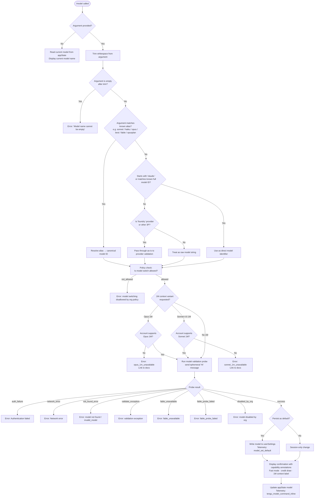

# `/model`

> Analysis basis: CC v2.1.176 bundle.js (AST extraction + Claude interpretation)
> Minimum version: v2.1.176

---

## Overview

The `/model` command allows users to set or switch the active AI model for a Claude Code session. When invoked with a model name or alias, it resolves the requested model through a multi-stage validation and policy-enforcement pipeline, optionally persists the choice as the user's default, and reports the active model along with relevant capability annotations (e.g., fast mode status, credit draw). When invoked without arguments it displays the currently active model.

---

## Registration

| Field | Value |
|---|---|
| type | `local` |
| name | `model` |
| description | Set the AI model for Claude Code |
| argumentHint | `<model>` |
| supportsNonInteractive | `true` |
| module_id | `dJK` |
| load_inline | `true` |
| loc_byte | `13046227` |
| loc_byte_end | `13046401` |
| loc_line | `9179` |
| arbor_handler.name | `o65` |
| arbor_handler.fqn | `claude-2.1.176::o65` |
| arbor_handler.kind | `AsyncFunction` |
| arbor_handler.resolution_path | `module_id` |
| arbor_handler.n_hits | `0` |

Analysis basis: CC v2.1.176 bundle.js:+13046227

---

## Input Branching

Six or more distinct execution paths are present, warranting a Mermaid flowchart.



---

## Behavioral Spec

### Handler Entry — `modelCommandHandler` (bundle ident: `o65`)

The Arbor-resolved handler is `o65`, an `AsyncFunction` reached via the `module_id` resolution path (`dJK`).

Analysis basis: CC v2.1.176 bundle.js:+13015279

```
async function modelCommandHandler(args, context):
    rawInput = args.trim()                         // +13015279

    // No argument: report current model
    if rawInput is empty:
        currentModel = context.getAppState().model
        display(currentModel)
        return

    // Check known aliases list (ZcH)
    if knownAliases.includes(rawInput):            // +13015295
        resolvedModel = resolveAlias(rawInput)
    else:
        resolvedModel = rawInput

    appState = context.getAppState()               // +13015318

    // Build validated model descriptor
    descriptor = buildModelDescriptor(resolvedModel, appState)   // calls eg8 +13015362

    // Check org-level policy allow-list (O_H)
    if policyDeniesModel(resolvedModel):           // +13015382
        emit error "not_allowed"
        return

    // Inline telemetry for non-interactive use
    telemetry("tengu_model_command_inline", ...)   // +13015437

    // Persist / session-only branch (d)
    applyModelToSession(descriptor, appState)      // +13015435

    // Probe validation and UI rendering
    probeAndRender(descriptor, appState)           // calls UM +13015477, ejK +13015532
```

### Alias Resolution — `resolveAlias` (bundle ident: `j1`)

Recognises a fixed set of short aliases and maps them to canonical model identifiers.

Analysis basis: CC v2.1.176 bundle.js:+2279193

Aliases supported (from literals):

| Alias | Meaning |
|---|---|
| `sonnet` | Latest Sonnet variant |
| `haiku` | Latest Haiku variant |
| `opus` | Latest Opus variant |
| `best` | Highest-capability model available to account |
| `fable` | Fable-series model |
| `opusplan` | Opus in plan mode, else Sonnet (bundle.js:+2277727) |

```
function resolveAlias(alias):
    normalized = alias.trim().toLowerCase()
    switch normalized:
        case "sonnet"    → return canonicalSonnet()
        case "haiku"     → return canonicalHaiku()
        case "opus"      → return canonicalOpus()
        case "best"      → return bestAvailableModel()
        case "fable"     → return canonicalFable()
        case "opusplan"  → return opusPlanModel()
        default          → return alias   // pass through unchanged
```

### Model Descriptor Builder — `buildModelDescriptor` (bundle ident: `eg8` → `xk`)

Combines alias expansion, provider detection, tier-default logic, and policy-mapping.

Analysis basis: CC v2.1.176 bundle.js:+12979126

```
function buildModelDescriptor(modelString, appState):
    // Normalise provider context (bedrock / vertex / anthropicAws)
    provider = detectProvider(appState)   // xk → rJ6

    // Resolve short names → full API IDs via name table (j1)
    fullId = expandToFullId(modelString)  // +2279193

    // Build model-availability record (jT → jJ_ / Xq8)
    record = buildAvailabilityRecord(fullId, provider)  // +2268140

    // Apply tier-default pinning logic (Xq8 internal)
    //   "tier default is the admin-mapped value" (+2271462)
    //   "user steering detected — pinning the env-free tier builtin" (+2271584)
    //   "keeping the tier default" (+2271680)
    record = applyTierPinning(record)

    return record
```

### Full Model ID Table

The following canonical model ID strings are embedded in the bundle (function `dz`, bundle idents at listed byte offsets):

| Display Name | Canonical ID | loc_byte |
|---|---|---|
| Fable 5 | `claude-fable-5` | +2275946 |
| Mythos 5 | `claude-mythos-5` | +2276001 |
| Opus 4.8 | `claude-opus-4-8` | +2276058 |
| Opus 4.7 | `claude-opus-4-7` | +2276115 |
| Opus 4.6 | `claude-opus-4-6` | +2276172 |
| Opus 4.5 | `claude-opus-4-5` | +2276229 |
| Opus 4.1 | `claude-opus-4-1` | +2276286 |
| Opus 4 | `claude-opus-4-0` | +2276375 |
| Sonnet 4.6 | `claude-sonnet-4-6` | +2276407 |
| Sonnet 4.5 | `claude-sonnet-4-5` | +2276468 |
| Sonnet 4 | `claude-sonnet-4-0` | +2276563 |
| Haiku 4.5 | `claude-haiku-4-5` | +2276597 |
| Sonnet 3.7 | `claude-3-7-sonnet` | +2276656 |
| Sonnet 3.5 | `claude-3-5-sonnet` | +2276717 |
| Haiku 3.5 | `claude-3-5-haiku` | +2276778 |
| Opus 3 | `claude-3-opus` | +2276837 |
| Sonnet 3 | `claude-3-sonnet` | +2276890 |
| Haiku 3 | `claude-3-haiku` | +2276947 |

Analysis basis: CC v2.1.176 bundle.js:+2275919

### 1M Context Availability Checks — inside `tg8`

Analysis basis: CC v2.1.176 bundle.js:+12976661

```
function check1MContextEligibility(resolvedId, accountCapabilities):
    // Opus 1M path
    if resolvedId matches "[1m]" variant of Opus:
        if not accountCapabilities.opusExtendedContext:
            return Error("opus_1m_unavailable",
                "Opus with 1M context is not available for your account. " +
                "Learn more: https://code.claude.com/docs/en/model-config#extended-context-with-1m")
                // +12976699

    // Sonnet 4.6 1M path
    if resolvedId == "sonnet[1m]" or "sonnet-4-6[1m]":   // +12979060, +12979086
        if not accountCapabilities.sonnetExtendedContext:
            return Error("sonnet_1m_unavailable",
                "Sonnet 4.6 with 1M context is not available for your account. " +
                "Learn more: https://code.claude.com/docs/en/model-config#extended-context-with-1m")
                // +12976918

    return OK
```

### Model Validation Probe — `modelValidationProbe` (bundle ident: `RU6`)

Sends a minimal ephemeral probe message to confirm the model is accessible for the authenticated account.

Analysis basis: CC v2.1.176 bundle.js:+12974480

```
async function modelValidationProbe(modelId, appState):
    trimmedId = modelId.trim()                     // +12974480
    if trimmedId is empty:
        return Error("Model name cannot be empty") // +12974517

    resolvedId = normaliseModelId(trimmedId)       // NK +12974551
    lowered = resolvedId.toLowerCase()             // +12974665

    // Provider-specific bypass (jyH list)
    if lowered in bypassProviders:                 // +12974684
        return OK  // skip probe for 3P providers

    // Cache check (sjK map)
    if validationCache.has(resolvedId):            // +12974786
        return validationCache.get(resolvedId)

    // Send ephemeral probe via API (zU)
    probePayload = {
        role: "user",                              // +12974916
        content: "Hi",                             // +12974950
        cache_control: { type: "ephemeral" }       // +12974975
    }
    result = await sendSideQuery(probePayload, modelId)   // zU +12974831

    // Interpret result
    if result is auth error (401/403):
        return Error("Authentication failed. Please check your API credentials.")  // +12975253
    if result is network error:
        return Error("Network error. Please check your internet connection.")      // +12975355
    if result.type == "not_found_error":           // +12975474
        return Error("invalid_model")              // +12977692
    if result is exception:
        return Error("validate_exception")         // +12977789
    if result is fable-unavailable:
        return Error("fable_unavailable")          // +12977397
    if result is fable-probe-failed:
        return Error("fable_probe_failed")         // +12977417
    if result is disabled_by_org:
        return Error("disabled_by_org")            // +12977146

    validationCache.set(resolvedId, result)        // sjK.set +12974994
    return OK
```

### Model Hash Computation — `computeModelHash` (bundle ident: `UM`)

Generates a short SHA-256 fingerprint of the model string for telemetry/tracking purposes.

Analysis basis: CC v2.1.176 bundle.js:+2529490

```
function computeModelHash(modelString):
    raw = saltString(modelString)     // sG +2529490
    digest = crypto.createHash("sha256")  // Lg1.createHash +2529493
               .update(raw)
               .digest("hex")        // +2529535
    return digest.slice(0, 12)       // first 12 hex chars +2529550
```

### Settings Persistence — `persistModelToSettings` (bundle ident: `ejK` → `rDA` → `CU6` → `zA`)

When the user consents to persisting the model as default, the handler writes to `userSettings` via the config subsystem.

Analysis basis: CC v2.1.176 bundle.js:+12977905

```
async function persistModelToSettings(modelId, persist):
    if persist:
        await writeUserSetting("model", modelId)   // zA → userSettings +1323404
        telemetry("model_set_default")             // +12978533
        suffixMessage = " and saved as your default for new sessions"  // +12978175
    else:
        suffixMessage = " for this session only"   // +12978221
    return suffixMessage
```

### Output Rendering — `renderModelConfirmation` (bundle ident: `oDA`)

Composes the confirmation message displayed after a successful model switch, appending capability annotations.

Analysis basis: CC v2.1.176 bundle.js:+12978576

```
function renderModelConfirmation(modelId, descriptor, persistSuffix):
    line = bold(modelId)

    if descriptor.fastMode:
        line += " · Fast mode ON"        // +12978339
    if descriptor.drawsFromCredits:
        line += " · Draws from usage credits"   // +12978390
    else if not descriptor.fastMode:
        line += " · Fast mode OFF"       // +12978436

    if descriptor.is1MContext:
        line += " (1M context)"          // +2278368

    if descriptor.isManagedSettings:
        line += "Managed settings"       // +12978742

    line += dim(persistSuffix)
    output(line)
```

### Provider Detection — `detectProvider` (bundle ident: `o_`)

Detects whether the session runs against Bedrock, Vertex AI, Anthropic AWS, or direct first-party API.

Analysis basis: CC v2.1.176 bundle.js:+2118081

```
function detectProvider(appState):
    if appState uses "bedrock":       return "bedrock"       // +2118121
    if appState uses "anthropicAws":  return "anthropicAws"  // +2118227
    if appState uses "vertex":        return "vertex"        // +2118329
    return "firstParty"                                      // +2277939
```

---

## State & Side Effects

| Item | Detail |
|---|---|
| Telemetry: `tengu_model_command_inline` | Fired when `/model` is invoked with an inline argument (bundle.js:+13015437) |
| Telemetry: `tengu_feature_ok` | Fired on successful feature gate check (bundle.js:+1018758) |
| Telemetry: `tengu_feature_bad` | Fired on failed feature gate check (bundle.js:+1018825) |
| Telemetry: `tengu_lone_surrogate_sanitized` | Fired when probe response contains lone surrogates (bundle.js:+13848028) |
| Telemetry: `tengu_api_success` | Fired on successful side-query/probe API response (bundle.js:+13848279) |
| Telemetry: `tengu_config_auth_loss_prevented` | Fired when a config write is blocked to prevent auth loss (bundle.js:+3331874) |
| Validation cache | `sjK` — a `Map` keyed by model ID, memoises probe results for the session (bundle.js:+12974786) |
| `appState` changes | Active model field updated after successful validation |
| `userSettings` write | `model` key in `~/.claude/settings.json` written when user elects to persist (bundle.js:+12978580, +1323404) |
| Config auth-loss guard | Refuses to persist settings if a re-read config is missing auth that the cache still holds (bundle.js:+3331746) |
| Sound | None detected in depth-2 traversal |
| Hook registration | None detected in depth-2 traversal |

---

## Version History

| Version | Change |
|---|---|
| v2.1.176 | Initial analysis |

---

## Common Mistakes

1. **Passing a bare version number** (e.g., `/model 4.6`) instead of a full alias or canonical ID. The handler requires either a recognised alias (`sonnet`, `opus`, etc.) or a string starting with `claude-`; bare version numbers are not understood and will likely fail the validation probe.
2. **Requesting a 1M-context variant without account eligibility.** Using `sonnet[1m]` or the Opus 1M variant when the account does not have extended-context access produces an explicit error with a documentation link rather than silently falling back to a standard context window.
3. **Expecting the model to persist across sessions without confirming persistence.** By default a session-only change is applied. Only when the user explicitly requests persistence (or the CLI is invoked in a mode that defaults to persisting) is `userSettings` updated.
4. **Trying to switch models when org policy forbids it.** If the deployment has `model_switch: not_allowed` in policy settings, the command will fail immediately after argument parsing without contacting the API (bundle.js:+12976499, +12976514).
5. **Using `/model` without arguments expecting a model list.** Without arguments the command reports only the *current* active model; it does not enumerate all available models. Use the bootstrap model-discovery endpoint (controlled by `CLAUDE_CODE_ENABLE_GATEWAY_MODEL_DISCOVERY`) for enumeration.

---

## Appendix — Identifier Mapping

> For bundle debugging only. Identifiers change across versions.

| Identifier | Role |
|---|---|
| `o65` | Main `/model` command handler (AsyncFunction) |
| `eg8` | Model descriptor builder dispatcher |
| `xk` | Provider-aware model record constructor |
| `rJ6` | Provider context detector (top-level) |
| `y3` | Provider sub-resolver |
| `j1` | Alias-to-full-ID expander / model name normaliser |
| `jT` | Model availability record factory |
| `jJ_` | Model status field populator (refused/inactive/active states) |
| `Xq8` | Tier-default and policy-mapping resolver |
| `dz` | Canonical model ID table / string normaliser |
| `UM` | Model hash computation (SHA-256, 12-char hex) |
| `sG` | Hash salt helper |
| `nM6` | Crypto primitive wrapper |
| `ejK` | Post-validation persist-and-render coordinator |
| `tg8` | Model validation pipeline orchestrator |
| `NK` | Model string normalisation / display-name resolver |
| `ED6` | Model entry constructor |
| `ZD6` | Model registry object builder |
| `RU6` | Ephemeral validation probe sender |
| `zU` | Side-query API call (sends probe message) |
| `q65` | Probe result classifier |
| `tjK` | Provider-bypass check for validation |
| `f65` | Fable model availability checker |
| `L65` | Sonnet 1M availability checker |
| `kLH` | Extended-context flag resolver |
| `xjH` | Model availability record populator |
| `o_` | Provider type classifier (bedrock / vertex / anthropicAws) |
| `M7` | Provider-specific model ID transformer |
| `ujH` | Array-or-scalar provider config normaliser |
| `L1` | Model status line builder |
| `HAH` | Model record header assembler |
| `o_H` | 1M-context suffix annotator |
| `Jq8` | Model state record finaliser |
| `hiH` | Help-text line appender |
| `c16` | Model list bootstrap fetcher |
| `l1L` | Bootstrap API fetch core |
| `IH` | Feature gate checker (ok/bad telemetry) |
| `C6` | Config write utility |
| `wjq` | Config write validator |
| `N` | Log/display utility with level tagging |
| `P8` | Settings persistence writer |
| `pz` | Settings diff checker |
| `kH` | Config save with auth-loss guard |
| `TH` | String coercion wrapper |
| `rDA` | Model switch result renderer |
| `v4H` | Fast-mode flag accessor |
| `CU6` | Default-model persistence coordinator |
| `zA` | Config file writer (userSettings / projectSettings) |
| `Gf` | Model display name formatter |
| `A6` | String conversion utility |
| `RjH` | Credit-draw annotation helper |
| `q3` | Opus variant string classifier |
| `FEH` | Sonnet variant string classifier |
| `NA` | Output renderer / printer |
| `yO` | Sonnet variant ID resolver |
| `BY` | Message formatter (bold + label) |
| `oDA` | Final confirmation message composer |
| `VhH` | Managed-settings label injector |
| `Tm` | Path joiner for config directories |
| `Hn` | Alias-display name formatter |
| `Kf` | Whitespace / separator strip utility |
| `WN` | Provider inclusion checker |
| `Yq8` | Tier-default resolution helper |
| `ey1` | Policy-settings entry iterator |
| `I8` | Policy-settings field accessor |
| `tnH` | Tool/settings entry mapper |
| `ty1` | Display-name index lookup |
| `vP4` | Tier-default pinning logic |
| `dJ6` | Model ID lower-case normaliser |
| `NP4` | Tier-policy prefix matcher |
| `bH` | Feature-ok telemetry emitter |
| `eH` | Feature-bad telemetry emitter |
| `ds` | Display string assembler |
| `CJ` | First-party model string builder |
| `JyH` | Known-alias inclusion checker |

---

Note: index built via Arbor fallback; some signals (telemetry, literals) may be missing — see arbor-fallback.js.